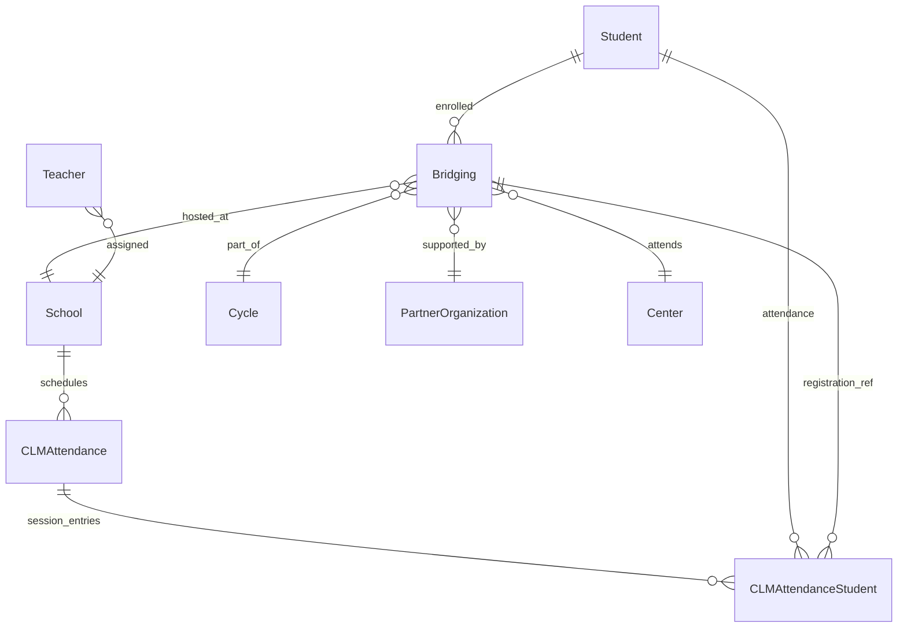
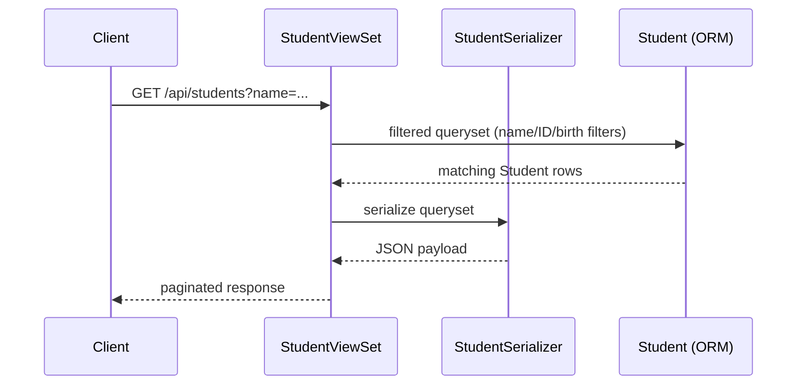

# System architecture and data documentation

This document captures the project structure, technologies, data model relationships, and the main request/response flows for the Student Registration platform.

## Technology stack
- **Django 5.2.7** with Django REST Framework for API endpoints and class-based views.【F:requirements/base.txt†L7-L19】【F:student_registration/students/views.py†L17-L63】
- **PostgreSQL** as the primary database, orchestrated locally and in production through Docker Compose stacks (`local.yml`, `production.yml`).【F:local.yml†L1-L36】【F:production.yml†L1-L44】
- **Celery** with Redis for asynchronous tasks and scheduling; runs alongside the web application in the production stack and records runs via `TaskRunLog`.【F:production.yml†L45-L104】【F:student_registration/taskapp/models.py†L1-L16】
- **Gulp/package.json** manage frontend assets, while `env.example` enumerates environment variables required across deployments.【F:package.json†L1-L26】【F:env.example†L1-L33】

## Repository layout (selected components)
- **Root orchestration and tooling:** `manage.py` (Django entrypoint), `pytest.ini`/`runtests.sh` (testing defaults), `Procfile` (process definitions), and Docker Compose manifests for local/production (`local.yml`, `production.yml`).【F:manage.py†L1-L12】【F:pytest.ini†L1-L23】【F:Procfile†L1-L6】【F:local.yml†L1-L36】
- **Project package:** `student_registration/` holds all Django apps plus middleware utilities such as cache-control, HSTS, X-Frame, lockout, and single-session enforcement.【F:student_registration/cache_control_middleware.py†L1-L67】【F:student_registration/xframe_middleware.py†L1-L38】
- **Documentation:** existing operational guides live in `docs/` (deployment, handover, overview); this document adds an architecture-focused reference.【F:docs/project_overview.md†L1-L93】

## Core Django apps and responsibilities
- **students:** houses shared `Person` data plus `Student` and `Teacher` profiles, training metadata, and attachments.【F:student_registration/students/models.py†L32-L188】【F:student_registration/students/models.py†L336-L456】
- **schools:** manages `School` records with location/capacity details and calendar entries for public holidays.【F:student_registration/schools/models.py†L10-L118】
- **clm:** runs Child Learning Management/Dirasa workflows including assessments, cycles, disability taxonomy, and the `Bridging` enrollment model that ties students to schools and program cycles.【F:student_registration/clm/models.py†L1-L76】【F:student_registration/clm/models.py†L260-L339】【F:student_registration/clm/models.py†L1600-L1655】
- **attendances:** tracks daily class attendance per school/round (`CLMAttendance`) and per-student entries (`CLMAttendanceStudent`) linked to Bridging registrations.【F:student_registration/attendances/models.py†L18-L90】【F:student_registration/attendances/models.py†L92-L147】
- **child:** stores child protection screening information separate from student enrollments (e.g., demographics, caregiver status, ID provenance).【F:student_registration/child/models.py†L1-L86】
- **taskapp:** encapsulates Celery instrumentation such as the `TaskRunLog` audit table.【F:student_registration/taskapp/models.py†L1-L16】

## Key models and relationships
- **Person → Student/Teacher inheritance:** `Student` and `Teacher` extend `Person`, reusing demographic fields (names, birth data, contact info, IDs, nationality).【F:student_registration/students/models.py†L32-L188】【F:student_registration/students/models.py†L336-L456】
- **Teacher staffing:** Teachers point to a `School`, `CLMRound`, training topics, and attachment slots for credentials; subject coverage and registration levels are stored as arrays.【F:student_registration/students/models.py†L360-L456】
- **School geography:** Schools carry CERD numbers, contact info, GPS coordinates, grade coverage, enrollment counts, and location foreign keys (governorate/district/cadaster).【F:student_registration/schools/models.py†L34-L118】
- **Program enrollment (`Bridging`):** Each Bridging record binds a `Student` to a `School`, `Cycle`, and partner center with additional program metadata (language, residence type, referral sources, learning outcomes).【F:student_registration/clm/models.py†L260-L339】【F:student_registration/clm/models.py†L1600-L1655】
- **Attendance:** `CLMAttendance` logs day-level sessions per school and registration level; `CLMAttendanceStudent` links students/Bridging registrations to those sessions with attendance/absence reasons.【F:student_registration/attendances/models.py†L18-L90】【F:student_registration/attendances/models.py†L92-L147】
- **Child screening:** `Child` captures non-formal education intake attributes such as gender, marital status, nationality, ID type, and care arrangements for protection workflows.【F:student_registration/child/models.py†L1-L86】

### Entity-relationship diagram (Mermaid)

## Views, serializers, and request flows
- **StudentViewSet** exposes read-only list/detail endpoints with extensive query filters (barcode, ID, name fragments, birthdate components, gender).【F:student_registration/students/views.py†L17-L63】
- **StudentSearchViewSet** adds create/update while supporting search by free-text terms and school context parameters; uses the same `StudentSerializer`.【F:student_registration/students/views.py†L65-L111】【F:student_registration/students/serializers.py†L1-L46】
- **TeacherViewSet** (not shown above) provides similar list/retrieve semantics for teacher records via `TeacherSerializer`.【F:student_registration/students/views.py†L309-L353】【F:student_registration/students/serializers.py†L48-L83】
- **Autocomplete helper:** `StudentAutocomplete` backs Select2 widgets, restricting results to authenticated users and returning related nationality/ID metadata.【F:student_registration/students/views.py†L113-L162】

### Object interaction diagram: student search lifecycle

## Background processing
- Celery workers and beat schedulers run alongside the web app (see `production.yml`), using Redis as a broker. Task outcomes can be audited via `TaskRunLog`, which records IDs, names, statuses, and timestamps for each task run.【F:production.yml†L45-L104】【F:student_registration/taskapp/models.py†L1-L16】

## Data storage and files
- File uploads (e.g., teacher attachments) are stored under `uploads/teacher` with type metadata. Student and child records include optional ID document references and structured demographic fields suitable for reporting/export flows.【F:student_registration/students/models.py†L418-L456】【F:student_registration/child/models.py†L64-L86】

## How to extend
1. **Add new models:** define them within the appropriate app and create migrations via `python manage.py makemigrations`. Keep foreign key relationships aligned with existing enrollment/attendance structures.
2. **Expose APIs:** pair new serializers with DRF viewsets similar to `StudentViewSet` and register them in the corresponding `urls.py`.
3. **Document changes:** update this file and `docs/project_overview.md` with any new architectural decisions so deployers can follow the impact on data and services.
