# BMA-NFE UI/UX Review

_02 September 2026 · branch `main` @ `86152bb` · 424 verified findings · 176 screens captured across 5 roles, 2 languages, 3 viewports_
## Executive summary
The Bootstrap 5 redesign gave BMA a clean, modern shell, a sensible three-step registration wizard and a good centre profile, but the review found that the product is not yet safe for its daily users. Four kinds of problems dominate. First, crashes: any user without the right group gets a server-error page instead of 'not allowed' on 66 protected views, the schools, students and legacy CLM modules crash on load, the ALP dashboard charts never render, and several service and attendance actions fail silently. Second, data loss and corruption in the registration wizard: the formal-education student ID can never be saved and is wiped by a dead selector, the edit page opens with false 'Registration Failed' errors, the duplicate check never resolves, and a 30-minute idle logout discards forms without warning. Third, Arabic users, the majority of field staff, see roughly 80 English field labels on every form because translations are frozen at import time, and no Arabic typeface is loaded. Fourth, phones and small laptops: the menu button is commented out so navigation is unreachable below 992px, and key buttons and columns fall off-screen. Around these sit a long tail of misleading numbers (a 100% dropout KPI, a disability count that equals the total, literal 'None' in profiles), three duplicated 'home' pages, and a front-end that loads three jQuery and two Bootstrap versions from a dozen CDNs.

**Overall assessment.** Visually the redesign succeeded: the shell, cards, tables and the wizard look professional on a desktop in English, and several reviewers praised the centre profile, async exports and RTL mirroring of the chrome. Functionally, the redesign was applied to the surface while the underlying flows kept their old defects and gained new ones from copy-paste (the ALP wizard is a duplicate of the MSCC one, 17 legacy service forms coexist with 4 redesigned ones, two documentation systems and two dashboards overlap). The biggest risks, in order: (1) crashes and permission handling that turn ordinary mistakes into error pages, (2) silent data loss in the flows that create child records, (3) an effectively English-only product for Arabic staff, (4) an unusable mobile experience for teachers. The next release should be a stabilisation release: replace the broken permission mixin, fix the wizard's data bugs, switch forms to lazy translation and add an Arabic font, restore mobile navigation, and either delete or repair the dead modules. Only after that is it worth investing in the dashboards, pivot builder and bulk actions the proposal envisions.
## At a glance
| Severity | Count |
|---|---|
| critical | 36 |
| high | 101 |
| medium | 193 |
| low | 94 |

| Module | Findings |
|---|---|
| Global shell & navigation | 70 |
| MSCC registration wizard | 57 |
| MSCC service forms | 51 |
| Dashboards & analytics | 42 |
| Attendance (MSCC & ALP) | 42 |
| MSCC beneficiary list & profile | 38 |
| ALP (schools) module | 37 |
| MSCC child profile | 28 |
| Authentication | 13 |
| Centers, schools, students & legacy CLM | 10 |
| Landing pages | 9 |
| MSCC teachers | 6 |
| Schools app | 6 |
| Documentation & wiki | 6 |
| Legacy CLM bridging | 5 |
| Users | 4 |

### Module scorecards

| Module | Score | Verdict | Key findings |
|---|---|---|---|
| Schools app | 1/5 | List and edit crash with server errors, the add form renders all four steps overlapping, and the club/meeting/visit pages are orphaned. | lead-review-20, forms-ux-4, secondary-modules-17, secondary-modules-14 |
| Students / teachers app | 1/5 | Both pages crash; the module is dead code that is still routed. | lead-review-20 |
| Legacy CLM bridging | 1/5 | Every bridging page returns a server error, the hub page is an unstyled link list on a Bootstrap 3 stack, and the dashboard is a stub. | lead-review-20, secondary-modules-8, technical-health-22 |
| MSCC registration wizard | 2/5 | The right structure, but the flow loses or corrupts data: an unsaveable FE student ID, false errors on edit, a duplicate check that never finishes, no draft, and English labels for Arabic users. | mscc-registration-1, mscc-registration-2, mscc-registration-3, mscc-registration-5, mscc-registration-6, mscc-registration-7, mscc-registration-8, mscc-registration-9 |
| MSCC child profile | 2/5 | The header and tabs are well laid out, but blank values render as 'None', the status badge reads 'NONE', the primary key is shown as the ID, and most services cannot be added from the profile at all. | mscc-list-profile-1, mscc-list-profile-9, content-copy-2, mscc-list-profile-4, mscc-list-profile-10, mscc-list-profile-12, mscc-list-profile-8, navigation-roles-15 |
| MSCC service forms | 2/5 | Twenty-plus forms in two visual generations; the legacy ones render both wizard steps on top of each other, some grading forms have no Save button, sixteen are reachable only by URL, and Arabic questions stay English. | mscc-services-1, mscc-services-2, mscc-services-3, mscc-services-4, mscc-services-5, mscc-services-6, mscc-services-10, mscc-services-12 |
| Attendance (MSCC & ALP) | 2/5 | The daily teacher task is fragile: 'Yes'/'No' casing mismatches break radios and counts, the save endpoint has no auth check, failures are only logged to the console, past days can be silently overwritten and the month view mixes years. | attendance-1, attendance-2, attendance-3, attendance-4, attendance-7, attendance-8, attendance-9, attendance-29 |
| Global shell & navigation | 3/5 | A good desktop shell undermined by the 500-instead-of-403 bug, no mobile navigation, an overflowing sidebar and a chaotic asset stack. | lead-review-1, lead-review-3, dashboards-6, lead-review-6, lead-review-7, lead-review-26, shell-auth-landing-5, lead-review-4 |
| Authentication | 3/5 | A tidy sign-in card that hides the real error message, offers no password reset link and leaves self-signup open. | shell-auth-landing-1, shell-auth-landing-2, shell-auth-landing-3, shell-auth-landing-4, shell-auth-landing-6, design-system-6, lead-review-2 |
| Landing pages | 3/5 | Attractive but decorative: tiles repeat the sidebar, KPIs are sector-wide for every role, administrators land on the wrong programme, and two links are dead. | lead-review-2, shell-auth-landing-8, shell-auth-landing-9, navigation-roles-1, lead-review-27, shell-auth-landing-23 |
| MSCC beneficiary list & profile | 3/5 | Works for a desktop registrar, but the page is titled with the login name, names are not links, there is no free-text search, the table forces a 1200px width and delete is an unguarded GET. | content-copy-3, mscc-list-profile-5, mscc-list-profile-6, mscc-list-profile-7, mscc-list-profile-2, technical-health-2, responsive-6, mscc-list-profile-16 |
| MSCC teachers | 3/5 | Functional but heavy: a long unpaginated form, a false error banner on every edit, a pre-selected assignment, a free-text birth date and English labels in Arabic. | secondary-modules-6, secondary-modules-7, forms-ux-12, forms-ux-19, forms-ux-20, secondary-modules-16 |
| Dashboards & analytics | 3/5 | Good-looking charts that mislead: a 100% dropout KPI, all-zero analytics from default filters, blank ALP charts (404 script), a pivot builder with no guidance, and no role scoping on several dashboards. | lead-review-9, dashboards-3, dashboards-1, dashboards-2, lead-review-12, dashboards-9, navigation-roles-6, dashboards-8 |
| ALP (schools) module | 3/5 | A copy of MSCC with drift: the grading page shows only a registration dropdown, the teacher list has no edit controls, delete pages are unstyled, raw ids and icon-only actions in the list, ALP nav labels untranslated. | alp-1, dashboards-1, alp-5, alp-3, alp-2, alp-6, alp-7, alp-10 |
| Centers, schools, students & legacy CLM | 3/5 | The centre profile is the best-designed page in the app, but the form is broken (Add shows Edit, cascading selects fail on a jQuery error) and the disability figure is wrong by construction. | design-system-4, lead-review-19, lead-review-18, forms-ux-13, secondary-modules-11, secondary-modules-13, secondary-modules-7 |
| Documentation & wiki | 3/5 | Two duplicate documentation systems with inconsistent gating: the developer wiki is open to everyone while the guide is superuser-only, and the menu numbering skips guides. | dashboards-5, dashboards-4, navigation-roles-18, shell-auth-landing-29 |
| Users | 3/5 | A basic profile that shows 'None' for blank fields, labels the administrator 'General User', and stores the language preference only in a cookie. | shell-auth-landing-24, content-copy-36, rtl-i18n-22 |

## What works well
- The Bootstrap 5 shell is clean and consistent on desktop: sidebar grouping (Operations / Analytics / Documentation), a quiet topbar, cards with light shadows and one primary blue.
- Right-to-left mirroring of the shell, tables and forms works out of the box thanks to bootstrap.rtl and logical CSS properties; the Arabic layout itself is sound even where the strings are not.
- The three-step registration wizard with a progress bar, section headings, example placeholders and a potential-duplicates panel is the right shape for an 80-field form, and it collapses to one column on phones.
- The centre profile page (tabs, facts column, figure cards with male/female splits, breadcrumb and header actions) is a strong pattern the rest of the app should copy.
- Asynchronous exports with a notification bell and done/pending/failed states avoid blocking the browser on long reports.
- Beneficiary lists use sticky headers, sortable columns, an offcanvas filter panel with active-filter chips and modern pagination.
- The wellbeing and teacher dashboards use consistent section headers, info tooltips and a reusable filter offcanvas.
- An in-app end-user manual exists and is readable; the documentation covers roles, flows and troubleshooting.
- Global success/error modals and a processing overlay give a consistent vocabulary for feedback, even if not yet wired everywhere.

## Themes & findings

### P0 — Crashes and dead ends that block whole roles and modules

A Django 5 incompatibility in the permission mixin turns every 'wrong group' request into a 500; three modules (schools, students, CLM) crash on load from stale imports, removed fields and a missing template; the ALP dashboard's chart script 404s; the export-history page fails on timezone handling; a grading view does a bare .get(); dead links sit on the landing pages and the notification bell; DEBUG=True means raw technical pages are what users actually see.

**Why it matters.** Field staff cannot distinguish a permission problem from a broken system, and administrators cannot trust that routed pages work. Crash pages also leak internals.

#### `lead-review-1` · **CRITICAL** · Users without the required group get a 500 crash instead of a 'not allowed' page on every GroupRequiredMixin-protected view (django-braces incompatible with Django 5)

- **Where:** `every GroupRequiredMixin-protected view (e.g. /mscc/list/, /mscc/child-add/, /mscc/attendance/)` · **Module:** Global shell & navigation · **Category:** Roles & access · **Effort:** S
- **What happens:** An ALP-school user (or any account missing a module group, including a freshly self-registered one) who opens an MSCC page sees the Django server-error page. django-braces 1.17 calls self.handle_no_permission(request) with an argument, but Django 5's AccessMixin.handle_no_permission() takes none, so the permission check itself throws TypeError before any 403 can be rendered.
- **Who it hurts:** Every wrong-role navigation (a school user tapping a link meant for centers, a new account, an expired group) ends in a crash page with no way back; support cannot distinguish crashes from permission problems.
- **Recommendation:** Replace braces' GroupRequiredMixin with a small project mixin built on django.contrib.auth.mixins.UserPassesTestMixin (raise_exception=True) that renders a branded 403 page with the sidebar and a 'go to my home' link; add a regression test asserting a user without the group gets 403, not 500.
- **Evidence:** screenshot alp_user_mscc_list_forbidden__alp_en_desktop.png; venv .../braces/views/_access.py:60 def handle_no_permission(self, request), :108/:419 self.handle_no_permission(request); django/contrib/auth/mixins.py:46 def handle_no_permission(self); grep 'GroupRequiredMixin' across student_registration/*.py = 68 occurrences (3 are the class/import lines). (screens: alp_user_mscc_list_forbidden__alp_en_desktop.png)
- **Also reported as:** technical-health-1, mscc-list-profile-3, alp-11

#### `navigation-roles-1` · **CRITICAL** · "New Registration" tile is shown to every MSCC role but crashes for Partner/UNICEF users

- **Where:** `/landing-page/ quick actions -> /mscc/child-add/` · **Module:** Landing pages · **Category:** Roles & access · **Effort:** S
- **What happens:** The landing page and the MSCC dashboard both show an unconditional "New Registration" quick-action tile linking straight to mscc:child_add. It is never hidden for MSCC_PARTNER or MSCC_UNICEF users (screenshots show it for Karim Saab/MSCC_PARTNER and Rana Haddad/MSCC_UNICEF), even though the target view only grants access to MSCC and MSCC_CENTER. A partner or UNICEF user who takes the app at its word and clicks the primary CTA on their own landing page gets the already-documented AccessMixin.handle_no_permission TypeError 500 crash page instead of the registration form.
- **Who it hurts:** Every MSCC_PARTNER and MSCC_UNICEF user (every partner org and every UNICEF analyst) hits a server crash the first time they use the most prominent button on their own home screen.
- **Recommendation:** Wrap both tiles in `` and show a disabled/explanatory state for roles without add rights, and separately fix GroupRequiredMixin so it degrades to a real 403.
- **Evidence:** templates/landing_page.html:50; templates/mscc/dashboard.html:53; mscc/views.py:480-486 `group_required = [u"MSCC", u"MSCC_CENTER"]`; screenshots partner_landing__partner_en_desktop__fold.png, unicef_dashboard__unicef_en_desktop__fold.png both show the tile rendered for these roles. (screens: partner_landing__partner_en_desktop__fold.png, unicef_dashboard__unicef_en_desktop__fold.png)

#### `lead-review-20` · **CRITICAL** · Schools, students-teacher and legacy CLM list/edit pages crash with ImportError/AttributeError/ImproperlyConfigured/TemplateDoesNotExist, yet the URLs remain live

- **Where:** `/schools/school-list/, /schools/school-edit/<pk>/, /students/teacher-list/, /students/teacher-add/, /clm/*` · **Module:** Schools app · **Category:** Broken / crash · **Effort:** M
- **What happens:** school-list, teacher-list and bridging-list fail with ImportError (is_allowed_create no longer exists in clm/utils.py); teacher-add and bridging-add fail on PartnerOrganization.is_Kayany; school-edit and all bridging edit/assessment pages fail because their DRF serializers declare fields (receive_supplies, new_registry) that the models no longer have; /clm/attendance/ has no template. None of these pages is linked from the sidebar, but the URLs are live.
- **Who it hurts:** Anyone following an old bookmark, a documentation link or the club/meeting/health-visit pages of a school hits a server error; dead code confuses maintainers.
- **Recommendation:** Decide per module: retire CLM/students-teacher pages if abandoned (remove URLs, templates, JS, and the util_tags is_allowed_create filter), or fix them - add is_allowed_create to clm/utils.py (or point the filter at schools.utils/students.utils), add is_Kayany to PartnerOrganization or remove the references, drop receive_supplies/new_registry from the DRF serializers' field lists, and add clm/attendance.html. Add a URL smoke test that GETs every named route.
- **Evidence:** clm/templatetags/util_tags.py:342-349 (root cause of the ImportError, more precise than views.py-level imports); templates/schools/school_list.html:48, templates/students/teacher_list.html, templates/clm/bridging_list.html (all load util_tags and call is_allowed_create); students/forms.py:293-295, clm/bridging_forms.py:752-756; schools/models.py:783-820 (no is_Kayany field); schools/serializers.py:49; clm/serializers.py:196; clm/models.py:1542 (no new_registry field); clm/attendance_views.py:26 vs templates/clm/ (no attendance.html, only attendance_children.html); screenshot sch_school_list__admin_en_desktop__fold.png confirms the exact traceback. (screens: sch_school_list__admin_en_desktop__fold.png)
- **Also reported as:** secondary-modules-1, secondary-modules-2, secondary-modules-3, technical-health-3, technical-health-4, technical-health-5, technical-health-6, technical-health-7, design-system-3

#### `secondary-modules-5` · **CRITICAL** · School Add/Edit form renders as an unreadable, overlapping wall of text -- an orphaned SmartWizard whose step-hiding JS/CSS bundle was never wired up

- **Where:** `/schools/school-add/` · **Module:** Schools app · **Category:** Broken / crash · **Effort:** L
- **What happens:** Unlike every crash above, this page loads successfully but is visually destroyed: numbered field badges (1, 2, 3...) float in the middle of unrelated sentences, checkbox groups (Grade levels, Provided Services, days-of-week) overlap adjacent field labels, and the Save/Reset buttons appear stranded halfway down the page instead of at the bottom. The form is built as a 4-step 'SmartWizard' (Fieldsets with ids #step-1..#step-4, a <ul class='forms-wizard'> with <em> step badges) styled for a legacy admin theme whose CSS bundle (static/css/main.87c0748b313a1dda75f5.css) and step-switching plugin (static/js/smartwizard-safe.js) both still exist on disk but are never referenced by any template -- grep confirms zero templates load either file. With no JS to hide steps 2-4 and only a fixed 'height:400px; ' rule on each #step-N div (no overflow control), all four steps' fields render simultaneously, stacked, and any step taller than 400px visually bleeds into the next.
- **Who it hurts:** Nobody can reliably read or fill out the School registration form -- it is the single worst-looking, hardest-to-use screen in the whole scope, and it is the only way to add a school (school-edit is separately 500).
- **Recommendation:** Rebuild school_create_form.html/school_edit_form.html using the same crispy Fieldset/Div grid pattern already used successfully in locations/forms.py's CenterForm (plain stacked Fieldsets, no step-hiding JS dependency), dropping the orphaned SmartWizard markup and numbered badge HTML entirely.
- **Evidence:** templates/schools/school_create_form.html:64-100 (smartwizard markup, #next-btn22/#next-page/#prev-btn22); schools/forms.py:247 ('1', repeated per field); static/css/base.css:102-104 (fixed height:400px, no overflow, applies to all 4 #step-N divs); confirmed via grep that no template references static/css/main.87c0748b313a1dda75f5.css or static/js/smartwizard-safe.js. Screenshot sch_school_add__admin_en_desktop.png shows the overlap directly. (screens: sch_school_add__admin_en_desktop.png)

#### `secondary-modules-8` · **HIGH** · CLM module's home page is 4 unstyled plain hyperlinks, two of which lead to already-broken 500 pages

- **Where:** `/clm/bridging-page/` · **Module:** Legacy CLM bridging · **Category:** Broken / crash · **Effort:** M
- **What happens:** /clm/bridging-page/ -- the entry point for the whole CLM/Bridging module -- renders as four plain blue hyperlinks ('Dirasa Registration', 'Attendance', 'Schools', 'Teachers') sitting in an otherwise empty white card on an empty page, with no icons, cards, description or visual structure at all. It was built as a 4-tile icon dashboard (widget-chart/icon-wrapper markup with colored circles and lnr-* icons) for the same missing legacy theme CSS as the School form (see related finding) -- none of it renders. Of the four links, 'Schools' goes to /schools/school-list/ and 'Teachers' goes to /students/teacher-list/, both of which 500 (see separate findings).
- **Who it hurts:** A user arriving at the CLM module's home screen sees an unstyled, unbranded page and a coin-flip chance that any given link on it actually works -- this is the first impression of the entire legacy module.
- **Recommendation:** Rebuild templates/clm/index.html with redesign.css card/grid components matching the Centers/Teachers styling once schools:school_list and students:teacher_list are fixed, or remove this hub page and its downstream links until those modules work.
- **Evidence:** templates/clm/index.html:27-86 confirmed; href targets at lines 37, 50, 63, 75 confirmed. clm_bridging_page__admin_en_desktop__fold.png shows exactly 4 plain underlined links, no icons/cards/visual structure, on an otherwise-empty page. (screens: clm_bridging_page__admin_en_desktop.png, clm_bridging_page__admin_en_desktop__fold.png)

#### `secondary-modules-9` · **HIGH** · Schools, Students/Teachers and CLM modules have no sidebar entry points, reachable only by typing the URL

- **Where:** `sidebar navigation (all pages)` · **Module:** Schools app · **Category:** Navigation & IA · **Effort:** M
- **What happens:** templates/_sidebar_links.html defines every link shown to MSCC-group users (Home, Dashboard, Registration, Attendance, Centers, Teachers, Pivot Builder, Learning Outcome, Teacher Dashboard, Attendance Heatmap, Centers Map, User Guide, Wiki) and every ALP_SCHOOL-group link, but contains no href to any 'schools:', 'students:' or 'clm:' URL anywhere in the file. These three app namespaces, despite having dozens of templates, forms, views and (broken) URLs, are completely absent from the navigation UI for every role captured, including the superuser/admin account.
- **Who it hurts:** Even if all the crashes above were fixed, no user could discover Schools, Students, or CLM through normal navigation -- these represent a large fraction of the codebase (schools app, students app, clm app, dozens of templates) that is effectively dead weight in the shipped product today.
- **Recommendation:** Decide product intent: add sidebar entries for the schools:, students:, clm: URL namespaces gated by the appropriate group (mirroring the existing MSCC/ALP pattern in templates/_sidebar_links.html) if these modules are meant to be live, or remove the apps/templates/URLs if deprecated.
- **Evidence:** templates/_sidebar_links.html confirmed: 0 occurrences of 'schools:', 'students:', or 'clm:' among all  calls. loc_center_list__admin_en_desktop__fold.png and clm_bridging_page__admin_en_desktop__fold.png sidebars confirmed to omit all three modules. (screens: loc_center_list__admin_en_desktop__fold.png, clm_bridging_page__admin_en_desktop__fold.png)

#### `secondary-modules-17` · **MEDIUM** · Club/Meeting/Health-Visit/Community-Initiative pages work but are orphaned: their only entry point is broken

- **Where:** `/schools/club-list/1/, /schools/meeting-list/1/, /schools/health-visit-list/1/, /schools/community-initiative-list/1/` · **Module:** Schools app · **Category:** Navigation & IA · **Effort:** M
- **What happens:** These four sub-entity modules are each simple, functional pages when hit directly at a URL like /schools/club-list/1/ -- but that '1' is a School's primary key, and the only place a user could normally discover it (School List -> a school's profile) 500s. templates/schools/profile.html, which would presumably link out to these tabs, is not referenced by any view at all (0 matches). Within the sub-entity pages themselves there is also no 'back to school' link, only 'Back to list' (i.e. back to the sub-entity's own list).
- **Who it hurts:** Even once the crashes are fixed, staff have no way to navigate into a school's clubs/meetings/health visits/community initiatives through the UI -- these are only reachable by someone hand-constructing a URL with a known school ID.
- **Recommendation:** Build (or re-link) a School Profile page that lists these four sub-entities per school with working links, and add a 'Back to School' breadcrumb/link on each sub-entity page.
- **Evidence:** grep confirms 'schools/profile.html' is never passed to render()/get_context in schools/views.py. templates/schools/club_form.html:47,75 only link to 'schools:club_list' (itself), no link back to a school profile/detail page. Combined with the school-list 500 finding, there is no discoverable path from the app UI into any of these four pages. (screens: sch_club_list__admin_en_desktop.png, sch_meeting_list__admin_en_desktop.png, sch_health_visit_list__admin_en_desktop.png, sch_community_initiative_list__admin_en_desktop.png)

#### `technical-health-9` · **CRITICAL** · Export history page 500s on every user: localtime() called on naive datetimes because USE_TZ=False

- **Where:** `/backends/export-history-list/ (topbar 'View All History')` · **Module:** Global shell & navigation · **Category:** Broken / crash · **Effort:** S
- **What happens:** Clicking the topbar bell/History control's 'View All History' link returns a server error instead of the export history list.
- **Who it hurts:** No user can ever see their export job history — a fully broken feature reachable from the global topbar on every page.
- **Recommendation:** Remove the localtime() call in backends/views.py:32 and format export.created directly (it's already in the server's local time since USE_TZ=False), or set USE_TZ=True project-wide and audit other naive-datetime call sites if broader timezone correctness is wanted.
- **Evidence:** backends/views.py:32 'timestamp = localtime(export.created)...'; config/settings/base.py:201 'USE_TZ = False'. (screens: mscc_export_history__admin_en_desktop.png)
- **Also reported as:** lead-review-21, shell-auth-landing-17, navigation-roles-19

#### `technical-health-2` · **CRITICAL** · Live  tags inside an HTML comment crash the beneficiary list once a record has a 'type' set

- **Where:** `/mscc/list/` · **Module:** MSCC beneficiary list & profile · **Category:** Broken / crash · **Effort:** S
- **What happens:** The list page's row-actions dropdown crashes with NoReverseMatch as soon as a Registration row has its 'type' field populated, because Django template tags inside an HTML `<!-- -->` comment are still parsed and executed server-side — HTML comments only hide markup from the browser, not from the Django template engine.
- **Who it hurts:** Any center/partner/UNICEF staff viewing the beneficiary list once a single child record has an education 'type' assigned gets a full page crash instead of the list, blocking their core daily task.
- **Recommendation:** Replace the HTML <!-- --> wrapping in templates/django_tables2/mscc/action_column.html (lines 29-69) with Django's , which the template engine actually skips, or delete the dead Services & Assessments block outright if it's no longer wanted.
- **Evidence:** templates/django_tables2/mscc/action_column.html:52-59 (line 55 passes record.id, result_es.id, record.type — 3 args); mscc/urls.py:102-106 service_education_edit only captures (registry, pk) — 2 args -> NoReverseMatch.
- **Also reported as:** lead-review-23

#### `mscc-services-31` · **MEDIUM** · [known] Unknown pk on school-grading gives a 500; the same bare .get() pattern is in all 13 edit views

- **Where:** `/mscc/services/education-school-grading/<registry>/<type>/<pk>/ and every *-edit route` · **Module:** MSCC service forms · **Category:** Broken / crash · **Effort:** S
- **What happens:** Beyond the known school-grading crash, every edit view fetches the record with `Model.objects.get(id=pk)` without 404 handling, and the school-grading GET path runs the lookup even when no pk is supplied. A stale bookmark or a deleted record yields a server error page instead of a friendly 'record not found'.
- **Who it hurts:** Anyone following an old link or opening a record another user deleted.
- **Recommendation:** Use get_object_or_404 and also verify the record belongs to the `registry` in the URL (currently unchecked, so /edit/<registry>/<pk>/ can open another child's record).
- **Evidence:** education_view.py:303-305 `EducationProgrammeAssessment.objects.get(id=instance)` unconditionally; same bare `.get()` in services_view.py:43, 80, 118, 155, 192, 229, 266, 304, 342, 379, 416, 470, 509 and education_view.py:51, 90, 128, 165, 207, 256; views.py:776 for Referral. (screens: svc_school_grading__admin_en_desktop.png)
- **Also reported as:** technical-health-16

#### `navigation-roles-9` · **HIGH** · DEBUG=True means the app's branded 404/403/500 templates never render -- users see raw technical pages

- **Where:** `/404/, arbitrary bad URL` · **Module:** Global shell & navigation · **Category:** Broken / crash · **Effort:** S
- **What happens:** The 404 screenshot is Django's own DEBUG-mode technical response: a full dump of every URLconf pattern in the project (31 top-level prefixes including internal app names like backends, api/schema, api/docs), not the app's own templates/404.html (which extends base.html and would show the branded shell with a way back). Django's page_not_found() view unconditionally serves the technical page whenever settings.DEBUG is True, regardless of whether a custom 404.html exists -- so that template is effectively dead code in this deployment. The same root cause is why the already-known /mscc/list/ TypeError renders as a full stack trace with local file-system paths instead of a 500 page.
- **Who it hurts:** Any user who mistypes a URL or hits an error sees Django internals (full route table, file paths, Python version) instead of a friendly, navigable page -- a real error-recovery dead end and a mild information-disclosure issue if this setting is ever mirrored outside local development.
- **Recommendation:** Set DEBUG=False for any shared/staging/production environment (config/settings/base.py already defaults to False via env var; local.py's default of True should not be used outside local dev) so the app's own 404.html/500.html render.
- **Evidence:** screenshot error_404__admin_en_desktop.png; config/settings/local.py:15 `DEBUG = env.bool('DJANGO_DEBUG', default=True)`; config/settings/base.py:135 `DEBUG = env.bool('DJANGO_DEBUG', False)`; templates/404.html:1 ``. (screens: error_404__admin_en_desktop.png, alp_user_mscc_list_forbidden__alp_en_desktop.png)

#### `shell-auth-landing-13` · **MEDIUM** · No 403.html template: permission-denied users get a bare Times-New-Roman '403 Forbidden' page with no navigation or branding

- **Where:** `any 403 response` · **Module:** Global shell & navigation · **Category:** Feedback & states · **Effort:** S
- **What happens:** The only 403 template is 403_csrf.html (CSRF failures). A normal PermissionDenied renders Django's built-in one-line page outside the app shell, with no explanation of which role is needed and no way back. Today most permission failures surface as 500s instead (known GroupRequiredMixin bug), so once that is fixed every partner/UNICEF user hitting a create/edit page will land here.
- **Who it hurts:** Partner/UNICEF/read-only users whenever they click an action they lack rights for.
- **Recommendation:** Add templates/403.html extending base.html with the error.html design ('You do not have access to this page', role hint, Return Home / Contact Admin), and wire error.html as the response for users missing center/partner assignment.
- **Evidence:** error_403 screenshot (plain '403 Forbidden', fontFamily 'Times New Roman', dir null per manifest audit); templates directory has 403_csrf.html and error.html but no 403.html; error.html is not referenced by any view (grep for 'error.html' in *.py returns nothing). (screens: error_403__admin_en_desktop.png)
- **Also reported as:** navigation-roles-23, content-copy-24

#### `shell-auth-landing-14` · **MEDIUM** · 404/500 pages offer no way back, use informal copy ('Ooops!!! 500') and the 500 page depends on the same base template/database that just failed

- **Where:** `/404/ and /500/` · **Module:** Global shell & navigation · **Category:** Feedback & states · **Effort:** S
- **What happens:** The custom 404.html is a bare h1 + one sentence with no link; 500.html shows 'Ooops!!! 500 / Looks like something went wrong!' and claims errors are tracked automatically, but presents no Home link, no logo and no sidebar (rendered without request context, as the screenshot shows: footer only). Because 500.html extends base.html, which queries export history and groups, a database outage will make the error page itself fail and fall back to Django's plain 'Server Error (500)'. (The 404 capture shows the DEBUG technical page because the review environment ran with DEBUG=True; in production the sparse 404.html would render.)
- **Who it hurts:** Users hitting a broken link or one of the 16 known 500 routes are stranded; support cannot get a correlation id from them.
- **Recommendation:** Design both pages on the error.html card pattern with logo, plain-language title, 'Go to Home' and 'Back' buttons and a support contact; make 500.html standalone (no base.html, inline CSS) and include a request id if Sentry is enabled. Ensure DJANGO_DEBUG=False in deployed environments.
- **Evidence:** templates/404.html:8-12, templates/500.html:8-14 (extends base.html; base.html:110 runs ), error_500 screenshot (no navigation, footer only), error_404 screenshot (technical page, DEBUG=True notice). (screens: error_404__admin_en_desktop.png, error_500__admin_en_desktop.png)

#### `design-system-31` · **LOW** · 500.html was never redesigned — plain, unbranded 'Ooops!!! 500' text

- **Where:** `/500 error page` · **Module:** Global shell & navigation · **Category:** Visual consistency · **Effort:** S
- **What happens:** Unlike every other page in the app (including the well-branded login/landing pages), templates/500.html is just an `<h1>`/`<h3>`/`
` with no card, no logo, and no link back into the app — the one page a real user is guaranteed to hit during the crashes documented elsewhere in this review looks like unfinished scaffolding.
- **Who it hurts:** Minor on its own, but compounds the bad impression left by the several genuine 500 crashes found elsewhere in this app (Schools list, Teacher list, CLM Bridging, several service forms).
- **Recommendation:** Give 500.html the same card treatment as the login/404 pages, with a 'Back to Home' button.
- **Evidence:** student_registration/templates/500.html:1-17 — bare `<h1>Ooops!!! 500</h1>...`, no styling beyond what base.html provides for plain text

#### `content-copy-22` · **MEDIUM** · Custom server-error page copy is overly casual and offers no actual way to get help

- **Where:** `/500/` · **Module:** Global shell & navigation · **Category:** Content & copy · **Effort:** S
- **What happens:** The branded 500 page reads "Ooops!!! 500" / "Looks like something went wrong!" / "We track these errors automatically, but if the problem persists feel free to contact us." — the triple exclamation mark is an unusually informal tone for a UNICEF/MEHE child-services system, and "contact us" is plain text, not a link, mailto, or phone number — so the promised way to get help doesn't actually exist on the page.
- **Who it hurts:** Every user who hits a crash (and there are many reproducible 500s in this app per the known-issues list) lands on a dead end with an unhelpful, tonally mismatched message and no recovery action.
- **Recommendation:** Tone down the copy, add a "Return to Home" button/link, and either hyperlink "contact us" to a real mailto/support address or remove the false promise.
- **Evidence:** templates/500.html:9,13 — `<h1></h1>` ... `

` with no `<a>` around "contact us". No link back to Home either. Confirmed in error_500__admin_en_desktop.png. (screens: error_500__admin_en_desktop.png)

#### `content-copy-23` · **MEDIUM** · Branded 404 page copy is minimal and, in this environment, isn't even the page users actually see

- **Where:** `/404/, /this-page-does-not-exist/` · **Module:** Global shell & navigation · **Category:** Content & copy · **Effort:** S
- **What happens:** The app's own templates/404.html says only "Page Not found" (inconsistent capitalization — should be "Page Not Found" or "Page not found") and "This is not the page you were looking for.", with no link back to Home. In this running instance, visiting a nonexistent URL instead shows Django's raw DEBUG=True technical 404 page (full URL-pattern dump), meaning the custom template's real-world behavior could not be visually verified and, on any DEBUG=True deployment, the friendly template is bypassed entirely.
- **Who it hurts:** If DEBUG ever stays on in a shared/staging environment (an easy mistake), non-technical field staff see a page listing every internal URL pattern in the system instead of a helpful message — confusing at best, an information leak at worst.
- **Recommendation:** Improve the 404 copy (add a "Back to Home" link, fix capitalization) and confirm DEBUG=False is enforced outside local development so the custom template is actually served.
- **Evidence:** templates/404.html:6,9,11. error_404__admin_en_desktop.png shows the Django debug "Page not found (404)" technical page instead, listing all 31 URL patterns to the browser. (screens: error_404__admin_en_desktop.png)

#### `technical-health-29` · **LOW** · Custom 403/404/500 error pages are styled and functional, unlike the crash pages produced by the bugs above

- **Where:** `error_403 / error_404 / error_500` · **Module:** Global shell & navigation · **Category:** Performance · **Effort:** S
- **What happens:** Direct navigation to /this-page-does-not-exist/, /403/, and /500/ each returns a properly branded, styled error page (not Django's raw debug/default error output) — this is the correct pattern the many other 500-producing bugs in this report should also be hitting, but currently bypass because those are uncaught exceptions rather than deliberate error responses.
- **Who it hurts:** Positive: when the app deliberately returns 403/404/500, users see a coherent, on-brand page rather than a scary raw traceback.
- **Recommendation:** No action needed here directly — but note that fixing the crashes cited elsewhere in this report (which currently show DEBUG-style tracebacks, not these custom pages) will bring the whole app in line with this already-good baseline.
- **Evidence:** manifest_summary.md rows for error_404/error_403/error_500 show populated heading/alert/inline-style counts (e.g. error_500 has 1 heading, 4 inline styles, 1 breadcrumb) consistent with a designed template rather than Django's raw traceback page.

#### `dashboards-1` · **CRITICAL** · ALP Registration Dashboard: all 10 charts render blank, chart JS file 404s from a wrong static path

- **Where:** `/alp/dashboard/registration/` · **Module:** ALP (schools) module · **Category:** Broken / crash · **Effort:** S
- **What happens:** Below the KPI row, every chart on the ALP Registration Dashboard (Gender Distribution, Gender age group distribution, Nationality Breakdown, Source of Identification, Registrations per Round, Family Status, Disability Type, Cash Support, Referred to Formal Education, Children Moved Between Rounds) renders as an empty white box with no axis, no bars, and no error message. This reproduces identically in Arabic.
- **Who it hurts:** Every ALP_SCHOOL user (school coordinators, in both languages) opens their main analytics dashboard and sees a wall of empty cards with zero explanation — the entire feature is unusable, every time.
- **Recommendation:** Fix the static path in templates/alp/dashboard_registration.html:343 to `js/alp/alp_dashboard_d3.js`, and add a visible error state when a required dashboard script fails to load so a future missing-asset regression isn't silent.
- **Evidence:** templates/alp/dashboard_registration.html:343; static/js/alp/alp_dashboard_d3.js exists, static/js/mscc/alp_dashboard_d3.js does not (confirmed via file listing). manifest.json failedRequests for both alp_dashboard_registration and ar_alp_dashboard_registration show '404 .../static/js/mscc/alp_dashboard_d3.js?v=2021'. (screens: alp_dashboard_registration__alp_en_desktop.png, ar_alp_dashboard_registration__alp_ar_desktop.png)
- **Also reported as:** technical-health-8

#### `alp-1` · **CRITICAL** · ALP Grading form shows only a Registration dropdown with no subject/level fields and no explanation when no grading definitions exist

- **Where:** `/alp/grading/add/?registration=1` · **Module:** ALP (schools) module · **Category:** Broken / crash · **Effort:** M
- **What happens:** The screen a school user reaches from 'ALP Registrations' to grade a child renders nothing but a 'Registration' select box and Save/Cancel. No subjects, levels, or scores appear anywhere, and there is no message telling the user why. A user cannot record a grade at all from this screen.
- **Who it hurts:** Every ALP_SCHOOL user attempting the 'record grades' task is blocked with a page that looks broken and gives no clue that a superuser must first populate grading definitions in /admin/. This is the single feature this scope item exists to test, and it is non-functional as delivered.
- **Recommendation:** Add an empty-state message on grading_form.html ('No grading criteria have been configured for this programme - contact your administrator') when grading_definitions is empty, and expose an in-app (non-/admin/) screen for managing ALPGradingDefinition rows.
- **Evidence:** alp/forms.py:592-625 (ALPGradingDynamicForm, no empty-definitions branch); alp/views.py:336-353 (GradingAddView/GradingEditView); alp/admin.py:31-32 (admin-only registration); templates/alp/grading_form.html (15 lines, no empty-state); screenshot alp_grading_add__alp_en_desktop__fold.png confirms the bare form. (screens: alp_grading_add__alp_en_desktop__fold.png, alp_grading_add__alp_en_desktop.png)

#### `alp-5` · **CRITICAL** · ALP Teacher list renders no Edit/Delete controls on any row, removing the only UI path to manage teachers

- **Where:** `/alp/teachers/` · **Module:** ALP (schools) module · **Category:** Broken / crash · **Effort:** M
- **What happens:** The ALP Teachers table shows First Name / Last Name / Phone Number / Sex / School and stops — no Actions column, no icon buttons, in either the fold or full-page capture, even though the DOM report shows the page fits exactly within the 1280px viewport with no horizontal scroll (so nothing is simply clipped off-screen).
- **Who it hurts:** A school focal point browsing the teacher list has no discoverable way to edit a teacher's details or remove one — the module's core CRUD affordance is effectively missing from the primary entry point (edit/delete only work if the exact URL is typed manually).
- **Recommendation:** Reproduce with template debug/DEBUG=True and inspect the rendered HTML for the teacher list directly to find why the declared 'actions' TemplateColumn is dropped at render time (check for a competing table_class, a get_table_kwargs override, or a caching layer); restore visible Edit/Delete buttons on every row.
- **Evidence:** student_registration/alp/tables.py:20-31; student_registration/alp/views.py:245-253; student_registration/templates/alp/teacher_list.html; screenshots show only 5 of the expected 6 headers with hasHorizontalScroll=false per manifest audit. (screens: alp_teacher_list__alp_en_desktop__fold.png, alp_teacher_list__alp_en_desktop.png)

#### `attendance-6` · **HIGH** · ALP daily attendance's primary 'Download' button is a dead href="#" link; no ALP attendance export exists

- **Where:** `/alp/attendance/` · **Module:** ALP (schools) module · **Category:** Broken / crash · **Effort:** S
- **What happens:** The first, most prominent button in the ALP attendance card footer is 'Download' (blue, primary) with href="#". Clicking it just scrolls to the top. There is no ALP attendance export at all, so the button promises a feature that does not exist, and in Arabic it reads 'تحميل الملف' (download the file).
- **Who it hurts:** ALP school users click a dead control daily and assume exports are broken.
- **Recommendation:** Remove the Download button from templates/alp/attendance.html until an ALP attendance export route exists, or point it at one; never ship a primary-styled action with href="#".
- **Evidence:** templates/alp/attendance.html:132; alp/attendance_views.py (no export view); screenshots alp_attendance__alp_en_desktop__fold.png, ar_alp_attendance__alp_ar_desktop.png, m_alp_attendance__alp_en_mobile__fold.png. (screens: alp_attendance__alp_en_desktop__fold.png, ar_alp_attendance__alp_ar_desktop.png, m_alp_attendance__alp_en_mobile__fold.png)

#### `shell-auth-landing-9` · **HIGH** · 'Recent Data Exports' card: download buttons have empty hrefs; table forced to 1200px cuts off columns

- **Where:** `/landing-page/ and /alp/landing-page/ (Recent Data Exports card)` · **Module:** Landing pages · **Category:** Broken / crash · **Effort:** S
- **What happens:** The card is ~311px wide but its table is 1200px wide because redesign.css forces every table inside .table-responsive to min-width 1200px; only the 'TYPE' column is visible ('CREATEI' is clipped at the edge) and the user must drag horizontally inside the card to find status and the download button. When they do, the button's href is empty because the view never passes file_url, so clicking it reloads the landing page.
- **Who it hurts:** Everyone who tries to retrieve an export from the landing page; the card's primary action is broken and 3 of 4 columns invisible on laptops.
- **Recommendation:** Scope the 1200px min-width rule to data-list tables only (e.g. `.table-container .table-responsive table`), let this card's table be 100% wide with a stacked/compact layout, add 'file_url': export.file_url to export_rows in users/views.py so the download link works, and point 'Manage All Exports' at a real URL instead of '#'.
- **Evidence:** landing_page.html:104-116,130 and alp/landing_page.html:104-116,130; users/views.py:179-183 (export_rows missing file_url); redesign.css:392-397 (.table-responsive table min-width:1200px); center_landing__center_en_desktop.png and m_landing_page__admin_en_mobile.png show the clipped header/columns. (screens: center_landing__center_en_desktop.png, landing_page__admin_en_desktop.png, m_landing_page__admin_en_mobile.png)
- **Also reported as:** dashboards-19, alp-28

#### `attendance-13` · **MEDIUM** · Child name links in the attendance list are dead: they target a #childModal that exists in no template

- **Where:** `/mscc/attendance/ and /alp/attendance/ (child list)` · **Module:** Attendance (MSCC & ALP) · **Category:** Broken / crash · **Effort:** S
- **What happens:** Each child's name is rendered as a link (.show-child-details) meant to preview the child. The click handler empties #child-content, calls $('#childModal').modal('show') and injects the AJAX result into #child-content — but no template in the project defines childModal or child-content, so nothing happens. In ALP the href is literally '#?registry_id=...', so the AJAX call fetches the attendance page itself.
- **Who it hurts:** Teachers with two children of the same name (common with father/family names) cannot verify which child they are marking; the affordance looks like a link and fails silently.
- **Recommendation:** Add the modal markup to the attendance page (or reuse a shared preview modal) and load ChildProfilePreview into it; for ALP either add a preview view or render the name as plain text with the child's ID/DOB as a disambiguator.
- **Evidence:** static/js/mscc/attendance.js:154-175; static/js/alp/attendance.js:154-175; templates/mscc/attendance_children.html:25-26; templates/alp/attendance_children.html:25-26 (href="#?registry_id=..."); grep for childModal/child-content across templates returns nothing. (screens: mscc_attendance__admin_en_desktop__fold.png, alp_attendance__alp_en_desktop__fold.png)

#### `mscc-services-27` · **MEDIUM** · Follow-up 'view all' is served as an unstyled fragment (no shell), dropout details never render, timestamp is raw

- **Where:** `/mscc/services/follow-up-view-all/<registry>/` · **Module:** MSCC service forms · **Category:** Broken / crash · **Effort:** S
- **What happens:** The page shows three lines of Times New Roman on white: 'Sept. 2, 2026, 2:27 p.m.', a link '1 Phone call' and 'Child returned to the program' — no sidebar, header, breadcrumb, CSS or way back. The dropout reason/date block can never appear, and the number and type are concatenated without a label.
- **Who it hurts:** Anyone reviewing follow-up history for a child (currently unreachable, see entry-point finding).
- **Recommendation:** Either render the list inside the profile Services tab (timeline of follow-ups with type, date, result, dropout info) or make the view extend mscc/base.html; fix `result`→`item` and format dates.
- **Evidence:** templates/mscc/service_follow_up_all.html has no `` (l.1-21) and is rendered as a full page by FollowUpViewAll (services_view.py:427-441); it was designed to load into a modal that exists only in the unreferenced child_services_tab_org.html:3731 (`data-toggle="modal" data-target=".bd-example-modal-lg"`); l.13 tests `result.follow_up_result` (undefined) instead of `item`; l.9 prints `{{ item.created }}` unformatted; manifest audit: dir None, 0 headings/forms. (screens: svc_follow_up_view_all__admin_en_desktop.png)

#### `attendance-41` · **LOW** · [known] CLM attendance route crashes and the legacy 'Dirasa' attendance report duplicates the MSCC report with old styling

- **Where:** `/clm/attendance/ and /clm/bridging-attendance-report/` · **Module:** Legacy CLM bridging · **Category:** Visual consistency · **Effort:** S
- **What happens:** /clm/attendance/ still resolves to a view whose template is gone (500 debug page). The bridging attendance report is a bare page with two 'Filters' labels, unstyled selects and three export buttons, using the old form-group layout, while MSCC has the redesigned Export & Insights page. The attendances/views.py module that backs the CLM flow is entirely commented out.
- **Who it hurts:** Admins following old links hit a debug page; two attendance report designs coexist.
- **Recommendation:** Remove the dead CLM attendance route (or redirect it to MSCC attendance), and either retire the bridging report or restyle it with the MSCC report template.
- **Evidence:** clm/attendance_views.py (AttendanceView → clm/attendance.html missing, capture shows TemplateDoesNotExist); attendances/views.py:1-1411 (all commented); manifest legacy classes for the report page: form-group:3, pr-2:1; capture clm_bridging_attendance_report. (screens: clm_attendance__admin_en_desktop__fold.png, clm_bridging_attendance_report__admin_en_desktop__fold.png)

#### `attendance-40` · **LOW** · Export filters travel in the URL path with a regex that rejects program names containing '(' '/' or '&'

- **Where:** `/mscc/attendance-report/ export URLs` · **Module:** Attendance (MSCC & ALP) · **Category:** Broken / crash · **Effort:** S
- **What happens:** The export routes encode month/year/program/section/partner/center as path segments matched by [\w\s.@+-]*. Education program names come from the Packages table; any name with parentheses, slashes or ampersands (e.g. 'CBECE (3-5)') fails to match and the request 404s, which the page reports as 'Error downloading file. Please try again.'
- **Who it hurts:** Exports for some programs fail with a generic error.
- **Recommendation:** Move filters to query parameters (?month=&year=&program=...) and validate server-side.
- **Evidence:** attendances/urls.py:9-16; templates/mscc/attendance_report.html:200,238 (path-based URL with encodeURIComponent); mscc/attendance_views.py:60-74 (names from Packages). (screens: mscc_attendance_report__admin_en_desktop.png)

#### `shell-auth-landing-15` · **MEDIUM** · The well-designed 'Configuration Required' error page is unused and its 'Contact Admin' button mails admin@example.com

- **Where:** `templates/error.html ('Configuration Required')` · **Module:** Global shell & navigation · **Category:** Content & copy · **Effort:** S
- **What happens:** error.html has the best error UX in the app (icon, explanation for missing center/partner mapping, Return Home, Contact Admin) but no view renders it, and its Contact Admin action points to a placeholder address, so if it is ever wired up users will email a non-existent mailbox.
- **Who it hurts:** Newly created center/partner accounts that are not yet mapped (a recurring onboarding case) get a 500/403 instead of this guidance.
- **Recommendation:** Render error.html from the list/landing views when request.user lacks center/partner, replace the mailto with a SUPPORT_EMAIL setting used by all pages (password_reset_done.html:33 hard-codes support@unicef.org separately).
- **Evidence:** templates/error.html:33-38 (`href="mailto:admin@example.com"`); grep 'error.html' / 'missing_info' across *.py finds no reference. (screens: error_403__admin_en_desktop.png)

### P0 — The registration wizard loses and corrupts child data

The most important flow has a field that can never be saved and is wiped by a dead selector, an edit page that opens with thirteen false errors, a duplicate search that never resolves and links to a modal that does not exist, a Reset button beside Submit, no draft or leave-guard, a silent 30-minute logout, ID-type changes that erase 24 fields, and a review step that shows 7 of 80 values. The ALP wizard is a copy and inherits all of it.

**Why it matters.** These are child-protection records with ID numbers; every lost or duplicated registration costs a home visit or produces a wrong beneficiary count.

#### `mscc-registration-1` · **CRITICAL** · 'Formal Education unique student ID' can't be saved (no choices) and is wiped by a dead selector

- **Where:** `/mscc/child-add/ and /mscc/child-edit/<pk>/ (step 1, 'Formal Education unique student ID')` · **Module:** MSCC registration wizard · **Category:** Broken / crash · **Effort:** S
- **What happens:** The field renders as a plain text box, but any value typed into it fails server validation with "Select a valid choice. 12345 is not one of the available choices." (reproduced in the Django shell). On top of that, reorganizeForm() checks `$('#id_type').val() == 'Walk-in'`; no element with id `id_type` exists (the form has no `type` field; the ID-type select is `id_id_type`), so the else-branch `$('#id_child_fe_unique_id').val('')` runs on page load and every time any of ~12 watched selects (nationality, disability, caregiver, labour…) changes — silently erasing what the registrar typed, and erasing the stored value when the edit page opens.
- **Who it hurts:** Every registrar recording a formal-education student ID (children referred to/from public school): after filling ~80 fields the submit is rejected, or the ID silently disappears before submit. The value is never captured for any child.
- **Recommendation:** Change `child_fe_unique_id` in forms.py:186-189 to `forms.CharField(max_length=100, required=False)` so typed values actually validate; in mscc.js:456-462 either add a real hidden `type` input and reference `#id_type` correctly, or drop the dead Walk-in condition entirely so reorganizeForm() never blindly clears a field the user just typed into.
- **Evidence:** student_registration/mscc/forms.py:186-189 (ChoiceField, TextInput widget, no choices); static/js/mscc/mscc.js:456-462 (`$('#id_type').val() == 'Walk-in'` else-branch clears the field), :168 (reorganizeForm() called on load), :127-133,135-167,170-175 (~14 change-triggered calls); mscc/views.py:502-509 (`initial['type']` set for a field absent from MainForm.Meta, confirmed via grep of forms.py for "'type'"); mscc_child_add_step1__admin_en_desktop.png; mscc_child_edit__admin_en_desktop.png. (screens: mscc_child_add_step1__admin_en_desktop.png, mscc_child_edit__admin_en_desktop.png)
- **Also reported as:** forms-ux-9

#### `mscc-registration-2` · **CRITICAL** · Edit page validates the stored record on GET and opens with 'Registration Failed' and 13 errors before any input

- **Where:** `/mscc/child-edit/<pk>/` · **Module:** MSCC registration wizard · **Category:** Broken / crash · **Effort:** M
- **What happens:** MainEditView.get_form binds MainForm to serializer data on a plain GET, so the form is validated immediately: the page opens with two red banners ('Please review and check the error messages.' from base.html and 'Registration Failed' with a 13-item list), the Identity and Caregivers steps are already red, and fields the registrar never touched are marked invalid. Stored data that predates today's validators (an address containing digits, an ID type that is no longer active, a renamed choice value) blocks re-saving until it is re-entered; re-selecting the ID type additionally wipes all ID numbers (see ID-type finding). Copy is also wrong for edit mode: 'Registration Failed', 'Complete Registration' and the 'By completing this registration…' consent text.
- **Who it hurts:** Anyone editing an older record (very common: correcting a phone number or a spelling) sees a failure they did not cause, cannot save until unrelated legacy fields are rewritten, and loses trust in the form.
- **Recommendation:** In MainEditView.get_form, build the GET form unbound (pass data as `initial=`, not as the first positional/bound `data` argument) and validate only on POST; remove the duplicate base.html banner when the page renders its own error summary; when a stored choice value is no longer in the current queryset, include it in the field's queryset so an untouched legacy value does not force re-entry; use 'Save changes' copy in edit mode instead of 'Registration Failed'/'Complete Registration'.
- **Evidence:** mscc/views.py:539-551 (bound GET form, esp. line 551); templates/mscc/main_form.html:44-64 (page error box, 'Registration Failed' at line 49); templates/base.html:229-233 (duplicate banner); screenshot mscc_child_edit__admin_en_desktop.png shows the exact 13-item list and both banners plus red Identity/Caregivers step icons. (screens: mscc_child_edit__admin_en_desktop.png, mscc_child_edit__admin_en_desktop__fold.png)
- **Also reported as:** forms-ux-3

#### `mscc-registration-5` · **HIGH** · 'Searching…' spinner never clears and 'No matches found' never appears because outreach_child_search() does not exist

- **Where:** `/mscc/child-add/ (Potential Matches panel)` · **Module:** MSCC registration wizard · **Category:** Feedback & states · **Effort:** M
- **What happens:** After first/father/family name and the three DOB selects are filled, the change handler shows the `#nfe_search_loader` spinner and calls `outreach_child_search()` only 'if it is a function' — no such function exists anywhere in the codebase. `append_old_result()`, the only code that hides the spinner and renders 'No matches found' or the scored fuzzy list, is therefore dead. The exact-match duplicate check runs (only after mother name, gender and nationality are also filled) but its success path never hides the spinner either. Result: a permanent 'Searching…' spinner stacked above the stale hint 'Start typing child's name and DOB…', so the registrar never gets a positive 'no duplicate' confirmation — and the hint promises search-as-you-type while the trigger is blur/change on 9 fields.
- **Who it hurts:** Every registration: the panel looks stuck; registrars either wait or ignore it, undermining the duplicate check that is the panel's whole purpose.
- **Recommendation:** Wire the Potential Matches panel to a real endpoint (e.g. quick_search at mscc/views.py:850, or a new fuzzy name+birth-year search) with debounce on input, hide #nfe_search_loader in every completion/error path, and render three explicit states: 'Enter name and birth year to check', 'No similar child found', and the match list; update the static hint text to match the real change/blur trigger.
- **Evidence:** static/js/mscc/mscc.js:194-197 (loader shown, guarded call to a non-existent function), 340-384 (append_old_result, dead code), 247-338 (child_duplication_check never hides the loader); grep 'function outreach_child_search' across student_registration/static returns no definition; templates/mscc/main_form.html loader/hint markup visible in mscc_child_add_step1__admin_en_desktop__fold.png. (screens: mscc_child_add_step1__admin_en_desktop.png, mscc_child_add_step1__admin_en_desktop__fold.png)

#### `mscc-registration-6` · **HIGH** · Duplicate match 'Child' link opens nothing (#childModal does not exist in any template) and 'Select & Re-register' discards the form with no confirmation

- **Where:** `/mscc/child-add/ (duplicate match card) and /mscc/child-profile-preview/` · **Module:** MSCC registration wizard · **Category:** Broken / crash · **Effort:** M
- **What happens:** When a duplicate is found the alert text contains a 'Child' link with Bootstrap-4 `data-toggle="modal" data-target=".bd-example-modal-lg-2"`; the click handler preventDefaults and loads the preview into `#childModal`, which does not exist in main_form.html or base.html (only #remoteModal/#formErrorModal exist), so nothing happens. The preview fragment itself is legacy markup (Bootstrap-4 tab toggles, Pixeden/Linearicons icon classes, hard-coded 400px scroll lists) that renders unstyled, as the screenshot shows. The only working action, 'Select & Re-register', is a plain link to /mscc/new-round/<id>/ that abandons everything typed so far without confirmation and without telling the registrar the child belongs to another center.
- **Who it hurts:** Registrars cannot inspect a suspected duplicate before deciding; the decision is between a dead link and losing their work.
- **Recommendation:** Open the preview in base.html's existing #remoteModal via its remote-loader pattern (already used elsewhere), rewrite child_profile_preview.html with Bootstrap 5 tabs/Bootstrap Icons or reuse child_info_tab.html; add a confirm dialog before navigating to new-round ('You will leave this form; nothing is saved') and surface center/partner/round info in the match card.
- **Evidence:** static/js/mscc/mscc.js:104-109 (click handler, modal('show') target), 304 (link markup with data-target=".bd-example-modal-lg-2"), 322-324 (re-register link); grep 'childModal' across templates/ → 0 matches; templates/base.html:265,342 define only #remoteModal/#formErrorModal; screenshot mscc_child_profile_preview__admin_en_desktop.png confirms the raw unstyled fragment with overlapping text. (screens: mscc_child_profile_preview__admin_en_desktop.png, mscc_child_add_step1__admin_en_desktop.png)

#### `mscc-registration-7` · **HIGH** · Duplicate prevention is client-side only and matches an exact-hash of 7 fields, so a spelling or hamza/alef variant creates a duplicate child

- **Where:** `/mscc/child-add/ (duplicate detection)` · **Module:** MSCC registration wizard · **Category:** Forms · **Effort:** M
- **What happens:** The server endpoint compares `child__unicef_id` generated from first/father/family name, mother name, DOB, nationality and sex; a trailing space, a hamza/alef variant, or a different mother-name spelling produces a different hash and no match. The check only runs from JavaScript (and resets `isDuplicateFound=false` before each call, so a failed AJAX leaves the form submittable). MainForm.clean()/save() never re-check for an existing child, and the unicef_id is only computed after the row is inserted.
- **Who it hurts:** Child-protection data quality: the same child registered twice across centers or rounds, splitting attendance and services; the exact failure the module is designed to prevent.
- **Recommendation:** Add a server-side duplicate check in MainForm.clean() (normalize names: strip, collapse whitespace, unify alef/hamza/taa-marbuta variants, compare with birth year/month) that blocks save with a link to the existing record plus an explicit supervisor override; make the client-side search tolerant (trigram/fuzzy similarity) and keep the submit/Next controls disabled while the AJAX check is in flight rather than only after a successful response.
- **Evidence:** student_registration/mscc/views.py:788-847 (exact-hash lookup via generate_one_unique_id + Registration.objects.filter(child__unicef_id=...)); mscc/forms.py:495 (clean(), no duplicate check), 831-841 (unicef_id assigned post-save); static/js/mscc/mscc.js:247-338 (client-only check, silent error path at 334-336). (screens: mscc_child_add_step1__admin_en_desktop.png)

#### `mscc-registration-8` · **HIGH** · When the second (serializer) validation fails, the user is silently redirected to a previous child's profile with a raw Python error dict flashed as a message

- **Where:** `/mscc/child-add/ and /mscc/child-edit/<pk>/ (submit)` · **Module:** MSCC registration wizard · **Category:** Broken / crash · **Effort:** S
- **What happens:** MainForm.save() validates a second time through MainSerializer; when that fails it only calls `messages.warning(request, serializer.errors)` and returns None, but the view's form_valid still redirects to get_success_url(), which reads `request.session['instance_id']` — the id of whatever record this user saved last. The registrar lands on another child's profile with a Python dict flashed as a warning, believing the registration was saved; if the session has no instance_id, `reverse(pk=None)` raises NoReverseMatch (500).
- **Who it hurts:** Rare but silent data loss for a registrar who has just spent 10+ minutes entering a child; error text is unreadable.
- **Recommendation:** Map serializer.errors onto the Django form's errors and return self.form_invalid(form) instead of falling through to form_valid's redirect; pass the newly saved instance id back to the view explicitly (return value) rather than via request.session, so a failed save can never reuse a stale session id; never flash a raw dict via messages.warning.
- **Evidence:** student_registration/mscc/forms.py:761-843, esp. 791-792 and 827-828 (`messages.warning(request, serializer.errors)`, no early return); mscc/views.py:493-494 and 511-513 (MainAddView.get_success_url/form_valid), 530-531/553-556 (MainEditView). (screens: mscc_child_add_step1__admin_en_desktop.png)

#### `mscc-registration-9` · **HIGH** · Phone numbers must be typed as 'XX-XXXXXX' with a hyphen; client regex rejects the server's own Syrian-format exception

- **Where:** `/mscc/child-add/ step 2 (phone numbers)` · **Module:** MSCC registration wizard · **Category:** Forms · **Effort:** S
- **What happens:** The primary phone (required, entered twice) and secondary phone are validated by a regex that demands a hyphen after the prefix. Typing the number the way people say it ('03123456' or '03 123 456') fails. The server additionally accepts a Syrian format ('963 XX XXX XXXX') that the client regex rejects, so a valid entry is blocked by the browser. Inputs are plain text (no `inputmode="tel"`), so phones show an alphabetic keyboard. The confirm field doubles typing effort without a read-back.
- **Who it hurts:** Every registration (two to four phone entries); mixed-literacy users hit 'Please enter a valid phone number (XX-XXXXXX)' repeatedly.
- **Recommendation:** Set `type="tel" inputmode="numeric"` on the phone widgets, auto-format on blur (strip spaces, insert the hyphen), share one validator/regex between JS and Python (including the Syrian format), and show the accepted format inline; consider replacing the confirm field with a formatted read-back instead of retyping.
- **Evidence:** static/js/mscc/mscc.js:594 (client regex, no Syrian exception) vs student_registration/mscc/forms.py:231,238,251,257 (server regex with the Syrian exception); mscc.js:424-425 (`$('#id_first_phone_number').prop('required', true)`); no `inputmode`/`type="tel"` found in forms.py. (screens: mscc_child_add_step1__admin_en_desktop.png)

#### `mscc-registration-4` · **HIGH** · Address and 'please specify' fields reject any digit or punctuation ('Only alphabetic characters are allowed')

- **Where:** `/mscc/child-add/ (Address, 'If Other' and name fields)` · **Module:** MSCC registration wizard · **Category:** Forms · **Effort:** S
- **What happens:** `only_letters_validator` (letters and spaces only) is attached to the home address, nationality-other, referral-source-other, caregiver-other and all name fields. A real address such as 'Camp 012, tent 1' or 'Bldg 4, Hamra St.' is rejected — but only after the full submit, because the address has no client-side rule. Name fields use an `oninput` handler that deletes disallowed characters as the user types, so 'Abdul-Rahman', 'O'Neil' or Arabic diacritics (U+064B–U+0652) silently lose characters with no message.
- **Who it hurts:** Every registration with a numbered building/tent/street, and every 'Other' answer containing a number or dash, fails at the end of an 80-field form; names are altered without the registrar noticing.
- **Recommendation:** Remove only_letters_validator from address/specify fields (allow digits, comma, period, hyphen, slash, #, and Arabic-Indic digits); for name fields allow hyphen, apostrophe and Arabic tashkeel, and replace silent oninput stripping with a visible inline hint on the first rejected keystroke; mirror the same rule client-side so address errors surface on the step where the field lives instead of only after full submit.
- **Evidence:** student_registration/mscc/forms.py:52-55 (validator), 133-137 (child_address, note its own placeholder contains a digit), 64-65/69-70/76-77/85-86 (oninput strip on name fields); screenshot mscc_child_edit__admin_en_desktop.png shows 'Camp 012, tent 1' rejected with the exact message quoted. (screens: mscc_child_edit__admin_en_desktop.png, mscc_child_add_step1__admin_en_desktop.png)

#### `mscc-registration-10` · **HIGH** · 'Reset Form' sits beside 'Complete Registration' and wipes the whole form with no confirmation

- **Where:** `/mscc/child-add/ step 3 and /mscc/child-edit/<pk>/` · **Module:** MSCC registration wizard · **Category:** Usability · **Effort:** S
- **What happens:** The final action row is [Reset Form][Complete Registration]; Reset is a native `type="reset"` button that clears every step instantly (on the edit page it reverts every field to the loaded values). There is no confirm dialog and no undo. The manifest lists 'Reset Form' among the page's buttons for every capture.
- **Who it hurts:** One mis-click at the end of a 10-minute entry destroys all data; particularly likely on touch devices where the two buttons are adjacent.
- **Recommendation:** Remove the reset button from the primary action row, or move it into an overflow menu gated by a confirm dialog ('This will clear everything you entered. Continue?'); on the edit page offer a plain 'Cancel' link back to the profile instead; keep only one primary action visually adjacent to Complete Registration.
- **Evidence:** student_registration/templates/mscc/main_form.html:321-326 (`type="reset"` beside `#submit-id-save`, no confirm/undo in surrounding markup); mscc_child_add_step1__admin_en_desktop.png (both buttons visible, adjacent). (screens: mscc_child_add_step1__admin_en_desktop.png)
- **Also reported as:** alp-20

#### `mscc-registration-11` · **HIGH** · 80-field registration wizard has no draft persistence or leave-guard; a crash loses all data

- **Where:** `/mscc/child-add/` · **Module:** MSCC registration wizard · **Category:** Feedback & states · **Effort:** M
- **What happens:** The wizard keeps all three steps in one form in memory only. There is no localStorage/sessionStorage draft, no server-side per-step save, and no `beforeunload` prompt; `autocomplete="off"` also disables browser restore. The only localStorage use in the app is the sidebar state. Field staff on phones/laptops with unstable connectivity who lose the tab or hit a session timeout on submit start from zero.
- **Who it hurts:** Occasional but severe: re-entering 80 fields with a caregiver waiting; increases the temptation to skip fields.
- **Recommendation:** Serialize the form to localStorage (keyed by user+center, excluding sensitive ID numbers if policy requires) on every field change, offer a 'Resume draft' prompt on load, add a dirty-state `beforeunload` confirmation, and consider server-side per-step draft rows so a registration can be resumed on another device after a session timeout.
- **Evidence:** grep of localStorage/sessionStorage in static/js/mscc/mscc.js and templates/mscc/main_form.html: no matches; templates/base.html:317-324 (only unrelated sidebarCollapsed use), static/js/chart_builder.js:203,207 (only unrelated dashboardConfig use); templates/mscc/main_form.html:125 (`autocomplete="off"`); grep for beforeunload in both files: no matches; mscc_child_add_step1__admin_en_desktop.png; m_mscc_child_add__admin_en_mobile.png. (screens: mscc_child_add_step1__admin_en_desktop.png, m_mscc_child_add__admin_en_mobile.png)

#### `shell-auth-landing-5` · **CRITICAL** · Silent 30-minute idle auto-logout discards an in-progress registration/service form with zero warning

- **Where:** `all authenticated pages (AutoLogout middleware)` · **Module:** Global shell & navigation · **Category:** Feedback & states · **Effort:** M
- **What happens:** Production enables AutoLogout with AUTO_LOGOUT_DELAY=30. A field worker who spends more than 30 minutes filling the 88-field registration wizard is logged out on submit; the POST is handled as anonymous, LoginRequiredMixin redirects to LOGIN_URL='/', the home view redirects to /accounts/login/ and every typed value is lost. No countdown, no 'session expired' message on the login page, no auto-save.
- **Who it hurts:** Data loss on long forms; highest cost for the registration wizard and service forms which are the core task.
- **Recommendation:** Add a client-side idle-warning timer in base.html (e.g. 2 minutes before AUTO_LOGOUT_DELAY) with a 'Stay signed in' ping to reset the session; have the middleware set `messages.warning('Your session expired due to inactivity')` or redirect with `?expired=1` before flushing so login.html can show it; and either exempt in-flight POSTs from the idle check or persist wizard drafts to localStorage so work can be restored after re-login. Also fix local.py:138's comment (1000 minutes, not 20).
- **Evidence:** config/settings/production.py:43 (EXTRA_MIDDLEWARE includes AutoLogout), :169 (AUTO_LOGOUT_DELAY=30); config/settings/local.py:48 (middleware included), :138 (`AUTO_LOGOUT_DELAY = 1000  # equivalent to 20 minutes` -- comment/value mismatch, confirmed verbatim); student_registration/middleware.py:33-36 (logout+flush, no message); config/settings/base.py:342 (LOGIN_URL='/'); users/views.py:197-202 (home() redirect, no `next`/message). Grep of static/js/mscc/mscc.js for 'localStorage' returns no matches, confirming no client-side draft save exists. (screens: landing_page__admin_en_desktop__fold.png)

#### `mscc-registration-13` · **MEDIUM** · Changing 'ID type of the caregiver' silently erases all 24 ID number and confirmation fields

- **Where:** `/mscc/child-add/ step 2 (Identification Documentation)` · **Module:** MSCC registration wizard · **Category:** Forms · **Effort:** S
- **What happens:** The change handler blanks every ID/confirm input in every group before showing the newly selected group. A registrar who mis-selects the type after entering the caregiver's and child's numbers (each typed twice) loses them with no warning; on the edit page this combines with the inactive-ID-type problem so the numbers must be re-typed to save anything.
- **Who it hurts:** Occasional but costly (long UNHCR case numbers with confirmation); increases transcription errors.
- **Recommendation:** Clear only the fields of the group being hidden, and only after a confirm when they are non-empty; keep values of the previously selected group in memory so switching back restores them.
- **Evidence:** static/js/mscc/mscc.js:135-167 (24 `.val('')` calls on `#id_id_type` change); groups templates/mscc/main_form.html:206-247. (screens: mscc_child_add_step1__admin_en_desktop.png)

#### `mscc-registration-14` · **MEDIUM** · 'If Other, please specify' fields are always visible (hide logic commented out) yet their values are cleared on select change

- **Where:** `/mscc/child-add/ steps 1-2` · **Module:** MSCC registration wizard · **Category:** Forms · **Effort:** S
- **What happens:** Nationality-other, disability-other, referral-source-other, caregiver-other and caregiver-nationality-other are visible on every load even when no 'Other' is selected (three such boxes are visible on the first step in the screenshot). The show/hide code was commented out, but the `.val('')` branches remain, so text typed into them is wiped whenever the parent select changes to anything but Other.
- **Who it hurts:** Every registration sees five extra fields per pass (longer scan, mixed-literacy users fill them unnecessarily); occasional silent data loss.
- **Recommendation:** Toggle the wrapper (`#div_id_*`) the same way the ID groups are handled, clear only when hiding, and mark them visually as dependent ('Only if Other').
- **Evidence:** static/js/mscc/mscc.js:437, 442-446, 449-454, 486-492, 494-503, 505-514 (hide lines commented, clear lines active); templates/mscc/main_form.html:146, 152, 162, 193, 201 wrappers never get d-none. (screens: mscc_child_add_step1__admin_en_desktop.png, ar_mscc_child_add__admin_ar_desktop.png)

#### `mscc-registration-15` · **MEDIUM** · 'Does the child have children' gets duplicate 'Child pregnant…' options and its count is cleared for that answer

- **Where:** `/mscc/child-add/ step 1 ('Does the child have children')` · **Module:** MSCC registration wizard · **Category:** Broken / crash · **Effort:** S
- **What happens:** The option 'Child pregnant or expecting children' already exists in the model choices, but reorganizeForm() appends another copy every time it runs for a female child — and it runs on page load and on change of ~12 selects, so the dropdown accumulates identical entries. For that answer the template script sets the children count to 1 and shows the field, but the delegated mscc.js handler then clears the count to '' (it only keeps it for 'Yes'), so the server later replies 'Must be at least 1'.
- **Who it hurts:** Adolescent-girl registrations (a monitored vulnerability) trip a late server error; the growing option list looks broken.
- **Recommendation:** Delete the append; keep the option in choices and just hide/show it by gender; handle the count in one place (template script) and treat the pregnancy value like 'Yes'.
- **Evidence:** student_registration/child/models.py:54-59 (option in HAVE_CHILDREN); static/js/mscc/mscc.js:427-433 (unconditional `append('<option value="Child pregnant or expecting children">…')`), 465-473 (`if(child_have_children =='Yes'){} else { $('#id_child_children_number').val(''); }`); templates/mscc/main_form.html:498-525 (sets 1 for both values); mscc/forms.py:543-545 ('Must be at least 1'). (screens: mscc_child_add_step1__admin_en_desktop.png)

#### `mscc-registration-21` · **MEDIUM** · Edit form only accepts ID types with active=True, so records with a retired type cannot be saved without re-entering IDs

- **Where:** `/mscc/child-edit/<pk>/ (ID type)` · **Module:** MSCC registration wizard · **Category:** Forms · **Effort:** S
- **What happens:** The ID-type queryset is filtered to active types. A record whose type was later deactivated (or, as in the seeded record, is not in the active list) fails with 'ID type of the caregiver: Select a valid choice. That choice is not one of the available choices.' The only way through is to pick another type — which clears all ID numbers — and retype them.
- **Who it hurts:** Any edit of older registrations after an ID-type list change; blocks unrelated corrections.
- **Recommendation:** On edit, union the stored value into the queryset (`IDType.objects.filter(Q(active=True) | Q(pk=instance.child.id_type_id))`) and render inactive ones with an '(inactive)' suffix.
- **Evidence:** student_registration/mscc/forms.py:331-336 (`queryset=IDType.objects.filter(active=True)`); static/js/mscc/mscc.js:135-161 (clearing); screenshot error list item. (screens: mscc_child_edit__admin_en_desktop.png)

#### `forms-ux-8` · **HIGH** · 15 double-entry 'confirm' fields (phone, UNHCR case, national ID numbers) can be defeated by copy-paste

- **Where:** `/mscc/child-add/ (ID Documentation step / confirm fields)` · **Module:** MSCC registration wizard · **Category:** Forms · **Effort:** S
- **What happens:** The registration form asks for phone numbers and every ID-number variant twice (first_phone_number / _confirm, case_number / _confirm, national_number / _confirm, syrian_national_number / _confirm, sop_national_number / _confirm, parent_*_number / _confirm, etc. -- 12 field pairs, 24 inputs total) to catch typos, but nothing stops a user from typing the value once and pasting it into the 'confirm' field, which produces a 'match' with zero verification value.
- **Who it hurts:** Staff under time pressure will paste rather than retype, silently defeating the anti-typo purpose of the confirm fields for identity/contact data where accuracy matters most (child protection, case tracing).
- **Recommendation:** Add onpaste/ondrop blocking (or disable clipboard paste via JS) on every *_confirm input in templates/mscc/main_form.html (and the shared alp/registration_form.html), or replace the duplicate-textbox pattern with a 'retype after a delay, masked' UX.
- **Evidence:** mscc/forms.py:237,256,343,356,370,383,395,406,415,424,434,445,455,465,473 define 15 '_confirm' fields (30 inputs total); templates/mscc/main_form.html:184-246 renders them in step-2; grep for 'paste' in static/js/mscc/mscc.js returns 0 matches; no onpaste attribute anywhere in student_registration/. Screenshot mscc_child_add_step2__admin_en_desktop__fold.png actually shows step 1, not the confirm fields, so it does not directly depict this issue. (screens: mscc_child_add_step2__admin_en_desktop__fold.png)

#### `forms-ux-22` · **MEDIUM** · Several ID-number field labels say '(Mandatory)' even though the Django field is required=False

- **Where:** `/mscc/child-add/ (Identification Documentation step)` · **Module:** MSCC registration wizard · **Category:** Forms · **Effort:** M
- **What happens:** Labels such as 'National ID number of the Cargiver (Mandatory)', 'Palestinian ID number of the Cargiver (Mandatory)', 'ID number of the Cargiver (Mandatory)' and their Confirm counterparts hardcode '(Mandatory)' into the label text, but the field itself is declared optional -- it only becomes conditionally required inside clean() depending on which ID type is selected -- and the field carries no red-asterisk required marker either way.
- **Who it hurts:** Because required-ness here is genuinely conditional (only one ID-type group is relevant per submission), a static '(Mandatory)' suffix is simply wrong for the 5 of 6 groups a given user isn't filling in, and gives no visual (asterisk) cue for the one group where it actually is mandatory.
- **Recommendation:** Drop the hardcoded '(Mandatory)'/'(Optional)' suffixes from the label text and instead toggle a real `required` attribute (and the standard red asterisk) via the existing id_type-driven JS show/hide logic in mscc.js, so the UI's required-marking always matches the active id_type group.
- **Evidence:** mscc/forms.py: e.g. line 440-449 `parent_national_number = forms.RegexField(..., required=False, label=_('Lebanese ID number of the Cargiver'))` / line 443 `label=_('National ID number of the Cargiver (Mandatory)')` while `required=False` is set at line 441/446/451/456/461/465. (screens: mscc_child_add_step2__admin_en_desktop__fold.png)

#### `design-system-15` · **HIGH** · Stepper's Identity/Caregivers/Review icons look clickable but have no click handler — only Next/Back move between steps

- **Where:** `/mscc/child-add/` · **Module:** MSCC registration wizard · **Category:** Usability · **Effort:** S
- **What happens:** Capturing the page after `.stepper .step:nth-child(3)` was clicked (the 'Review' step icon) renders identically to step 1 — the stepper's circular step icons have no click handler in mscc.js, so despite looking like clickable wizard-nav (à la a typical progress stepper), the only way to move between steps is the Next/Back buttons.
- **Who it hurts:** Users expecting to jump back to 'Identity' by clicking its icon (a common pattern in multi-step forms) get no response and must use Back repeatedly instead, adding friction to correcting an earlier answer.
- **Recommendation:** Bind a click handler on .step elements that navigates to (or validates into) that step, or remove the pointer affordance / add cursor:not-allowed styling if forward-jumping must stay blocked.
- **Evidence:** mscc_child_add_step1__admin_en_desktop__fold.png and mscc_child_add_step3__admin_en_desktop__fold.png are identical; student_registration/templates/mscc/main_form.html:110-119 (.stepper li.step[data-step]); static/js/mscc/mscc.js has no on('click','.step') handler (only #next-btn/#prev-btn wired, and .step class toggles driven from validation code at lines 387-389, 466-467). (screens: mscc_child_add_step1__admin_en_desktop__fold.png, mscc_child_add_step3__admin_en_desktop__fold.png)
- **Also reported as:** mscc-registration-12, alp-19

#### `lead-review-16` · **HIGH** · ALP registration wizard is a near-verbatim copy of the MSCC wizard, so every MSCC wizard defect exists twice and must be fixed twice

- **Where:** `/alp/registrations/add/` · **Module:** ALP (schools) module · **Category:** Forms · **Effort:** M
- **What happens:** alp.js is a near-verbatim copy of mscc.js and registration_form.html of main_form.html, so every wizard bug reported for MSCC applies to schools too, and any fix must be made twice.
- **Who it hurts:** School staff registering ALP students hit the same data-loss and dead-end behaviours as centre staff.
- **Recommendation:** Extract one shared wizard module (JS + template include) parameterised by programme (MSCC vs ALP), fix wizard bugs once, and add tests covering both entry points.
- **Evidence:** wc -l: static/js/alp/alp.js=1128, static/js/mscc/mscc.js=1140; both files' line 197 contain identical 'if (typeof outreach_child_search === function) outreach_child_search();' (guarded, not a live ReferenceError); templates/alp/registration_form.html and templates/mscc/main_form.html share identical step markup/IDs; screenshot alp_registration_add__alp_en_desktop__fold.png matches mscc_child_add_step2__admin_en_desktop__fold.png pixel-for-pixel in layout. (screens: alp_registration_add__alp_en_desktop__fold.png)

#### `mscc-registration-18` · **MEDIUM** · Review step summarizes 7 of ~80 values using raw values, and the 'Review' step still asks 7 new required questions

- **Where:** `/mscc/child-add/ step 3 (Final Review)` · **Module:** MSCC registration wizard · **Category:** Data display · **Effort:** M
- **What happens:** 'Final Review' shows name, DOB as `day/monthNumber/year` (the form used month names), nationality, gender as the raw English value (untranslated in Arabic), the primary phone under the label 'Contact Method', the ID type, and the first visible ID input (usually the caregiver's, not the child's). No caregiver name, center, address or household data, and no 'Edit' links back to a step. The step labelled 'Review' first presents '5. Labour & Vulnerability' plus the required cash-support checkboxes, so the stepper label misleads.
- **Who it hurts:** Registrars cannot actually verify what they are about to submit; in Arabic the summary mixes scripts.
- **Recommendation:** Render a grouped read-only summary of every step (selected option text, localized date) with an 'Edit' link per group; move labour/cash questions into a 'Household' step so 'Review' contains only review.
- **Evidence:** templates/mscc/main_form.html:361-373 (updateSummary uses `.val()` for gender and month; `$('.child_id:visible').find('input')`), 269-314 (summary cards), 252-267 (labour + cash fields inside #step-3), stepper label 121. (screens: mscc_child_add_step1__admin_en_desktop.png)

#### `forms-ux-23` · **MEDIUM** · Wizard's 'Final Review' summary omits most of what was entered across steps 1-3

- **Where:** `/mscc/child-add/ (Final Review step)` · **Module:** MSCC registration wizard · **Category:** Usability · **Effort:** M
- **What happens:** Step 3's 'Final Review' card only recaps Full Name, DOB, Nationality, Gender, Contact Method, ID Document type and ID Number. It shows nothing about caregiver names, disability status, marital status, living arrangement, labour/vulnerability answers, or the cash-support programme selections -- all of which were collected earlier in the same wizard -- before the primary 'Complete Registration' button.
- **Who it hurts:** A review step whose entire purpose is to let staff double-check before an irreversible submission gives false confidence -- most of the sensitive fields entered (labour conditions, disability, vulnerability indicators) are never shown back to the user for a final check.
- **Recommendation:** Extend the review summary to include at least the caregiver identity, disability/vulnerability answers and cash-support selections, or restructure the review as a read-only render of the full form rather than a hand-picked subset.
- **Evidence:** templates/mscc/main_form.html lines 269-314: the review card's DOM only contains #summary-name, #summary-dob, #summary-nat, #summary-gender, #summary-phone, #summary-id-type, #summary-id-num. (screens: mscc_child_add_step3__admin_en_desktop.png)

#### `mscc-registration-19` · **MEDIUM** · Step 2 opens with sibling/pregnancy/parent-education questions; caregiver identity and ID document come last

- **Where:** `/mscc/child-add/ step 2 (Caregivers)` · **Module:** MSCC registration wizard · **Category:** Navigation & IA · **Effort:** S
- **What happens:** The 'Caregivers' step order is: siblings → siblings' disability → mother pregnant → father/mother education → primary phone ×3 columns → secondary phone ×3 → number of under-18s → main caregiver → caregiver names → caregiver mother → nationality → ID type → ID numbers. A registrar working from the caregiver's document naturally starts with who the caregiver is and their ID, then contact details, then household facts. 'Number of children under 18' appears with no household context between phone and caregiver.
- **Who it hurts:** Every registration: more scrolling back and forth between the caregiver's document and the screen; the auto-fill of caregiver names from the main-caregiver select (mscc.js:206-229) is undermined by its position.
- **Recommendation:** Reorder: main caregiver → caregiver names/mother/nationality → ID type + numbers → phones (number, confirm, owner stacked per phone) → household (under-18 count, siblings, pregnancy, parents' education); rename section headings to match the stepper labels.
- **Evidence:** templates/mscc/main_form.html:173-247 (section '3. Caregiver Details' field order; ID type at 206 after 26 inputs); labels forms.py:271-277, 262-266. (screens: mscc_child_add_step1__admin_en_desktop.png)

#### `mscc-registration-16` · **MEDIUM** · Submitting shows no loading state: the global 'Processing…' overlay is bypassed and only the button greys out

- **Where:** `/mscc/child-add/ (submit)` · **Module:** MSCC registration wizard · **Category:** Feedback & states · **Effort:** S
- **What happens:** The save handler disables the button, calls `triggerHandler('submit')` (which re-runs validateMainForm but does not bubble) and then native `form.submit()`, which fires no submit event. base.html's overlay is bound as a delegated `submit` listener on document, so it never appears for this form. On a slow upload (photo + 80 fields) the registrar sees a greyed button for several seconds and may reload or double-submit via Enter.
- **Who it hurts:** Every submission; worst on field connections.
- **Recommendation:** Use `form.requestSubmit()` (or `$(form).trigger('submit')`) so the overlay handler fires, or show `#loading-overlay` explicitly before submitting; re-enable the button and hide the overlay if validation fails.
- **Evidence:** static/js/mscc/mscc.js:14-32 (`$(form).triggerHandler('submit'); form.submit();`); templates/base.html:296-300 (`$(document).on('submit', 'form', …)` overlay) and 335-339 (#loading-overlay). (screens: mscc_child_add_step1__admin_en_desktop.png)

#### `mscc-registration-17` · **MEDIUM** · Pressing Enter in a field triggers the hidden 'Complete Registration' button and an empty 'Verification Required' modal

- **Where:** `/mscc/child-add/ steps 1-2 (keyboard)` · **Module:** MSCC registration wizard · **Category:** Usability · **Effort:** S
- **What happens:** The 'Next Step' button lives outside the form, so Enter never advances a step. Instead the browser's implicit submission clicks the form's first submit button — `#submit-id-save`, hidden inside step 3 — whose handler runs full-form validation. Unguarded checks on hidden step-2 fields fail, and the modal lists only visible invalid fields, so a registrar who has correctly completed step 1 gets a 'Verification Required' dialog with an empty body; `form.reportValidity()` then tries to focus hidden required inputs and does nothing visible.
- **Who it hurts:** Keyboard-driven registrars (fast data-entry) hit this on every step; the empty modal reads as a bug.
- **Recommendation:** Intercept Enter on steps 1-2 to trigger Next (and move #next-btn inside the form as `type="button"`); guard all hidden-step checks; when errors are on another step, name the step in the modal and switch to it.
- **Evidence:** templates/mscc/main_form.html:125 (form), 323 (submit inside #step-3), 338 (#next-btn in card-footer outside the form); static/js/mscc/mscc.js:14-32 (handler), 1072-1079 (caregiver_mother_name/living_arrangement checked without visibility guard), 1081-1109 (modal built from `.is-invalid:visible` only); templates/base.html:342-353 (#formErrorModal 'Verification Required'). (screens: mscc_child_add_step1_validation__admin_en_desktop.png)

#### `mscc-registration-20` · **MEDIUM** · Server error summary glues messages together ('required.This field is required'), duplicates them and links to nothing

- **Where:** `/mscc/child-edit/<pk>/ and /mscc/child-add/ (server error summary)` · **Module:** MSCC registration wizard · **Category:** Feedback & states · **Effort:** S
- **What happens:** The alert renders `{{ errors|striptags }}`, which concatenates a field's multiple errors without a separator, and clean() re-adds 'This field is required' to fields Django already flagged, producing 'This field is required.This field is required'. Items are plain text (no anchor to the field, no step name), so the user must find each of 13 fields manually across three steps.
- **Who it hurts:** Every failed submit; slows correction and reads as broken.
- **Recommendation:** Use `{{ errors|join:" " }}` (or loop), remove redundant add_error calls for `required=True` fields, and render each item as a link to `#div_id_<field>` that switches to the owning step and scrolls.
- **Evidence:** templates/mscc/main_form.html:51-59 (`{{ errors|striptags }}`); student_registration/mscc/forms.py:559-562, 569-574, 585-586, 601-602, 752-754 (add_error for already-required fields); screenshot lines 'What is the father's educational level?: This field is required.This field is required', 'Living Arrangement: Select a valid choice… This field is required'. (screens: mscc_child_edit__admin_en_desktop.png)

#### `mscc-registration-26` · **MEDIUM** · When a duplicate is found, 'Next Step' is greyed out with no explanation nearby, and on edit the alert container doesn't exist

- **Where:** `/mscc/child-add/ and /mscc/child-edit/<pk>/ (duplicate state)` · **Module:** MSCC registration wizard · **Category:** Feedback & states · **Effort:** S
- **What happens:** The duplicate handler disables Next and Save and shows a red alert at the very top of the page (above the matches card) while the user is at the nationality field lower down; a disabled button ignores clicks, so the 'flash the alert' logic in validateMainForm never runs. On the edit page the `#child-duplication-error` block is not rendered at all, so a matching other child leaves Next/Save disabled with only a red card header as a clue.
- **Who it hurts:** Occasional but blocking; registrars report 'the button stopped working'.
- **Recommendation:** Keep Next enabled and show a blocking inline message beside the button and beside the name fields; render the alert on edit too; scroll to the matches card when a duplicate appears.
- **Evidence:** static/js/mscc/mscc.js:328-331 (disable + top alert), 702-707 (fadeIn on click never reachable when disabled); templates/mscc/main_form.html:66-74 (`` around the alert). (screens: mscc_child_add_step1__admin_en_desktop.png, mscc_child_edit__admin_en_desktop.png)

#### `mscc-registration-29` · **MEDIUM** · New Round: round is not pre-selected, 'Program' select is blank with no placeholder, and 'Number enrolled' always reads 0

- **Where:** `/mscc/new-round/<pk>/` · **Module:** MSCC registration wizard · **Category:** Forms · **Effort:** M
- **What happens:** The copy promises registration 'for the current active cycle' but the Round select defaults to '-------' even when only one current-year round exists; 'Program' has no empty option (it shows a blank line that looks like a rendering glitch) and other selects use two different dash placeholders; 'Number enrolled' is a disabled grey box that is computed only from POSTed data, so on load it is always 0 and never updates when round/program/section change (education.js has no AJAX for it). The dropout date uses jQuery-UI datepicker while the registration date is a native `type=date` — two different date widgets on one form.
- **Who it hurts:** Every re-registration into a new round (a per-cycle task for every continuing child); the counter misleads class-size planning.
- **Recommendation:** Preselect the single current round (or the newest), add '---------' placeholders consistently, fetch the enrolled count via a small JSON endpoint on change (or drop the field), and use one date widget.
- **Evidence:** student_registration/mscc/education_form.py:795-806 (Round `empty_label='-------'`, program choices without blank), 836 and 955-980 (`_number_enrolled` returns 0 unless bound), 789-794 vs 812-819 (DatePickerInput vs native date); static/js/mscc/education.js (77 lines, only dropout/catch-up toggles); templates/mscc/new_round.html:40 ('current active cycle'). (screens: mscc_new_round__admin_en_desktop.png)

#### `forms-ux-15` · **CRITICAL** · Required 'Program' dropdown can render with zero options, silently blocking the New Round form

- **Where:** `/mscc/new-round/<pk>/` · **Module:** MSCC child profile · **Category:** Broken / crash · **Effort:** S
- **What happens:** On the 'Register in a New Round' form the required 'Program' select shows no dash placeholder and no options at all for this child, silently blocking submission of a required field with no error text explaining why.
- **Who it hurts:** Whenever no age-appropriate Package is configured for a child, staff hit a required field they cannot possibly fill in, with no visible explanation ('no eligible programs for this child's age') -- a dead end in the middle of enrolling a child into a new round.
- **Recommendation:** When `available_service_names` is empty, render an explicit inline message ('No education programs are configured for this child's age -- contact an administrator') instead of leaving an empty required select.
- **Evidence:** mscc/education_form.py:841-862 (choices built from Packages.objects.filter(min_age__lte=..., max_age__gte=...), no blank entry, self.fields['education_program'].choices = choices at line 862); screenshot mscc_new_round__admin_en_desktop.png shows the empty select occurring on real seeded data, confirming this is not a contrived edge case. (screens: mscc_new_round__admin_en_desktop.png)

#### `navigation-roles-7` · **HIGH** · Accounts without a partner (e.g. a fresh superuser) are silently redirected off the registration form

- **Where:** `/mscc/child-add/ (dispatch redirect)` · **Module:** MSCC registration wizard · **Category:** Broken / crash · **Effort:** S
- **What happens:** MainAddView.dispatch() redirects to mscc:list whenever `has_group(request.user, 'MSCC_CENTER')` is true and `request.user.partner` is falsy -- with no message. Because has_group() returns True for MSCC_CENTER for every superuser via the is_superuser override, any superuser whose `partner` field happens to be unset (the normal state for a `createsuperuser` account, unlike this repo's specifically-seeded admin) is bounced straight back to the list the instant they try to open "New Registration", with zero indication of why.
- **Who it hurts:** Any superuser or MSCC_CENTER account provisioned without a partner FK (a plausible real-world setup mistake or a genuinely fresh admin account) cannot open the registration form at all and gets no explanation, only an unexplained bounce back to the list.
- **Recommendation:** Replace the silent redirect at mscc/views.py:489-490 with a rendered message ("Your account has no partner organization assigned -- contact an administrator"), and scope the check to actual MSCC_CENTER group members rather than relying on the superuser override in has_group().
- **Evidence:** mscc/views.py:488-491 `if has_group(request.user, 'MSCC_CENTER') and not request.user.partner: return redirect('mscc:list')`; users/templatetags/custom_tags.py:26-37 has_group() is_superuser short-circuit.

#### `mscc-registration-30` · **MEDIUM** · Center users whose account has no partner are silently redirected from 'Register New Child' back to the list

- **Where:** `/mscc/child-add/ (MSCC_CENTER user without partner)` · **Module:** MSCC registration wizard · **Category:** Roles & access · **Effort:** S
- **What happens:** MainAddView.dispatch bounces MSCC_CENTER users with `user.partner` unset to /mscc/list/ with no message, so the Registration menu item appears to do nothing. (The seeded center_user has a partner, so the capture succeeded.)
- **Who it hurts:** Newly created center accounts with incomplete setup; support tickets ('the add button does not work').
- **Recommendation:** Show a messages.error ('Your account is not linked to a partner; contact your administrator') and hide the Registration entry for such users.
- **Evidence:** student_registration/mscc/views.py:488-491 (`if has_group(request.user, 'MSCC_CENTER') and not request.user.partner: return redirect('mscc:list')`). (screens: center_child_add__center_en_desktop.png)

#### `mscc-registration-22` · **MEDIUM** · Required-ness is signalled three ways: red asterisk, '(Mandatory)/(Optional)' inside labels, and JS-only required flags

- **Where:** `/mscc/child-add/ steps 1-2` · **Module:** MSCC registration wizard · **Category:** Forms · **Effort:** S
- **What happens:** ID-number labels carry '(Mandatory)' or '(Optional)' text while the fields are `required=False` (no asterisk), and their real requirement is enforced conditionally in clean()/JS. Phone fields become required only via `prop('required', true)` at runtime. 'If yes, How many?' shows help 'Enter 0 if the child has no children.' although it is hidden unless the answer is Yes. Users cannot tell from the markers what will block them.
- **Who it hurts:** Every registration; mixed-literacy users rely on the asterisk convention.
- **Recommendation:** Drive the asterisk from the real (conditional) requirement — toggle `required` and the marker when a group is shown — and strip bracketed text from labels; make help text conditional.
- **Evidence:** student_registration/mscc/forms.py:443, 448, 453, 458, 463, 467 ('(Mandatory)' with required=False), 393, 399, 413, 418, 422, 426, 471, 475 ('(Optional)'), 163-170 (help text) vs templates/mscc/main_form.html:504-518 (hidden unless Yes); static/js/mscc/mscc.js:424-425. (screens: mscc_child_add_step1__admin_en_desktop.png, mscc_child_add_step1_validation__admin_en_desktop.png)

#### `mscc-registration-31` · **LOW** · New Round 'Cancel' hits a write view and lands on the list; breadcrumb 'Home' also goes to the list; button says 'Save Education Data'

- **Where:** `/mscc/new-round/<pk>/` · **Module:** MSCC registration wizard · **Category:** Navigation & IA · **Effort:** S
- **What happens:** Cancel links to /mscc/child-registration-cancel/<id>/, a view that loads and re-saves the registration and then redirects to the list rather than back to the child profile the user came from. The breadcrumb's first item is labelled 'Home' but points to the list (main_form uses Home → home, List → list). The primary button 'Save Education Data' does not match the page purpose 'Register in a New Round'.
- **Who it hurts:** Minor confusion after every cancel; unnecessary DB write.
- **Recommendation:** Make Cancel a plain link to the child profile (services tab), label the button 'Register in round', and align breadcrumbs with the wizard.
- **Evidence:** student_registration/mscc/education_form.py:944-952 (Cancel HTML, 'Save Education Data'); mscc/views.py:736-746 (`registration.save(); return redirect('mscc:list')`); templates/mscc/new_round.html:17 (Home → mscc:list) vs main_form.html:23-24. (screens: mscc_new_round__admin_en_desktop.png)

#### `mscc-registration-32` · **LOW** · Grid overflow: P-code (col-md-6) + Address (col-md-8) = 14 columns, leaving a half-empty row

- **Where:** `/mscc/child-add/ step 1` · **Module:** MSCC registration wizard · **Category:** Visual consistency · **Effort:** S
- **What happens:** The P-code field occupies the left half of a row, the address wraps to its own row at 8/12 width, and nothing fills the remaining space; every other row in the step is balanced.
- **Who it hurts:** Cosmetic; slightly longer step.
- **Recommendation:** Use col-md-4 + col-md-8 or put both at col-md-6.
- **Evidence:** templates/mscc/main_form.html:148-149 (`col-md-6` then `col-md-8`); screenshot rows 'Insert Pcode…' / 'Registered child Home Address…'. (screens: mscc_child_add_step1__admin_en_desktop.png)

#### `mscc-registration-33` · **LOW** · Progress bar starts at 33% before any input; no 'Step 1 of 3' text; sections are numbered 1–5 across 3 steps

- **Where:** `/mscc/child-add/ (progress feedback)` · **Module:** MSCC registration wizard · **Category:** Feedback & states · **Effort:** S
- **What happens:** The bar is a third full on an empty form, and reaches 100% on the Review step before submission. Section headings continue numbering across steps (1–2 on Identity, 3–4 on Caregivers, 5 on Review), which competes with the three-step stepper.
- **Who it hurts:** Minor; weakens the sense of progress the wizard is meant to give.
- **Recommendation:** Compute progress as completed steps / total (0%, 33%, 66%), add a caption 'Step 1 of 3 — Identity', and number sections within each step or drop the numbers.
- **Evidence:** templates/mscc/main_form.html:108 (`style="width: 33%"`), 375-379 (`(step / totalSteps) * 100`), headings at 131, 158, 173, 204, 252. (screens: mscc_child_add_step1__admin_en_desktop__fold.png)

#### `mscc-registration-34` · **LOW** · Photo upload is the first control, has no preview or accept filter, and on edit gives no sign a photo already exists

- **Where:** `/mscc/child-add/ and /mscc/child-edit/<pk>/ (Child Photo)` · **Module:** MSCC registration wizard · **Category:** Usability · **Effort:** S
- **What happens:** 'Child Photo' is the first focusable control (before the name), is a bare file input without `accept="image/*"`/`capture`, shows no thumbnail after selection, and on the edit page reads 'No file chosen' even when a photo is stored.
- **Who it hurts:** Minor; photos are rarely taken at the desk, and registrars may re-upload unnecessarily.
- **Recommendation:** Move the photo below the names (or into the caregiver step), add `accept="image/*" capture="environment"`, show a thumbnail (existing or selected) with a remove option.
- **Evidence:** templates/mscc/main_form.html:133 (first field in the row); student_registration/mscc/forms.py:79-82 (ImageField with no widget attrs); mscc_child_edit screenshot 'Choose File | No file chosen'. (screens: mscc_child_edit__admin_en_desktop.png, mscc_child_add_step1__admin_en_desktop.png)

#### `mscc-registration-37` · **LOW** · Birth-year select lists 1990→2026 ascending (37 options, oldest first) and the year range is frozen at server start

- **Where:** `/mscc/child-add/ step 1 (date of birth)` · **Module:** MSCC registration wizard · **Category:** Forms · **Effort:** S
- **What happens:** Registrars must scroll past 20+ irrelevant years to reach typical birth years (children aged 3–18); the list is generated at class-definition time from `CURRENT_YEAR`, so after a New Year the current year is missing until the process restarts. Day/month/year as three selects is fine for mixed literacy, but the review shows the month as a number.
- **Who it hurts:** Every registration: extra scrolling; once a year: missing year.
- **Recommendation:** Order years descending, limit to plausible ages (e.g. 2–24 years), compute the range in `__init__`, and show the computed age next to the selects as a sanity check.
- **Evidence:** student_registration/mscc/forms.py:58-60 (`range(1990, Child.CURRENT_YEAR + 1)`), child/models.py:19 (`CURRENT_YEAR = datetime.datetime.now().year` at import). (screens: mscc_child_add_step1__admin_en_desktop.png, mscc_child_edit__admin_en_desktop.png)

#### `mscc-registration-38` · **LOW** · Step 1 validates inline only, while step 2 additionally pops a 'Verification Required' modal listing labels

- **Where:** `/mscc/child-add/ (step validation)` · **Module:** MSCC registration wizard · **Category:** Feedback & states · **Effort:** S
- **What happens:** Clicking Next on an empty step 1 marks 13 fields red with 'This field is required' (good) and no modal, because validateMainForm returns before the modal code for step 1; on step 2 the same action also opens a centered modal 'Verification Required — Step 2: …' that must be dismissed before fixing fields. The two steps behave differently for the same mistake.
- **Who it hurts:** Minor inconsistency; the modal adds a click on every step-2 error.
- **Recommendation:** Use one pattern: inline errors plus a non-modal summary at the top of the step with anchor links; reserve the modal for cross-step errors on final submit.
- **Evidence:** static/js/mscc/mscc.js:808-810 (`if (step === 1) return valid;`) vs 1081-1109 (modal); templates/base.html:342-353. (screens: mscc_child_add_step1_validation__admin_en_desktop.png, mscc_child_add_step1_validation_step2__admin_en_desktop.png)

#### `alp-14` · **MEDIUM** · 'Potential Matches' duplicate-search panel is shown even when editing an existing record

- **Where:** `/alp/registrations/edit/1/` · **Module:** ALP (schools) module · **Category:** Usability · **Effort:** S
- **What happens:** The blue 'Potential Matches' card ('Start typing child's name and DOB to see potential duplicate records') appears identically at the top of both the Add and the Edit screens, even though on Edit the fields are already pre-filled with the record's own data and duplicate-checking against yourself makes no sense.
- **Who it hurts:** Adds visual clutter and a confusing 'search for duplicates' affordance to the Edit workflow, where it serves no purpose and could mislead a user into thinking the tool is actively re-checking the record they're editing.
- **Recommendation:** Wrap the Potential Matches card in the same `` guard used for the duplication alert, so it only appears when adding a new child.
- **Evidence:** templates/alp/registration_form.html only wraps the separate 'Duplication Alert' div in `` (line 66), but the entire 'Potential Matches' card (lines 76-99) has no such guard and always renders. (screens: alp_registration_edit__alp_en_desktop__fold.png)

#### `mscc-registration-24` · **MEDIUM** · On a 1280×720 laptop the first input is below the fold: an empty 170px 'Potential Matches' card sits above the wizard

- **Where:** `/mscc/child-add/ (above the fold)` · **Module:** MSCC registration wizard · **Category:** Usability · **Effort:** S
- **What happens:** The fold shows breadcrumb, title, the empty matches card with its hint, the progress bar, the stepper and the section heading; the only visible control is the 'Choose File' photo input. After each 'Next' the page scrolls to the first `.card` — which is the matches card, not the step — so the user lands on the empty panel again. The legacy layout placed the panel in a side column.
- **Who it hurts:** Every registration on the typical field laptop: an extra scroll before every step and the impression the page is mostly empty.
- **Recommendation:** Collapse the panel to a one-line status until results exist (or dock it as a sticky side column ≥1200px), and scroll to `#registrationStepper` on step change.
- **Evidence:** templates/mscc/main_form.html:76-99 (card before the wizard), 407-409 (`$('html, body').animate({scrollTop: $(".card").offset().top - 100})`); fold screenshot: first field at y≈690 of 720; legacy templates/mscc/form.html:293 (col-md-3 side panel). (screens: mscc_child_add_step1__admin_en_desktop__fold.png, w_mscc_child_add__admin_en_wide__fold.png)

#### `forms-ux-17` · **MEDIUM** · Clicking the 'Caregivers' or 'Review' stepper icons does nothing -- only the Next/Previous buttons work

- **Where:** `/mscc/child-add/ (registration wizard stepper)` · **Module:** MSCC registration wizard · **Category:** Broken / crash · **Effort:** S
- **What happens:** The 3-icon progress stepper at the top of the registration wizard (Identity / Caregivers / Review) looks like standard clickable step navigation, but clicking directly on the 'Caregivers' or 'Review' icon leaves the user on step 1 with no feedback. Both mscc_child_add_step2 and _step3 screenshots were captured by clicking the corresponding stepper icon and both still render step 1's content.
- **Who it hurts:** Users who try to jump back to a previous section they've already completed (a very natural expectation for a numbered step indicator) get no response and may think the app has frozen.
- **Recommendation:** Bind a click handler on `.step[data-step]` that calls the existing `updateWizard(step)` function (already exposed on `window.updateWizard`) for steps the user has already completed/validated, or remove the pointer affordance/visual step numbers if steps are meant to be Next/Previous-only.
- **Evidence:** templates/mscc/main_form.html's inline script only binds click handlers to `#next-btn` (line 412) and `#prev-btn` (line 440); nothing in main_form.html or static/js/mscc/mscc.js binds a click handler to `.step` / `#registrationStepper li` (grep confirms zero matches beyond class-toggling code that reads, never listens to, `.step`). Same markup and same gap in templates/alp/registration_form.html. (screens: mscc_child_add_step2__admin_en_desktop__fold.png, mscc_child_add_step3__admin_en_desktop__fold.png)

### P0 — Arabic users get a half-translated product

Forms call gettext at import time, so every field label, help text and choice on the wizard, service, teacher and centre forms stays English under Arabic; the compiled catalogue is stale and 104 strings are empty; JavaScript validation and duplicate-panel strings are hard-coded English; charts, pivot fields and month names are untranslated; some Arabic strings are attached to the wrong question; no Arabic typeface is loaded; pagination chevrons and slide animations do not mirror; digits mix Western and Arabic-Indic forms.

**Why it matters.** Most registrars and teachers work in Arabic. English questions at the moment of data entry, and mistranslated PSS questions, produce wrong answers, not just discomfort.

#### `mscc-registration-3` · **CRITICAL** · Arabic UI shows all ~80 field labels, placeholders and help texts in English because forms.py uses non-lazy gettext

- **Where:** `/mscc/child-add/ (Arabic UI)` · **Module:** MSCC registration wizard · **Category:** Arabic / RTL / i18n · **Effort:** S
- **What happens:** In the Arabic render the page title, section headings, stepper and buttons are Arabic, but every field label ('Child's First Name', 'Birthday day', 'Insert Pcode if the child lives in Internal Settlement/Camp', 'Does the child have any disability or special need?', 'If Other, Please specify'…) stays English, even though translations exist in django.po. mscc/forms.py imports `gettext as _` (not `gettext_lazy`), so class-level labels are evaluated once at import time in the default language. The same import style is used in education_form.py (New Round page).
- **Who it hurts:** Arabic-speaking registrars (a large share of users) must read 80 English labels in a mirrored layout; the most important data-entry flow is effectively English-only.
- **Recommendation:** Switch mscc/forms.py, mscc/education_form.py and any other module defining form/model labels at class level to `gettext_lazy as _`; run makemessages/compilemessages; add a CI check that renders MainForm under 'ar' and asserts a translated label.
- **Evidence:** student_registration/mscc/forms.py:1-3 (`from django.utils.translation import gettext as _`) and labels e.g. forms.py:63,68,75,80 (`label=_("Child's First Name")` etc.); screenshot ar_mscc_child_add__admin_ar_desktop__fold.png shows Arabic chrome with English field labels side by side. (screens: ar_mscc_child_add__admin_ar_desktop.png, ar_mscc_child_add__admin_ar_desktop__fold.png)
- **Also reported as:** accessibility-2, rtl-i18n-1, forms-ux-1

#### `mscc-services-3` · **CRITICAL** · In Arabic every service-form question label stays in English because services_form.py/models.py use gettext, not gettext_lazy

- **Where:** `/mscc/services/pss-add/<registry>/ (all service forms, Arabic UI)` · **Module:** MSCC service forms · **Category:** Arabic / RTL / i18n · **Effort:** M
- **What happens:** With the interface switched to Arabic the sidebar, breadcrumb, step titles and Back/Next/Previous are Arabic, but all ten PSS questions ('Is the child registered/ have birth registration?', 'Do you feel distressed and anxious?'...), the help text 'Select the primary reason if multiple exist.' and the Save/Reset buttons remain English, right-aligned with the question mark at the start of the line. The same applies to every service form since all labels come from the same modules.
- **Who it hurts:** All Arabic-speaking field staff (a large share of users) on every service form; questions about distress, protection concerns and malnutrition are answered from an English prompt.
- **Recommendation:** Switch mscc/services_form.py, mscc/education_form.py, mscc/forms.py and mscc/models.py to `gettext_lazy as _` (including choice labels defined at class/model level), wrap FormActions button labels in _(), then run makemessages/compilemessages and verify PSS/H&N forms render in Arabic. Coordinate with the mistranslation finding so fixing this does not immediately expose wrong Arabic questions to users.
- **Evidence:** student_registration/mscc/services_form.py:3, mscc/models.py:6 (`from django.utils.translation import gettext as _`); screenshot ar_svc_pss_add__admin_ar_desktop__fold.png shows Arabic chrome with all-English, right-aligned questions. (screens: ar_svc_pss_add__admin_ar_desktop.png, ar_svc_pss_add__admin_ar_desktop__fold.png)
- **Also reported as:** rtl-i18n-2

#### `mscc-list-profile-11` · **CRITICAL** · Arabic UI shows choice fields in English; caused by eager (not lazy) gettext freezing translations at startup

- **Where:** `/mscc/list/ and /mscc/child-profile/<pk>/ (Arabic)` · **Module:** MSCC beneficiary list & profile · **Category:** Arabic / RTL / i18n · **Effort:** M
- **What happens:** In the Arabic list every cell value is English: Female/Male, Syrian/Lebanese, 'Round 2026-A', 'ABLN Level 1'. On the Arabic profile 'Mother', 'Phone Main Caregiver', 'Living with caregiver', 'From Other NGO', 'Lebanese national ID', 'None' are English. The .po already contains Arabic for 'Phone Main Caregiver' and 'From Other NGO', but the templates print the stored value instead of get_FOO_display, and the table renders raw choice values. Nationality has only name/name_en (no Arabic name).
- **Who it hurts:** A large share of field staff work in Arabic; the table and profile become bilingual soup and gender/nationality must be read in English.
- **Recommendation:** Two fixes needed together: (1) in child/models.py, mscc/models.py, backends/models.py, clm/models.py, locations/models.py, schools/models.py, students/models.py, users/models.py change `from django.utils.translation import gettext as _` to `gettext_lazy as _` (matching alp/models.py) so Choices()/verbose_name labels translate per-request instead of freezing at import time; (2) in templates use `{{ instance.child.get_gender_display }}` etc. instead of raw field access, and add render_child_gender-style methods in tables.py; add name_ar to Nationality (students/models.py:14-17 has no name_ar) and localise Round/Package names via a name_ar column.
- **Evidence:** child/models.py:10 (`gettext as _`), :40-43 (GENDER Choices using eager _); mscc/models.py:6, attendances/models.py:4 (comment 'Will be fixed in a subsequent step'), backends/models.py:4, clm/models.py:7, locations/models.py:10, schools/models.py:6, students/models.py:4, users/models.py:9 all use eager gettext; alp/models.py:5 correctly uses gettext_lazy; config/settings/base.py has no LANGUAGE_CODE override (defaults to en-us); django.po:898-899,911-912 has Arabic msgstr for 'Male'/'Female' that never reaches the page; mscc/tables.py:102 ('child.gender' raw accessor); templates/mscc/child_info_tab.html:81,95,104,148; ar_mscc_list__admin_ar_desktop__fold.png; ar_mscc_child_profile__admin_ar_desktop__fold.png. (screens: ar_mscc_list__admin_ar_desktop.png, ar_mscc_child_profile__admin_ar_desktop.png)

#### `secondary-modules-7` · **CRITICAL** · Form labels stay English across MSCC/Centers/Teachers/Schools/CLM when the UI switches to Arabic

- **Where:** `/mscc/teacher-add/, /locations/center-add/` · **Module:** MSCC teachers · **Category:** Arabic / RTL / i18n · **Effort:** M
- **What happens:** On the Arabic 'Register New Teacher' page, only section headings (الهوية والتواصل, التكليف والمؤهلات), the page title, breadcrumbs, sidebar and buttons are translated. Every field-level label -- First name, Father name, Gender, Birth date, Nationality, Academic year, Grade level items, Subjects, Attachment/Type/Description -- renders in raw English even though Arabic .po translations for the exact same msgids ('First name' -> إسم الطفل, etc.) already exist and are compiled into django.mo. Root cause: mscc/models.py, mscc/forms.py, locations/forms.py, locations/models.py, schools/forms.py, schools/models.py, students/forms.py, students/models.py and every clm/*.py file all do 'from django.utils.translation import gettext as _' (eager) instead of gettext_lazy. Any label/verbose_name built with this _() at class-definition time (i.e. once, at process import) is permanently frozen in whichever language was active when the app booted -- switching the UI language per-request never re-evaluates it, unlike template-level  tags which do re-evaluate per request and translate correctly.
- **Who it hurts:** The app's Arabic UI, used by a large share of field staff, is only cosmetically translated -- every data-entry form's actual field labels (the part staff read while typing) stay in English. This is a functional localization failure for Arabic-only or Arabic-preferring users, not a polish gap.
- **Recommendation:** Change every 'from django.utils.translation import gettext as _' to 'gettext_lazy as _' in models.py/forms.py across mscc, locations, schools, students, clm (labels/verbose_names evaluated at import time need the lazy variant, unlike  which re-evaluates per request); also wrap the hardcoded module_name string in templates/location/base.html:5 in .
- **Evidence:** All 11 cited import lines confirmed verbatim. templates/location/base.html:5 confirmed 'NFR Sector - Centers' with no ; ar_loc_center_list__admin_ar_desktop__fold.png confirms it renders untranslated in the Arabic topbar. (screens: ar_mscc_teacher_add__admin_ar_desktop.png, ar_loc_center_add__admin_ar_desktop.png)
- **Also reported as:** rtl-i18n-5, rtl-i18n-6, content-copy-8

#### `alp-10` · **HIGH** · Core ALP sidebar labels and the landing-page 'New Registration' tile description are never translated to Arabic

- **Where:** `/alp/landing-page/ , /alp/registrations/ (Arabic)` · **Module:** ALP (schools) module · **Category:** Arabic / RTL / i18n · **Effort:** S
- **What happens:** On the Arabic landing page, the 'تسجيل جديد' (New Registration) tile's own description sentence renders entirely in English ('Register a new child or student in the ALP program.') inside an otherwise fully Arabic page. Every ALP sidebar item (ALP Registrations, ALP Attendance, ALP Teacher Attendance, School Profile, ALP Teachers, Registration Dashboard, ALP Pivot Builder) stays in English too, while section headers around them ('العمليات', 'التحليلات') are correctly translated.
- **Who it hurts:** The majority of field staff work in Arabic (per product context); a page that mixes untranslated English mid-sentence and leaves the entire primary navigation in English looks broken/unfinished and forces bilingual reading for a core workflow.
- **Recommendation:** Change landing_page.html:53 to reuse the existing 'NFE program' msgid (or add a proper 'ALP program' msgid+msgstr), and add Arabic .po entries for the untranslated ALP sidebar strings (ALP Registrations, ALP Attendance, ALP Teacher Attendance, ALP Teachers, Registration Dashboard, ALP Pivot Builder).
- **Evidence:** templates/alp/landing_page.html:53; django.po:9274-9275 (NFE program variant translated, ALP program variant absent); screenshot ar_alp_landing__alp_ar_desktop__fold.png shows the English sentence and English sidebar items on an Arabic page. (screens: ar_alp_landing__alp_ar_desktop__fold.png, ar_alp_registration_list__alp_ar_desktop__fold.png, ar_alp_registration_add__alp_ar_desktop__fold.png)

#### `rtl-i18n-11` · **HIGH** · ALP-only wizard steps, dashboard card, and the entire ALP sidebar nav are missing from the Arabic catalogue

- **Where:** `/alp/registrations/add/, /alp/dashboard/registration/` · **Module:** ALP (schools) module · **Category:** Arabic / RTL / i18n · **Effort:** S
- **What happens:** On the ALP registration wizard, steps 1-4 and the review step are translated ('1. معلومات الهوية الأساسية' ... '٢. الحالة والخلفية' ...), matching the shared MSCC wizard, but the two ALP-only steps are pure English: '5. ALP Enrolment' and '6. Labour & Vulnerability'. On the ALP registration dashboard, most filter labels are Arabic ('اختر المحافظات', 'اختر الشركاء') but 'Select Schools' and the 'Learning Outcomes' card plus its empty-state text ('No learning assessments are available for the selected filters.') are English.
- **Who it hurts:** ALP_SCHOOL users (a whole separate role/module) get a visibly less-finished Arabic experience than MSCC users on the equivalent screens, in the two steps that are unique to their workflow (enrolment + labour/vulnerability, both sensitive categories).
- **Recommendation:** Run 'django-admin makemessages -l ar' against the current template tree to pick up these and other ALP-only strings (including the sidebar nav items in _sidebar_links.html:68-85), then have them translated and compiled.
- **Evidence:** templates/alp/registration_form.html:252,259; templates/alp/dashboard_registration.html:158,168,298; templates/_sidebar_links.html:68,71,74,77,80,85 (all , none present in django.po); ar_alp_dashboard_registration__alp_ar_desktop.png shows the whole 'Learning Outcomes' card and sidebar items in English. (screens: ar_alp_registration_add__alp_ar_desktop__fold.png, ar_alp_dashboard_registration__alp_ar_desktop__fold.png)

#### `mscc-services-12` · **HIGH** · Several Arabic translations of service-form questions are different, unrelated questions (mistranslation, not just untranslated)

- **Where:** `All service forms (Arabic locale)` · **Module:** MSCC service forms · **Category:** Arabic / RTL / i18n · **Effort:** M
- **What happens:** Once labels are made translatable (see the gettext finding) Arabic users would be asked the wrong question: 'What is the child's living arrangement?' is translated as 'هل شارك الطفل في التعلم عن بعد؟' (Did the child take part in remote learning?), 'Did the child start to eat solid food?' as 'هل حضر الطفل الدرس في وقته المحدد؟' (Did the child attend the lesson on time?), 'Youth led initiatives' as 'معلومات خاصة بالتلامذة ALP' (ALP student information), 'Is the child using Akelius?' as 'نعم استعمل في البيت' (Yes, used at home), 'Did the child undertake the Post tests?' as 'هل تفاعل الطفل مع زملائه؟' (Did the child interact with peers?), 'Was the child referred to a service?' as 'من أين تم إحالة الطفل؟' (From where was the child referred?), 'Grade' as 'الصف' (class level, not score); 'Is the child registered/ have birth registration?' has an empty msgstr.
- **Who it hurts:** Arabic data-entry staff would record answers to the wrong question for living arrangement, feeding, digital use and post-tests.
- **Recommendation:** Have a bilingual reviewer re-translate the listed service-form msgids (start with PSS, H&N, Digital, Youth, Referral) and fill the empty msgstr for birth-registration before or together with the gettext_lazy fix, since fixing lazy translation alone would put these wrong Arabic strings in front of users; add a CI check for empty/mismatched msgstr on form labels.
- **Evidence:** static/locale/ar/LC_MESSAGES/django.po lines 3781-3782, 3736-3738, 4293-4295, 5361-5362, 5367-5369, 5590-5592, 6671-6673, 5210-5212, all read and confirmed verbatim; source labels at mscc/services_form.py:47,576,1703 and mscc/models.py:1949. (screens: ar_svc_pss_add__admin_ar_desktop.png)
- **Also reported as:** rtl-i18n-3

#### `forms-ux-2` · **CRITICAL** · Nearly all client- and server-side validation error text is hardcoded English and can never be translated

- **Where:** `/mscc/child-add/ and /mscc/child-edit/<pk>/ (clean() validation)` · **Module:** MSCC registration wizard · **Category:** Arabic / RTL / i18n · **Effort:** M
- **What happens:** Both the server-side error messages produced when the registration form fails validation, and most of the client-side step-by-step validation messages, are plain English string literals -- they are not run through any translation function at all, so they display in English even for Arabic users, compounding the label-translation bug above.
- **Who it hurts:** An Arabic-speaking user who mistypes a phone/ID confirmation field, leaves a conditionally-required field blank, or triggers any of dozens of validation rules sees the error message in English, on both the client-side step gate and the final server response -- undermining the whole point of the double-entry/required-field checks for non-English readers.
- **Recommendation:** Wrap every `add_error(...)` message in mscc/forms.py (and equivalent clean() methods elsewhere) in `_()` using gettext_lazy, add the strings to the .po catalog, and route every mscc.js showError() call through the existing translateMessage() helper instead of only ~8 of them.
- **Evidence:** mscc/forms.py: add_error calls without _() at lines 500, 524, 529, 534, 540, 550, 555, 560-561, 570-577, 586-588, 593 (confirmed present, ~61 total add_error calls in the file); static/js/mscc/mscc.js: 62 showError() occurrences vs 7 real translateMessage() call sites (line 1 is the definition); screenshot confirms English 'This field is required' text under multiple fields. (screens: mscc_child_add_step1_validation__admin_en_desktop.png, ar_mscc_child_add__admin_ar_desktop.png)

#### `rtl-i18n-9` · **HIGH** · Wizard client-side validation messages ('This field is required', date/phone errors) are hardcoded English, never translated even on ar_ pages

- **Where:** `/mscc/child-add/ (step validation)` · **Module:** MSCC registration wizard · **Category:** Arabic / RTL / i18n · **Effort:** M
- **What happens:** When a user clicks Next/Save on the registration wizard with required fields empty, red inline messages appear under each field. A translateMessage() helper exists and is wired to Django's JS i18n catalog, but the function that actually renders these messages never calls it, so every validation message is always English regardless of the page's language.
- **Who it hurts:** Every time an Arabic-speaking user makes a data-entry mistake in the primary registration wizard -- a very common event in a long multi-step form -- the correction guidance is shown in a language many field staff don't read fluently.
- **Recommendation:** Route every showError() call through translateMessage()/gettext (or render a JS_MESSAGES object with Django-translated strings from the template and reference it in mscc.js) instead of the ~30 raw English literals currently passed in.
- **Evidence:** static/js/mscc/mscc.js:1-3 (translateMessage def), :626-650 (showError, no translateMessage call), :680,744,758,766,771-887 (raw English literals passed to showError); contrast with :688,692,940,942,944,1138 which do call translateMessage(). Screenshot mscc_child_add_step1_validation__admin_en_desktop__fold.png shows 'This field is required' in English under 6 fields. (screens: mscc_child_add_step1_validation__admin_en_desktop__fold.png)

#### `mscc-registration-27` · **MEDIUM** · Validation and duplicate-panel strings are hard-coded English in JS ('This field is required', 'DUPLICATE', 'Select & Re-register')

- **Where:** `/mscc/child-add/ (Arabic UI, validation and duplicate texts)` · **Module:** MSCC registration wizard · **Category:** Arabic / RTL / i18n · **Effort:** M
- **What happens:** showError() is called with literal English strings for every rule; translateMessage() is only used for the format hints and depends on `window.gettext`, but base.html loads no JavaScript i18n catalog, so even those fall back to English. The duplicate card markup ('DUPLICATE', 'Select & Re-register', 'This Child is already registered under the MSCC programme in the Center:', 'No matches found') is built in JS in English only, while the surrounding template strings are translated.
- **Who it hurts:** Arabic-speaking registrars get English error messages on every mistake.
- **Recommendation:** Add `` to base.html and wrap all JS strings in gettext; render the match card from a `<template>` in the HTML so Django translates it.
- **Evidence:** static/js/mscc/mscc.js:1-3 (translateMessage), 744, 758, 766, 771-773, 779, 787, 793, 799, 805, 812-903 (literal 'This field is required' etc.), 304-324, 354 (card strings); templates/base.html:284-290 (no `javascript-catalog` script); django.po:4574-4575 has 'This field is required' translated. (screens: ar_mscc_child_add__admin_ar_desktop.png)

#### `shell-auth-landing-12` · **HIGH** · Arabic .mo catalog is stale and some shell strings aren't translatable, leaving mixed-English UI

- **Where:** `all Arabic pages` · **Module:** Global shell & navigation · **Category:** Arabic / RTL / i18n · **Effort:** S
- **What happens:** On the Arabic landing page the quick-action tile reads 'Register a new child or student in the ALP program.' in English, the docs menu shows 'View All Docs' and 'Developer Guides' in English, the sidebar shows 'ALP Registrations', 'ALP Teacher Attendance', 'School Profile' in English, and the profile badge 'General User' is English. Some of these are translated in django.po but not in the compiled django.mo (stale build); others are missing from the .po entirely. Chart axis dates ('Aug 21') also stay English.
- **Who it hurts:** A large share of field users work in Arabic; mixed-language navigation and instructions undermine trust and slow task completion.
- **Recommendation:** Run makemessages/compilemessages in CI and fail the build if django.mo is older than django.po; translate the missing msgids; and note users/profile.html:36 uses `{{ user.groups.first.name|default:"General User" }}` -- a raw template default, never wrapped in `` -- so it will never be picked up by makemessages until it's rewritten as `` first. Localize d3 axis formatting via d3.timeFormatLocale when LANGUAGE_CODE is 'ar'.
- **Evidence:** Confirmed programmatically: po_dict['View All Docs'] and ['Developer Guides'] both non-empty (translated) while absent from the compiled .mo dict; 'Register a new child or student in the ALP program.', 'ALP Registrations', 'School Profile', 'General User', 'ALP Teacher Attendance' all absent from django.po. base.html:91 (Developer Guides), :103 (View All Docs); _sidebar_links.html:68 (ALP Registrations), :76-77 (School Profile); users/profile.html:36 (`default:"General User"`, not wrapped in  -- an additional root cause beyond what the original finding cited). ar_landing_page__admin_ar_desktop.png shows the English ALP tile text and English chart axis labels on the Arabic-language page. (screens: ar_landing_page__admin_ar_desktop.png)
- **Also reported as:** rtl-i18n-8

#### `lead-review-5` · **CRITICAL** · Form field labels across MSCC/centers/schools/students are frozen in English on Arabic pages because forms.py imports eager gettext instead of gettext_lazy; JS-built strings and 48 fuzzy catalogue entries add further English leakage

- **Where:** `Arabic UI: form labels, choices, JS messages` · **Module:** Global shell & navigation · **Category:** Arabic / RTL / i18n · **Effort:** M
- **What happens:** Beyond the registration labels that stay English because of gettext-at-import, the Arabic .po has 104 empty msgstr entries and 48 fuzzy ones (ignored at runtime), and strings produced in JavaScript (duplicate-match text, 'Previous', pivot/Highcharts UI, 'Select one or more …' placeholders) are not passed through gettext at all, so Arabic screens are interspersed with English.
- **Who it hurts:** Arabic users must read English fragments in critical moments (duplicate warnings, validation), which is exactly where misunderstandings create bad data.
- **Recommendation:** Change 'from django.utils.translation import gettext as _' to 'gettext_lazy as _' in mscc/forms.py, locations/forms.py, schools/forms.py and students/forms.py (label/help_text values must be lazy so they translate per-request, not at import time); route JS-built strings like mscc.js's duplicate-match message through django.views.i18n.JavaScriptCatalog; translate or drop the 48 fuzzy Arabic entries; add a CI check that fails on new fuzzy/eager-gettext regressions.
- **Evidence:** screenshot ar_mscc_child_add__admin_ar_desktop.png shows ~20 English field labels on an Arabic-language page; mscc/forms.py:3 'from django.utils.translation import gettext as _' vs alp/forms.py:2 'gettext_lazy as _' (the one form module that gets this right); locations/forms.py:2, schools/forms.py:3, students/forms.py:3 share the eager-gettext bug; static/locale/ar/LC_MESSAGES/django.po confirmed to already contain correct Arabic translations for these exact strings (e.g. msgid "Child's First Name" / msgstr "الاسم الأول للطفل" at line 3990) and a compiled django.mo (206KB) exists, ruling out a missing-catalogue explanation; polib parse: 2790 entries, 0 truly-empty non-obsolete msgstr, 48 fuzzy (confirmed both via polib and grep '#, fuzzy'); static/js/mscc/mscc.js:295-306 (hardcoded English duplicate-match message, no gettext). (screens: ar_mscc_child_add__admin_ar_desktop.png)

#### `lead-review-4` · **HIGH** · The design system's only declared typeface (Inter) has no Arabic glyphs, so Arabic text always falls back to an unstyled OS default font

- **Where:** `Arabic UI on every page` · **Module:** Global shell & navigation · **Category:** Arabic / RTL / i18n · **Effort:** S
- **What happens:** redesign.css imports Inter (Latin subsets only) and sets it as the body font. Every Arabic label, heading and table cell therefore falls back to whatever Arabic font the OS has (Noto Naskh / Tahoma / Segoe UI), with different weight, x-height and baseline than the Latin text around it. Mixed rows (Arabic name next to Latin ID) look mismatched and the 600/700 weights used for headings are lost.
- **Who it hurts:** Arabic-speaking staff (the majority of field users) get a visibly less polished, less legible interface than English users; headings lose hierarchy.
- **Recommendation:** Add an Arabic companion face with comparable metrics (e.g. IBM Plex Sans Arabic or Noto Sans Arabic) and set font-family: 'Inter', 'Noto Sans Arabic', sans-serif in redesign.css; load the Arabic font subset only when LANGUAGE_BIDI is true to avoid penalizing English-only sessions.
- **Evidence:** static/css/redesign.css:3 (@import Inter wght 300-700, Latin/Latin-ext subsets only) and :22-25 (body font-family); screenshots ar_mscc_list__admin_ar_desktop__fold.png, ar_mscc_child_add__admin_ar_desktop.png show Arabic headings/labels in a plain fallback face. (screens: ar_mscc_list__admin_ar_desktop__fold.png, ar_mscc_child_add__admin_ar_desktop__fold.png)
- **Also reported as:** rtl-i18n-18

#### `rtl-i18n-4` · **HIGH** · Every Highcharts chart on the Arabic dashboard shows English category labels under translated titles

- **Where:** `/mscc/dashboard/` · **Module:** Dashboards & analytics · **Category:** Arabic / RTL / i18n · **Effort:** M
- **What happens:** On the main dashboard (the first page most users land on) every chart card title is properly and idiomatically translated ('توزيع الجنس', 'توزيع الجنسية', 'مصدر التعريف' ...), but every value inside the charts is English: legends read 'Male - 10-14: 4', 'Female - 15-17: 2', 'Male: 16 / Female: 13'; the nationality bar chart's x-axis reads 'Lebanese / Palestinian / Syrian'; the cash-support donut legend reads 'Haddal: 9 / None: 19'; the disability and social-status donuts read 'N/A: 29'; the round-transfer chart legend reads 'New / Moved'.
- **Who it hurts:** The single most-viewed page for managers/UNICEF staff is largely unreadable data-wise in Arabic: every number on every chart is keyed to an English category label, defeating the purpose of translating the surrounding UI.
- **Recommendation:** Fix the Choices()/gettext eager-vs-lazy pattern in child/models.py and mscc/models.py (same fix as the registration-wizard finding). Replace the bare 'N/A' fallback strings in mscc/views.py (lines 382, 460, 470, 1312) with gettext_lazy('N/A') / a proper translated placeholder.
- **Evidence:** child/models.py:6 (eager gettext), :40-43 (GENDER Choices at class scope); mscc/views.py:382,460,470,1312 (hardcoded 'N/A' with no translation call); ar_mscc_dashboard__admin_ar_desktop.png shows the English legends under Arabic titles across ~9 chart cards. (screens: ar_mscc_dashboard__admin_ar_desktop.png, ar_mscc_dashboard__admin_ar_desktop__fold.png)

#### `dashboards-8` · **HIGH** · Charts stay LTR in the Arabic/RTL dashboard, and one chart's category labels clip to a single letter

- **Where:** `/mscc/dashboard/, /dashboard/pivot-dashboard/` · **Module:** Dashboards & analytics · **Category:** Arabic / RTL / i18n · **Effort:** M
- **What happens:** In the Arabic dashboard, chart titles and legends translate correctly, but the charts themselves keep their LTR layout: value axes stay anchored on the left and bars still grow left-to-right inside a right-to-left page. The horizontal bar chart 'مصدر التعريف' (Source of Identification) additionally shows its category axis labels truncated to single letters ('A', 'C', 'D', 'F', 'N') instead of the full translated category names.
- **Who it hurts:** Arabic-reading users — a large share of the field-staff user base per the product context — get a jarring mixed-direction reading experience and, on the truncated-label chart, cannot actually read what each bar represents.
- **Recommendation:** Configure Highcharts with RTL-aware options when the page is Arabic (mirrored axis, `chart.styledMode`/`legend.rtl`), and give the category axis on 'Source of Identification' enough width (or rotate/wrap the labels) so full translated names are readable instead of being clipped to one character.
- **Evidence:** static/js/mscc/dashboard.js:36 (Highcharts.theme definition) and :110 (`Highcharts.setOptions(Highcharts.theme)`) — no rtl/inverted axis options present in either. Confirmed via a 2x crop of ar_mscc_dashboard__admin_ar_desktop.png: y-axis labels on the 'مصدر التعريف' chart render as single characters ('A', 'G', 'D', 'F', 'N') with the second character visibly cut off at the axis line. (screens: ar_mscc_dashboard__admin_ar_desktop.png)

#### `rtl-i18n-10` · **HIGH** · Pivot-table analytics UI is entirely untranslated, exposing raw English field names to Arabic users

- **Where:** `/dashboard/pivot-dashboard/` · **Module:** Dashboards & analytics · **Category:** Arabic / RTL / i18n · **Effort:** M
- **What happens:** The pivot dashboard's page chrome is Arabic ('لوحة Pivot' as a heading -- itself only half-translated), but the pivottable.js widget inside it is 100% English and unlocalized: the draggable field pills read literal database field names ('partner', 'nationality', 'governorate', 'gender', 'district', 'center', 'caza') rather than human labels in any language, and the library's own chrome ('Table' renderer dropdown, 'Count' aggregator, 'Totals' row label, and 'Apply'/'Cancel' buttons on each field's filter menu) is all English with no RTL mirroring.
- **Who it hurts:** An Arabic-only analyst cannot use the pivot-table builder meaningfully -- neither the fields nor the controls are in a language or a human-readable label they can act on, effectively blocking self-serve analytics for that audience.
- **Recommendation:** Pass human, translated field labels (not raw DB field names) into the pivottable.js field list, and configure pivottable.js's localeStrings/renderer options for an Arabic locale (or accept English-only for this advanced tool but at minimum swap field keys for 'd labels).
- **Evidence:** ar_dash_pivot__admin_ar_desktop__fold.png (raw field-name pills, English 'Table'/'Count'/'Totals' chrome, no RTL mirroring); grep of static/js for pivottable lang/locale config returns nothing. (screens: ar_dash_pivot__admin_ar_desktop__fold.png)

#### `attendance-10` · **HIGH** · Arabic heatmap month labels are mistranslated: Aug shows 'Age', Sep shows 'Gender', Nov shows 'No'

- **Where:** `/mscc/attendance-heatmap/ (Arabic)` · **Module:** Attendance (MSCC & ALP) · **Category:** Arabic / RTL / i18n · **Effort:** S
- **What happens:** The heatmap passes month abbreviations through ; in the Arabic catalogue 'Aug' is translated as 'العمر' (age), 'Sep' as 'الجنس' (gender) and 'Nov' as 'كلا' (no) — reused msgids from other screens. Arabic users see rows labelled Age, Gender and No between تموز and تشرين الأول.
- **Who it hurts:** Arabic-speaking managers cannot read a third of the year on the heatmap; it looks broken/untrustworthy.
- **Recommendation:** Use a context-specific translation (Django's pgettext with a 'month abbreviation' context, or the date filter with format 'M' in the active locale) instead of bare /'Sep'/'Nov', and correct the three wrong entries in django.po.
- **Evidence:** static/locale/ar/LC_MESSAGES/django.po:9669-9670 (Aug->العمر), :9672-9673 (Sep->الجنس), :9680-9682 (Nov->كلا); templates/mscc/attendance_heatmap.html:65-72 (window.trans.months built from  on bare month abbreviations). (screens: mscc_attendance_heatmap__admin_en_desktop__fold.png)

#### `attendance-23` · **MEDIUM** · In Arabic both 'Load' (تحميل) and 'Download' (تحميل الملف) mean download, and several ALP strings are untranslated

- **Where:** `/mscc/attendance/ and /alp/attendance/ (Arabic)` · **Module:** Attendance (MSCC & ALP) · **Category:** Arabic / RTL / i18n · **Effort:** S
- **What happens:** 'Load' is translated as 'تحميل' and 'Download' as 'تحميل الملف'; both are the same verb, so the two adjacent buttons read 'download' / 'download the file' and an Arabic teacher cannot tell which one shows the class. On the ALP page 'Select Programme' has no Arabic entry (shows English, clipped), and 'Daily Teacher Attendance' / 'Newly Added Teachers' are missing from the catalogue; 'Transportation' carries trailing spaces in its msgstr.
- **Who it hurts:** Arabic-speaking teachers (a large share of users) guess between two same-named buttons every day.
- **Recommendation:** Translate Load as 'عرض الأطفال' (show children) or 'تحميل القائمة', rename Download to 'تقارير الحضور' (report page), add the missing msgids and run makemessages/compilemessages as part of CI.
- **Evidence:** static/locale/ar/LC_MESSAGES/django.po:9324-9325 (Download → تحميل الملف), :9599-9600 (Load → تحميل), :8141-8142 (Transportation → 'النقليات  '); missing msgids 'Select Programme', 'Daily Teacher Attendance', 'Newly Added Teachers' (checked by script); templates/alp/attendance.html:89. (screens: ar_mscc_attendance__admin_ar_desktop.png, ar_alp_attendance__alp_ar_desktop.png)

#### `mscc-list-profile-25` · **MEDIUM** · In Arabic the pager arrows point away from their direction: '>' is on the left for Next, '<' on the right for Previous

- **Where:** `/mscc/list/ (Arabic)` · **Module:** MSCC beneficiary list & profile · **Category:** Arabic / RTL / i18n · **Effort:** S
- **What happens:** The pager hard-codes bi-chevron-left for Previous and bi-chevron-right for Next. Bootstrap RTL mirrors the order of the controls but not the icons, so the Arabic pager reads '›  الصفحة 1 من 2  ‹' with each arrow pointing outward, opposite to reading direction.
- **Who it hurts:** Arabic users click the wrong arrow; small but on every list page.
- **Recommendation:** Use direction-aware icons: `bi-chevron-rightbi-chevron-left` for Previous (and vice versa), or CSS `[dir=rtl] .pagination .bi { transform: scaleX(-1) }`, plus visible 'Previous/Next' text for clarity.
- **Evidence:** student_registration/templates/django_tables2/bootstrap5.html:73,77,91,95 (`bi-chevron-left` / `bi-chevron-right` fixed); ar_mscc_list__admin_ar_desktop.png bottom pager. (screens: ar_mscc_list__admin_ar_desktop.png)
- **Also reported as:** rtl-i18n-7

#### `design-system-9` · **HIGH** · Governorate/Caza/Cadaster render Arabic-only on the English UI even though a `name_en` field already exists and is unused

- **Where:** `Breadcrumbs / tables / forms referencing Governorate, Caza, District` · **Module:** Global shell & navigation · **Category:** Arabic / RTL / i18n · **Effort:** M
- **What happens:** On an English-language page, the attendance breadcrumb reads 'Home / البقاع / زحلة / LB-BQ-001 / Bar Elias Community Center', the Centers table's GOVERNORATE/CAZA columns show 'بيروت'/'الشمال'/'عكار' etc., the registration wizard shows a floating 'البقاع / زحلة' badge, and the ALP School Profile's Governorate/District/Cadaster select fields show 'البقاع'/'زحلة'/'بر الياس' as their selected values — all with no English rendering available anywhere in the English UI.
- **Who it hurts:** English-language users (including UNICEF/international staff who are one of the stated audiences) cannot read the location context of the record they're looking at in 4+ different places across the app.
- **Recommendation:** Update Location.__str__ (and any template/serializer directly reading .name) in locations/models.py:47-48 to select name_en vs name based on get_language(), and backfill name_en for existing reference data instead of adding a new field.
- **Evidence:** mscc_attendance__admin_en_desktop__fold.png breadcrumb; loc_center_list__admin_en_desktop__fold.png GOVERNORATE/CAZA columns; alp_school_profile__alp_en_desktop__fold.png Governorate/District/Cadaster fields; mscc_child_add_step1__admin_en_desktop__fold.png location badge; student_registration/locations/models.py:14-15, 30-31 (name_en fields exist), 47-48 (__str__ always returns self.name). (screens: mscc_attendance__admin_en_desktop__fold.png, loc_center_list__admin_en_desktop__fold.png, alp_school_profile__alp_en_desktop__fold.png, mscc_child_add_step1__admin_en_desktop__fold.png)

#### `navigation-roles-17` · **MEDIUM** · Governorate/Caza/Cadaster names render in Arabic even on the English-language UI

- **Where:** `/locations/center-list/ (and any table with location columns)` · **Module:** Centers, schools, students & legacy CLM · **Category:** Arabic / RTL / i18n · **Effort:** M
- **What happens:** On the English center list, the Governorate, Caza and Cadaster columns show Arabic script (بيروت, عكار, طرابلس ...). Location.__str__() always returns `self.name` (the Arabic field) rather than switching on the active language, even though the model has a separate `name_en` field intended for exactly this. Every table column, dropdown or breadcrumb that renders a Location instance directly inherits this.
- **Who it hurts:** English-speaking staff (e.g. UNICEF/international reviewers) see untranslated Arabic place names mixed into an otherwise English table on every list that includes location columns.
- **Recommendation:** Make Location.__str__() language-aware (`return self.name_en if not LANGUAGE_BIDI and self.name_en else self.name`), or expose a template filter/property that does the same and use it in the affected column templates.
- **Evidence:** locations/models.py:30-31 `name = models.CharField(...)` / `name_en = models.CharField(..., blank=True, null=True)`; locations/models.py:47-48 `def __str__(self): return self.name` never references name_en or LANGUAGE_CODE. (screens: loc_center_list__admin_en_desktop__fold.png)

#### `rtl-i18n-26` · **LOW** · Center/institution names have no Arabic variant, forcing mixed-script breadcrumbs on otherwise-Arabic pages

- **Where:** `/mscc/attendance/, /locations/center-list/, any page with a center breadcrumb` · **Module:** Centers, schools, students & legacy CLM · **Category:** Content & copy · **Effort:** M
- **What happens:** Breadcrumbs correctly show translated Arabic governorate/caza names (e.g. 'البقاع / زحلة') but the center's own name and type ('Bar Elias Community Center - Community Hub') stay in Latin script, because the Center model stores a single free-text name with no localized counterpart. The result is a breadcrumb trail that switches script mid-sentence.
- **Who it hurts:** Cosmetic/readability friction rather than a blocker -- Arabic-reading users must switch scripts mid-breadcrumb every time they view a center-scoped page; low severity since center names are often proper nouns that may reasonably stay bilingual.
- **Recommendation:** If full Arabic breadcrumbs matter to this audience, add an optional Arabic name field to Center (and School/Partner) with a fallback to the Latin name when empty, rather than requiring script-switching everywhere.
- **Evidence:** student_registration/locations/models.py -- Center.name = models.CharField(max_length=100) (single field, no name_ar/localized variant), while governorate/caza are FK lookups that do render translated Arabic labels in the same breadcrumb. (screens: ar_mscc_attendance__admin_ar_desktop__fold.png)

#### `content-copy-9` · **LOW** · Registration wizard mixes Western and Eastern Arabic-Indic digits within the same Arabic step list

- **Where:** `/mscc/child-add/, /alp/registration-add/ (Arabic)` · **Module:** MSCC registration wizard · **Category:** Arabic / RTL / i18n · **Effort:** S
- **What happens:** In the Arabic registration wizard, step numbers alternate numeral systems for no apparent reason: "1. معلومات الهوية الأساسية" and "3. تفاصيل مقدم الرعاية"/"4. مستندات التعريف" use Western digits, while step 2 ("٢. الحالة والخلفية") and step 5 ("٥. العمل والهشاشة") use Eastern Arabic-Indic digits — visibly different glyphs (٢, ٥ vs 1, 3, 4) in one short list.
- **Who it hurts:** Small but visible polish/trust issue for every Arabic-speaking user on the most-used screen in the app (new registration); suggests the Arabic strings were translated by different people/passes without a style guide.
- **Recommendation:** Pick one numeral convention (Western digits, per the recommendation) and normalize the msgstrs for steps 2 and 5 at static/locale/ar/LC_MESSAGES/django.po:11296 and :11308 to match steps 1/3/4.
- **Evidence:** headings_buttons.json 'ar_mscc_child_add__admin_ar_desktop': ['H5: 1. ...', 'H5: ٢. ...', 'H5: 3. ...', 'H5: 4. ...', 'H5: ٥. ...']. Source strings verified at student_registration/static/locale/ar/LC_MESSAGES/django.po:11296 (msgstr "٢. الحالة والخلفية") and :11308 (msgstr "٥. العمل والهشاشة"). (screens: ar_mscc_child_add__admin_ar_desktop.png, ar_alp_registration_add__alp_ar_desktop__fold.png)

#### `rtl-i18n-14` · **MEDIUM** · Wizard step numbers mix Arabic-Indic and Western numerals within the same stepper

- **Where:** `/mscc/child-add/, /alp/registrations/add/` · **Module:** MSCC registration wizard · **Category:** Visual consistency · **Effort:** S
- **What happens:** The registration wizard's five section headings are numbered '1.', '٢.', '3.', '4.', '٥.' -- steps 2 and 5 use Arabic-Indic digits (٢ ٥) while steps 1, 3 and 4 use Western digits (1 3 4), inside the very same page and stepper.
- **Who it hurts:** Small but visible inconsistency on the most-used screen in the app; looks like a typo/QA miss to any attentive user and undermines the sense that the Arabic translation was carefully reviewed.
- **Recommendation:** Pick one numeral system for the whole app (Western digits are used almost everywhere else, including dates and IDs) and normalize these two msgstrs to match; add a lint check for Eastern Arabic-Indic digits in the .po file if Western digits are the house style.
- **Evidence:** static/locale/ar/LC_MESSAGES/django.po:11291-11308 -- msgid "1. Basic Identity Information" -> msgstr "1. معلومات الهوية الأساسية"; msgid "2. Status & Background" -> msgstr "٢. الحالة والخلفية"; msgid "3. Caregiver Details" -> msgstr "3. تفاصيل مقدم الرعاية"; msgid "4. Identification Documentation" -> msgstr "4. مستندات التعريف"; msgid "5. Labour & Vulnerability" -> msgstr "٥. العمل والهشاشة". Confirmed rendered exactly this way in ar_mscc_child_add's captured headingText list. (screens: ar_mscc_child_add__admin_ar_desktop__fold.png)

#### `rtl-i18n-12` · **MEDIUM** · Monthly attendance history list shows hard-coded English month names on the Arabic profile page

- **Where:** `/mscc/child-profile/<id>/ (Attendance tab)` · **Module:** MSCC child profile · **Category:** Arabic / RTL / i18n · **Effort:** S
- **What happens:** The child profile's Attendance tab month picker ('اختر شهراً لعرض السجلات التفصيلية') lists 'January' through 'December' in English -- captured directly in the Arabic page's button text audit.
- **Who it hurts:** Every time an Arabic user opens a child's attendance history (a routine task) they must recognize English month names to navigate it.
- **Recommendation:** Replace the hard-coded month string with Django's localized month names, e.g. iterate calendar.month_name via the 'date' template filter/format, or wrap each month individually in .
- **Evidence:** templates/mscc/child_attendance_tab.html:78 --  ... {{ month }} -- a plain hard-coded English string, never passed through  at all (unlike the 'Monthly History'/'Attendance Details' headings on the same page, which are correctly wrapped and do render in Arabic). (screens: ar_mscc_child_profile__admin_ar_desktop__fold.png)

#### `mscc-list-profile-9` · **HIGH** · Missing data renders as the literal word 'None' in 5+ places, incl. a caretaker name and a badge

- **Where:** `/mscc/child-profile/<pk>/ (Personal Info)` · **Module:** MSCC child profile · **Category:** Data display · **Effort:** S
- **What happens:** Family Status 'None', Disability 'None' (red), Parents Education 'F: None / M: None', caretaker 'Amal None Mansour' (null middle name concatenated), and Active Cash Support shows a blue badge reading 'None' because the choice list contains a literal 'None' option. Readers cannot tell 'not recorded' from 'answered: none'.
- **Who it hurts:** Child-protection fields (disability, caretaker) look filled-in with a value 'None'; Arabic users see an English word; the caretaker name is wrong on printouts.
- **Recommendation:** Add a `dash_if_empty` filter (renders an em dash, class text-muted, title 'Not recorded') and apply it to marital_status, disability, educational levels; build caretaker_full_name with `' '.join(filter(None, [first, middle, last]))` instead of blind string formatting (child/models.py:530-534) so a null middle name doesn't print 'None'; for cash support, special-case the 'None' choice value to render as muted 'No cash support' text rather than an info badge.
- **Evidence:** student_registration/templates/mscc/child_info_tab.html:51,57-59,79,89-90,136-145; student_registration/child/models.py:530-534 (unfiltered `.format()` join); student_registration/mscc/models.py:499-500 (`('None', _('None'))` as a real CASH_SUPPORT_PROGRAMMES choice); mscc_child_profile__admin_en_desktop.png. (screens: mscc_child_profile__admin_en_desktop.png, m_mscc_child_profile__admin_en_mobile.png)
- **Also reported as:** content-copy-6, content-copy-1, design-system-5, rtl-i18n-15

#### `mscc-list-profile-26` · **MEDIUM** · Arabic 'Parents Education' labels read 'Female: / Male:' because the msgids 'F:' and 'M:' were translated as gender

- **Where:** `/mscc/child-profile/<pk>/ (Arabic)` · **Module:** MSCC child profile · **Category:** Arabic / RTL / i18n · **Effort:** S
- **What happens:** child_info_tab abbreviates Father/Mother as 'F:' and 'M:'. The Arabic catalogue translates 'F:' as 'أنثى:' (Female) and 'M:' as 'ذكر:' (Male), so the Arabic profile shows 'تعليم الوالدين: أنثى: None / ذكر: None'.
- **Who it hurts:** Arabic users read parents' education as 'Female/Male', a meaning change on a child-protection profile.
- **Recommendation:** Replace the abbreviations with full, unambiguous msgids ('Father:' / 'Mother:'), or use `pgettext('parent', 'F:')`; re-translate.
- **Evidence:** student_registration/templates/mscc/child_info_tab.html:89-90 (``, ``); django.po:9415-9422 (`msgid "M:" msgstr "ذكر:"`, `msgid "F:" msgstr "أنثى:"`); ar_mscc_child_profile__admin_ar_desktop.png (Household card). (screens: ar_mscc_child_profile__admin_ar_desktop.png)

#### `rtl-i18n-16` · **MEDIUM** · Dashboard 'today' date widget mixes a translated Arabic month name with a fixed English M-D-Y format

- **Where:** `/mscc/dashboard/, /alp/dashboard/registration/, /alp/dashboard/teacher/` · **Module:** Dashboards & analytics · **Category:** Arabic / RTL / i18n · **Effort:** S
- **What happens:** The dashboard header shows today's date as 'أيلول 02, 2026' -- the month name is correctly localized to the Levantine Arabic 'أيلول' (September), but the surrounding pattern (Month, then day with a leading zero, a comma, then year) is the literal U.S. English convention, not an Arabic date format.
- **Who it hurts:** A small but very visible inconsistency on the first thing a manager sees each day -- reads as 'translated in a hurry' rather than a properly localized date.
- **Recommendation:** Use Django's locale-aware default date format instead of a hard-coded pattern, e.g.  (which picks up ar's own DATE_FORMAT), or explicitly define an Arabic-appropriate pattern.
- **Evidence:** templates/mscc/dashboard.html:45, templates/alp/dashboard_registration.html:51 and templates/alp/dashboard_teacher.html:24 all hard-code . Django's 'now' tag translates the 'F' (month name) token via its built-in locale data but keeps the literal format string (including the comma) exactly as written, so only the month name changes language, not the overall date convention. (screens: ar_mscc_dashboard__admin_ar_desktop__fold.png)

#### `rtl-i18n-13` · **MEDIUM** · A JS-injected dropdown option ('Child pregnant or expecting children') is always hardcoded English

- **Where:** `/mscc/child-add/ (Status & Background step, when gender=Female)` · **Module:** MSCC registration wizard · **Category:** Arabic / RTL / i18n · **Effort:** S
- **What happens:** When the child's gender is set to Female, the 'Does the child have children?' dropdown gets an extra option injected purely client-side. That option's label is a literal English string built with jQuery, bypassing Django's translation system entirely, so it never localizes even when every other option in the same dropdown is Arabic.
- **Who it hurts:** A sensitive, reproductive-health-adjacent option for a female child abruptly appears in English inside an otherwise fully Arabic dropdown, which is both confusing and stands out as unprofessional in a child-protection context.
- **Recommendation:** Render this option server-side (in the Django form/template, translated) and toggle its visibility with JS instead of injecting untranslated markup from JS; or at minimum look it up from a small localized strings object passed from the template.
- **Evidence:** static/js/mscc/mscc.js:428 -- $("#id_child_have_children").append('<option value="Child pregnant or expecting children">Child pregnant or expecting children</option>'); (screens: ar_mscc_child_add__admin_ar_desktop.png)

#### `rtl-i18n-17` · **MEDIUM** · Untranslated English text inside RTL containers gets its trailing punctuation flipped to the front

- **Where:** `/mscc/services/pss-add/<registry>/<type>/` · **Module:** MSCC service forms · **Category:** Arabic / RTL / i18n · **Effort:** S
- **What happens:** Because the PSS form's English fallback strings sit inside an ancestor with dir="rtl" and no directional isolation, the browser's bidi algorithm moves trailing '?'/'.' to the start of the line: '?What is the child's living arrangement', '?Is the child registered/ have birth registration', and '.Select the primary reason if multiple exist' all display with the punctuation mark first.
- **Who it hurts:** Beyond the translation gap itself, this makes the page look actively broken/glitchy rather than just partially translated, which is worse for user trust even though the underlying text is legible.
- **Recommendation:** This resolves automatically once the strings are translated (finding #2), but as defense-in-depth wrap any inherently-Latin-script content that may render inside an RTL ancestor (labels, help text, error messages) in  or CSS unicode-bidi: isolate so its punctuation can never reorder.
- **Evidence:** Directly visible in ar_svc_pss_add__admin_ar_desktop__fold.png; root strings come from mscc/services_form.py labels/help_text (see finding #2). (screens: ar_svc_pss_add__admin_ar_desktop__fold.png)

#### `rtl-i18n-19` · **LOW** · Table headers and metric labels use letter-spacing + uppercase, harmful for Arabic script

- **Where:** `all list/table pages` · **Module:** Global shell & navigation · **Category:** Arabic / RTL / i18n · **Effort:** S
- **What happens:** Table column headers and the small metric-tile captions ('دورات البرنامج', 'الشركاء'...) inherit a global rule adding letter-spacing and forcing text-transform: uppercase. Uppercase is a no-op for Arabic (no case), but positive letter-spacing on Arabic script inserts gaps between letters that can visually interfere with Arabic's cursive letter-joining, hurting legibility -- a well-known Arabic-typography anti-pattern.
- **Who it hurts:** Subtle legibility/aesthetic cost on every table header and dashboard tile for Arabic users; low severity because the spacing values are small, but it is a pattern that will get worse if reused at a larger letter-spacing elsewhere.
- **Recommendation:** Scope these two declarations with :not([dir="rtl"]), or set letter-spacing: normal and text-transform: none inside a [dir="rtl"] override for .metric-label and .table thead th.
- **Evidence:** static/css/redesign.css:178-183 .metric-label { text-transform: uppercase; letter-spacing: 0.5px; } and :419-422 .table thead th { text-transform: uppercase; ... letter-spacing: 0.05em; } apply unconditionally, with no [dir="rtl"] or :lang(ar) exclusion anywhere in the stylesheet. (screens: ar_mscc_list__admin_ar_desktop__fold.png)

#### `rtl-i18n-20` · **LOW** · Login button's forward-arrow icon repositions correctly for RTL but the glyph itself is not mirrored

- **Where:** `/accounts/login/` · **Module:** Authentication · **Category:** Arabic / RTL / i18n · **Effort:** S
- **What happens:** In English, 'Access System →' shows the arrow after the text, pointing right (forward). In Arabic, the button correctly moves the icon to the leading/trailing edge appropriate for RTL (now on the left of the Arabic text, via a logical margin utility), but the arrow glyph itself still points right instead of being mirrored to point left, so it now reads as pointing 'backward' relative to the RTL reading direction.
- **Who it hurts:** Minor visual inconsistency on the login page, the very first screen every user sees; low severity since the button's meaning is still clear from its position and color.
- **Recommendation:** Add `[dir="rtl"] .bi-arrow-right, [dir="rtl"] .bi-arrow-left { transform: scaleX(-1); display: inline-block; }` (same fix as the pagination-chevron finding, ideally applied once for all directional icons) or swap to bi-arrow-left conditionally when LANGUAGE_BIDI.
- **Evidence:** templates/account/login.html:107 --  <i class="bi bi-arrow-right ms-2"></i>. 'ms-2' is a logical margin-start utility (correctly repositions the icon for RTL), but bi-arrow-right is a fixed icon-font glyph with no counterpart swap or CSS transform anywhere in redesign.css/base.css (no scaleX rule exists in either file). (screens: ar_auth_login__anon_ar_desktop.png, auth_login__anon_en_desktop.png)

#### `rtl-i18n-21` · **MEDIUM** · Language-switch form's redirect target is always empty; staying on the same page works only by accident

- **Where:** `all pages using the login button / topbar language switcher` · **Module:** Global shell & navigation · **Category:** Arabic / RTL / i18n · **Effort:** S
- **What happens:** The topbar language dropdown posts to Django's built-in set_language view with a hidden 'next' field meant to keep the user on their current page after switching. That field is wired to a template variable that is never actually populated anywhere in the codebase, so it always renders as an empty string.
- **Who it hurts:** Currently low visible impact (it happens to work), but fragile: it will silently break (dropping users to the homepage instead of staying put) for any client that omits a Referer header -- privacy-focused browsers, some browser extensions, or a future Referrer-Policy change -- with no test coverage to catch the regression.
- **Recommendation:** Populate the 'next' field explicitly with the current request path, e.g. add a context processor (or inline {{ request.path }}) so the form always sends an intentional redirect target instead of relying on the Referer fallback.
- **Evidence:** templates/base.html:176 -- <input name="next" type="hidden" value="{{ redirect_to }}" />. Repo-wide grep for 'redirect_to' across every .py file returns zero results -- no view or context processor ever sets it. Because Django's set_language view falls back to the HTTP Referer header when 'next' is empty/unsafe, switching language currently still lands the user back on the same page in a normal browser -- but only via that undocumented fallback, not by design. (screens: ar_landing_page__admin_ar_desktop__fold.png)

#### `rtl-i18n-22` · **MEDIUM** · Language preference is a browser cookie only, so it never follows the user across devices

- **Where:** `all pages (any authenticated user)` · **Module:** Users · **Category:** Arabic / RTL / i18n · **Effort:** M
- **What happens:** Switching to Arabic sets Django's LANGUAGE_COOKIE in the current browser only. The User model has no language/locale field, so the same UNICEF/MEHE staff member logging in from a different browser, device, or after clearing cookies is reset to the default (English) and must re-select Arabic every time.
- **Who it hurts:** Field staff who move between a shared office computer and their own phone, or who occasionally clear cookies, silently lose their language preference -- a recurring small friction for exactly the audience (Arabic-primary field staff) this review is scoped to.
- **Recommendation:** Persist the chosen language on the User model (a simple preferred_language field) and have LocaleMiddleware/a login-time hook prefer it over the cookie when set.
- **Evidence:** grep for 'language'/'locale' in student_registration/users/models.py returns no field; base.html:174-187 language switcher only posts to Django's cookie-based set_language view with no per-user persistence step. (screens: ar_landing_page__admin_ar_desktop__fold.png)

#### `rtl-i18n-23` · **LOW** · Wizard step-content slide-in animation direction doesn't flip for RTL

- **Where:** `/mscc/child-add/ (step transitions)` · **Module:** MSCC registration wizard · **Category:** Arabic / RTL / i18n · **Effort:** S
- **What happens:** When moving to the next wizard step, the new step's content slides in using a fixed left-to-right transform. In LTR this correctly reads as motion from the right (forward); in RTL, 'forward' is toward the left, so the same fixed transform now animates in from the visually 'backward' side.
- **Who it hurts:** Very minor, only noticeable to attentive users during step transitions in the wizard; no functional impact.
- **Recommendation:** Use a CSS custom property for the slide offset that flips sign under [dir="rtl"] (e.g. --step-slide-x: 30px; [dir="rtl"] { --step-slide-x: -30px; } then transform: translateX(var(--step-slide-x));).
- **Evidence:** static/css/redesign.css:283-301 -- .step-content.d-none { transform: translateX(30px); } and the slideIn keyframes use the same fixed translateX(30px) -> 0, a physical (non-logical) transform with no RTL-specific counterpart anywhere in the stylesheet. (screens: ar_mscc_child_add__admin_ar_desktop.png)

#### `rtl-i18n-24` · **LOW** · Native date-picker input shows Western digits/format regardless of the page's Arabic language

- **Where:** `/mscc/attendance/` · **Module:** Attendance (MSCC & ALP) · **Category:** Arabic / RTL / i18n · **Effort:** M
- **What happens:** The attendance date field ('تاريخ الحضور') is a native <input type="date">; its visible value renders as '09/02/2026' with Western digits and a slash-separated order controlled by the browser/OS locale rather than the page's declared Arabic language.
- **Who it hurts:** Minor visual inconsistency; the date is still usable, but its format won't reliably match the rest of the Arabic UI or users' expectations depending on their browser/OS locale.
- **Recommendation:** If date-format consistency matters for this audience, replace native <input type="date"> with a JS date picker (e.g. flatpickr, already a common dependency in similar Django admin-style apps) configured with an explicit Arabic locale and fixed display format.
- **Evidence:** ar_mscc_attendance__admin_ar_desktop__fold.png shows the date input value '09/02/2026'. This is a known HTML platform limitation (native date input chrome is locale/engine dependent, not fully controlled by the page's lang/dir attributes in every browser) rather than an app bug, listed here because the app does nothing to compensate with a consistent, localized date picker elsewhere. (screens: ar_mscc_attendance__admin_ar_desktop__fold.png)

#### `rtl-i18n-25` · **LOW** · Leftover [dir=rtl] CSS overrides duplicate what Bootstrap's RTL build already does natively

- **Where:** `n/a (CSS source)` · **Module:** Global shell & navigation · **Category:** Arabic / RTL / i18n · **Effort:** S
- **What happens:** Two rules at the very bottom of the stylesheet manually re-flip Bootstrap's .me-2/.ms-2 logical margin utilities for [dir="rtl"]. Bootstrap 5's own bootstrap.rtl.min.css (already conditionally loaded for Arabic per base.html:19-23) generates these utilities as margin-inline-start/end, which flip automatically with direction -- these two rules do nothing useful and suggest the RTL pass was done by hand-patching symptoms rather than trusting the logical-property system already in place.
- **Who it hurts:** No observed visual defect from this specific rule; flagged as a maintainability/consistency smell that indicates other RTL work in the codebase may also be ad hoc rather than systematic (consistent with the widespread eager-gettext and un-mirrored-icon findings elsewhere in this report).
- **Recommendation:** Remove the two redundant rules (verify no [dir="rtl"] .me-2/.ms-2 usage actually depends on a non-RTL bootstrap.min.css load path first) and, if similar hand-patches exist elsewhere, prefer fixing the root component with logical CSS instead.
- **Evidence:** static/css/redesign.css:637-638 -- [dir="rtl"] .me-2 { margin-left: 0.5rem !important; margin-right: 0 !important; } and the mirrored .ms-2 rule.

#### `rtl-i18n-27` · **LOW** · jQuery-inserted 'Loading...' text is hardcoded English and never localized

- **Where:** `/mscc/child-add/ (programme details modal)` · **Module:** MSCC registration wizard · **Category:** Content & copy · **Effort:** S
- **What happens:** Clicking a 'show programme details' link empties the modal body and inserts the literal string 'Loading...' while the AJAX request is in flight, unconditionally in English.
- **Who it hurts:** Very minor -- a brief loading-state flash of English text inside an Arabic modal.
- **Recommendation:** Route this string (and any similar JS-inserted loading/empty-state text) through the same window.gettext-backed helper already used elsewhere in mscc.js (translateMessage()).
- **Evidence:** static/js/mscc/mscc.js:39 -- $('#programme-body-content').append("Loading...");

#### `accessibility-10` · **MEDIUM** · Mixed Arabic/English names and labels are never wrapped in a lang attribute for screen readers

- **Where:** `/mscc/child-add/
/ (ar), /mscc/list/ (ar)` · **Module:** MSCC registration wizard · **Category:** Arabic / RTL / i18n · **Effort:** M
- **What happens:** On the Arabic list and registration pages, first/last names entered in Arabic script (e.g. عمر, سارة) and the center governorate badge (البقاع / زحلة) sit inside an lt document whose only lang attribute is the page-level `lang="ar"`/`lang="en"` on <html>; no inline span marks the language of the mixed-script run.
- **Who it hurts:** Arabic-speaking screen-reader users on an English-voice profile (or vice versa) hear names and location text mispronounced letter-by-letter; this is unavoidable given the bilingual nature of the real user base and dataset (Lebanese names, mixed EN/AR content is normal, not just seed-data noise).
- **Recommendation:** Add a template filter/column renderer that wraps runs of the 'other' script in / for name and free-text fields shown in tables and profiles, starting with mscc/tables.py's name columns.
- **Evidence:** templates/base.html:6 sets only the document-level lang; screenshots ar_mscc_list__admin_ar_desktop__fold.png (عمر, سارة mixed into English-named columns) and ar_mscc_child_add__admin_ar_desktop__fold.png confirm the mixed-script rendering. (screens: ar_mscc_list__admin_ar_desktop__fold.png, ar_mscc_child_add__admin_ar_desktop__fold.png)

#### `accessibility-28` · **LOW** · ALP-specific sidebar labels have no Arabic translation entry at all, unlike every other sidebar section

- **Where:** `static/locale/ar/LC_MESSAGES/django.po (ALP sidebar strings)` · **Module:** Global shell & navigation · **Category:** Arabic / RTL / i18n · **Effort:** S
- **What happens:** 'ALP Registrations', 'ALP Attendance', 'ALP Teacher Attendance', 'School Profile', 'ALP Teachers', 'Registration Dashboard' remain in English on the Arabic ALP sidebar, while the MSCC sidebar's equivalent items (Registration, Attendance, Centers, Teachers, Pivot Builder...) are correctly Arabic in the same capture set.
- **Who it hurts:** ALP_SCHOOL role users on the Arabic UI (visible on ar_alp_landing__alp_ar_desktop__fold.png sidebar) see half their navigation in English while the MSCC module's nav is fully localized in the same product.
- **Recommendation:** Re-run `django-admin makemessages -l ar` from the project so newly-added ALP sidebar strings are captured, translate the new msgids, and recompile.
- **Evidence:** grep of static/locale/ar/LC_MESSAGES/django.po for msgid "ALP Registrations" returns no match at all (not merely an empty msgstr) - this is a separate root cause from the eager-gettext bug above: these  strings in _sidebar_links.html (lines 67-98) were apparently never picked up by makemessages, or the catalog wasn't regenerated after they were added. (screens: ar_alp_landing__alp_ar_desktop__fold.png)

#### `content-copy-35` · **LOW** · Arabic-script child names sit unmarked inside an otherwise-English, LTR data table

- **Where:** `/mscc/list/` · **Module:** MSCC beneficiary list & profile · **Category:** Arabic / RTL / i18n · **Effort:** S
- **What happens:** In the English-locale beneficiary list, some rows' First Name cells contain Arabic-script text (e.g. "عمر", "سارة", "نور", "مريم") right-aligned by script direction next to Latin-script sibling rows in the same LTR-styled column, with no `dir="auto"` or per-cell language handling — the column's sort arrows and header stay LTR-oriented while some cell contents flow RTL.
- **Who it hurts:** Minor visual inconsistency; could look like a rendering glitch to a user unfamiliar with mixed-script data, and makes eyeballing/scanning the name column slightly harder.
- **Recommendation:** Add `dir="auto"` to name-bearing table cells so each cell's script determines its own text direction independent of the table's overall LTR context.
- **Evidence:** Visible in mscc_list__admin_en_desktop__fold.png and partner_mscc_list__partner_en_desktop__fold.png "FIRST NAME" column, rows for children with Arabic-script first names. The First Name `<td>` in django_tables2/mscc templates carries no `dir` attribute. (screens: mscc_list__admin_en_desktop__fold.png, partner_mscc_list__partner_en_desktop__fold.png)

#### `shell-auth-landing-28` · **LOW** · Language switcher gives no indication of the current language on the globe, lists codes '(ar)/(en)', and relies on the Referer to return to the page

- **Where:** `topbar language switcher` · **Module:** Global shell & navigation · **Category:** Arabic / RTL / i18n · **Effort:** S
- **What happens:** The globe icon has no label, so the current language is only discoverable by opening the menu (where the active row is highlighted). Entries read 'العربيّة (ar)' and 'English (en)'; the codes are noise for field users. The hidden `next` input is always empty (redirect_to is not in context), so the switch depends on the Referer header; with a strict referrer policy the user is bounced to the landing page. The <form> is placed directly inside a <ul>, which is invalid HTML.
- **Who it hurts:** Arabic-first users switching often; minor but daily.
- **Recommendation:** Show 'EN / AR' text next to the globe, drop the codes, set next to request.get_full_path, wrap items in <li>, and persist the language choice to the user profile (or set LANGUAGE_COOKIE_AGE) so it survives sessions.
- **Evidence:** base.html:169-189 (`value="{{ redirect_to }}"`, form inside ul, name_local (code)); probe: next value '' and, when submitted without referer, final URL /alp/landing-page/; language cookie is a session cookie (expires -1) so the preference resets when the browser closes. (screens: landing_page_language__admin_en_desktop.png)

#### `shell-auth-landing-35` · **LOW** · Trend chart and export timestamps are not localised in Arabic (English month names, LTR axis) and the Recent Exports header is clipped in RTL too

- **Where:** `/alp/landing-page/ and /landing-page/ (Arabic)` · **Module:** Landing pages · **Category:** Arabic / RTL / i18n · **Effort:** S
- **What happens:** On the Arabic landing page the 14-day chart shows 'Aug 21 ... Sep 01' in English with an LTR time axis, and the Recent Data Exports table header is clipped on the left edge ('تاريخ الإ...') because of the same 1200px min-width. Everything else on the page mirrors correctly.
- **Who it hurts:** Arabic managers reading the trend; cosmetic.
- **Recommendation:** Use d3.timeFormatLocale with Arabic month names when LANGUAGE_CODE=='ar' (or pass pre-formatted labels from Django's date filter), and fix the table width as above.
- **Evidence:** landing_page.html:159 (d3.timeFormat('%b %d') without locale), redesign.css:392-401; ar_landing_page screenshot. (screens: ar_landing_page__admin_ar_desktop.png)

#### `dashboards-25` · **LOW** · Chart Builder's placeholder JSON literal is wrapped in , making raw code a translatable string

- **Where:** `/dashboard/chart-builder/` · **Module:** Dashboards & analytics · **Category:** Arabic / RTL / i18n · **Effort:** S
- **What happens:** The default textarea content is a literal JSON array marked for translation, so it appears as a msgid/msgstr pair in django.po alongside real UI strings.
- **Who it hurts:** Low today because the Arabic string hasn't been touched, but any translator who 'fixes' this string (e.g. translating the word 'label') will silently break the JSON parser for every Arabic user of Chart Builder.
- **Recommendation:** Remove the `` wrapper from the placeholder JSON; set it via JS instead of template text.
- **Evidence:** student_registration/static/locale/ar/LC_MESSAGES/django.po:8860-8861 `msgid "[ {\"label\": \"A\", \"value\": 30}, ... ]"` / `msgstr` (currently untranslated, i.e. identical to msgid). (screens: dash_chart_builder__admin_en_desktop.png)

### P0 — Phones and small laptops: no navigation, clipped tables, unreachable buttons

Below 992px the sidebar is hidden and its toggle is commented out; on desktop the sidebar cannot scroll, hiding the last items; tables are forced to 1200px and open on the Actions column so the child's name is off-screen; profile buttons and the wizard's Next are pushed thousands of pixels down; the pivot builder and dashboards break at phone width; touch targets are 29-31px.

**Why it matters.** Teachers mark attendance and registrars look up children on phones and 13-inch laptops. Today the app is desktop-only in practice.

#### `lead-review-3` · **CRITICAL** · Navigation is unreachable on phones/small tablets: the sidebar is hidden below 992px and both menu-toggle buttons are commented out

- **Where:** `all pages below 992px (phones and small tablets)` · **Module:** Global shell & navigation · **Category:** Responsive · **Effort:** S
- **What happens:** Below the lg breakpoint the sidebar is display:none and the only affordances in the topbar are the docs/bell/globe icons and the user menu. The offcanvas mobile sidebar exists in the DOM but nothing opens it, because both toggle buttons are wrapped in HTML comments. A teacher on a phone can only move between pages via the landing tiles or the browser back button.
- **Who it hurts:** Any field user on a phone or a small tablet (attendance at a centre, outreach) cannot navigate the application.
- **Recommendation:** Restore the d-lg-none hamburger button targeting #mobileSidebar (and keep the desktop collapse toggle), verify Bootstrap's offcanvas JS is wired correctly, and add a persistent bottom or top action bar for the core daily tasks (register, attendance, search) on small screens.
- **Evidence:** templates/base.html:49 (sidebar classes), ~66-71 (both toggle buttons commented out), :252 (#mobileSidebar offcanvas defined); grep 'data-bs-target="#mobileSidebar"' in base.html finds it only inside the commented button; screenshots m_landing_page__admin_en_mobile__fold.png and m_mscc_list__admin_en_mobile__fold.png show no menu control at 390px viewport width. (screens: m_landing_page__admin_en_mobile__fold.png, m_mscc_list__admin_en_mobile__fold.png)
- **Also reported as:** accessibility-3, design-system-2, responsive-1, shell-auth-landing-19, secondary-modules-19

#### `design-system-2` · **CRITICAL** · On mobile there is no visible control to open navigation — sidebar and its offcanvas trigger are both disabled

- **Where:** `All pages, mobile viewport` · **Module:** Global shell & navigation · **Category:** Responsive · **Effort:** M
- **What happens:** The sidebar is `d-none d-lg-block` so it never renders below the lg breakpoint, and the hamburger/offcanvas trigger that should replace it is commented out in base.html. The mobile screenshot's topbar shows only the page title, three icons (book/bell/globe) and a bare chevron with no menu icon anywhere — a user landing on any page on a phone has no way to reach any other page.
- **Who it hurts:** Every field user opening the app on a phone (explicitly called out as a real usage pattern) is stuck on whatever page they land on; they cannot navigate to Registration, Attendance, or anywhere else.
- **Recommendation:** Uncomment the data-bs-toggle="offcanvas" button in base.html and wire it to the existing #mobileSidebar offcanvas panel (base.html:252) so mobile users get a working menu.
- **Evidence:** m_landing_page__admin_en_mobile__fold.png (no menu affordance in topbar); student_registration/templates/base.html:49 (sidebar d-none d-lg-block), :66 and :69 (both toggle buttons commented out), :252 (#mobileSidebar offcanvas exists but nothing opens it). (screens: m_landing_page__admin_en_mobile__fold.png, m_mscc_list__admin_en_mobile__fold.png)
- **Also reported as:** forms-ux-16

#### `responsive-1` · **CRITICAL** · No control anywhere on screen opens navigation below 992px; app is unnavigable on phones/tablets

- **Where:** `all authenticated pages` · **Module:** Global shell & navigation · **Category:** Navigation & IA · **Effort:** S
- **What happens:** On every phone/tablet capture the topbar renders with zero menu affordance (no hamburger icon next to the module title), because the sidebar is `d-none d-lg-block` and the two buttons that would toggle it (desktop collapse + mobile offcanvas trigger) are HTML-commented out. The `#mobileSidebar` offcanvas panel with the full nav still exists in the DOM but nothing in the page can open it, so a field user on a phone can only reach whatever single page they land on (e.g. after login) and cannot navigate to Attendance, Centers, Dashboard, etc. without manually editing the URL.
- **Who it hurts:** Every field staff member on a phone or small tablet (the exact hardware called out for this product) is blocked from all in-app navigation; only usable via bookmarked deep links.
- **Recommendation:** Uncomment the mobile toggle button in base.html:69-71 and wire it to `data-bs-toggle="offcanvas" data-bs-target="#mobileSidebar"`; separately re-enable the desktop collapse button at base.html:66-67 (kept d-none d-lg-block).
- **Evidence:** templates/base.html:49, 66-71, 252; screenshots m_mscc_list__admin_en_mobile__fold.png, m_mscc_dashboard__admin_en_mobile__fold.png, m_landing_page__admin_en_mobile__fold.png, m_svc_pss_add__admin_en_mobile__fold.png all show no hamburger/menu icon. (screens: m_mscc_list__admin_en_mobile__fold.png, m_mscc_dashboard__admin_en_mobile__fold.png, m_landing_page__admin_en_mobile__fold.png, m_svc_pss_add__admin_en_mobile__fold.png)

#### `dashboards-6` · **CRITICAL** · Sidebar has no vertical scroll and its collapse toggle is disabled, so nav items past ~700px are unreachable

- **Where:** `all pages (sidebar)` · **Module:** Global shell & navigation · **Category:** Navigation & IA · **Effort:** M
- **What happens:** The sidebar is `height:100vh` with no overflow-y handling and the collapse/offcanvas toggle buttons are commented out (already known). On a 1280x720 view this means, for the MSCC admin, the entire 'Documentation' section (User Guide, Wiki) plus 'Attendance Heatmap' and 'Centers Map' never appear in either the fold or the full-page capture — only Pivot Builder, Learning Outcome and Teacher Dashboard show under Analytics. For an ALP_SCHOOL user, 'Attendance Dashboard', 'School Dashboard' and 'ALP Pivot Builder' likewise never appear (only Registration Dashboard and Teacher Dashboard show), even while viewing those exact pages. The same truncation is reproduced in Arabic.
- **Who it hurts:** On the exact viewport this app targets ('a typical 13-14" field laptop'), roughly a third of the app's navigation — including 3 of the 5 ALP analytics pages and both documentation entry points — is not reachable from the sidebar at all for a first-time user who doesn't already know the URL.
- **Recommendation:** Give the sidebar's link list its own `overflow-y:auto` scroll region (e.g. wrap the nav in a `max-height:100vh` flex child, independent of logo/footer) at static/css/redesign.css:34-44, and re-enable the already-built collapse (base.html:66) / offcanvas (base.html:69) toggle buttons as a second way to reduce vertical nav length.
- **Evidence:** static/css/redesign.css:34-44 (.sidebar height:100vh, position:sticky, overflow-x:hidden only, no overflow-y); templates/base.html:49 (inline max-width/min-width:250px) and :66,:69 (toggle buttons commented out); _sidebar_links.html:45-58 (Documentation/User Guide/Wiki, Attendance Heatmap, Centers Map) and :84-97 (5 ALP analytics links) none/partially visible. Confirmed cut off in landing_page__admin_en_desktop__fold.png (stops at 'Teacher Dashboard'), mscc_dashboard__admin_en_desktop__fold.png, alp_dashboard_attendance__alp_en_desktop__fold.png (ALP sidebar stops at 'Teacher Dashboard' under Analytics, missing Attendance/School Dashboard and ALP Pivot Builder), alp_pivot__alp_en_desktop.png, and reproduced in Arabic in ar_mscc_dashboard__admin_ar_desktop__fold.png. (screens: mscc_dashboard__admin_en_desktop.png, mscc_dashboard__admin_en_desktop__fold.png, alp_dashboard_attendance__alp_en_desktop.png, alp_dashboard_attendance__alp_en_desktop__fold.png, alp_pivot__alp_en_desktop.png, ar_mscc_dashboard__admin_ar_desktop__fold.png)

#### `shell-auth-landing-7` · **HIGH** · Sidebar taller than 720px viewport has no scrollbar, hiding Heatmap/Map/docs links (and ALP nav for admins)

- **Where:** `sidebar (all pages, 1280x720)` · **Module:** Global shell & navigation · **Category:** Navigation & IA · **Effort:** M
- **What happens:** The sidebar is a sticky 100vh column whose content is 1008px for a center user and 1769px for a superuser. On the typical 1280x720 field laptop the last 4 links (center/partner/UNICEF) or 15 links (admin) sit below the fold; the column is technically scrollable but shows no scrollbar or fade, so users do not discover those pages. The screenshots end at 'Teacher Dashboard' with blank space below.
- **Who it hurts:** Every laptop user; documentation and two analytics pages are effectively invisible; admins cannot see the ALP navigation at all without knowing to scroll the sidebar.
- **Recommendation:** Give .sidebar `overflow-y:auto` with a visible thin scrollbar and a bottom fade cue, cut nav-link padding to ~0.5rem and section spacing to mt-3, shrink the logo block (base.html:49-58), and collapse the Analytics/Documentation/ALP groups into accordions that auto-open the group containing the active page. Restore the commented-out collapse/offcanvas toggle in base.html so icon-only mode is reachable.
- **Evidence:** redesign.css:34-45 (.sidebar), :133-140 (.nav-link); base.html:49-58 (logo block, p-4+mt-4); _sidebar_links.html:1-108 (13-24 links + 3-6 headers depending on role); screenshots center_landing__center_en_desktop.png and landing_page__admin_en_desktop__fold.png show the cutoff at 'Teacher Dashboard'. (screens: center_landing__center_en_desktop.png, landing_page__admin_en_desktop__fold.png, alp_landing__alp_en_desktop.png)

#### `mscc-list-profile-12` · **CRITICAL** · Mobile profile header clips Edit Profile and New Round off-screen with no way to scroll to them

- **Where:** `/mscc/child-profile/<pk>/ (390px)` · **Module:** MSCC child profile · **Category:** Responsive · **Effort:** S
- **What happens:** The header's second row is a non-wrapping flex row (Partner / Center / Current Round columns + button group) inside an overflow-hidden card. At 390px the three text columns fill the width, 'Round 2026-A' breaks into three lines, and the button group is pushed outside the card; the mobile capture shows a 20px blue edge at x≈690-708 and no Edit button anywhere.
- **Who it hurts:** Registrars using a phone cannot edit a profile or start a new round at all.
- **Recommendation:** Add `flex-wrap` to the row at profile.html:42 and the meta/button rows at :43 and :57 (stack via `flex-column flex-md-row`), give the meta columns `min-width:0` so long round names wrap instead of forcing width, and change the card's `overflow-hidden` (line 15) to visible below the `md` breakpoint so nothing already in the DOM gets clipped.
- **Evidence:** student_registration/templates/mscc/profile.html:15,42-43,57-65; m_mscc_child_profile__admin_en_mobile__fold.png (clipped blue sliver, no Edit/New Round visible); manifest.json entry for m_mscc_child_profile__admin_en_mobile: hasHorizontalScroll:false, docWidth 390, buttons list includes 'New Round' and 'Edit Profile' (present in DOM, not reachable). (screens: m_mscc_child_profile__admin_en_mobile__fold.png, m_mscc_child_profile__admin_en_mobile.png)
- **Also reported as:** responsive-2

#### `mscc-list-profile-13` · **HIGH** · Mobile list opens on Actions/Absence/Round; child's name and ID are scrolled off-screen

- **Where:** `/mscc/list/ (390px)` · **Module:** MSCC beneficiary list & profile · **Category:** Responsive · **Effort:** M
- **What happens:** The Actions column takes ~200 of 390px, followed by '0' and 'Round 2026-A' in every row; identity columns start after horizontal scrolling. Rows are 76px tall so seven rows fill the box, and the box scrolls both ways inside the page.
- **Who it hurts:** Field staff on phones cannot identify a row without scrolling right and back for each child; the row Actions button is the only thing they can see.
- **Recommendation:** Below 768px render each registration as a card (name, ID, programme, absence badge, one primary 'Open' action) via a `` override or a second template; on tablets pin the identity column with `position: sticky; left: 0` and move Actions to the last column instead of the first.
- **Evidence:** student_registration/mscc/tables.py:93-97 (column order); student_registration/static/css/redesign.css:393 (`width: 100% !important`), :394 (`min-width: 1200px`, no !important), :474-485 (mobile media query only shrinks padding/font-size, does not restructure columns); m_mscc_list__admin_en_mobile__fold.png. (screens: m_mscc_list__admin_en_mobile__fold.png, m_mscc_list__admin_en_mobile.png)

#### `responsive-5` · **HIGH** · Beneficiary/ALP list tables put Actions/metadata columns first, pushing the child's name off-screen on phones

- **Where:** `/mscc/list/` · **Module:** MSCC beneficiary list & profile · **Category:** Responsive · **Effort:** S
- **What happens:** The beneficiary list's column order is Actions, Total Absence, Round, Unique ID, then First Name (5th column). On a 390px phone the visible columns before any horizontal scroll are 'ACTIONS / TOTAL ABSENCE / ROUND / UNIQU[E ID]' — no name, so a user cannot tell which child a row belongs to without scrolling right first. The ALP beneficiary list has the same pattern (Actions, ID, then First Name).
- **Who it hurts:** Field staff scanning a class/center roster on a phone must scroll horizontally on every single row just to identify a child, slowing down a very frequent task.
- **Recommendation:** Reorder table fields so the child's name is the first or second column, with Actions/IDs moved later or into a details/expand view, in both mscc/tables.py and alp/tables.py.
- **Evidence:** mscc/tables.py:93-98; alp/tables.py:18; screenshot m_mscc_list__admin_en_mobile__fold.png (no name column in fold); w_mscc_list__admin_en_wide__fold.png shows name column is visible at 1440px without scrolling, unlike the 390px case. (screens: m_mscc_list__admin_en_mobile__fold.png, w_mscc_list__admin_en_wide__fold.png)

#### `responsive-6` · **HIGH** · Table forces 1200px min-width, causing horizontal scroll on both 1280px and 1440px desktop viewports

- **Where:** `/mscc/list/` · **Module:** MSCC beneficiary list & profile · **Category:** Responsive · **Effort:** M
- **What happens:** `.table-responsive table` is forced to `min-width: 1200px !important` regardless of viewport. Combined with the sidebar's actual rendered width (250px, see related sidebar finding) and page padding, the available content column is narrower than 1200px at both the 1280px 'laptop' viewport (only 10 of 18 columns / 6 rows visible above the fold) and the 1440px 'wide' viewport (12 of 18 columns visible, last visible column 'EDUCATI...' already clipped).
- **Who it hurts:** On the 13-14" field laptops this product is built for, staff must scroll both vertically and horizontally to see a single child's full row of data, and see only ~6 rows per screen.
- **Recommendation:** Drop the forced min-width and let columns size to the viewport with a smaller default column set, or move low-priority columns (owner, modified_by, cadaster, etc.) behind a details drawer/column picker so the default table fits ~1100-1200px content areas.
- **Evidence:** static/css/redesign.css:392-395 and :398-401 (`min-width:1200px`); mscc_list__admin_en_desktop__fold.png (~11/18 cols, 6 rows visible); w_mscc_list__admin_en_wide__fold.png (~12/18 cols, next column clipped). (screens: mscc_list__admin_en_desktop__fold.png, w_mscc_list__admin_en_wide__fold.png)

#### `mscc-list-profile-16` · **MEDIUM** · The table lives in a 600px scroll box, so a 720px laptop shows 7 rows and three scrollbars (page, box, horizontal)

- **Where:** `/mscc/list/` · **Module:** MSCC beneficiary list & profile · **Category:** Usability · **Effort:** S
- **What happens:** .table-responsive gets max-height 600px with its own vertical scroll and the sticky header sticks inside that box, while the 1200px min-width adds a horizontal bar; the page itself also scrolls. In the full-page captures only seven of the 25 rows are visible before the pager, which is misleading for users who assume the page ends there.
- **Who it hurts:** Scroll-wheel users get trapped in the inner box; keyboard and touch users lose rows below the box edge; pagination looks like it applies after 7 rows.
- **Recommendation:** Remove the max-height and let the page scroll; keep `thead th { position: sticky; top: var(--header-height) }` so the header pins under the topbar; keep only horizontal overflow on the wrapper.
- **Evidence:** student_registration/static/css/redesign.css:376-389 (`max-height: 600px; overflow-y: auto`), 416-431 (sticky th); mscc_list__admin_en_desktop.png (7 rows then 'Page 1 of 2'); m_mscc_list__admin_en_mobile.png. (screens: mscc_list__admin_en_desktop.png, m_mscc_list__admin_en_mobile.png)

#### `responsive-3` · **CRITICAL** · Pivot Dashboard's field chips overflow off-screen on phones and are already clipped at 1280px laptop width

- **Where:** `/dashboard/pivot-dashboard/` · **Module:** Dashboards & analytics · **Category:** Responsive · **Effort:** S
- **What happens:** The unused-fields row (caza, center, district, gender, governorate, nationality, partner, round, ...) is a single unbounded-width table cell with no wrap. On mobile the whole pivot UI overflows sideways with no scrollbar (the 'caza' chip is cut off mid-word at the right edge and no output table renders — see m_dash_pivot). At the 1280x720 target laptop size the same clipping already happens: 'partner' and every field after it are cut off by the card edge in the desktop screenshot. Because `.main-content` hides horizontal overflow, these fields are not reachable by scrolling — they simply cannot be dragged into Rows/Columns/Values on a laptop or phone.
- **Who it hurts:** Analysts/managers building a pivot report on a laptop (not just a phone) cannot access roughly half the available dimensions; the feature is effectively broken for the primary target hardware.
- **Recommendation:** Port the wrap-safe CSS from templates/alp/pivot_dashboard.html:133-149 (`.pvtUnused{max-width:0;white-space:normal}`, `.pvtUnused .pvtAttr{max-width:100%}`, `.pvtRendererArea{overflow-x:auto}`) into templates/dashboard/pivot_dashboard.html.
- **Evidence:** templates/dashboard/pivot_dashboard.html:99-124 (no wrap rule); templates/alp/pivot_dashboard.html:132-149 (working fix, comment at line 132); screenshots dash_pivot__admin_en_desktop__fold.png, m_dash_pivot__admin_en_mobile.png. (screens: m_dash_pivot__admin_en_mobile.png, dash_pivot__admin_en_desktop__fold.png)

#### `dashboards-17` · **MEDIUM** · Pivot Builder is effectively unusable on a phone-width viewport

- **Where:** `/dashboard/pivot-dashboard/ (mobile)` · **Module:** Dashboards & analytics · **Category:** Responsive · **Effort:** M
- **What happens:** On 390px, only the 'Table'/'Count' selectors and a sliver of one field pill ('caza', cut off) are visible; the actual pivot table and most field pills sit off-screen to the right inside a container with no visible horizontal-scroll affordance.
- **Who it hurts:** A user checking pivot data from a phone cannot see or reach the fields or the result table at all.
- **Recommendation:** Same fix as the desktop overflow issue (finding above), plus a visible horizontal-scroll hint or a stacked mobile layout for the field-pill row.
- **Evidence:** m_dash_pivot__admin_en_mobile__fold.png. (screens: m_dash_pivot__admin_en_mobile__fold.png)

#### `responsive-9` · **HIGH** · Main analytics dashboard is ~8.5 phone-screens tall on mobile with no way to jump between charts

- **Where:** `/mscc/dashboard/` · **Module:** Dashboards & analytics · **Category:** Responsive · **Effort:** M
- **What happens:** The mobile capture of /mscc/dashboard/ is 7199 CSS px tall (780x14398 px at DPR2) against an 844px viewport — about 8.5 full screens of scrolling. This comes from 4 quick-action tiles + 4 metric cards + 11 chart cards, each with `min-height:300px`, all stacked full-width with no tabs, accordion, or 'jump to section' affordance, and no way to collapse charts the user doesn't need right now.
- **Who it hurts:** A manager checking dashboard KPIs on a phone in the field has to scroll extensively to reach any specific chart, and cannot get a quick top-line view without a very long scroll.
- **Recommendation:** On narrow viewports, group charts under collapsible sections or tabs (Overview / Demographics / Programme) instead of one long linear stack, and move the 4 KPI metric cards into a horizontally-scrollable row to save vertical space.
- **Evidence:** templates/mscc/dashboard.html:23-25 (`.chart-container{min-height:300px}`) and 11 `chart-container` instances at lines 154,162,171,180,189,198,206,214,223,232; m_mscc_dashboard__admin_en_mobile.png measured 780x14398px (390x7199 CSS px). (screens: m_mscc_dashboard__admin_en_mobile.png)

#### `technical-health-12` · **HIGH** · Horizontal bar chart on the dashboard renders zero bars on mobile because of a hard-coded 450px left margin

- **Where:** `/mscc/dashboard/ (Source of Identification chart), mobile viewport` · **Module:** Dashboards & analytics · **Category:** Responsive · **Effort:** S
- **What happens:** On a 390px-wide phone, the 'Source of Identification' chart panel on the main dashboard shows only its title and axis — no bars at all — while every other chart on the same page renders fine.
- **Who it hurts:** Field staff checking the dashboard on a phone (explicitly a supported use case per the product context) cannot see the Source of Identification breakdown at all, with no error shown to them.
- **Recommendation:** In renderHorizontalBarChart (static/js/mscc/mscc_dashboard_d3.js), clamp width to a sane minimum (e.g. Math.max(width, 50)) and make margin.left responsive below a breakpoint (or wrap/rotate the long category labels) instead of a fixed 450px.
- **Evidence:** static/js/mscc/mscc_dashboard_d3.js:328,338,339,373 confirmed verbatim. manifest.json consoleErrors for m_mscc_dashboard__admin_en_mobile confirmed: negative <rect> width errors of -122.67, -143.11, -184, -20.44 (each appearing twice = 10 total). (screens: m_mscc_dashboard__admin_en_mobile.png, m_mscc_dashboard__admin_en_mobile__fold.png)

#### `dashboards-16` · **MEDIUM** · Mobile dashboard throws repeated SVG rendering errors ('negative value is not valid' for <rect> width)

- **Where:** `/mscc/dashboard/ (mobile)` · **Module:** Dashboards & analytics · **Category:** Responsive · **Effort:** M
- **What happens:** On the 390px mobile viewport, the console logs 10 'Error: <rect> attribute width: A negative value is not valid' errors while the dashboard's charts load, indicating a chart component is computing a negative bar width at this breakpoint.
- **Who it hurts:** Charts on the phone-sized viewport are visually broken/squashed for the subset of field staff who check the dashboard on a phone (per product context, 'sometimes on phones').
- **Recommendation:** Clamp computed bar widths to >=0 in the chart-sizing code and add a minimum container width/breakpoint fallback for the affected chart.
- **Evidence:** manifest.json consoleErrors for m_mscc_dashboard__admin_en_mobile: repeated '<rect> attribute width: A negative value is not valid ("-122.66...")' etc. (screens: m_mscc_dashboard__admin_en_mobile.png)

#### `responsive-7` · **HIGH** · Attendance Attended/Absent toggle buttons compute to ~31px tall, under 44px touch-target guidance

- **Where:** `/mscc/attendance/` · **Module:** Attendance (MSCC & ALP) · **Category:** Responsive · **Effort:** S
- **What happens:** Each child's attendance row uses a `btn-group btn-group-sm` pair of radio-styled buttons ('Attended' / 'Absent'). Bootstrap's `.btn-group-sm .btn` sizing (padding .25rem .5rem, font-size .875rem) computes to roughly 30-31px tall — well below the ~44-48px minimum recommended for reliable touch input. This is the exact control a center worker taps once per child, every day, on a phone.
- **Who it hurts:** Mis-taps during rapid daily attendance-taking on a phone are likely, directly risking incorrect attendance records for the wrong child — a data-integrity-sensitive, frequent task called out as the mobile-first use case for this app.
- **Recommendation:** Increase the attendance toggle buttons to at least 44px tall on touch viewports (drop btn-group-sm below md, or add a @media (pointer: coarse) override), and add spacing between rows.
- **Evidence:** templates/mscc/attendance_children.html:47-62 (`btn-group btn-group-sm attendance_status`, `.btn.btn-outline-success/danger.px-3`); no override found via grep of `.attendance_status`/`btn-group-sm` in static/css/redesign.css or base.css. (screens: m_mscc_attendance__admin_en_mobile__fold.png)

#### `responsive-8` · **MEDIUM** · Attendance roster template has no responsive grid; single full-width card per child at every viewport

- **Where:** `/mscc/attendance/` · **Module:** Attendance (MSCC & ALP) · **Category:** Responsive · **Effort:** M
- **What happens:** The per-child attendance list (`attendance_children.html`) renders one full-width card per child with no responsive grid at any breakpoint — the same single column at 390px and at 1440px. For a center with 30-60 registered children this means the same very long, single-column scroll on a 13-14" laptop as on a phone, when 2-3 columns would comfortably fit and roughly halve or third the scrolling.
- **Who it hurts:** Center staff taking attendance on a laptop scroll through dramatically more screen-lengths than necessary for a roster of any real size, slowing down a daily task.
- **Recommendation:** Wrap `.attendance-list` in a responsive CSS grid (e.g. `grid-template-columns: repeat(auto-fill, minmax(340px,1fr))`) so it uses available width on tablets/laptops while staying single-column on phones.
- **Evidence:** templates/mscc/attendance_children.html:5-7 (`.attendance-list` > `.card...list-group-item`, no grid/col wrapper); grep of 'attendance-list' in static/css/redesign.css and base.css returns no matches. Screenshots (m_mscc_attendance__admin_en_mobile.png, center_attendance__center_en_desktop.png) show 'Children Registered: 0' -- no cards actually rendered in this data state. (screens: m_mscc_attendance__admin_en_mobile.png)

#### `attendance-32` · **MEDIUM** · On phones the filter card is a full screen tall and Save sits above the list, so marking ends with a scroll back up

- **Where:** `/mscc/attendance/ and /alp/attendance/ (390px mobile)` · **Module:** Attendance (MSCC & ALP) · **Category:** Responsive · **Effort:** M
- **What happens:** At 390px the header + breadcrumb + filter card push 'Children Registered' below the first screen; the list then renders inside its own 400px scroll box; the Save/Load buttons are in the card above. After marking absentees the teacher scrolls the inner box, then the page, back to Save. The topbar title wraps to two lines and the user menu collapses to a bare chevron.
- **Who it hurts:** Teachers using phones in class (a stated use case) get a slow, error-prone flow.
- **Recommendation:** On <md: collapse the filters into a summary bar once loaded ('BLN Level 1 · A · Round 2026-A · 2 Sep', tap to change), let the list scroll with the page, and pin a bottom action bar with the absent count and Save.
- **Evidence:** templates/mscc/attendance.html:65-171 (col-md-4 card first in DOM, list second, buttons in the first card footer, fixed-height list body at :163); captures at 390x844. (screens: m_mscc_attendance__admin_en_mobile.png, m_alp_attendance__alp_en_mobile.png, m_mscc_attendance__admin_en_mobile__fold.png)

#### `attendance-22` · **MEDIUM** · At laptop width the Round/Section/Programme selects clip their labels and Working day/Day Off wrap to two lines

- **Where:** `/mscc/attendance/ and /alp/attendance/ (1280px laptop)` · **Module:** Attendance (MSCC & ALP) · **Category:** Responsive · **Effort:** S
- **What happens:** The filter card is col-md-4 (~310px) and puts two selects side by side in col-md-6, so placeholders are cut ('Select Rou', 'Select Sec', 'Select Prog', Arabic 'rogramme' clipped) and real option labels such as 'Round 2026-A' will be too. The Attendance Type button group uses a non-existent 'w-20' class and its labels break into 'Working / day' and 'Day / Off'. The right-hand list card, by contrast, is mostly empty.
- **Who it hurts:** Field staff on 13-14" laptops cannot read which round/section is selected without opening the dropdown.
- **Recommendation:** Stack the selects full-width inside the card (col-12) or move the filters into a horizontal toolbar above the list; replace w-20 with w-100 and use btn-group with nowrap labels.
- **Evidence:** templates/mscc/attendance.html:66,97-118,123 (col-md-4, col-md-6 pairs, btn-group w-20); templates/alp/attendance.html:86-114; captures at 1280x720. (screens: mscc_attendance__admin_en_desktop__fold.png, alp_attendance__alp_en_desktop__fold.png, ar_alp_attendance__alp_ar_desktop.png)

#### `mscc-registration-25` · **MEDIUM** · Mobile: the hint card fills the first screen, 'Next Step' is ~6,000px down, and no actions are sticky

- **Where:** `/mscc/child-add/ (390px mobile)` · **Module:** MSCC registration wizard · **Category:** Responsive · **Effort:** M
- **What happens:** At 390px the first screen is title + badge + the empty Potential Matches card + stepper; the page is 6,764px tall with 'Next Step' at the very bottom and 'Previous' hidden, so navigating back means scrolling the full height. The DOB becomes three stacked full-width selects. The sidebar cannot be opened (known), so the only exit is the browser back button, which discards everything.
- **Who it hurts:** Occasional phone use by center staff; every step change requires long scrolls.
- **Recommendation:** Sticky bottom action bar (Previous / Next) below 768px, DOB as `col-4` at all sizes or a single masked date field, collapse the hint card on mobile, and add a 'Save draft & exit' action.
- **Evidence:** m_mscc_child_add__admin_en_mobile.png (780px-wide DPR2 capture, 6764px tall); templates/mscc/main_form.html:333-342 (footer, not sticky), 138-140 (three col-md-4 DOB selects → stacked at xs); manifest: docWidth 390, hasHorizontalScroll false. (screens: m_mscc_child_add__admin_en_mobile__fold.png, m_mscc_child_add__admin_en_mobile.png)

#### `mscc-services-29` · **MEDIUM** · On phones the number badges become their own rows, the button row floats over question 4 and the footer covers the last select

- **Where:** `/mscc/services/pss-add/<registry>/ (390px mobile)` · **Module:** MSCC service forms · **Category:** Responsive · **Effort:** S
- **What happens:** At 390px each blue badge drops onto its own line above the label, doubling vertical space; the 'Back to list / Next / Previous' row is drawn across question 4; the last select and the Save/Reset buttons are hidden under the page footer. Labels wrap fine, but the form is not completable on a phone.
- **Who it hurts:** Field staff using phones (the context says this is common).
- **Recommendation:** Render the number as part of the label (or an `input-group-text`), remove the fixed height, and use a sticky bottom action bar (`d-flex gap-2`) for Save/Back on small screens.
- **Evidence:** Badges are inline HTML() siblings of `col-md-*` Divs inside `.row card-body` (services_form.py:113-118) so they wrap to full width under 768px; overlap from base.css:102-104 fixed step height; `float-right/float-left` (BS4) on the button row service_pss_form.html:78-84 do nothing in BS5 so buttons stack unpredictably. (screens: m_svc_pss_add__admin_en_mobile.png, m_svc_pss_add__admin_en_mobile__fold.png)

#### `responsive-10` · **MEDIUM** · Search filter and mobile-sidebar offcanvas panels are hard-coded wider than common phone screens

- **Where:** `/mscc/list/ (offcanvas search), also #mobileSidebar` · **Module:** MSCC beneficiary list & profile · **Category:** Responsive · **Effort:** S
- **What happens:** The beneficiary list's search offcanvas is fixed at `width: 400px` via inline style, and the (currently unreachable) mobile sidebar offcanvas is fixed at `width: 350px`. Neither uses a responsive width. A 400px-wide panel is already wider than the 390px test viewport and wider still than smaller/older phones (~360-375px), so it will not fit fully on screen.
- **Who it hurts:** On smaller/older Android phones common in the field, the search filter panel (and, once the navigation fix above ships, the mobile nav panel) will overflow the screen edge.
- **Recommendation:** Replace the inline fixed width with `width: min(400px, 100vw)` or a `@media (max-width: 400px){ width: 100% }` override.
- **Evidence:** templates/mscc/list.html:70 `
`; templates/base.html:252 `
`.

#### `mscc-list-profile-32` · **MEDIUM** · The filter offcanvas is a fixed 400px wide, wider than a 390px phone viewport

- **Where:** `/mscc/list/ (Search offcanvas on 390px)` · **Module:** MSCC beneficiary list & profile · **Category:** Responsive · **Effort:** S
- **What happens:** The panel width is an inline style of 400px; on the mobile viewport it exceeds the screen so the leftmost 10px (and any left-aligned element) are clipped, and the Apply/Clear buttons sit below 11-13 stacked fields requiring a long scroll.
- **Who it hurts:** Phone users get a clipped panel and must scroll through all fields to reach Apply.
- **Recommendation:** Use `style="--bs-offcanvas-width: min(400px, 100vw)"` or a `.offcanvas-end{max-width:100vw}` rule, make the Apply/Clear bar sticky at the bottom of the offcanvas, and group rarely-used filters in a collapsed 'More filters' section.
- **Evidence:** student_registration/templates/mscc/list.html:70 (`style="width: 400px;"`); manifest m_mscc_list innerWidth 390. (screens: m_mscc_list__admin_en_mobile__fold.png, mscc_list_filters__admin_en_desktop.png)

#### `responsive-11` · **MEDIUM** · Field-pair grids inside the child profile always render two columns, even at 390px phone width

- **Where:** `/mscc/child-profile/1/` · **Module:** MSCC child profile · **Category:** Responsive · **Effort:** S
- **What happens:** Detail pairs such as Nationality/ID Type and Family Status/Disability inside the Personal Info tab use bare `col-6` (not the responsive `col-md-6`/`col-sm-6`), so they never collapse to one column no matter how narrow the viewport. On a 390px phone this crams label+value pairs like 'Lebanese national ID' into a ~half-width column.
- **Who it hurts:** Longer field values wrap awkwardly and the info feels cramped on the exact phone widths this content is meant to be read on.
- **Recommendation:** Change these to `col-6 col-sm-12` (or `col-12 col-sm-6`) so pairs collapse to one column below ~576px.
- **Evidence:** templates/mscc/child_info_tab.html:35,40,49,56,87,92 (and more) `
...
` inside `
`/nested rows; 18 occurrences of bare `col-6` across templates/mscc/*.html. (screens: m_mscc_child_profile__admin_en_mobile.png)

#### `responsive-12` · **MEDIUM** · [known] Sidebar renders 100px narrower than its own design width, wrapping nav-link labels to two lines

- **Where:** `all authenticated pages` · **Module:** Global shell & navigation · **Category:** Responsive · **Effort:** S
- **What happens:** redesign.css defines `--sidebar-width: 350px` (320px under 1400px) and `.sidebar{ width: var(--sidebar-width) }`, but base.html hard-codes `style="max-width:250px;min-width:250px"` inline on the same element, which wins and clamps the rendered sidebar to 250px regardless of the CSS variable. The practical effect (new evidence beyond the mismatch itself): longer nav labels wrap, e.g. 'Attendance Heatmap' renders as 'Attendance' / 'Heatmap' on two lines in the wide-viewport capture.
- **Who it hurts:** Sidebar labels wrap unpredictably, and the design system's own width token is dead code — any future change to `--sidebar-width` has no visible effect until the inline override is removed.
- **Recommendation:** Remove the inline `max-width`/`min-width` from base.html:49 and let `.sidebar{width:var(--sidebar-width)}` govern the width (or reconcile the two intentionally to one value).
- **Evidence:** templates/base.html:49 `style="max-width: 250px;min-width: 250px;"`; static/css/redesign.css:11 `--sidebar-width: 350px;` and :34-44 `.sidebar{ width: var(--sidebar-width); ... }`; screenshot w_mscc_list__admin_en_wide__fold.png shows 'Attendance Heatmap' wrapped to two lines. (screens: w_mscc_list__admin_en_wide__fold.png)

#### `responsive-14` · **MEDIUM** · 'Roomy' default table typography only applies above 1440px, a width target 13-14" field laptops rarely reach

- **Where:** `all list/table pages` · **Module:** Global shell & navigation · **Category:** Responsive · **Effort:** S
- **What happens:** redesign.css's `@media (max-width: 1440px)` block shrinks table font-size to 0.825rem, header font-size to 0.65rem, and cell padding to 0.5rem/0.4rem. Since the brief's target hardware is 1280-1366px laptops (and many 1920x1080 15" laptops run at 125-150% OS scaling, landing well under 1440 effective CSS px), the 'compact' styling is not an edge case — it is the default, everyday experience for almost all real users, while the more generous default styles defined earlier in the same file are effectively unreachable on the intended hardware.
- **Who it hurts:** Table text and headers are smaller/denser than the design intended for effectively 100% of the described user base, not just as a rare narrow-window case.
- **Recommendation:** Re-anchor the breakpoint (e.g. treat ≥1280px as the 'roomy' baseline and only densify below ~1100px), or accept the dense variant as the actual default and remove the unreachable 'generous' styles.
- **Evidence:** static/css/redesign.css:464-489 `@media (max-width: 1440px){ ... .table{font-size:0.825rem;} .table thead th{padding:0.6rem 0.4rem;font-size:0.65rem;} .table tbody td{padding:0.5rem 0.4rem;} ... }`; both captured 'desktop' (1280) and 'wide' (1440) viewports fall inside this query.

#### `responsive-15` · **MEDIUM** · Landing KPI metric cards keep desktop padding when stacked full-width on mobile, adding needless scrolling

- **Where:** `/alp/landing-page/ (reached by the admin/superuser redirect)` · **Module:** Landing pages · **Category:** Responsive · **Effort:** S
- **What happens:** The 4 KPI cards (Today / This Week / Schools / Attendance) use `col-md-6 col-lg-3`, so below 768px they stack one-per-row at full width, each still carrying `.metric-card{padding:1.5rem}` sized for a quarter-width desktop tile. Each mobile card ends up several hundred px tall for 3 short lines of text, so the 4 KPIs alone consume most of the first two screens of scrolling before the quick-action tiles even begin.
- **Who it hurts:** Users must scroll further than necessary to get past a simple 4-number KPI summary before reaching the actual quick actions/registration shortcuts.
- **Recommendation:** Reduce `.metric-card` padding at `<768px` (e.g. `1rem`) and/or lay the 4 KPIs out as a 2x2 grid (`col-6`) on mobile instead of one-per-row.
- **Evidence:** templates/alp/landing_page.html:17,24,31,38 `
`; static/css/redesign.css:167-170 `.metric-card{padding:1.5rem;}` (no smaller padding at narrow widths); screenshot m_landing_page__admin_en_mobile__fold.png shows only 2.5 of the 4 KPI cards fitting in one viewport. (screens: m_landing_page__admin_en_mobile.png, m_landing_page__admin_en_mobile__fold.png)

#### `alp-18` · **MEDIUM** · On a phone, the beneficiary table shows only Actions/ID/First Name before requiring a horizontal swipe

- **Where:** `/alp/registrations/` · **Module:** ALP (schools) module · **Category:** Responsive · **Effort:** M
- **What happens:** At the 390px mobile viewport, the raw 'ID' column takes up valuable width right next to the action buttons, and only the child's First Name fits alongside them — Last Name, School, Round, and Programme are all off-screen and reachable only by horizontal scrolling within the table.
- **Who it hurts:** Field staff using a phone (explicitly a real usage pattern per the product context) must scroll sideways past a meaningless ID number just to see a child's last name, making the list much harder to scan than on desktop.
- **Recommendation:** On narrow viewports, either hide the ID column entirely (see related raw-ID finding) or switch the table to a stacked card/list layout showing name + school + round per row.
- **Evidence:** Screenshot m_alp_registration_list shows the table cut off after ACTIONS / ID / FIRST NAME at 390px width; the table is not converted to a stacked-card layout for narrow viewports (plain `.table-responsive` horizontal scroll only, from templates/django_tables2/bootstrap5.html:4). (screens: m_alp_registration_list__alp_en_mobile__fold.png, m_alp_registration_list__alp_en_mobile.png)

#### `alp-22` · **MEDIUM** · At the stated typical 1280px laptop width, Round and Programme columns are already pushed out of view

- **Where:** `/alp/registrations/` · **Module:** ALP (schools) module · **Category:** Responsive · **Effort:** S
- **What happens:** On the 1280px desktop capture, the table visibly ends at the School column — Round and Programme (present in the table definition) are not visible without scrolling the table horizontally. They only become visible once the viewport is widened to 1440px (the 'wide' capture).
- **Who it hurts:** Per the product context, a 13-14" field laptop (≈1280px) is the typical device — meaning most users never see Round/Programme without deliberately scrolling the table sideways, on top of the wasted School column (see related finding).
- **Recommendation:** Remove/condense the redundant School column for single-school users (see related finding) to free enough width for Round and Programme to fit at 1280px.
- **Evidence:** alp/tables.py:18 includes 'round' and 'programme' as the last two fields; screenshot alp_registration_list__alp_en_desktop__fold cuts off after SCHOOL at 1280px width, while w_alp_registration_list__alp_en_wide__fold (1440px) shows ROUND and part of PROGRAMME. (screens: alp_registration_list__alp_en_desktop__fold.png, w_alp_registration_list__alp_en_wide__fold.png)

#### `secondary-modules-18` · **MEDIUM** · Wide data tables (12-14 columns) have no sticky Name/Actions column and no visible scroll affordance

- **Where:** `/locations/center-list/, /mscc/teacher-list/, /locations/center-profile/<pk>/` · **Module:** Centers, schools, students & legacy CLM · **Category:** Responsive · **Effort:** M
- **What happens:** The Centers list (14 columns: Actions, Name, Partner, Governorate, Caza, Cadaster, Longitude, Latitude, Manager, Phone, Email, Type, Owner, Modified By) and Teacher list (11 columns) both overflow a 1280px-wide laptop viewport well before their last columns, and the Teachers tab inside a Center Profile clips its 'Subjects'/'Hours' columns at the card edge. Bootstrap's .table-responsive wrapper does provide horizontal scrolling, but there's no visible scrollbar, shadow, or 'scroll for more' affordance in the fold screenshot, and neither the row-identifying Name column nor the Actions column is frozen/sticky while scrolling right.
- **Who it hurts:** On the 13-14' laptops this app is mostly used on, staff scanning a long list of centers/teachers lose sight of which row (Name) or its Actions menu they're looking at once they scroll right to see Governorate/Caza/Phone/Email, and may not realize there's more to scroll to at all.
- **Recommendation:** Make the Name and Actions columns sticky (position: sticky; left/right) within the table-responsive container, and add a subtle scroll-edge shadow or 'more columns ->' affordance so the overflow is discoverable.
- **Evidence:** locations/tables.py:24-38 lists 14 fields on CenterTable; screenshots loc_center_list__fold and mscc_teacher_list__fold both show content (Email, further columns) cut off at the right edge with no scroll cue visible; loc_center_profile_teachers shows the 'SUBJ...' column badge text truncated at the card boundary. (screens: loc_center_list__admin_en_desktop__fold.png, mscc_teacher_list__admin_en_desktop__fold.png, loc_center_profile_teachers__admin_en_desktop.png)

#### `accessibility-22` · **MEDIUM** · Horizontally-scrolling table containers (1200px min-width) have no tabindex for keyboard scroll

- **Where:** `.table-responsive scroll containers app-wide` · **Module:** MSCC beneficiary list & profile · **Category:** Responsive · **Effort:** S
- **What happens:** Every data table is wrapped in a `.table-responsive` div whose inner `<table>` is forced to at least 1200px wide (wider than most laptop viewports), but the scrollable div itself is not part of the tab order.
- **Who it hurts:** Keyboard-only users on a typical laptop (no mouse, no touch) may have no way to bring off-screen columns of the Beneficiary List, Center List, etc. into view, since the scroll region can't reliably receive keyboard focus without an explicit tabindex.
- **Recommendation:** Add `tabindex="0"` (and a descriptive aria-label, e.g. "Scroll table horizontally") to the `.table-responsive` wrapper in bootstrap5.html.
- **Evidence:** templates/django_tables2/bootstrap5.html:4 `
` has no tabindex; static/css/redesign.css:392-401 forces `.table-responsive table { min-width: 1200px !important; }`, guaranteeing horizontal overflow on the product's typical 1280px/1366px laptop widths (mscc_list alone has 194 header-related elements per the audit, needing wide columns). (screens: m_mscc_list__admin_en_mobile__fold.png)

#### `accessibility-27` · **LOW** · Table action buttons (~29px tall) are tight touch targets for the app's phone-using field staff

- **Where:** `table action-button touch targets (mobile)` · **Module:** MSCC beneficiary list & profile · **Category:** Responsive · **Effort:** S
- **What happens:** The 'Actions' dropdown trigger and small numeric badges in every table row use compact padding/font-size that produce a control noticeably smaller than the commonly recommended 44px comfortable touch target, on a product whose own naming/context calls out phone use.
- **Who it hurts:** Field staff using the app on a phone (an explicit use case per product context) have a harder time tapping the correct row's Actions button, especially in a dense, frequently-scrolled list.
- **Recommendation:** Increase the mobile-breakpoint padding/min-height of .btn-actions toward 44px, or increase row spacing on narrow viewports.
- **Evidence:** static/css/redesign.css:505-514 `.table-actions-dropdown .btn-actions { padding: 0.25rem 0.5rem; font-size: 0.8rem; }` and the @media (max-width:1440px) override at lines 481-485 shrinks it further to `padding: 0.15rem 0.3rem; font-size: 0.7rem;` - visible in m_mscc_list__admin_en_mobile__fold.png where the Actions buttons sit close together in a dense table. (screens: m_mscc_list__admin_en_mobile__fold.png)

#### `responsive-16` · **MEDIUM** · Icon-only row-action buttons (view/edit/delete) have no accessible label and sit tightly packed for touch

- **Where:** `/mscc/list/, /alp/registrations/` · **Module:** MSCC beneficiary list & profile · **Category:** Accessibility · **Effort:** S
- **What happens:** The Actions column in both MSCC and ALP list tables renders three adjacent icon-only buttons (profile/eye, pencil, trash) inside a `btn-group btn-group-sm` with no gap between them, each labelled only with a `title` attribute — `title` tooltips do not fire on touch and are not reliably exposed to assistive tech. On the ALP list capture the destructive delete icon sits immediately beside edit with no spacing, small icon-only hit areas, and no visible text distinguishing the three actions for a user glancing at a phone screen.
- **Who it hurts:** Screen-reader users get no announced label for these controls, and all touch users have a narrow, unlabelled target next to a destructive delete action.
- **Recommendation:** Add `aria-label` matching each `title`, and add spacing/`gap-1` between the buttons in the group, especially isolating the delete action.
- **Evidence:** templates/django_tables2/alp/registration_actions.html: `
` with three `<a class="btn ..." title="..."><i class="bi ..."></i></a>` and no `aria-label`; same icon-only pattern in templates/django_tables2/mscc/action_column.html. (screens: m_alp_registration_list__alp_en_mobile__fold.png)

#### `attendance-14` · **MEDIUM** · Heatmap legend is clipped ('%' and '10') and low attendance is indistinguishable from empty days

- **Where:** `/mscc/attendance-heatmap/` · **Module:** Attendance (MSCC & ALP) · **Category:** Data display · **Effort:** S
- **What happens:** The legend is a 200px SVG with 8px tick labels at 0 and 100; both end labels are cut off (the capture shows '%' on the left and '10' on the right). The sequential green scale maps 0% to near-white, the same tone used for days with no data (#f8f9fa) and for cells that are not drawn at all, so the most important signal — a day with very low attendance (e.g. BLN Level 1, Aug 7 in the capture) — reads as 'no school'. There is no legend title and no text alternative.
- **Who it hurts:** Managers scanning for problem days miss the worst ones; the legend cannot be read on a laptop.
- **Recommendation:** Use a diverging or red-to-green scale anchored at a target (e.g. 80%), draw explicit 'no record' cells with a hatched/grey style, add a legend title and 11px+ labels with padding so end labels fit, and add a table/CSV alternative.
- **Evidence:** static/js/mscc/attendance-heatmap.js:18-52 (legendWidth 200, font-size 8px, ticks at domain ends), :73-76 and :94 (interpolateGreens, total===0 → #f8f9fa); manifest audit smallText: 6 on this page. (screens: mscc_attendance_heatmap__admin_en_desktop__fold.png, mscc_attendance_heatmap__admin_en_desktop.png)
- **Also reported as:** content-copy-25, responsive-17

#### `lead-review-10` · **MEDIUM** · KPI card labels break in the middle of words at laptop width ('ATTENDA NCE RATE', 'TRANSITI ON NFE TO FE', 'TEACH ERS', 'PARTN ERS')

- **Where:** `/mscc/wellbeing-dashboard/, /dashboard/advanced-analytics/` · **Module:** Dashboards & analytics · **Category:** Visual consistency · **Effort:** S
- **What happens:** Five-across KPI rows use uppercase letter-spaced labels inside fixed-width cards; at 1280px the labels wrap inside words. Numbers are also inconsistent in size and colour meaning across the two dashboards.
- **Who it hurts:** Managers on standard laptops read broken labels on the most prominent numbers of the page.
- **Recommendation:** Use a responsive grid (2-3 cards per row under 1400px), sentence-case labels with overflow-wrap: normal, and one shared KPI component.
- **Evidence:** screenshots mscc_wellbeing_dashboard__admin_en_desktop__fold.png and dash_advanced_analytics__admin_en_desktop__fold.png (1280x720 viewport) (screens: mscc_wellbeing_dashboard__admin_en_desktop__fold.png, dash_advanced_analytics__admin_en_desktop__fold.png)
- **Also reported as:** design-system-27

#### `responsive-13` · **MEDIUM** · [known] ALP has no shell of its own; every ALP page inherits MSCC's chrome incl. 'NFR Sector' label

- **Where:** `/alp/registrations/, /alp/landing-page/, all ALP pages` · **Module:** ALP (schools) module · **Category:** Visual consistency · **Effort:** M
- **What happens:** Beyond the previously-flagged 'NFR Sector' label typo, the underlying cause is architectural: ALP templates extend `mscc/base.html` directly rather than having their own base/module-name block, so an ALP_SCHOOL user (a program unrelated to MSCC/NFR) sees MSCC's module title and (per the sidebar-links include) MSCC-flavoured chrome on every single ALP page, confirmed identically on both the ALP registration list and the ALP landing page.
- **Who it hurts:** ALP school users get a branding/IA experience that visibly belongs to a different program, undermining trust that they're in the right tool for their workflow.
- **Recommendation:** Give ALP its own base template (or at minimum override `module_name`/branding blocks per ALP page) so ALP_SCHOOL users see ALP-appropriate chrome.
- **Evidence:** templates/alp/registration_list.html:1 ``; templates/mscc/base.html:5 `NFR Sector`; same header text visible in both m_alp_registration_list and m_alp_landing mobile captures. (screens: m_alp_registration_list__alp_en_mobile__fold.png, m_alp_landing__alp_en_mobile__fold.png)
- **Also reported as:** navigation-roles-10

#### `responsive-19` · **LOW** · 3-step registration wizard collapses cleanly to a single column on phones (strength, noted for contrast)

- **Where:** `/mscc/child-add/` · **Module:** MSCC registration wizard · **Category:** Responsive · **Effort:** S
- **What happens:** Unlike the broken service-form wizard, the main child-registration wizard (`main_form.html` + `mscc.js`) correctly shows only the active `.step-content` (toggled via `.step-content:visible` / `#next-btn` logic in mscc.js) and its `col-md-*` grid collapses to one field per row below 768px, producing a clean, legible single-column mobile form with a 3-icon stepper that also stacks correctly.
- **Who it hurts:** Positive: this is the pattern the broken service-form wizard (see related finding) should be brought in line with.
- **Recommendation:** Reuse this working step-switching approach for the MSCC service forms instead of the dead SmartWizard markup.
- **Evidence:** templates/mscc/main_form.html:110-123 (3-item `.stepper`), static/js/mscc/mscc.js:238-252 (`.step-content:visible` driven step switching that actually works); screenshot m_mscc_child_add__admin_en_mobile__fold.png. (screens: m_mscc_child_add__admin_en_mobile__fold.png)

### P1 — Roles, permissions and privacy are inconsistent across sidebar, views and data

has_group() treats superusers as members of every group, so administrators land on the ALP page and hit centre-only branches; the sidebar gate omits groups the views accept; partner and UNICEF users see a New Registration tile that crashes; landing KPIs and exports are sector-wide; dashboards, the pivot builder and the heatmap have no role check; self-signup is open; the attendance save endpoint has no login check; delete is a GET; the push-token endpoint is CSRF-exempt; a Google Analytics tag ships on every page; production DB credentials are committed.

**Why it matters.** This is a child-protection system: who can see and change what must be predictable, and analytics tags or committed credentials are unacceptable exposure.

#### `lead-review-2` · **HIGH** · Superusers and staff are always redirected to the ALP school landing page and can never reach the MSCC landing page

- **Where:** `/login-success/ and /landing-page/` · **Module:** Authentication · **Category:** Roles & access · **Effort:** S
- **What happens:** has_group() returns True for superusers for every group name, and login_success / LandingPage.dispatch test ALP_SCHOOL first, so an administrator's home is the ALP page ('Register a new child or student in the ALP program') even though they administer the MSCC programme. The same override makes MSCC_CENTER checks fire for superusers: ChildAddView redirected the admin to the list until a partner was set on the account.
- **Who it hurts:** UNICEF/MEHE administrators land in the wrong programme every login and lose the MSCC quick actions; superusers hit centre-only branching rules.
- **Recommendation:** Make has_group() return real membership (drop the is_superuser shortcut) and give superusers/staff an explicit home (a programme chooser, or default to MSCC) with an intentional is_superuser bypass only where cross-programme access is genuinely needed.
- **Evidence:** users/templatetags/custom_tags.py:33-36; users/views.py login_success (~line 99: has_group(request.user,'ALP_SCHOOL') -> redirect('alp:landing_page')) and class LandingPage.dispatch (~line 110-112, same check); mscc/views.py:489; manifest.json landing_page__admin_en_desktop finalUrl=/alp/landing-page/, page.url=/landing-page/. (screens: landing_page__admin_en_desktop__fold.png)
- **Also reported as:** navigation-roles-3, shell-auth-landing-22, content-copy-26, dashboards-18

#### `navigation-roles-4` · **HIGH** · Sidebar's MSCC gate omits MSCC_CENTER and MSCC_FULL even though views explicitly grant those groups

- **Where:** `_sidebar_links.html visibility gate` · **Module:** Global shell & navigation · **Category:** Roles & access · **Effort:** S
- **What happens:** The entire MSCC nav block (Home, Dashboard, Registration, Attendance, Centers, Teachers, all of Analytics, Documentation) is only shown when the user has MSCC_PARTNER, MSCC_UNICEF or MSCC. MSCC_CENTER and MSCC_FULL are never checked. Elsewhere in the code, MainAddView/MainEditView/NewRoundView/AttendanceView explicitly list MSCC_CENTER in their own group_required, meaning the app's own access model anticipates MSCC_CENTER-only accounts. The reason today's center_user still sees a full sidebar is that the seed account also carries the base MSCC group -- but nothing in the code guarantees that pairing for a real deployment.
- **Who it hurts:** Any account provisioned with only MSCC_CENTER (which several views are explicitly built to allow) gets full URL-level access to add/edit children but a completely blank sidebar -- no discoverable way to find any of it.
- **Recommendation:** Add MSCC_CENTER and MSCC_FULL to the outer condition at _sidebar_links.html:5 so nav visibility matches the groups the views actually accept.
- **Evidence:** templates/_sidebar_links.html:5; mscc/views.py:486 `group_required = [u"MSCC", u"MSCC_CENTER"]` (also at lines 528, 563, 756); no MSCC_FULL or MSCC_CENTER reference anywhere in _sidebar_links.html. (screens: center_landing__center_en_desktop__fold.png)

#### `dashboards-23` · **MEDIUM** · MSCC_CENTER is omitted from the sidebar's main visibility check, unlike several MSCC views' group_required

- **Where:** `all MSCC pages (sidebar)` · **Module:** Global shell & navigation · **Category:** Roles & access · **Effort:** S
- **What happens:** The whole Dashboard/Operations/Analytics/Documentation block in the sidebar is gated on `has_group:"MSCC_PARTNER" or has_group:"MSCC_UNICEF" or has_group:"MSCC"` — MSCC_CENTER is not included. Several views a center coordinator needs (registration add/edit, new round, referral form) explicitly list `group_required = ["MSCC", "MSCC_CENTER"]`. The test account rendered fine only because it also carries the MSCC group; a user assigned only to MSCC_CENTER would have working edit permissions but no way to navigate to them.
- **Who it hurts:** Depends on exactly how center-only accounts are provisioned in production; if any exist, they get zero sidebar navigation despite valid permissions.
- **Recommendation:** Add `or request.user|has_group:"MSCC_CENTER"` to the sidebar's visibility condition to match the views' group_required lists.
- **Evidence:** _sidebar_links.html:5; mscc/views.py:486 (MainAddView), :528 (MainEditView), :563 (NewRoundView), :756 (ReferralFormView) all include MSCC_CENTER in group_required. (screens: center_dashboard_forbidden__center_en_desktop.png)

#### `navigation-roles-5` · **HIGH** · MSCC_FULL role is documented as "unrestricted access" but get_queryset() never checks it, returning zero rows

- **Where:** `/mscc/list/ (MSCC_FULL role)` · **Module:** MSCC beneficiary list & profile · **Category:** Broken / crash · **Effort:** S
- **What happens:** ACCESS_CONTROL.md lists MSCC_FULL's only capability as "MainListView (unrestricted access)". MainListView.get_queryset(), however, only branches on MSCC_UNICEF, MSCC_PARTNER+partner_id, or MSCC_CENTER+center_id, and falls through to `Registration.objects.none()` for anyone else. A user whose only scoping group is MSCC_FULL (plus base MSCC to pass group_required) passes the permission check, gets the "full" table columns from get_table_class(), and then sees a table with zero rows and no error -- a silent, confusing dead end that looks like "no data" rather than "broken filter".
- **Who it hurts:** Anyone provisioned exactly as ACCESS_CONTROL.md describes for MSCC_FULL sees an empty beneficiary list with no rows and no explanation, despite being told they have unrestricted access.
- **Recommendation:** Add an explicit `if has_group(user, 'MSCC_FULL'): return qs.filter(round_filter).order_by('-id')` branch to get_queryset() (mscc/views.py, before the `return Registration.objects.none()` at line 677), or clarify in docs/ACCESS_CONTROL.md that MSCC_FULL only changes table columns.
- **Evidence:** mscc/views.py:621-677 (get_queryset, no MSCC_FULL branch, falls to none() at 677); mscc/views.py:679-693 (get_table_class, MSCC_FULL checked at line 691); docs/ACCESS_CONTROL.md:132-134. (screens: mscc_list__admin_en_desktop__fold.png)

#### `navigation-roles-6` · **HIGH** · Pivot Builder, Centers Map, Chart Builder, Advanced Analytics and MSCC dashboard have no group check

- **Where:** `/dashboard/pivot-dashboard/, /dashboard/centers-map/, /dashboard/chart-builder/, /dashboard/advanced-analytics/, /mscc/dashboard/` · **Module:** Dashboards & analytics · **Category:** Roles & access · **Effort:** M
- **What happens:** None of PivotDashboardView, ChartBuilderView, AdvancedAnalyticsDashboardView, CentersMapView (dashboard/views.py) or DashboardView (mscc/views.py) use GroupRequiredMixin -- only LoginRequiredMixin. The `if not (user.is_superuser or user.is_staff): filter by partner/center` block that follows is a data-SCOPING convenience, not an access gate: a logged-in user with neither partner_id nor center_id set (e.g. an ALP_SCHOOL teacher, who has neither field populated) falls through every filter and receives the fully unfiltered, org-wide MSCC dataset -- every partner, every center, every governorate. The screenshot names ("center_dashboard_forbidden", "center_pivot_forbidden") show these were expected to be blocked and were not (both returned 200).
- **Who it hurts:** Any authenticated user outside the MSCC program (most concretely ALP school staff, who have no partner/center) can view aggregate MSCC registration, attendance and geographic data for every center and partner nationwide, contradicting the partner-scoped access model the rest of the app enforces.
- **Recommendation:** Add `group_required = ["MSCC", "MSCC_CENTER", "MSCC_PARTNER", "MSCC_UNICEF"]` (GroupRequiredMixin) to these views so users outside the MSCC program are denied outright, independent of the partner/center scoping logic.
- **Evidence:** dashboard/views.py:46,78,100-104,140,425,434 (class defs and scoping-only filters); mscc/views.py:257-264 (DashboardView same pattern); users/models.py:33-52 (ALP_SCHOOL users have `school`/`schools` FKs, not partner_id/center_id). (screens: dash_pivot__admin_en_desktop.png, center_pivot_forbidden__center_en_desktop.png, center_dashboard_forbidden__center_en_desktop.png)

#### `technical-health-18` · **HIGH** · Pivot Builder and the main dashboard have no role check -- any logged-in user can pull cross-center data

- **Where:** `/dashboard/pivot-dashboard/, /mscc/dashboard/` · **Module:** Dashboards & analytics · **Category:** Roles & access · **Effort:** S
- **What happens:** A center-level user (MSCC_CENTER, normally scoped to their own center's records) can open the full Pivot Builder and drag in cross-cutting dimensions like governorate, district, partner, and center — the same tool intended for UNICEF/managers — and it renders normally rather than being blocked.
- **Who it hurts:** Any field-level account can pull aggregate, cross-center analytics that were presumably meant for management/UNICEF roles — a data-boundary gap in a system explicitly handling child-protection data.
- **Recommendation:** Add GroupRequiredMixin (once the Django-5 incompatibility documented elsewhere is fixed) or an equivalent role check restricting PivotDashboardView and DashboardView to the intended roles (e.g. MSCC_UNICEF/MSCC_FULL/EXPORT).
- **Evidence:** dashboard/views.py:78-81 and mscc/views.py:232-234 confirmed verbatim. center_pivot_forbidden__center_en_desktop.png confirmed showing the full pivot builder rendered for a MSCC_CENTER-role user. (screens: center_pivot_forbidden__center_en_desktop.png, center_dashboard_forbidden__center_en_desktop.png)

#### `attendance-9` · **HIGH** · Attendance Heatmap has no center/partner scoping; every logged-in role sees nationwide attendance data

- **Where:** `/mscc/attendance-heatmap/` · **Module:** Attendance (MSCC & ALP) · **Category:** Roles & access · **Effort:** M
- **What happens:** AttendanceHeatmap and the percentage API filter only by year; there is no center/partner restriction and no filter control on the page. A center user opening 'Attendance Heatmap' from the sidebar sees the aggregate of all centers in the country, which is neither their data nor a permitted scope, and the page offers no way to narrow it.
- **Who it hurts:** Center and partner staff get an irrelevant chart and can infer other partners' attendance; UNICEF users cannot drill into a center.
- **Recommendation:** Apply the same partner_id/center_id scoping used by the export views to AttendanceHeatmap and the percentage endpoint for non-UNICEF/staff users, add Partner/Center/Programme filter controls for staff, and label the current scope in the card header.
- **Evidence:** mscc/attendance_views.py:309-375,388-499; templates/mscc/attendance_heatmap.html:35-44; templates/_sidebar_links.html:5,45-47. (screens: mscc_attendance_heatmap__admin_en_desktop__fold.png)

#### `shell-auth-landing-8` · **HIGH** · Landing KPIs and 'Recent Data Exports' are sector-wide for every role, not scoped to center/partner

- **Where:** `/landing-page/` · **Module:** Landing pages · **Category:** Roles & access · **Effort:** M
- **What happens:** Maya (MSCC_CENTER), Karim (MSCC_PARTNER) and Rana (MSCC_UNICEF) all see identical cards (Today 1, This Week 7, Centers 5 Reporting, Attendance 75%) and the same two export rows. Nothing is scoped to the user's center or partner, so the 'what's happening today' summary is irrelevant to a center user and leaks aggregate activity across partners. The exports card lists exports created by other users (the center user's own bell shows 1 export while the card lists 2).
- **Who it hurts:** Center and partner staff (the largest user group) get numbers that are not theirs and cannot use the landing page for daily monitoring; cross-partner visibility contradicts the per-center data model.
- **Recommendation:** Scope the registrations/attendance querysets in LandingPage.get_context_data by request.user.center/partner (reuse the list view's filtering helpers), label the cards with their scope ('Your center: ...'), and filter recent_exports by created_by=request.user (mirroring custom_tags.py:91) instead of only export_type.
- **Evidence:** users/views.py:126-141, :167-183 (unfiltered querysets); custom_tags.py:91 recent_export_history() already does per-user filtering that LandingPage ignores; identical KPI/export values visible across center_landing__center_en_desktop.png, partner_landing__partner_en_desktop.png, unicef_landing__unicef_en_desktop.png. (screens: center_landing__center_en_desktop.png, partner_landing__partner_en_desktop.png, unicef_landing__unicef_en_desktop.png)

#### `shell-auth-landing-20` · **MEDIUM** · 'New Registration' quick-action tile is shown to read-only partner and UNICEF users whose role cannot create children

- **Where:** `/landing-page/ (partner and UNICEF roles)` · **Module:** Landing pages · **Category:** Roles & access · **Effort:** S
- **What happens:** The three tiles are identical for every role. MSCC_PARTNER and MSCC_UNICEF users see a prominent 'Register a new child or student in the NFE program' tile; child_add requires MSCC or MSCC_CENTER, so the tile leads to a 500 today (GroupRequiredMixin crash) and to a 403 once that is fixed. The same applies to 'Track Attendance' for roles without attendance rights.
- **Who it hurts:** Read-only monitoring users are invited into an action that errors; erodes trust in the landing page.
- **Recommendation:** Wrap tiles in  and replace them for read-only roles with 'Dashboard' / 'Pivot Builder' / 'Centers Map' tiles.
- **Evidence:** landing_page.html:48-70 renders tiles unconditionally; mscc/views.py:486 and :528 group_required=['MSCC','MSCC_CENTER'] for ChildAddView/edit; partner_landing and unicef_landing screenshots show the tile. (screens: partner_landing__partner_en_desktop.png, unicef_landing__unicef_en_desktop.png)

#### `alp-16` · **MEDIUM** · 'Add New' buttons are hidden only for superusers, not for the school-less state the page itself warns about

- **Where:** `/alp/registrations/ , /alp/teachers/` · **Module:** ALP (schools) module · **Category:** Roles & access · **Effort:** S
- **What happens:** Both the registration and teacher lists show a red banner 'You don't have a school assigned to your profile' for an ALP_SCHOOL user with no school, but the 'Add New Child' / 'Add New Teacher' button right above it is only hidden `` — it stays visible and clickable for that exact school-less user.
- **Who it hurts:** A misconfigured ALP_SCHOOL account (no school assigned) is invited to start a registration/teacher form that depends on `request.user.school` downstream (e.g. alp/views.py:269 `form.instance.school = self.request.user.school`), which is likely to fail confusingly instead of being pre-empted with a clear message.
- **Recommendation:** Gate the Add button on the same condition as the warning banner (`request.user.school` present), not merely on `is_superuser`.
- **Evidence:** templates/alp/registration_list.html:35-39 `<a ... Add New Child</a>` vs. the school-less check at lines 43-46; the same pattern repeats in templates/alp/teacher_list.html:35-39/43-46. (screens: alp_registration_list__alp_en_desktop__fold.png, alp_teacher_list__alp_en_desktop__fold.png)

#### `dashboards-4` · **HIGH** · Internal deployment/RBAC docs at /dashboard/wiki/ are open to any user, unlike the superuser-gated Guide

- **Where:** `/dashboard/wiki/admin/, /dashboard/wiki/developer/` · **Module:** Documentation & wiki · **Category:** Roles & access · **Effort:** S
- **What happens:** The app ships two parallel documentation systems. WikiGuidePageView (/dashboard/guide/...) explicitly restricts every page except 'end_user' to superusers (`if not self.request.user.is_superuser and page_name != 'end_user': raise Http404`). WikiPageView (/dashboard/wiki/...), which serves near-duplicate content from docs/wiki/*.md, has no such check — only LoginRequiredMixin — so /dashboard/wiki/admin/ and /dashboard/wiki/developer/ are reachable by any authenticated user, including center coordinators and ALP teachers. Those pages list Docker Compose service topology, the required environment variable names (DATABASE_URL, DJANGO_SECRET_KEY, FCM_SERVER_KEY, Sentry DSN) and the full RBAC role matrix.
- **Who it hurts:** Any authenticated user, regardless of role, can browse the app's infrastructure/deployment blueprint and the exact names of secrets it depends on — a real information-disclosure gap that the app has already solved correctly for the parallel Guide system.
- **Recommendation:** Add the same `is_superuser` gate used in WikiGuidePageView (dashboard/views.py:670) to WikiPageView (dashboard/views.py:713), or retire the Wiki system in favor of the already-gated Guide system (see dashboards-5).
- **Evidence:** student_registration/dashboard/urls.py:35-36 (wiki_page/wiki_index, LoginRequiredMixin only) vs :40-41 (guide, superuser-gated); dashboard/views.py:670 (`if not self.request.user.is_superuser and page_name != 'end_user': raise Http404`) vs :713-727 (WikiPageView, no such check). docs/wiki/admin.md:20 confirmed: '...must be securely configured with `DATABASE_URL`, `DJANGO_SECRET_KEY`, `FCM_SERVER_KEY`, and Sentry DSN.' (screens: dash_wiki_index__admin_en_desktop.png, dash_guide_index__admin_en_desktop.png)

#### `design-system-13` · **HIGH** · Wiki (developer/architecture docs) has no superuser gate, unlike the parallel Guide system that restricts it

- **Where:** `/dashboard/wiki/ (Wiki) vs /dashboard/wiki-guide/<page>/ (Guide)` · **Module:** Documentation & wiki · **Category:** Roles & access · **Effort:** S
- **What happens:** The 'Wiki' sidebar link is inside the generic MSCC-group nav block (shown to MSCC/MSCC_PARTNER/MSCC_UNICEF users, not just admins) and its view, `WikiPageView`, only checks `LoginRequiredMixin` — no staff/superuser check. It serves 'Student Registration Compiler - Interactive Code Wiki' content covering Database Schema, Architecture & Tech Stack, and API & URL Reference. Its sibling system, `WikiGuidePageView` (the topbar Documentation dropdown), explicitly blocks every page except 'end_user' for non-superusers.
- **Who it hurts:** Any center- or partner-level staff account can read internal database/deployment/architecture documentation that the app's own design clearly intends to restrict to admins (per the parallel Guide system's gate).
- **Recommendation:** Add the same is_superuser check used in WikiGuidePageView to WikiPageView, and move the Wiki sidebar link out of the general MSCC block into a superuser-only section.
- **Evidence:** student_registration/dashboard/views.py:713-730 vs 661-671; student_registration/templates/_sidebar_links.html:5 (group gate), :56-58 (Wiki link); dash_wiki_index__admin_en_desktop__fold.png shows 'Developer Guide: ...detailing the Django architecture, database models...'. (screens: dash_wiki_index__admin_en_desktop__fold.png)

#### `navigation-roles-18` · **MEDIUM** · In-app Documentation/Wiki access is superuser-only, so program managers and analysts have no help entry point

- **Where:** `base.html Documentation dropdown` · **Module:** Documentation & wiki · **Category:** Roles & access · **Effort:** S
- **What happens:** The topbar's Documentation dropdown (with Home + 9 developer guide links) is gated ``. MSCC_UNICEF analysts, MSCC managers and every ALP school user never see it. The sidebar does carry a "User Guide"/"Wiki" pair for the MSCC block, but the ALP block (lines 61-98) has no Documentation section at all -- so ALP staff have zero in-app documentation entry point, sidebar or topbar.
- **Who it hurts:** The people most likely to need self-service help -- non-superuser program staff, and every ALP user -- are the ones with no way to reach it from the UI.
- **Recommendation:** Show the end-user Guide entry (not the developer guides) to every authenticated role, and add a Documentation section to the ALP sidebar block matching the MSCC one.
- **Evidence:** templates/base.html:77 `` wraps the whole Documentation dropdown; templates/_sidebar_links.html:52-58 User Guide/Wiki links only exist inside the MSCC block (line 5's condition), with no equivalent inside the ALP block (lines 61-98). (screens: landing_page_docs_menu__admin_en_desktop.png)

#### `shell-auth-landing-2` · **CRITICAL** · Public self-signup is open by default and gives an unverified account instant dashboard access

- **Where:** `/accounts/signup/` · **Module:** Authentication · **Category:** Roles & access · **Effort:** S
- **What happens:** Anyone who guesses /accounts/signup/ can create an account with only a username and password (email optional, no verification) and is immediately signed in and redirected to /landing-page/. That page shows the sector-wide KPI cards (Today 1, This Week 7, Centers 5, Attendance 75%) and three quick-action tiles; the tiles lead to 500 errors because the GroupRequiredMixin crash replaces the 403. The signup form itself is the only unstyled auth page (plain h1, full-width fields, no card) and its consent paragraph is copied from a different product ('platform used by youth ... enroll in courses').
- **Who it hurts:** Child-protection data system: aggregate operational figures are visible to unvetted accounts and the first-run experience for such an account is a chain of server errors.
- **Recommendation:** Set DJANGO_ACCOUNT_ALLOW_REGISTRATION=False in all real deployments (provision accounts via admin instead); if self-signup must remain, require email verification, place new users in a role-less pending state with no landing KPIs, and rewrite signup.html's consent copy for BMA and restyle it on the account/base.html card pattern used by login.html.
- **Evidence:** config/settings/base.py:330-333 exactly as cited; dev.env:15 and env.example:27 (`DJANGO_ACCOUNT_ALLOW_REGISTRATION=True`); no override in production.py (grep confirms); users/adapters.py:8-9 (`is_open_for_signup` reads this same setting). account/signup.html:11-31 (plain `<h1>`, no card/branding, blocktrans consent text at lines 22-30 referencing 'enroll in courses'). Screenshot auth_signup__anon_en_desktop.png visually confirms the unstyled page and consent text. (screens: auth_signup__anon_en_desktop.png)

#### `attendance-1` · **CRITICAL** · MSCC attendance save endpoint has no auth check at all, not even login, and trusts center_id from the URL

- **Where:** `/mscc/save-attendance-children/ and /mscc/load-attendance-children/ (used by /mscc/attendance/)` · **Module:** Attendance (MSCC & ALP) · **Category:** Roles & access · **Effort:** S
- **What happens:** The view that writes daily attendance is a bare function view: it parses the JSON body and calls create_attendance(data, request.GET.get('center_id')) with no login_required, no group check and no check that the center belongs to the caller. The Load view and the per-child month view are LoginRequired only. The page itself builds the Save/Load URLs with ?center_id={{ request.user.center_id }}, so any logged-in user (an ALP school user, a partner user of another organisation) can load any center's child list or overwrite any center's attendance by editing the query string. The ALP equivalent does check group and school assignment, so this is an MSCC-only gap.
- **Who it hurts:** Any authenticated user can read children's identities/attendance for every center and silently overwrite attendance for a center they do not belong to; child-protection data integrity is at risk and errors are unattributable.
- **Recommendation:** Add @login_required and a group check (MSCC/MSCC_CENTER/MSCC_PARTNER/MSCC_UNICEF) to save_attendance_children; derive center_id from request.user.center_id as ALP does instead of the query string; add the same group + center-ownership check to LoadAttendanceChildren and LoadAttendanceChild; return 403 JSON when the requested center/child is outside the user's scope.
- **Evidence:** mscc/attendance_views.py:160-190 (save_attendance_children, no decorator), :193-257 (LoadAttendanceChildren/LoadAttendanceChild, LoginRequiredMixin only); mscc/urls.py:272-280; config/settings/base.py:107-122 (MIDDLEWARE, no login-required middleware); templates/mscc/attendance.html:148,150; alp/attendance_views.py:86-90,102-103 (group check + request.user.school_id). (screens: mscc_attendance__admin_en_desktop__fold.png)

#### `mscc-list-profile-2` · **CRITICAL** · Delete is a GET with no group/ownership check; a failed delete still shows as success

- **Where:** `/mscc/child-mark-delete/<pk>/ (called from /mscc/list/)` · **Module:** MSCC beneficiary list & profile · **Category:** Roles & access · **Effort:** M
- **What happens:** Confirming 'Delete' fires GET /mscc/child-mark-delete/<id>/. The view only checks is_authenticated, so any logged-in account (partner, UNICEF, ALP, EXPORT) can soft-delete any registration by visiting the URL, and browsers/prefetchers can trigger it. The success callback ignores {isSuccessful:false} and fades the row anyway, with no toast and no undo.
- **Who it hurts:** Data loss risk on child-protection records; a partner or UNICEF viewer who never sees the Delete item can still delete; a failed delete is shown as success so the registrar believes the record is gone.
- **Recommendation:** Make /mscc/child-mark-delete/<pk>/ POST-only (require_POST, CSRF), enforce MSCC_CENTER + center-ownership server-side (currently only enforced in the template that shows the menu item), return 403 otherwise; in list.js check `data.isSuccessful` before removing the row and show a toast with an Undo action.
- **Evidence:** student_registration/mscc/views.py:591-603; student_registration/static/js/mscc/list.js:31-41; student_registration/templates/django_tables2/mscc/action_column.html:16-26; mscc_list_row_actions__admin_en_desktop.png. (screens: mscc_list_row_actions__admin_en_desktop.png)

#### `technical-health-17` · **HIGH** · The push-notification token endpoint is @csrf_exempt despite being a login-required, state-changing POST

- **Where:** `any authenticated page (background POST triggered from static/js/firebase-messaging.js)` · **Module:** Global shell & navigation · **Category:** Broken / crash · **Effort:** S
- **What happens:** The API that binds a device/browser to a user's account for export-ready push notifications skips Django's CSRF protection entirely, even though it is a state-changing POST guarded only by login.
- **Who it hurts:** A malicious page a logged-in user has open could silently POST a token to /api/save-fcm-token/ on the victim's behalf, re-pointing their push notifications (which include export-ready download links) at an attacker-controlled device — a real CSRF exposure on a session-authenticated NGO/child-protection system.
- **Recommendation:** Remove @csrf_exempt from save_fcm_token (users/views.py:213); the client already sends X-CSRFToken (static/js/firebase-messaging.js:47), so the view will validate correctly once the decorator is removed.
- **Evidence:** users/views.py:213-232 confirmed verbatim. static/js/firebase-messaging.js:43-47 confirmed the fetch POST with an X-CSRFToken header sourced from the csrftoken cookie read at lines 33-36 (corrected from the finding's cited 32-34).

#### `lead-review-24` · **MEDIUM** · A Google Analytics tag is hard-coded on every page of a child-protection system, including the login page

- **Where:** `all pages (base.html)` · **Module:** Global shell & navigation · **Category:** Roles & access · **Effort:** S
- **What happens:** base.html loads gtag.js with a fixed measurement id and sends page views (URLs contain child registration ids) to Google on every request, for every deployment, with no consent or configuration switch.
- **Who it hurts:** Data-protection exposure for a system holding minors' identity and protection data; slower page loads on restricted networks where the tag is blocked.
- **Recommendation:** Remove the tag or gate it behind a settings flag that is off by default, and never send URLs containing record ids.
- **Evidence:** templates/base.html:35-42 (screens: auth_login__anon_en_desktop.png)
- **Also reported as:** technical-health-25

#### `lead-review-25` · **CRITICAL** · Production database credentials (host, username, password) are committed in settings.py as the DATABASE_URL fallback default

- **Where:** `config/settings/base.py (deployment)` · **Module:** Global shell & navigation · **Category:** Roles & access · **Effort:** S
- **What happens:** Out of UI scope but discovered during setup: base.py falls back to a full postgresql:// URL with username and password for the Azure test/production host when DATABASE_URL is unset.
- **Who it hurts:** Anyone with repository access can reach the live database; rotating the password requires a code change.
- **Recommendation:** Remove the hard-coded default (fail fast / raise ImproperlyConfigured if DATABASE_URL is unset), rotate the exposed database password immediately, and scrub the credential from git history.
- **Evidence:** config/settings/base.py:164-167 (verified verbatim, including the literal password 'clmp!0ck3din' and host 'leb-clm-tst-flex-14.postgres.database.azure.com').
- **Also reported as:** technical-health-10

#### `navigation-roles-12` · **MEDIUM** · Superusers see two entire stacked navigation menus (MSCC's and ALP's) instead of one

- **Where:** `superuser sidebar (any page)` · **Module:** Global shell & navigation · **Category:** Navigation & IA · **Effort:** M
- **What happens:** _sidebar_links.html's MSCC block (line 5) and ALP block (line 61) are two independent, non-exclusive `` checks. Because has_group() treats every superuser as a member of every group, both conditions are true simultaneously for a superuser, so the include renders the full MSCC menu (Home, Dashboard, Registration, Attendance, Centers, Teachers, 5 analytics links, 2 documentation links) immediately followed by the full ALP menu (a second Home, ALP Registrations, ALP Attendance, ALP Teacher Attendance, School Profile, ALP Teachers, 4 more analytics links) -- roughly 20 links long, with two separate "Home" entries and two separate "Teacher Dashboard"-style entries.
- **Who it hurts:** Admins/superusers -- the role most likely to need to check work across both programs -- get the most cluttered, hardest-to-scan sidebar of anyone, with duplicate-looking entries that don't obviously map to different modules.
- **Recommendation:** For superusers, either pick one canonical menu (e.g. MSCC) with an explicit module switcher, or visually separate the two blocks with distinct section headers ("MSCC" / "ALP") instead of letting them run together.
- **Evidence:** templates/_sidebar_links.html:5 and :61 are sibling `` blocks, not ``; users/templatetags/custom_tags.py:33-34 `if getattr(user, "is_superuser", False): return True`. (screens: landing_page__admin_en_desktop__fold.png)

#### `shell-auth-landing-27` · **MEDIUM** · Browser push-notification permission is requested on every page load right after login with no explanation, and failures use a raw alert()

- **Where:** `all authenticated pages (firebase-messaging.js)` · **Module:** Global shell & navigation · **Category:** Feedback & states · **Effort:** M
- **What happens:** firebase-messaging.js registers a service worker and calls Notification.requestPermission() immediately on every authenticated page. Users get a native browser prompt before they know what notifications are for; once denied, there is no in-app way to re-enable. Export failure is surfaced via window.alert('Export failed: ...') and the translation helper references window.gettext which is never loaded, so the text is always English. The completion modal only reloads on /mscc/list/ and /mscc/dashboard/.
- **Who it hurts:** First-run annoyance for every user; Arabic users get English alerts; users on networks that block gstatic.com never receive completion signals.
- **Recommendation:** Ask for permission from an explicit 'Notify me when exports are ready' control (e.g. in the bell dropdown), remember the choice, replace alert() with the existing modal, load the JS i18n catalog, and fall back to polling when push is unavailable.
- **Evidence:** firebase-messaging.js:24-55 (requestPermission on load), :74-75 (alert), :5-7 (window.gettext undefined; no JavaScriptCatalog URL), :67-72 path-specific reload; base.html:289-291 loads it on every authenticated page. (screens: landing_page__admin_en_desktop__fold.png)

### P1 — Service forms: hidden entry points, overlapping wizards and two visual generations

Sixteen of the ~21 service forms are reachable only by typing a URL; seventeen legacy wizard pages render both steps at once inside a fixed 400px box; grading forms have no Save for programmes outside hard-coded lists; edit pages reject stored values or open with errors; Reset sits beside Save; the same questions are asked on several forms; conditional-field scripts contain syntax errors; error output dumps raw form.errors; exit paths conflict.

**Why it matters.** Service delivery records (education, PSS, health, youth) are the programme's outcome data; if staff cannot reach or complete the forms, the data simply is not captured.

#### `mscc-list-profile-1` · **CRITICAL** · No UI to record PSS, health, youth, inclusion, follow-up or recreational services for a child

- **Where:** `/mscc/child-profile/<pk>/` · **Module:** MSCC child profile · **Category:** Navigation & IA · **Effort:** L
- **What happens:** The profile's Education pane only offers Education (Add/Edit), a conditional Retention Support card, Grading and Referral. The list's Actions menu offers View/Edit/Delete only; its 'Services & Assessments' section is commented out. The 30+ service routes (service_pss_add, service_health_nutrition_add, service_youth_kit_add, service_inclusion_add, service_follow_up_add, service_recreational_add, service_digital_add, lego, maharati, gil...) are linked only from child_services_tab_org.html, which no view renders.
- **Who it hurts:** Center registrars cannot log the non-education services that MSCC centres deliver daily; the product's core M&E data (PSS, health, youth packages) cannot be entered except by typing URLs by hand.
- **Recommendation:** Add a real Services tab to profile.html rendering one card per applicable service package (age/type-driven via Packages), each with Add/Edit linking to the existing routes; optionally surface the most-used ones (PSS, Health, Referral) in the row Actions menu; then delete the unused child_services_tab_org.html.
- **Evidence:** templates/mscc/child_services_tab.html (only RS/Grading/Referral cards); templates/django_tables2/mscc/action_column.html:29-69 (commented-out services block); mscc/urls.py:125-372 (service routes); templates/mscc/child_services_tab_org.html (only template referencing the service_* url names besides urls.py/services_form.py); screenshots mscc_child_profile_education__admin_en_desktop.png and mscc_list_row_actions__admin_en_desktop.png. (screens: mscc_child_profile_education__admin_en_desktop.png, mscc_list_row_actions__admin_en_desktop.png)

#### `mscc-services-1` · **CRITICAL** · 16 of the ~21 service forms have no link, card or menu item anywhere in the live UI; only reachable by typing the URL

- **Where:** `/mscc/child-profile/<pk>/?current_tab=services (entry point for all /mscc/services/* forms)` · **Module:** MSCC service forms · **Category:** Navigation & IA · **Effort:** L
- **What happens:** The redesigned child profile Services tab shows only three cards (Retention Support, Grading, Referral) plus the Education form on the Education tab. PSS, Health & Nutrition (under/over 5) and its referral, Adolescents Kit, Maharati, GIL, Youth Assessment, Youth Referral, Youth Scoring, Follow-up (and 'view all'), LEGO, Digital, Inclusion, Recreational, Diagnostic Assessment and Education Assessment have no button, menu item or card that opens them. A field worker cannot record a PSS session or a nutrition screening at all unless someone hands them the URL pattern.
- **Who it hurts:** Every MSCC/MSCC_CENTER data-entry user, every time they need to log a non-education service; the whole PSS/health/youth/caregiver data stream is effectively blocked.
- **Recommendation:** Add a 'Services' card grid (or an 'Add service' menu) to child_services_tab.html listing each service with an Add/Edit action, gated by the child's age band and packages the way child_services_tab_org.html did (reuse its  conditions), then delete child_services_tab_org.html once ported. Show a summary of existing entries on each card so users can tell what already exists before adding.
- **Evidence:** templates/mscc/profile.html:99-101 (includes); templates/mscc/child_services_tab.html (full read: only 3 service cards, lines 9-31 RS, 34-281 Education/Grading, 283-305 Referral); grep of service_pss|health_nutrition|youth_kit|follow_up|lego|digital|inclusion|maharati|gil|youth_assessment|youth_referral|diagnostic|education_assessment across templates/ → only self-referential form templates, child_services_tab_org.html and action_column.html. (screens: svc_pss_add__admin_en_desktop.png, svc_health_nutrition_add_u5__admin_en_desktop.png, svc_youth_kit_add__admin_en_desktop.png, svc_follow_up_add__admin_en_desktop.png, svc_lego_add__admin_en_desktop.png)

#### `mscc-services-2` · **CRITICAL** · Fixed 400px step height makes long forms overprint each other; fields, buttons and footer become unreadable and unclickable

- **Where:** `/mscc/services/health-nutrition-add/<registry>/<age>/ (and every 2-step legacy form)` · **Module:** MSCC service forms · **Category:** Broken / crash · **Effort:** S
- **What happens:** In the Health & Nutrition under-5 form the label '5 MUAC malnutrition screening' is overprinted by '1 Did the caregiver receive one on one counselling?', field 6 sits under field 2's select, and the Save/Reset/Back-to-list/Next row is drawn on top of question 9. The same happens on Adolescents Kit (step 2 runs over the button row and footer), Education Assessment edit ('Back to list' prints across question 6, footer across question 7), H&N referral, Youth Assessment and the mobile PSS form (question 4 hidden under 'Do you feel distressed'). Inputs under other inputs cannot be reliably clicked or read.
- **Who it hurts:** Every user of the 2-step forms (PSS, H&N U5/O5, Adolescents Kit, Follow-up, Maharati, GIL, LEGO) and any 1-step form taller than 400px; on phones every legacy form is affected.
- **Recommendation:** Delete the `height: 400px` rule (or scope it strictly to `.sw-container`, which is never applied) and let step content flow naturally; if a stepper UI is wanted, load a real wizard library (or use Bootstrap tabs) and hide inactive steps with `d-none` instead of a fixed height.
- **Evidence:** static/css/base.css:102-104 (`.form-wizard-content #step-1, #step-2, #step-3, #step-4 { height: 400px; }`); grep 'smartwizard-safe' across templates/ → 0 includes; screenshots svc_health_nutrition_add_u5__admin_en_desktop__fold.png, svc_youth_kit_add__admin_en_desktop.png, svc_education_assessment_edit__admin_en_desktop.png, m_svc_pss_add__admin_en_mobile.png all show concrete overlapping text/controls. (screens: svc_health_nutrition_add_u5__admin_en_desktop.png, svc_health_nutrition_add_u5__admin_en_desktop__fold.png, svc_youth_kit_add__admin_en_desktop.png, svc_education_assessment_edit__admin_en_desktop.png, svc_health_nutrition_referral_add__admin_en_desktop.png, m_svc_pss_add__admin_en_mobile.png, svc_youth_assessment_add__admin_en_desktop.png)
- **Also reported as:** forms-ux-5, responsive-4

#### `mscc-services-4` · **CRITICAL** · Grading forms render with no Save button for programmes not in the hard-coded layout lists

- **Where:** `/mscc/services/education-grading-add/<registry>/<programme_type>/ , education-grading-edit, youth-scoring-add, education-school-grading` · **Module:** MSCC service forms · **Category:** Broken / crash · **Effort:** M
- **What happens:** The captured grading pages show every possible grade input (Arabic, Foreign Language, English, French, Mathematics, Sciences, Biology, Chemistry, Physics, Social-Emotional, Artistic, Psychomotor, Life Skills) with no '/ max' hint, no numbering, no conditional hiding and, crucially, no Save/Reset button anywhere on the page: the user can type grades but cannot submit. This happens because a crispy layout (which contains the buttons) is only assigned when the programme_type string matches one of a few literal lists; any other programme falls through.
- **Who it hurts:** Any child enrolled in RS Grade 4-9, a catch-up level or any programme not in the literal lists: pre-grading cannot be saved at all; users also lose all max-score guidance.
- **Recommendation:** Build each grading form's layout from a single programme->subjects/max-score table (the `thresholds` dict already exists at education_form.py:1722) and always append FormActions so every EDUCATION_PROGRAM value gets a Submit button; when a programme truly has no scheme, render an explanatory message instead of a bare unstyled field dump. Add a test asserting every EDUCATION_PROGRAM/EducationSchoolGradingForm/LegoServiceForm variant renders a Save button.
- **Evidence:** education_form.py:1454-1695 (EducationGradingForm layouts), 1951-2037 (YouthScoringForm layouts), 1722 (thresholds dict), 2112 (EducationSchoolGradingForm class); services_form.py:2573 (LegoServiceForm class); models.py:1600-1628 (EDUCATION_PROGRAM, 28 choices, only 16 covered by a layout block); templates/mscc/service_education_grading_form.html:58 (`` only, no fallback Save). Screenshots svc_education_grading_add__admin_en_desktop.png, svc_youth_scoring_add__admin_en_desktop.png and svc_school_grading__admin_en_desktop.png all show the fallback state (no numbered badges, no '/max' hint, no Save/Reset anywhere on the page, only a 'Back to list' link). (screens: svc_education_grading_add__admin_en_desktop.png, svc_education_grading_edit_pre__admin_en_desktop.png, svc_education_grading_edit_post__admin_en_desktop.png, svc_youth_scoring_add__admin_en_desktop.png, svc_school_grading__admin_en_desktop.png)

#### `mscc-services-5` · **HIGH** · Service-record edit pages show the red error banner and inline required-field errors before any user input

- **Where:** `/mscc/services/education-edit/<registry>/<pk>/ , education-assessment-edit, education-grading-edit/<..>/post/<pk>/ (all *-edit routes)` · **Module:** MSCC service forms · **Category:** Feedback & states · **Effort:** S
- **What happens:** Opening an existing record shows a red alert at the top and red-outlined fields with 'This field is required.' even though the user has not touched anything: Education Assessment edit flags 'Did the child fully complete the school year?' and 'Modality'; the first-time POST grading page shows four required errors; Education edit shows two 'Select a valid choice' errors. Users think they broke something, and cannot tell real problems from noise.
- **Who it hurts:** Everyone editing any service record; every first-time post-grading; erodes trust in the error banner.
- **Recommendation:** On GET, build the form with `initial=` (or true `instance=` binding) instead of passing the saved dict as the first positional `data=` argument, and only bind with `request.POST` on actual submission; for grading pre/post use `initial=grade_data.post_test or {}`. Apply this fix uniformly across services_view.py and education_view.py's `get_form()` methods.
- **Evidence:** services_view.py:43-44 (InclusionFormView), 80-81 (DigitalFormView), 118-119 (HealthNutritionFormView) all call `Form(data, registry=..., instance=instance, ...)` on GET; education_view.py:50-53 (EducationAssessmentFormView), 89-91 (DiagnosticAssessmentFormView), 127-129 (EducationServiceFormView) show the identical pattern. base.html:220-227 messages block and :229-233 the generic error banner (``). Screenshots svc_education_edit__admin_en_desktop.png and svc_education_grading_edit_post__admin_en_desktop.png both show the banner plus several 'This field is required.' errors on initial load. (screens: svc_education_edit__admin_en_desktop.png, svc_education_assessment_edit__admin_en_desktop.png, svc_education_assessment_edit__admin_en_desktop__fold.png, svc_education_grading_edit_post__admin_en_desktop.png)

#### `mscc-services-6` · **HIGH** · Education edit rejects the child's own stored status and programme as invalid choices, blocking re-save

- **Where:** `/mscc/services/education-edit/<registry>/<pk>/` · **Module:** MSCC service forms · **Category:** Forms · **Effort:** S
- **What happens:** The edit page shows 'Select a valid choice. Never registered in formal education is not one of the available choices.' under the status field and 'BLN Level 2 is not one of the available choices' under Program (which renders as an empty select). The record cannot be re-saved without changing the child's programme to whatever the current age band allows, so correcting a class section or date forces a programme change.
- **Who it hurts:** Any child who aged past a package band since enrolment, or whose record carries a legacy status value; edits blocked or data silently changed.
- **Recommendation:** Always include the instance's current programme/status value in the rendered choice list (append it if not already present, marked e.g. '(current)'), and add a migration/data-cleanup mapping legacy EDUCATION_STATUS strings like 'Never registered in formal education' to the current canonical choices so old records validate again.
- **Evidence:** education_form.py:507-528 (choices built from `available_service_names` filtered by age, `self.fields['education_program'].choices = choices` at 528, no empty/current option); models.py:1574-1590 EDUCATION_STATUS Choices list (does not contain the exact stored string); education_view.py:127-129 (EducationServiceFormView.get_form binds saved data on GET, surfacing the mismatch immediately). Screenshot svc_education_edit__admin_en_desktop.png confirms both error messages and the empty Program dropdown. (screens: svc_education_edit__admin_en_desktop.png)

#### `mscc-services-7` · **HIGH** · Legacy service forms: Next/Previous buttons do nothing and the step nav renders as a plain bullet list

- **Where:** `/mscc/services/pss-add/<registry>/ and all legacy service templates` · **Module:** MSCC service forms · **Category:** Usability · **Effort:** S
- **What happens:** Each legacy form shows a bullet list of underlined links ('1Child Protection and Psychosocial Support', '2Assessment') where a stepper was intended, then all steps stacked in one page, then two action rows: Save/Reset on the left and Back to list / Next / Previous below. Clicking Next either does nothing (valid form) or pops the 'Verification Required' modal; Previous never does anything. Single-step forms (Maharati, GIL, LEGO, H&N referral) still show Next/Previous.
- **Who it hurts:** Every user of the 17 legacy forms, on every visit; wasted clicks and doubt about whether the form was saved.
- **Recommendation:** Remove the `<ul class="forms-wizard">` block and the non-functional Next/Previous buttons from the 17 legacy service templates, keeping a single right-aligned Save (already present via each form's crispy FormActions) plus Cancel; longer term, migrate these forms to the card-based layout already used in service_education_service_form.html.
- **Evidence:** templates/mscc/service_pss_form.html:56-68 (`
<ul class="forms-wizard">...`), :83-84 (Next/Previous buttons); static/js/mscc/general.js:46-62 (#next-btn22 click handler, validates only, never advances a step); no `smartWizard(` initializer call exists in service_pss_form.html despite the `smartwizard3` id. Screenshot svc_pss_add__admin_en_desktop.png shows the exact rendered state. (screens: svc_pss_add__admin_en_desktop.png, svc_health_nutrition_add_o5__admin_en_desktop.png, svc_youth_maharati_add__admin_en_desktop.png, svc_youth_gil_add__admin_en_desktop.png, svc_lego_add__admin_en_desktop.png, svc_follow_up_add__admin_en_desktop.png)

#### `mscc-services-8` · **HIGH** · Entering 0 for a grade or session count is wrongly rejected as 'This field is required' in several forms

- **Where:** `/mscc/services/diagnostic-assessment-add, education-assessment-add, digital-add, youth-maharati-add` · **Module:** MSCC service forms · **Category:** Forms · **Effort:** S
- **What happens:** If a child undertook the Arabic test and scored 0, submitting returns 'This field is required' on the Grade field; the same for the post-test grades, for '0 sessions per week' on Akelius/Learning Passport, and Maharati session counts cannot be below 1. Staff either fake a 1 or abandon the entry.
- **Who it hurts:** Every assessment where a child scores 0 or a component was not used; systematic upward bias in learning-outcome data.
- **Recommendation:** Replace `if not X:` with `if X is None:` for every numeric field guarded this way (education_form.py 171-193, 399-421; services_form.py 505, 526; FollowUpServiceForm 2161, 2174), and change the Maharati session fields' `min_value=1` to `min_value=0` where 0 sessions is a legitimate answer.
- **Evidence:** education_form.py:51-56 (pre_arabic_grade min_value=0), 171-193 & 399-421 (`if not X_grade:` checks); services_form.py:505,526 (akelius/lp sessions), 1683-1712 (Maharati fields, min_value=1), 2161,2174 (FollowUpServiceForm, `== 0` check explicit). Screenshot svc_diagnostic_assessment_add confirms the form/fields exist as described. (screens: svc_diagnostic_assessment_add__admin_en_desktop.png, svc_education_assessment_edit__admin_en_desktop.png, svc_digital_add__admin_en_desktop.png, svc_youth_maharati_add__admin_en_desktop.png)

#### `mscc-services-9` · **HIGH** · H&N referral form: the PHC-centre free-text field is labelled 'Write the name of vaccine missing'

- **Where:** `/mscc/services/health-nutrition-referral-add/<registry>/` · **Module:** MSCC service forms · **Category:** Content & copy · **Effort:** S
- **What happens:** When question 3 ('Was a Pregnant lactating women/child referred for ANC and PNC follow up…to PHC?') is answered Yes, the conditional text box that appears asks for 'Write the name of vaccine missing' instead of the PHC centre name, and it is required. Users type a vaccine (or nothing meaningful) into the referral-destination field.
- **Who it hurts:** Every ANC/PNC referral recorded; referral destination data is unusable.
- **Recommendation:** Relabel services_form.py:1211 to 'Name of the PHC centre referred to' (or similar) and add a placeholder example; audit the other conditional 'If yes' labels in this form for similar copy-paste mismatches (e.g. l.1221 'referred tor').
- **Evidence:** services_form.py:1208-1212 (`phc_center` field, mislabeled), :1360-1363 (required when referred_anc_pnc == 'Yes'), :594 (`vaccine_missing` field on a different section, identical label text, the evident copy source). Screenshot svc_health_nutrition_referral_add__admin_en_desktop.png shows the referred_anc_pnc question at item 3, though the conditional phc_center box itself only appears once 'Yes' is selected. (screens: svc_health_nutrition_referral_add__admin_en_desktop.png)

#### `mscc-services-10` · **HIGH** · A yellow 'Reset' button sits beside 'Save' with equal size and no confirmation, risking loss of a long form in one mis-click

- **Where:** `All legacy service forms (Save/Reset FormActions)` · **Module:** MSCC service forms · **Category:** Usability · **Effort:** S
- **What happens:** Every legacy form places a bright warning-yellow Reset immediately right of Save (in Arabic it is to the left, first in reading order). Reset is a native form reset with no confirm dialog; on the H&N U5 form (26 required inputs) or the Adolescents Kit (22) one wrong click discards everything typed. The redesigned forms, by contrast, demote it to an outline button or replace it with Cancel.
- **Who it hurts:** All data-entry users on long forms; lost work and re-entry time.
- **Recommendation:** Remove the Reset button (or demote it to a plain text link requiring a confirm dialog); keep a single primary Save on the right and a secondary 'Back to profile' link; standardize via one shared FormActions helper across all legacy service forms.
- **Evidence:** student_registration/mscc/services_form.py:150-153 (Submit/Reset pair with btn-warning styling); screenshot svc_pss_add__admin_en_desktop.png shows the Save/Reset pair as described. (screens: svc_pss_add__admin_en_desktop.png, svc_health_nutrition_add_o5__admin_en_desktop.png, svc_youth_kit_add__admin_en_desktop.png, ar_svc_pss_add__admin_ar_desktop.png)

#### `design-system-7` · **HIGH** · Solid orange 'Reset' button sits with equal visual weight beside 'Save', risking accidental full data loss on submission

- **Where:** `Service forms (PSS, Education, Health & Nutrition, Youth, Referral, etc.) and Registration wizard / New Round` · **Module:** MSCC service forms · **Category:** Forms · **Effort:** S
- **What happens:** At the bottom of the PSS form (and confirmed in 22 other templates via grep), 'Save' (blue) and 'Reset' (solid `btn-warning` orange) are adjacent buttons of the same size and shape. Reset silently clears everything the user just entered with no undo, and its warm color draws the eye as much as Save's does — a one-pixel miss-click discards a case worker's data entry.
- **Who it hurts:** Field staff entering sensitive child-protection/PSS/health data risk losing a fully-filled form in one mis-click, with no confirmation dialog visible in the markup.
- **Recommendation:** Change Reset to btn-outline-secondary, separate it visually/spatially from Save, and/or require a confirm step before it clears the form.
- **Evidence:** svc_pss_add__admin_en_desktop.png (Save/Reset adjacent, same size); grep confirms btn-warning/type="reset" pattern appears in 23 form templates including service_pss_form.html, service_education_assessment_form.html, main_form.html, new_round.html. (screens: svc_pss_add__admin_en_desktop.png, svc_education_add__admin_en_desktop__fold.png)

#### `mscc-services-11` · **HIGH** · H&N under-5: 'Write the name of vaccine missing' is mandatory for every child even when the immunization record was not screened

- **Where:** `/mscc/services/health-nutrition-add/<registry>/<age<=5>/` · **Module:** MSCC service forms · **Category:** Forms · **Effort:** S
- **What happens:** Question 4 is a required free-text box regardless of whether the immunisation record was screened (Q3) or complete. Staff must invent text ('none', '-') to save, and the field's meaning is duplicated by question 4 of step 2 ('Was the child immunization record screened' + 'Please mention if any vaccine is missing'), which is correctly conditional.
- **Who it hurts:** Every under-5 child screened; junk values in a nutrition indicator.
- **Recommendation:** Make vaccine_missing conditional on immunization_record_screened == 'Yes' (mirroring the missing_vaccine field's clean() rule), or merge the two near-duplicate vaccine questions into one screening block.
- **Evidence:** student_registration/mscc/services_form.py:591-595 (label), 733 (unconditional required=True), vs 696-700 + 1131-1134 (the correctly-conditional twin); screenshot svc_health_nutrition_add_u5__admin_en_desktop__fold.png shows Q4 required with no conditional cue, also visibly overprinted by Q1/Q5 text (see mscc-services-2). (screens: svc_health_nutrition_add_u5__admin_en_desktop.png, svc_health_nutrition_add_u5__admin_en_desktop__fold.png)

#### `content-copy-11` · **CRITICAL** · Health & Nutrition wizard never pages steps: under-5 Step 2 fields overlap/illegible on top of Step 1

- **Where:** `/mscc/services/health-nutrition-add/<pk>/ (under-5 and over-5 variants)` · **Module:** MSCC service forms · **Category:** Content & copy · **Effort:** S
- **What happens:** Two structurally different service forms — one for children under 5, one for 5-and-over — both show the exact same browser tab title ("BMA | Health and Nutrition") and the exact same on-page headings ("NFR Sector", "Details", "Processing..."), with no age-group indicator visible anywhere in the chrome.
- **Who it hurts:** A caseworker with both forms open in different tabs, or navigating quickly between children of different ages, has no way to confirm which age-group form they're filling in until they scroll into the field set — a real risk of submitting the wrong assessment for a child's age.
- **Recommendation:** Load/initialize the smartwizard plugin (or the smartwizard-safe.js shim) on this template so #step-1/#step-2 are actually shown one at a time on Next/Previous instead of always both being in the DOM; separately, add an explicit '(Under 5)'/'(5 and over)' suffix to the `project_title` block and on-page heading for these two views.
- **Evidence:** headings_buttons.json identical title/headings for svc_health_nutrition_add_u5 and _o5; templates/mscc/service_health_nutrition_form.html:11,56-73; static/js/mscc/general.js:20-58 (no step show/hide logic); static/js/smartwizard-safe.js not referenced by mscc/base.html or this template; overlap visible in svc_health_nutrition_add_u5__admin_en_desktop.png and its __fold variant (clean, non-overlapping equivalent in svc_health_nutrition_add_o5__admin_en_desktop.png). (screens: svc_health_nutrition_add_u5__admin_en_desktop.png, svc_health_nutrition_add_o5__admin_en_desktop.png)

#### `design-system-12` · **MEDIUM** · Wizard pager shows 'Next' to the left of 'Previous', reversing the expected left-to-right progression

- **Where:** `Service forms bottom pager (Save/Reset/Back/Next/Previous)` · **Module:** MSCC service forms · **Category:** Usability · **Effort:** S
- **What happens:** At the bottom of the PSS form (and the same markup pattern elsewhere), the pager reads left-to-right: 'Back to list' (text link), 'Next' (solid blue), 'Previous' (outline gray) — Next appears before Previous, contradicting the left-to-right progression convention users expect (Back/Previous on the left, Next on the right).
- **Who it hurts:** Increases the chance of clicking the wrong pager button, especially for less tech-literate field staff moving quickly through a long form.
- **Recommendation:** Swap the DOM order (Previous before Next) or use a flex container with explicit order so Previous always renders left of Next regardless of source order.
- **Evidence:** svc_pss_add__admin_en_desktop.png bottom pager; student_registration/templates/mscc/service_pss_form.html:83-84 (next-btn22 before prev-btn22, both float-right). (screens: svc_pss_add__admin_en_desktop.png)

#### `forms-ux-10` · **HIGH** · Referral 'Recommended learning path' dropdown silently defaults to 'Transition to Dirasa' instead of blank

- **Where:** `/mscc/services/referral-add/<registry>/` · **Module:** MSCC service forms · **Category:** Broken / crash · **Effort:** S
- **What happens:** The required 'Based on the overall score, what is the recommended learning path/outcome?' dropdown loads with 'Transition to Dirasa' already selected, not a neutral placeholder, even though the underlying model defines a proper blank first choice.
- **Who it hurts:** A facilitator who doesn't deliberately reopen and re-pick this dropdown will submit 'Transition to Dirasa' as the recommended outcome for a child regardless of what was actually decided, silently corrupting a field that downstream reporting relies on for education-pathway decisions.
- **Recommendation:** Prepend `('', _('----------'))` to the rebuilt `choices` list in ReferralForm.__init__ (mscc/forms.py ~987), matching the model-level default.
- **Evidence:** mscc/models.py:2423-2424 (LEARNING_PATH blank choice); mscc/forms.py:986-1004 (choices rebuilt without blank entry, self.fields['recommended_learning_path'].choices = choices at line 1004); screenshot confirms 'Transition to Dirasa' pre-selected. (screens: svc_referral_add__admin_en_desktop__fold.png)

#### `technical-health-14` · **HIGH** · Referral form loads jQuery/widget scripts in <head>, before base.html's jQuery, throwing errors

- **Where:** `/mscc/referral-add/<registry>/` · **Module:** MSCC service forms · **Category:** Broken / crash · **Effort:** S
- **What happens:** Opening the referral form throws 'Cannot read properties of undefined (reading 'define')' twice on every load.
- **Who it hurts:** Referral entry (a service used across MSCC child records) shows console errors on every load; the referral form's autocomplete field is at risk of not initializing correctly.
- **Recommendation:** Remove the manual jQuery script tag and {{ form.media }} call from extra_head in referral_form.html:11-14; render form.media in extra_js instead, after base.html's body-level jQuery (base.html:284).
- **Evidence:** templates/mscc/referral_form.html:11-14 confirmed verbatim. svc_referral_add__admin_en_desktop console errors confirmed: 2x "reading 'define'" TypeError (plus 2 unrelated ERR_BLOCKED_BY_CLIENT.Inspector entries). (screens: svc_referral_add__admin_en_desktop.png)

#### `mscc-services-13` · **MEDIUM** · Grade limits are enforced only in the browser for BLN: the server threshold key never matches and maxes disagree (22 vs 25/20)

- **Where:** `/mscc/services/education-grading-edit/…, youth-kit-add, follow-up-add, education-add (numeric and conditional rules)` · **Module:** MSCC service forms · **Category:** Forms · **Effort:** S
- **What happens:** On grading forms the '/ 20' label and 'Maximum possible' hint come from an HTML max attribute; anyone editing the value (or using a browser that ignores max) can save 35/20 for BLN because the server check is skipped. Diagnostic/assessment grades ('Grade' with value 50 in the edit capture) have no max at all and no scale in the label, unlike the grading forms.
- **Who it hurts:** Learning-outcome analysts and any user who mistypes a grade; invalid scores enter dashboards.
- **Recommendation:** Derive both the widget max and the server validation from one programme→max table; add max/scale to diagnostic and post-assessment grade fields and show it in the label ('Arabic grade / 20').
- **Evidence:** education_form.py:1722-1799 thresholds keyed 'BLN Level 1 - BLN Level 2 - BLN Level 3' (l.1723) can never equal programme_type 'BLN Level 1'; l.1790-1794 references `pre_post`, undefined in clean(); math max 22 (l.1727) vs field_init 25/20 (l.1330-1332). Diagnostic/assessment grades: education_form.py:51-56, 248-253 `NumberInput(attrs={'maxlength': 4})` (maxlength is ignored on type=number), no max, label 'Grade'. Client hint injection: service_education_grading_form.html:83-88. (screens: svc_education_grading_edit_post__admin_en_desktop.png, svc_education_assessment_edit__admin_en_desktop.png)

#### `mscc-services-14` · **MEDIUM** · Exit paths conflict: Save returns to the profile, but 'Back to list', 'Return to Beneficiary List' and Cancel leave the child entirely

- **Where:** `/mscc/services/education-add/<registry>/ and every service form` · **Module:** MSCC service forms · **Category:** Navigation & IA · **Effort:** S
- **What happens:** After saving, every form lands on the child's Services tab, yet the escape links point elsewhere: legacy forms offer only 'Back to list' (beneficiary list) bottom-left; redesigned forms show 'Back to Profile' top-right plus 'Return to Beneficiary List' in the footer plus a 'Cancel' button that goes to a registration-cancel endpoint which re-saves the registration and redirects to the list. The H&N referral save lands on the Info tab instead of Services. Users adding several services for one child are bounced back to the list repeatedly.
- **Who it hurts:** All data-entry users; extra navigation for each service, confusion over what Cancel does.
- **Recommendation:** One secondary action per form: 'Back to profile' (services tab). Make Cancel a plain link to the profile with no server side effect; add the tab param to the H&N referral success URL.
- **Evidence:** Success URLs: services_view.py:26, 63, 175… `?current_tab=services` but HealthNutritionReferralFormView services_view.py:138 omits the tab; legacy 'Back to list' → mscc:list at service_pss_form.html:78 (same in 16 templates); 'Return to Beneficiary List' service_education_service_form.html:58-60, referral_form.html:63-65, service_education_grading_form.html:61-63; Cancel href '/mscc/child-registration-cancel/<registry>/' education_form.py:614-622 and 944-952 → views.py:736-746 main_registration_cancel_view does `registration.save()` then redirect('mscc:list'), and returns JSON on errors. (screens: svc_education_add__admin_en_desktop.png, svc_pss_add__admin_en_desktop.png, svc_diagnostic_assessment_add__admin_en_desktop.png, svc_referral_add__admin_en_desktop.png)

#### `mscc-services-15` · **MEDIUM** · Youth Kit, Maharati and GIL dump raw {{ form.errors }} (technical field names) above the form on a failed submit

- **Where:** `/mscc/services/youth-kit-add, youth-maharati-add, youth-gil-add` · **Module:** MSCC service forms · **Category:** Feedback & states · **Effort:** S
- **What happens:** When validation fails on these three forms, an unstyled Django error list appears at the top of the page such as 'volunteering_specify: This field is required' / 'sports_session_number: …' in addition to the inline messages, exposing internal field names and duplicating errors.
- **Who it hurts:** Youth programme staff on every validation error.
- **Recommendation:** Remove the three `{{ form.errors }}` lines; rely on the base.html banner plus crispy inline errors.
- **Evidence:** service_youth_kit_form.html:52, service_youth_maharati_form.html:51, service_youth_gil_form.html:52 render `{{ form.errors }}` un-commented (all other service templates comment it out, e.g. service_pss_form.html:52). (screens: svc_youth_kit_add__admin_en_desktop.png, svc_youth_maharati_add__admin_en_desktop.png, svc_youth_gil_add__admin_en_desktop.png)

#### `mscc-services-16` · **MEDIUM** · 'Number enrolled' always shows 0 on the add form and never updates when round/programme/section change

- **Where:** `/mscc/services/education-add/<registry>/` · **Module:** MSCC service forms · **Category:** Data display · **Effort:** M
- **What happens:** The read-only 'Number enrolled – Children enrolled in the selected round, program, and class section' box shows 0 while the user is choosing a section, so it cannot help them balance sections; it only becomes meaningful after a failed submit or on edit.
- **Who it hurts:** Centre staff assigning class sections; misleading 0.
- **Recommendation:** Either fetch the count via a small JSON endpoint on change of the three selects, or remove the field until it can be live.
- **Evidence:** education_form.py:444-449 disabled IntegerField; value computed server-side in _number_enrolled (l.625-650) from bound data or instance only; static/js/mscc/education.js has no handler for round/program/class_section changes and there is no endpoint to fetch counts. (screens: svc_education_add__admin_en_desktop.png, svc_education_edit__admin_en_desktop.png)

#### `mscc-services-17` · **MEDIUM** · Program select is blank (no placeholder or options) when no package matches the child's age; empty-option labels vary ('-------' vs '----------')

- **Where:** `/mscc/services/education-add/<registry>/` · **Module:** MSCC service forms · **Category:** Forms · **Effort:** S
- **What happens:** The required Program dropdown renders completely empty with no '----------' option and no explanation, so users cannot tell whether it is still loading, broken, or the child is ineligible. Next to it, Round uses '-------' while every other select uses '----------'.
- **Who it hurts:** Any child outside package age bands; all users see inconsistent placeholders.
- **Recommendation:** Prepend ('', 'Select a programme') and, when the list is empty, show inline help 'No education package is available for a child aged N'; unify empty labels to one translated string.
- **Evidence:** education_form.py:507-528 builds education_program choices from Packages by age with no empty tuple prepended; round empty_label='-------' at l.465 vs models choices ('', '----------') e.g. models.py:436, 1575. (screens: svc_education_add__admin_en_desktop.png)

#### `mscc-services-18` · **MEDIUM** · Three different date-entry mechanisms across service forms; native picker shows mm/dd/yyyy while the server only accepts YYYY-MM-DD

- **Where:** `education-add (dropout/registration date), follow-up-add, youth-kit-add, health-nutrition-add, referral-add` · **Module:** MSCC service forms · **Category:** Forms · **Effort:** S
- **What happens:** Education and referral use native `type=date` inputs (displayed as 'mm/dd/2026' in the capture), Follow-up/Youth Kit/H&N counselling dates are plain text boxes with a jQuery-UI popup (format yy-mm-dd), and referral.js attaches a jQuery-UI datepicker on top of the native date input so two pickers can open. Typing a date in any other format fails on save.
- **Who it hurts:** All users entering dates; Arabic/locale users especially.
- **Recommendation:** Standardise on native `type=date` (DatePickerInput) with min/max attributes everywhere, drop jQuery-UI datepicker from service pages, and parse with Django's DateField rather than a custom single-format validator.
- **Evidence:** widgets.py:4-5 DatePickerInput type=date; education_form.py:455-459, 478-485; forms.py:960-964; services_form.py:652-676, 1481-1484, 1975-1978 (DateField, default TextInput) with datepicker in service_follow_up.js:6-8, service_youth_kit.js:6-8, service_health_nutrition.js:7-21; referral.js:11-20 sets type=date then `.datepicker(...)`; utils.validate_date accepts only '%Y-%m-%d' (utils.py:404-411). (screens: svc_education_add__admin_en_desktop.png, svc_follow_up_add__admin_en_desktop.png, svc_referral_add__admin_en_desktop.png)

#### `mscc-services-19` · **MEDIUM** · Conditional fields turn red the instant they appear and 'Next' paints every empty required field red without a message

- **Where:** `All legacy service forms with conditional fields (pss, diagnostic, follow-up, youth kit, H&N…)` · **Module:** MSCC service forms · **Category:** Feedback & states · **Effort:** S
- **What happens:** Choosing 'Yes' on a parent question reveals the follow-up field already outlined in red before the user has had a chance to fill it; pressing Next colours all empty required fields red (border only, no text) and pops a generic 'Verification Required' modal. Colour is the only signal, and it appears prematurely.
- **Who it hurts:** Every user of conditional questions; anxiety and inability (for colour-blind users) to see which field is wrong.
- **Recommendation:** Only mark fields invalid on blur/submit, and pair the red outline with visible text (Bootstrap `.invalid-feedback`) and aria-invalid.
- **Evidence:** pss.js:16-19,30-33; service_diagnostic_assessment.js:23-31; service_education_assessment.js:18-21; service_follow_up.js:37-47,67-91; service_youth_kit.js:22-25; service_health_nutrition_referral.js:15-19 add class error-field on reveal; base.css:111-113 `.error-field { border-color: red }` only; general.js:26-31,49-54 mark required fields on Next. (screens: svc_education_assessment_edit__admin_en_desktop.png, svc_pss_add__admin_en_desktop.png)

#### `mscc-services-20` · **MEDIUM** · Conditional-field scripts contain syntax-level bugs: $('#') throws on Dropout, follow-up caregiver check is malformed

- **Where:** `/mscc/services/youth-kit-add, follow-up-add, diagnostic-assessment-add` · **Module:** MSCC service forms · **Category:** Broken / crash · **Effort:** S
- **What happens:** On the Adolescents Kit, selecting attendance 'Dropout' triggers a jQuery 'Syntax error, unrecognized expression: #' that aborts the handler, so subsequent toggles for dropout reason/date misbehave; on Follow-up the 'who attended' check compares the wrong expression so the field never gets its required styling; in Diagnostic Assessment a selector targets a class ('.grd-arabic') that exists only on the post-assessment form.
- **Who it hurts:** Youth and caregiver follow-up entry; intermittent broken show/hide.
- **Recommendation:** Fix the three lines, add a lint step (eslint) for static/js/mscc, and replace the per-form copy-paste scripts with one data-attribute driven `data-show-when` helper.
- **Evidence:** static/js/mscc/service_youth_kit.js:74 `$('#').addClass('error-field');`; service_follow_up.js:88 `if ($($('#id_caregiver_attended').val()== null || '#id_caregiver_attended').val()=='')`; service_diagnostic_assessment.js:43 `$('.grd-arabic').prop('required',true)` inside the 'No' branch; service_follow_up.js:11 also uses `select#id_pfss_sessions` vs field name pfss_sessions consistent, but `#id_pfss_sessions_number` initial 0 flagged as error (l.23-26). (screens: svc_youth_kit_add__admin_en_desktop.png, svc_follow_up_add__admin_en_desktop.png)

#### `mscc-services-21` · **MEDIUM** · Two visual generations coexist: 17 legacy 'wizard' pages vs 4 redesigned card pages with different headers, buttons and exits

- **Where:** `All service forms` · **Module:** MSCC service forms · **Category:** Visual consistency · **Effort:** M
- **What happens:** Legacy pages: small icon+title line, breadcrumb, bullet 'wizard', numbered blue badges, Save (blue, left) + Reset (yellow), 'Back to list' link bottom-left. Redesigned pages (Education, Grading, Referral): large h3 title, coloured card header with icon and subtitle, info alert, fieldset headings, primary Save right-aligned ('Save Education Data', 'Save Referral'), 'Back to Profile' top-right, footer with reassurance text. Diagnostic Assessment is a third hybrid (h2 title, 'Back to Profile' bottom-left, Save/Reset left). Users learn two or three different layouts for what is one task family.
- **Who it hurts:** All users; slower learning, more errors when switching between services.
- **Recommendation:** Create one `mscc/service_form_base.html` (redesigned style) with blocks for title/icon/intro and one FormActions helper; migrate the 17 legacy templates to it and delete the wizard markup.
- **Evidence:** Legacy header block service_pss_form.html:19-50 (+16 templates); redesigned header service_education_service_form.html:12-30, service_education_grading_form.html:12-31, referral_form.html:17-35; hybrid service_diagnostic_assessment_form.html:12-26 and 38-42; button classes differ: education_form.py:614-622 vs services_form.py:149-156; Bootstrap-4 classes `float-right mr-3 btn-pill btn-wide` (no effect in BS5) on every legacy button; manifest legacy-class counts float-right:2-4, mr-3:2-4, badge-pill up to 17 per page. (screens: svc_pss_add__admin_en_desktop.png, svc_education_add__admin_en_desktop.png, svc_diagnostic_assessment_add__admin_en_desktop.png, svc_referral_add__admin_en_desktop.png, svc_education_grading_add__admin_en_desktop.png)

#### `mscc-services-22` · **MEDIUM** · No child context on service forms: only the name in the breadcrumb, no age, sex, programme, round or centre

- **Where:** `All service forms (page header)` · **Module:** MSCC service forms · **Category:** Usability · **Effort:** M
- **What happens:** A worker filling the Health & Nutrition or LEGO form cannot see which age variant they are on (the U5 and O5 pages have identical headers) or confirm they picked the right child among siblings with similar names. The age driving the form comes from the URL and is never displayed; the redesigned pages leave their title area empty of context too.
- **Who it hurts:** All data-entry users; wrong-child and wrong-variant entries in child-protection data.
- **Recommendation:** Add a compact child banner (name, sex, age, current programme/round, centre, link to profile) to the shared service base template; derive H&N/LEGO age from the registration server-side rather than the URL.
- **Evidence:** Breadcrumb uses only `` (simple_tags.py:105-109) in every service template (e.g. service_health_nutrition_form.html:38); age taken from URL kwargs services_view.py:111 and 502 and only stored as a hidden input (services_form.py:719, 755; 2593, 2615); no age/sex/programme in any service header. (screens: svc_health_nutrition_add_u5__admin_en_desktop__fold.png, svc_health_nutrition_add_o5__admin_en_desktop.png, svc_lego_add__admin_en_desktop.png, svc_pss_add__admin_en_desktop__fold.png)

#### `mscc-services-23` · **MEDIUM** · Page titles, breadcrumbs and step names disagree: Youth Referral is titled 'Youth Assessment', Kit steps say 'Child Protection…'

- **Where:** `/mscc/services/youth-referral-add, youth-kit-add, follow-up-add, recreational-add, digital-add, health-nutrition-referral-add` · **Module:** MSCC service forms · **Category:** Content & copy · **Effort:** S
- **What happens:** Youth Referral's heading reads 'Youth Assessment' while the breadcrumb says 'Youth Referral'; Adolescents Kit shows step names 'Child Protection and Psychosocial Support' / 'Assessment' copied from PSS; the Follow-up form is titled 'Caregivers Package' with breadcrumb 'Caregivers Package' but step '1 Follow-up'; Recreational Activities has breadcrumb 'Activities'; 'Digital Component' vs 'Digital'; the H&N referral is headed 'Health and Nutrition'.
- **Who it hurts:** All users; misfiled entries when several youth forms look alike.
- **Recommendation:** Give each template one translated title constant used for tab title, heading, breadcrumb and step; remove copied step labels.
- **Evidence:** service_youth_referral_form.html:28 vs :41; service_youth_kit_form.html:60-65; service_follow_up_form.html:28,41,60; service_recreational_form.html:27,40,58; service_digital_form.html:28,41; service_health_nutrition_referral_form.html:28,41; also project_title blocks are untranslated literals (e.g. service_pss_form.html:11). (screens: svc_youth_referral_add__admin_en_desktop.png, svc_youth_kit_add__admin_en_desktop.png, svc_follow_up_add__admin_en_desktop.png, svc_recreational_add__admin_en_desktop.png, svc_health_nutrition_referral_add__admin_en_desktop.png)

#### `mscc-services-24` · **MEDIUM** · Ambiguous one-word and jargon labels: 'Dropout *' (Yes/No), 'Number *', 'FPSS', 'YLI', 'Access during'

- **Where:** `/mscc/services/inclusion-add, follow-up-add, youth-maharati-add, digital-add, health-nutrition-add/<registry>/<age>` · **Module:** MSCC service forms · **Category:** Content & copy · **Effort:** S
- **What happens:** Inclusion asks 'Dropout' with a Yes/No select and 'Parental Engagement Curriculum' with answers Mother Only/Father Only/Both/No one; Follow-up asks 'Number' (of what?) and 'Did they undertake FPSS sessions'; Maharati 'Did the youth practice YLI civic engagement'; Digital 'Access during'; H&N 'Is the child eating 3 minimum meals per day?', 'In case of a child marriage to ask if the child is accessing in reproductive health services', 'Was a Children aged 6months to 59months…'. Unexplained acronyms (FPSS, YLI, IYCF, ANC/PNC, MMS, MUAC, CBPSS) appear without help text.
- **Who it hurts:** New and Arabic-speaking staff; inconsistent interpretations across centres.
- **Recommendation:** Rewrite labels as full questions ('Has the child dropped out of the programme?', 'Number of follow-ups made'), expand acronyms once in help_text, and review wording with the programme team.
- **Evidence:** services_form.py:214 ('Dropout'), 221, 1959 ('Number'), 2014 ('FPSS', field named pfss_sessions), 1715 ('YLI'), 300/336 ('Access during'), 612, 642, 1226, 2578 ('CBPSS'), 1206 ('ANC and PNC… MMS'); only one field in the whole module has help_text (services_form.py:58). (screens: svc_inclusion_add__admin_en_desktop.png, svc_follow_up_add__admin_en_desktop.png, svc_youth_maharati_add__admin_en_desktop.png, svc_health_nutrition_add_o5__admin_en_desktop.png, svc_digital_add__admin_en_desktop.png)

#### `mscc-services-25` · **MEDIUM** · Typos and inconsistent stored values in choice lists ('equivlant' ×5, 'tranining', trailing-space value, '0 month' shown as '1 months')

- **Where:** `Choice lists used by service forms (mscc/models.py)` · **Module:** MSCC service forms · **Category:** Content & copy · **Effort:** S
- **What happens:** Participation options read 'Absence for less than 5 days/equivlant remote learning sessions' (five times); Youth Assessment future path 'skills tranining'; the Youth Kit training-material value 'Access to digital content (learning Passport) ' has a trailing space while the Youth Assessment twin has none, so the same answer is stored as two values; solid-food age lists '0 month' and '1 month' both labelled '1 months'; learning-path options carry double spaces; labels contain 'brest milk', 'Did the caregiver attended', 'please to check', 'vulnerabilites', 'engagment', 'Is yes, please specify', 'referred tor'; validation message 'This value is greater that 20'.
- **Who it hurts:** All users read them daily; analysts get split categories in exports.
- **Recommendation:** Proofread all choice tuples, strip values, add a data migration to normalise the trailing-space value, and share choice lists between Youth Kit and Youth Assessment.
- **Evidence:** models.py:1836-1845 (equivlant), 2511 (tranining), 2096 vs 2504 (trailing space), 1210-1211 (0 month/1 months), 2426 and 2434 (double spaces, also forms.py:989,996); services_form.py:570, 665, 606, 52, 1982, 2222, 1221; education_form.py:2272-2284 ('greater that'). (screens: svc_education_assessment_add__admin_en_desktop.png, svc_youth_kit_add__admin_en_desktop.png, svc_health_nutrition_add_u5__admin_en_desktop.png)

#### `mscc-services-26` · **MEDIUM** · The same questions are asked on separate forms: participation/barriers/post-test/school-year appear on three forms, Youth Kit repeats Youth Assessment

- **Where:** `education-assessment vs education-grading (post) vs youth-scoring; youth-kit vs youth-assessment; education-add vs new-round` · **Module:** MSCC service forms · **Category:** Usability · **Effort:** L
- **What happens:** 'Child level of participation / Absence', 'Main barriers…', 'Did the child undertake the Post tests?' and 'Did the child fully complete the school year?' are collected by the Education Assessment form, again by the POST grading form and again by Youth Scoring; post-test grades are entered on Education Assessment and on POST grading; Adolescents Kit step 2 repeats ten Youth Assessment questions field for field. Users enter the same facts twice and the copies can disagree.
- **Who it hurts:** Education and youth facilitators each round; contradictory records for the same child.
- **Recommendation:** Decide one owner per question (keep participation/barriers on POST grading, grades on grading only), retire Education Assessment or make it read-only summary, merge Youth Kit step 2 into Youth Assessment, and derive NewRoundForm from EducationServiceForm.
- **Evidence:** education_form.py:211-235 (EducationAssessmentForm) vs 1192-1216 (EducationGradingForm) vs 1811-1835 (YouthScoringForm); post grades 237-287 vs grading fields 1218-1295; services_form.py:1416-1475 (YouthKitServiceForm step 2) vs 2199-2253 (YouthAssessmentForm); NewRoundForm education_form.py:777-1097 is a verbatim copy of EducationServiceForm 443-772. (screens: svc_education_assessment_add__admin_en_desktop.png, svc_education_grading_edit_post__admin_en_desktop.png, svc_youth_scoring_add__admin_en_desktop.png, svc_youth_kit_add__admin_en_desktop.png, svc_youth_assessment_add__admin_en_desktop.png)

#### `mscc-services-28` · **MEDIUM** · Question numbers are decorative spans not tied to labels, required is asterisk-only, errors are colour-only, hints are unlinked

- **Where:** `All legacy service forms; grading forms (accessibility of grids)` · **Module:** MSCC service forms · **Category:** Accessibility · **Effort:** M
- **What happens:** Screen-reader users hear the question without its number, get no announcement that a field is required beyond a red '*', hear no error text when a field is only outlined red by JS, and the 'Maximum possible: 20' hints injected under grade inputs are not associated with the input. The pseudo-wizard uses `<em>` for numbers and `<a type="button">` for links; grading grids are just stacked inputs with no group/fieldset semantics.
- **Who it hurts:** Users relying on assistive tech or with colour-vision deficiency; all users lose the number→label association in RTL/mobile where badges wrap.
- **Recommendation:** Put the number inside the `<label>` text, add a 'required fields are marked *' legend, use Bootstrap invalid-feedback with aria-invalid, set aria-describedby for max hints, and group grade inputs in a `<fieldset>` with a legend per programme.
- **Evidence:** Badge spans `HTML('1')` services_form.py:114 etc.; `.asteriskField` base.css:105-107 (no legend anywhere); `.error-field` base.css:111-113 border only, applied by general.js:28,51 without text or aria-invalid; hint injection `$(this).after('
…')` service_education_grading_form.html:83-88 without aria-describedby; `<em>1</em>` service_pss_form.html:60; `<a href=… type="button">` service_pss_form.html:78. (screens: svc_pss_add__admin_en_desktop.png, svc_education_grading_edit_pre__admin_en_desktop.png, svc_rs_add__admin_en_desktop.png)

#### `mscc-services-30` · **MEDIUM** · Recreational: 'Community Events' is pre-answered 'No' with no blank option; session counts stay editable regardless of Yes/No

- **Where:** `/mscc/services/recreational-add/<registry>/` · **Module:** MSCC service forms · **Category:** Forms · **Effort:** S
- **What happens:** The required 'Community Events' select has no placeholder so 'No' is silently selected and saved if the user skips it; the three 'Number of sessions attended' boxes default to 0 and remain enabled even when the matching activity is 'No' or unanswered, so counts and answers can contradict.
- **Who it hurts:** Recreational activity reporting for every child.
- **Recommendation:** Prepend an empty choice, reveal the count only when the activity is Yes and require it then (server + client), mirroring the Maharati pattern.
- **Evidence:** services_form.py:2487-2496 choices start with ('No','No'); counts 2470-2475, 2481-2486, 2498-2503 required=False initial=0 with no clean() rule and no JS on this page (service_recreational_form.html loads only general.js). (screens: svc_recreational_add__admin_en_desktop.png)

#### `mscc-services-32` · **MEDIUM** · [known] Every legacy service page loads a second jQuery (1.12.3) after the 3.7.1 shell; RS and Referral load a third copy and the 48KB registration wizard

- **Where:** `All legacy service templates; rs-add; referral-add` · **Module:** MSCC service forms · **Category:** Performance · **Effort:** S
- **What happens:** Each of the 17 legacy pages downloads jQuery 1.12.3 plus jQuery-UI (about 330KB) on top of the shell's jQuery 3.7.1 and Bootstrap 5, replacing `$` after Bootstrap loaded; the RS page also loads Django-admin jQuery in the head and the entire registration wizard script (mscc.js) though it has three fields; the Referral page's admin jQuery + form.media produce the recorded '(reading define)' page errors. Slow on field connections and a source of plugin conflicts.
- **Who it hurts:** All users on every service page; centres with poor bandwidth most.
- **Recommendation:** Remove per-page jQuery/jQuery-UI includes, rely on the shell's jQuery 3.7.1, load only the small per-form script, and give RS its own tiny script.
- **Evidence:** service_pss_form.html:93-94 (and 16 siblings) vs base.html:284-285; service_education_rs_service_form.html:14 and 94-96 (mscc.js?v=34); referral_form.html:12-13; manifest consoleErrors for svc_referral_add: two 'TypeError: Cannot read properties of undefined (reading 'define')'. (screens: svc_rs_add__admin_en_desktop.png, svc_referral_add__admin_en_desktop.png, svc_pss_add__admin_en_desktop.png)

#### `mscc-services-33` · **LOW** · YBLN Level 1 scoring shows a required 'Foreign Language Development / 0' field whose only valid value is 0

- **Where:** `/mscc/services/youth-scoring-add/<registry>/YBLN Level 1/` · **Module:** MSCC service forms · **Category:** Forms · **Effort:** S
- **What happens:** For YBLN Level 1 the foreign-language score is configured with a maximum of 0 but is still rendered and required, so the user must type 0 in a field that cannot hold a score.
- **Who it hurts:** Youth facilitators grading YBLN Level 1.
- **Recommendation:** Skip subjects with max 0 for that programme (do not render, not required).
- **Evidence:** education_form.py:1418 and 1906 `field_init(self.fields['language_grade'], 'Foreign Language Development', 0)` (field_init sets required=True, l.2291-2294); threshold 0 at l.1775 and 2063. (screens: svc_youth_scoring_add__admin_en_desktop.png)

#### `mscc-services-34` · **LOW** · Adolescents Kit shows 'Did the adolescent receive a passing grade' unconditionally and unnumbered, unlike Youth Assessment

- **Where:** `/mscc/services/youth-kit-add/<registry>/` · **Module:** MSCC service forms · **Category:** Forms · **Effort:** S
- **What happens:** On the Kit form the passing-grade question is always visible, has no number badge and is never required, while the identical question on Youth Assessment is hidden until 'Post Diagnostic tests = Yes' and then required; users get two behaviours for one question.
- **Who it hurts:** Youth facilitators; minor inconsistency.
- **Recommendation:** Apply the same conditional/required rule and badge, or remove the duplicate (see duplicate-forms finding).
- **Evidence:** services_form.py:1421-1425 and layout 1527-1531 (no HTML badge, no JS handler in service_youth_kit.js) vs services_form.py:2204-2208 with service_youth_assessment.js:18-29 and clean rule 2356-2359. (screens: svc_youth_kit_add__admin_en_desktop.png)

#### `mscc-services-35` · **LOW** · Footer reassurance copy ('Data is encrypted and saved securely', 'Validated by NFE sector standards') is unverifiable filler

- **Where:** `/mscc/services/education-add, education-grading-add, referral-add (card footers)` · **Module:** MSCC service forms · **Category:** Content & copy · **Effort:** S
- **What happens:** Each redesigned form ends with a lock icon and a claim that cannot be checked from the UI; the referral one promises validation 'by NFE sector standards' although only field-level rules run. Such copy adds noise and could mislead in an audit.
- **Who it hurts:** Low; managers and auditors.
- **Recommendation:** Replace with useful context (last saved by/at, or a link to the wiki page for the form) or remove.
- **Evidence:** service_education_service_form.html:61-63, referral_form.html:66-68, service_education_grading_form.html:64-66. (screens: svc_education_add__admin_en_desktop.png, svc_referral_add__admin_en_desktop.png, svc_education_grading_add__admin_en_desktop.png)

#### `mscc-services-36` · **LOW** · Success toast says 'Your data has been sent successfully to the server' instead of naming what was saved

- **Where:** `All service forms (success message)` · **Module:** MSCC service forms · **Category:** Content & copy · **Effort:** S
- **What happens:** After every save the profile shows a generic technical message; the user cannot tell which service was saved for which child, and on the Services tab there is no highlighted/new row to confirm it.
- **Who it hurts:** All users; low.
- **Recommendation:** Use 'PSS record saved for {child name}' style messages and scroll/highlight the updated card on the Services tab.
- **Evidence:** messages.success(... 'Your data has been sent successfully to the server') at services_form.py:179, 272, 490, 1085, 1341, 1620, 1786, 1937, 2137, 2349, 2452, 2564, 2698 and education_form.py:161, 382, 710, 1178, 1712, 2053, 2257; rendered by base.html:220-226. (screens: svc_education_add__admin_en_desktop.png)

#### `design-system-21` · **MEDIUM** · Section-index numbers run into their label text with no space ('1School Information', '1Child Protection...')

- **Where:** `Schools/service forms' section anchor list` · **Module:** MSCC service forms · **Category:** Visual consistency · **Effort:** S
- **What happens:** The bulleted quick-jump list at the top of Schools' and MSCC services' forms renders each item as a number immediately touching the label, e.g. '1School Information', '2Enrollment Information', '1Child Protection and Psychosocial Support'.
- **Who it hurts:** Reads as a typo/broken template on every form that uses this component — small but highly visible at the very top of the page.
- **Recommendation:** Add `margin-inline-end` to the `em` in this component's CSS, or insert `{{ " " }}`/a literal space between the number and label in the template.
- **Evidence:** student_registration/templates/mscc/service_pss_form.html:60 `<em>1</em>` — no space or margin between the `<em>` number and the `` label; visible verbatim in sch_school_add__admin_en_desktop__fold.png and svc_pss_add__admin_en_desktop.png (screens: sch_school_add__admin_en_desktop__fold.png, svc_pss_add__admin_en_desktop.png)
- **Also reported as:** content-copy-14, forms-ux-25

#### `design-system-20` · **MEDIUM** · A blue-bordered field-numbering convention is used in Schools/MSCC service forms but nowhere else

- **Where:** `Schools forms and MSCC service forms` · **Module:** MSCC service forms · **Category:** Visual consistency · **Effort:** M
- **What happens:** Schools' Add form and every MSCC service form (PSS, Education, etc.) prefix each field with a small blue-outlined number badge — a pattern not used in the Registration wizard, Centers form, or ALP forms, and not mentioned anywhere in DOCS_REDESIGN.md's documented Fieldset/section-header pattern.
- **Who it hurts:** Two visually distinct 'this is what a form looks like' languages exist side by side in the app; a user moving from a Centers form to a Schools form sees an unexplained new UI element with no legend for what the numbers mean.
- **Recommendation:** Either adopt the numbered-field pattern everywhere (with a short legend/tooltip explaining it, e.g. tab order) or remove it in favor of the plain-label pattern used by Centers/Registration.
- **Evidence:** sch_school_add__admin_en_desktop__fold.png shows numbered badges 1-12 next to every field; svc_pss_add__admin_en_desktop.png shows the same pattern (badges 1-4 twice); DOCS_REDESIGN.md section 3 only documents Fieldset section headers, no field numbering; mscc/main_form.html and location/center_form.html use plain labels with no numbering (screens: sch_school_add__admin_en_desktop__fold.png, svc_pss_add__admin_en_desktop.png)

#### `forms-ux-24` · **MEDIUM** · [known] Referral form's console error traces to an autocomplete widget that needs Django-admin JS globals

- **Where:** `/mscc/services/referral-add/<registry>/` · **Module:** MSCC service forms · **Category:** Broken / crash · **Effort:** M
- **What happens:** The previously-noted "Cannot read properties of undefined (reading 'define')" console error on /mscc/referral-add/ stems from the 'Name of public School' field's autocomplete widget.
- **Who it hurts:** The 'Name of public School' field (relevant whenever a CBECE child is referred to formal education) likely never becomes a working searchable/autocomplete input, and an early script error can also abort execution of other inline scripts sharing the page.
- **Recommendation:** Either load the small `django.jQuery` admin-compat shim this app is missing, or replace the dal ModelSelect2 widget with the same plain `forms.Select`/searchable pattern used for other long-list fields elsewhere in the app, and confirm the console is clean after the change.
- **Evidence:** mscc/forms.py ReferralForm.referred_school (lines 935-940) uses `widget=autocomplete.ModelSelect2(url='school_autocomplete')` from django-autocomplete-light (dal). templates/mscc/referral_form.html:13 does include `{{ form.media }}` to pull in dal's JS/CSS, but dal's bundle expects the `django.jQuery` compatibility global that Django admin pages provide and this custom Bootstrap5 app does not load anywhere, so the widget's init script errors before it can enhance the field into a searchable select. (screens: svc_referral_add__admin_en_desktop__fold.png)

#### `forms-ux-26` · **LOW** · Some service forms still use legacy Bootstrap 3/4 button classes and generic 'Save'/'Reset' labels

- **Where:** `/mscc/services/diagnostic-assessment-add/<registry>/ and similar` · **Module:** MSCC service forms · **Category:** Visual consistency · **Effort:** S
- **What happens:** Several education_form.py forms (e.g. DiagnosticAssessmentForm) style their action buttons with legacy utility classes and plain 'Save'/'Reset' text instead of the redesigned Bootstrap 5 button style and specific action labels used elsewhere (e.g. child registration's 'Complete Registration', New Round's 'Save Education Data').
- **Who it hurts:** Inconsistent visual language and button placement/spacing between this form and the rest of the redesigned app; low functional impact but noticeable design-system drift.
- **Recommendation:** Bring these forms' Submit/Reset styling in line with the Bootstrap 5 classes and specific button wording used in the redesigned templates (main_form.html, new_round.html).
- **Evidence:** mscc/education_form.py ~lines 128-133: `Submit('save', 'Save', css_class='btn-shadow btn-wide float-right btn-pill mr-3 btn-hover-shine btn btn-success')` / `Reset('reset', 'Reset', css_class='...btn-warning')` -- `float-right`, `btn-pill`, `mr-3` are Bootstrap 3/4 utilities absent from the Bootstrap 5 redesign used elsewhere. (screens: svc_diagnostic_assessment_add__admin_en_desktop__fold.png)

#### `content-copy-30` · **LOW** · Form heading is an awkwardly-capitalized sentence fragment with a trailing colon

- **Where:** `/mscc/services/recreational-add/<pk>/` · **Module:** MSCC service forms · **Category:** Content & copy · **Effort:** S
- **What happens:** The Recreational Activities form's H3 reads "What Recreational activities did the child attend:" — "Recreational" is capitalized mid-sentence while the rest of the sentence is lowercase, and it ends in a colon as if introducing a list, which reads oddly as a page heading.
- **Who it hurts:** Cosmetic; slightly unprofessional-reading heading on a form used regularly by center staff.
- **Recommendation:** Rewrite as a proper heading, e.g. "Recreational Activities Attended" (no trailing colon, standard title case), matching the style of other service-form headings.
- **Evidence:** Visible in svc_recreational_add__admin_en_desktop__fold.png, directly under the breadcrumb. (screens: svc_recreational_add__admin_en_desktop__fold.png)

#### `content-copy-37` · **LOW** · Several service-form browser tab titles are single ambiguous words with no context

- **Where:** `/mscc/services/digital-add/<pk>/, /mscc/services/inclusion-add/<pk>/, /mscc/services/lego-add/<pk>/, /mscc/services/rs-add/<pk>/` · **Module:** MSCC service forms · **Category:** Content & copy · **Effort:** S
- **What happens:** Browser tabs for these service forms read just "BMA | Digital", "BMA | Inclusion", "BMA | LEGO", "BMA | RS" — a single noun with no indication it's a child-service log entry page, which is meaningless out of context (e.g. in a tab switcher or browser history list).
- **Who it hurts:** Low; mainly affects users who keep many tabs open or search browser history for a specific child's service entry.
- **Recommendation:** Prefix with a shared context word, e.g. "BMA | Digital Service", "BMA | LEGO Activity", consistent with the fuller titles already used elsewhere ("BMA | Health and Nutrition Referral").
- **Evidence:** headings_buttons.json titles: `svc_digital_add` → "BMA | Digital", `svc_inclusion_add` → "BMA | Inclusion", `svc_lego_add` → "BMA | LEGO", `svc_rs_add` → "BMA | RS".

#### `design-system-34` · **LOW** · Page title/breadcrumb shows the bare acronym 'PSS' while the form's own first section spells it out

- **Where:** `/mscc/services/pss-add/<...>/` · **Module:** MSCC service forms · **Category:** Content & copy · **Effort:** S
- **What happens:** The breadcrumb ends on 'PSS' and the page H1-style heading is just 'PSS', but two lines down the first section header spells out the full name: 'Child Protection and Psychosocial Support'. A user landing directly on this URL (e.g. via a bookmark or the child's profile link) sees only the acronym in the most prominent text on the page.
- **Who it hurts:** Minor comprehension friction for anyone unfamiliar with the PSS abbreviation, especially newer or partner-org staff.
- **Recommendation:** Use the full service name ('Child Protection & Psychosocial Support') in the breadcrumb/H1, keeping 'PSS' as a secondary label if space is tight.
- **Evidence:** svc_pss_add__admin_en_desktop.png — breadcrumb 'Home / Nour Adnan Al Ahmad / PSS', heading 'PSS', followed by section header '1. Child Protection and Psychosocial Support' (screens: svc_pss_add__admin_en_desktop.png)

#### `forms-ux-4` · **CRITICAL** · Multi-step School form renders all 4 steps stacked and overlapping, making most of the form illegible

- **Where:** `/schools/school-add/ (and school-edit)` · **Module:** Schools app · **Category:** Broken / crash · **Effort:** M
- **What happens:** The School add form's 4 sections ('School Information', 'Enrollment Information', 'Current Academic Year', 'WFP') are all displayed simultaneously instead of one at a time. Registration-level grade checkboxes overlap 'Is the school closed?' and 'Number of Admin staff'; 'Provided Services & Programs' overlaps 'School capacity' and the Youth/Health/Child-Protection checkbox list; a 'Days working' Monday-Sunday checklist overlaps several 'Total Number of children enrolled...' number fields; a Save/Reset button pair renders stranded mid-form on top of another field's label. Field numbering also restarts per hidden section (1-20, then 1-3, then 1...), so visible badges repeat (two '1's, two '2's, two '3's) and no longer correspond to a single sequence.
- **Who it hurts:** A user creating or editing a school essentially cannot reliably read which label belongs to which input in the lower two-thirds of the form; wrong values are highly likely to be entered against the wrong field, directly corrupting school profile data (capacity, enrollment counts, WFP figures).
- **Recommendation:** Load and initialize static/js/smartwizard-safe.js (already present in the repo) in school_create_form.html's extra_js block, or replace the markup with the same explicit `.step-content.d-none` + JS toggle pattern used in mscc/main_form.html.
- **Evidence:** templates/schools/school_create_form.html:64 (forms-wizard markup), :108-121 (extra_js block with no smartwizard reference); confirmed via `find`/`grep` that static/js/smartwizard-safe.js exists but is not referenced anywhere in this template; screenshot sch_school_add__admin_en_desktop.png shows severe overlap exactly as described. (screens: sch_school_add__admin_en_desktop.png, sch_school_add__admin_en_desktop__fold.png)

#### `secondary-modules-14` · **HIGH** · [known] Health Visit/Meeting/School date fields silently degrade to unguided free-text inputs because jQuery UI's datepicker never loads

- **Where:** `/schools/health-visit-add/1/, /schools/meeting-add/1/, /schools/school-add/` · **Module:** Schools app · **Category:** Broken / crash · **Effort:** S
- **What happens:** 'Date of First Visit'/'Date of Last Visit' (Health Visit) and 'Meeting Date' (Meeting) are required fields with no calendar icon and no visible format hint. school.js tries to attach a jQuery UI datepicker (dateFormat 'yy-mm-dd') to each, but the console throws 'Uncaught TypeError: $(...).datepicker is not a function' because jQuery UI isn't loaded on these templates -- the same underlying jQuery-stack fragility as the Centers cascading-select bug.
- **Who it hurts:** Staff entering visit/meeting dates get zero guidance on the expected format (the JS intended yy-mm-dd) and are likely to enter inconsistent date strings, which either fail silently or corrupt downstream date-based reporting/filtering.
- **Recommendation:** Load jquery-ui.js/jquery-ui.css (or switch to a native <input type="date">, consistent with Birth Date elsewhere in the app) on every template that calls .datepicker(), and add a visible format hint (e.g. 'YYYY-MM-DD') as a fallback.
- **Evidence:** static/js/school.js:30,34,38 ('.datepicker({dateFormat: "yy-mm-dd"})'); manifest consoleErrors for sch_health_visit_add__admin_en_desktop: 'pageerror: Uncaught TypeError: $(...).datepicker is not a function'. Screenshot sch_health_visit_add__admin_en_desktop.png shows both date fields as plain empty text boxes with no placeholder. (screens: sch_health_visit_add__admin_en_desktop.png, sch_meeting_add__admin_en_desktop.png)
- **Also reported as:** technical-health-15

### P1 — Attendance: the daily teacher task fights the interface

The roster compares 'Yes'/'No' against lowercase model values, so radios and counts break; a failed save is only console-logged; day-off state is read for today only so past days can be overwritten; filters never stay selected; children sit in a 400px box away from Save; the report's year list is hard-coded and already wrong; the month view mixes years and crashes without parameters; Load/Download/Save icons come from a font that is never loaded; ALP attendance's Download is a dead link.

**Why it matters.** Attendance drives dropout follow-up and partner reporting; a save that fails silently or overwrites a day off destroys the record without anyone noticing.

#### `attendance-2` · **CRITICAL** · Attendance UI writes/compares 'Yes'/'No' while models define lowercase 'yes'/'no', breaking radios and counts

- **Where:** `/mscc/attendance/` · **Module:** Attendance (MSCC & ALP) · **Category:** Broken / crash · **Effort:** M
- **What happens:** MSCCAttendance.YES_NO and MSCCAttendanceChild.attended use lowercase 'yes'/'no' choices, but the page radios, the child list and the save JS use 'Yes'/'No'. Consequences visible in the captures: for the admin and center user, today's record exists with day_off='no' and neither 'Working day' nor 'Day Off' is selected (the template compares day_off == 'No'); with nothing checked the JS reads $("input[name='attendance_day_off']:checked").val() as undefined and saves null. Every consumer compares exact strings: the child list treats anything but 'Yes' as absent-checked-off, the month view prints 'Absent' for anything not exactly 'Yes', the heatmap counts absent only when attended='No', and the profile metrics count 'Yes'/'No'. Records created through any choice-conformant path (admin, imports, older code) are miscounted or displayed wrongly.
- **Who it hurts:** Teachers cannot see whether today was already marked as a day off; saving without a selection writes an invalid value; absence statistics, heatmap and exports can be wrong for any record not written by this exact page.
- **Recommendation:** Standardize on the model's lowercase choices end-to-end: write 'yes'/'no' from the templates and JS (static/js/mscc/attendance.js, attendance_children.html), compare case-insensitively where legacy data may exist (|lower filter, Q(attended__iexact='no')), and add a data migration to normalize any existing capitalized rows.
- **Evidence:** attendances/models.py:266-270,422-427; templates/mscc/attendance.html:124,127; templates/mscc/attendance_children.html:50,58,68; templates/mscc/child_attendance_month.html:28,34; mscc/attendance_views.py:97; mscc/templatetags/simple_tags.py:374-377; screenshots mscc_attendance__admin_en_desktop__fold.png, center_attendance__center_en_desktop.png (neither radio selected) vs alp_attendance__alp_en_desktop__fold.png (radio selected, no existing record). (screens: mscc_attendance__admin_en_desktop__fold.png, center_attendance__center_en_desktop.png)

#### `attendance-3` · **CRITICAL** · A failed attendance Save shows nothing to the user: server errors and result:false are only console.logged

- **Where:** `/mscc/attendance/ and /alp/attendance/` · **Module:** Attendance (MSCC & ALP) · **Category:** Feedback & states · **Effort:** S
- **What happens:** On Save the JS shows the success modal only when response.result is truthy; when the server returns {result:false} (create_attendance catches every exception and returns False, e.g. round_id '' when saving a Day Off without picking a round, invalid date, DB error) or an HTTP 400 ('Failed to save attendance', 'Unauthorized', 'No school assigned'), the overlay is hidden, the button is re-enabled and no message is displayed. The teacher has no way to tell the day was not recorded. Same code in the ALP page and the ALP teacher page.
- **Who it hurts:** Every teacher, on every failure: attendance days are silently lost and only discovered later in reports.
- **Recommendation:** In all three JS files, show an error modal/toast on both the ajax error callback and a falsy response.result, include the server's message, keep Save enabled and the entered data intact; have create_attendance() and the views return structured JSON ({result:false, error:'...'}) instead of a generic 400 string.
- **Evidence:** static/js/mscc/attendance.js:93-107; static/js/alp/attendance.js:93-109; static/js/alp/teacher_attendance.js:51-67; mscc/utils.py:87-89 (except: return False); mscc/attendance_views.py:185-190; alp/attendance_views.py:88-107. (screens: mscc_attendance__admin_en_desktop__fold.png, alp_attendance__alp_en_desktop__fold.png)

#### `attendance-4` · **HIGH** · Day Off status is only read for today, so opening a past day shows 'Working day' and Save can overwrite it

- **Where:** `/mscc/attendance/ (also /alp/attendance/)` · **Module:** Attendance (MSCC & ALP) · **Category:** Broken / crash · **Effort:** M
- **What happens:** The page reads day_off/close_reason once, for the current date and for any program/section (.last()), and never refreshes them when the teacher changes the date, program, round or section. Load returns only children and no day-off flag. Opening a past date that was saved as 'Day Off' therefore shows 'Working day' with the full child list; pressing Save writes day_off='No' and creates child rows for a closed day. Conversely, picking 'Day Off' enables Save without Load and without validating program/round/section, so an empty MSCCAttendance with round_id '' is attempted and fails silently.
- **Who it hurts:** Center/school staff editing or checking past days can turn holidays into working days and corrupt attendance totals; day-off saves without a round fail.
- **Recommendation:** Have the Load endpoint return day_off/close_reason (and whether a record exists) keyed by date+program+round+section, set the radios from that response on every date/filter change, require program/round/section before enabling Save for a day off, and show a banner when a day is already recorded as a day off.
- **Evidence:** mscc/attendance_views.py:140-146; static/js/mscc/attendance.js:11-23,177-195; mscc/utils.py:92-106 (load_child_attendance returns instances only, no day_off); alp/attendance_views.py:35-41. (screens: mscc_attendance__admin_en_desktop__fold.png, alp_attendance__alp_en_desktop__fold.png)

#### `attendance-7` · **HIGH** · Program/Round/Section never stay selected ({{item}} bug) and Load's error message names non-existent fields

- **Where:** `/mscc/attendance/ (and /alp/attendance/)` · **Module:** Attendance (MSCC & ALP) · **Category:** Usability · **Effort:** M
- **What happens:** For 25 children the teacher does: pick Education Program, Round and Section (all three are reset to 'Select ...' on every visit; the template's  comparisons can never match, and the view passes no selected values), click Load, mark absentees, click Save — 5 clicks plus marking, repeated daily. Nothing auto-loads when the filters change. If a filter is missing, Load opens a modal saying 'Please fill: Attendance Date, Round, School, and Registration Level.' — 'School' and 'Registration Level' are CLM terms; the actual fields are Education Program and Section — and this msgid is obsolete in the Arabic catalogue, so Arabic users see the English message.
- **Who it hurts:** Every teacher, every day: repetitive setup, a confusing error message, and no memory of the class they always mark.
- **Recommendation:** Fix the selected-option comparisons to compare against the loop value directly (); remember the user's last program/round/section (session or localStorage) and preselect it; auto-load when all filters are set; correct the validation message to name Education Program/Round/Section and re-add it (non-obsolete) to django.po.
- **Evidence:** templates/mscc/attendance.html:92,103,114; mscc/attendance_views.py:110-157 (no selected values returned); static/js/mscc/attendance.js:118-119; static/locale/ar/LC_MESSAGES/django.po:13758-13759 (obsolete #~ entry). (screens: mscc_attendance__admin_en_desktop__fold.png, alp_attendance__alp_en_desktop__fold.png)

#### `attendance-8` · **HIGH** · Children list is boxed in a hard-coded 400px scroll area, separated from the Save button in another card

- **Where:** `/mscc/attendance/ (and /alp/attendance/)` · **Module:** Attendance (MSCC & ALP) · **Category:** Usability · **Effort:** M
- **What happens:** The card body that receives the child list is hard-coded to height:400px; overflow:auto. Each child card is ~90px (more with the absence panel open), so a 1280x720 laptop shows about three children at a time inside a nested scroll region, and a class of 25 needs constant inner scrolling; the page itself stays short. Save/Load sit in the left card's footer, far from the list, so after marking the last child the teacher must scroll the inner box and then look elsewhere for Save. There is no count of marked absentees, no sticky action bar, and no 'mark all present/absent' helper.
- **Who it hurts:** Daily friction for every teacher; on 14" laptops and phones the nested scrolling is easy to miss and rows get skipped.
- **Recommendation:** Remove the fixed height so the page itself scrolls; render the list as a compact table/list with the attendance toggle in a fixed column; add a sticky bottom action bar with an absentee count and the Save button; add 'Mark all present/absent' helpers.
- **Evidence:** templates/mscc/attendance.html:163 (style="height: 400px; overflow: auto;"), :146-152 (Save/Load in separate card); templates/alp/attendance.html:148; templates/alp/teacher_attendance.html:87. (screens: mscc_attendance__admin_en_desktop__fold.png, m_mscc_attendance__admin_en_mobile.png, w_mscc_attendance__admin_en_wide__fold.png)

#### `attendance-11` · **HIGH** · Attendance report Year filter is hard-coded 2023-2026 with 2025 preselected, already wrong in Sept 2026

- **Where:** `/mscc/attendance-report/` · **Module:** Attendance (MSCC & ALP) · **Category:** Forms · **Effort:** S
- **What happens:** The Year select is static HTML with 2025 marked selected; Month starts empty. The default combination therefore exports last year's data unless the user notices, and from January 2027 the year will be missing entirely. Missing month/year is reported with a native alert('Please select both month and year.') that is not translated.
- **Who it hurts:** Managers exporting monthly attendance get the wrong year silently; every user must change the year first.
- **Recommendation:** Populate the Year options dynamically from existing MSCCAttendance dates (as the heatmap already does) and default to the current year; replace both alert('Please select both month and year.') calls with inline is-invalid field feedback or the shared modal so it is translated and consistent with the rest of the UI.
- **Evidence:** templates/mscc/attendance_report.html:47-52 (options 2023..2026, 2025 selected), :188 and :226 (alert('Please select both month and year.'), no ); screenshot mscc_attendance_report__admin_en_desktop__fold.png shows Year='2025'; screenshot mscc_attendance_child_noparams__admin_en_desktop.png shows Django's debug footer 'Server time: Wed, 02 Sep 2026 14:37:27 +0300', confirming the running clock. (screens: mscc_attendance_report__admin_en_desktop__fold.png)

#### `lead-review-22` · **HIGH** · Child profile's monthly attendance view filters by calendar month only (no year), merging different years' data, and 500s if the month parameter is missing

- **Where:** `/mscc/attendance-child/<child>/ (profile Attendance tab)` · **Module:** Attendance (MSCC & ALP) · **Category:** Data display · **Effort:** S
- **What happens:** The child profile's month buttons pass ?month=N with no year; the view does int(GET['month']) (500 when absent) and filters attendance_date__month=month with no year, so a child enrolled across years sees days from different years mixed in one calendar.
- **Who it hurts:** Wrong attendance history on the record used for follow-up decisions; occasional crash.
- **Recommendation:** Add a required year parameter to the URL/view (default to the round's/current year), filter by both attendance_day__attendance_date__year and __month, and return a 400 with a friendly message when parameters are missing or invalid instead of raising TypeError.
- **Evidence:** mscc/attendance_views.py:243-248; templates/mscc/child_attendance_tab.html:83 (data-href=...?month={{ forloop.counter }}, no year); screenshot mscc_attendance_child_noparams__admin_en_desktop.png shows the exact 500 with 'Raised during: student_registration.mscc.attendance_views.LoadAttendanceChild'. (screens: mscc_attendance_child_noparams__admin_en_desktop.png, mscc_child_profile_attendance__admin_en_desktop.png)
- **Also reported as:** technical-health-11, attendance-12, mscc-list-profile-29

#### `accessibility-7` · **HIGH** · Absence-reason select and its 'other' text field in the daily attendance roster have no associated <label>

- **Where:** `/mscc/attendance/ (roster partial)` · **Module:** Attendance (MSCC & ALP) · **Category:** Forms · **Effort:** S
- **What happens:** When a child is marked Absent, an 'Absence Details' panel expands with a reason dropdown and a free-text field; neither control has a <label> - only a default option ('Select Reason') and a placeholder ('Provide more details if other...').
- **Who it hurts:** Staff using a screen reader while taking daily attendance (a very frequent task) hear an unnamed combobox/textbox for every absent child in the roster and cannot confirm which field they are filling in.
- **Recommendation:** Add a visually-hidden <label for="absence_reason_{{ item.registration_id }}"> and one for the other-reason input (or aria-label on each), matching the pattern used for date filters in advanced_analytics.html.
- **Evidence:** templates/mscc/attendance_children.html:75 (select, no label), :83 (input, placeholder only); confirmed via direct line grep, not visible in the cited screenshot because that capture shows an empty roster before a program/round was selected. (screens: mscc_attendance__admin_en_desktop__fold.png)

#### `attendance-20` · **MEDIUM** · Attendance KPI progress bars are decorative: Total days bar is always 100% and monthly absence bar is fixed at 25%

- **Where:** `/mscc/child-profile/<id>/ (Attendances tab)` · **Module:** Attendance (MSCC & ALP) · **Category:** Data display · **Effort:** S
- **What happens:** The four metric cards each show a progress bar; 'Total Teaching Days' is hard-coded to width:100% and 'Absence (Current Month)' to width:25% regardless of the values, while the two middle bars use widthratio. The capture shows 1 absence rendered as a quarter-full bar, and the 100% blue bar suggests full attendance.
- **Who it hurts:** Managers reading the cards at a glance get a false signal.
- **Recommendation:** Compute the monthly bar against teaching days in the current month (or remove the bar), and replace the 100% bar with a plain number; add a caption 'of N teaching days'.
- **Evidence:** templates/mscc/child_attendance_tab.html:14 (style="width: 100%"), :50 (style="width: 25%"), compare :26 and :38 (widthratio). (screens: mscc_child_profile_attendance__admin_en_desktop__fold.png)
- **Also reported as:** mscc-list-profile-30

#### `attendance-14` · **MEDIUM** · Heatmap legend is clipped ('%' and '10') and low attendance is indistinguishable from empty days

- **Where:** `/mscc/attendance-heatmap/` · **Module:** Attendance (MSCC & ALP) · **Category:** Data display · **Effort:** S
- **What happens:** The legend is a 200px SVG with 8px tick labels at 0 and 100; both end labels are cut off (the capture shows '%' on the left and '10' on the right). The sequential green scale maps 0% to near-white, the same tone used for days with no data (#f8f9fa) and for cells that are not drawn at all, so the most important signal — a day with very low attendance (e.g. BLN Level 1, Aug 7 in the capture) — reads as 'no school'. There is no legend title and no text alternative.
- **Who it hurts:** Managers scanning for problem days miss the worst ones; the legend cannot be read on a laptop.
- **Recommendation:** Use a diverging or red-to-green scale anchored at a target (e.g. 80%), draw explicit 'no record' cells with a hatched/grey style, add a legend title and 11px+ labels with padding so end labels fit, and add a table/CSV alternative.
- **Evidence:** static/js/mscc/attendance-heatmap.js:18-52 (legendWidth 200, font-size 8px, ticks at domain ends), :73-76 and :94 (interpolateGreens, total===0 → #f8f9fa); manifest audit smallText: 6 on this page. (screens: mscc_attendance_heatmap__admin_en_desktop__fold.png, mscc_attendance_heatmap__admin_en_desktop.png)
- **Also reported as:** content-copy-25, responsive-17

#### `attendance-15` · **MEDIUM** · Heatmap draws 31 day columns for every month, hides weekends/days off, and its tooltip is hover-only

- **Where:** `/mscc/attendance-heatmap/` · **Module:** Attendance (MSCC & ALP) · **Category:** Data display · **Effort:** M
- **What happens:** Every month row has cells 1-31 (Feb 30/31 look like ordinary empty days), weekends and recorded Day Off dates are not marked, so it is impossible to tell 'closed' from 'not recorded'. Values are only available in a mouse-hover tooltip (no keyboard focus, no touch support, no aria labels), and the same 400px grid is repeated per programme, producing a very long page with no summary numbers (monthly %, which the API already computes).
- **Who it hurts:** Users on tablets/phones get no values; managers cannot distinguish holidays from missing data.
- **Recommendation:** Grey out non-existent dates and weekends, overlay Day Off records (from MSCCAttendance.day_off) with a distinct pattern, add a monthly % strip per row from the percentage API, and make cells focusable with <title>/aria-label so keyboard and touch users can read values.
- **Evidence:** static/js/mscc/attendance-heatmap.js:84-116 (mouseover/mousemove/mouseout only), :129-141 (31 day labels for all rows), :147-171 (one full grid per programme); mscc/attendance_views.py:388-499 (monthly percentages computed but not shown on the page). (screens: mscc_attendance_heatmap__admin_en_desktop.png)

#### `attendance-16` · **MEDIUM** · Export opens the file with window.open() from an AJAX callback and always names it exported_data.csv

- **Where:** `/mscc/attendance-report/` · **Module:** Attendance (MSCC & ALP) · **Category:** Feedback & states · **Effort:** S
- **What happens:** After the export request succeeds, the page calls window.open('/mscc/export-download-csv/<file>') outside the click gesture; browsers with popup blocking (Chrome default for async opens) suppress it, leaving the spinner gone and nothing downloaded. The download view serves every export as 'exported_data.csv', so Raw and Totals files are indistinguishable in the Downloads folder. A global 'Export Ready' modal with a direct download link already exists in base.html but is unused here; errors use alert().
- **Who it hurts:** Managers periodically get 'nothing happened' after clicking Export; files overwrite each other locally.
- **Recommendation:** On success populate #downloadReadyModal's .download-link with the URL and show it (the click is then a user gesture); pass a descriptive filename (mscc_raw_attendance_<year>_<month>.csv) to download_file; replace alert() with the error modal.
- **Evidence:** templates/mscc/attendance_report.html:202-216 and :240-254 (window.open in success, alert in error); mscc/views.py:1208-1211 (download_file(file_name, 'exported_data.csv')); templates/base.html:355-371 (#downloadReadyModal with .download-link). (screens: mscc_attendance_report__admin_en_desktop.png)

#### `attendance-17` · **MEDIUM** · Empty state is a blank 400px box titled 'Children Registered: 0', also after loads that return nothing

- **Where:** `/mscc/attendance/ and /alp/attendance/` · **Module:** Attendance (MSCC & ALP) · **Category:** Feedback & states · **Effort:** S
- **What happens:** Before Load the right card shows 'Children Registered: 0' above an empty white area with no instruction. After Load, the same '0' appears when the date is in the future (the view silently returns no rows and the date input has no max), when no child has an education service for that program/section, or when the user has no center — none of these cases is explained. The teacher page shows 'Teachers: 0' the same way.
- **Who it hurts:** New users do not know they must Load; teachers picking tomorrow by mistake think the class has no children.
- **Recommendation:** Render an explicit empty state ('Select program, round and section, then press Load' / 'No children are enrolled in BLN Level 1 – A on 2 Sep 2026' / 'Attendance cannot be taken for future dates'), set max=today on the date input, and return a reason code from the load endpoint.
- **Evidence:** templates/mscc/attendance.html:160-166; mscc/attendance_views.py:221-232 (attendance_date <= current_date else empty; ValueError → empty); templates/mscc/attendance.html:81 (input type=date without max); templates/alp/teacher_attendance.html:84-89. (screens: mscc_attendance__admin_en_desktop__fold.png, center_attendance__center_en_desktop.png, alp_teacher_attendance__alp_en_desktop__fold.png)

#### `attendance-18` · **MEDIUM** · Save/Load are <a> links styled as buttons; the 'disabled' Save still fires on Enter and the footer alignment is broken

- **Where:** `/mscc/attendance/ (and ALP pages)` · **Module:** Attendance (MSCC & ALP) · **Category:** Accessibility · **Effort:** S
- **What happens:** Load and Save are anchors with class btn; 'disabled' only adds pointer-events:none, the anchors keep tabindex and have no aria-disabled, and the click handlers never check the state, so pressing Enter on the greyed Save posts an attendance with zero children for the selected filters. The footer uses Bootstrap 4 'text-right' (not defined in BS5/redesign.css), so the buttons sit flush-left with Download first and Save last, contrary to the primary-action convention.
- **Who it hurts:** Keyboard users and screen-reader users can trigger a bogus save; the action order visually de-emphasises Save.
- **Recommendation:** Use <button type="button" disabled> elements, guard handlers with if (this.disabled) return, order actions Load → Save (primary, right-aligned with text-end / d-flex justify-content-end) and move the report link out of the footer.
- **Evidence:** templates/mscc/attendance.html:146-152 (class="d-block text-right card-footer", <a ... class="... btn btn-success disabled" id="save_attendance_children">); static/js/mscc/attendance.js:25-27,111-113 (no disabled check); templates/alp/attendance.html:131-137; templates/alp/teacher_attendance.html:72-77. (screens: mscc_attendance__admin_en_desktop__fold.png, ar_mscc_attendance__admin_ar_desktop.png)

#### `attendance-19` · **MEDIUM** · Monthly attendance partial uses Bootstrap 4/legacy theme classes, rendering counts as unstyled 'Attendance1' buttons

- **Where:** `/mscc/attendance-child/<id>/ (loaded into the profile Attendances tab)` · **Module:** Attendance (MSCC & ALP) · **Category:** Visual consistency · **Effort:** S
- **What happens:** child_attendance_month.html still uses badge-pill badge-light, mr-2, btn-actions-pane-right and widget-* classes from the old theme. In BS5 the counts render as two plain <button> elements whose badge is glued to the label ('Attendance1', 'Absence1'); the buttons do nothing. Rows are a bare list with date, reason and status but no day-off marker; the heading has no year and the month name comes from Python's calendar.month_name (English only).
- **Who it hurts:** Case workers see a broken-looking panel inside an otherwise redesigned profile; Arabic users get an English month heading.
- **Recommendation:** Rebuild the partial with BS5 (badges, a small table with Date / Status / Reason columns, coloured status chips), non-interactive count chips, translated month/year heading, and include Day Off rows from MSCCAttendance.
- **Evidence:** templates/mscc/child_attendance_month.html:8-12 (buttons with badge-pill badge-light), :21-43 (widget-* markup); mscc/attendance_views.py:256 (calendar.month_name[month]); capture shows 'Attendance1'/'Absence1'. (screens: mscc_attendance_child__admin_en_desktop.png, mscc_child_profile_attendance__admin_en_desktop.png)

#### `attendance-21` · **MEDIUM** · The 'breadcrumb' is a raw location string with Arabic names, dangling dashes and empty segments

- **Where:** `/mscc/attendance/, /alp/attendance/, /alp/teacher-attendance/` · **Module:** Attendance (MSCC & ALP) · **Category:** Navigation & IA · **Effort:** S
- **What happens:** The breadcrumb concatenates governorate / caza / 'cadaster - p_code' / 'name - type' from the user's center or school. In the English UI these are Arabic strings mixed with Latin codes; when caza, p_code or type are empty the capture shows 'Home / البقاع / / بر الياس - / Bar Elias Second Mixed Public School - Public School'. It is not a navigation path (only Home is a link) and it wraps to four lines on mobile.
- **Who it hurts:** All users see a confusing, partly untranslated header; ALP users see visibly broken separators.
- **Recommendation:** Replace it with a real breadcrumb (Home / Attendance) and show the center/school as a labelled context chip ('Center: Bar Elias Community Center · LB-BQ-001'), omitting empty parts with  and using the localized name field when available.
- **Evidence:** templates/mscc/attendance.html:31-49; templates/alp/attendance.html:31-49; templates/alp/teacher_attendance.html:19-37; captures alp_attendance (empty segment and trailing ' - '), m_mscc_attendance (four-line wrap). (screens: alp_attendance__alp_en_desktop__fold.png, mscc_attendance__admin_en_desktop__fold.png, ar_mscc_attendance__admin_ar_desktop.png)

#### `attendance-24` · **MEDIUM** · Teacher attendance page is titled 'NFR Sector' with heading 'Daily Attendance' and three sidebar items highlighted

- **Where:** `/alp/teacher-attendance/` · **Module:** ALP (schools) module · **Category:** Navigation & IA · **Effort:** S
- **What happens:** The template does not override module_name, so the topbar shows the MSCC default 'NFR Sector'; the page heading says 'Daily Attendance' (the card says 'Daily Teacher Attendance'); the page-title icon is a pe-7s-date glyph that renders as nothing. In the sidebar 'ALP Attendance', 'ALP Teacher Attendance' and 'ALP Teachers' are all active because the active rules use substring matches ('attendance' in url_name, 'teacher' in url_name).
- **Who it hurts:** ALP staff cannot tell which page they are on; the wrong module name appears in the header.
- **Recommendation:** Add Teacher Attendance, change the heading, drop the dead icon, and use exact url_name comparisons for the three sidebar links.
- **Evidence:** templates/alp/teacher_attendance.html:6 (only project_title overridden), :12-17 (pe-7s-date icon, 'Daily Attendance'); templates/mscc/base.html:5 (module_name 'NFR Sector'); templates/_sidebar_links.html:70-77 (substring active checks); manifest headingText for this page: 'H5: NFR Sector'. (screens: alp_teacher_attendance__alp_en_desktop__fold.png)

#### `attendance-25` · **MEDIUM** · Sidebar never marks 'Attendance Heatmap' active and the report page has no navigation entry at all

- **Where:** `/mscc/attendance-heatmap/ and /mscc/attendance-report/` · **Module:** Attendance (MSCC & ALP) · **Category:** Navigation & IA · **Effort:** S
- **What happens:** The heatmap link's active condition checks app_name == 'dashboard', but the route is mscc:attendance_heatmap, so 'Attendance' is highlighted instead (visible in the capture) and the heatmap item is off-screen at 720px. The attendance report/export page is not in the sidebar; the only way to reach it is the button labelled 'Download' on the daily page, and it has no breadcrumb back.
- **Who it hurts:** Managers looking for exports do not find them; users lose orientation between the three attendance pages.
- **Recommendation:** Fix the active condition (app_name == 'mscc' and url_name == 'attendance_heatmap'), add 'Attendance Reports' under Analytics (or a tab strip Daily / Reports / Heatmap on the attendance pages), and add breadcrumbs to the report and heatmap pages.
- **Evidence:** templates/_sidebar_links.html:19-21 ('attendance' in url_name), :45-47 (app_name == 'dashboard'); templates/mscc/attendance.html:147 (only entry point to mscc:attendance_report); mscc/urls.py:283-290. (screens: mscc_attendance_heatmap__admin_en_desktop__fold.png, mscc_attendance_report__admin_en_desktop__fold.png)

#### `attendance-26` · **MEDIUM** · MSCC 'Download' button does not download anything; it navigates to the report/export page

- **Where:** `/mscc/attendance/` · **Module:** Attendance (MSCC & ALP) · **Category:** Content & copy · **Effort:** S
- **What happens:** The first footer button is 'Download' with a cloud icon (which does not render). It is a link to /mscc/attendance-report/, a separate page with filters and two export options. Users expecting to download today's list are taken away from an unsaved attendance form without warning.
- **Who it hurts:** Teachers lose unsaved marks when they click it mid-entry; the label misleads every user.
- **Recommendation:** Rename to 'Attendance reports' with an arrow/external icon, move it out of the primary action group (e.g. page-title-actions), and add a beforeunload warning when the list has unsaved changes.
- **Evidence:** templates/mscc/attendance.html:147 (<a href="" ...>Download</a>); static/js/mscc/attendance.js has no unload guard. (screens: mscc_attendance__admin_en_desktop__fold.png)

#### `attendance-27` · **MEDIUM** · MSCC stores absence reason 'Transportation' while the model choices and ALP store 'No transport'

- **Where:** `/mscc/attendance/ vs /alp/attendance/` · **Module:** Attendance (MSCC & ALP) · **Category:** Data display · **Effort:** S
- **What happens:** The MSCC child list writes the value 'Transportation' for the reason shown as 'Transportation'; MSCCAttendanceChild.ABSENCE_REASON and the ALP list use 'No transport'. The same reason is therefore stored under two spellings across modules, and 'Unspecified' from the model is never offered.
- **Who it hurts:** Exports and dashboards split one reason into two categories; choice-based filters (admin, pivot) will not match MSCC rows.
- **Recommendation:** Render the options from the model choices (pass ABSENCE_REASON to the template) so values and labels stay in sync, and migrate existing 'Transportation' rows.
- **Evidence:** templates/mscc/attendance_children.html:78 (value="Transportation"), :169; templates/alp/attendance_children.html:78 (value="No transport"); attendances/models.py:395-401 (ABSENCE_REASON 'No transport', 'Unspecified'). (screens: mscc_attendance__admin_en_desktop__fold.png, alp_attendance__alp_en_desktop__fold.png)

#### `attendance-28` · **MEDIUM** · Absence details: free-text box is always shown and missing reasons surface only at Save via a generic modal

- **Where:** `/mscc/attendance/ (child list)` · **Module:** Attendance (MSCC & ALP) · **Category:** Forms · **Effort:** S
- **What happens:** When a child is marked Absent, the panel shows a reason select and a text input 'Provide more details if other...' side by side even when the reason is Sick or Transportation. Nothing is required inline; on Save the JS flags the empty select with a red border and opens the shared modal 'Verification Required — Please check the form mandatory fields', which does not say which child, and the flagged row may be scrolled out of view inside the 400px box.
- **Who it hurts:** Teachers hunt for the failing row after every validation error; 'Other' details are inconsistently filled.
- **Recommendation:** Show the details input only when reason = Other, mark the reason select required with inline text, and on validation failure scroll to and focus the first invalid control and name the child in the message ('Please select an absence reason for Nour Al Ahmad').
- **Evidence:** templates/mscc/attendance_children.html:67-89; static/js/mscc/attendance.js:47-56 (is-invalid), :67-70 ($('#formErrorModal').modal('show')); templates/base.html:342-353 (generic modal text). (screens: mscc_attendance__admin_en_desktop.png)

#### `attendance-29` · **MEDIUM** · Any past date can be reloaded and overwritten with no lock, no 'already recorded' indicator and no audit trail

- **Where:** `/mscc/attendance/ and /alp/attendance/` · **Module:** Attendance (MSCC & ALP) · **Category:** Usability · **Effort:** M
- **What happens:** The load endpoint accepts any date up to today; the list looks identical whether the day is new or already saved, and Save silently updates the existing MSCCAttendance and child rows (get_or_create then overwrite). There is no lock period, no confirmation on overwrite, no 'last saved by/at', and nothing shows which values changed. The section for late registrants ('Newly Registered Children') is the only hint that a record exists.
- **Who it hurts:** Supervisors cannot trust historical attendance; accidental edits of old months are invisible.
- **Recommendation:** Show a status banner after Load ('Recorded on 2 Sep 2026 14:05 by Maya Khoury — editing will overwrite'), require confirmation for dates older than N days (configurable) or restrict them to center managers, and record modified_by/modified_at on save (TimeStampedModel already provides timestamps).
- **Evidence:** mscc/attendance_views.py:221 (attendance_date <= current_date); mscc/utils.py:57-83 (get_or_create + unconditional overwrite); templates/mscc/attendance_children.html:95-99 (new_instances header only). (screens: mscc_attendance__admin_en_desktop__fold.png)

#### `attendance-30` · **MEDIUM** · Dates are shown as MM/DD/YYYY on the daily page but DD/MM/YYYY in the month view

- **Where:** `/mscc/attendance/ and /mscc/attendance-child/<id>/` · **Module:** Attendance (MSCC & ALP) · **Category:** Data display · **Effort:** S
- **What happens:** The native date input displays '09/02/2026' (browser en-US order, i.e. 2 September) while the monthly attendance list prints '01/09/2026' (1 September) and child rows show birthdays in yet another format. Lebanese users read DD/MM by default; with USE_L10N off and no explicit DATE_FORMAT, the two orders coexist on adjacent screens.
- **Who it hurts:** Ambiguous dates lead to attendance taken for the wrong day when correcting past dates.
- **Recommendation:** Set DATE_FORMAT/SHORT_DATE_FORMAT to 'd/m/Y' (or 'j M Y' with month name) and show the chosen date in words next to the input ('Wednesday, 2 September 2026'); use the same filter in all attendance templates.
- **Evidence:** templates/mscc/attendance.html:81 (input type=date, value ISO); templates/mscc/child_attendance_month.html:26 ({{ item.attendance_date }}); config/settings/base.py:198 (USE_L10N = False); captures show 09/02/2026 vs 01/09/2026. (screens: mscc_attendance__admin_en_desktop__fold.png, mscc_attendance_child__admin_en_desktop.png)

#### `attendance-31` · **MEDIUM** · Attended/Absent toggle groups have no accessible name tying them to the child

- **Where:** `/mscc/attendance/ (child list), /alp/attendance/, /alp/teacher-attendance/` · **Module:** Attendance (MSCC & ALP) · **Category:** Accessibility · **Effort:** S
- **What happens:** Each child row has a role="group" btn-group with two hidden radios; the group has no aria-label/legend, the visual name is outside it, and the avatar image is alt="Avatar" with a colour-only status badge. A screen-reader user hears 'Attended radio button 1 of 2' twenty-five times with no child name; the yellow/blue dot conveys 'existing/new' by colour only.
- **Who it hurts:** Assistive-technology users cannot take attendance; colour-blind users miss the 'new' marker.
- **Recommendation:** Wrap each row in a <fieldset> with a visually hidden <legend>{{ child_fullname }}</legend> or set aria-label on the group; make the avatar alt empty (decorative) and render 'New' as a visible text badge.
- **Evidence:** templates/mscc/attendance_children.html:12-15 (alt="Avatar", badge with visually-hidden 'Status'), :47 (role="group" without aria-label); templates/alp/attendance_children.html:47; templates/alp/teacher_attendance_list_partial.html:29. (screens: mscc_attendance__admin_en_desktop.png)

#### `design-system-10` · **MEDIUM** · pe-7s-* (Pixeden) icon classes used in 23 templates render no glyph because the font is never loaded

- **Where:** `Attendance, dashboards, list pages (mscc/alp/clm/schools)` · **Module:** Global shell & navigation · **Category:** Visual consistency · **Effort:** M
- **What happens:** `pe-7s-*` (Pixeden 7 Stroke) classes drive icons for buttons across the Attendance page (Download/Load/Save), several dashboards, and multiple list pages, but the `Pe-icon-7-stroke` @font-face and `[class^="pe-7s-"]` display rule only exist inside `static/css/main.87c0748b313a1dda75f5.css`, a 653KB bundle that no template links to. On the Attendance page this means the Download/Load/Save buttons render with no icon glyph at all.
- **Who it hurts:** Icon-only visual cues are silently missing on action buttons across a large swath of the app (attendance actions, several dashboards, most list pages' page-level icons) — a low-severity-looking gap individually, but pervasive.
- **Recommendation:** Either link the Pixeden font/CSS globally in base.html, or replace all pe-7s-* classes with Bootstrap Icons (already loaded everywhere else) per the documented 'Globally migrated to Bootstrap Icons' spec.
- **Evidence:** mscc_attendance__admin_en_desktop__fold.png: Download/Load/Save buttons show text only, no icon; student_registration/templates/mscc/attendance.html:147-150 uses pe-7s-cloud-download/refresh-2/diskette; student_registration/templates/base.html:20-31 lists the only 5 stylesheets loaded (none contain pe-7s); grep confirms 23 template files use pe-7s-*. (screens: mscc_attendance__admin_en_desktop__fold.png, sch_school_list__admin_en_desktop__fold.png)
- **Also reported as:** technical-health-20, attendance-33, secondary-modules-26

#### `attendance-34` · **LOW** · 'Closing Reason' label stays with an empty gap on working days; ALP shows the select even when the day is working

- **Where:** `/mscc/attendance/ and /alp/attendance/` · **Module:** Attendance (MSCC & ALP) · **Category:** Visual consistency · **Effort:** S
- **What happens:** The Closing Reason select gets class hidden when close_reason == '', but its label remains, leaving a labelled empty space beside Attendance Type. On ALP the existing record has close_reason None (not ''), so the select is visible on a working day, and the control is never marked required when Day Off is chosen.
- **Who it hurts:** Small confusion; day-off saves can go out without a reason.
- **Recommendation:** Toggle the whole #close_reason_container (label + select), test for falsy close_reason, and require a reason when Day Off is selected.
- **Evidence:** templates/mscc/attendance.html:131-142 (hidden on the select only); templates/alp/attendance.html:116-127; alp/models.py:509-514 (null=True); static/js/mscc/attendance.js:11-23 (toggles select only). (screens: mscc_attendance__admin_en_desktop__fold.png, alp_attendance__alp_en_desktop__fold.png)

#### `attendance-35` · **LOW** · Every child gets the same male avatar plus a meaningless yellow dot

- **Where:** `/mscc/attendance/ (child list)` · **Module:** Attendance (MSCC & ALP) · **Category:** Visual consistency · **Effort:** S
- **What happens:** All rows use images/avatars/male.png regardless of the child's sex and add an absolutely positioned bg-warning badge whose only content is a hidden 'Status' label; new registrants get a blue dot. The avatar adds 50px per row without helping identification.
- **Who it hurts:** Girls are shown with a male picture; the dot is noise.
- **Recommendation:** Drop the avatar (or use initials/gender-neutral), and replace the dot with a small text badge 'New' only where relevant.
- **Evidence:** templates/mscc/attendance_children.html:12-15,107-110; templates/alp/attendance_children.html:12-15; mscc/utils.py:119-129 (no gender passed). (screens: mscc_attendance__admin_en_desktop.png)

#### `attendance-36` · **LOW** · Loading state is the plain text 'Loading...' and the Load button stays clickable during the request

- **Where:** `/mscc/attendance/ and ALP pages` · **Module:** Attendance (MSCC & ALP) · **Category:** Feedback & states · **Effort:** S
- **What happens:** On Load the list container is replaced with untranslated 'Loading...' text; the button is not disabled, so a double click fires two requests and the count is computed from whichever response lands last.
- **Who it hurts:** Occasional duplicate loads and an inconsistent look versus the profile tab's spinner.
- **Recommendation:** Reuse the spinner block from child_attendance_tab.html with a translated message, disable Load while pending, and abort any in-flight request on a new click.
- **Evidence:** static/js/mscc/attendance.js:123 ($('#attendance_children').empty().append("Loading...")), :111-152 (no disable); static/js/alp/attendance.js:123; static/js/alp/teacher_attendance.js:79. (screens: mscc_attendance__admin_en_desktop__fold.png)

#### `attendance-37` · **LOW** · Teacher attendance has no absence reason, leave type or day-off, and contains dead validation code

- **Where:** `/alp/teacher-attendance/` · **Module:** ALP (schools) module · **Category:** Usability · **Effort:** M
- **What happens:** The teacher list only offers Present/Absent; there is no reason/leave type, no day-off handling (a school holiday must be marked as every teacher absent or skipped), and the Save handler carries an isValid flag that is never set to false. Names are built from first + last name only.
- **Who it hurts:** School focal points cannot distinguish sick leave from unexplained absence in teacher reports.
- **Recommendation:** Add a reason select shown when Absent (Sick / Official leave / Training / Other) and a Day Off toggle mirroring the child page; remove dead code.
- **Evidence:** templates/alp/teacher_attendance_list_partial.html:29-43; static/js/alp/teacher_attendance.js:13-33 (isValid always true); alp/utils.py:191-232 (status only). (screens: alp_teacher_attendance__alp_en_desktop.png)

#### `attendance-38` · **LOW** · Report filters are not cascaded (Center ignores Partner) and the page advertises a 'Power BI dashboard' that is the internal dashboard

- **Where:** `/mscc/attendance-report/` · **Module:** Attendance (MSCC & ALP) · **Category:** Content & copy · **Effort:** S
- **What happens:** For staff the Center list contains all centers regardless of the chosen Partner, Section offers A-G independent of the program, and there is no preview of what will be exported (row count/date range). The promotional card says 'Access the interactive Power BI dashboard' but links to mscc:dashboard, the app's own dashboard.
- **Who it hurts:** Managers pick impossible partner/center combinations and get empty files; copy erodes trust.
- **Recommendation:** Filter centers by partner on change (or use a searchable select), derive sections from data, show 'N records will be exported' before generating, and fix the copy to 'Open Analytics Dashboard'.
- **Evidence:** templates/mscc/attendance_report.html:54-105 (independent selects), :158-173 (Power BI copy, href mscc:dashboard); mscc/attendance_views.py:290-296 (all centers for staff); no 'powerbi' in templates/mscc/dashboard.html. (screens: mscc_attendance_report__admin_en_desktop.png)

#### `attendance-39` · **LOW** · Heatmap dates are parsed as UTC then read in local time, and its empty state is an untranslated JS string

- **Where:** `/mscc/attendance-heatmap/` · **Module:** Attendance (MSCC & ALP) · **Category:** Data display · **Effort:** S
- **What happens:** new Date('YYYY-MM-DD') is UTC midnight; getDate()/getMonth() use the browser's zone, so a viewer west of UTC sees every cell shifted one day earlier. When a year has no data the chart shows the hard-coded English 'No data available for this selection.', and the 'Unknown' programme bucket is also English-only.
- **Who it hurts:** Remote UNICEF/HQ viewers get off-by-one days; Arabic users get English messages.
- **Recommendation:** Parse with d3.timeParse('%Y-%m-%d') (local) or split the string, and pass the empty-state and 'Unknown' strings through window.trans.
- **Evidence:** static/js/mscc/attendance-heatmap.js:8 (new Date(d.attendance_day__attendance_date)), :88-89 (getDate/getMonth), :57 (hard-coded message); mscc/attendance_views.py:336-341 ('Unknown'). (screens: mscc_attendance_heatmap__admin_en_desktop.png)

#### `design-system-24` · **MEDIUM** · 'Save' button is only visually disabled via a CSS class on an `<a>` tag, not a real disabled state

- **Where:** `/mscc/attendance/` · **Module:** Attendance (MSCC & ALP) · **Category:** Broken / crash · **Effort:** S
- **What happens:** The Save action is an `<a href="...">` with a hardcoded `disabled` CSS class (Bootstrap's `.disabled` just sets `pointer-events:none` + opacity on anchors) rather than a real `<button disabled>`. It looks unavailable but remains focusable and, unlike a true disabled control, can still be triggered via keyboard Enter or programmatically, with no visual or ARIA signal that it's supposed to be off.
- **Who it hurts:** A keyboard user tabbing through the page can still 'activate' a button that looks disabled to everyone else, with unpredictable results depending on what the href actually does when hit before data is loaded.
- **Recommendation:** Render this as a real `<button disabled>` (or toggle `aria-disabled="true"` and block the click handler explicitly) instead of relying on Bootstrap's cosmetic `.disabled` class on an anchor.
- **Evidence:** student_registration/templates/mscc/attendance.html:150 `<a href="..." class="...btn btn-success disabled" id="save_attendance_children">` (screens: mscc_attendance__admin_en_desktop__fold.png)

#### `design-system-30` · **MEDIUM** · Attendance grid's empty state is a bare 'Children Registered: 0', not the app's own empty-state component

- **Where:** `/mscc/attendance/` · **Module:** Attendance (MSCC & ALP) · **Category:** Feedback & states · **Effort:** S
- **What happens:** Before a program/round/section is selected, the right-hand attendance panel just shows the header 'Children Registered: 0' and a large empty white area — no icon, no guidance text, no call to action — even though redesign.css defines a full `.empty-state`/`.empty-state-icon`/`.empty-state-title`/`.empty-state-description` component that Advanced Data Exporter uses well (circular icon + 'Please select a base dataset...' message).
- **Who it hurts:** A new user selecting a center for the first time sees an unexplained blank area rather than being told to pick a program/round before children appear.
- **Recommendation:** Apply the existing `.empty-state` component (already used well on Advanced Exporter) here: an icon plus 'Select a program and round to load children'.
- **Evidence:** mscc_attendance__admin_en_desktop__fold.png (blank panel) vs. dash_advanced_exporter__admin_en_desktop__fold.png (uses the documented empty-state pattern); redesign.css:591-614 defines the component (screens: mscc_attendance__admin_en_desktop__fold.png)

#### `accessibility-23` · **MEDIUM** · Attendance-roster avatar status dot conveys state via colour only, with generic (non-specific) hidden text

- **Where:** `/mscc/attendance/ (roster avatar badge)` · **Module:** Attendance (MSCC & ALP) · **Category:** Accessibility · **Effort:** S
- **What happens:** Each child card shows a small coloured dot on the avatar (yellow for the existing roster, blue for 'newly registered'), with visually-hidden text that just says 'Status' or 'New' rather than the actual state.
- **Who it hurts:** Screen-reader users get an announcement of the word 'Status' with no actual value on every child card while taking attendance (a daily task); colour-blind users can't reliably distinguish the warning/info dot colours from each other.
- **Recommendation:** Replace the generic visually-hidden text with the actual state (e.g. 'Attendance not yet recorded' / 'Newly registered'), and consider adding a small icon in addition to colour.
- **Evidence:** templates/mscc/attendance_children.html:11-16 `` - the hidden text is the generic word 'Status', not the actual attendance state (e.g. 'Pending'/'Present'), so screen-reader users get no real information, and sighted users rely purely on the dot's colour to distinguish states. (screens: mscc_attendance__admin_en_desktop__fold.png)

#### `attendance-5` · **HIGH** · ALP attendance breadcrumb 'Home' link points to mscc:list, which 500s for ALP_SCHOOL users

- **Where:** `/alp/attendance/ and /alp/teacher-attendance/` · **Module:** ALP (schools) module · **Category:** Navigation & IA · **Effort:** S
- **What happens:** Both ALP attendance templates were copied from the MSCC page and keep  as the Home link. An ALP_SCHOOL user who clicks Home lands on /mscc/list/, a GroupRequiredMixin view that (as established elsewhere) raises TypeError for users without the MSCC group instead of a 403.
- **Who it hurts:** Every ALP teacher who uses the breadcrumb hits a server error page; the only other exits are the sidebar items.
- **Recommendation:** Point the Home breadcrumb to  in both templates/alp/attendance.html and teacher_attendance.html, and audit other alp/*.html templates for the same copy-paste leftover.
- **Evidence:** templates/alp/attendance.html:34; templates/alp/teacher_attendance.html:22. (screens: alp_attendance__alp_en_desktop__fold.png, alp_teacher_attendance__alp_en_desktop__fold.png)

### P1 — Numbers and values shown wrong: 'None', raw ids and misleading KPIs

Blank values render as the literal word 'None' in profiles, badges and previews; the primary key is shown as the child's ID; the status badge reads 'NONE'; the dropout KPI reports 100% mid-round; the centre's disability count equals its total; the ALP 'Partners' KPI is empty; analytics defaults to zero-result filters; progress bars are hard-coded; dates appear in four formats; donuts with one category still render as full rings.

**Why it matters.** Managers and partners make decisions and write reports from these screens; a wrong number that looks confident is worse than no number.

#### `mscc-list-profile-9` · **HIGH** · Missing data renders as the literal word 'None' in 5+ places, incl. a caretaker name and a badge

- **Where:** `/mscc/child-profile/<pk>/ (Personal Info)` · **Module:** MSCC child profile · **Category:** Data display · **Effort:** S
- **What happens:** Family Status 'None', Disability 'None' (red), Parents Education 'F: None / M: None', caretaker 'Amal None Mansour' (null middle name concatenated), and Active Cash Support shows a blue badge reading 'None' because the choice list contains a literal 'None' option. Readers cannot tell 'not recorded' from 'answered: none'.
- **Who it hurts:** Child-protection fields (disability, caretaker) look filled-in with a value 'None'; Arabic users see an English word; the caretaker name is wrong on printouts.
- **Recommendation:** Add a `dash_if_empty` filter (renders an em dash, class text-muted, title 'Not recorded') and apply it to marital_status, disability, educational levels; build caretaker_full_name with `' '.join(filter(None, [first, middle, last]))` instead of blind string formatting (child/models.py:530-534) so a null middle name doesn't print 'None'; for cash support, special-case the 'None' choice value to render as muted 'No cash support' text rather than an info badge.
- **Evidence:** student_registration/templates/mscc/child_info_tab.html:51,57-59,79,89-90,136-145; student_registration/child/models.py:530-534 (unfiltered `.format()` join); student_registration/mscc/models.py:499-500 (`('None', _('None'))` as a real CASH_SUPPORT_PROGRAMMES choice); mscc_child_profile__admin_en_desktop.png. (screens: mscc_child_profile__admin_en_desktop.png, m_mscc_child_profile__admin_en_mobile.png)
- **Also reported as:** content-copy-6, content-copy-1, design-system-5, rtl-i18n-15

#### `content-copy-2` · **HIGH** · Profile header status badge literally reads "NONE" when Registration.type is unset

- **Where:** `/mscc/child-profile/<pk>/` · **Module:** MSCC child profile · **Category:** Content & copy · **Effort:** S
- **What happens:** The top-right corner of every child profile shows a prominent blue, uppercase status label. When the underlying Registration.type value is unset (common in this data set per the known /mscc/list/ NoReverseMatch bug), the badge shows the raw Python string "NONE" styled exactly like a legitimate status pill, which reads as if "None" were an actual, meaningful program status.
- **Who it hurts:** Caseworkers scanning many profiles use this badge as an at-a-glance status; "NONE" styled as a real status is misleading and undermines trust in the data for every record missing a type.
- **Recommendation:** Wrap with `{{ instance.type|default:_("Not set") }}` and give the missing-value case a neutral/grey style distinct from the blue/bold treatment used for real statuses.
- **Evidence:** templates/mscc/profile.html:39 `
{{ instance.type }}
`; visible top-right in mscc_child_profile__admin_en_desktop__fold.png as "NONE". (screens: mscc_child_profile__admin_en_desktop__fold.png, ar_mscc_child_profile__admin_ar_desktop__fold.png, mscc_child_profile_attendance__admin_en_desktop__fold.png)
- **Also reported as:** mscc-list-profile-15, navigation-roles-16

#### `content-copy-7` · **MEDIUM** · Profile header location line renders as a bare "/" when governorate and cadaster are both empty

- **Where:** `/mscc/child-profile/<pk>/` · **Module:** MSCC child profile · **Category:** Content & copy · **Effort:** S
- **What happens:** The profile header's location row shows only a pin icon followed by a lone "/" character with nothing on either side, because the template joins two possibly-empty values with a literal slash and no fallback.
- **Who it hurts:** Looks broken and gives no information; recurs for every child whose location fields are unset.
- **Recommendation:** Wrap the row in `` (or join non-empty parts with a filter) so the icon/separator only render when at least one value is present; otherwise show a 'Location not set' fallback.
- **Evidence:** student_registration/templates/mscc/profile.html:35 `<i class="bi bi-geo-alt me-1"></i> {{ instance.child.governorate }} / {{ instance.child.cadaster }}` (line number verified via grep). Confirmed in mscc_child_profile__admin_en_desktop__fold.png next to the birthdate/age line. (screens: mscc_child_profile__admin_en_desktop__fold.png)
- **Also reported as:** mscc-list-profile-14

#### `mscc-list-profile-4` · **HIGH** · Profile header shows the DB primary key ('1') instead of the child's UNICEF ID

- **Where:** `/mscc/child-profile/<pk>/` · **Module:** MSCC child profile · **Category:** Data display · **Effort:** S
- **What happens:** Next to the fingerprint icon the header prints instance.child.id, i.e. '1'. Neither the header nor the Personal Info cards show child.unicef_id (UN-240027 in the list) or partner_unique_number (ANA-0001), both of which the old preview page still shows. The list, exports and paper forms use the UNICEF ID.
- **Who it hurts:** Registrars cannot verify that the open profile is the same child as on the paper form or attendance sheet, and cannot quote the ID to a colleague; every cross-check has to go back to the list.
- **Recommendation:** Render `{{ instance.child.unicef_id }}` with a copy-to-clipboard button as the primary on-screen identifier in profile.html (replacing the raw `instance.child.id` at line 33), add `partner_unique_number` as a badge, and drop the raw pk from the visible UI entirely.
- **Evidence:** student_registration/templates/mscc/profile.html:33 (`{{ instance.child.id }}`); grep of child_info_tab.html and profile.html for unicef_id/partner_unique_number returns no matches; student_registration/child/models.py:227-228 (`number` and `unicef_id` are separate CharFields); templates/mscc/child_profile_preview.html:123-125 (`instance.partner_unique_number`, confirmed shown on the old page); mscc_child_profile__admin_en_desktop__fold.png; mscc_child_profile_preview__admin_en_desktop.png. (screens: mscc_child_profile__admin_en_desktop__fold.png, mscc_child_profile_preview__admin_en_desktop.png)

#### `mscc-list-profile-10` · **HIGH** · Disability always shown in red (FK compared to string 'No'); unanswered labour reads as 'Engaged in work'

- **Where:** `/mscc/child-profile/<pk>/ (Personal Info)` · **Module:** MSCC child profile · **Category:** Broken / crash · **Effort:** S
- **What happens:** The template colours the disability value red unless it equals the string 'No', but child.disability is a ForeignKey to clm.Disability, so the comparison is always true and every child (including 'No' and null) is flagged. The child-labour block uses the same `!= 'No'` test on have_labour, so a null (not asked) answer renders the red 'Engaged in work' box with 'Type: None, Hours/Week: Noneh'.
- **Who it hurts:** Case workers cannot rely on the red cues: every profile looks like a disability case, and unanswered labour questions produce false child-labour alarms.
- **Recommendation:** Compare against the lookup's name (instance.child.disability.name) or a boolean has_disability property, treat a null FK as 'not recorded' styled neutrally; only render the child-labour detail box when have_labour is exactly 'Yes', and style a null/blank value as neutral 'not recorded' rather than red.
- **Evidence:** templates/mscc/child_info_tab.html:58,125; child/models.py:168-173 (disability ForeignKey); clm/models.py:59-70 (Disability.__str__ returns name); screenshot mscc_child_profile__admin_en_desktop.png (DISABILITY: 'None' in red). (screens: mscc_child_profile__admin_en_desktop.png, ar_mscc_child_profile__admin_ar_desktop.png)

#### `content-copy-18` · **MEDIUM** · The "no cash support" choice value ("None") renders as an active-looking badge, like a real program name

- **Where:** `/mscc/child-profile/<pk>/` · **Module:** MSCC child profile · **Category:** Data display · **Effort:** S
- **What happens:** "Active Cash Support" is a valid multi-select field whose choices include a literal option meaning "none" (value/label both `"None"`). When selected, it's displayed in the exact same light-blue pill/badge styling as real program names like "Haddi" or "UNHCR cash assistance", so at a glance a caseworker can't tell "this child has no cash support" from "this child is enrolled in a program called None".
- **Who it hurts:** Makes a quick visual scan for "which children have no cash support" unreliable, since the sentinel looks identical to real data.
- **Recommendation:** Filter out the "None" sentinel value before the loop and fall through to the existing `` "No support programs recorded" branch, or render it with muted/no-badge styling.
- **Evidence:** student_registration/mscc/models.py:499-500 — `CASH_SUPPORT_PROGRAMMES = Choices(('None', _('None')), ('Haddi', _('Haddi')), ...)`; rendered identically for every value by templates/mscc/child_info_tab.html:139-144 (`{{ prog }}...`, which only shows its more legible "No support programs recorded" text when the list is empty — not when it contains the "None" sentinel). Visible in mscc_child_profile__admin_en_desktop__fold.png ("ACTIVE CASH SUPPORT: None" pill). (screens: mscc_child_profile__admin_en_desktop__fold.png)

#### `mscc-list-profile-40` · **LOW** · Current Round falls back to a fabricated '1', gender defaults to Male when blank, address truncated with no full text

- **Where:** `/mscc/child-profile/<pk>/` · **Module:** MSCC child profile · **Category:** Data display · **Effort:** S
- **What happens:** `instance.round|default:"1"` prints '1' for registrations with no round; the Core Identity badge shows 'Male' for any gender that is not exactly 'Female' (including blank); the address badge truncates at 30 characters without a title.
- **Who it hurts:** Occasional wrong data on printouts and profiles.
- **Recommendation:** Use `default:_('Not set')`, branch on Male/Female/else 'Not recorded', and add `title="{{ instance.child.address }}"` or show the full address.
- **Evidence:** student_registration/templates/mscc/profile.html:54; child_info_tab.html:13-17, :105 (`|truncatechars:30`). (screens: mscc_child_profile__admin_en_desktop.png)

#### `mscc-registration-28` · **MEDIUM** · Duplicate-preview content prints literal 'None' values, 'Amal None Mansour', and repeats headings for different data

- **Where:** `/mscc/child-profile-preview/?registry_id=<id> (duplicate preview content)` · **Module:** MSCC registration wizard · **Category:** Data display · **Effort:** S
- **What happens:** The preview shows 'Lebanese national ID - None', 'Family Status: None', 'Father's educational level: None', 'Caretaker's Full Name: Amal None Mansour' (the caregiver_full_name property joins a None middle name), the secondary phone under the heading 'Household's/Relatives Primary phone number', and three consecutive blocks all titled 'Child's primary caretaker' (relationship, nationality, ID). This is the content a registrar would use to decide whether a match is the same child.
- **Who it hurts:** Every duplicate decision; 'None' reads as a value to non-technical users.
- **Recommendation:** Use `|default:"—"` everywhere, build full-name properties from non-empty parts only, and give each block a distinct heading ('Secondary phone', 'Caregiver nationality', 'Caregiver ID').
- **Evidence:** templates/mscc/child_profile_preview.html:80 (`{{ instance.child.id_type.name }} - {{ instance.child.id_number }}`), 137-144, 270-279, 299-306 (secondary phone titled 'Primary'), 313, 338, 350 (same heading ×3), 326 with child/models.py:529-534 (`'{} {} {}'.format(first, middle, last)`). (screens: mscc_child_profile_preview__admin_en_desktop.png)

#### `shell-auth-landing-24` · **MEDIUM** · Profile shows literal 'None' for unset fields, 'General User' for a superuser, inconsistent placeholders and offers no way to edit contact details

- **Where:** `/users/partner (User Profile)` · **Module:** Users · **Category:** Data display · **Effort:** M
- **What happens:** Assigned School and Primary Location render the string 'None' while Phone Number renders '-'. The role badge shows only the first group and falls back to 'General User' (untranslated), which is what the superuser sees. Partner/Center are shown twice (header and card). The only action is 'Change Password'; users cannot correct their name, email or phone, and the profile URL is the oddly named /users/partner.
- **Who it hurts:** All users; admins cannot tell a user's actual roles from the profile; support requests for simple contact changes.
- **Recommendation:** Use a translated em-dash/'Not assigned' placeholder consistently, list all groups as badges, add an 'Edit details' form (name, email, phone, preferred language), and rename the route to /users/profile/.
- **Evidence:** users/profile.html:36 (groups.first.name|default:'General User'), :83-95 (default '-'), :110-122 (default 'None'), :43-60 duplicates :108-123; users/urls.py:22-26 (r'^partner' -> profile); probe values ['-','None','None'], badge 'General User'. (screens: users_profile__admin_en_desktop.png)

#### `content-copy-15` · **MEDIUM** · Four different placeholder conventions for "no value" are used inconsistently across the app

- **Where:** `app-wide (profile, child_info_tab, alp/child_profile)` · **Module:** Global shell & navigation · **Category:** Content & copy · **Effort:** M
- **What happens:** Depending on which template renders an empty field, the user sees the literal word "None", or "N/A", or a bare hyphen "-", or an em dash "—" — sometimes on the very same profile screen.
- **Who it hurts:** Minor per-instance, but adds up to a visibly inconsistent, unpolished product across nearly every profile/detail screen a user visits.
- **Recommendation:** Pick one convention (an em dash "—" reads best, matching the ALP module's existing choice) and create a single template filter or context processor default used everywhere instead of ad hoc `|default:"..."` per field.
- **Evidence:** templates/users/profile.html:110,114,118,122 use `|default:"None"` (Partner/Center/School/Location) while line 95 on the same page uses `|default:"-"` (Phone Number); templates/mscc/child_info_tab.html:42 uses `|default:"N/A"`; templates/alp/child_profile.html:89 uses `|default:"—"`. Confirmed in users_profile__admin_en_desktop__fold.png ("Assigned School: None", "Phone Number: -"). (screens: users_profile__admin_en_desktop__fold.png, mscc_child_profile__admin_en_desktop__fold.png, alp_child_profile__alp_en_desktop__fold.png)
- **Also reported as:** content-copy-16, secondary-modules-22, forms-ux-27

#### `alp-2` · **HIGH** · ALP registration list's ID column is the raw database primary key, not a real identifier like MSCC's

- **Where:** `/alp/registrations/` · **Module:** ALP (schools) module · **Category:** Data display · **Effort:** S
- **What happens:** The registration list's second column is a literal internal database id (1, 10, 4, 18, 7, 6, 9, 3, 11, 12…) with no business meaning, taking up prime space next to the child's name. MSCC's equivalent list never surfaces the raw pk — it shows child.unicef_id, a real identifier, as a clickable link to the profile.
- **Who it hurts:** School staff scanning the list for a specific child have no reliable, human-meaningful identifier column (no UNICEF/registry ID), and the numbers shown look like an unsorted internal counter, which is confusing and looks like a data leak.
- **Recommendation:** Replace the 'id' field in ALPRegistrationTable.Meta.fields with the child's unicef_id (rendered as a link to the profile, matching MSCC's render_child_unicef_id pattern) and drop the bare pk from the visible table.
- **Evidence:** student_registration/alp/tables.py:14-18 `fields = ('actions', 'id', 'child__first_name', 'child__last_name', 'school', 'round', 'programme')`; compare student_registration/mscc/tables.py:93-111 and :74-76. (screens: alp_registration_list__alp_en_desktop__fold.png, ar_alp_registration_list__alp_ar_desktop__fold.png, w_alp_registration_list__alp_en_wide__fold.png)

#### `alp-29` · **LOW** · Internal registration id is exposed as a visible 'Registration #1' badge on the profile header

- **Where:** `/alp/child-profile/1/` · **Module:** ALP (schools) module · **Category:** Data display · **Effort:** S
- **What happens:** The child profile's header shows a small badge reading 'Registration #1', echoing the same raw database id issue found in the list view, though here it's at least labeled rather than a bare number in an unlabeled column.
- **Who it hurts:** Minor on its own, but reinforces that the module surfaces internal database identifiers to end users rather than the meaningful UN-id already shown one line above it.
- **Recommendation:** Drop the raw id badge or replace its number with a meaningful reference (round/programme code) now that the header already shows UN-id and round elsewhere.
- **Evidence:** Screenshot alp_child_profile__alp_en_desktop shows the 'Registration #1' badge next to the 'ALP' label in the profile header card. (screens: alp_child_profile__alp_en_desktop.png)

#### `alp-13` · **MEDIUM** · 'School' column repeats the same value on every row for single-school users, crowding out useful columns

- **Where:** `/alp/registrations/ , /alp/teachers/` · **Module:** ALP (schools) module · **Category:** Data display · **Effort:** S
- **What happens:** Because an ALP_SCHOOL account only ever sees its own school's records, the School column on both the registration and teacher lists shows the exact same long school name in every single row, consuming roughly a third of the table's width that could show Round, Programme, or contact info without scrolling.
- **Who it hurts:** On a 1280px laptop screen (the stated typical field device), this redundant column is a direct cause of the Round/Programme columns being pushed out of the visible viewport (see related finding), so screen space is spent restating information the user already knows from the page header.
- **Recommendation:** Conditionally exclude the School column when `user.school_id` is set (single-school role), matching the pattern MSCC already uses for its Teacher table.
- **Evidence:** alp/tables.py:18,31 include `school` unconditionally in both ALPRegistrationTable and ALPTeacherTable Meta.fields, with no per-role exclude logic (contrast mscc/tables.py:192-196 TeacherTable.__init__, which conditionally excludes the 'partner' column for lower-privilege users). (screens: alp_registration_list__alp_en_desktop__fold.png, alp_teacher_list__alp_en_desktop.png)

#### `alp-12` · **MEDIUM** · Landing/dashboard KPI cards labeled 'Schools' and 'Active Schools' can only ever read 1 for a school user

- **Where:** `/alp/landing-page/ , /alp/dashboard/registration/` · **Module:** ALP (schools) module · **Category:** Content & copy · **Effort:** S
- **What happens:** The Home and Registration Dashboard pages both show a metric card titled 'SCHOOLS / Reporting' (or 'ACTIVE SCHOOLS') styled identically to the genuinely useful 'Today'/'This Week'/'Attendance' cards, but for an ALP_SCHOOL account it is mathematically capped at 0 or 1 — it always shows their own single school.
- **Who it hurts:** A KPI that can only ever say '1' wastes a prominent card slot with a number the user already knows, and its presence suggests the dashboard was cloned from a multi-school admin view without adapting the metric set for a single-school role.
- **Recommendation:** Hide the Schools/Active Schools KPI (or replace it with something meaningful per-school, e.g. rounds active, or teachers assigned) when the viewer is scoped to a single school.
- **Evidence:** alp/views.py:866-875 filters `registrations` to `school_id=user.school_id` for non-admin users before computing `schools_reporting = registrations....values('school_id').distinct().count()`; screenshots alp_landing and alp_dashboard_registration both show '1' under 'Schools'/'Active Schools'. (screens: alp_landing__alp_en_desktop__fold.png, m_alp_landing__alp_en_mobile__fold.png, alp_dashboard_registration__alp_en_desktop__fold.png)

#### `lead-review-18` · **HIGH** · Center profile 'Disabilities' figure counts every child whose disability was never recorded, so it equals total beneficiaries whenever the field is left blank

- **Where:** `/locations/center-profile/<pk>/ (Center Figures)` · **Module:** Centers, schools, students & legacy CLM · **Category:** Data display · **Effort:** S
- **What happens:** The profile shows Disabilities 13 for a centre with 13 beneficiaries. total_disability excludes only children whose disability record is literally named 'No'; children with no disability record (NULL, the default for every new registration) are counted as disabled, so the figure equals the total whenever the field is left blank.
- **Who it hurts:** A child-protection indicator shown to partners and UNICEF is wrong by construction; reports derived from it overstate disability prevalence.
- **Recommendation:** Change total_disability (and the _male/_female variants) at locations/models.py:264-272 to filter(child__disability__isnull=False).exclude(child__disability__name_en='No'), and show a separate 'not recorded: N' count in center_info_tab.html.
- **Evidence:** locations/models.py:259-262 (total_disability), :264-266 (total_disability_male), :268-270 (total_disability_female) all share the same .exclude(child__disability__name_en='No') pattern with no isnull guard; templates/location/center_info_tab.html:114-119; screenshot loc_center_profile__admin_en_desktop__fold.png shows Total 13 / Disabilities 13 / M:8 F:5 identical splits for both cards, confirming every registration is counted. (screens: loc_center_profile__admin_en_desktop__fold.png)
- **Also reported as:** secondary-modules-4, design-system-25

#### `lead-review-9` · **HIGH** · 'Avg drop out rate' KPI reads 100% on a live programme because any child under 45 attended days counts as a dropout regardless of how far the round has progressed

- **Where:** `/mscc/wellbeing-dashboard/ (Learning Outcome)` · **Module:** Dashboards & analytics · **Category:** Data display · **Effort:** M
- **What happens:** The KPI defines a dropout as attended_days / rounds < 45. Early or mid-round, every child is below that threshold, so the headline reads 100% dropout on a live programme. Nothing on the card explains the definition, and the other cards ('Avg NFE grade impr. 0%', 'Transition NFE to FE 3') mix percentages, counts and undefined baselines.
- **Who it hurts:** Programme managers reading the dashboard get an alarming, wrong number; decisions or reports based on it would be incorrect.
- **Recommendation:** Scale the 45-day threshold by elapsed round duration (or only compute dropout for completed/near-complete rounds), add an info-tooltip on the card stating the definition, and suppress or grey out the KPI with an explanatory empty state when the round is too young to evaluate.
- **Evidence:** mscc/views.py:1539-1557 (child_to_rounds/child_to_attended/all_dropped_out_children, threshold '< 45'); screenshot mscc_wellbeing_dashboard__admin_en_desktop__fold.png shows AVG DROP OUT RATE 100%, AVG NFE GRADE IMPR. 0%, TRANSITION NFE TO FE 3, none of the five KPI cards carries a definition or info icon. (screens: mscc_wellbeing_dashboard__admin_en_desktop__fold.png)

#### `dashboards-14` · **MEDIUM** · 'AVG DROP OUT RATE' shows an alarming red 100% with no sample size, next to an unlabeled raw count

- **Where:** `/mscc/wellbeing-dashboard/` · **Module:** Dashboards & analytics · **Category:** Data display · **Effort:** S
- **What happens:** The top KPI row mixes percentage KPIs (85.2%, 20.7%, 0%, 100%) with one bare count ('TRANSITION ON NFE TO FE: 3', no % or unit), and the 100% drop-out figure is rendered in red with no 'n=' context or comparison threshold shown anywhere on the card.
- **Who it hurts:** A large red 100% with no denominator invites a manager to over-react to what may be a very small sample, and the unlabeled '3' is easy to misread as a percentage.
- **Recommendation:** Show the underlying n alongside every rate KPI (e.g. '100% (3 of 3)') and add a unit label to the count KPI.
- **Evidence:** mscc_wellbeing_dashboard__admin_en_desktop.png, top KPI row. (screens: mscc_wellbeing_dashboard__admin_en_desktop.png)

#### `dashboards-20` · **MEDIUM** · 'PARTNERS' KPI card on the ALP Registration Dashboard renders with no value at all

- **Where:** `/alp/dashboard/registration/` · **Module:** ALP (schools) module · **Category:** Broken / crash · **Effort:** S
- **What happens:** The card under 'Operational Insights' labeled PARTNERS shows nothing beneath the label — not even a '0' — while the adjacent TOTAL REGISTRATIONS, ACTIVE SCHOOLS and PROGRAM ROUNDS cards all show real numbers.
- **Who it hurts:** Looks like a rendering bug on the primary ALP analytics page; ALP has no 'partner' concept (only schools), so this card is a leftover copy from the MSCC dashboard template.
- **Recommendation:** Remove the Partners card from the ALP template (it doesn't apply to the ALP data model) or replace it with a relevant ALP metric.
- **Evidence:** templates/alp/dashboard_registration.html:138-139 `
{{ partners.count }}
`; alp/views.py ALPRegistrationDashboardView.get_context_data (lines 452-473) never adds a `partners` key to context, so `partners.count` resolves to Django's empty-string default for an undefined variable. (screens: alp_dashboard_registration__alp_en_desktop.png)
- **Also reported as:** design-system-26, lead-review-14

#### `dashboards-3` · **CRITICAL** · Advanced Analytics and Centers Map pre-filter to the viewer's own partner/center, showing all-empty data

- **Where:** `/dashboard/advanced-analytics/, /dashboard/centers-map/` · **Module:** Dashboards & analytics · **Category:** Broken / crash · **Effort:** S
- **What happens:** Both pages pre-select a specific Partner ('Al Jalil Foundation') and Center ('Bar Elias Community...') instead of 'All partners' / 'All centers'. For the admin account tested, that specific combination matches nothing: Advanced Analytics shows TOTAL 0, TEACHERS 0, PARTNERS 0, CENTERS 0, PROGRAMMES 0 and all 8 charts are empty axes with no bars; Centers Map shows '0 Centers displayed', a grey map with no markers, and every info card and the Registered Children table say 'No data available' / 'No children found for the selected filters' — even though the same account's main Dashboard reports 29 registrations, 5 centers and 3 partners.
- **Who it hurts:** Any staff member whose account happens to carry a partner_id/center_id (including this app's own admin/superuser test account) opens the flagship analytics tools to a dashboard that looks completely empty, with no error or hint that a filter is active — easily mistaken for 'the system has no data'.
- **Recommendation:** Only pre-select partner/center for users actually scoped to one (reuse the existing is_superuser/is_staff exemption at dashboard/views.py:149 and :434), default everyone else's dropdown to 'All', and show a visible 'Filtered by: X' indicator whenever a default filter is applied.
- **Evidence:** student_registration/dashboard/views.py:149-165 (AdvancedAnalyticsDashboardView) and :434-447 (CentersMapView) — queryset filtering is gated by `if not (user.is_superuser or user.is_staff)` but `default_partner_id`/`default_center_id` are set unconditionally two lines below the gate. Confirmed empty state (TOTAL 0, TEACHERS 0, PARTNERS 0, CENTERS 0, PROGRAMMES 0, all chart axes empty) in dash_advanced_analytics__admin_en_desktop.png, and '0 Centers displayed' / grey map / 'No data available' cards / 'No children found for the selected filters' in dash_centers_map__admin_en_desktop.png. (screens: dash_advanced_analytics__admin_en_desktop.png, dash_centers_map__admin_en_desktop.png)
- **Also reported as:** lead-review-11

#### `dashboards-22` · **MEDIUM** · 'Children moved between rounds' table says 'No data' beneath a chart plotting a non-zero 'Moved' bar

- **Where:** `/mscc/dashboard-custom/` · **Module:** Dashboards & analytics · **Category:** Data display · **Effort:** M
- **What happens:** The 'Children Moved Between Rounds' bar chart plots a visible (if small) 'Moved' bar for Round 2025-A, but the detail table immediately below it ('CHILD / ROUNDS / PROGRAMME') says 'No data available'. The two widgets are built from two different aggregation queries in the same view.
- **Who it hurts:** The two 'moved children' figures on the same page can legitimately disagree, and the discrepancy is invisible unless someone compares them side by side as this review did.
- **Recommendation:** Use the same child-id-based grouping for both the table and the chart.
- **Evidence:** mscc/views.py: `moved_qs` (lines 310-322, in DashboardCustomView) groups by `child__first_name/father_name/last_name` text and counts `Count('round', distinct=True)`, while `multi_round_children` (lines 456-462, in DashboardDataView, which feeds the chart) groups by `child` id. A name-based group-by can merge two different children who share a first/father/last name (common for siblings), producing a different 'moved' population than the id-based count that drives the chart. (screens: mscc_dashboard_custom__admin_en_desktop.png)

#### `dashboards-12` · **MEDIUM** · Donut charts with a single 100%-share category still render as a full solid ring, conveying no information

- **Where:** `/mscc/dashboard/, /mscc/dashboard-custom/, /mscc/teacher-dashboard/` · **Module:** Dashboards & analytics · **Category:** Data display · **Effort:** M
- **What happens:** 'Family Status' and 'Disability Type' both show a full ring labeled only 'N/A: 29'; the Teacher Dashboard's 'Nationality', 'Round/Academic Year' and 'Teacher Assignment' each show a full ring for a single value ('Lebanese (4)', 'Round 2026-A (4)', 'Makani only (4)'); 'Referred to Formal Education' shows a full ring for 'Yes: 3' with no visual reference to the wider population. Visually these are indistinguishable from a loading/empty chart.
- **Who it hurts:** Repeated, low-information chart real estate across the app's most-used dashboards; a manager scanning quickly can mistake these for broken widgets.
- **Recommendation:** When a metric has only one distinct value, render a plain stat tile ('29 of 29 are N/A') instead of a donut.
- **Evidence:** mscc_dashboard__admin_en_desktop.png ('Family Status', 'Disability Type' cards); mscc_teacher_dashboard__admin_en_desktop.png ('Nationality', 'Round/Academic Year', 'Teacher Assignment' cards). (screens: mscc_dashboard__admin_en_desktop.png, mscc_dashboard_custom__admin_en_desktop.png, mscc_teacher_dashboard__admin_en_desktop.png)

#### `dashboards-13` · **MEDIUM** · KPI cards on every analytics dashboard show a bare number with no trend, delta, or comparison

- **Where:** `/mscc/dashboard/, /alp/dashboard/registration/, /mscc/teacher-dashboard/` · **Module:** Dashboards & analytics · **Category:** Data display · **Effort:** M
- **What happens:** 'TOTAL REGISTRATIONS 29', 'ACTIVE CENTERS 5', 'PARTNERS 3', 'PROGRAM ROUNDS 2' and their equivalents on Wellbeing/Teacher/ALP dashboards are static snapshots — no up/down arrow, no '+3 this round', no sparkline. The pattern already exists elsewhere in the app: the Overview/landing page's 'TODAY 2 ↑ Registrations' card does show a trend indicator, proving it's a solved problem that just wasn't applied to the main analytics dashboards.
- **Who it hurts:** Managers reviewing a dashboard cannot tell whether a number is improving or declining without manually cross-checking a previous export.
- **Recommendation:** Reuse the landing page's delta/trend-arrow pattern on the Operational Insights and Wellbeing/Teacher KPI cards.
- **Evidence:** mscc_dashboard__admin_en_desktop.png KPI row vs landing_page__admin_en_desktop__fold.png 'TODAY' card. (screens: mscc_dashboard__admin_en_desktop.png, landing_page__admin_en_desktop__fold.png)

#### `dashboards-10` · **MEDIUM** · 'Volunteering' chart card renders completely empty with no axis and no 'no data' message

- **Where:** `/mscc/dashboard-custom/` · **Module:** Dashboards & analytics · **Category:** Feedback & states · **Effort:** S
- **What happens:** Unlike every other empty-data chart on this page (which at least render axis gridlines), the 'Volunteering' card is a totally blank white box under its header — no chart, no fallback text.
- **Who it hurts:** Looks exactly like a broken widget rather than 'no youth-service records yet', undermining trust in the rest of the page.
- **Recommendation:** Add the same 'No data available' placeholder used elsewhere on this dashboard when the aggregated series is empty.
- **Evidence:** static/js/mscc/dashboard.js:163 `children_volunteering = create_bar_chart('children_volunteering', children_volunteering_data, [])` is called with an empty series array and no no-data handling; templates/mscc/dashboard_d3.html:186-187. (screens: mscc_dashboard_custom__admin_en_desktop.png)

#### `dashboards-11` · **MEDIUM** · Wellbeing dashboard mixes three different (and one missing) empty-state treatments on a single screen

- **Where:** `/mscc/wellbeing-dashboard/` · **Module:** Dashboards & analytics · **Category:** Feedback & states · **Effort:** S
- **What happens:** 'Average Grade Improvement by Program and Subject' shows a centered 'No data available' message. 'Transition between NFE Platforms' and 'Impact of Attendance on Grade Improvement' show nothing at all — just an empty axis box, structurally identical to a broken chart. All three represent the same situation (no rows for the current filter).
- **Who it hurts:** A program manager scanning the page cannot tell 'no data for this metric' apart from 'this widget is broken', eroding confidence in the whole dashboard.
- **Recommendation:** Route every chart's empty-series case through one shared 'No data available' component.
- **Evidence:** mscc_wellbeing_dashboard__admin_en_desktop.png, cards 'Average Grade Improvement by Program and Subject', 'Transition between NFE Platforms', 'Impact of Attendance on Grade Improvement'. (screens: mscc_wellbeing_dashboard__admin_en_desktop.png)

#### `dashboards-31` · **LOW** · 'Cash Support' donut legend lists three assistance types that are always zero

- **Where:** `/mscc/dashboard/, /mscc/dashboard-custom/` · **Module:** Dashboards & analytics · **Category:** Data display · **Effort:** S
- **What happens:** The legend for Cash Support always lists 'Education Cash assistance: 0', 'UNHCR cash assistance: 0' and 'WFP cash assistance: 0' alongside the two populated segments (None: 19, Haddi: 9), cluttering the legend with non-existent slices.
- **Who it hurts:** Minor visual clutter; makes the legend longer than the data warrants.
- **Recommendation:** Hide zero-value legend entries by default (or make it a togglable option).
- **Evidence:** mscc_dashboard__admin_en_desktop.png / unicef_dashboard__unicef_en_desktop.png, 'Cash Support' card legend. (screens: mscc_dashboard__admin_en_desktop.png, unicef_dashboard__unicef_en_desktop.png)

#### `dashboards-32` · **LOW** · 'Data is updated in real-time' claim has no accompanying freshness timestamp

- **Where:** `/mscc/dashboard/` · **Module:** Dashboards & analytics · **Category:** Content & copy · **Effort:** S
- **What happens:** The Operational Insights footer states 'Data is updated in real-time. Use the filters to drill down...' but the only date shown anywhere on the page is the page-load date ('September 02, 2026'), not an actual last-refreshed time — and Advanced Analytics results are in fact cached for 5 minutes server-side.
- **Who it hurts:** The 'real-time' claim is unverifiable and, for the cached Advanced Analytics page, technically inaccurate.
- **Recommendation:** Replace the generic claim with an actual 'Last updated HH:MM' timestamp, or soften the copy.
- **Evidence:** mscc_dashboard__admin_en_desktop.png footer caption; dashboard/views.py `_with_cache(namespace, request, builder, ttl=300)`. (screens: mscc_dashboard__admin_en_desktop.png)

#### `shell-auth-landing-23` · **MEDIUM** · KPI cards use an always-green up arrow, undefined periods and a count chart with fractional ticks

- **Where:** `/landing-page/ and /alp/landing-page/ KPI cards and trend chart` · **Module:** Landing pages · **Category:** Data display · **Effort:** S
- **What happens:** 'Today 2 ↑ Registrations' shows a green up-arrow even when today is lower than yesterday (the arrow is static markup). 'Centers 5 Reporting' is actually 'centers with a registration in the last 30 days' and 'Attendance 79% Average' is month-to-date, but neither period is stated. 'This Week / Total new' is ambiguous (last 7 days, not calendar week). The 14-day trend y-axis shows 0.0, 0.5, 1.0, 1.5, 2.0 for whole-number registrations, has no tooltips or point labels, and the header 'View Detailed Report' is a button with no action.
- **Who it hurts:** Managers/UNICEF read a misleading trend indicator and cannot interpret the figures.
- **Recommendation:** Compute delta vs. previous period and colour/arrow accordingly (or drop the arrow), add period sublabels ('last 7 days', 'last 30 days', 'month to date'), use d3.format('d') ticks with integer domain, add hover tooltips, and either wire 'View Detailed Report' to mscc:dashboard or remove it.
- **Evidence:** landing_page.html:19-44 (static bi-arrow-up text-success), :77-78 (button without handler; grep finds no JS bound to it), :153 and :160 (d3 y scale .nice() with default ticks), users/views.py:122-141 (windows: 6 days, 30 days, month-to-date). Screenshots show fractional ticks and the arrow. (screens: landing_page__admin_en_desktop.png, center_landing__center_en_desktop.png)

#### `mscc-list-profile-17` · **MEDIUM** · Some rows are tinted green with no legend or badge explaining that the child was referred to formal education

- **Where:** `/mscc/list/` · **Module:** MSCC beneficiary list & profile · **Category:** Data display · **Effort:** S
- **What happens:** Rows where a Referral has recommended_learning_path='Progress to FE' get table-success styling. Nothing on the page (header, tooltip, legend, status column) says what green means; the row for 'Hala' is green while the Referral card on the profile is the only place the fact appears.
- **Who it hurts:** Registrars and partners guess (completed? selected? error?) and cannot filter or sort by it.
- **Recommendation:** Add a Status column with a 'Referred to FE' badge (icon + text), keep the tint as secondary cue, add a filter 'Referred to FE', and a one-line legend above the table.
- **Evidence:** student_registration/mscc/tables.py:16-18,54-56,90-92 (`row_attrs ... 'table-success ...' if is_referred_to_fe`); mscc/views.py:655-663; mscc_list__admin_en_desktop__fold.png row 2. (screens: mscc_list__admin_en_desktop__fold.png, ar_mscc_list__admin_ar_desktop__fold.png)

#### `mscc-list-profile-27` · **MEDIUM** · 'Education History' repeats the current record and no longer shows the child's earlier CLM programmes

- **Where:** `/mscc/child-profile/<pk>/ (Education situation)` · **Module:** MSCC child profile · **Category:** Data display · **Effort:** M
- **What happens:** The history list is all EducationService rows for the child, including the one displayed as 'Current Education Situation' beside it, so a first-round child sees the same 'BLN Level 2 / Aug 2026 / Round 2026-A / Section B' twice. The legacy preview still shows prior BLN/ABLN/Bridging/RS programmes from the CLM tables (get_educations_data), which the new profile dropped.
- **Who it hurts:** Registrars cannot see whether a child already completed a level elsewhere (needed for placement and 'Previous Reg.' decisions) and the duplicate entry suggests two registrations.
- **Recommendation:** Exclude the current registration from the history query (`.exclude(registration=instance)`), merge in CLM history from get_educations_data as timeline items with programme type, centre, round and dates, and show 'No previous programmes' when empty.
- **Evidence:** student_registration/templates/mscc/child_education_details.html:73-88 (`get_education_service_history instance.child.id`); simple_tags.py:178-185 (no exclusion of current registration), 318-351 (get_educations_data, unused by profile.html); child_profile_preview.html:575-596; mscc_child_profile_education__admin_en_desktop.png. (screens: mscc_child_profile_education__admin_en_desktop.png, mscc_child_profile_preview__admin_en_desktop.png)

#### `content-copy-17` · **MEDIUM** · Dates render in four incompatible formats app-wide, and the bare d/m/yyyy table format is ambiguous

- **Where:** `/mscc/list/, /mscc/child-profile/<pk>/, /mscc/child-profile-preview/, /mscc/services/follow-up-view-all/<pk>/` · **Module:** MSCC beneficiary list & profile · **Category:** Content & copy · **Effort:** M
- **What happens:** The beneficiary list shows bare `d/m/yyyy` dates with no leading zeros and no separators clarifying the order (e.g. "9/8/2010", "24/1/2009") — easy to misread as month/day for any UNICEF/international reviewer used to m/d/yyyy. The same app also shows "12/2/2017 (9y)" on the profile header, "Aug. 6, 2026" (abbreviated-month) on the profile-preview panel, and "Sept. 2, 2026, 2:27 p.m." (Django's default datetime format) on the follow-up log — four different date styles with no shared convention.
- **Who it hurts:** Misreadable dates in a child-registration system risk real data-entry/verification errors (wrong birth date read from an ambiguous list), and the stylistic inconsistency undermines the app's professionalism in exported/printed contexts.
- **Recommendation:** Apply one explicit Django `|date:"d M Y"`-style format (unambiguous, e.g. "09 Aug 2010") via a shared template filter everywhere a date is rendered, instead of relying on default `str()`/locale formatting per template.
- **Evidence:** mscc_list__admin_en_desktop__fold.png table "BIRTHDAY" column; templates/mscc/profile.html:34 (`{{ instance.child.birthday }} ({{ instance.child.age }}y)`, no explicit `date` filter/format, so it inherits whatever the model's default str format is); svc_follow_up_view_all__admin_en_desktop.png (raw Django datetime default format, unstyled). (screens: mscc_list__admin_en_desktop__fold.png, mscc_child_profile__admin_en_desktop__fold.png, mscc_child_profile_preview__admin_en_desktop.png, svc_follow_up_view_all__admin_en_desktop.png)

#### `mscc-list-profile-33` · **LOW** · Three date formats on one profile and 'Round: Round 2026-A' duplication built from fragment msgids

- **Where:** `/mscc/child-profile/<pk>/` · **Module:** MSCC child profile · **Category:** Visual consistency · **Effort:** S
- **What happens:** The header shows '12/2/2017', the education card 'Registered: Aug. 6, 2026', the history 'Aug 2026'. The round is printed as 'BLN Level 2 (Round: Round 2026-A)' and 'Round: Round 2026-A | Section: B'. These are assembled from translatable fragments such as '(Round:', '| Section:', 'y)' and 'h', which break sentence order in Arabic ('(9سنة)').
- **Who it hurts:** Small but constant reading friction; translators cannot produce grammatical Arabic from fragments.
- **Recommendation:** Use one date format via a `|date:"SHORT_DATE_FORMAT"` convention, print the round as the round name only, and replace fragments with full `blocktrans` sentences ('{{ age }} years', 'Round {{ round }} - Section {{ section }}').
- **Evidence:** student_registration/templates/mscc/profile.html:34 (`{{ instance.child.age }}`); child_education_details.html:47,50,80,84; child_info_tab.html:129 (``); django.po:9855-9876, 9931, 11427. (screens: mscc_child_profile_education__admin_en_desktop.png, mscc_child_profile__admin_en_desktop__fold.png, ar_mscc_child_profile__admin_ar_desktop__fold.png)

#### `design-system-14` · **MEDIUM** · Dropdown empty-state placeholders use two different hardcoded dash strings ('----------' vs '-------') instead of 'Select...'

- **Where:** `Nearly every form (Centers, Schools, MSCC registration/services, ALP)` · **Module:** Global shell & navigation · **Category:** Forms · **Effort:** S
- **What happens:** Unselected `<select>` fields across the app default to Django's raw choice-field empty label rendered as dashes — but the number of dashes varies field to field on the very same form (School Type shows 11 dashes, Governorate 8, District 8, Cadaster 7, Operating Shift 11), so it reads as a rendering glitch rather than an intentional placeholder.
- **Who it hurts:** Low-tech-literacy users may not recognize the dashes as an unselected/placeholder state, and the visibly varying dash counts look like a bug rather than a design choice, undermining confidence in the form.
- **Recommendation:** Replace both hardcoded dash placeholders with a single consistent empty_label (e.g. _('Select...')) applied uniformly across ChoiceField choices (schools/models.py) and ModelChoiceField definitions (schools/forms.py, locations/forms.py).
- **Evidence:** sch_school_add__admin_en_desktop__fold.png and loc_center_add__admin_en_desktop__fold.png show differing dash lengths per field; student_registration/schools/models.py:62,67,72,78 ('----------'); student_registration/schools/forms.py:53,59,66,511 and locations/forms.py:29,37,90,98 (empty_label='-------'). (screens: sch_school_add__admin_en_desktop__fold.png, loc_center_add__admin_en_desktop__fold.png)

#### `dashboards-24` · **MEDIUM** · Pivot Builder field pills use raw database column names instead of human-readable labels

- **Where:** `/dashboard/pivot-dashboard/, /alp/dashboard/pivot/` · **Module:** Dashboards & analytics · **Category:** Content & copy · **Effort:** M
- **What happens:** Draggable field pills read 'caza', 'district', 'round_year', 'programme_type', 'birth_year', 'weekly_income', 'work_type', 'referral_source' etc. — verbatim snake_case model field names rather than the translated, title-cased labels used everywhere else in the app.
- **Who it hurts:** Contradicts the app's stated non-analyst audience for this tool — 'caza' and 'work_type' require domain/technical familiarity a center coordinator may not have.
- **Recommendation:** Map each pivot field key to a translated display label (a small dict, similar to DIMENSION_MAP already used in Advanced Analytics) before handing data to pivottable.js.
- **Evidence:** dash_pivot__admin_en_desktop__fold.png / alp_pivot__alp_en_desktop.png field pill rows; dashboard/views.py pivot_data() builds dict keys directly from field names with no display-label mapping. (screens: dash_pivot__admin_en_desktop__fold.png, alp_pivot__alp_en_desktop.png)
- **Also reported as:** content-copy-21

#### `dashboards-26` · **LOW** · 'Recent Data Exports' panel shows column headers but no rows and no empty-state message

- **Where:** `/landing-page/, /alp/landing-page/` · **Module:** Landing pages · **Category:** Feedback & states · **Effort:** S
- **What happens:** The panel has TYPE/CREATED... headers but the body is blank with nothing indicating 'no exports yet' vs. still loading.
- **Who it hurts:** Looks unfinished or stuck loading on the app's first-impression page.
- **Recommendation:** Add a one-line empty state ('No exports yet') when the export list is empty.
- **Evidence:** landing_page__admin_en_desktop__fold.png, 'Recent Data Exports' card. (screens: landing_page__admin_en_desktop__fold.png)

#### `technical-health-23` · **MEDIUM** · [known] Wrong query params on child profile preview silently blank the education-history section

- **Where:** `/mscc/child-profile-preview/ with wrong query params (e.g. ?pk=&registry=)` · **Module:** MSCC child profile · **Category:** Feedback & states · **Effort:** S
- **What happens:** The page does not crash with the wrong params, but a bare except swallows a real data error and returns an empty list, so the education history section renders empty with zero indication to the user that their link/params were wrong.
- **Who it hurts:** A user following a stale/malformed link to this preview page sees what looks like a child with no education history at all, rather than an error telling them the link is broken — a data-trust risk (empty could be mistaken for 'genuinely no history').
- **Recommendation:** Narrow the except in simple_tags.py:349 to the specific expected error, and surface a visible 'unable to load education history' message in the template instead of an empty list when it fires.
- **Evidence:** runserver.log:328 'ERROR ... simple_tags 4957 ... Field 'registration_id' expected a number but got ''.' with traceback into django/db/models/fields/__init__.py get_prep_value. Root cause: mscc/templatetags/simple_tags.py get_educations_data() (lines 318-351) calls education_history(obj) (line 280-281: 'EducationHistory.objects.filter(registration_id=registration_id)') inside a try block that ends in 'except Exception as ex: logger.exception(ex); return []' (lines 349-351) — any bad registration_id is logged server-side but the user sees a normal-looking, silently-empty section. (screens: mscc_child_profile_preview__admin_en_desktop.png)

### P1 — Finding a child and getting back: list and profile ergonomics

The list's heading is the login name; names are not links; there is no free-text search and the filters are mis-ordered; sorting affordances are nearly invisible; pagination gives no totals; 'Add New Child' opens a modal with a lone Start button; export progress is a chain of blocking modals; the profile has no breadcrumb or back link and always reopens on the first tab; ALP uses a different table and action pattern, unstyled delete pages and unlabeled icon buttons; no bulk actions or audit trail exist.

**Why it matters.** Looking up a child is the most frequent task after attendance; every extra click or scroll multiplies across hundreds of lookups a week.

#### `mscc-list-profile-5` · **HIGH** · List name/ID cells aren't links: dotted field key breaks django-tables2's render dispatch

- **Where:** `/mscc/list/` · **Module:** MSCC beneficiary list & profile · **Category:** Usability · **Effort:** S
- **What happens:** Names and Unique IDs render as plain text. tables.py defines render_child_unicef_id() to link to the profile, but the column is declared as 'child.unicef_id' (dotted accessor), so django-tables2 never calls it. There is no row click either. In the screenshot the ID column is black text, not a link.
- **Who it hurts:** The most frequent registrar task (find child, open profile) costs two precise clicks per child, and on touch devices the dropdown is a small target.
- **Recommendation:** Declare an explicit column, e.g. `unicef_id = tables.Column(accessor='child__unicef_id', verbose_name=_('Unique ID'))` (a name django-tables2's render dispatch can actually match) so `render_unicef_id` fires; make the full-name cell a link too; add `row_attrs={'data-href': ...}` with a click handler so the whole row is clickable; open in the same tab (drop `target="_blank"` at tables.py:76) so Back returns to the filtered list.
- **Evidence:** student_registration/mscc/tables.py:74-76 (render_child_unicef_id defined) vs :97 (`'child.unicef_id'` in Meta.fields); django_tables2/columns/base.py:729-731 (render method lookup uses the raw column-dict key, dots not converted to underscores); django_tables2/mscc/action_column.html:11-15 (View Profile is the only route); mscc_list_row_actions__admin_en_desktop.png (UN-240028 rendered as plain text). (screens: mscc_list__admin_en_desktop__fold.png, mscc_list_row_actions__admin_en_desktop.png)

#### `mscc-list-profile-6` · **HIGH** · 18-23 columns with a forced 1200px min-width hide programme/section; no status column exists

- **Where:** `/mscc/list/` · **Module:** MSCC beneficiary list & profile · **Category:** Data display · **Effort:** M
- **What happens:** Column order is Actions, Total Absence, Round, Unique ID, First, Father, Last, Mother, Gender, Age, Birthday, Nationality, Education Program, Section, Partner unique number, Previous Reg., Owner, Modified by (+5 location columns for partner/UNICEF). At 1280px the fold ends at Birthday; even at 1440px 'EDUCATI...' is cut. 'Round 2026-A' is identical in every row and wraps to two lines, making rows ~76px tall so only 7 fit above the fold. There is no status column (active, referred, dropped, type).
- **Who it hurts:** 'Check which programme/section a child is in' needs horizontal scrolling on every field laptop; the screen is spent on low-value columns (Round, Owner, Modified by) while the status a registrar looks for does not exist.
- **Recommendation:** Restructure MainTable: a composite Child column (full name + UNICEF ID + mother on two lines), then Programme/Section, a Status column (referred-to-FE, absence alarm, type as badges), compact Age/Gender, Center for partner/UNICEF views; move Round, Owner, Modified by, Partner unique number and the location columns behind a column-chooser or details expander; set white-space:nowrap on Round if kept; replace the blanket 1200px table min-width with per-column widths.
- **Evidence:** student_registration/mscc/tables.py:93-112 (MainTable, 18 fields), :133-158, :214-238 (FullTable, +partner/center/center_type/governorate/caza/cadaster); student_registration/static/css/redesign.css:393 (`width: 100% !important`), :394 (`min-width: 1200px;` - no !important); mscc_list__admin_en_desktop__fold.png (fold ends at Birthday); w_mscc_list__admin_en_wide__fold.png (Education column clipped at 1440px). (screens: mscc_list__admin_en_desktop__fold.png, w_mscc_list__admin_en_wide__fold.png, ar_mscc_list__admin_ar_desktop.png)

#### `mscc-list-profile-7` · **HIGH** · No free-text search: offcanvas has 8-13 mis-ordered auto-labeled filters; quick_search sits unused

- **Where:** `/mscc/list/ (Search offcanvas)` · **Module:** MSCC beneficiary list & profile · **Category:** Forms · **Effort:** M
- **What happens:** The only way to look up a child is the offcanvas, where fields are ordered Partner, Round, Center, then four 'Child ... name contains' boxes, and 'Child Unicef id contains' is 8th (not visible at 720px). Labels are django-filter auto-labels ('Child First name contains', 'Child Mother fullname contains') and selects repeat the label as the empty option ('Partner' above a select showing 'Partner'). A ready quick_search endpoint (name/full-name matching scoped by role) exists but is not wired to any UI.
- **Who it hurts:** A registrar holding a paper form with a UNICEF ID or a full name has to open a panel, scroll, guess which of five boxes to use, and submit; multi-word names split across first/father/last boxes fail if entered in one box.
- **Recommendation:** Add an always-visible search input above the table (placeholder 'Name, UNICEF ID or partner number') backed by a CharFilter method that reuses quick_search's OR-across unicef_id/partner_unique_number/full-name logic (mscc/views.py:850); reorder the offcanvas so ID/name filters come first; set explicit `label=_('First name')` etc. and `empty_label=_('All partners')` on every ChoiceFilter in filters.py.
- **Evidence:** student_registration/mscc/filters.py:64-93 (MainFilter field order/no labels), :136-165 (FullFilter, same); mscc/views.py:850 (quick_search defined), mscc/urls.py:249-250 (registered, name='quick_search'); grep across templates/ and static/js/ for quick-search/quick_search: no references found; mscc_list_filters__admin_en_desktop.png. (screens: mscc_list_filters__admin_en_desktop.png, mscc_list__admin_en_desktop__fold.png)

#### `content-copy-3` · **MEDIUM** · Raw system username, not the person's real name, is shown as the large page heading on every list page

- **Where:** `/mscc/list/, /mscc/teacher-list/, /locations/center-list/` · **Module:** MSCC beneficiary list & profile · **Category:** Content & copy · **Effort:** S
- **What happens:** Above every beneficiary/teacher/center list, a big bold heading shows the logged-in user's literal login username ("admin", "partner_user", "center_user", "alp_user") rather than their real name — even though the topbar dropdown two inches away correctly shows "Ali Chamseddine" / "Karim Saab". For center/partner users it's followed by "| {org name}", producing headings like "partner_user | Ana Aqra Association".
- **Who it hurts:** Every list-page visit for every role shows an internal login handle as if it were a page title; looks like a debugging leftover and is unprofessional in front of UNICEF/MEHE reviewers.
- **Recommendation:** Replace `{{ request.user.username }}` with `{{ request.user.get_full_name|default:request.user.username }}` in list.html, teacher_list.html, and center_list.html, matching what the topbar dropdown already does.
- **Evidence:** templates/mscc/list.html:22-27; templates/mscc/teacher_list.html:21-23; templates/location/center_list.html:22-24. (screens: mscc_list__admin_en_desktop__fold.png, partner_mscc_list__partner_en_desktop__fold.png, center_mscc_list__center_en_desktop__fold.png, alp_registration_list__alp_en_desktop__fold.png, ar_mscc_list__admin_ar_desktop__fold.png)
- **Also reported as:** design-system-8, mscc-list-profile-21, navigation-roles-13

#### `content-copy-10` · **MEDIUM** · Beneficiary list headers read "MOTHER FULLNAME" (no space) and "UNIQUE ID" for the UNICEF ID column

- **Where:** `/mscc/list/, /mscc/teacher-list/` · **Module:** MSCC beneficiary list & profile · **Category:** Content & copy · **Effort:** S
- **What happens:** The beneficiary list's column headers read "MOTHER FULLNAME" (no space between Full and Name) and "UNIQUE ID" for a column whose values are formatted "UN-240028" etc. — clearly a UNICEF-assigned ID, not just "a unique ID".
- **Who it hurts:** Affects the most-used screen in the app; "UNIQUE ID" vs "UNICEF ID" specifically obscures which identifier the app is using for cross-agency reporting, which matters for data accuracy conversations with UNICEF.
- **Recommendation:** Change the model field's verbose_name from 'UNIQUE ID' to 'UNICEF ID' (child/models.py:228), and add an explicit `verbose_name=_('Mother Full Name')` override on the table columns (mscc/tables.py) so the auto-derived header picks up the correctly-spaced label already defined but unused on the model.
- **Evidence:** student_registration/mscc/tables.py:101 (`'child.mother_fullname'`, no verbose_name override); student_registration/mscc/models.py:144-150 (field `mother_fullname`, unused verbose_name 'Mother full name'); student_registration/child/models.py:228 (`unicef_id` verbose_name='UNIQUE ID'). (screens: mscc_list__admin_en_desktop__fold.png, ar_mscc_list__admin_ar_desktop__fold.png, partner_mscc_list__partner_en_desktop__fold.png)

#### `mscc-list-profile-18` · **MEDIUM** · Total Absence and Age cannot be sorted and the sort affordance is nearly invisible (25% opacity icon)

- **Where:** `/mscc/list/` · **Module:** MSCC beneficiary list & profile · **Category:** Usability · **Effort:** S
- **What happens:** The absence column is orderable=False even though the queryset already annotates _total_absent_days; Age, Birthday, Program and Section are also non-orderable. Unordered headers show a 0.25-opacity arrow icon that reads as decoration; no header indicates the default '-id' sort. The red badge threshold (>=40 days) is unexplained.
- **Who it hurts:** Case workers cannot list the most-absent children first, the core follow-up task; users do not discover sorting.
- **Recommendation:** Give absence_column `order_by='_total_absent_days'`, child_age `order_by='child__birthday_year'` (desc), programme via `education_service__education_program`; raise idle sort icon opacity to ~0.6 and show the active sort; add a tooltip on the red badge ('40+ absences: follow-up required').
- **Evidence:** student_registration/mscc/tables.py:22-37,85-86 (`orderable=False`); mscc/views.py:660-662 (annotation available); templates/django_tables2/bootstrap5.html:15-19 (`opacity-25 small`); absence_column.html:5 (`>= 40`); mscc_list__admin_en_desktop__fold.png (faint arrows). (screens: mscc_list__admin_en_desktop__fold.png, partner_mscc_list__partner_en_desktop__fold.png)

#### `mscc-list-profile-19` · **MEDIUM** · A filter with no matches (or a user with no center) renders a bare header row with no message or way out

- **Where:** `/mscc/list/?<filters with no match>` · **Module:** MSCC beneficiary list & profile · **Category:** Feedback & states · **Effort:** S
- **What happens:** No table class sets empty_text, and the bootstrap5 template only prints an empty row when empty_text exists, so zero results show the header only. Users without a center/partner get Registration.objects.none() and the same blank table (plus the red alert only for MSCC_CENTER).
- **Who it hurts:** After a typo in a name filter the registrar sees an empty grid and cannot tell whether the child does not exist, the filter is wrong, or the page failed.
- **Recommendation:** Set `empty_text = _('No beneficiaries match your search')` on the tables and extend the empty block with the redesign .empty-state component: icon, the active filter chips, a 'Clear filters' button and, for MSCC_CENTER users, 'Add New Child'.
- **Evidence:** student_registration/mscc/tables.py (no `empty_text` anywhere); templates/django_tables2/bootstrap5.html:42-47 (``); mscc/views.py:677 (`return Registration.objects.none()`). (screens: mscc_list_filters__admin_en_desktop.png)

#### `mscc-list-profile-20` · **MEDIUM** · Pagination shows only 'Page 1 of 2'; no total record count, range, or page-size choice

- **Where:** `/mscc/list/` · **Module:** MSCC beneficiary list & profile · **Category:** Data display · **Effort:** S
- **What happens:** The pager is centred with prev/next chevrons and 'Page X of Y'. The total number of registrations (a figure centres report weekly) and 'Showing 1-25 of 48' are absent; page size is fixed at the django-tables2 default 25.
- **Who it hurts:** Users page through the whole list to count children matching a filter, and cannot switch to 50/100 rows for printing.
- **Recommendation:** Add `{{ table.paginator.count }}` as 'N beneficiaries' next to the heading and 'Showing a-b of N' in the footer; add a per_page selector (25/50/100) via `table.paginate(per_page=request.GET.get('per_page', 25))`.
- **Evidence:** student_registration/templates/django_tables2/bootstrap5.html:65-101; mscc/views.py:606-617 (no paginate_by/per_page); mscc_list__admin_en_desktop.png bottom. (screens: mscc_list__admin_en_desktop.png, ar_mscc_list__admin_ar_desktop.png)

#### `mscc-list-profile-22` · **MEDIUM** · 'Add New Child' opens a modal whose only content is a single 'Start' button

- **Where:** `/mscc/list/ (Add New Child)` · **Module:** MSCC beneficiary list & profile · **Category:** Usability · **Effort:** S
- **What happens:** Clicking the primary button shows a 'New Registration' dialog containing one full-width 'Start' button (box icon) that links to the wizard; there is no explanation, choice, or prerequisite in the dialog.
- **Who it hurts:** Every registration begins with an extra click and a dialog that looks unfinished; on mobile it is one more full-screen step.
- **Recommendation:** Make the button a direct link to ``; if a choice is needed later (child vs youth, walk-in vs outreach) present it as options in the dialog with short descriptions.
- **Evidence:** student_registration/templates/mscc/list.html:36-40 (button toggles #child-registration-modal), :93-109 (modal body is one link 'Start'). (screens: mscc_list__admin_en_desktop__fold.png)

#### `mscc-list-profile-23` · **MEDIUM** · Export progress is reported through stacked blocking alert modals for up to three minutes, then a page navigation

- **Where:** `/mscc/list/ (Export)` · **Module:** MSCC beneficiary list & profile · **Category:** Feedback & states · **Effort:** M
- **What happens:** Start Export shows modal 'Export started successfully...' (OK only), then polls every 2s for 90 attempts; on completion it sets window.location.href to the file and opens a second modal 'Export successful...'; on timeout a third modal points to the 'recent exports menu'. Meanwhile the bell dropdown already tracks the job. 'View All History' in that dropdown is href='#'.
- **Who it hurts:** Users must dismiss two or three dialogs per export, cannot keep working while it runs, and the promised 'history' link goes nowhere.
- **Recommendation:** Replace the alert modals with a non-blocking toast ('Export queued - we will notify you'), update the bell badge/list when polling finishes, trigger the download via a hidden anchor with `download`, and point View All History to a working export history page.
- **Evidence:** student_registration/static/js/mscc/list.js:51-86,105-131 (showModal chains, `window.location.href = data.file_url`); static/js/modal.js:2-10 (single blocking #alertModal); templates/base.html:109-165 (Recent Exports dropdown), :161 (`href="#"`). (screens: mscc_list__admin_en_desktop__fold.png)

#### `mscc-list-profile-24` · **MEDIUM** · Partner and UNICEF users get an 'Actions' dropdown per row that contains a single item, View Profile

- **Where:** `/mscc/list/ (partner / UNICEF users)` · **Module:** MSCC beneficiary list & profile · **Category:** Usability · **Effort:** S
- **What happens:** Edit Information and Delete Record are gated on MSCC_CENTER with a center, so for partner/UNICEF roles the menu has one entry. The widest column on the page is spent on a two-step control that does one thing.
- **Who it hurts:** Monitoring staff, who mostly read, need two clicks per profile and lose ~120px of table width.
- **Recommendation:** When only one action is available render a direct 'View' link/icon button; otherwise show View as a primary button and keep Edit/Delete in a kebab; move the column to the end.
- **Evidence:** student_registration/templates/django_tables2/mscc/action_column.html:6-27; partner_mscc_list__partner_en_desktop__fold.png (same Actions button per row). (screens: partner_mscc_list__partner_en_desktop__fold.png, mscc_list_row_actions__admin_en_desktop.png)

#### `mscc-list-profile-8` · **HIGH** · Profile always reopens on Personal Info after a save; current_tab=services is set but never read

- **Where:** `/mscc/child-profile/<pk>/?current_tab=services` · **Module:** MSCC child profile · **Category:** Navigation & IA · **Effort:** S
- **What happens:** Twenty-plus form views redirect to the profile with ?current_tab=services. ProfileView copies current_tab into the context but profile.html never reads it, no JS parses the query string, and there is no 'services' tab any more (services were folded into the Education pane). The first tab is hard-coded active.
- **Who it hurts:** Every education/referral/grading save ends on an unrelated tab; the registrar must click Education situation to confirm the record exists, and often re-enters it believing it was not saved.
- **Recommendation:** In profile.html, set the active tab/pane classes from `current_tab` (map 'services' to the Education/Services pane) instead of the hard-coded `active` on #info-tab (line 78), and add a small script that also honours a URL hash so a direct link can point at a specific card.
- **Evidence:** student_registration/mscc/services_view.py:26,63,100,175,212,249,287,325,362,399,453,491; mscc/education_view.py:33,72,110,148,185,234,285 (all `+ '?current_tab=services'`); mscc/views.py:205 (`current_tab = self.request.GET.get('current_tab', 'info')`), :227 (added to context); templates/mscc/profile.html:78 (static `active` on #info-tab), no reference to current_tab in profile.html or static/js/mscc/mscc.js; mscc_child_profile__admin_en_desktop__fold.png. (screens: mscc_child_profile__admin_en_desktop__fold.png, mscc_child_profile_education__admin_en_desktop.png)

#### `navigation-roles-15` · **MEDIUM** · The Beneficiary Profile page has no breadcrumb and no link back to the list it was opened from

- **Where:** `/mscc/child-profile/<pk>/` · **Module:** MSCC child profile · **Category:** Navigation & IA · **Effort:** S
- **What happens:** One level below the list (which does have a working "Home / Beneficiary List" breadcrumb), the profile page drops the breadcrumb entirely and provides no "back to list" affordance anywhere in the header card or tabs. The only ways back are the browser Back button or re-clicking "Registration" in the sidebar, which reloads the list from scratch (losing whatever filter/sort/page the user had applied before opening this child's profile).
- **Who it hurts:** Staff who open a child's profile from a filtered/searched list (a very common flow -- find a specific child, check their record, go back to keep working the list) lose their place every time they return, adding friction to routine daily work.
- **Recommendation:** Add a breadcrumb (Home / Beneficiary List / {{ instance.child.full_name }}) and/or an explicit "Back to list" link, and consider preserving the referring list's query string so Back restores the same filter.
- **Evidence:** `grep -n breadcrumb templates/mscc/profile.html templates/alp/child_profile.html` returns no matches in either file, versus templates/mscc/list.html:15-19 which has a working `<nav aria-label="breadcrumb">`. (screens: mscc_child_profile__admin_en_desktop__fold.png)

#### `mscc-list-profile-37` · **LOW** · The profile has no breadcrumb or back-to-list link, and the topbar label switches from 'NFR Sector' to 'Beneficiary Profile'

- **Where:** `/mscc/child-profile/<pk>/` · **Module:** MSCC child profile · **Category:** Navigation & IA · **Effort:** S
- **What happens:** The list page has a Home / Beneficiary List breadcrumb; the profile has none (audit breadcrumbs: 0) and overrides module_name so the topbar title changes between the two pages.
- **Who it hurts:** Users lose their place after opening a profile in a new tab or from a link; the app appears to change module.
- **Recommendation:** Add 'Home / Beneficiaries / <child name>' breadcrumb and a 'Back to list' link that preserves the previous query string; keep the module label constant.
- **Evidence:** student_registration/templates/mscc/profile.html:10 (`Beneficiary Profile`), 12-16 (no breadcrumb); list.html:16-21; templates/mscc/base.html:5. (screens: mscc_child_profile__admin_en_desktop__fold.png, mscc_list__admin_en_desktop__fold.png)

#### `mscc-list-profile-28` · **MEDIUM** · 'New Round' is a primary button even when there is no round to enrol in; it opens a dead-end modal

- **Where:** `/mscc/child-profile/<pk>/ (New Round)` · **Module:** MSCC child profile · **Category:** Feedback & states · **Effort:** S
- **What happens:** The header always shows the blue New Round button for MSCC_FULL users. When no current-year round is available the modal only says 'No more available rounds to register the child in.' with Cancel (the audit captured this alert on the seeded profile).
- **Who it hurts:** The most prominent action on the page frequently does nothing; users retry it, thinking it failed.
- **Recommendation:** Render the button disabled with a tooltip ('Already registered in all current rounds') when `not new_round`, or hide it; when enabled, list the target round in the button label.
- **Evidence:** student_registration/templates/mscc/profile.html:58-62 (button unconditional), :130-134 (warning when `not new_round`); mscc/views.py:207-219 (new_round computed); manifest alerts for mscc_child_profile: 'No more available rounds to register the child in.' (screens: mscc_child_profile__admin_en_desktop__fold.png)

#### `mscc-list-profile-31` · **MEDIUM** · The legacy profile preview (used by the duplicate check and attendance list) renders unstyled with overlapping text

- **Where:** `/mscc/child-profile-preview/?registry_id=<id>` · **Module:** MSCC child profile · **Category:** Visual consistency · **Effort:** M
- **What happens:** The page extends no base template and loads no CSS, so it shows Times New Roman bullet lists, a 440px avatar, legacy lnr/pe-7s icons, Bootstrap 4 data-toggle tabs that no longer work, and absolutely-positioned timeline text overlapping around y=1050-1300. Labels are wrong or duplicated: 'Household's/Relatives Primary phone number' and 'Who will be answering the phone' appear twice (second phone), and 'Child's primary caretaker' is used three times for relation, nationality and ID type.
- **Who it hurts:** When the wizard warns 'This Child is already registered' the linked preview is unreadable, so registrars cannot check whether it is the same child; attendance takers clicking a name get the same broken page.
- **Recommendation:** Render the preview as a compact partial using the new profile header + Core Identity card (reuse child_info_tab.html inside a Bootstrap 5 modal or a page extending mscc/base.html), fix the labels, and delete the legacy markup.
- **Evidence:** student_registration/templates/mscc/child_profile_preview.html:1-7 (no extends), 246-259 (`data-toggle="tab"`), 285-306 and 313-358 (duplicated headings); manifest mscc_child_profile_preview (fontFamily 'Times New Roman', lnr icons 10, legacy data-toggle 5, img without alt); referenced from static/js/mscc/mscc.js:304 (duplicate-child modal) and templates/mscc/attendance_children.html:26,120. (screens: mscc_child_profile_preview__admin_en_desktop.png)

#### `content-copy-13` · **MEDIUM** · Three unrelated fields in the profile preview share the identical heading "Child's primary caretaker"

- **Where:** `/mscc/child-profile-preview/` · **Module:** MSCC child profile · **Category:** Content & copy · **Effort:** S
- **What happens:** The profile-preview panel repeats the exact label "Child's primary caretaker" for three different pieces of data — the caregiver relationship (Mother/Father/etc.), the caregiver's nationality, and the caregiver's ID type/number — with no distinguishing word between them, plus two separate fields both labeled "Household's/Relatives Primary phone number" (primary vs. secondary) and two both labeled "Who will be answering the phone".
- **Who it hurts:** A user reading this preview (used for a printable/exportable summary) cannot tell which value belongs to which concept without cross-referencing the source form — risk of misreading caregiver nationality as a repeat of the relationship field, in a child-protection context where accuracy matters.
- **Recommendation:** Give each heading a distinct label: "Caretaker Relationship", "Caretaker Nationality", "Caretaker ID Document"; "Primary Phone Number"/"Secondary Phone Number"; "Who Answers (Primary)"/"Who Answers (Secondary)".
- **Evidence:** templates/mscc/child_profile_preview.html:313 (main_caregiver relationship), :338 (main_caregiver_nationality), :350 (id_type/caregiver_id_number) all use `` as the `<h4>`; :285 and :299 both use ``; :291 and :305 both use ``. Confirmed duplicated in headings_buttons.json for `mscc_child_profile_preview__admin_en_desktop`. (screens: mscc_child_profile_preview__admin_en_desktop.png)

#### `mscc-list-profile-38` · **LOW** · Tab labels are inconsistent: 'Personal Info', 'Education situation', 'Attendances'

- **Where:** `/mscc/child-profile/<pk>/` · **Module:** MSCC child profile · **Category:** Content & copy · **Effort:** S
- **What happens:** Mixed capitalisation and an unusual plural; the module elsewhere uses 'Attendance'.
- **Who it hurts:** Minor polish; inconsistent terms hurt translation memory.
- **Recommendation:** Use 'Personal info', 'Education', 'Attendance' (or Title Case throughout) and add 'Services' when that tab is introduced.
- **Evidence:** student_registration/templates/mscc/profile.html:79,84,89. (screens: mscc_child_profile__admin_en_desktop__fold.png)

#### `mscc-list-profile-34` · **LOW** · Education timeline markup relies on legacy theme CSS that is no longer loaded, so icons float with no line

- **Where:** `/mscc/child-profile/<pk>/ (Education situation)` · **Module:** MSCC child profile · **Category:** Visual consistency · **Effort:** S
- **What happens:** The Current Education Situation and grading cards use ArchitectUI 'vertical-timeline' classes; base.html now loads only base.css and redesign.css, neither defines them, so icons render as bare glyphs stacked above headings.
- **Who it hurts:** Cosmetic, but the card looks unfinished compared with the rest of the redesign.
- **Recommendation:** Replace with a simple definition list (label/value rows) or add a minimal .timeline utility in redesign.css.
- **Evidence:** student_registration/templates/mscc/child_education_details.html:21-55; child_services_tab.html:101-117; templates/base.html:30-31; grep of static/css/redesign.css and base.css for .vertical-timeline returns nothing (only the unused main.87c0748b….css). (screens: mscc_child_profile_education__admin_en_desktop.png)

#### `mscc-list-profile-35` · **LOW** · Referral shows 'N/A' in bold success green, and the Referral/RS add-edit buttons are icon-only without labels

- **Where:** `/mscc/child-profile/<pk>/ (Education situation)` · **Module:** MSCC child profile · **Category:** Accessibility · **Effort:** S
- **What happens:** 'Recommended Path: N/A' is styled fw-bold text-success, so an absent referral looks like a positive outcome. The card-header '+' and pencil buttons have no text, aria-label or title (audit iconOnlyButtons: 2).
- **Who it hurts:** Misleading colour semantics; screen-reader users hear 'link' with no purpose.
- **Recommendation:** Colour the value only when set; render muted 'No referral recorded' otherwise; add visible text ('Add referral') or `aria-label`/`title` to the buttons.
- **Evidence:** student_registration/templates/mscc/child_services_tab.html:298 (`fw-bold text-success ... |default:"N/A"`), :19-21 and :290-292 (`<i class="bi bi-plus"></i>` only); manifest mscc_child_profile iconOnlyButtons 2. (screens: mscc_child_profile_education__admin_en_desktop.png)

#### `mscc-list-profile-36` · **LOW** · Filter chip close buttons are 8px targets with no accessible name, and removing one resets sort and page

- **Where:** `/mscc/list/ (active filter chips)` · **Module:** MSCC beneficiary list & profile · **Category:** Accessibility · **Effort:** S
- **What happens:** Chips are injected with a `btn-close` at font-size 0.5rem and no aria-label; clicking one clears the field and resubmits the form, which drops any `sort`/`page` query params and re-sends every empty filter param.
- **Who it hurts:** Hard to tap on touch devices, invisible to assistive tech, and loses the user's sort.
- **Recommendation:** Use a normal-sized `btn-close` with `aria-label="Remove filter <name>"`, and rebuild the URL from the current query string minus the removed key instead of resubmitting the form.
- **Evidence:** student_registration/static/js/mscc/list.js:196-199 (`style="font-size: 0.5rem;"`, no aria-label), :205-209 (`$('#filter-form').submit()`). (screens: mscc_list_filters__admin_en_desktop.png)

#### `mscc-list-profile-39` · **LOW** · 'Previous Reg.' column is icon-only with a title attribute on a span, conveying nothing to assistive tech

- **Where:** `/mscc/list/` · **Module:** MSCC beneficiary list & profile · **Category:** Accessibility · **Effort:** S
- **What happens:** A green check or muted dash is rendered with no text; the title attribute is on a span (not focusable) and absent for the 'no' case.
- **Who it hurts:** Screen-reader users hear nothing; sighted users must hover to learn the meaning.
- **Recommendation:** Add visually-hidden text ('Yes'/'No') or render 'Yes'/'No' with the icon; consider moving to a Status badge.
- **Evidence:** student_registration/mscc/tables.py:38-48 (TemplateColumn markup). (screens: mscc_list__admin_en_desktop.png)

#### `mscc-list-profile-41` · **LOW** · project.js is loaded twice on the list and the 700-line registration wizard script is loaded on the read-only profile

- **Where:** `/mscc/list/ and /mscc/child-profile/<pk>/` · **Module:** MSCC beneficiary list & profile · **Category:** Performance · **Effort:** S
- **What happens:** base.html already includes project.js and modal.js; list.html includes project.js again. profile.html includes mscc.js (the wizard: duplicate check, step validation) although the profile has no form; the browser title of the list is just 'BMA | List'.
- **Who it hurts:** Extra bytes and duplicated event bindings on low-end field laptops; vague tab title.
- **Recommendation:** Remove the duplicate include, load mscc.js only on wizard pages, and set project_title to 'Beneficiary List'.
- **Evidence:** student_registration/templates/base.html:287-288; templates/mscc/list.html:185-186; templates/mscc/profile.html:147-149; list.html:10. (screens: mscc_list__admin_en_desktop__fold.png)

#### `navigation-roles-26` · **LOW** · No bulk selection/actions exist on any list -- every row action is one-at-a-time

- **Where:** `proposal §4 Bulk Operations` · **Module:** MSCC beneficiary list & profile · **Category:** Navigation & IA · **Effort:** L
- **What happens:** The proposal (§4) calls for row checkboxes and a bottom selection bar for bulk export/edit/status-change. The shipped beneficiary list (and every other django_tables2 list observed) has only a per-row "Actions" dropdown button and no checkbox column, so any multi-record operation (e.g. exporting or reassigning a batch of children) has to be done one row at a time.
- **Who it hurts:** Center staff managing dozens of children per round have no way to act on more than one record at a time, adding repetitive clicking to routine batch tasks (e.g. moving a cohort into a new round).
- **Recommendation:** Track as a proposal gap; add a checkbox column plus a selection bar wired to the existing per-record actions (export, round transfer) as a first bulk-action target.
- **Evidence:** docs/ui_ux_redesign_proposal.md §4 "Bulk Operations ... Checkboxes on every table row ... Selection Bar"; screenshot mscc_list__admin_en_desktop shows an ACTIONS column with only a per-row "Actions" dropdown, no checkbox column. (screens: mscc_list__admin_en_desktop__fold.png)

#### `navigation-roles-27` · **LOW** · No audit-trail/history panel exists on record pages, despite the proposal calling for one

- **Where:** `proposal §4 Audit Trail` · **Module:** MSCC child profile · **Category:** Navigation & IA · **Effort:** L
- **What happens:** The proposal (§4) specifies a sidebar "History" panel on every record page showing Who/What/When for the last 10 changes. Nothing matching that exists on the Beneficiary Profile or any other record page; the only change-history-adjacent surface anywhere in the shell is the topbar's Recent Exports dropdown, which tracks export jobs, not edits to the record itself.
- **Who it hurts:** For child-protection data where accuracy and accountability matter, staff and reviewers have no in-app way to see who last changed a record or what changed, beyond digging into Django admin (superuser only).
- **Recommendation:** Track as a proposal gap; a minimal version could reuse the `check_field_value`/new_fields/updated_fields data already referenced in custom_tags.py to render a simple change list on the profile page.
- **Evidence:** docs/ui_ux_redesign_proposal.md §4 "Audit Trail ... Sidebar 'History' panel on all record pages ... Who, What, When"; templates/mscc/profile.html has no history/audit include; templates/base.html:108-165 notifications dropdown only surfaces ExportHistory, not record edits.

#### `content-copy-34` · **LOW** · "TOTAL ABSENCE" column header should be pluralized

- **Where:** `/mscc/list/` · **Module:** MSCC beneficiary list & profile · **Category:** Content & copy · **Effort:** S
- **What happens:** The list table's absence-count column is headed "TOTAL ABSENCE" even though every cell shows a count (0, 2, 5, ...) of absences — grammatically it should read "TOTAL ABSENCES".
- **Who it hurts:** Minor grammatical polish issue on the most-used table in the app.
- **Recommendation:** Change verbose_name to `_('Total Absences')`.
- **Evidence:** mscc/tables.py:85-86 — `absence_column = tables.TemplateColumn(verbose_name=_('Total Absence'), ...)`. Visible as a column header in mscc_list__admin_en_desktop__fold.png. (screens: mscc_list__admin_en_desktop__fold.png)

#### `alp-3` · **HIGH** · ALP delete-confirmation pages drop all module chrome and never name the record being deleted

- **Where:** `/alp/registrations/delete/1/` · **Module:** ALP (schools) module · **Category:** Usability · **Effort:** S
- **What happens:** Clicking the trash icon navigates to a bare page: no sidebar header/module title, no card, no icons, generic text 'Are you sure you want to delete this registration?' with no child name, school, or any other identifying detail — just plain 'Delete' / 'Cancel' buttons on an otherwise-empty page.
- **Who it hurts:** A user who opened delete from a long list (often reordered/unsorted, see related finding) has no on-screen confirmation of which specific child or teacher they are about to permanently remove — a real risk of deleting the wrong record, which is especially serious for child-protection data.
- **Recommendation:** Extend mscc/base.html for these two templates and interpolate the record's identity (e.g. 'Delete {{ object.child.first_name }} {{ object.child.last_name }}?' / teacher name) with a data-loss warning, matching the rest of the module's styling.
- **Evidence:** student_registration/templates/alp/registration_confirm_delete.html:1-14 and student_registration/templates/alp/teacher_confirm_delete.html:1-14, both `` with hard-coded generic copy and no `{{ object }}` interpolation. (screens: alp_registration_delete__alp_en_desktop.png)

#### `alp-4` · **MEDIUM** · ALP delete uses a full-page navigation instead of MSCC's in-context confirm modal, losing list/filter state

- **Where:** `/alp/registrations/delete/1/` · **Module:** ALP (schools) module · **Category:** Visual consistency · **Effort:** M
- **What happens:** In MSCC, clicking delete opens a Bootstrap modal on top of the list (AJAX call, row fades out on confirm, list/filters/scroll position preserved). In ALP, delete instead navigates away to a whole separate route and, after posting, presumably returns to the list from scratch.
- **Who it hurts:** Any applied search filters or scroll position on the list are lost every time a user deletes a record, and the extra full-page round trip is slower than MSCC's in-place delete for a very common action.
- **Recommendation:** Reuse the MSCC modal + AJAX delete pattern (deleteConfirmModal / list.js) for ALP registrations and teachers instead of navigating to a separate confirm page.
- **Evidence:** static/js/mscc/list.js:14-42; templates/django_tables2/alp/registration_actions.html:9-11 links to ``. (screens: alp_registration_delete__alp_en_desktop.png)

#### `alp-6` · **HIGH** · ALP row actions are three unlabeled icon buttons instead of MSCC's labeled 'Actions' dropdown

- **Where:** `/alp/registrations/` · **Module:** ALP (schools) module · **Category:** Accessibility · **Effort:** S
- **What happens:** Every row has three small, colour-only buttons (blue person-badge, grey pencil, red trash) with only a `title` tooltip and no visible text or aria-label, packed tightly together. MSCC's equivalent list uses one clearly labeled 'Actions' button with a dropdown menu naming each option ('View Profile', 'Edit Information', 'Delete Record').
- **Who it hurts:** Screen-reader and keyboard users get no accessible name beyond a tooltip that never appears for them; low-literacy or first-time users must learn icon meanings by trial, and the tight button cluster is an easy mis-tap target, especially on the mobile capture.
- **Recommendation:** Replace the icon-only button group with the same labeled Actions dropdown pattern used in MSCC (django_tables2/mscc/action_column.html) for visual and accessibility consistency; at minimum add `aria-label` to each icon button.
- **Evidence:** templates/django_tables2/alp/registration_actions.html:2-12; templates/django_tables2/mscc/action_column.html:6-27; manifest audit iconOnlyButtons=2 for alp_registration_list, ar_alp_registration_list, w_alp_registration_list. (screens: alp_registration_list__alp_en_desktop__fold.png)

#### `alp-21` · **MEDIUM** · Beneficiary list has no defined sort order — rows appear in an unpredictable sequence

- **Where:** `/alp/registrations/` · **Module:** ALP (schools) module · **Category:** Data display · **Effort:** S
- **What happens:** IDs in the visible rows read 1, 10, 4, 18, 7, 6, 9, 3, 11, 12… — neither ascending by id, nor alphabetical by name, nor by registration date. Every page load can plausibly show a different-looking order since nothing pins it.
- **Who it hurts:** Staff scanning a growing list for a particular child, or trying to spot the most recently added registrations, get no consistent, predictable ordering to rely on.
- **Recommendation:** Add an explicit default ordering (e.g. newest registration first, or alphabetical by child last name) to the queryset or table Meta.
- **Evidence:** alp/views.py:155-163 RegistrationListView.get_queryset only applies `filter_by_school`, with no `.order_by(...)`; ALPRegistrationTable's Meta (alp/tables.py:14-18) sets no default `order_by` either. (screens: alp_registration_list__alp_en_desktop__fold.png)

#### `alp-23` · **MEDIUM** · Applied search filters give no on-screen confirmation of what's active

- **Where:** `/alp/registrations/ , /alp/teachers/` · **Module:** ALP (schools) module · **Category:** Feedback & states · **Effort:** S
- **What happens:** After submitting the offcanvas Search form (e.g. filtering by Round), the list refreshes but nothing on the page shows which filter(s) are currently applied — the user must reopen the offcanvas panel to check, or read the URL query string.
- **Who it hurts:** After filtering, users have no lightweight way to see or clear individual active filters, and may not realize a filter is still applied when the list looks 'empty' or shorter than expected.
- **Recommendation:** Add the `#active-filters` container to registration_list.html and teacher_list.html so the already-written chip logic in list.js actually renders active filter badges.
- **Evidence:** MSCC's list.html:57-59 renders an `
` row of removable filter chips, populated by `updateActiveFilters()` in static/js/mscc/list.js (also duplicated at the bottom of static/js/alp/list.js:177-211). ALP's registration_list.html and teacher_list.html never include an `#active-filters` container, so that ALP copy of `updateActiveFilters()` silently no-ops (`if (!$container.length) return;`). (screens: alp_registration_list__alp_en_desktop__fold.png)

#### `lead-review-17` · **MEDIUM** · ALP list uses raw database ids, icon-only action buttons and a different table pattern from the MSCC list

- **Where:** `/alp/registrations/` · **Module:** ALP (schools) module · **Category:** Visual consistency · **Effort:** S
- **What happens:** The first data column is the internal primary key, row actions are three icon-only buttons without labels, and the table/header styling differs from the MSCC 'Actions' dropdown pattern. Sorting arrows, pagination and search offcanvas also differ.
- **Who it hurts:** Staff who work in both programmes must learn two table conventions; screen-reader users get unlabeled buttons.
- **Recommendation:** Reuse the MSCC table template and action-column component, replace the id column with the programme's own student identifier, and label actions (aria-label + tooltip).
- **Evidence:** templates/django_tables2/alp/registration_actions.html; alp/tables.py; screenshot alp_registration_list__alp_en_desktop__fold.png vs mscc_list__admin_en_desktop__fold.png (screens: alp_registration_list__alp_en_desktop__fold.png)
- **Also reported as:** design-system-29

#### `accessibility-12` · **MEDIUM** · ALP row-action buttons are icon-only, named via title only (invisible on touch/mobile)

- **Where:** `/alp/registration-list/, /alp/teacher-list/` · **Module:** ALP (schools) module · **Category:** Accessibility · **Effort:** M
- **What happens:** Instead of a single labeled 'Actions' dropdown like the MSCC module, each ALP registration/teacher row shows three separate icon buttons (profile/edit/delete) whose only accessible name comes from a `title` attribute.
- **Who it hurts:** Touch/mobile users (title tooltips never appear on tap) and low-vision users relying on visible text rather than hover tooltips get three unlabeled-looking icon buttons per row in the ALP module, while the equivalent MSCC screens are clearer; this affects the whole ALP_SCHOOL role's daily list views.
- **Recommendation:** Replace the three icon-only anchors with a single labeled Actions dropdown matching templates/django_tables2/mscc/action_column.html, or at minimum add aria-label duplicating the title and increase the tap target.
- **Evidence:** templates/django_tables2/alp/registration_actions.html:3-11 `<a ... class="btn btn-outline-primary" title=""><i class="bi bi-person-badge"></i></a>` (same pattern for Edit/Delete, and in teacher_actions.html); compare templates/django_tables2/mscc/action_column.html:7-9 which uses a single button with visible text `` plus icon. (screens: alp_registration_list__alp_en_desktop__fold.png)

#### `navigation-roles-21` · **LOW** · A second, uncached has_group filter fires an extra DB query on every call in several key templates

- **Where:** `mscc/list.html, mscc/attendance.html, mscc/profile.html, location/center_form.html` · **Module:** MSCC beneficiary list & profile · **Category:** Performance · **Effort:** S
- **What happens:** `has_group` is defined twice: users/templatetags/custom_tags.py caches the user's group names on the user object after the first lookup per request, while clm/templatetags/util_tags.py re-runs `Group.objects.get(name=...)` plus `user.groups.all()` on every single call. mscc/list.html, mscc/attendance.html, mscc/profile.html and location/center_form.html `` without also loading custom_tags, so every `|has_group` call in those templates (4 on the list page alone) resolves to the uncached, DB-hitting version.
- **Who it hurts:** A handful of avoidable extra queries per page load on some of the app's highest-traffic pages -- minor today, but a maintenance trap since the two implementations can silently drift.
- **Recommendation:** Delete the duplicate has_group filter from clm/templatetags/util_tags.py and have every template load the cached version from custom_tags.
- **Evidence:** student_registration/clm/templatetags/util_tags.py:64-75 `group = Group.objects.get(name=group_name); return group in user.groups.all()` (no caching); users/templatetags/custom_tags.py:9-23 caches `user._group_names_cache`; templates/mscc/list.html:2 `` with no `custom_tags` load, then 4 separate `|has_group` calls at lines 24, 36, 44, 50.

#### `alp-26` · **LOW** · Export CSV is a plain full-navigation link instead of MSCC's async export with progress feedback

- **Where:** `/alp/registrations/ , /alp/teachers/` · **Module:** ALP (schools) module · **Category:** Performance · **Effort:** S
- **What happens:** 'Export CSV' in ALP is a plain `<a href="?_export=csv">`, triggering a direct browser download/navigation with zero feedback while the file generates. MSCC's 'Export' button instead opens a modal, starts a background export job, and polls for completion with status toasts.
- **Who it hurts:** For a school with many records, the synchronous export gives no indication that anything is happening and offers no way to know if it failed, unlike MSCC's clearer async flow.
- **Recommendation:** Point the 'Export CSV' button at the same async export-options modal/polling flow already implemented in static/js/alp/list.js instead of a bare query-string link.
- **Evidence:** templates/alp/registration_list.html:32-34 `<a href="?_export=csv" ...>Export CSV</a>` vs. templates/mscc/list.html:33-35 `<button class="... download-report-async" ...>Export</button>`, wired to the modal/poll flow in static/js/mscc/list.js:44-132 (which static/js/alp/list.js:88-176 also defines, but ALP's own template never uses the async trigger for the beneficiary export — only for the separate export-options modal used elsewhere). (screens: alp_registration_list__alp_en_desktop__fold.png)

#### `alp-27` · **LOW** · Dead JS copied from MSCC targets DOM elements that don't exist on ALP list pages

- **Where:** `/alp/registrations/ , /alp/teachers/` · **Module:** ALP (schools) module · **Category:** Performance · **Effort:** S
- **What happens:** static/js/alp/list.js includes a full 'delete-student' Bootstrap-modal handler (`#deleteConfirmModal`, `.delete-student`) that has no matching markup anywhere in ALP's templates (delete is a full-page navigation, see related finding), and an 'active filters' updater targeting `#active-filters`, which is likewise absent from ALP's list templates.
- **Who it hurts:** No functional impact today (the code silently no-ops), but it's dead weight that increases maintenance risk — a future developer may assume this delete-modal flow is live and waste time debugging why it never fires.
- **Recommendation:** Either remove the unused blocks from static/js/alp/list.js, or (preferably) actually wire them up per the related 'delete modal' and 'active filter chips' findings, since the code to do both already exists.
- **Evidence:** static/js/alp/list.js:14-22 (`.delete-student` click handler) and :178-203 (`updateActiveFilters` targeting `#active-filters`) — neither selector exists in templates/alp/registration_list.html or teacher_list.html, confirmed by reading both templates in full.

### P2 — Navigation and home pages: three homes, mislabeled modules, wrong active states

Landing page, MSCC dashboard and ALP landing all greet the user and repeat the sidebar as tiles; 'Home' and 'Dashboard' sit side by side with no stated difference; the topbar says 'NFR Sector' on MSCC and ALP pages and nothing at all on analytics pages; active-state matching lights up two or three items; the same destination has three names; two documentation systems and two dashboards duplicate each other; the documentation menu skips guides 9-11; login ignores the deep link it came from.

**Why it matters.** New staff learn the product from its navigation; inconsistent names and duplicated homes make training harder and hide the analytics pages that exist.

#### `lead-review-27` · **MEDIUM** · Three 'home' surfaces (landing page, MSCC dashboard, ALP landing) each repeat the sidebar as large tiles and greet the user by first name

- **Where:** `/landing-page/, /mscc/dashboard/, /alp/landing-page/` · **Module:** Global shell & navigation · **Category:** Navigation & IA · **Effort:** M
- **What happens:** Landing and dashboard pages open with 'Welcome back, <name>' and three or four tiles that duplicate the sidebar entries, pushing the actual information (KPIs, trend, recent exports) below the fold on a 1280x720 laptop.
- **Who it hurts:** Daily users scroll past decoration to reach the numbers; new users see two different 'dashboards' with different figures.
- **Recommendation:** Keep one home per role: a compact action row (register / attendance / search) plus the KPIs and the 'needs attention' list; drop the greeting hero and the tile grid.
- **Evidence:** templates/landing_page.html, templates/mscc/dashboard.html, templates/alp/landing_page.html; screenshots landing_page__admin_en_desktop__fold.png, mscc_dashboard__admin_en_desktop__fold.png (screens: landing_page__admin_en_desktop__fold.png, mscc_dashboard__admin_en_desktop__fold.png)
- **Also reported as:** content-copy-33, navigation-roles-24

#### `lead-review-15` · **MEDIUM** · The ALP 'Registration Dashboard' repeats the landing page: same 'Welcome back' hero, the same four tiles and 'NFE program' copy

- **Where:** `/alp/dashboard/registration/ vs /alp/landing-page/` · **Module:** ALP (schools) module · **Category:** Navigation & IA · **Effort:** M
- **What happens:** Two sidebar entries lead to near-identical pages (hero + quick-action tiles + KPI row) whose tiles duplicate the sidebar. The copy says 'Enroll a new beneficiary in the NFE program' and 'Manage NFE schools' on a screen for ALP public schools.
- **Who it hurts:** Confusing IA for school staff: two 'homes' with different numbers.
- **Recommendation:** Merge the two into one school home (KPIs + one row of actions) and make 'Registration Dashboard' a real analytical page (trend, by grade, by programme).
- **Evidence:** templates/alp/dashboard_registration.html vs templates/alp/landing_page.html; screenshots alp_dashboard_registration__alp_en_desktop__fold.png, alp_landing__alp_en_desktop__fold.png (screens: alp_dashboard_registration__alp_en_desktop__fold.png, alp_landing__alp_en_desktop__fold.png)

#### `dashboards-9` · **MEDIUM** · Two nearly identical MSCC dashboards ship side by side, and one has no sidebar link at all

- **Where:** `/mscc/dashboard/ vs /mscc/dashboard-custom/` · **Module:** Dashboards & analytics · **Category:** Navigation & IA · **Effort:** L
- **What happens:** dashboard.html (/mscc/dashboard/) and dashboard_d3.html (/mscc/dashboard-custom/) present the same 11 metrics (Gender Distribution, Gender age group distribution, Nationality Breakdown, Source of Identification, Registrations per Round, Family Status, Disability Type, Cash Support, Referred to Formal Education, Children Moved Between Rounds, plus a Volunteering/Children-Vulnerability variant) with different chart libraries/styling and no visible link between them explaining which to use. _sidebar_links.html only links to 'mscc:dashboard' (line 10) — dashboard-custom has no nav entry at all and is reachable only by typing the URL.
- **Who it hurts:** Confuses anyone who discovers the second URL ('which one is current?'), and doubles the maintenance burden for every future chart change (the Volunteering-chart bug below only exists on the orphaned copy).
- **Recommendation:** Decide which dashboard is canonical, redirect or remove the other, and delete the dead sidebar-less route once retired.
- **Evidence:** templates/mscc/dashboard.html vs templates/mscc/dashboard_d3.html; mscc/views.py DashboardView (line 232) vs DashboardCustomView (line 275) — both build almost the same context; _sidebar_links.html has no 'dashboard-custom' link. (screens: mscc_dashboard__admin_en_desktop.png, mscc_dashboard_custom__admin_en_desktop.png)

#### `dashboards-5` · **MEDIUM** · Two parallel "User Guide"/"Wiki" doc systems in the sidebar show different overlapping tables of contents

- **Where:** `/dashboard/wiki/end_user/, /dashboard/guide/end_user/` · **Module:** Documentation & wiki · **Category:** Navigation & IA · **Effort:** M
- **What happens:** The sidebar's 'User Guide' link goes to /dashboard/guide/end_user/ (topbar reads '📚 Documentation', no breadcrumbs) and 'Wiki' goes to /dashboard/wiki/end_user/ (breadcrumb 'Home / Wiki / End_user', but a blank topbar heading). Both render the identical 'End User Manual — BMA Student Registration Compiler' H1 and the same table of contents (manifest headingText is identical between the two pages, 24 tables each). The index pages that link to them (/dashboard/wiki/ vs /dashboard/guide/) also present different, only-partially-overlapping tables of contents for the same underlying material.
- **Who it hurts:** Field staff looking for help land on two differently-styled pages with the same content and no indication which is canonical; any future edit to the manual has to be made in two places or drifts out of sync.
- **Recommendation:** Pick one documentation system (the Guide system, since it already has correct superuser gating for admin/developer pages) and either redirect or remove the Wiki sidebar entry and its duplicate source files.
- **Evidence:** student_registration/templates/_sidebar_links.html:53 `<a href="">...` and :56 `<a href="">...` (line numbers verified via grep). dashboard/views.py WikiPageView (reads docs/wiki/*.md) vs WikiGuidePageView (reads docs/wiki_html/*.html) confirm two separate content sources. Guide index (dash_guide_index__admin_en_desktop.png) lists a 13-chapter Developer Guide + End User Manual + system version table; Wiki index (dash_wiki_index__admin_en_desktop.png) lists a 3-audience/quick-nav structure — different presentations of overlapping material, confirming the duplication. (screens: dash_wiki_index__admin_en_desktop.png, dash_wiki_end_user__admin_en_desktop__fold.png, dash_guide_index__admin_en_desktop.png, dash_guide_end_user__admin_en_desktop__fold.png)

#### `content-copy-19` · **MEDIUM** · Two separate, differently-branded documentation systems exist with overlapping but inconsistent naming

- **Where:** `/dashboard/wiki/, /dashboard/guide/` · **Module:** Documentation & wiki · **Category:** Navigation & IA · **Effort:** M
- **What happens:** One documentation entry point's H1 reads "BMA Student Registration Compiler — Wiki" and its topbar module heading is blank; a second reads "BMA Student Registration Compiler — Wiki" under a "📚 Documentation" module heading and lists numbered developer guides. The older one's own topbar breadcrumb says only "Home / Wiki" and its H1 drops "BMA" branding entirely in one spot ("Student Registration Compiler - Interactive Code Wiki").
- **Who it hurts:** A user clicking the single topbar "book" icon can land in either system depending on which link they followed, with different navigation, different product naming, and no cross-links between them — confusing for anyone trying to find help.
- **Recommendation:** Consolidate to a single documentation entry point, or clearly cross-link the two systems and use one consistent product name ("BMA") in both H1s.
- **Evidence:** templates/wiki/html_page.html vs docs/wiki_html/index.html (served via a different route/module_name block `📚 ` at templates/wiki/html_page.html:5 — note: this block IS present on the guide_* pages but the dash_wiki_index capture shows an empty H5, meaning the two systems don't share the same base template). Visible in dash_wiki_index__admin_en_desktop__fold.png vs dash_guide_index__admin_en_desktop__fold.png. (screens: dash_wiki_index__admin_en_desktop__fold.png, dash_guide_index__admin_en_desktop__fold.png)

#### `shell-auth-landing-21` · **MEDIUM** · Sidebar highlighting is wrong on several pages and 'Home' costs three redirects

- **Where:** `sidebar active state / Home link` · **Module:** Global shell & navigation · **Category:** Navigation & IA · **Effort:** S
- **What happens:** For MSCC roles no item is highlighted on the landing page (Home checks url_name=='home' but the landing route is 'landing_page'). On the Teacher Dashboard both 'Teachers' and 'Teacher Dashboard' are highlighted; on the Attendance Heatmap 'Attendance' is highlighted while 'Attendance Heatmap' is not (its condition checks app_name 'dashboard' but the route is mscc:attendance_heatmap). The Home link points to '/', which redirects to /login-success/ and then to /landing-page/ on every click.
- **Who it hurts:** Users lose their place in a 13-24 item sidebar; each Home click adds two round-trips on slow field connections.
- **Recommendation:** Match on exact route names (a small mapping of url_name -> nav id set in each view or via a ``), link Home directly to  / alp:landing_page, and keep 'Dashboard' naming distinct from 'Overview Dashboard'.
- **Evidence:** _sidebar_links.html:6 (url_name == 'home'), :19 ('attendance' in url_name), :25 ('teacher' in url_name), :45 (app_name == 'dashboard' for attendance_heatmap). Screenshots: center_landing (no active item), mscc_teacher_dashboard fold (two active items), mscc_attendance_heatmap fold ('Attendance' active). users/views.py:197-203 redirect chain; probe: homeHref '/'. (screens: center_landing__center_en_desktop.png, mscc_teacher_dashboard__admin_en_desktop__fold.png, mscc_attendance_heatmap__admin_en_desktop__fold.png)

#### `navigation-roles-8` · **MEDIUM** · Substring-matched active states light up two or three sidebar items at once on several pages

- **Where:** `_sidebar_links.html active-state conditions` · **Module:** Global shell & navigation · **Category:** Navigation & IA · **Effort:** S
- **What happens:** Several sidebar links decide "active" with `'x' in request.resolver_match.url_name` instead of an exact match, and the substrings collide with sibling url_names in the same nav. On /mscc/teacher-dashboard/, both "Teachers" (matches 'teacher' in 'teacher_dashboard') and "Teacher Dashboard" light up. On /alp/teacher-attendance/ (url_name teacher_attendance_list), THREE items match simultaneously: "ALP Attendance" ('attendance' in the name), "ALP Teacher Attendance" (exact intended match), and "ALP Teachers" ('teacher' in the name). On /alp/dashboard/school/ (url_name dashboard_school), both "School Profile" ('school' in the name) and "School Dashboard" light up. Separately (already known), "Attendance Heatmap" checks app_name=='dashboard' but the route lives under app_name 'mscc', so on the heatmap page that item never highlights while the generic "Attendance" item (also substring-matched on 'attendance') lights up instead -- the wrong item is highlighted rather than none.
- **Who it hurts:** On at least 4 distinct pages across both MSCC and ALP, the sidebar's "where am I" signal is either wrong or ambiguous (multiple items lit, or the wrong item lit), undermining the one piece of chrome users rely on to orient themselves.
- **Recommendation:** Switch every active-state check to an exact `app_name == 'x' and url_name == 'y'` pairing (as the Registration link already does at line 16), and fix the heatmap link's app_name check to 'mscc' at line 45.
- **Evidence:** templates/_sidebar_links.html:19,25,42,45,70,73,76,79,93; alp/urls.py:26 (name='teacher_attendance_list'), :40 (name='dashboard_school'); mscc/urls.py:7 (app_name='mscc'). (screens: alp_registration_list__alp_en_desktop__fold.png)

#### `navigation-roles-14` · **MEDIUM** · The same destination is labelled three different ways across sidebar, breadcrumb and page-to-page links

- **Where:** `breadcrumbs across mscc:list, main_form, ALP equivalents` · **Module:** Global shell & navigation · **Category:** Navigation & IA · **Effort:** S
- **What happens:** The mscc:list page is called "Registration" in the sidebar (templates/_sidebar_links.html:17), "Beneficiary List" in its own breadcrumb (mscc/list.html:18), and just "List" in the breadcrumb link that points to it from the Add-Child wizard (mscc/main_form.html:24). The ALP equivalent repeats the pattern: sidebar says "ALP Registrations", the list page's own breadcrumb says "ALP Beneficiary List". A user trying to mentally map sidebar item to page name to "how do I get back here" has three different labels to reconcile for one page.
- **Who it hurts:** Low-tech-literacy field staff (an explicitly named persona) have to infer that "Registration", "Beneficiary List" and "List" are the same screen -- an avoidable source of hesitation during data entry.
- **Recommendation:** Pick one canonical name per screen and use it in the sidebar, the breadcrumb, and every link that points to it.
- **Evidence:** templates/_sidebar_links.html:17 ``; templates/mscc/list.html:18 ``; templates/mscc/main_form.html:24 `<a href=""></a>`. (screens: mscc_list__admin_en_desktop__fold.png, center_child_add__center_en_desktop__fold.png, alp_registration_list__alp_en_desktop__fold.png)

#### `dashboards-27` · **LOW** · Fragile substring active-state matching highlights the wrong sidebar item on ALP analytics pages

- **Where:** `/alp/dashboard/school/, /alp/dashboard/attendance/` · **Module:** ALP (schools) module · **Category:** Navigation & IA · **Effort:** S
- **What happens:** While viewing the ALP School Dashboard, the sidebar highlights 'School Profile' (Operations) rather than 'School Dashboard' (Analytics); while viewing the Attendance Dashboard (heatmap), the sidebar highlights 'ALP Attendance' (the plain attendance list) instead.
- **Who it hurts:** Users lose the 'you are here' cue and may think they're on a different page than they are.
- **Recommendation:** Match on exact `url_name` values (as most other links in the same file already do) instead of substring containment.
- **Evidence:** _sidebar_links.html:76 School Profile's active check is `'school' in request.resolver_match.url_name`, which also matches the `dashboard_school` url_name; :70 similarly matches 'attendance' generically against `dashboard_attendance`. (screens: alp_dashboard_school__alp_en_desktop__fold.png, alp_dashboard_attendance__alp_en_desktop__fold.png)

#### `secondary-modules-21` · **MEDIUM** · Sidebar 'Dashboard' link shows itself as active while viewing the unrelated CLM Dashboard page

- **Where:** `/clm/dashboard/` · **Module:** Legacy CLM bridging · **Category:** Navigation & IA · **Effort:** S
- **What happens:** While on /clm/dashboard/, the sidebar's 'Dashboard' item (which links to mscc:dashboard, a completely different page) is highlighted as the active nav item. The active-state check only compares request.resolver_match.url_name == 'dashboard', and both the mscc and clm apps happen to name their dashboard view 'dashboard', so the check matches regardless of which app is actually being viewed.
- **Who it hurts:** Minor but genuine disorientation: the highlighted nav item lies about where the user actually is, undermining the sidebar as a reliable 'you are here' indicator.
- **Recommendation:** Add an app_name check to the condition, e.g. "request.resolver_match.app_name == 'mscc' and request.resolver_match.url_name == 'dashboard'", matching the pattern already used correctly elsewhere in the same file (e.g. the mscc:list link).
- **Evidence:** templates/_sidebar_links.html:10 '<a href="" class="nav-link active">' -- no app_name check. Screenshot clm_dashboard__fold shows the 'Dashboard' sidebar item highlighted blue while the URL and content are clearly the CLM dashboard, not mscc's. (screens: clm_dashboard__admin_en_desktop__fold.png)

#### `content-copy-12` · **MEDIUM** · "NFR Sector" vs. "NFE Sector" — the program is labeled with two different, non-interchangeable acronyms

- **Where:** `app-wide (mscc/base.html, location/base.html, mscc/dashboard_d3.html) vs landing_page.html` · **Module:** Global shell & navigation · **Category:** Content & copy · **Effort:** S
- **What happens:** Nearly every MSCC, Centers and service page shows "NFR Sector" (or "NFR Sector - Centers" / "NFR Sector - Dashboard") as the module heading, while the personal landing page correctly and separately says "Here is what's happening in the NFE Sector today." The product is UNICEF/MEHE's Non-Formal Education (NFE) sector — "NFR" does not match any defined term in the codebase's own docs.
- **Who it hurts:** Every MSCC/Centers/service page a user visits after their first login shows the wrong acronym for their own program; confusing for new staff and for any UNICEF reviewer who knows the program is called NFE.
- **Recommendation:** Global find-and-replace "NFR Sector" → "" across mscc/base.html, location/base.html and dashboard_d3.html.
- **Evidence:** Hardcoded (not even wrapped in ``) at templates/mscc/base.html:5 (`NFR Sector`), templates/location/base.html:5, templates/mscc/dashboard_d3.html:11, vs. templates/landing_page.html's body copy "...NFE Sector today" and DOCS_REDESIGN.md:1 ("BMA – NFE Sector: UI/UX Redesign"). Visible side-by-side across mscc_list ("NFR Sector") and landing_page ("...NFE Sector today"). (screens: mscc_list__admin_en_desktop__fold.png, mscc_dashboard__admin_en_desktop__fold.png, landing_page__admin_en_desktop__fold.png, loc_center_list__admin_en_desktop__fold.png, svc_recreational_add__admin_en_desktop__fold.png)
- **Also reported as:** design-system-16, alp-24, secondary-modules-20

#### `responsive-13` · **MEDIUM** · [known] ALP has no shell of its own; every ALP page inherits MSCC's chrome incl. 'NFR Sector' label

- **Where:** `/alp/registrations/, /alp/landing-page/, all ALP pages` · **Module:** ALP (schools) module · **Category:** Visual consistency · **Effort:** M
- **What happens:** Beyond the previously-flagged 'NFR Sector' label typo, the underlying cause is architectural: ALP templates extend `mscc/base.html` directly rather than having their own base/module-name block, so an ALP_SCHOOL user (a program unrelated to MSCC/NFR) sees MSCC's module title and (per the sidebar-links include) MSCC-flavoured chrome on every single ALP page, confirmed identically on both the ALP registration list and the ALP landing page.
- **Who it hurts:** ALP school users get a branding/IA experience that visibly belongs to a different program, undermining trust that they're in the right tool for their workflow.
- **Recommendation:** Give ALP its own base template (or at minimum override `module_name`/branding blocks per ALP page) so ALP_SCHOOL users see ALP-appropriate chrome.
- **Evidence:** templates/alp/registration_list.html:1 ``; templates/mscc/base.html:5 `NFR Sector`; same header text visible in both m_alp_registration_list and m_alp_landing mobile captures. (screens: m_alp_registration_list__alp_en_mobile__fold.png, m_alp_landing__alp_en_mobile__fold.png)
- **Also reported as:** navigation-roles-10

#### `alp-9` · **LOW** · Sidebar labels inconsistently prefix 'ALP' even within the same already ALP-scoped menu

- **Where:** `global sidebar (all ALP pages)` · **Module:** ALP (schools) module · **Category:** Navigation & IA · **Effort:** S
- **What happens:** In the Operations group, 'ALP Registrations', 'ALP Attendance', and 'ALP Teacher Attendance' carry the 'ALP' prefix but 'School Profile' and 'ALP Teachers' sit right next to them with/without it inconsistently; in Analytics, 'Registration Dashboard', 'Teacher Dashboard', 'Attendance Dashboard', and 'School Dashboard' have no prefix while 'ALP Pivot Builder' does. MSCC's parallel items ('Registration', 'Attendance', 'Teachers', 'Pivot Builder') never repeat the module name at all.
- **Who it hurts:** Since the entire sidebar is already scoped to the ALP module for an ALP_SCHOOL user, the repeated word adds visual noise without adding information, and its inconsistent application (some items yes, some no) reads as an unfinished redesign rather than a deliberate choice.
- **Recommendation:** Drop the 'ALP' prefix from all sidebar labels for consistency with MSCC's unprefixed style, or apply it uniformly to every item if the prefix is kept for role clarity.
- **Evidence:** templates/_sidebar_links.html:66-98 (Operations: 68,71,74 prefixed vs 77,80 mixed; Analytics: 85,88,91,94 unprefixed vs 97 prefixed); contrast lines 17-31 for MSCC. (screens: alp_landing__alp_en_desktop__fold.png, alp_registration_list__alp_en_desktop__fold.png, alp_dashboard_registration__alp_en_desktop__fold.png)

#### `alp-25` · **LOW** · School Profile and delete-confirm pages extend bare base.html, losing the module header row

- **Where:** `/alp/school-profile/ , /alp/registrations/delete/1/` · **Module:** ALP (schools) module · **Category:** Visual consistency · **Effort:** S
- **What happens:** Unlike every list/form page in the module, School Profile and both delete-confirmation templates extend the generic `base.html` rather than `mscc/base.html`, so they never render the white top bar with the module title that appears at the top of every other ALP screen.
- **Who it hurts:** Minor but noticeable jolt when navigating from any list into School Profile or a delete confirmation — the header row simply disappears, then reappears on the next page, making the module feel inconsistently built.
- **Recommendation:** Switch these three templates to extend mscc/base.html for a consistent header across the module.
- **Evidence:** templates/alp/school_profile.html:1, templates/alp/registration_confirm_delete.html:1, templates/alp/teacher_confirm_delete.html:1 all ``, vs. templates/alp/registration_list.html:1, teacher_list.html:1, teacher_form.html:1, registration_form.html:1 which all extend `mscc/base.html`. (screens: alp_school_profile__alp_en_desktop__fold.png, alp_registration_delete__alp_en_desktop.png)

#### `content-copy-20` · **MEDIUM** · Topbar module-name heading is blank on numerous pages

- **Where:** `/dashboard/pivot/, /alp/pivot/, /mscc/services/follow-up-view-all/<pk>/, /users/change-password/, /users/logout/, /alp/school-profile/` · **Module:** Dashboards & analytics · **Category:** Content & copy · **Effort:** S
- **What happens:** The topbar's `<h5>` module title (next to the breadcrumb, e.g. "NFR Sector" or "Center Profile" elsewhere) renders completely empty on Pivot Dashboard, ALP Pivot, the follow-up "view all" page, School Profile, Confirm Delete modal, and the Change Password/Sign Out screens — leaving a visible gap in the header.
- **Who it hurts:** Small but recurring visual gap/inconsistency across several analytics and account pages; makes those pages look unfinished next to the rest of the app which always fills this slot.
- **Recommendation:** Add a sensible default inside the `module_name` block in base.html (e.g. fall back to the block content, or set `project_title`'s value there too) and add explicit overrides to the listed templates.
- **Evidence:** templates/base.html:73 — `<h5 class="mb-0 me-auto"></h5>` has no default text, and templates/dashboard/pivot_dashboard.html, templates/alp/pivot_dashboard.html, templates/alp/school_profile.html, templates/account/base.html-derived password/logout pages never override `module_name`. Confirmed by the repeated `'H5: '` (empty) entries in headings_buttons.json for `dash_pivot`, `alp_pivot`, `alp_school_profile`, `auth_password_change`, `auth_logout`, `clm_bridging_attendance_report`. (screens: dash_pivot__admin_en_desktop__fold.png, alp_pivot__alp_en_desktop.png, alp_school_profile__alp_en_desktop__fold.png, auth_password_change__admin_en_desktop.png)

#### `lead-review-12` · **MEDIUM** · Pivot Builder has no page title, no guidance and native selects; the sidebar calls it 'Pivot Builder' while the page says 'Pivot Dashboard'

- **Where:** `/dashboard/pivot-dashboard/ and /alp/dashboard/pivot/` · **Module:** Dashboards & analytics · **Category:** Usability · **Effort:** M
- **What happens:** The topbar module title is empty, the page heading is a small 'Pivot Dashboard', the pivottable widget shows an empty grid with a horizontal strip of unlabeled field chips and two native selects ('Table', 'Count'). Non-analyst users get no hint that fields must be dragged, no presets, and no export.
- **Who it hurts:** Partner M&E staff, the intended audience, are unlikely to produce a useful table without training.
- **Recommendation:** Add the module title, a one-line instruction, 3-4 saved presets (registrations by centre×gender, attendance by month), a CSV export, and align naming between sidebar and page.
- **Evidence:** screenshot dash_pivot__admin_en_desktop__fold.png; templates/dashboard/pivot_dashboard.html (no module_name block); _sidebar_links.html:30-32 label 'Pivot Builder' (screens: dash_pivot__admin_en_desktop__fold.png)
- **Also reported as:** navigation-roles-11, dashboards-21

#### `design-system-19` · **MEDIUM** · Pivot Dashboard skips the app's page-header pattern entirely (no breadcrumb, no card, no action buttons)

- **Where:** `/dashboard/pivot-dashboard/` · **Module:** Dashboards & analytics · **Category:** Visual consistency · **Effort:** S
- **What happens:** Every other sampled list/form page in this review uses breadcrumb + bold title + top-right action buttons inside a white card. Pivot Dashboard instead shows a small plain-gray 'Pivot Dashboard' label with no breadcrumb and drops straight into the embedded PivotTable.js widget, which itself doesn't sit inside a `.card`.
- **Who it hurts:** Breaks the visual rhythm a user has learned from every other page in the app, making Pivot Dashboard feel like a bolted-on third-party tool rather than a native part of BMA.
- **Recommendation:** Wrap the Pivot Dashboard content in the same breadcrumb+title+card shell used elsewhere (dashboard/pivot_dashboard.html).
- **Evidence:** dash_pivot__admin_en_desktop__fold.png vs. mscc_list__admin_en_desktop__fold.png / loc_center_list__admin_en_desktop__fold.png (both show 'Home / X' breadcrumb + bold H-style title + card) (screens: dash_pivot__admin_en_desktop__fold.png)

#### `dashboards-2` · **HIGH** · Pivot Builder opens to an empty grid with no usage hint, and its field-pill row is clipped instead of wrapping

- **Where:** `/dashboard/pivot-dashboard/, /alp/dashboard/pivot/` · **Module:** Dashboards & analytics · **Category:** Usability · **Effort:** M
- **What happens:** Both Pivot Builder pages (MSCC and ALP) load pivottable.js with rows/cols/vals all empty and no drag-and-drop instructions, so the result area shows just a 'Totals' label with no visible number — a non-analyst has no idea what to do next. Separately, the row of draggable field pills (caza, center, district, gender, governorate, nationality, partner, round, round_year, programme_type...) is laid out in one unwrapped horizontal row that is wider than the 1280px viewport (audit shows hasHorizontalScroll:false, i.e. it's clipped, not scrollable): the 'partner' pill is cut off at the right edge in English, and in the Arabic (mirrored) layout the Grand Total value itself ('29') is pushed to the very edge of the viewport, only barely visible, while other fields (e.g. 'round', 'programme_type') scroll off entirely.
- **Who it hurts:** Center coordinators and M&E staff — the stated non-analyst audience for this tool — cannot get any output from Pivot Builder without already knowing pivottable.js conventions, and even then the total count is invisible without manually widening/zooming the browser.
- **Recommendation:** Set a sensible default (e.g. rows:['center'], vals:['count']) so the table shows something useful on load, add a short inline hint ('Drag a field into Rows or Columns'), and give `.pvtUnused` `flex-wrap: wrap` (dashboard/pivot_dashboard.html and the matching alp/pivot_dashboard.html) so fields and the Totals cell are never clipped.
- **Evidence:** templates/dashboard/pivot_dashboard.html: `$pivot.pivotUI(data, { rows: [], cols: [], vals: [], ... })`; `.pvtAxisContainer, .pvtVals, .pvtUnused { background:#f8fafc; border:1px solid #d8dee6; border-radius:8px; padding:8px; min-width:180px; }` with a matching @media block at ~991px, neither sets flex-wrap. Confirmed clipped 'partner' pill and unlabeled Totals cell in dash_pivot__admin_en_desktop__fold.png; same layout reproduced for a center_user account in center_pivot_forbidden__center_en_desktop.png (also notable: this URL was expected to be role-restricted per its filename but renders normally for a non-privileged user — a separate access-control question outside this finding's scope). Arabic mirrored version (ar_dash_pivot__admin_ar_desktop__fold.png) shows the Grand Total '29' pinned hard against the left viewport edge with no padding, while 'round'/'programme_type' pills are pushed off-screen to the left, confirming the clipping reproduces (mirrored) in RTL too. (screens: dash_pivot__admin_en_desktop.png, dash_pivot__admin_en_desktop__fold.png, ar_dash_pivot__admin_ar_desktop__fold.png, alp_pivot__alp_en_desktop.png, m_dash_pivot__admin_en_mobile__fold.png, center_pivot_forbidden__center_en_desktop.png)

#### `dashboards-7` · **HIGH** · Chart Builder's only input is a raw JSON textarea pre-filled with fake A/B/C data, publishable without warning

- **Where:** `/dashboard/chart-builder/` · **Module:** Dashboards & analytics · **Category:** Usability · **Effort:** L
- **What happens:** After picking Chart Type, Data Source and Round filter, the actual chart is built by hand-editing a 'Data (JSON)' textarea, which loads with generic placeholder content ([{"label":"A","value":30}, {"label":"B","value":80}, {"label":"C","value":45}]) rather than real fetched data, and with no visual distinction between placeholder and real data. Clicking 'Load Data' is a separate, easy-to-miss step.
- **Who it hurts:** A field/M&E user who clicks 'Render Chart' → 'Add to Dashboard' without first clicking 'Load Data' and understanding the JSON syntax will publish a chart built from fabricated A/B/C sample numbers onto a shared dashboard, with no warning.
- **Recommendation:** Replace the raw JSON textarea with the guided select-and-preview flow used elsewhere (e.g. Advanced Exporter), or at minimum disable Render Chart/Add to Dashboard until 'Load Data' has actually populated the textarea with fetched values.
- **Evidence:** student_registration/templates/dashboard/chart_builder.html:109 (Load Data button), :124-125 (`<textarea id="chart-data" ...></textarea>`), :129 (Render Chart), :140 (Add to Dashboard) — none of the three action buttons are disabled pending Load Data. Confirmed visually in dash_chart_builder__admin_en_desktop.png. (screens: dash_chart_builder__admin_en_desktop.png)

#### `content-copy-4` · **HIGH** · Browser tab title is stuck at generic "BMA | Home" on every auth page, error page, and several other pages

- **Where:** `account/login, account/signup, account/password_reset, account/password_change, account/logout, /500/, and several dashboard/ALP pages` · **Module:** Global shell & navigation · **Category:** Content & copy · **Effort:** S
- **What happens:** Sign In, Sign Up, Password Reset, Change Password, Sign Out, the 500 error page, Advanced Exporter, the Wiki index, New Grading and School Profile all show the tab title "BMA | Home", even though each page has a distinct on-page H1/H2. A user with several BMA tabs open (e.g. mid password-reset flow, following an emailed link in a new tab) cannot tell them apart from the tab bar.
- **Who it hurts:** Affects every login/logout/password action for every user (very frequent) plus several dashboard/ALP pages; makes multi-tab navigation and bookmarking unreliable.
- **Recommendation:** Rename the block in account/base.html, 404.html, 500.html, 403_csrf.html and error.html from `title` to `project_title` (keeping their existing text); fix advanced_exporter.html to use `project_title` instead of `page_title`/`module_name`; add `` overrides to wiki/page.html, alp/grading_form.html and alp/school_profile.html.
- **Evidence:** templates/base.html:11; templates/account/base.html:4; templates/500.html:6; templates/404.html:6; templates/403_csrf.html:6; templates/error.html:4; templates/dashboard/advanced_exporter.html:5-6 (`page_title`/`module_name`, not `project_title`); templates/wiki/page.html (no title block at all — correct template for wiki_index, superseding the original 'html_page.html' citation); templates/alp/grading_form.html:1-4; templates/alp/school_profile.html:1-4; manifest.json titles all 'BMA | Home' for the nine cited screenshots. (screens: auth_login__anon_en_desktop.png, auth_signup__anon_en_desktop.png, auth_password_change__admin_en_desktop.png, auth_logout__admin_en_desktop.png, error_500__admin_en_desktop.png, dash_advanced_exporter__admin_en_desktop.png, dash_wiki_index__admin_en_desktop.png, alp_grading_add__alp_en_desktop.png, alp_school_profile__alp_en_desktop.png)

#### `shell-auth-landing-26` · **MEDIUM** · Browser tab reads 'BMA | Home' on login, signup, password reset/change, logout, landing and 500 pages because templates override the wrong block

- **Where:** `all pages (<title>)` · **Module:** Global shell & navigation · **Category:** Content & copy · **Effort:** S
- **What happens:** base.html titles the page with  but account/base.html, 404.html, 500.html and 403_csrf.html define , which base.html never renders. Only the profile page sets project_title. Tabs, history and bookmarks therefore all say 'BMA | Home'.
- **Who it hurts:** Users with several tabs open (list + profile + export) cannot tell them apart; 'Home' is also a mistranslation candidate ('المنزل' = house).
- **Recommendation:** Rename the block to `title` in base.html (or have account/base.html override project_title), set meaningful titles per page, and translate 'Home' as 'الرئيسية'.
- **Evidence:** base.html:11; account/base.html:4; 404.html:6; 500.html:6; 403_csrf.html:6; manifest title 'BMA | Home' for auth_login, auth_signup, auth_password_reset, auth_password_change, auth_logout, landing_page, error_500 (and 'BMA | المنزل' in Arabic). (screens: auth_login__anon_en_desktop.png, error_500__admin_en_desktop.png)

#### `shell-auth-landing-4` · **HIGH** · No 'Forgot password?' link on the login page even though a full password-reset flow exists and works

- **Where:** `/accounts/login/` · **Module:** Authentication · **Category:** Navigation & IA · **Effort:** S
- **What happens:** The login card offers only Username, Password and 'Access System'. A fully designed password-reset page exists at /accounts/password/reset/ (with 'Back to Login'), but nothing links to it, so users who forget their password must ask an admin. Because email is optional at signup and login is by username, many accounts also have no email to reset with, and allauth still shows 'Email Sent'.
- **Who it hurts:** Any user who forgets a password (common for monthly-use partner staff) is blocked and must contact an administrator.
- **Recommendation:** Add a 'Forgot password?' link under the password field in account/login.html (and in password_change.html) pointing to ``; make email required for new accounts going forward and backfill emails where missing; and have password_reset.html detect/mention that admins can reset accounts without a registered email.
- **Evidence:** account/login.html: zero matches for forgot/reset_password/remember (grep-confirmed). account/password_reset.html:36-40 links only back to login. config/settings/base.py:325 (`ACCOUNT_LOGIN_METHODS = {'username'}`), :330 (email optional at signup). account/password_reset_done.html:16 ('Email Sent'). (screens: auth_login__anon_en_desktop.png, auth_password_reset__anon_en_desktop.png)

#### `shell-auth-landing-6` · **HIGH** · Deep links and expired sessions lose `next`: login always lands on the landing page

- **Where:** `/ and /accounts/login/ (deep links)` · **Module:** Authentication · **Category:** Navigation & IA · **Effort:** S
- **What happens:** LOGIN_URL is '/', so a protected page redirects to /?next=/mscc/list/; the home view then redirects to /accounts/login/ and drops the query string. After signing in the user is taken to the landing page instead of the page they asked for. This affects every bookmarked list, every link shared by email/WhatsApp and every request made after the session expired.
- **Who it hurts:** All roles, several times per day; combined with the silent auto-logout the user must re-navigate to the record they were working on.
- **Recommendation:** Set LOGIN_URL to the allauth login URL name (e.g. 'account_login') so Django's redirect_to_login appends ?next=, and update login_success()/home() to redirect to a validated next URL (url_has_allowed_host_and_scheme) before falling back to the role-based default.
- **Evidence:** config/settings/base.py:340-342 (LOGIN_URL='/', LOGIN_REDIRECT_URL='login_success'); users/views.py:197-202 home() drops any incoming query string; users/views.py:82-103 login_success() has no next handling. (screens: auth_login__anon_en_desktop.png)

#### `navigation-roles-28` · **LOW** · Clicking "Home" chains up to 3 server-side redirects before a page actually renders

- **Where:** `/ -> /login-success/ -> /landing-page/ -> /alp/landing-page/` · **Module:** Authentication · **Category:** Performance · **Effort:** S
- **What happens:** The `home` url_name that every sidebar's "Home" link points to is a plain redirect to /login-success/, which itself redirects to /landing-page/, which for ALP_SCHOOL users (and every superuser, via the override) redirects again to /alp/landing-page/. A single click can therefore cost 3 round trips before any HTML is returned, confirmed by manifest.json's finalUrl differing from the requested url for the admin captures.
- **Who it hurts:** Minor latency tax on the single most-clicked link in the app (every sidebar's first item), most noticeable on slower field connections.
- **Recommendation:** Collapse the chain: have `home` and `login_success` compute the final destination directly instead of redirecting through each other.
- **Evidence:** users/views.py `def home(...): return redirect('/login-success/')`; `def login_success(...): ... return redirect('/landing-page/')`; `class LandingPage: def dispatch(...): if ALP_SCHOOL: return redirect('alp:landing_page')`; manifest.json requested url `/landing-page/` -> finalUrl `/alp/landing-page/` for admin. (screens: landing_page__admin_en_desktop.png)

#### `shell-auth-landing-36` · **LOW** · Logging out requires a confirmation page and 'Stay Logged In' goes through the three-hop home redirect

- **Where:** `/accounts/logout/` · **Module:** Authentication · **Category:** Usability · **Effort:** S
- **What happens:** Clicking Logout in the user menu opens a full page asking 'Are you sure you want to sign out?' with a large red button; 'Stay Logged In' links to '/', which redirects twice before landing. The confirmation is a sensible CSRF-safe default, but the page loses the user's context (they cannot return to the page they were on).
- **Who it hurts:** Every logout; small.
- **Recommendation:** Post the logout form directly from the user menu (a small <form method=post> with the CSRF token) so no interstitial is needed, or make 'Stay Logged In' use history.back()/next.
- **Evidence:** base.html:208 (GET link to account_logout), account/logout.html:18-27 ('Stay Logged In' -> ); users/views.py:197-203. (screens: auth_logout__admin_en_desktop.png)

#### `shell-auth-landing-29` · **LOW** · Documentation menu numbers guides 1-8, 12, 13 (9-11 missing) and omits the end-user guide that the sidebar links to

- **Where:** `topbar Documentation dropdown (superuser)` · **Module:** Global shell & navigation · **Category:** Navigation & IA · **Effort:** S
- **What happens:** The dropdown is labelled 'Developer Guides' and jumps from '8. Admin Portal' to '12. Deployment Guide', which looks like broken entries. The end-user guide (sidebar 'User Guide') is not in the menu, so the topbar book icon is only useful to developers.
- **Who it hurts:** Superusers only; confusion about missing guides.
- **Recommendation:** Generate the list from the wiki index (or drop the numbers), add 'User Guide' at the top, and show the menu to all users with role-appropriate entries.
- **Evidence:** base.html:87-104 (hard-coded guide list), _sidebar_links.html:53-55 (User Guide -> wiki_guide 'end_user'); screenshot landing_page_docs_menu. (screens: landing_page_docs_menu__admin_en_desktop.png)

#### `navigation-roles-22` · **LOW** · Developer guides dropdown jumps from item 8 straight to item 12, skipping three existing guides

- **Where:** `base.html Documentation dropdown developer guides list` · **Module:** Documentation & wiki · **Category:** Content & copy · **Effort:** S
- **What happens:** The numbered list in the topbar Documentation dropdown goes "8. Admin Portal" then "12. Deployment Guide" -- items 9, 10 and 11 are missing. The pages exist (docs/wiki_html/09_celery_tasks.html, 10_frontend.html, 11_environment_variables.html) and ARE listed in dashboard/views.py's GUIDE_PAGES used by the full "View All Docs" index, so the hardcoded topbar shortcut has simply drifted out of sync with the source of truth.
- **Who it hurts:** Superusers using the quick-access dropdown never discover the Celery, Frontend or Environment Variables guides unless they happen to click through to "View All Docs".
- **Recommendation:** Generate the dropdown from the same GUIDE_PAGES list dashboard/views.py already uses for the index, instead of a hand-maintained duplicate in base.html.
- **Evidence:** templates/base.html:99-100 `... 8. </a> ... 12. </a>` (no 9/10/11 in between); dashboard/views.py:619-621 `('09_celery_tasks', '9. Background Tasks (Celery)', 'Developer'), ('10_frontend', ...), ('11_environment_variables', ...)`. (screens: landing_page_docs_menu__admin_en_desktop.png)

#### `dashboards-30` · **LOW** · Advanced Analytics/Exporter have no discoverable nav entry — sidebar links are commented out

- **Where:** `/dashboard/advanced-analytics/, /dashboard/advanced-exporter/` · **Module:** Dashboards & analytics · **Category:** Navigation & IA · **Effort:** S
- **What happens:** Both pages are fully built and routable, but their sidebar `<a>` tags are left as HTML comments rather than removed or shown, so neither page can be found by browsing the app.
- **Who it hurts:** Two fully-functional analytics tools are effectively hidden from every user who doesn't already have the URL, while still being fully open to anyone who does (see the zero-data-default finding above).
- **Recommendation:** Either finish and re-enable the links, or remove the dead routes/templates if the features are being retired.
- **Evidence:** _sidebar_links.html:33-38 `<!--<a href="" ...-->` and the matching Advanced Exporter block. (screens: dash_advanced_analytics__admin_en_desktop.png, dash_advanced_exporter__admin_en_desktop.png)

#### `navigation-roles-25` · **LOW** · No global Ctrl+K / Cmd+K command search exists anywhere in the shipped topbar

- **Where:** `proposal §5 Global Search` · **Module:** Global shell & navigation · **Category:** Navigation & IA · **Effort:** L
- **What happens:** The redesign proposal (§5) specifies a Cmd/Ctrl+K modal search across students, centers and navigation items. The shipped topbar has no search affordance at all; the only search UI present is a per-table "Search" button that opens an offcanvas filter panel scoped to whichever list is currently open (e.g. mscc/list.html's Search button), which cannot search across modules or jump to a center/child by name from outside that specific list.
- **Who it hurts:** Users must already be on the correct list page and know which filters to open before they can search for a specific child/center -- no quick cross-module jump exists as the proposal intended.
- **Recommendation:** Track this as a genuine gap against the proposal; even a lightweight modal hitting the existing quick-search/autocomplete endpoints (mscc:quick_search, location_autocomplete) would close most of it.
- **Evidence:** docs/ui_ux_redesign_proposal.md §5 "Global Search ... Command + K ... Search for Students by ID/Name, Centers, or Navigation items"; templates/base.html topbar (lines 62-214) has Documentation/Notifications/Language/User only, no search input or shortcut listener anywhere in the file.

#### `alp-7` · **MEDIUM** · The same learner is called 'Beneficiary', 'Child', and 'Student' interchangeably across the ALP module

- **Where:** `/alp/registrations/ , /alp/registrations/add/ , /alp/child-profile/1/` · **Module:** ALP (schools) module · **Category:** Content & copy · **Effort:** M
- **What happens:** The list breadcrumb says 'ALP Beneficiary List' while its own add button says 'Add New Child'; the wizard header says 'Beneficiary Registration' while its heading says 'Register New Child'/'Edit Child Record'; the profile page is titled 'ALP Beneficiary Profile' but a summary card inside it says 'Child Identity'; the landing tile description says 'Register a new child or student in the ALP program' — three different terms in one sentence.
- **Who it hurts:** Inconsistent terminology inside a single module makes the product feel unfinished and can confuse school staff (who naturally think in terms of 'students') about whether these are the same records, especially for less tech-literate or new users skimming quickly.
- **Recommendation:** Pick one term for this module (likely 'Student', matching the formal-school context) and apply it consistently to breadcrumbs, buttons, headings, and dashboard copy.
- **Evidence:** templates/alp/registration_list.html:18,37; templates/alp/registration_form.html:14,30,32,282; templates/alp/child_profile.html:4,5,19; templates/alp/landing_page.html:53; templates/alp/dashboard_school.html:33. (screens: alp_registration_list__alp_en_desktop__fold.png, alp_registration_add__alp_en_desktop__fold.png, alp_child_profile__alp_en_desktop__fold.png, alp_landing__alp_en_desktop__fold.png)

#### `alp-8` · **HIGH** · School Profile form asks 'Does the center offer digital learning services?' on a School record

- **Where:** `/alp/school-profile/` · **Module:** ALP (schools) module · **Category:** Content & copy · **Effort:** S
- **What happens:** Several field labels on the School Profile edit form still say 'the center' even though the entity being edited is a formal public school, not an MSCC/Makani community center.
- **Who it hurts:** School directors/focal points filling in their own school's profile are asked questions using the wrong noun and, for the services checklist, questions that don't map to what a formal ALP school actually provides — undermines trust in the form and risks garbage data if users guess at relevance.
- **Recommendation:** Rewrite the three labels to say 'school' instead of 'center', and review whether the shared PROVIDED_PACKAGES/PROGRAM choice lists need an ALP-specific subset rather than reusing the MSCC center vocabulary unfiltered.
- **Evidence:** student_registration/alp/forms.py:36,41,46; screenshot alp_school_profile__alp_en_desktop.png confirms all three labels and the reused services/program checklists render as described. (screens: alp_school_profile__alp_en_desktop__fold.png, alp_school_profile__alp_en_desktop.png)

#### `content-copy-29` · **LOW** · Equivalent analytics feature is named "Learning Outcome" (MSCC) vs "Learning Outcomes" (ALP)

- **Where:** `/mscc/wellbeing-dashboard/, /alp/dashboard-registration/` · **Module:** Dashboards & analytics · **Category:** Content & copy · **Effort:** S
- **What happens:** The MSCC sidebar item and page title for this analytics view is singular ("Learning Outcome" — see headings_buttons.json `mscc_wellbeing_dashboard__admin_en_desktop` title "BMA | Learning Outcome"), while the equivalent ALP dashboard section heading is plural ("Learning Outcomes", see `alp_dashboard_registration__alp_en_desktop`).
- **Who it hurts:** Small polish issue; a user who works across both MSCC and ALP notices the same concept named two different ways.
- **Recommendation:** Standardize on "Learning Outcomes" (plural, matches the underlying data being a set of assessments) in both places.
- **Evidence:** headings_buttons.json entries for mscc_wellbeing_dashboard (title "BMA | Learning Outcome") and alp_dashboard_registration (heading "H5: Learning Outcomes").

#### `dashboards-33` · **LOW** · Filter/refresh controls are placed and offered inconsistently across the three main MSCC dashboards

- **Where:** `/mscc/dashboard/, /mscc/wellbeing-dashboard/, /mscc/teacher-dashboard/` · **Module:** Dashboards & analytics · **Category:** Visual consistency · **Effort:** S
- **What happens:** The main Dashboard shows a single 'Filters' button inside the 'Operational Insights' sub-header. The Wellbeing dashboard shows both 'Filters' and a separate 'Refresh' button in its page header. The Teacher Dashboard shows only 'Filters', also in the page header. There's no consistent rule for where this control lives or which actions are offered.
- **Who it hurts:** Minor extra friction relearning where 'Filters' lives when moving between dashboards.
- **Recommendation:** Standardize the Filters (and, if kept, Refresh) control's position and presence across all dashboard headers.
- **Evidence:** mscc_dashboard__admin_en_desktop.png vs mscc_wellbeing_dashboard__admin_en_desktop.png vs mscc_teacher_dashboard__admin_en_desktop.png header regions. (screens: mscc_dashboard__admin_en_desktop.png, mscc_wellbeing_dashboard__admin_en_desktop.png, mscc_teacher_dashboard__admin_en_desktop.png)

#### `lead-review-13` · **LOW** · Centers map has no legend, clustering or filter, and depends on public OpenStreetMap tiles

- **Where:** `/dashboard/centers-map/` · **Module:** Dashboards & analytics · **Category:** Usability · **Effort:** M
- **What happens:** Markers are plain pins without a legend for partner/type, there is no clustering for dense areas and no filter panel; tile loading depends on tile.openstreetmap.org, which is blocked in restricted networks and shows grey squares.
- **Who it hurts:** Limited value for planning; unusable on networks that block OSM.
- **Recommendation:** Add a legend and partner filter, marker clustering, and a fallback message when tiles fail to load.
- **Evidence:** templates/dashboard/centers_map.html; screenshot dash_centers_map__admin_en_desktop__fold.png (grey tiles in the sandbox) (screens: dash_centers_map__admin_en_desktop__fold.png)

#### `secondary-modules-25` · **LOW** · Attendance Export page has a blank topbar title because it skips the shared clm/base.html

- **Where:** `/clm/bridging-attendance-report/` · **Module:** Legacy CLM bridging · **Category:** Visual consistency · **Effort:** S
- **What happens:** Every other CLM page shows a module title in the topbar ('Dirasa', 'Dirasa - Schools', 'Dirasa - Dashboard') sourced from clm/base.html's module_name block. bridging_attendance_report.html instead extends the root 'base.html' directly, bypassing that override, so its topbar module-name area renders empty.
- **Who it hurts:** Small visual inconsistency; the page looks unbranded/unfinished compared to its siblings, though functionally the filters and export buttons still work.
- **Recommendation:** Change the extends target to 'clm/base.html' to match every other template in the module.
- **Evidence:** templates/clm/bridging_attendance_report.html:1 'extends "base.html"' (not 'clm/base.html'); templates/clm/base.html:6-9 defines the module_name block that every sibling CLM template relies on. Screenshot/audit for clm_bridging_attendance_report shows headingText including an empty 'H5: ' where every other CLM page shows real text. (screens: clm_bridging_attendance_report__admin_en_desktop__fold.png)

#### `dashboards-28` · **LOW** · 'Generate Export' stays fully enabled with 0 fields selected and no dataset chosen

- **Where:** `/dashboard/advanced-exporter/` · **Module:** Dashboards & analytics · **Category:** Forms · **Effort:** S
- **What happens:** Despite the right panel explicitly saying '0 fields selected' and prompting to pick a base dataset first, the 'Generate Export' button on the left is rendered as a normal, clickable solid-blue primary button rather than disabled.
- **Who it hurts:** A user can submit an export request that is guaranteed to fail or return nothing, without any inline cue.
- **Recommendation:** Disable 'Generate Export' until a base dataset and at least one field are selected.
- **Evidence:** dash_advanced_exporter__admin_en_desktop.png. (screens: dash_advanced_exporter__admin_en_desktop.png)

### P2 — Feedback, states and form defaults

Wrong credentials show only a generic banner; the show-password button is dead; the processing overlay can stick; error messages render unstyled; the bell shows a lifetime count; push permission is requested on every page; 'Add New Center' reads 'Edit Center'; dropdowns pre-select Municipality, 'Makani only' or 'inactive'; birth date is free text; attachments cannot be cleared; required-ness is signalled three ways; typos such as 'Cargiver' sit in ten labels.

**Why it matters.** Field staff cannot tell whether an action succeeded, and silent defaults become wrong data.

#### `shell-auth-landing-1` · **HIGH** · Wrong username/password shows only the generic banner; allauth's actual error message is never rendered

- **Where:** `/accounts/login/` · **Module:** Authentication · **Category:** Feedback & states · **Effort:** S
- **What happens:** Submitting bad credentials re-renders the login card unchanged. The only feedback is a grey/red 'Please review and check the error messages.' banner injected by base.html above the card, with no message inside the card and no field highlighted. Users cannot tell whether the username or password was wrong, whether the account is inactive, or whether they should retry. (The captured auth_login_error shot only shows the browser's native 'Please fill out this field' bubble because both inputs are `required`; the server-side state was reproduced live.)
- **Who it hurts:** Every user who mistypes a password (frequent on shared field laptops, Arabic/Latin keyboard switching) gets no actionable feedback; support load and lock-out confusion.
- **Recommendation:** In account/login.html render `{{ form.non_field_errors }}` as an `alert-danger` inside the card above the fields (with `role="alert"` and autofocus on the username field), and scope or remove the generic base.html error banner on auth pages so it doesn't duplicate/replace the specific message.
- **Evidence:** account/login.html:68-72, 95-99 (only field-specific `.errors` rendered, no `non_field_errors` anywhere in the file -- confirmed by grep); base.html:220-227 (messages block) and the generic banner condition immediately after it. auth_login__anon_en_desktop.png shows the empty-state card for reference; the finding's own live-probe claim (0 occurrences of 'not correct' in the POST response) is consistent with the template code. (screens: auth_login_error__anon_en_desktop.png, auth_login__anon_en_desktop.png)
- **Also reported as:** forms-ux-6

#### `shell-auth-landing-3` · **HIGH** · Login's show-password eye does nothing: a static, click-dead button sits on top of the working one

- **Where:** `/accounts/login/` · **Module:** Authentication · **Category:** Broken / crash · **Effort:** S
- **What happens:** The login template hard-codes a toggle button (#togglePassword) and then a script creates a second wrapper + toggle button for the same input. Both sit at the same coordinates; the static one is later in DOM order so it receives the click, but only the dynamically created one has a click listener. Clicking the eye therefore never reveals the password. In Arabic the eye also sits on the right while the input's padding moved to the left, so the icon is drawn over the first characters of the password/placeholder.
- **Who it hurts:** Every user on every login; Arabic users additionally lose visibility of the first password characters. Show-password is the main defence against typo lockouts on field laptops.
- **Recommendation:** Delete the inline script (login.html:115-150) that creates a duplicate wrapper/button, and instead bind the click handler directly to the existing static #togglePassword element. Replace the physical `right: .75rem` rule (line 26) with the logical `inset-inline-end: .75rem` so the icon tracks the `pe-5` padding in RTL instead of overlapping the first characters of the Arabic placeholder/value.
- **Evidence:** account/login.html:80-92 (static wrapper + `#togglePassword` button, no listener), :115-150 (script creates a second wrapper/button and inserts it before the original input, leaving #togglePassword last -- hence on top -- in the outer div's children), :23-34 (`.password-toggle-btn{position:absolute; right:.75rem}`), :85 (input has `pe-5`, a logical/RTL-aware padding class that doesn't match the physical `right` rule). ar_auth_login__anon_ar_desktop.png shows the RTL rendering for reference. (screens: auth_login__anon_en_desktop.png, ar_auth_login__anon_ar_desktop.png)
- **Also reported as:** design-system-23

#### `shell-auth-landing-10` · **HIGH** · Global 'Processing...' overlay can be shown and never hidden when a form's own script intercepts submit

- **Where:** `all pages with forms (global loading overlay)` · **Module:** Global shell & navigation · **Category:** Feedback & states · **Effort:** S
- **What happens:** base.html binds a delegated submit handler that fades in a full-screen, non-dismissable overlay for every form. Any page whose script intercepts submit (filter forms that fetch JSON, export forms that return a file, forms that validate in JS after the delegated handler) leaves the overlay covering the page with no close button; the only recovery is a reload. Verified on the ALP School Dashboard filter: after submitting, the overlay stays visible with 'Processing... This may take a few moments.' The overlay also has no role/aria-live, so screen readers get no announcement, and it survives bfcache restores.
- **Who it hurts:** Any dashboard/filter or export interaction can freeze the UI; users think the system hung.
- **Recommendation:** Show the overlay only when the submit event was not already defaultPrevented (check `e.defaultPrevented` in a capture-phase listener, or require an explicit `data-overlay` opt-in), hide it on `pageshow` for bfcache restores and after a timeout with a 'Still working... Cancel' fallback, and add `role="status" aria-live="polite"` to the overlay container (currently only the inner spinner has `role="status"`, at base.html:336).
- **Evidence:** base.html:296-300 (delegated submit handler), :334-339 (overlay markup, no aria-live on the container); alp/dashboard_school.html:97 (`event.preventDefault(); loadSchools();`, no overlay hide); dashboard/centers_map.html:322-327 (`hideLoadingOverlay()` definition) and :499,559 (`.finally(() => hideLoadingOverlay())`), showing this page had to work around the same bug. (screens: landing_page__admin_en_desktop__fold.png)

#### `shell-auth-landing-11` · **HIGH** · messages.error() renders as the unstyled 'alert-error' class because MESSAGE_TAGS isn't set for Bootstrap 5

- **Where:** `base.html messages block (all pages)` · **Module:** Global shell & navigation · **Category:** Feedback & states · **Effort:** S
- **What happens:** The shell renders `alert-{{ message.tags }}`. Django's default tag for ERROR is 'error', not 'danger', and MESSAGE_TAGS is not configured, so the 55 messages.error() calls across forms/views produce `
` with no background or border colour. Success messages (tag 'success') are green, so failures look less prominent than successes.
- **Who it hurts:** Whenever a save fails or a permission problem is reported via messages, the notice is easy to miss; users re-submit or assume success.
- **Recommendation:** Add `MESSAGE_TAGS = {messages.ERROR: 'danger', messages.DEBUG: 'secondary'}` to config/settings/base.py, and give the rendered alert an icon plus `role="alert"` for consistency with the success/warning variants.
- **Evidence:** base.html:220-227 (`alert alert-{{ message.tags }}`), :30-31 (only base.css and redesign.css loaded); grep for MESSAGE_TAGS in config/settings/*.py returns nothing; static/css/custom.css:3685 (`.alert-error {`, the only definition, in an unloaded stylesheet); 55 total messages.error/success/warning call sites confirmed by grep count. (screens: auth_login__anon_en_desktop.png)

#### `shell-auth-landing-16` · **MEDIUM** · Bell badge shows the lifetime count of exports, never clears, and the dropdown lists every export ever made with 'Processing...' rows that never refresh

- **Where:** `topbar notifications dropdown` · **Module:** Global shell & navigation · **Category:** Feedback & states · **Effort:** M
- **What happens:** The badge number equals the total ExportHistory rows for the user (2 for admin) and stays red forever, so it carries no 'new' meaning. The dropdown renders the full history into every page (two queries and potentially hundreds of rows in a 400px scroll box). Timestamps read '5 minutes' / '9 hours, 37 minutes' without 'ago'. An in-progress export shows a spinner but only updates when the user reloads; completion is signalled by a Firebase push that is blocked in many networks.
- **Who it hurts:** Users who export often see a permanent red counter and cannot tell whether a new file is ready; page weight grows with history.
- **Recommendation:** Limit to the 5 most recent, count only unread/unacknowledged exports (persist a seen timestamp per user), format as 'x ago', and poll /backends/export-history-list/ every 30s while any export is processing.
- **Evidence:** base.html:110-123 (`` with no count, badge = exports.count), :138 `{{ export.created|timesince }}`, :124-158 full list on every page; custom_tags.py:83-94 returns all rows when count is None; firebase-messaging.js:57-88 is the only refresh path. Live probe: admin badge '2', items 2, times ['9 hours, 37 minutes', ...]. (screens: landing_page_notifications__admin_en_desktop.png)

#### `shell-auth-landing-31` · **LOW** · Global modal copy is misleading ('Verification Required') and the fallback modal's 'OK' button is untranslated

- **Where:** `global modals (formErrorModal / formSuccessModal / modal.js)` · **Module:** Global shell & navigation · **Category:** Content & copy · **Effort:** S
- **What happens:** The form-error modal is titled 'Verification Required', which reads as account verification rather than 'some required fields are missing'; its body container still carries the SweetAlert id 'swal2-content'. The success modal says 'Information has been successfully saved.' whose Arabic translation means 'data was sent successfully'. showModal() in modal.js hard-codes an English 'OK'.
- **Who it hurts:** Minor confusion at the most frequent feedback moment in the wizard.
- **Recommendation:** Retitle to 'Missing required fields' / 'Saved', list the offending fields with links, rename the id, and pass translated button labels into showModal.
- **Evidence:** base.html:342-353 and :373-384; modal.js:10; django.po msgstr for 'Information has been successfully saved.' = 'تم ارسال البيانات بنجاح'. (screens: landing_page__admin_en_desktop__fold.png)

#### `secondary-modules-6` · **HIGH** · Every Teacher Edit page shows a false 'review the error messages' banner on a plain GET, with no actual field errors visible

- **Where:** `/mscc/teacher-edit/<pk>/` · **Module:** MSCC teachers · **Category:** Feedback & states · **Effort:** S
- **What happens:** Simply opening /mscc/teacher-edit/1/ (a GET, no submission) shows a red 'Please review and check the error messages.' alert at the top, yet every field below is populated correctly with no red borders or inline error text. Root cause: TeacherEditView.get_form() builds the GET-request form as data = TeacherSerializer(instance).data; return TeacherForm(data, instance=instance, request=self.request) -- passing DRF-serialized data as the form's first positional arg (Django ModelForm's 'data=') makes the form bound and triggers full_clean() on page load. The serializer's output shapes (nested objects, ISO dates, file URLs, list encodings) don't match what the raw form fields expect, so validation fails silently against data nobody submitted. base.html's global '' banner then fires on every such page.
- **Who it hurts:** Every single teacher edit (the module's main day-to-day workflow for center staff) opens with an alarming, unexplained error message, eroding trust in the tool and training users to ignore real validation errors when they do occur.
- **Recommendation:** Change TeacherEditView.get_form() to instantiate the form unbound on GET, e.g. 'return TeacherForm(instance=instance, request=self.request)' (mirroring TeacherAddView's and CenterFormView's pattern), and only bind to request.POST/request.FILES on POST.
- **Evidence:** mscc/views.py TeacherEditView.get_form() (data = TeacherSerializer(instance).data; TeacherForm(data, instance=instance, ...) on GET) vs TeacherAddView.get_form() (TeacherForm(None, instance=None, ...) on GET). templates/base.html:229-231 ('' banner). Screenshot mscc_teacher_edit__admin_en_desktop__fold.png shows the banner with zero visible field-level errors. (screens: mscc_teacher_edit__admin_en_desktop.png, mscc_teacher_edit__admin_en_desktop__fold.png)

#### `design-system-4` · **HIGH** · Add-New-Center page always shows 'Edit Center' title and an empty trailing breadcrumb crumb (form.instance is always truthy)

- **Where:** `/locations/center-add/` · **Module:** Centers, schools, students & legacy CLM · **Category:** Broken / crash · **Effort:** S
- **What happens:** Visiting /locations/center-add/ renders the header icon+title as 'Edit Center' and the card title as 'Center Management' (the edit-mode strings), not 'Add New Center' / 'Center Registration'. The breadcrumb also ends on a bare trailing 'Home / Centers /' with no final crumb.
- **Who it hurts:** Every user creating a brand-new center is told they are editing one, which is confusing and undermines confidence that the record being created is actually new (data-accuracy-sensitive context).
- **Recommendation:** Change both conditions in center_form.html to `` (header at line 17, card title at line 38, and the breadcrumb crumb) so create vs. edit mode is judged correctly.
- **Evidence:** loc_center_add__admin_en_desktop__fold.png ('Edit Center' / 'Center Management' / 'Home / Centers /'); student_registration/templates/location/center_form.html:17, 27, 38 (``). (screens: loc_center_add__admin_en_desktop__fold.png)
- **Also reported as:** content-copy-5, forms-ux-11, secondary-modules-10

#### `forms-ux-13` · **HIGH** · Center-add 'Type' dropdown defaults to 'Municipality' with no neutral placeholder

- **Where:** `/locations/center-add/` · **Module:** Centers, schools, students & legacy CLM · **Category:** Forms · **Effort:** S
- **What happens:** The required 'Type' field on the Add Center form opens with 'Municipality' already selected rather than a dash placeholder, confirmed on both the English and Arabic add-center screenshots.
- **Who it hurts:** Because the field is marked required (red asterisk) users may assume a value being present means it's already correct and skip it, so any center that is actually a 'Collective Settlement' or 'Community Hub' risks being saved as 'Municipality' by default.
- **Recommendation:** Give CenterForm.type (locations/forms.py ~135-140) the same blank first choice CenterAdminForm.type already uses (locations/forms.py lines 44-51), either by prepending ('', '----------') to its own choices tuple or to the shared Center.TYPE Choices.
- **Evidence:** locations/models.py:65-72 (Center.TYPE, no blank entry); locations/forms.py:135-140 (CenterForm.type, choices=Center.TYPE); locations/forms.py:41-53 (CenterAdminForm.type, same-file counterexample that already has the blank choice); locations/views.py:93 (form_class = CenterForm). (screens: loc_center_add__admin_en_desktop__fold.png)

#### `secondary-modules-11` · **HIGH** · New centers default to 'Is the center active?' = No unless staff notice and change the dropdown

- **Where:** `/locations/center-add/` · **Module:** Centers, schools, students & legacy CLM · **Category:** Forms · **Effort:** S
- **What happens:** On the Add Center form, 'Is the center active? *' defaults to 'No'. CenterForm defines is_active as a required ChoiceField with initial=False. A field this consequential (whether the new center shows up in active-center lists/exports/dashboards) defaults to the wrong, silently-wrong-feeling state.
- **Who it hurts:** Any staff member who doesn't specifically remember to flip this dropdown creates a center that won't appear in filtered active-center views/exports (locations/views.py's export_data explicitly filters on is_active) -- a plausible source of 'my center is missing' support tickets.
- **Recommendation:** Change initial=True on is_active in locations/forms.py:169 so new centers default to active (the common case), or render the field as a clearly-labeled active/inactive toggle so the current state is unmistakable at a glance.
- **Evidence:** locations/forms.py:165-169. Screenshot loc_center_add__admin_en_desktop.png shows the 'Is the center active?' select defaulted to 'No' on an otherwise blank new-center form. (screens: loc_center_add__admin_en_desktop.png, loc_center_edit__admin_en_desktop.png)

#### `secondary-modules-13` · **HIGH** · Required 'Nearby PHCC name' is blank on existing centers, forcing an unrelated edit to also fill in a field with no known value

- **Where:** `/locations/center-edit/<pk>/` · **Module:** Centers, schools, students & legacy CLM · **Category:** Forms · **Effort:** S
- **What happens:** On the Bar Elias Community Center edit form, every other field is populated from the saved record except 'Nearby PHCC name', which shows only its placeholder text ('e.g. Al-Razi PHC') despite being marked required with a red asterisk. Because the browser enforces the native 'required' attribute client-side, a staff member who opens this record to fix an unrelated typo (e.g. a phone number) cannot submit the form at all until they also research and fill in a field they may not have the answer to.
- **Who it hurts:** Any center whose record predates this required field (likely most/all seeded and legacy centers) becomes un-editable until someone tracks down its nearest PHCC -- a task-blocking dead end for an otherwise trivial edit.
- **Recommendation:** Backfill the field for existing centers where possible, or relax it to required=False (locations/forms.py:183) with a follow-up data-quality pass, so unrelated edits to legacy center records aren't blocked by an unrelated missing field.
- **Evidence:** locations/forms.py:181-184 (neaby_phcc CharField, required=True, no default/initial). Screenshot loc_center_edit__admin_en_desktop.png: 'Nearby PHCC name' shows placeholder 'e.g. Al-Razi PHC' in grey while all sibling fields on the same record show bold saved values. (screens: loc_center_edit__admin_en_desktop.png)

#### `forms-ux-12` · **HIGH** · 'Teacher Assignment' dropdown is pre-selected to 'Makani only' with no blank option or required marking

- **Where:** `/mscc/teacher-add/` · **Module:** MSCC teachers · **Category:** Forms · **Effort:** S
- **What happens:** On a fresh Add Teacher form the 'Teacher Assignment' select already shows 'Makani only' rather than a placeholder, and the field carries no red-asterisk required marking, so a user has no visual cue that a value has effectively already been chosen for them.
- **Who it hurts:** A teacher who actually works 'Private and Makani' (which also triggers two extra required teaching-hours fields per TeacherForm.clean()) can be silently recorded as 'Makani only' if the data entry staff doesn't notice the pre-filled dropdown, skewing workload/assignment reporting.
- **Recommendation:** Add a blank leading choice ('', '----------') to TEACHER_ASSIGNMENT and mark the field required (or use empty_label like the round/center/id_type fields in the same form).
- **Evidence:** mscc/models.py:216-219; mscc/forms.py:1258-1263 (required=False, choices=Teacher.TEACHER_ASSIGNMENT); clean() at mscc/forms.py:1524-1534 conditionally requires two extra fields only when 'Private and Makani' is chosen, raising the stakes of a silently wrong default. (screens: mscc_teacher_add__admin_en_desktop.png)

#### `secondary-modules-16` · **MEDIUM** · 5th of 5 attachment slots is defined end-to-end in code but never rendered in the form

- **Where:** `/mscc/teacher-add/` · **Module:** MSCC teachers · **Category:** Forms · **Effort:** S
- **What happens:** TeacherForm defines attach_file_1..attach_file_5 (with matching attach_type_N / attach_short_description_N), and save() loops 'for file_index in range(1, 6)' to persist all five -- but the crispy Layout's 'Required Documents' Fieldset only includes Div blocks for attachments 1-4. The fifth slot's fields exist in the form/model/save logic but have no UI path to ever be filled in.
- **Who it hurts:** If a fifth supporting document type was intended (a common need for teacher files: ID, certificate, CV, training proof, photo), there is currently no way for any user to upload it -- a silently missing feature rather than an obvious error.
- **Recommendation:** Add the missing Div('attach_file_5')/Div('attach_type_5')/Div('attach_short_description_5') row to the Required Documents Fieldset in mscc/forms.py, matching the pattern of the other four.
- **Evidence:** mscc/forms.py:1305-1360 defines attach_file_1 through attach_file_5; the Layout at 1449-1475 only lays out attach_file_1 through attach_file_4 (no Div for _5); save() at 1495 still loops range(1,6). Screenshot mscc_teacher_add shows exactly 4 'Attachment' rows before the submit buttons. (screens: mscc_teacher_add__admin_en_desktop.png)
- **Also reported as:** forms-ux-18

#### `forms-ux-19` · **MEDIUM** · 'Birth date' is a plain free-text box with no date picker or format hint, unlike every other date field nearby

- **Where:** `/mscc/teacher-add/` · **Module:** MSCC teachers · **Category:** Forms · **Effort:** S
- **What happens:** On the teacher form, 'Birth date' renders as a bare empty text input with no placeholder, no format example and no calendar picker, while 'Date of completion of the listed training' (further down the same form) uses a proper HTML5 date input with calendar icon.
- **Who it hurts:** Users must guess an acceptable date format (day/month/year? month/day/year? with which separator?) for the teacher's own birth date, a field very likely to be rejected or silently mis-parsed on submission.
- **Recommendation:** Switch `birthdate` to `forms.DateInput(attrs={'type': 'date'})` for consistency with the other date fields already in the same form.
- **Evidence:** mscc/forms.py: `birthdate = forms.DateField(label=_('Birth date'), widget=forms.TextInput, required=False)` (line 1215) versus `training_date_of_completion = forms.DateField(..., widget=forms.DateInput(attrs={'type': 'date'}), required=False)` (lines 1289-1293) in the same form. (screens: mscc_teacher_add__admin_en_desktop__fold.png)

#### `forms-ux-20` · **MEDIUM** · Custom file-upload widget drops Django's 'Clear' checkbox, so an attached file can never be removed

- **Where:** `/mscc/teacher-add/, /mscc/teacher-edit/<pk>/ (file attachments)` · **Module:** MSCC teachers · **Category:** Forms · **Effort:** S
- **What happens:** Teacher attachments (and any other field using CustomClearableFileInput) use a stripped-down template that shows a bare link to the current file but no 'Clear' checkbox and no 'Currently:' label, so once a file is attached the only way to change it is to overwrite it with a new upload -- it cannot be cleared back to empty.
- **Who it hurts:** A center that uploaded the wrong document for a teacher, or needs to remove an attachment entirely (e.g. expired ID), has no in-app way to do so.
- **Recommendation:** Restore the standard clear-checkbox markup (or extend Django's built-in `django/forms/widgets/clearable_file_input.html` instead of replacing it wholesale) so `is_initial` files can be explicitly cleared.
- **Evidence:** students/templates/students/clearable_file_input.html is only 2 lines: `<input type="{{ widget.type }}" ...><a href="">{{ widget.value }}</a>` -- Django's default ClearableFileInput template additionally renders `widget.initial_text` ('Currently:') and a checkbox+label to clear the file, both omitted here. mscc/forms.py TeacherForm uses this widget for attach_file_1-5 (e.g. line 1306). (screens: mscc_teacher_add__admin_en_desktop.png)

#### `forms-ux-21` · **MEDIUM** · 'Cargiver' misspelling ('Caregiver' missing an 'e') appears in 10 field labels shown to users

- **Where:** `/mscc/child-add/ (Identification Documentation step)` · **Module:** MSCC registration wizard · **Category:** Content & copy · **Effort:** S
- **What happens:** Ten separate caregiver ID-number field labels in the Identification Documentation step read 'Cargiver' instead of 'Caregiver', e.g. 'National ID number of the Cargiver (Mandatory)', 'Palestinian ID number of the Cargiver (Mandatory)', 'Confirm Lebanese ID number of the Cargiver'.
- **Who it hurts:** A visible spelling error repeated ten times across one of the most data-sensitive steps of the flagship registration form undermines perceived polish/trust of a system handling child-protection data.
- **Recommendation:** Fix the ten 'Cargiver' -> 'Caregiver' typos in mscc/forms.py and update the corresponding .po msgids/translations.
- **Evidence:** mscc/forms.py lines 354, 361, 432, 438, 443, 448, 453, 458, 463, 467 all contain the literal misspelling 'Cargiver' inside `label=_(...)`. (screens: mscc_child_add_step2__admin_en_desktop__fold.png)
- **Also reported as:** mscc-registration-36

#### `secondary-modules-27` · **MEDIUM** · Center email validation regex rejects valid addresses with top-level domains longer than 4 characters

- **Where:** `/locations/center-add/` · **Module:** Centers, schools, students & legacy CLM · **Category:** Forms · **Effort:** S
- **What happens:** CenterForm's email field uses the custom regex r'^\b[\w\.-]+@[\w\.-]+\.\w{2,4}\b' instead of Django's built-in EmailField/validator. The '{2,4}' cap on the TLD means common modern domains like '.company', '.agency', '.london', or '.solutions' (5+ characters) would be rejected as invalid even though they're real, valid email domains.
- **Who it hurts:** A center manager whose real email uses a longer modern TLD cannot save their email address on the Center form and gets a generic 'invalid' error with no indication the actual problem is the regex's arbitrary length cap.
- **Recommendation:** Replace the custom regex with Django's built-in forms.EmailField (or django.core.validators.EmailValidator), which correctly handles all valid TLD lengths.
- **Evidence:** locations/forms.py:129-134: 'email = forms.RegexField(regex=r\'^\\b[\\w\\.-]+@[\\w\\.-]+\\.\\w{2,4}\\b\', ...)'. (screens: loc_center_add__admin_en_desktop.png)

#### `alp-15` · **MEDIUM** · 'Subjects provided' checklist offers two overlapping options: 'PSS / Counsellor' and plain 'PSS'

- **Where:** `/alp/teachers/add/` · **Module:** ALP (schools) module · **Category:** Content & copy · **Effort:** S
- **What happens:** The Add ALP Teacher form's Subjects Provided checklist lists 13 options including both 'PSS / Counsellor' and a separate 'PSS' entry with no explanation of how they differ, alongside otherwise clear single-purpose subjects (Arabic, Math, English…).
- **Who it hurts:** A school registering a psychosocial-support teacher cannot tell which of the two nearly-identical options to tick, risking inconsistent data across schools that undermines any reporting built on this field.
- **Recommendation:** Merge into a single, clearly-worded choice (e.g. 'PSS / Counselling') or document the intended distinction directly in the option label.
- **Evidence:** alp/models.py:48 `('PSS / Counsellor', _('PSS / Counsellor'))` and alp/models.py:52 `('PSS', _('PSS'))` in the same `SUBJECT_PROVIDED` choices tuple used by alp/forms.py:267-269 (subjects_provided field). Screenshot alp_teacher_add shows both rendered as separate checkboxes. (screens: alp_teacher_add__alp_en_desktop.png)

#### `alp-17` · **MEDIUM** · Teacher registration is one very long unpaginated form, unlike the 3-step child registration wizard

- **Where:** `/alp/teachers/add/` · **Module:** ALP (schools) module · **Category:** Forms · **Effort:** M
- **What happens:** Adding a teacher is a single scrolling page covering Identity & Contact, Assignment & Qualifications (13 subject checkboxes + 4 grade-level checkboxes), Training, and 5 duplicate 'Attachment / Type / Description' upload rows shown up front — while the conceptually similar child registration is broken into a guided 3-step wizard (Identity/Caregivers/Review).
- **Who it hurts:** A user adding a teacher must scroll through the entire form (including 5 always-visible attachment upload blocks most teachers won't need) with no progress indicator, increasing the chance of missing a required field far down the page.
- **Recommendation:** Either apply the same step-wizard pattern to the teacher form, or at minimum make the 5 attachment rows an 'Add another attachment' dynamic control instead of always rendering all 5.
- **Evidence:** Full-page screenshot alp_teacher_add__alp_en_desktop.png spans roughly 2300px of continuous form with no section navigation, versus templates/alp/registration_form.html's `<ul class="stepper">` (lines 110-123) that breaks the comparable amount of child data into 3 steps. (screens: alp_teacher_add__alp_en_desktop.png)

#### `technical-health-24` · **MEDIUM** · Firebase Cloud Messaging has no error handling; fails 2 network requests on every authenticated page

- **Where:** `every authenticated page` · **Module:** Global shell & navigation · **Category:** Performance · **Effort:** S
- **What happens:** The FCM push-notification script is loaded unconditionally on every page for every logged-in user, with no try/catch around its SDK imports or service worker registration — in this sandbox (and in any real deployment behind an ad blocker, privacy extension, or restrictive NGO/field-office network) both of its imports fail outright.
- **Who it hurts:** Two wasted/failed network requests on every page load for every user (worse on slow field connections), with the export-ready push notification feature silently non-functional for anyone whose browser or network blocks Google-hosted scripts — no fallback (e.g. polling) exists.
- **Recommendation:** Wrap the Firebase import/init/service-worker-registration in try/catch so a blocked SDK degrades gracefully and logs once instead of throwing on import, and consider lazy-loading it only on pages that actually trigger export jobs rather than on every authenticated page.
- **Evidence:** base.html:289-291: ''. static/js/firebase-messaging.js:1-2 imports directly from 'https://www.gstatic.com/firebasejs/12.0.0/firebase-app.js' and '.../firebase-messaging.js' with no surrounding try/catch. manifest.json shows literally every authenticated-user capture (all 150+ of them) recording the same two failedRequests: 'net::ERR_BLOCKED_BY_CLIENT.Inspector https://www.gstatic.com/firebasejs/12.0.0/firebase-app.js' and the -messaging.js equivalent.

#### `shell-auth-landing-32` · **LOW** · Login inputs lack autocomplete/autocapitalize/autofocus hints and the page always scrolls to a footer below the card

- **Where:** `/accounts/login/` · **Module:** Authentication · **Category:** Forms · **Effort:** S
- **What happens:** The username field has no autocomplete="username" or autocapitalize="none" (phones capitalise the first letter, causing failed logins), the password has no autocomplete="current-password", and nothing is autofocused. The button label 'Access System' is unusual for a sign-in action. Because account/base.html's min-vh-100 box sits inside the padded shell and the footer is rendered even for anonymous users, the login page is 838px tall on a 720px screen and shows a scrollbar for no content.
- **Who it hurts:** Mobile users typing usernames; password managers; minor polish on the first screen every user sees.
- **Recommendation:** Add autofocus, autocomplete and autocapitalize attributes, label the button 'Sign in', and hide the footer/shell padding on account pages or use calc(100vh - footer).
- **Evidence:** account/login.html:59-67 and 81-88 (no autocomplete/autocapitalize/autofocus attributes; probe confirms null), :106-108 label; base.html:240-246 footer unconditional; probe docH 838 at 720 viewport. (screens: m_auth_login__anon_en_mobile.png, auth_login__anon_en_desktop.png)

#### `forms-ux-28` · **LOW** · Login button says 'Access System' while the heading directly above it says 'Sign In'

- **Where:** `/accounts/login/` · **Module:** Authentication · **Category:** Content & copy · **Effort:** S
- **What happens:** The page heading reads 'Sign In' but the primary submit button reads 'Access System' -- two different verbs for the same single action on the same screen.
- **Who it hurts:** Small terminology mismatch; not blocking, but inconsistent primary-action naming on the very first screen every user sees.
- **Recommendation:** Use the same term for both, e.g. 'Sign In' on the button as well.
- **Evidence:** templates/account/login.html line 48 `<h2 ...></h2>` versus line 107 `` on the submit button. (screens: auth_login__anon_en_desktop.png)

#### `mscc-registration-23` · **MEDIUM** · Name placeholders are Arabic examples ('مثال: محمد') inside the English UI, with no hint that characters are being stripped

- **Where:** `/mscc/child-add/ step 1 (name fields)` · **Module:** MSCC registration wizard · **Category:** Content & copy · **Effort:** S
- **What happens:** In the English render the four name boxes show Arabic placeholder text, which English-UI users read as noise or as an instruction to type Arabic; the validator actually accepts Latin too. The ALP teacher form already uses locale-neutral examples ('e.g. Mohamad'). Combined with the silent `oninput` stripping there is no visible guidance on what characters are allowed.
- **Who it hurts:** Every English-UI registration; minor confusion, inconsistent with the rest of the product.
- **Recommendation:** Use `_('e.g. Mohammad')` with an Arabic msgstr, and add a short help text 'Letters only, as written on the ID document'.
- **Evidence:** student_registration/mscc/forms.py:64, 69, 76, 85 (`_('مثال: محمد')` etc.); contrast forms.py:1187-1202 ('e.g. Mohamad', 'e.g. Fatima Al Ali'); screenshots show Arabic placeholders under English labels. (screens: mscc_child_add_step1__admin_en_desktop.png, center_child_add__center_en_desktop.png)
- **Also reported as:** forms-ux-7, responsive-18

#### `content-copy-27` · **MEDIUM** · A hazardous-work checklist option has a grammatical error and a double space: "Stating exposed to fumes..."

- **Where:** `/mscc/child-add/ (Labour & Vulnerability step)` · **Module:** MSCC registration wizard · **Category:** Content & copy · **Effort:** S
- **What happens:** One of the LABOUR_CONDITION checkbox choices used on the "Labour & Vulnerability" registration step reads "Stating exposed to fumes (including argile and cigarettes)  and gas" — "Stating" should be "Being" (or similar), and there's a double space before "and gas". This is a child-labor-hazard field, where checklist accuracy matters.
- **Who it hurts:** Every caseworker completing the Labour & Vulnerability step for a working child sees a checklist item with a grammar error, which is jarring in a form meant to document real hazard exposure for a vulnerable child.
- **Recommendation:** Fix the choice text to "Exposed to fumes (including argileh and cigarettes) and gas" and collapse the double space; consider shortening all LABOUR_CONDITION choices to short noun-phrase labels for consistency with checkbox-list conventions elsewhere in the form.
- **Evidence:** student_registration/mscc/models.py:481 — `('Stating exposed to fumes (including argile and cigarettes)  and gas', _('Stating exposed to fumes (including argile and cigarettes)  and gas'))`. Sibling choices at :479-483 are similarly full-sentence checkbox labels rather than short labels.

#### `content-copy-28` · **MEDIUM** · The Lebanese-school remediation program name is spelled two different ways: "Dirasa" vs "Dirassa"

- **Where:** `/mscc/child-add/ (Status & Background step)` · **Module:** MSCC registration wizard · **Category:** Content & copy · **Effort:** S
- **What happens:** The Schools module (and Attendance model verbose names) consistently spell the program "Dirasa" (one "s"), while the MSCC registration form's "Source of identification" choice list spells the identical program "Dirassa" (double "s") — the same real-world program named two different ways in the same product.
- **Who it hurts:** Filtering/searching or cross-referencing records by this source (a common M&E task) by typed keyword would miss half the matches; also reads as a typo to careful reviewers.
- **Recommendation:** Standardize on one spelling (the Schools module's "Dirasa" is more prevalent) across mscc/models.py's IDENTIFICATION_SOURCE choices, with a data migration to update any already-saved "Dirassa" values.
- **Evidence:** student_registration/mscc/models.py:487 — `('Dirassa', _('Dirassa'))` inside `IDENTIFICATION_SOURCE`, vs. student_registration/schools/forms.py:109,129,133,137,141,145,175,179,210 and templates/schools/base.html:5 ("Dirasa - Schools"), all spelled "Dirasa".

#### `content-copy-31` · **LOW** · Program/service acronyms are used throughout the UI with no expansion or tooltip anywhere

- **Where:** `/mscc/services/* (RS, Youth GIL, health/education choice lists), /mscc/child-profile-preview/` · **Module:** MSCC service forms · **Category:** Content & copy · **Effort:** M
- **What happens:** Page titles, dropdown choices and profile fields surface bare acronyms — "RS" (page title "BMA | RS"), "BLN"/"YBLN"/"YFS"/"CBECE" (education-program levels, e.g. "BLN Level 1", "YBLN Catch-up"), "Maharati", "P-Code", "Caza", "Cadaster" — with no glossary, tooltip, or first-use expansion anywhere in the app for a new user to learn what they mean.
- **Who it hurts:** New field staff or non-specialist reviewers (e.g. new UNICEF hires) cannot infer what these mean from the UI alone and must consult external program documentation just to read a child's education status.
- **Recommendation:** Add a one-time glossary/help panel (or inline tooltips using the existing Bootstrap Icons "info" affordance already used elsewhere) expanding BLN, YBLN, YFS, CBECE, RS, P-Code, Caza and Cadaster on first appearance.
- **Evidence:** headings_buttons.json title for svc_rs_add is literally "BMA | RS"; student_registration/mscc/models.py:1594-1618 defines choice values like `'BLN Level 1'`, `'YBLN Level 1'`, `'YFS Level 1 - RS Grade 9'`, `'CBECE Catch-up'` with the label identical to the raw value (no expansion); "P-Code" appears at child_profile_preview.html:374. (screens: mscc_child_profile_preview__admin_en_desktop.png)

#### `content-copy-32` · **LOW** · "GIL" acronym is title-cased to "Gil", making it read as a name rather than an acronym

- **Where:** `/mscc/services/youth-gil-add/<pk>/` · **Module:** MSCC service forms · **Category:** Content & copy · **Effort:** S
- **What happens:** The Youth GIL service page's browser tab title is "BMA | Youth Gil" — title-casing the acronym GIL to "Gil" makes it look like a person's name rather than the program acronym it is.
- **Who it hurts:** Minor readability/professionalism issue; a browser-tab list with "Youth Gil" next to "Youth Kit"/"Youth Maharati" looks inconsistent and unclear.
- **Recommendation:** Render the title as "Youth GIL" (all caps) to match how the other bare acronym, "RS", is already capitalized elsewhere.
- **Evidence:** headings_buttons.json: `svc_youth_gil_add__admin_en_desktop` title is "BMA | Youth Gil".

#### `content-copy-36` · **LOW** · Superuser/admin account is labeled with the generic role badge "General User"

- **Where:** `/users/profile/` · **Module:** Users · **Category:** Content & copy · **Effort:** S
- **What happens:** The admin account's own profile page shows a blue "General User" pill as its role badge — the fallback text used whenever `user.groups.first` is empty, which is exactly the case for a Django superuser that isn't assigned to any group. The highest-privileged account in the system is visually indistinguishable from an ordinary unassigned user.
- **Who it hurts:** Minor; could confuse an admin auditing accounts by role badge, or make a superuser account look like a low-privilege one at a glance.
- **Recommendation:** Special-case `user.is_superuser` to show "Administrator" (or similar) before falling back to "General User".
- **Evidence:** templates/users/profile.html:36 — `{{ user.groups.first.name|default:"General User" }}`. Confirmed "General User" badge in users_profile__admin_en_desktop__fold.png for the admin account. (screens: users_profile__admin_en_desktop__fold.png)
- **Also reported as:** secondary-modules-23

#### `secondary-modules-24` · **LOW** · The Profile page's URL path is literally '/users/partner', not '/users/profile/'

- **Where:** `/users/partner` · **Module:** Users · **Category:** Content & copy · **Effort:** S
- **What happens:** users/urls.py defines the profile view's URL pattern as r'^partner' while naming the URL 'profile' -- so the page titled 'User Profile' and reached via the topbar's 'Profile' link actually lives at http://.../users/partner, with no 'profile' anywhere in the address.
- **Who it hurts:** Minor, but anyone reading, bookmarking, or sharing the URL of their own profile sees a confusing, apparently-mislabeled address ('partner' on a personal profile page) -- looks like a leftover from a renamed/repurposed view.
- **Recommendation:** Rename the URL pattern to r'^profile' (or similar) to match its name and purpose; add a redirect from the old path if external bookmarks/links need to keep working.
- **Evidence:** users/urls.py: url pattern r'^partner' mapped to name='profile'. manifest.json entry for users_profile: 'url': '/users/partner', 'finalUrl': 'http://127.0.0.1:8000/users/partner'. (screens: users_profile__admin_en_desktop__fold.png)

#### `content-copy-38` · **LOW** · Footer copyright text embeds a raw HTML entity ("&copy;") inside a translatable string

- **Where:** `app-wide footer` · **Module:** Global shell & navigation · **Category:** Content & copy · **Effort:** S
- **What happens:** The footer's translation string is written as `"&copy; 2026 MEHE BMA - Beneficiary Monitoring & Assessment"`. It currently renders correctly as "© 2026 ..." (confirmed in screenshots) only because the compiled English translation happens to substitute the real © character; the pattern is fragile — any locale/msgid path that falls back to the raw source string would print the literal text "&copy;" instead of the symbol, since `` output is auto-escaped.
- **Who it hurts:** No visible impact today, but a latent risk: adding a new locale or a msgid changes could silently break the footer's copyright symbol app-wide.
- **Recommendation:** Replace the HTML entity with the literal "©" Unicode character in the source string (outside translation-fragility concerns), or move the © outside the translated portion entirely: `© `.
- **Evidence:** templates/base.html:243 — ``. Renders correctly today per error_500__admin_en_desktop.png and users_profile__admin_en_desktop__fold.png footers, but only via translation lookup rather than direct entity/unicode use. (screens: error_500__admin_en_desktop.png, users_profile__admin_en_desktop__fold.png)

#### `shell-auth-landing-30` · **LOW** · Footer hard-codes the copyright year and 'Version 1.0' inside translatable strings

- **Where:** `footer (all pages)` · **Module:** Global shell & navigation · **Category:** Content & copy · **Effort:** S
- **What happens:** '© 2026 MEHE BMA - Beneficiary Monitoring & Assessment' and 'Version 1.0' are literal strings (the year and the HTML entity are inside ), so the year will go stale and translators must preserve '&copy;'. The version never changes with releases, so support cannot identify a build from a screenshot.
- **Who it hurts:** Support/triage; trust signal.
- **Recommendation:** Render  and a VERSION/commit setting (e.g. from git describe at deploy), keep only the organisation name translatable.
- **Evidence:** base.html:241-246. (screens: landing_page__admin_en_desktop.png, error_500__admin_en_desktop.png)

#### `design-system-6` · **HIGH** · Signup page has no card/logo/branding, looking like a different, unfinished app next to the styled Login page

- **Where:** `/accounts/signup/` · **Module:** Authentication · **Category:** Visual consistency · **Effort:** S
- **What happens:** Login and Change Password both use a centered white card with the BMA logo, blue heading, and styled inputs/buttons. Signup extends the bare `account/base.html` directly with no card wrapper: a plain left-aligned '<h1>Sign Up</h1>', unstyled labels, and a default `btn btn-primary` button — it looks like an entirely different, unfinished application next to the redesigned login page it links to and from.
- **Who it hurts:** New self-registering users (the flow explicitly describes youth registering their own bio-data) land on a jarring, unbranded, seemingly-broken-looking page right after seeing the polished login screen, which is a poor first impression for a page collecting sensitive consent language about data sharing.
- **Recommendation:** Rebuild signup.html on the same card/logo pattern as login.html (or extract a shared 'auth-card' block in account/base.html that both templates use).
- **Evidence:** auth_signup__anon_en_desktop.png; student_registration/templates/account/signup.html:1-32 (extends account/base.html, no card wrapper) vs. templates/account/login.html:40-44 (card border-0 shadow-lg rounded-4 + logo). (screens: auth_signup__anon_en_desktop.png)

#### `shell-auth-landing-25` · **MEDIUM** · Account pages inside the app shell have an empty topbar title, a full-viewport centring box that forces extra scrolling, and no recovery link on Change Password

- **Where:** `/accounts/password/change/ and /accounts/logout/` · **Module:** Authentication · **Category:** Visual consistency · **Effort:** S
- **What happens:** password_change.html and logout.html extend account/base.html, whose min-vh-100 flex container is placed inside the shell's padded content area, so the pages are taller than the viewport (logout 888px, change-password 997px on a 720px screen) with the card floating in empty space; the topbar h5 is blank because no module_name is set. The Change Password page lists eight password rules but offers no 'Forgot your current password?' path and sets autocomplete=off, which blocks password managers from filling the current password.
- **Who it hurts:** Minor friction on every password change/logout; password managers cannot help with the 8-rule policy.
- **Recommendation:** Set  on account pages, use min-height: calc(100vh - header - footer) or simply a top-padded column instead of min-vh-100, remove autocomplete=off (use autocomplete=current-password / new-password), and link to the reset flow.
- **Evidence:** account/base.html:7 (container-fluid min-vh-100 inside base.html:219 .p-4), probe: topbar title '' and docH 997/888 at 720px; account/password_change.html:19 autocomplete="off"; manifest headingText 'H5: ' for both pages. (screens: auth_password_change__admin_en_desktop__fold.png, auth_logout__admin_en_desktop.png)

### P2 — Accessibility baseline is missing

No page has a real h1; topbar and table buttons are icon-only without names; filter labels are not linked to their selects; modals lack aria-labelledby; sort state, current page and wizard step are conveyed by colour only; charts have no text alternative; two grey text colours fail contrast; no skip link, no reduced-motion support, no aria-live for the duplicate search or the processing overlay.

**Why it matters.** Beyond compliance, these are the same fixes that make the app usable on a small screen with a keyboard or a screen magnifier in a noisy centre.

#### `accessibility-1` · **HIGH** · Wizard client-side validation never sets aria-invalid/aria-describedby or moves focus to the first error

- **Where:** `/mscc/child-add/
/` · **Module:** MSCC registration wizard · **Category:** Accessibility · **Effort:** M
- **What happens:** Clicking Next on an empty/invalid registration step marks ~13 fields invalid (red border, icon, 'This field is required' text) but the JS never sets aria-invalid or aria-describedby on the field and never moves focus or scrolls to the first error. The full-page capture shows 13 simultaneous errors spanning a 2200px-tall page; the viewport-only capture taken right after the click is stopped mid-form (around 'Source of referral'), nowhere near the first invalid field (Child's First Name, near the top) - confirming nothing scrolls/focuses the user to the errors.
- **Who it hurts:** Screen-reader and keyboard users attempting the primary child-registration workflow get no indication that submission failed beyond a generic modal ('Please check the form mandatory fields'); they must tab through 50+ fields one at a time to find which are invalid. This affects every registration attempt with any missing required field, i.e. very frequently for a form this long.
- **Recommendation:** In showError(), give each injected .invalid-feedback element a stable id, set aria-describedby on the field to that id and aria-invalid="true"/false in showError/showSuccess, and on failed validation scroll/focus the first invalid field instead of relying on the modal alone.
- **Evidence:** static/js/mscc/mscc.js:626 showError(), :699 validateMainForm(); no .focus()/scrollIntoView in the file; screenshot mscc_child_add_step1_validation__admin_en_desktop__fold.png shows viewport scrolled to 'Source of referral', not the first invalid field. (screens: mscc_child_add_step1_validation__admin_en_desktop.png, mscc_child_add_step1_validation__admin_en_desktop__fold.png)

#### `accessibility-4` · **HIGH** · Global modals (validation, export-ready, success, preview) have no aria-labelledby despite the correct pattern existing elsewhere

- **Where:** `base.html modals app-wide` · **Module:** Global shell & navigation · **Category:** Accessibility · **Effort:** S
- **What happens:** The four modals defined once in base.html and reused across nearly every page in the app (shown whenever a form fails validation, an export finishes, a save succeeds, or a row's 'View'/'Details' preview is opened) have a visible <h4>/<h5> title but the modal container itself is never told which element is its name.
- **Who it hurts:** Screen-reader users get 'dialog' with no name on the modals shown after essentially every save, export, and validation failure across the whole app, and on the row-preview modal used from every list page - a very high-frequency interaction.
- **Recommendation:** Add matching id/aria-labelledby pairs to #remoteModal, #formErrorModal, #downloadReadyModal and #formSuccessModal in base.html the same way profile.html's #newRoundModal and dashboard.html's #dashboardFilters already do it.
- **Evidence:** templates/base.html:265 #remoteModal (h5 id="remoteModalLabel" at :269, no aria-labelledby on the modal div), :342 #formErrorModal, :355 #downloadReadyModal, :373 #formSuccessModal - none reference their title id; contrast mscc/profile.html:112/116 and mscc/dashboard.html:246/248 which do it correctly. (screens: landing_page__admin_en_desktop__fold.png, mscc_list__admin_en_desktop__fold.png)

#### `accessibility-8` · **HIGH** · Notification bell and language-switcher topbar buttons are icon-only with no accessible name

- **Where:** `topbar (all authenticated pages)` · **Module:** Global shell & navigation · **Category:** Accessibility · **Effort:** S
- **What happens:** The bell (export notifications, with a live unread-count badge) and globe (language switcher) buttons in the topbar, present on every authenticated page, have nothing but an <i> icon inside them.
- **Who it hurts:** Screen-reader users on every authenticated page hear an unlabeled 'button' twice in the topbar and cannot tell what opens notifications vs. language options without guessing/exploring; this is present on all 176 authenticated captures.
- **Recommendation:** Add aria-label="Notifications" to the bell button (base.html:111) and aria-label="Language" to the globe button (base.html:169), matching the Documentation button's existing pattern three lines above.
- **Evidence:** templates/base.html:79 (Documentation button, has aria-label/title), :111 (bell button, no aria-label), :169 (globe button, no aria-label); screenshot landing_page__admin_en_desktop__fold.png shows the three icon buttons in the topbar. (screens: landing_page__admin_en_desktop__fold.png, mscc_list__admin_en_desktop__fold.png)
- **Also reported as:** shell-auth-landing-18

#### `accessibility-5` · **HIGH** · Dashboard filter <label>s aren't linked to their <select>s (missing for=) across 5 analytics templates

- **Where:** `/mscc/wellbeing-dashboard/, /mscc/teacher-dashboard/, /dashboard/advanced-analytics/, /dashboard/advanced-exporter/, /dashboard/centers-map/` · **Module:** Dashboards & analytics · **Category:** Forms · **Effort:** S
- **What happens:** Every filter panel on the analytics dashboards shows a bold label above a dropdown, but the <label> has no `for` attribute matching the select's id, so it is only a sighted-user visual cue.
- **Who it hurts:** Managers/UNICEF staff (the primary users of the analytics module per product context) using a screen reader hear only 'combobox' with no name for every filter on 5 dashboards, making it impossible to know which filter they are changing.
- **Recommendation:** Add for="governorate_filter" etc. to each label (or wrap the select inside the label) in wellbeing_dashboard.html, teacher_dashboard.html, advanced_analytics.html, advanced_exporter.html and centers_map.html, matching advanced_analytics.html's own aria-label pattern already used for its date-range inputs.
- **Evidence:** templates/mscc/wellbeing_dashboard.html:310-335 (Governorates/Partners/Centers/Rounds selects, no for=); dashboard/advanced_analytics.html:21-24,31-34,41-44 (Partner/Center/Programme, no for=, contrast :18-19 date inputs with aria-label); manifest.json audit for dash_advanced_analytics__admin_en_desktop: unlabeled=['partner_id','center_id','programme_id']. (screens: mscc_wellbeing_dashboard__admin_en_desktop__fold.png)

#### `accessibility-6` · **HIGH** · Pivot Table Builder is drag-and-drop only with unlabeled generated controls, unusable without a mouse

- **Where:** `/dashboard/pivot-dashboard/, /alp/pivot-dashboard/` · **Module:** Dashboards & analytics · **Category:** Accessibility · **Effort:** L
- **What happens:** The field list ('caza', 'center', 'district', 'gender', 'governorate', 'nationality', 'partner'...) renders as a row of pill buttons meant to be dragged into the rows/columns/values zones; the DOM audit finds these generated controls (SELECT/INPUT elements from the vendored pivottable.js) have no accessible label at all.
- **Who it hurts:** Any keyboard-only or screen-reader user in the Pivot Builder/Analytics module (used by UNICEF/managers) cannot move a single field into rows or columns - the feature is unusable without a mouse.
- **Recommendation:** Either upgrade to a pivottable.js build/fork with documented keyboard support, or add a non-drag fallback UI (e.g. 'Add to rows/columns' buttons or selects) alongside the drag targets, and add labels to the generated aggregator/renderer selects.
- **Evidence:** manifest.json audit: dash_pivot__admin_en_desktop unlabeled=['SELECT','SELECT'], alp_pivot__alp_en_desktop unlabeled=['SELECT','INPUT','INPUT',...], center_pivot_forbidden__center_en_desktop unlabeled=['SELECT','SELECT']; screenshot dash_pivot__admin_en_desktop__fold.png shows the drag-pill field list with no alternative controls. (screens: dash_pivot__admin_en_desktop__fold.png, alp_pivot__alp_en_desktop.png)

#### `dashboards-15` · **MEDIUM** · Most filter controls across the analytics surface have no associated label for assistive tech

- **Where:** `/mscc/wellbeing-dashboard/, /mscc/teacher-dashboard/, /dashboard/advanced-analytics/, /dashboard/advanced-exporter/, /dashboard/pivot-dashboard/, /alp/dashboard/pivot/` · **Module:** Dashboards & analytics · **Category:** Accessibility · **Effort:** S
- **What happens:** The automated DOM audit flags unlabeled form controls on nearly every analytics page: governorate_filter/partner_filter/center_filter/round_filter on Wellbeing and Teacher Dashboard's offcanvas filters; partner_id/center_id/programme_id on Advanced Analytics; baseModelSelect/filterPartner/filterCenter/filterRound on Advanced Exporter; and the pivot table's own renderer/aggregator <select> elements on both Pivot Builders.
- **Who it hurts:** A screen-reader user cannot tell what any of these filter fields do; this affects the majority of the interactive controls on the analytics section of the app.
- **Recommendation:** Add `<label for>` (or `aria-label`) to every filter `<select>`/`<input>` across these templates; it's a small, mechanical fix repeated many times.
- **Evidence:** manifest.json audit.unlabeled arrays for mscc_wellbeing_dashboard, mscc_teacher_dashboard, dash_advanced_analytics, dash_advanced_exporter, dash_pivot, alp_pivot. (screens: mscc_wellbeing_dashboard__admin_en_desktop.png, mscc_teacher_dashboard__admin_en_desktop.png, dash_advanced_analytics__admin_en_desktop.png, dash_advanced_exporter__admin_en_desktop.png, dash_pivot__admin_en_desktop.png, alp_pivot__alp_en_desktop.png)

#### `accessibility-9` · **HIGH** · Every django_tables2 <th> lacks scope="col" and sortable columns never expose sort state via aria-sort

- **Where:** `django_tables2 tables app-wide` · **Module:** MSCC beneficiary list & profile · **Category:** Accessibility · **Effort:** S
- **What happens:** All list pages (Beneficiaries, Centers, Teachers, ALP Registrations, Schools clubs/meetings, etc.) render their <th> cells with no scope attribute, and the sort icon (up/down/none) next to sortable column names is purely visual.
- **Who it hurts:** Screen-reader users navigating any of the app's list pages in table mode (NVDA/JAWS 'table navigation') don't get column headers announced when moving through rows, and can't tell which column is currently sorted or in which direction - this affects essentially every list/report page in the product (mscc_list alone has 194 <th>/related header elements per the DOM audit).
- **Recommendation:** Add scope="col" to the <th> in templates/django_tables2/bootstrap5.html:11, and set aria-sort="ascending"/"descending"/"none" on the <th> based on column.is_ordered/sort_direction - this single shared template fixes it across every list page in the app.
- **Evidence:** templates/django_tables2/bootstrap5.html:11 (<th>, no scope), :12-19 (sort <a>/icon swap, no aria-sort); screenshot mscc_list__admin_en_desktop__fold.png shows the affected header row. (screens: mscc_list__admin_en_desktop__fold.png, loc_center_list__admin_en_desktop__fold.png, alp_registration_list__alp_en_desktop__fold.png)

#### `lead-review-26` · **MEDIUM** · 152 of 176 captured screens have no h1, 149 contain icon-only buttons without an accessible name, and 59 have inputs without labels

- **Where:** `all pages (headings and controls)` · **Module:** Global shell & navigation · **Category:** Accessibility · **Effort:** M
- **What happens:** The DOM audit run on every capture shows the heading hierarchy starts at h2/h5 on most pages, topbar icon buttons (docs, notifications, language) and table action buttons expose no text to assistive technology, and filter/offcanvas inputs rely on placeholders. Table headers are 0.65-0.75rem uppercase text, and muted grey (#6c757d) on white is used for labels that carry meaning.
- **Who it hurts:** Screen-reader and keyboard users cannot orient or operate the app; small uppercase headers strain everyone on 14-inch laptops.
- **Recommendation:** One h1 per page (the page title), aria-label on icon-only buttons, visible labels or aria-labelledby on every control, minimum 12px for data text, and a contrast pass on muted text.
- **Evidence:** shots/out/manifest_summary.md aggregates (pages_without_h1 152, pages_with_icon_only_buttons 149, pages_with_unlabeled 59); base.html:79-112 topbar buttons; redesign.css:416-431 (th 0.75rem, 0.65rem under 1440px) (screens: mscc_list__admin_en_desktop__fold.png, alp_registration_list__alp_en_desktop__fold.png)
- **Also reported as:** accessibility-13, design-system-18

#### `accessibility-14` · **MEDIUM** · No 'skip to main content' link; keyboard users tab the full sidebar on every page

- **Where:** `all pages` · **Module:** Global shell & navigation · **Category:** Navigation & IA · **Effort:** S
- **What happens:** Sidebar navigation (10-20 links depending on role/module) is the first focusable content on every authenticated page, before the topbar controls and before the actual page content.
- **Who it hurts:** Keyboard-only users must press Tab 10-20+ times on every single page load/navigation before reaching the actual task (e.g. the registration form or table), a repeated tax on every interaction throughout the app.
- **Recommendation:** Add a visually-hidden-until-focused 'Skip to main content' link as the first element in <body>, targeting the <main> element.
- **Evidence:** templates/base.html: the `<nav class="sidebar">` (line 49) with `_sidebar_links.html` included is emitted before `<main class="main-content">` (line 62) in DOM order, and no skip-link anchor exists anywhere in base.html. (screens: mscc_list__admin_en_desktop__fold.png)

#### `accessibility-17` · **MEDIUM** · Current page in the sidebar is indicated only by a CSS .active class, never exposed as aria-current="page"

- **Where:** `_sidebar_links.html (all authenticated pages)` · **Module:** Global shell & navigation · **Category:** Accessibility · **Effort:** S
- **What happens:** Each nav link computes an 'active' CSS class from request.resolver_match to highlight the current section, but this is purely visual (background/color change).
- **Who it hurts:** Screen-reader users can't tell which of the 10-20 sidebar items corresponds to the page they're currently on, since aria-current is the standard mechanism AT uses to announce 'current page' in navigation.
- **Recommendation:** Add `aria-current="page"` alongside the existing `active` class logic on each link, and `aria-label="Main"` (or similar) on the sidebar <nav>.
- **Evidence:** templates/_sidebar_links.html - every link, e.g. line 16 `<a href="" class="nav-link active">`, toggles only the `active` class; no `aria-current="page"` is emitted anywhere in the file. The <nav class="sidebar"> in base.html:49 also has no aria-label distinguishing it from other landmarks. (screens: mscc_list__admin_en_desktop__fold.png)

#### `accessibility-19` · **MEDIUM** · Two low-contrast gray text colours used for real content fail or border WCAG AA 4.5:1 against white

- **Where:** `redesign.css (site-wide typography)` · **Module:** Global shell & navigation · **Category:** Accessibility · **Effort:** S
- **What happens:** Metric-card labels ('TODAY', 'THIS WEEK', etc.) and empty-state description text render in medium/light gray that is borderline or fails the AA contrast ratio for normal-size text.
- **Who it hurts:** Users with low vision reading dashboard metric labels or empty-state helper text (e.g. 'no teachers assigned yet' guidance) get text that is hard to read or fails a formal contrast check.
- **Recommendation:** Darken #718096 to at least #5c6b7d-class value (verify ≥4.5:1) and re-check #6c757d at the actual rendered weight/size; consider reserving text-muted-class grays for decorative/secondary text ≥18px, not primary content.
- **Evidence:** static/css/redesign.css:178-183 `.metric-label { font-size: 0.875rem; color: #6c757d; text-transform: uppercase; }` computes to ~4.7:1 on white (borderline pass, and further reduced by anti-aliasing on thin uppercase glyphs); redesign.css:610-613 `.empty-state-description { color: #718096; }` computes to ~4.0:1 on white, failing the 4.5:1 AA minimum for normal text; used in templates/location/teachers_tab.html and shown as the metric labels visible on landing_page__admin_en_desktop__fold.png ('TODAY 2 / THIS WEEK 4 / SCHOOLS 3 / ATTENDANCE 79%'). (screens: mscc_list__admin_en_desktop__fold.png, sch_club_list__admin_en_desktop__fold.png)

#### `accessibility-21` · **MEDIUM** · No prefers-reduced-motion support anywhere in the app's own CSS for the wizard's slide-in step animation

- **Where:** `redesign.css .step-content animation` · **Module:** Global shell & navigation · **Category:** Accessibility · **Effort:** S
- **What happens:** Every step transition in the registration/ALP wizards runs a 0.4s translateX+opacity slide animation with no reduced-motion opt-out.
- **Who it hurts:** Users with vestibular disorders who have set prefers-reduced-motion: reduce at the OS level still get the sliding animation on every step of every multi-step form in the app (registration, ALP registration).
- **Recommendation:** Wrap the slideIn animation in `@media (prefers-reduced-motion: no-preference)` or add a `prefers-reduced-motion: reduce` override that sets `animation: none`.
- **Evidence:** static/css/redesign.css:296-302 `@keyframes slideIn { from { opacity:0; transform: translateX(30px);} to {...} } .step-content:not(.d-none) { animation: slideIn 0.4s ease-out; }` - confirmed via grep that `prefers-reduced-motion` appears nowhere in redesign.css or base.css (only in an unrelated legacy vendor bundle, static/css/main.87c0748b313a1dda75f5.css, that isn't used by the current design system). (screens: mscc_child_add_step1__admin_en_desktop.png)

#### `accessibility-24` · **MEDIUM** · Full-page 'Processing...' overlay shown on every form submit has no aria-live announcement

- **Where:** `global loading overlay (every form submit)` · **Module:** Global shell & navigation · **Category:** Feedback & states · **Effort:** S
- **What happens:** Submitting any form in the app (registration, services, attendance, teacher forms, etc.) fades in a full-screen overlay with a spinner and 'Processing... This may take a few moments.' text while the request completes.
- **Who it hurts:** Screen-reader users submitting any form in the app get no announcement that a submission is in progress or has completed, especially on slower connections/exports where the overlay stays up for several seconds.
- **Recommendation:** Add `role="status" aria-live="polite"` to the #loading-overlay text content (or a visually-hidden live region updated alongside it) so its appearance/removal is announced.
- **Evidence:** templates/base.html:293-300 toggles `#loading-overlay` via jQuery on every form submit (`$(document).on('submit','form', ...)`), and the overlay markup at base.html:335-339 has a `role="status"` only on the inner spinner-border, not on the overlay/text itself, and there is no aria-live region announcing when it appears or disappears. (screens: mscc_child_add_step1__admin_en_desktop.png)

#### `accessibility-15` · **MEDIUM** · Chart containers (13+ per dashboard) have no accessible text alternative or data-table fallback

- **Where:** `/mscc/dashboard/` · **Module:** Dashboards & analytics · **Category:** Accessibility · **Effort:** M
- **What happens:** Each analytics chart is an empty `
` filled in by D3/Highcharts JS; the surrounding card has a heading naming the chart's topic, but the rendered SVG/canvas itself carries no aria-label and there is no underlying data table alternative.
- **Who it hurts:** Screen-reader users viewing the Learning Outcome/analytics dashboards (used by managers and UNICEF staff per product context) get a nearby heading naming each chart's topic but no way to access the actual values/proportions it shows.
- **Recommendation:** Add an aria-label summarizing each chart's key takeaway, and/or a visually-hidden data table (or a 'View as table' toggle) alongside each chart-container.
- **Evidence:** templates/mscc/dashboard.html:154,162,171,180,189,198,206,214,223,232 (`chart-container` divs for children_per_gender, children_gender_age, children_per_nationality, children_per_source, children_per_round, children_per_status, children_per_disability, children_cash_support, children_referred_formal_education, children_moved_rounds) - none have role="img"/aria-label, and the same pattern repeats on wellbeing_dashboard.html, teacher_dashboard.html and the ALP dashboard equivalents. (screens: mscc_dashboard__admin_en_desktop__fold.png)

#### `accessibility-16` · **MEDIUM** · Two offcanvas filter panels lack aria-labelledby while an identical one elsewhere is correct

- **Where:** `/mscc/list/ (filters), /mscc/dashboard/ (filters)` · **Module:** MSCC beneficiary list & profile · **Category:** Accessibility · **Effort:** S
- **What happens:** The Search filters offcanvas on the Beneficiary List and the mobile-sidebar offcanvas don't announce a name when opened, unlike the Dashboard Filters offcanvas on mscc/dashboard.html.
- **Who it hurts:** Screen-reader users opening the Search filters panel on the main Beneficiary List (one of the most-used screens) hear an unnamed panel, while the same interaction on the Dashboard already works correctly.
- **Recommendation:** Add id="filterOffcanvasLabel" to the h5 and aria-labelledby="filterOffcanvasLabel" to the offcanvas div in list.html (and the equivalent for #mobileSidebar in base.html), copying the pattern already correct in dashboard.html.
- **Evidence:** templates/mscc/list.html:70-73 `

<h5 class="offcanvas-title fw-bold"></h5>` - no aria-labelledby on the offcanvas div and no id on the h5; same gap in templates/base.html:252 `#mobileSidebar`. Compare the correct implementation at templates/mscc/dashboard.html:246-248 `
...<h5 ... id="dashboardFiltersLabel">`. (screens: mscc_list_filters__admin_en_desktop.png)

#### `accessibility-20` · **MEDIUM** · Table header text shrinks to ~10px (0.65rem) at ≤1440px viewport width, well below comfortable reading size

- **Where:** `django_tables2/bootstrap5.html table headers` · **Module:** MSCC beneficiary list & profile · **Category:** Accessibility · **Effort:** S
- **What happens:** The uppercase, letter-spaced column headers used on every list page (already small at 12px) shrink further on the very common 13-14" laptop width this product is designed for.
- **Who it hurts:** Low-vision and older field staff using the product's typical 13-14" laptop viewport get column headers under 11px on every list/report page in the app.
- **Recommendation:** Drop the 1440px breakpoint override for table header font-size (or raise its floor to ≥12px) and rely on horizontal scroll/column truncation instead of shrinking text below readable size.
- **Evidence:** static/css/redesign.css:416-422 `.table thead th { font-size: 0.75rem; text-transform: uppercase; letter-spacing: 0.05em; }` (12px) is overridden at redesign.css:474-477 inside `@media (max-width: 1440px)` to `font-size: 0.65rem` (~10.4px at default root size) - and the product's stated primary device is a 14" laptop (≤1440px), so most desktop sessions get the smaller size. Confirmed by the DOM audit's smallText counts, e.g. mscc_list__admin_en_desktop smallText: 24, ar_mscc_list smallText: 24. (screens: mscc_list__admin_en_desktop__fold.png)

#### `accessibility-18` · **MEDIUM** · Wizard stepper conveys step state via icon colour only, no aria-current or text state

- **Where:** `/mscc/child-add/
/ (stepper)` · **Module:** MSCC registration wizard · **Category:** Accessibility · **Effort:** M
- **What happens:** The 3-step 'Identity / Caregivers / Review' stepper shows the current step as a filled blue circle, completed steps differently, and error steps in red - entirely via CSS classes on non-interactive <li> elements, with a static label underneath that doesn't change.
- **Who it hurts:** Screen-reader users on the registration wizard (the app's core task) hear 'Identity, Caregivers, Review' read as flat text with no indication of which step they're on or which has errors, on every multi-step registration and edit.
- **Recommendation:** Add `aria-current="step"` to the active `<li>` (updated on step change) and a visually-hidden status text (e.g. 'Step 1 of 3, current' / 'has errors') alongside the icon.
- **Evidence:** templates/mscc/main_form.html:110-124 `<ul class="stepper" id="registrationStepper"><li class="step active" data-step="1">...

</li>`; static/css/redesign.css:255-265 defines `.step.active .step-icon`/`.step.completed .step-icon` purely as background/border colour changes; static/js/mscc/mscc.js never sets aria-current or any aria-* on `.step` elements (only toggles the `error` class, lines 634/667). (screens: mscc_child_add_step1__admin_en_desktop__fold.png)

#### `accessibility-11` · **HIGH** · Duplicate-child-record search results update with no aria-live region for screen readers

- **Where:** `/mscc/child-add/
/ (potential-matches search)` · **Module:** MSCC registration wizard · **Category:** Feedback & states · **Effort:** M
- **What happens:** As the user types the child's name/DOB in step 1, an AJAX call searches for potential duplicate records and swaps the 'Potential Matches' panel content in place, and turns its header from blue to red when a likely duplicate is found - none of this is announced.
- **Who it hurts:** A screen-reader user filling in the child's name/DOB is not told that a possible duplicate was found; since the app's product context stresses data accuracy for child-protection purposes, a missed duplicate warning can lead to a duplicate registration going unnoticed by a non-visual user.
- **Recommendation:** Add aria-live="polite" role="status" to the #nfe_search_result container so screen readers announce when matches appear/clear, and mirror the header colour change with a text change (e.g. 'Possible duplicate found').
- **Evidence:** templates/mscc/main_form.html:86 (#nfe_search_loader), :90 (#nfe_search_result); static/js/mscc/mscc.js child_duplication_check() card-header class swap and $container.empty()/prepend(html) with no aria-live anywhere in the file; screenshot mscc_child_add_step1__admin_en_desktop__fold.png. (screens: mscc_child_add_step1__admin_en_desktop__fold.png)

#### `mscc-services-28` · **MEDIUM** · Question numbers are decorative spans not tied to labels, required is asterisk-only, errors are colour-only, hints are unlinked

- **Where:** `All legacy service forms; grading forms (accessibility of grids)` · **Module:** MSCC service forms · **Category:** Accessibility · **Effort:** M
- **What happens:** Screen-reader users hear the question without its number, get no announcement that a field is required beyond a red '*', hear no error text when a field is only outlined red by JS, and the 'Maximum possible: 20' hints injected under grade inputs are not associated with the input. The pseudo-wizard uses `<em>` for numbers and `<a type="button">` for links; grading grids are just stacked inputs with no group/fieldset semantics.
- **Who it hurts:** Users relying on assistive tech or with colour-vision deficiency; all users lose the number→label association in RTL/mobile where badges wrap.
- **Recommendation:** Put the number inside the `<label>` text, add a 'required fields are marked *' legend, use Bootstrap invalid-feedback with aria-invalid, set aria-describedby for max hints, and group grade inputs in a `<fieldset>` with a legend per programme.
- **Evidence:** Badge spans `HTML('1')` services_form.py:114 etc.; `.asteriskField` base.css:105-107 (no legend anywhere); `.error-field` base.css:111-113 border only, applied by general.js:28,51 without text or aria-invalid; hint injection `$(this).after('
…')` service_education_grading_form.html:83-88 without aria-describedby; `<em>1</em>` service_pss_form.html:60; `<a href=… type="button">` service_pss_form.html:78. (screens: svc_pss_add__admin_en_desktop.png, svc_education_grading_edit_pre__admin_en_desktop.png, svc_rs_add__admin_en_desktop.png)

#### `mscc-registration-35` · **LOW** · Wizard lacks ARIA: stepper items have no role/aria-current, the progress bar no role, injected errors no aria-describedby

- **Where:** `/mscc/child-add/ (wizard chrome and errors)` · **Module:** MSCC registration wizard · **Category:** Accessibility · **Effort:** S
- **What happens:** The stepper is a plain `<ul>` of `<li>` with no `role`, `aria-current` or keyboard focus; the progress bar is a styled div without `role="progressbar"`/`aria-valuenow`; client-side error messages are injected as sibling `.invalid-feedback` divs without `aria-invalid` on the input or `aria-describedby`, so screen readers only hear the field, not the message; the Bootstrap error icon inside selects overlaps the caret visually.
- **Who it hurts:** Assistive-technology users; low frequency but the form is the core task.
- **Recommendation:** Add `role="list"`/`aria-current="step"`, `role="progressbar"` with values, set `aria-invalid="true"` and `aria-describedby` pointing to the feedback element id, and use `aria-live="polite"` on the Potential Matches container.
- **Evidence:** templates/mscc/main_form.html:107-123; static/js/mscc/mscc.js:626-655 (showError adds classes and a div only); validation screenshot (icon + caret in the same select). (screens: mscc_child_add_step1_validation__admin_en_desktop.png)

#### `accessibility-25` · **LOW** · Data tables have no <caption> naming their contents for screen-reader table navigation

- **Where:** `django_tables2 tables (table-level)` · **Module:** MSCC beneficiary list & profile · **Category:** Accessibility · **Effort:** S
- **What happens:** Every list page's <table> (Beneficiary List, Center List, Teacher List, ALP lists, School clubs/meetings, etc.) has thead/tbody but no <caption>.
- **Who it hurts:** Screen-reader users who jump directly into a table (a common AT shortcut) get no summary of what the table contains before navigating its cells - low impact since a visible heading usually precedes each table, but not guaranteed.
- **Recommendation:** Add a visually-hidden `<caption>` block using table.data.verbose_name_plural or a per-table override.
- **Evidence:** templates/django_tables2/bootstrap5.html:5 `<table class="table table-hover align-middle mb-0" {{ table.attrs.as_html }}>` has no  content anywhere in the file. (screens: mscc_list__admin_en_desktop__fold.png)

#### `accessibility-26` · **LOW** · Row-preview modal's avatar image is missing an alt attribute entirely

- **Where:** `/mscc/child-profile-preview/` · **Module:** MSCC child profile · **Category:** Accessibility · **Effort:** S
- **What happens:** The quick-preview modal opened from a list row (child_profile_preview) renders a female avatar image with no alt attribute at all, unlike the equivalent avatars elsewhere in the app which at least use a generic alt="Avatar".
- **Who it hurts:** Screen-reader users previewing a child's record from the list hear the image announced by its filename or as an unlabeled graphic instead of a sensible name/skip.
- **Recommendation:** Add alt="" (decorative) or alt="" to match the pattern used on every other avatar `` in the app.
- **Evidence:** DOM audit for mscc_child_profile_preview__admin_en_desktop reports imgsNoAlt: ['/static/images/avatars/female.png'] - the only missing-alt image found across all 176 captures. (screens: mscc_child_profile_preview__admin_en_desktop.png)

#### `shell-auth-landing-34` · **LOW** · No page h1, no skip-link and an unlabelled <nav>: the landing page's main heading is an h2 and the shell offers no landmark names

- **Where:** `/landing-page/ (accessibility structure)` · **Module:** Landing pages · **Category:** Accessibility · **Effort:** S
- **What happens:** The landing page's main heading 'Welcome back, Ali' is an h2 and the topbar title an h5; there is no h1 on 152 of 176 captured pages. The sidebar <nav> has no aria-label and there is no 'Skip to content' link, so keyboard users must tab through 13-24 sidebar links on every page.
- **Who it hurts:** Screen-reader and keyboard users; also affects document outline for wiki pages.
- **Recommendation:** Render the module/page title as the h1 (visually styled as today), add aria-label="Main navigation" and a visually-hidden skip link to #main-content.
- **Evidence:** base.html:49 (<nav class="sidebar"> without aria-label), :73 (h5 module title), landing_page.html:10 (h2); manifest aggregates pages_without_h1 = 152. (screens: landing_page__admin_en_desktop__fold.png)

### P2 — Front-end hygiene: libraries, icons, dead code and design tokens

Three jQuery versions, two Bootstrap versions and D3 from three hosts load from 33 CDN URLs and cause the console errors that break the centre form, the health-visit date picker and the referral form; four icon fonts are referenced and two never load; hundreds of Bootstrap 3/4 classes and 261 inline styles remain; 1.5MB of dead CSS and a 4,154-line dead template sit in the repo; palette and type scale diverge from both design documents; KPI colours follow no scheme.

**Why it matters.** Every one of these is a future regression waiting to happen, and the duplicated libraries are the direct cause of several bugs in this report.

#### `lead-review-6` · **MEDIUM** · Pages load duplicate and conflicting front-end libraries from 33 external CDN URLs

- **Where:** `all pages (asset loading)` · **Module:** Global shell & navigation · **Category:** Performance · **Effort:** M
- **What happens:** Templates reference Bootstrap 5.3.0 and 5.3.3, jQuery 3.2.1, 3.6.0 and 3.7.1, two jQuery UI versions, Font Awesome 4.7, 6.5 and a kit script, D3 from three different hosts, Highcharts, Leaflet and pivottable from six hosts. Several pages load jQuery twice, which is the direct cause of the 'jQuery is not defined' and 'reading define' console errors, and any CDN outage or restrictive network (common in field offices) breaks styling entirely because nothing is self-hosted.
- **Who it hurts:** Slower first paint on weak connections, broken widgets on some forms, and a hard dependency on third-party hosts for a ministry system.
- **Recommendation:** Self-host one pinned version of each library under static/vendor (or via django-compressor), load jQuery/Bootstrap once in base.html, and remove per-template CDN tags; add an integrity/SRI or a bundler if CDNs must stay.
- **Evidence:** grep of templates: 33 distinct external script/css URLs across cdn.jsdelivr.net, cdnjs, code.jquery.com, code.highcharts.com, d3js.org, unpkg.com, kit.fontawesome.com; manifest consoleErrors on loc_center_add/edit ('jQuery is not defined'), mscc/referral-add ('reading define'), sch_health_visit_add ('datepicker is not a function') (screens: mscc_list__admin_en_desktop__fold.png)
- **Also reported as:** technical-health-19, design-system-11

#### `lead-review-19` · **HIGH** · Center add/edit form throws 'jQuery is not defined' / 'reading define' errors that break the governorate to caza to cadaster cascading selects

- **Where:** `/locations/center-add/ and /locations/center-edit/<pk>/` · **Module:** Centers, schools, students & legacy CLM · **Category:** Broken / crash · **Effort:** S
- **What happens:** location/center_form.html includes its own script before jQuery is available (base.html loads jQuery at the end of the body) and also loads a second jQuery, producing 'ReferenceError: jQuery is not defined' and 'Cannot read properties of undefined (reading define)'. Dependent selects stay unfiltered or empty.
- **Who it hurts:** Partners creating or editing centres cannot pick the correct cadaster reliably; location data quality degrades.
- **Recommendation:** Remove the duplicate jquery-1.12.3.min.js/jquery-ui-1.12.1.js include in templates/location/center_form.html's extra_js block (rely on base.html's jQuery 3.7.1), verify location/center.js and jquery-ui-1.12.1.js are compatible with jQuery 3.x, and add a browser-console assertion to smoke tests for this page.
- **Evidence:** manifest.json entries loc_center_add__admin_en_desktop, loc_center_edit__admin_en_desktop and ar_loc_center_add__admin_ar_desktop each list 'pageerror: ReferenceError: jQuery is not defined' and 'pageerror: TypeError: Cannot read properties of undefined (reading define)'; templates/location/center_form.html:75-90 (script order); locations/views.py:92 confirms center_form.html serves both center-add and center-edit. (screens: loc_center_add__admin_en_desktop__fold.png)
- **Also reported as:** forms-ux-14, secondary-modules-12, technical-health-13

#### `design-system-10` · **MEDIUM** · pe-7s-* (Pixeden) icon classes used in 23 templates render no glyph because the font is never loaded

- **Where:** `Attendance, dashboards, list pages (mscc/alp/clm/schools)` · **Module:** Global shell & navigation · **Category:** Visual consistency · **Effort:** M
- **What happens:** `pe-7s-*` (Pixeden 7 Stroke) classes drive icons for buttons across the Attendance page (Download/Load/Save), several dashboards, and multiple list pages, but the `Pe-icon-7-stroke` @font-face and `[class^="pe-7s-"]` display rule only exist inside `static/css/main.87c0748b313a1dda75f5.css`, a 653KB bundle that no template links to. On the Attendance page this means the Download/Load/Save buttons render with no icon glyph at all.
- **Who it hurts:** Icon-only visual cues are silently missing on action buttons across a large swath of the app (attendance actions, several dashboards, most list pages' page-level icons) — a low-severity-looking gap individually, but pervasive.
- **Recommendation:** Either link the Pixeden font/CSS globally in base.html, or replace all pe-7s-* classes with Bootstrap Icons (already loaded everywhere else) per the documented 'Globally migrated to Bootstrap Icons' spec.
- **Evidence:** mscc_attendance__admin_en_desktop__fold.png: Download/Load/Save buttons show text only, no icon; student_registration/templates/mscc/attendance.html:147-150 uses pe-7s-cloud-download/refresh-2/diskette; student_registration/templates/base.html:20-31 lists the only 5 stylesheets loaded (none contain pe-7s); grep confirms 23 template files use pe-7s-*. (screens: mscc_attendance__admin_en_desktop__fold.png, sch_school_list__admin_en_desktop__fold.png)
- **Also reported as:** technical-health-20, attendance-33, secondary-modules-26

#### `technical-health-22` · **MEDIUM** · CLM bridging module loads an entirely separate Bootstrap-3-era CSS/JS stack alongside Bootstrap 5

- **Where:** `/clm/bridging-add/, /clm/bridging-edit/, /clm/bridging-list/ and other clm/create_form.html-based screens` · **Module:** Legacy CLM bridging · **Category:** Visual consistency · **Effort:** L
- **What happens:** CLM templates pull in a second, older design system on top of base.html's Bootstrap 5.3.3 + Bootstrap Icons shell, rather than the shared redesign.css system the rest of the app has migrated to.
- **Who it hurts:** CLM coordinators get a visually inconsistent, heavier experience than every other module (two icon sets, two component libraries loaded at once), and any future redesign work has to account for this parallel stack.
- **Recommendation:** Migrate the CLM legacy forms (create_form.html/edit_form.html/common_form.html and friends) onto the same redesign.css/Bootstrap 5/Bootstrap Icons system already used everywhere else, then retire bootstrap-combobox.css, the local font-awesome.min.css, and bootstrap-switch.min.css.
- **Evidence:** grep confirms css/custom.css, css/bootstrap-combobox.css, css/font-awesome.min.css (local copy), and css/bootstrap-switch.min.css are only referenced from templates/clm/create_form.html:12, clm/edit_form.html:12, clm/common_form.html:12, templates/bootstrap4/common_form.html, students/imagestd.html, schools/documents.html, and the attendances/* forms — a legacy island still shipping Font Awesome 4-style icons and jQuery-plugin widgets (bootstrap-combobox) that the rest of the app has replaced with native Bootstrap 5 selects/Bootstrap Icons. (screens: clm_bridging_add__admin_en_desktop.png, clm_bridging_list__admin_en_desktop.png)

#### `lead-review-7` · **MEDIUM** · Four icon fonts and hundreds of Bootstrap 3/4 utility classes survive under the Bootstrap 5 redesign

- **Where:** `all pages (markup and CSS)` · **Module:** Global shell & navigation · **Category:** Visual consistency · **Effort:** M
- **What happens:** Templates mix Bootstrap Icons (898 uses), Font Awesome (154), Linearicons (39), glyphicons (2) and Pixeden 7 Stroke (attendance page, font not loaded so icons are invisible), and still use mr-3 (93), float-right (88), badge-pill (79), pr-2 (50), float-left (49), col-xs-*, panel-*, btn-default, data-toggle. In Bootstrap 5 these classes do nothing, which explains uneven spacing, misaligned buttons and missing icons on several screens. 261 inline style attributes and 418 script tags inside templates make the drift hard to fix centrally.
- **Who it hurts:** Subtle inconsistencies everywhere (button spacing, invisible icons, badges styled differently per module) erode trust and make the UI feel unfinished.
- **Recommendation:** Standardise on Bootstrap Icons, remove the other icon fonts, run a one-off codemod for BS4→BS5 utilities (mr-→me-, float-right→float-end, badge-pill→rounded-pill, data-toggle→data-bs-toggle), and move inline styles into redesign.css.
- **Evidence:** grep counts over student_registration/templates (see review_context.md); templates/mscc/attendance.html:148-150 pe-7s-* icons and btn-wide mb-2 mr-2; DOM audit legacy classes on 100+ captures (manifest_summary.md) (screens: mscc_attendance__admin_en_desktop__fold.png)
- **Also reported as:** design-system-36

#### `shell-auth-landing-33` · **LOW** · [known] Design-system CSS overrides Bootstrap utilities and components globally (.p-4, .nav-link, .card, table min-width) instead of scoping to the shell

- **Where:** `redesign.css global rules` · **Module:** Global shell & navigation · **Category:** Visual consistency · **Effort:** M
- **What happens:** Beyond the known sidebar-width mismatch, redesign.css redefines `.p-4` to 1.5rem with !important below 1440px (i.e. on every laptop), styles bare `.nav-link` with sidebar margins/hover colours (affecting Bootstrap tabs and pills everywhere), removes borders and adds margin-bottom on every `.card`, and forces `min-width:1200px` on every table in `.table-responsive`. These leak into pages the shell does not own and are the root cause of the clipped exports card.
- **Who it hurts:** Developers cannot predict layout; each new page needs overrides.
- **Recommendation:** Scope selectors (.sidebar .nav-link, .table-container table), use CSS variables consistently (var(--sidebar-width) in base.html), and remove utility overrides in favour of responsive spacing classes.
- **Evidence:** redesign.css:11 vs base.html:49 (350px vs 250px), :133-151 (.nav-link), :118-123 (.card), :392-401 (table min-width), :464-489 (.p-4 !important). Manifest: inline style counts 8-13 on shell pages because base.html inlines sidebar/topbar widths. (screens: landing_page__admin_en_desktop__fold.png, mscc_child_profile__admin_en_desktop__fold.png)

#### `technical-health-21` · **MEDIUM** · ~1.5MB of dead CSS files sit in static/css/ with zero references from any template

- **Where:** `static/css/ (repo-wide, not linked from any page)` · **Module:** Global shell & navigation · **Category:** Performance · **Effort:** S
- **What happens:** 27 of the 34 stylesheet files under static/css/ are never linked from any template, including a 653KB bundled CSS file and six ~62KB AdminLTE-style color-theme skins (blue/green/red/light/pastel/greyscale/morning).
- **Who it hurts:** No direct page-weight cost to users (these aren't served to a browser today), but they bloat the repo, slow deploys/collectstatic, and create confusion for developers about which stylesheet is 'live'.
- **Recommendation:** Delete the 27 unreferenced CSS files (verify with a repo-wide, not just templates-wide, search first in case a JS file or management command references one dynamically) and keep only redesign.css/base.css and the handful of legacy files confirmed still in use (custom.css, bootstrap-combobox.css, bootstrap-switch.min.css, font-awesome.min.css, jquery-ui-1.12.1.css).
- **Evidence:** grep -rl "css/<file>" student_registration/templates returns 0 hits for: main.87c0748b313a1dda75f5.css (653,877 bytes), bootstrap.css (122,484), bootstrap-theme.css (26,132), default.css (60,051), style.css (62,302), style.new.css (15,217), blue.css (62,449), green.css (62,047), red.css (62,451), light.css (62,762), pastel.css (61,774), greyscale.css (60,024), morning.css (62,061), project.css (13,500), admin.css, dashboard.css, responsive.css, toggle-switch.css, magnific-popup.css, bootstrap-datetimepicker.min.css, jquery.dataTables.min.css, buttons.dataTables.min.css, bootstrap-progressbars.css, bootstrap-button-group.css, bootstrap-breadcrumbs.css, bootstrap-badge.css, bootstrap-alert.css, jquery-ui.min.css — none appear in any `` tag anywhere in the repo. Sum of these unreferenced files is roughly 1.5MB.

#### `design-system-33` · **LOW** · A 653KB legacy CSS bundle sits unreferenced in static/css

- **Where:** `static/css bundle` · **Module:** Global shell & navigation · **Category:** Performance · **Effort:** S
- **What happens:** static/css/main.87c0748b313a1dda75f5.css (653,877 bytes) — a full legacy theme including the pe-7s icon font-face, a SweetAlert2 theme, and hamburger-menu styles — is not linked from any template in the repo (`grep -rl` on the filename returns nothing under templates/), yet still ships in the static folder.
- **Who it hurts:** Pure repo/deploy bloat today (not loaded, so no runtime cost), but its presence is exactly why the pe-7s icon set looks 'available' to a developer copy-pasting old markup while it silently isn't wired up anywhere real.
- **Recommendation:** Delete the file (or, if any part of it is still needed — e.g. the pe-7s font — extract just that piece into a maintained, linked stylesheet) as part of the broader legacy-CSS cleanup already flagged for base.css/custom.css/style.css/project.css.
- **Evidence:** `grep -rln "main.87c0748b313a1dda75f5" templates/` returns no matches; `ls -la static/css/main.87c0748b313a1dda75f5.css` = 653,877 bytes; file contains `@font-face` for 'Pe-icon-7-stroke' and `.hamburger`/SweetAlert2 rules

#### `technical-health-26` · **LOW** · [known] Several fully dead templates remain in the repo, including a 4,154-line file

- **Where:** `repo-wide (templates not referenced by any view)` · **Module:** Global shell & navigation · **Category:** Performance · **Effort:** S
- **What happens:** A handful of templates are never rendered by any Python view and appear to be leftovers from earlier iterations of the UI.
- **Who it hurts:** No direct user impact (unreachable code), but the 4,154-line file in particular is a maintenance trap — any developer searching the codebase for 'child services tab' will likely find and edit the wrong (dead) file.
- **Recommendation:** Delete the confirmed-unreferenced templates (double-check with a broader search for dynamic template-name construction before removing) starting with mscc/child_services_tab_org.html.
- **Evidence:** grep for each name as a render_to_response/get_template/render(...,'name.html') string across every .py file returns 0 hits for: mscc/child_services_tab_org.html (4,154 lines — confirmed via wc -l), schools/profile.html, schools/documents.html, users/user_form.html, users/user_list.html, pages/home.html, mscc/form.html, mscc/dashboard_youth.html.

#### `technical-health-28` · **LOW** · [known] Sidebar-toggle JS still runs against buttons that were removed from the markup

- **Where:** `base.html sidebar` · **Module:** Global shell & navigation · **Category:** Broken / crash · **Effort:** S
- **What happens:** base.html ships jQuery event wiring for a sidebar collapse/offcanvas toggle whose trigger buttons are commented out, so the code runs on every page but can never do anything.
- **Who it hurts:** No visible symptom by itself (silent no-op), but it's wasted execution on every page load and a maintenance trap once someone re-adds a #sidebarToggle button expecting this code to still be correct.
- **Recommendation:** Remove the dead handler alongside the commented-out button markup, or restore the button and re-verify the handler still works, as part of resolving the already-known 'no way to open the mobile sidebar' gap.
- **Evidence:** base.html:302-310 defines 'updateSidebarIcon()' and binds it against '$('#sidebarToggle i')', but the known sidebar-toggle button markup is commented out elsewhere in base.html, leaving this handler permanently inert (jQuery silently no-ops on an empty selection rather than erroring, so there's no console error — just dead code executed on every page).
- **Also reported as:** navigation-roles-20

#### `design-system-32` · **LOW** · The BMA logo file is literally named clm_plus_logo.png, a leftover from the legacy 'CLM' branding

- **Where:** `Sidebar/login logo asset` · **Module:** Global shell & navigation · **Category:** Content & copy · **Effort:** S
- **What happens:** Every page's sidebar and the login card both render the current BMA logo from `images/clm_plus_logo.png` — the asset's own filename still carries the pre-rebrand 'CLM' product name, even though the rest of the app has moved on to 'BMA'.
- **Who it hurts:** Invisible to end users, but a maintainer inspecting network requests or the static folder sees a confusing, out-of-date filename for the current brand's primary logo.
- **Recommendation:** Rename the asset to something brand-neutral like `bma_logo.png` when next touching this area, and update the two references.
- **Evidence:** student_registration/templates/base.html:52 and templates/account/login.html:44 both reference ``

#### `design-system-35` · **LOW** · No dark theme / prefers-color-scheme support anywhere

- **Where:** `All pages` · **Module:** Global shell & navigation · **Category:** Visual consistency · **Effort:** L
- **What happens:** None of redesign.css, base.css, custom.css, style.css, or project.css contain a `prefers-color-scheme` media query or a theme toggle; the entire app is light-mode-only, with hardcoded light backgrounds (`#f8f9fa`, `#fff`) throughout.
- **Who it hurts:** Not a functional blocker, but field staff working outdoors/at night on a laptop have no lower-glare option, despite the redesign explicitly optimizing the Light Gray background 'to reduce glare' in one direction only.
- **Recommendation:** Out of scope for a quick fix, but worth tracking as a design-system gap if a dark variant is ever prioritized; at minimum, define the existing light palette as CSS custom properties consistently so a future dark theme is a smaller lift.
- **Evidence:** `grep -c "prefers-color-scheme" static/css/*.css` = 0 across all five stylesheets; redesign.css:22-26 hardcodes `background-color:#f8f9fa` on `body` with no alternate

#### `lead-review-8` · **LOW** · Implemented palette and type scale diverge from both design documents

- **Where:** `all pages (typography / palette)` · **Module:** Global shell & navigation · **Category:** Visual consistency · **Effort:** S
- **What happens:** DOCS_REDESIGN.md specifies primary #003366 / secondary #00ADEF and a 14px base; the proposal specifies #0097D7 and 16px; redesign.css implements #0097D7 / #004F71 with Bootstrap's 16px base, KPI tiles use ad-hoc greens/yellows, and the wiki pages use a third palette (#1a6faf / #1a2540). There is no single source of truth for tokens.
- **Who it hurts:** Low direct impact, but every new screen picks its own colours, and the documentation misleads future developers.
- **Recommendation:** Define the tokens once in redesign.css (:root custom properties incl. semantic colours), update DOCS_REDESIGN.md to match, and reuse them in the wiki pages.
- **Evidence:** DOCS_REDESIGN.md §2; docs/ui_ux_redesign_proposal.md §3; static/css/redesign.css:5-14; docs/wiki_html/*.html :root tokens (screens: mscc_dashboard__admin_en_desktop__fold.png, landing_page__admin_en_desktop__fold.png)

#### `design-system-17` · **MEDIUM** · KPI card colors follow no consistent scheme across dashboards

- **Where:** `Landing dashboard, Advanced Analytics, Center Profile` · **Module:** Dashboards & analytics · **Category:** Visual consistency · **Effort:** M
- **What happens:** The landing dashboard's 4 KPI numbers each use a different accent color (blue/green/cyan/gold) with no visible semantic meaning; Advanced Analytics' 5 KPI cards are uniformly blue; Center Profile's KPI mini-cards instead use colored left-border accents (blue/cyan/gold/black) rather than colored numbers. `redesign.css` only defines one `.metric-value` color (unicef-blue), so each page appears to have improvised its own KPI coloring.
- **Who it hurts:** Without a consistent color language, users can't learn to associate a color with a meaning (e.g. 'blue = count, green = rate'), so the color variety reads as decorative noise rather than information.
- **Recommendation:** Define a small palette of KPI accent roles in redesign.css (e.g. primary metric, growth/positive, alert) and apply them consistently by meaning, not per-page improvisation.
- **Evidence:** student_registration/static/css/redesign.css:172-176 defines a single blue `.metric-value`; mscc_dashboard shows 4 distinct colors (blue/green/cyan/gold) on TODAY/THIS WEEK/SCHOOLS/ATTENDANCE; dash_advanced_analytics shows all-blue KPI numbers; loc_center_profile shows colored left-border accents instead (screens: mscc_dashboard__admin_en_desktop__fold.png, dash_advanced_analytics__admin_en_desktop__fold.png, loc_center_profile__admin_en_desktop__fold.png)

#### `design-system-28` · **MEDIUM** · The embedded PivotTable.js widget doesn't match the app's card/table/button styling at all

- **Where:** `/dashboard/pivot-dashboard/` · **Module:** Dashboards & analytics · **Category:** Visual consistency · **Effort:** M
- **What happens:** Once inside the pivot builder, every control (the 'Table'/'Count' dropdowns, the draggable field pills like 'caza'/'center'/'gender', the totals row) is the raw PivotTable.js/jQuery UI look — different font weight, different borders, different spacing than the `.table`/`.card`/`.btn` system used everywhere else in the app.
- **Who it hurts:** Users moving from any other list page into Pivot Builder hit a visibly different, less polished tool inside the same app shell.
- **Recommendation:** Skin PivotTable.js's own CSS classes (it exposes a themeable stylesheet) to match the app's table/card tokens, or wrap its output area in the standard `.card`/`.table` classes.
- **Evidence:** dash_pivot__admin_en_desktop__fold.png — compare the widget's native dropdowns/pills to redesign.css's `.table thead th` (uppercase, letter-spaced, sticky) and `.card` (border-0, shadow-sm) styling used elsewhere (screens: dash_pivot__admin_en_desktop__fold.png)

#### `design-system-22` · **MEDIUM** · Page H1 color is inconsistent — accent blue here, near-black everywhere else

- **Where:** `/mscc/new-round/` · **Module:** MSCC child profile · **Category:** Visual consistency · **Effort:** S
- **What happens:** 'Register in a New Round' renders in the UNICEF-blue accent color, while the equivalent H1-style headers on the Beneficiary List ('admin | ...'), Beneficiary Profile ('Nour Adnan Al Ahmad'), and Teacher List pages all render in the default dark/near-black text color.
- **Who it hurts:** Minor, but adds to the overall impression that each page was styled independently rather than from one shared heading component.
- **Recommendation:** Pick one H1 color (dark, per the majority of pages) and apply it via a shared class instead of ad hoc per-page styling.
- **Evidence:** mscc_new_round__admin_en_desktop__fold.png (blue title) vs. mscc_list__admin_en_desktop__fold.png / mscc_child_profile__admin_en_desktop__fold.png (dark title) — no shared heading-color rule enforces one or the other in redesign.css (screens: mscc_new_round__admin_en_desktop__fold.png)

#### `dashboards-29` · **LOW** · Bar-chart coloring is inconsistent within the same dashboard

- **Where:** `/mscc/teacher-dashboard/, /mscc/wellbeing-dashboard/` · **Module:** Dashboards & analytics · **Category:** Visual consistency · **Effort:** S
- **What happens:** Teacher Dashboard's 'Subjects Provided' chart colors each bar differently (blue/orange/red for english/arabic/math), while the structurally identical 'Trainings Attended' and 'Training Frequency' bar charts one row down are entirely monochrome. The same split happens on the Wellbeing dashboard's 6-bar 'Drop Out Rate by Program' (all one blue).
- **Who it hurts:** No clear rule for when color encodes a category, making the monochrome charts harder to scan by comparison.
- **Recommendation:** Adopt one rule app-wide: color-per-category whenever a chart plots more than ~3 discrete categories.
- **Evidence:** mscc_teacher_dashboard__admin_en_desktop.png ('Subjects Provided' vs 'Trainings Attended'); mscc_wellbeing_dashboard__admin_en_desktop.png ('Drop Out Rate by Program'). (screens: mscc_teacher_dashboard__admin_en_desktop.png, mscc_wellbeing_dashboard__admin_en_desktop.png)

#### `technical-health-27` · **LOW** · Local dev auto-logout setting's comment doesn't match its value (1000 vs 'equivalent to 20 minutes')

- **Where:** `config/settings/local.py (dev environment)` · **Module:** Global shell & navigation · **Category:** Content & copy · **Effort:** S
- **What happens:** The idle-session-timeout setting used for local development is commented as 20 minutes but the value configured is actually ~16.7 hours.
- **Who it hurts:** None in production (this is the dev-only settings file), but a stale/misleading comment that could mislead a developer copying the pattern elsewhere.
- **Recommendation:** Fix the comment or the value in local.py:138 to actually match (e.g. AUTO_LOGOUT_DELAY = 20 for a genuine 20-minute local dev timeout).
- **Evidence:** config/settings/local.py:138: 'AUTO_LOGOUT_DELAY = 1000  # equivalent to 20 minutes'. student_registration/middleware.py:58: 'allowed_idle_time = timedelta(minutes=settings.AUTO_LOGOUT_DELAY)' confirms the unit is literally minutes, so 1000 = ~16.7 hours, not 20 minutes (production's config/settings/production.py:169 'AUTO_LOGOUT_DELAY = 30  # equivalent to 30 minutes' is correct).

## Roadmap

### Fix now
- `lead-review-1` **critical** — Users without the required group get a 500 crash instead of a 'not allowed' page on every GroupRequiredMixin-protected view (django-braces incompatible with Django 5)
- `navigation-roles-1` **critical** — "New Registration" tile is shown to every MSCC role but crashes for Partner/UNICEF users
- `lead-review-20` **critical** — Schools, students-teacher and legacy CLM list/edit pages crash with ImportError/AttributeError/ImproperlyConfigured/TemplateDoesNotExist, yet the URLs remain live
- `dashboards-1` **critical** — ALP Registration Dashboard: all 10 charts render blank, chart JS file 404s from a wrong static path
- `alp-1` **critical** — ALP Grading form shows only a Registration dropdown with no subject/level fields and no explanation when no grading definitions exist
- `alp-5` **critical** — ALP Teacher list renders no Edit/Delete controls on any row, removing the only UI path to manage teachers
- `mscc-registration-1` **critical** — 'Formal Education unique student ID' can't be saved (no choices) and is wiped by a dead selector
- `mscc-registration-2` **critical** — Edit page validates the stored record on GET and opens with 'Registration Failed' and 13 errors before any input
- `mscc-registration-5` **high** — 'Searching…' spinner never clears and 'No matches found' never appears because outreach_child_search() does not exist
- `mscc-registration-6` **high** — Duplicate match 'Child' link opens nothing (#childModal does not exist in any template) and 'Select & Re-register' discards the form with no confirmation
- `mscc-registration-8` **high** — When the second (serializer) validation fails, the user is silently redirected to a previous child's profile with a raw Python error dict flashed as a message
- `shell-auth-landing-5` **critical** — Silent 30-minute idle auto-logout discards an in-progress registration/service form with zero warning
- `attendance-1` **critical** — MSCC attendance save endpoint has no auth check at all, not even login, and trusts center_id from the URL
- `attendance-2` **critical** — Attendance UI writes/compares 'Yes'/'No' while models define lowercase 'yes'/'no', breaking radios and counts
- `attendance-3` **critical** — A failed attendance Save shows nothing to the user: server errors and result:false are only console.logged
- `attendance-4` **high** — Day Off status is only read for today, so opening a past day shows 'Working day' and Save can overwrite it
- `mscc-list-profile-2` **critical** — Delete is a GET with no group/ownership check; a failed delete still shows as success
- `mscc-services-1` **critical** — 16 of the ~21 service forms have no link, card or menu item anywhere in the live UI; only reachable by typing the URL
- `mscc-list-profile-1` **critical** — No UI to record PSS, health, youth, inclusion, follow-up or recreational services for a child
- `mscc-services-2` **critical** — Fixed 400px step height makes long forms overprint each other; fields, buttons and footer become unreadable and unclickable
- `mscc-services-4` **critical** — Grading forms render with no Save button for programmes not in the hard-coded layout lists
- `shell-auth-landing-2` **critical** — Public self-signup is open by default and gives an unverified account instant dashboard access
- `lead-review-3` **critical** — Navigation is unreachable on phones/small tablets: the sidebar is hidden below 992px and both menu-toggle buttons are commented out
- `dashboards-6` **critical** — Sidebar has no vertical scroll and its collapse toggle is disabled, so nav items past ~700px are unreachable
- `mscc-registration-3` **critical** — Arabic UI shows all ~80 field labels, placeholders and help texts in English because forms.py uses non-lazy gettext
- `mscc-services-3` **critical** — In Arabic every service-form question label stays in English because services_form.py/models.py use gettext, not gettext_lazy
- `lead-review-18` **high** — Center profile 'Disabilities' figure counts every child whose disability was never recorded, so it equals total beneficiaries whenever the field is left blank
- `lead-review-9` **high** — 'Avg drop out rate' KPI reads 100% on a live programme because any child under 45 attended days counts as a dropout regardless of how far the round has progressed
- `technical-health-9` **critical** — Export history page 500s on every user: localtime() called on naive datetimes because USE_TZ=False
- `technical-health-2` **critical** — Live  tags inside an HTML comment crash the beneficiary list once a record has a 'type' set
- `navigation-roles-9` **high** — DEBUG=True means the app's branded 404/403/500 templates never render -- users see raw technical pages
- `lead-review-25` **critical** — Production database credentials (host, username, password) are committed in settings.py as the DATABASE_URL fallback default
- `technical-health-17` **high** — The push-notification token endpoint is @csrf_exempt despite being a login-required, state-changing POST
- `lead-review-2` **high** — Superusers and staff are always redirected to the ALP school landing page and can never reach the MSCC landing page
- `lead-review-19` **high** — Center add/edit form throws 'jQuery is not defined' / 'reading define' errors that break the governorate to caza to cadaster cascading selects
- `secondary-modules-14` **high** — [known] Health Visit/Meeting/School date fields silently degrade to unguided free-text inputs because jQuery UI's datepicker never loads
- `forms-ux-4` **critical** — Multi-step School form renders all 4 steps stacked and overlapping, making most of the form illegible
- `mscc-services-31` **medium** — [known] Unknown pk on school-grading gives a 500; the same bare .get() pattern is in all 13 edit views
- `mscc-services-6` **high** — Education edit rejects the child's own stored status and programme as invalid choices, blocking re-save
- `mscc-registration-13` **medium** — Changing 'ID type of the caregiver' silently erases all 24 ID number and confirmation fields

### Quick wins
- `shell-auth-landing-1` **high** — Wrong username/password shows only the generic banner; allauth's actual error message is never rendered
- `shell-auth-landing-3` **high** — Login's show-password eye does nothing: a static, click-dead button sits on top of the working one
- `shell-auth-landing-4` **high** — No 'Forgot password?' link on the login page even though a full password-reset flow exists and works
- `shell-auth-landing-6` **high** — Deep links and expired sessions lose `next`: login always lands on the landing page
- `design-system-6` **high** — Signup page has no card/logo/branding, looking like a different, unfinished app next to the styled Login page
- `content-copy-3` **medium** — Raw system username, not the person's real name, is shown as the large page heading on every list page
- `content-copy-10` **medium** — Beneficiary list headers read "MOTHER FULLNAME" (no space) and "UNIQUE ID" for the UNICEF ID column
- `mscc-list-profile-4` **high** — Profile header shows the DB primary key ('1') instead of the child's UNICEF ID
- `mscc-list-profile-9` **high** — Missing data renders as the literal word 'None' in 5+ places, incl. a caretaker name and a badge
- `content-copy-2` **high** — Profile header status badge literally reads "NONE" when Registration.type is unset
- `content-copy-7` **medium** — Profile header location line renders as a bare "/" when governorate and cadaster are both empty
- `mscc-list-profile-10` **high** — Disability always shown in red (FK compared to string 'No'); unanswered labour reads as 'Engaged in work'
- `mscc-list-profile-5` **high** — List name/ID cells aren't links: dotted field key breaks django-tables2's render dispatch
- `mscc-list-profile-8` **high** — Profile always reopens on Personal Info after a save; current_tab=services is set but never read
- `design-system-4` **high** — Add-New-Center page always shows 'Edit Center' title and an empty trailing breadcrumb crumb (form.instance is always truthy)
- `forms-ux-13` **high** — Center-add 'Type' dropdown defaults to 'Municipality' with no neutral placeholder
- `secondary-modules-11` **high** — New centers default to 'Is the center active?' = No unless staff notice and change the dropdown
- `alp-2` **high** — ALP registration list's ID column is the raw database primary key, not a real identifier like MSCC's
- `alp-6` **high** — ALP row actions are three unlabeled icon buttons instead of MSCC's labeled 'Actions' dropdown
- `alp-3` **high** — ALP delete-confirmation pages drop all module chrome and never name the record being deleted
- `dashboards-20` **medium** — 'PARTNERS' KPI card on the ALP Registration Dashboard renders with no value at all
- `lead-review-10` **medium** — KPI card labels break in the middle of words at laptop width ('ATTENDA NCE RATE', 'TRANSITI ON NFE TO FE', 'TEACH ERS', 'PARTN ERS')
- `attendance-11` **high** — Attendance report Year filter is hard-coded 2023-2026 with 2025 preselected, already wrong in Sept 2026
- `attendance-10` **high** — Arabic heatmap month labels are mistranslated: Aug shows 'Age', Sep shows 'Gender', Nov shows 'No'
- `mscc-list-profile-25` **medium** — In Arabic the pager arrows point away from their direction: '>' is on the left for Next, '<' on the right for Previous
- `lead-review-4` **high** — The design system's only declared typeface (Inter) has no Arabic glyphs, so Arabic text always falls back to an unstyled OS default font
- `shell-auth-landing-12` **high** — Arabic .mo catalog is stale and some shell strings aren't translatable, leaving mixed-English UI
- `shell-auth-landing-11` **high** — messages.error() renders as the unstyled 'alert-error' class because MESSAGE_TAGS isn't set for Bootstrap 5
- `shell-auth-landing-10` **high** — Global 'Processing...' overlay can be shown and never hidden when a form's own script intercepts submit
- `design-system-14` **medium** — Dropdown empty-state placeholders use two different hardcoded dash strings ('----------' vs '-------') instead of 'Select...'
- `navigation-roles-8` **medium** — Substring-matched active states light up two or three sidebar items at once on several pages
- `navigation-roles-4` **high** — Sidebar's MSCC gate omits MSCC_CENTER and MSCC_FULL even though views explicitly grant those groups
- `forms-ux-12` **high** — 'Teacher Assignment' dropdown is pre-selected to 'Makani only' with no blank option or required marking
- `mscc-services-8` **high** — Entering 0 for a grade or session count is wrongly rejected as 'This field is required' in several forms
- `mscc-services-9` **high** — H&N referral form: the PHC-centre free-text field is labelled 'Write the name of vaccine missing'
- `mscc-services-10` **high** — A yellow 'Reset' button sits beside 'Save' with equal size and no confirmation, risking loss of a long form in one mis-click
- `forms-ux-10` **high** — Referral 'Recommended learning path' dropdown silently defaults to 'Transition to Dirasa' instead of blank
- `mscc-registration-4` **high** — Address and 'please specify' fields reject any digit or punctuation ('Only alphabetic characters are allowed')
- `mscc-registration-9` **high** — Phone numbers must be typed as 'XX-XXXXXX' with a hyphen; client regex rejects the server's own Syrian-format exception
- `mscc-registration-10` **high** — 'Reset Form' sits beside 'Complete Registration' and wipes the whole form with no confirmation
- `accessibility-8` **high** — Notification bell and language-switcher topbar buttons are icon-only with no accessible name
- `accessibility-4` **high** — Global modals (validation, export-ready, success, preview) have no aria-labelledby despite the correct pattern existing elsewhere
- `accessibility-5` **high** — Dashboard filter <label>s aren't linked to their <select>s (missing for=) across 5 analytics templates
- `lead-review-24` **medium** — A Google Analytics tag is hard-coded on every page of a child-protection system, including the login page
- `technical-health-12` **high** — Horizontal bar chart on the dashboard renders zero bars on mobile because of a hard-coded 450px left margin
- `design-system-15` **high** — Stepper's Identity/Caregivers/Review icons look clickable but have no click handler — only Next/Back move between steps
- `forms-ux-21` **medium** — 'Cargiver' misspelling ('Caregiver' missing an 'e') appears in 10 field labels shown to users
- `attendance-14` **medium** — Heatmap legend is clipped ('%' and '10') and low attendance is indistinguishable from empty days
- `mscc-services-5` **high** — Service-record edit pages show the red error banner and inline required-field errors before any user input
- `secondary-modules-6` **high** — Every Teacher Edit page shows a false 'review the error messages' banner on a plain GET, with no actual field errors visible

### Next sprints
- `lead-review-5` **critical** — Form field labels across MSCC/centers/schools/students are frozen in English on Arabic pages because forms.py imports eager gettext instead of gettext_lazy; JS-built strings and 48 fuzzy catalogue entries add further English leakage
- `forms-ux-2` **critical** — Nearly all client- and server-side validation error text is hardcoded English and can never be translated
- `rtl-i18n-4` **high** — Every Highcharts chart on the Arabic dashboard shows English category labels under translated titles
- `dashboards-8` **high** — Charts stay LTR in the Arabic/RTL dashboard, and one chart's category labels clip to a single letter
- `rtl-i18n-10` **high** — Pivot-table analytics UI is entirely untranslated, exposing raw English field names to Arabic users
- `mscc-registration-7` **high** — Duplicate prevention is client-side only and matches an exact-hash of 7 fields, so a spelling or hamza/alef variant creates a duplicate child
- `mscc-registration-11` **high** — 80-field registration wizard has no draft persistence or leave-guard; a crash loses all data
- `mscc-registration-18` **medium** — Review step summarizes 7 of ~80 values using raw values, and the 'Review' step still asks 7 new required questions
- `mscc-registration-19` **medium** — Step 2 opens with sibling/pregnancy/parent-education questions; caregiver identity and ID document come last
- `mscc-registration-25` **medium** — Mobile: the hint card fills the first screen, 'Next Step' is ~6,000px down, and no actions are sticky
- `mscc-list-profile-6` **high** — 18-23 columns with a forced 1200px min-width hide programme/section; no status column exists
- `mscc-list-profile-7` **high** — No free-text search: offcanvas has 8-13 mis-ordered auto-labeled filters; quick_search sits unused
- `mscc-list-profile-13` **high** — Mobile list opens on Actions/Absence/Round; child's name and ID are scrolled off-screen
- `responsive-6` **high** — Table forces 1200px min-width, causing horizontal scroll on both 1280px and 1440px desktop viewports
- `responsive-8` **medium** — Attendance roster template has no responsive grid; single full-width card per child at every viewport
- `attendance-7` **high** — Program/Round/Section never stay selected ({{item}} bug) and Load's error message names non-existent fields
- `attendance-8` **high** — Children list is boxed in a hard-coded 400px scroll area, separated from the Save button in another card
- `attendance-9` **high** — Attendance Heatmap has no center/partner scoping; every logged-in role sees nationwide attendance data
- `attendance-29` **medium** — Any past date can be reloaded and overwritten with no lock, no 'already recorded' indicator and no audit trail
- `lead-review-22` **high** — Child profile's monthly attendance view filters by calendar month only (no year), merging different years' data, and 500s if the month parameter is missing
- `mscc-services-21` **medium** — Two visual generations coexist: 17 legacy 'wizard' pages vs 4 redesigned card pages with different headers, buttons and exits
- `mscc-services-22` **medium** — No child context on service forms: only the name in the breadcrumb, no age, sex, programme, round or centre
- `mscc-services-26` **medium** — The same questions are asked on separate forms: participation/barriers/post-test/school-year appear on three forms, Youth Kit repeats Youth Assessment
- `dashboards-2` **high** — Pivot Builder opens to an empty grid with no usage hint, and its field-pill row is clipped instead of wrapping
- `lead-review-12` **medium** — Pivot Builder has no page title, no guidance and native selects; the sidebar calls it 'Pivot Builder' while the page says 'Pivot Dashboard'
- `dashboards-7` **high** — Chart Builder's only input is a raw JSON textarea pre-filled with fake A/B/C data, publishable without warning
- `dashboards-9` **medium** — Two nearly identical MSCC dashboards ship side by side, and one has no sidebar link at all
- `dashboards-5` **medium** — Two parallel "User Guide"/"Wiki" doc systems in the sidebar show different overlapping tables of contents
- `dashboards-3` **critical** — Advanced Analytics and Centers Map pre-filter to the viewer's own partner/center, showing all-empty data
- `lead-review-27` **medium** — Three 'home' surfaces (landing page, MSCC dashboard, ALP landing) each repeat the sidebar as large tiles and greet the user by first name
- `lead-review-15` **medium** — The ALP 'Registration Dashboard' repeats the landing page: same 'Welcome back' hero, the same four tiles and 'NFE program' copy
- `alp-4` **medium** — ALP delete uses a full-page navigation instead of MSCC's in-context confirm modal, losing list/filter state
- `alp-17` **medium** — Teacher registration is one very long unpaginated form, unlike the 3-step child registration wizard
- `lead-review-16` **high** — ALP registration wizard is a near-verbatim copy of the MSCC wizard, so every MSCC wizard defect exists twice and must be fixed twice
- `lead-review-6` **medium** — Pages load duplicate and conflicting front-end libraries from 33 external CDN URLs
- `lead-review-7` **medium** — Four icon fonts and hundreds of Bootstrap 3/4 utility classes survive under the Bootstrap 5 redesign
- `accessibility-1` **high** — Wizard client-side validation never sets aria-invalid/aria-describedby or moves focus to the first error
- `accessibility-6` **high** — Pivot Table Builder is drag-and-drop only with unlabeled generated controls, unusable without a mouse
- `lead-review-26` **medium** — 152 of 176 captured screens have no h1, 149 contain icon-only buttons without an accessible name, and 59 have inputs without labels
- `accessibility-15` **medium** — Chart containers (13+ per dashboard) have no accessible text alternative or data-table fallback
- `shell-auth-landing-8` **high** — Landing KPIs and 'Recent Data Exports' are sector-wide for every role, not scoped to center/partner
- `shell-auth-landing-16` **medium** — Bell badge shows the lifetime count of exports, never clears, and the dropdown lists every export ever made with 'Processing...' rows that never refresh
- `shell-auth-landing-27` **medium** — Browser push-notification permission is requested on every page load right after login with no explanation, and failures use a raw alert()
- `secondary-modules-9` **high** — Schools, Students/Teachers and CLM modules have no sidebar entry points, reachable only by typing the URL
- `secondary-modules-17` **medium** — Club/Meeting/Health-Visit/Community-Initiative pages work but are orphaned: their only entry point is broken
- `navigation-roles-12` **medium** — Superusers see two entire stacked navigation menus (MSCC's and ALP's) instead of one
- `mscc-list-profile-23` **medium** — Export progress is reported through stacked blocking alert modals for up to three minutes, then a page navigation
- `mscc-services-14` **medium** — Exit paths conflict: Save returns to the profile, but 'Back to list', 'Return to Beneficiary List' and Cancel leave the child entirely
- `rtl-i18n-26` **low** — Center/institution names have no Arabic variant, forcing mixed-script breadcrumbs on otherwise-Arabic pages
- `content-copy-17` **medium** — Dates render in four incompatible formats app-wide, and the bare d/m/yyyy table format is ambiguous

### Later
- `navigation-roles-25` **low** — No global Ctrl+K / Cmd+K command search exists anywhere in the shipped topbar
- `navigation-roles-26` **low** — No bulk selection/actions exist on any list -- every row action is one-at-a-time
- `navigation-roles-27` **low** — No audit-trail/history panel exists on record pages, despite the proposal calling for one
- `design-system-35` **low** — No dark theme / prefers-color-scheme support anywhere
- `lead-review-13` **low** — Centers map has no legend, clustering or filter, and depends on public OpenStreetMap tiles
- `lead-review-8` **low** — Implemented palette and type scale diverge from both design documents
- `technical-health-21` **medium** — ~1.5MB of dead CSS files sit in static/css/ with zero references from any template
- `technical-health-26` **low** — [known] Several fully dead templates remain in the repo, including a 4,154-line file
- `design-system-33` **low** — A 653KB legacy CSS bundle sits unreferenced in static/css
- `attendance-37` **low** — Teacher attendance has no absence reason, leave type or day-off, and contains dead validation code
- `dashboards-13` **medium** — KPI cards on every analytics dashboard show a bare number with no trend, delta, or comparison
- `dashboards-12` **medium** — Donut charts with a single 100%-share category still render as a full solid ring, conveying no information
- `rtl-i18n-22` **medium** — Language preference is a browser cookie only, so it never follows the user across devices
- `content-copy-31` **low** — Program/service acronyms are used throughout the UI with no expansion or tooltip anywhere
- `alp-26` **low** — Export CSV is a plain full-navigation link instead of MSCC's async export with progress feedback
- `technical-health-22` **medium** — CLM bridging module loads an entirely separate Bootstrap-3-era CSS/JS stack alongside Bootstrap 5
- `dashboards-7` **high** — Chart Builder's only input is a raw JSON textarea pre-filled with fake A/B/C data, publishable without warning
- `attendance-15` **medium** — Heatmap draws 31 day columns for every month, hides weekends/days off, and its tooltip is hover-only
- `mscc-list-profile-20` **medium** — Pagination shows only 'Page 1 of 2'; no total record count, range, or page-size choice
- `design-system-28` **medium** — The embedded PivotTable.js widget doesn't match the app's card/table/button styling at all

## Evidence gallery
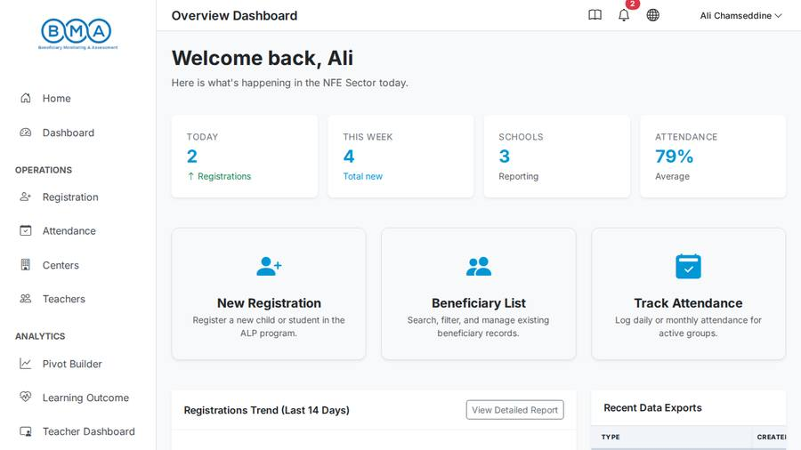

_A superuser landing on /landing-page/ is redirected to the ALP landing page._

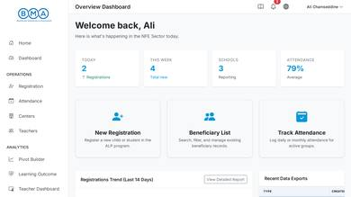

_Landing page on a 390px phone: no menu button, the sidebar is simply hidden, so navigation is unreachable._

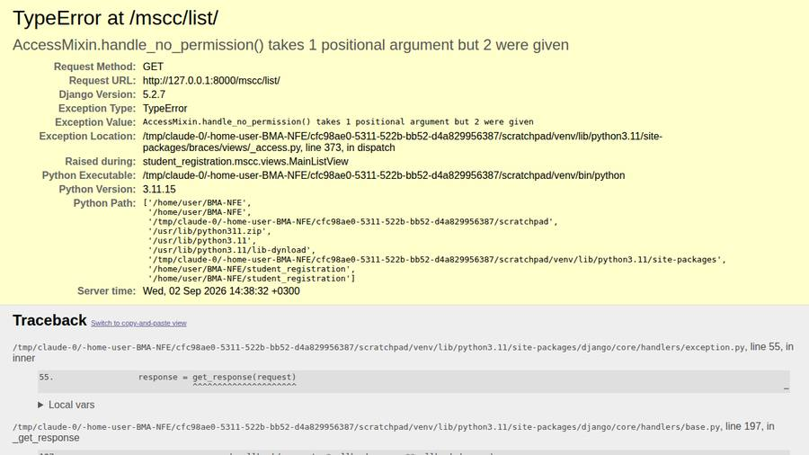

_An ALP user opening the MSCC list receives a 500 instead of a "not allowed" page._

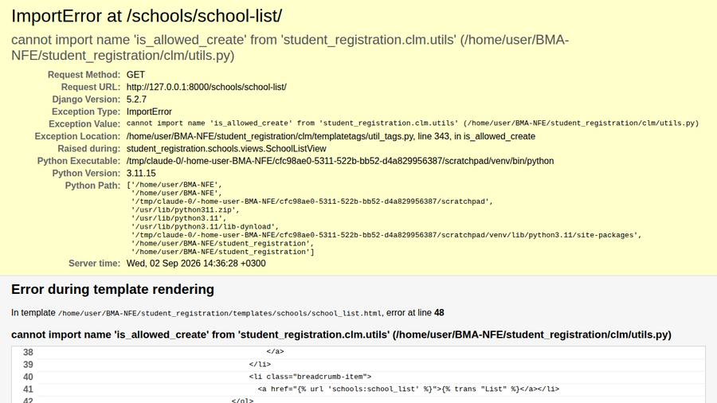

_The schools list crashes with a server error (missing import)._

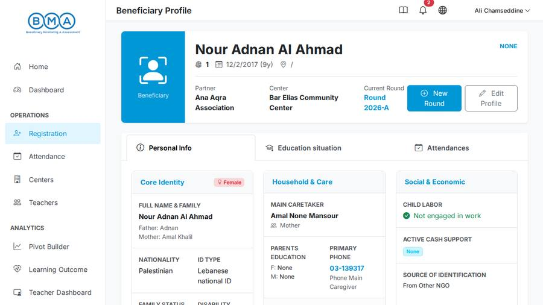

_Child profile header: status reads "NONE", location shows "/", and "None" leaks into several cells._

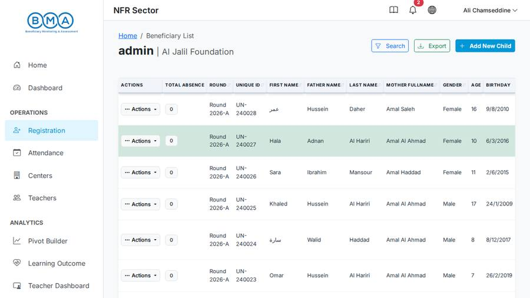

_MSCC beneficiary list: the username is the page title; actions column first; unsorted ID column._

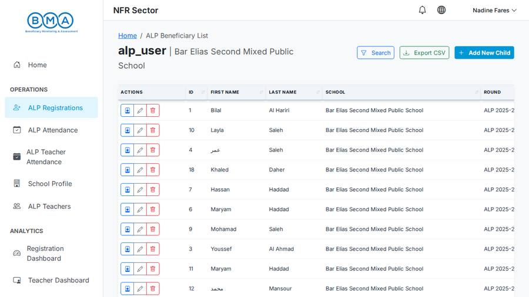

_ALP registration list: raw database ids as the first column, icon-only row actions, a different table style from MSCC._

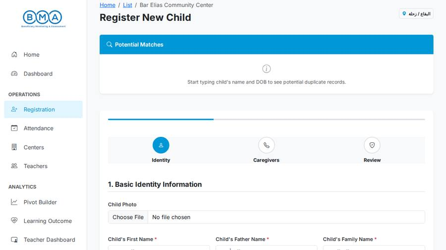

_Registration wizard, step 1 of 3. 80+ fields, three dropdowns for date of birth, Arabic example placeholders in an English UI._

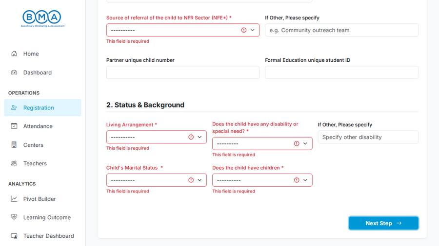

_Wizard after pressing "Next" on an empty form: client-side validation state._

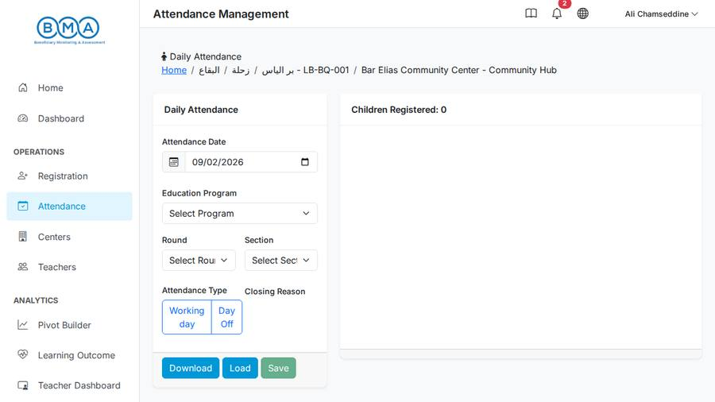

_Daily attendance: a "Load" step before any child appears, "Download" placed before "Load/Save", clipped toggle labels._

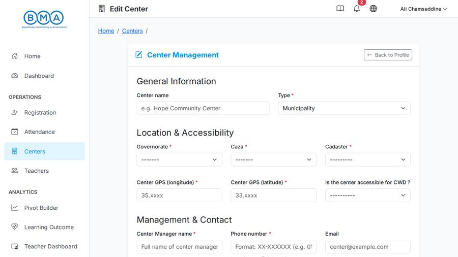

_Center form: cascading location selects are broken by a "jQuery is not defined" script error._

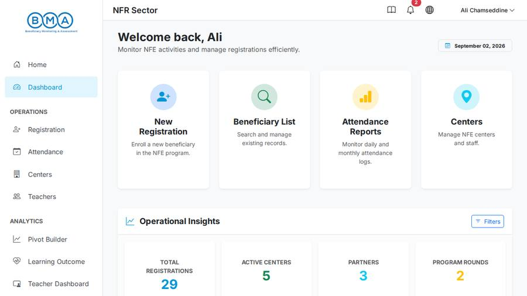

_MSCC dashboard, titled "NFR Sector"; tiles repeat the sidebar; KPI colours carry no meaning._

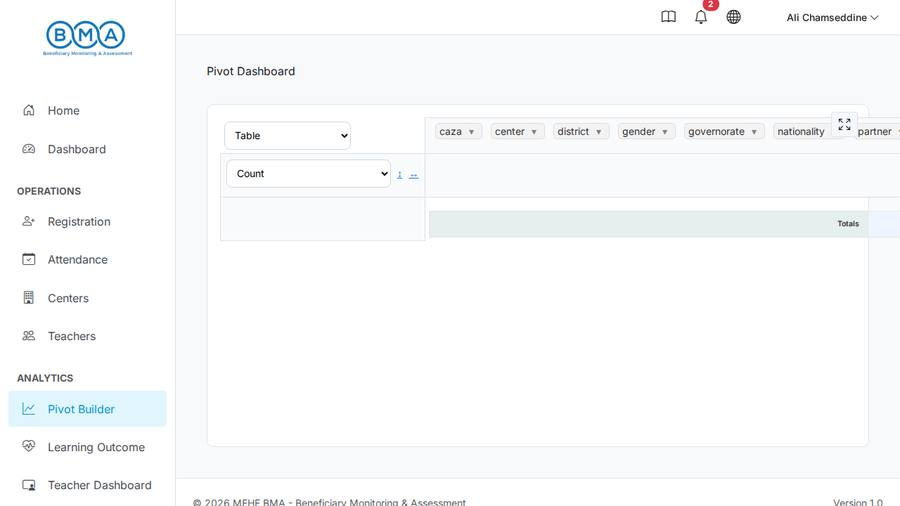

_Pivot builder: no page title in the topbar, native selects, empty table with no guidance._

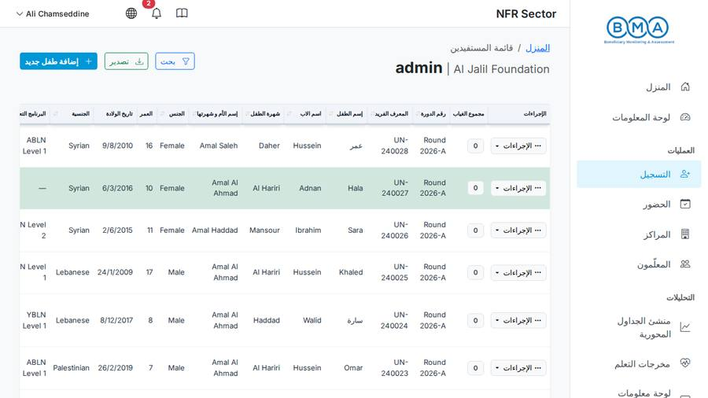

_Arabic (RTL) beneficiary list: mirrored layout works, but English data labels and the username heading remain._

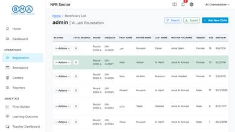

_Beneficiary list on a phone: only the first two columns are visible; no way to open the menu._

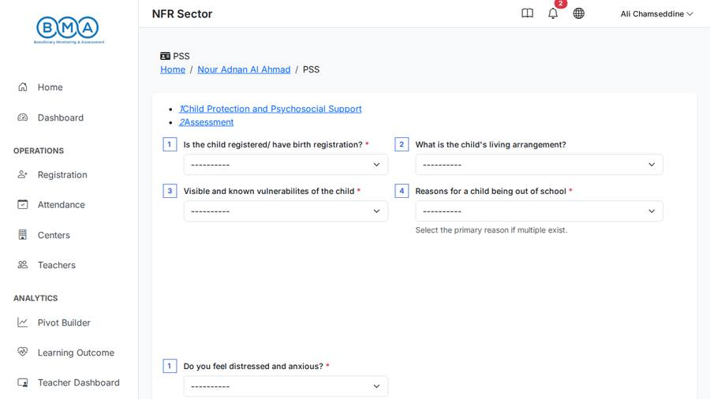

_A service form (PSS): one of ~25 forms with slightly different headers, buttons and layouts._

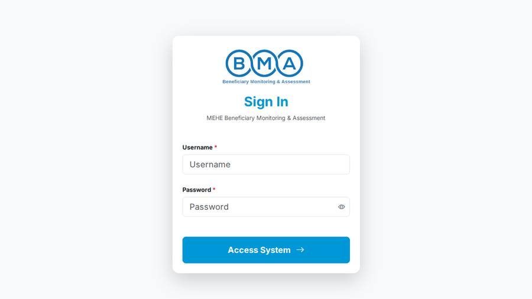

_Sign-in page. Clean, but no "forgot password" route and the button says "Access System"._

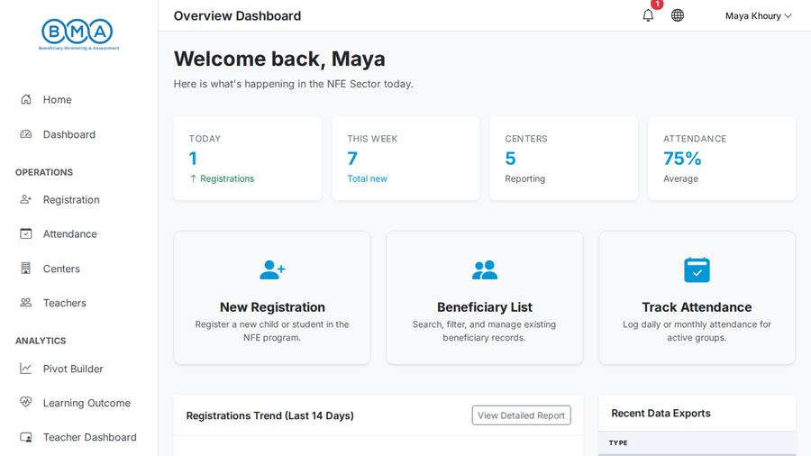

_What a center user sees after login: KPI cards and quick actions that duplicate the sidebar._

## Method & coverage
- Application run locally (Django 5.2 / Postgres 16) and seeded with realistic data; 176 page states captured headlessly as superuser, center, partner, UNICEF and ALP-school users, in English and Arabic, at 1280×720, 1440×900 and 390×844.
- 16 reviewer passes (8 per module, 8 cross-cutting lenses) over screenshots + source; every critical/high finding independently re-checked by a verifier; medium/low findings rest on reviewer evidence.
- 541 raw findings → 538 after verification → 424 after de-duplication; 3 refuted or merged.
- Synthetic seed data is never reported as a defect; how the UI displays data is.

## All findings (by module)

### Global shell & navigation (70)

#### `dashboards-6` · **CRITICAL** · Sidebar has no vertical scroll and its collapse toggle is disabled, so nav items past ~700px are unreachable

- **Where:** `all pages (sidebar)` · **Module:** Global shell & navigation · **Category:** Navigation & IA · **Effort:** M
- **What happens:** The sidebar is `height:100vh` with no overflow-y handling and the collapse/offcanvas toggle buttons are commented out (already known). On a 1280x720 view this means, for the MSCC admin, the entire 'Documentation' section (User Guide, Wiki) plus 'Attendance Heatmap' and 'Centers Map' never appear in either the fold or the full-page capture — only Pivot Builder, Learning Outcome and Teacher Dashboard show under Analytics. For an ALP_SCHOOL user, 'Attendance Dashboard', 'School Dashboard' and 'ALP Pivot Builder' likewise never appear (only Registration Dashboard and Teacher Dashboard show), even while viewing those exact pages. The same truncation is reproduced in Arabic.
- **Who it hurts:** On the exact viewport this app targets ('a typical 13-14" field laptop'), roughly a third of the app's navigation — including 3 of the 5 ALP analytics pages and both documentation entry points — is not reachable from the sidebar at all for a first-time user who doesn't already know the URL.
- **Recommendation:** Give the sidebar's link list its own `overflow-y:auto` scroll region (e.g. wrap the nav in a `max-height:100vh` flex child, independent of logo/footer) at static/css/redesign.css:34-44, and re-enable the already-built collapse (base.html:66) / offcanvas (base.html:69) toggle buttons as a second way to reduce vertical nav length.
- **Evidence:** static/css/redesign.css:34-44 (.sidebar height:100vh, position:sticky, overflow-x:hidden only, no overflow-y); templates/base.html:49 (inline max-width/min-width:250px) and :66,:69 (toggle buttons commented out); _sidebar_links.html:45-58 (Documentation/User Guide/Wiki, Attendance Heatmap, Centers Map) and :84-97 (5 ALP analytics links) none/partially visible. Confirmed cut off in landing_page__admin_en_desktop__fold.png (stops at 'Teacher Dashboard'), mscc_dashboard__admin_en_desktop__fold.png, alp_dashboard_attendance__alp_en_desktop__fold.png (ALP sidebar stops at 'Teacher Dashboard' under Analytics, missing Attendance/School Dashboard and ALP Pivot Builder), alp_pivot__alp_en_desktop.png, and reproduced in Arabic in ar_mscc_dashboard__admin_ar_desktop__fold.png. (screens: mscc_dashboard__admin_en_desktop.png, mscc_dashboard__admin_en_desktop__fold.png, alp_dashboard_attendance__alp_en_desktop.png, alp_dashboard_attendance__alp_en_desktop__fold.png, alp_pivot__alp_en_desktop.png, ar_mscc_dashboard__admin_ar_desktop__fold.png)

#### `lead-review-1` · **CRITICAL** · Users without the required group get a 500 crash instead of a 'not allowed' page on every GroupRequiredMixin-protected view (django-braces incompatible with Django 5)

- **Where:** `every GroupRequiredMixin-protected view (e.g. /mscc/list/, /mscc/child-add/, /mscc/attendance/)` · **Module:** Global shell & navigation · **Category:** Roles & access · **Effort:** S
- **What happens:** An ALP-school user (or any account missing a module group, including a freshly self-registered one) who opens an MSCC page sees the Django server-error page. django-braces 1.17 calls self.handle_no_permission(request) with an argument, but Django 5's AccessMixin.handle_no_permission() takes none, so the permission check itself throws TypeError before any 403 can be rendered.
- **Who it hurts:** Every wrong-role navigation (a school user tapping a link meant for centers, a new account, an expired group) ends in a crash page with no way back; support cannot distinguish crashes from permission problems.
- **Recommendation:** Replace braces' GroupRequiredMixin with a small project mixin built on django.contrib.auth.mixins.UserPassesTestMixin (raise_exception=True) that renders a branded 403 page with the sidebar and a 'go to my home' link; add a regression test asserting a user without the group gets 403, not 500.
- **Evidence:** screenshot alp_user_mscc_list_forbidden__alp_en_desktop.png; venv .../braces/views/_access.py:60 def handle_no_permission(self, request), :108/:419 self.handle_no_permission(request); django/contrib/auth/mixins.py:46 def handle_no_permission(self); grep 'GroupRequiredMixin' across student_registration/*.py = 68 occurrences (3 are the class/import lines). (screens: alp_user_mscc_list_forbidden__alp_en_desktop.png)
- **Also reported as:** technical-health-1, mscc-list-profile-3, alp-11

#### `lead-review-25` · **CRITICAL** · Production database credentials (host, username, password) are committed in settings.py as the DATABASE_URL fallback default

- **Where:** `config/settings/base.py (deployment)` · **Module:** Global shell & navigation · **Category:** Roles & access · **Effort:** S
- **What happens:** Out of UI scope but discovered during setup: base.py falls back to a full postgresql:// URL with username and password for the Azure test/production host when DATABASE_URL is unset.
- **Who it hurts:** Anyone with repository access can reach the live database; rotating the password requires a code change.
- **Recommendation:** Remove the hard-coded default (fail fast / raise ImproperlyConfigured if DATABASE_URL is unset), rotate the exposed database password immediately, and scrub the credential from git history.
- **Evidence:** config/settings/base.py:164-167 (verified verbatim, including the literal password 'clmp!0ck3din' and host 'leb-clm-tst-flex-14.postgres.database.azure.com').
- **Also reported as:** technical-health-10

#### `lead-review-3` · **CRITICAL** · Navigation is unreachable on phones/small tablets: the sidebar is hidden below 992px and both menu-toggle buttons are commented out

- **Where:** `all pages below 992px (phones and small tablets)` · **Module:** Global shell & navigation · **Category:** Responsive · **Effort:** S
- **What happens:** Below the lg breakpoint the sidebar is display:none and the only affordances in the topbar are the docs/bell/globe icons and the user menu. The offcanvas mobile sidebar exists in the DOM but nothing opens it, because both toggle buttons are wrapped in HTML comments. A teacher on a phone can only move between pages via the landing tiles or the browser back button.
- **Who it hurts:** Any field user on a phone or a small tablet (attendance at a centre, outreach) cannot navigate the application.
- **Recommendation:** Restore the d-lg-none hamburger button targeting #mobileSidebar (and keep the desktop collapse toggle), verify Bootstrap's offcanvas JS is wired correctly, and add a persistent bottom or top action bar for the core daily tasks (register, attendance, search) on small screens.
- **Evidence:** templates/base.html:49 (sidebar classes), ~66-71 (both toggle buttons commented out), :252 (#mobileSidebar offcanvas defined); grep 'data-bs-target="#mobileSidebar"' in base.html finds it only inside the commented button; screenshots m_landing_page__admin_en_mobile__fold.png and m_mscc_list__admin_en_mobile__fold.png show no menu control at 390px viewport width. (screens: m_landing_page__admin_en_mobile__fold.png, m_mscc_list__admin_en_mobile__fold.png)
- **Also reported as:** accessibility-3, design-system-2, responsive-1, shell-auth-landing-19, secondary-modules-19

#### `lead-review-5` · **CRITICAL** · Form field labels across MSCC/centers/schools/students are frozen in English on Arabic pages because forms.py imports eager gettext instead of gettext_lazy; JS-built strings and 48 fuzzy catalogue entries add further English leakage

- **Where:** `Arabic UI: form labels, choices, JS messages` · **Module:** Global shell & navigation · **Category:** Arabic / RTL / i18n · **Effort:** M
- **What happens:** Beyond the registration labels that stay English because of gettext-at-import, the Arabic .po has 104 empty msgstr entries and 48 fuzzy ones (ignored at runtime), and strings produced in JavaScript (duplicate-match text, 'Previous', pivot/Highcharts UI, 'Select one or more …' placeholders) are not passed through gettext at all, so Arabic screens are interspersed with English.
- **Who it hurts:** Arabic users must read English fragments in critical moments (duplicate warnings, validation), which is exactly where misunderstandings create bad data.
- **Recommendation:** Change 'from django.utils.translation import gettext as _' to 'gettext_lazy as _' in mscc/forms.py, locations/forms.py, schools/forms.py and students/forms.py (label/help_text values must be lazy so they translate per-request, not at import time); route JS-built strings like mscc.js's duplicate-match message through django.views.i18n.JavaScriptCatalog; translate or drop the 48 fuzzy Arabic entries; add a CI check that fails on new fuzzy/eager-gettext regressions.
- **Evidence:** screenshot ar_mscc_child_add__admin_ar_desktop.png shows ~20 English field labels on an Arabic-language page; mscc/forms.py:3 'from django.utils.translation import gettext as _' vs alp/forms.py:2 'gettext_lazy as _' (the one form module that gets this right); locations/forms.py:2, schools/forms.py:3, students/forms.py:3 share the eager-gettext bug; static/locale/ar/LC_MESSAGES/django.po confirmed to already contain correct Arabic translations for these exact strings (e.g. msgid "Child's First Name" / msgstr "الاسم الأول للطفل" at line 3990) and a compiled django.mo (206KB) exists, ruling out a missing-catalogue explanation; polib parse: 2790 entries, 0 truly-empty non-obsolete msgstr, 48 fuzzy (confirmed both via polib and grep '#, fuzzy'); static/js/mscc/mscc.js:295-306 (hardcoded English duplicate-match message, no gettext). (screens: ar_mscc_child_add__admin_ar_desktop.png)

#### `shell-auth-landing-5` · **CRITICAL** · Silent 30-minute idle auto-logout discards an in-progress registration/service form with zero warning

- **Where:** `all authenticated pages (AutoLogout middleware)` · **Module:** Global shell & navigation · **Category:** Feedback & states · **Effort:** M
- **What happens:** Production enables AutoLogout with AUTO_LOGOUT_DELAY=30. A field worker who spends more than 30 minutes filling the 88-field registration wizard is logged out on submit; the POST is handled as anonymous, LoginRequiredMixin redirects to LOGIN_URL='/', the home view redirects to /accounts/login/ and every typed value is lost. No countdown, no 'session expired' message on the login page, no auto-save.
- **Who it hurts:** Data loss on long forms; highest cost for the registration wizard and service forms which are the core task.
- **Recommendation:** Add a client-side idle-warning timer in base.html (e.g. 2 minutes before AUTO_LOGOUT_DELAY) with a 'Stay signed in' ping to reset the session; have the middleware set `messages.warning('Your session expired due to inactivity')` or redirect with `?expired=1` before flushing so login.html can show it; and either exempt in-flight POSTs from the idle check or persist wizard drafts to localStorage so work can be restored after re-login. Also fix local.py:138's comment (1000 minutes, not 20).
- **Evidence:** config/settings/production.py:43 (EXTRA_MIDDLEWARE includes AutoLogout), :169 (AUTO_LOGOUT_DELAY=30); config/settings/local.py:48 (middleware included), :138 (`AUTO_LOGOUT_DELAY = 1000  # equivalent to 20 minutes` -- comment/value mismatch, confirmed verbatim); student_registration/middleware.py:33-36 (logout+flush, no message); config/settings/base.py:342 (LOGIN_URL='/'); users/views.py:197-202 (home() redirect, no `next`/message). Grep of static/js/mscc/mscc.js for 'localStorage' returns no matches, confirming no client-side draft save exists. (screens: landing_page__admin_en_desktop__fold.png)

#### `technical-health-9` · **CRITICAL** · Export history page 500s on every user: localtime() called on naive datetimes because USE_TZ=False

- **Where:** `/backends/export-history-list/ (topbar 'View All History')` · **Module:** Global shell & navigation · **Category:** Broken / crash · **Effort:** S
- **What happens:** Clicking the topbar bell/History control's 'View All History' link returns a server error instead of the export history list.
- **Who it hurts:** No user can ever see their export job history — a fully broken feature reachable from the global topbar on every page.
- **Recommendation:** Remove the localtime() call in backends/views.py:32 and format export.created directly (it's already in the server's local time since USE_TZ=False), or set USE_TZ=True project-wide and audit other naive-datetime call sites if broader timezone correctness is wanted.
- **Evidence:** backends/views.py:32 'timestamp = localtime(export.created)...'; config/settings/base.py:201 'USE_TZ = False'. (screens: mscc_export_history__admin_en_desktop.png)
- **Also reported as:** lead-review-21, shell-auth-landing-17, navigation-roles-19

#### `accessibility-4` · **HIGH** · Global modals (validation, export-ready, success, preview) have no aria-labelledby despite the correct pattern existing elsewhere

- **Where:** `base.html modals app-wide` · **Module:** Global shell & navigation · **Category:** Accessibility · **Effort:** S
- **What happens:** The four modals defined once in base.html and reused across nearly every page in the app (shown whenever a form fails validation, an export finishes, a save succeeds, or a row's 'View'/'Details' preview is opened) have a visible <h4>/<h5> title but the modal container itself is never told which element is its name.
- **Who it hurts:** Screen-reader users get 'dialog' with no name on the modals shown after essentially every save, export, and validation failure across the whole app, and on the row-preview modal used from every list page - a very high-frequency interaction.
- **Recommendation:** Add matching id/aria-labelledby pairs to #remoteModal, #formErrorModal, #downloadReadyModal and #formSuccessModal in base.html the same way profile.html's #newRoundModal and dashboard.html's #dashboardFilters already do it.
- **Evidence:** templates/base.html:265 #remoteModal (h5 id="remoteModalLabel" at :269, no aria-labelledby on the modal div), :342 #formErrorModal, :355 #downloadReadyModal, :373 #formSuccessModal - none reference their title id; contrast mscc/profile.html:112/116 and mscc/dashboard.html:246/248 which do it correctly. (screens: landing_page__admin_en_desktop__fold.png, mscc_list__admin_en_desktop__fold.png)

#### `accessibility-8` · **HIGH** · Notification bell and language-switcher topbar buttons are icon-only with no accessible name

- **Where:** `topbar (all authenticated pages)` · **Module:** Global shell & navigation · **Category:** Accessibility · **Effort:** S
- **What happens:** The bell (export notifications, with a live unread-count badge) and globe (language switcher) buttons in the topbar, present on every authenticated page, have nothing but an <i> icon inside them.
- **Who it hurts:** Screen-reader users on every authenticated page hear an unlabeled 'button' twice in the topbar and cannot tell what opens notifications vs. language options without guessing/exploring; this is present on all 176 authenticated captures.
- **Recommendation:** Add aria-label="Notifications" to the bell button (base.html:111) and aria-label="Language" to the globe button (base.html:169), matching the Documentation button's existing pattern three lines above.
- **Evidence:** templates/base.html:79 (Documentation button, has aria-label/title), :111 (bell button, no aria-label), :169 (globe button, no aria-label); screenshot landing_page__admin_en_desktop__fold.png shows the three icon buttons in the topbar. (screens: landing_page__admin_en_desktop__fold.png, mscc_list__admin_en_desktop__fold.png)
- **Also reported as:** shell-auth-landing-18

#### `content-copy-4` · **HIGH** · Browser tab title is stuck at generic "BMA | Home" on every auth page, error page, and several other pages

- **Where:** `account/login, account/signup, account/password_reset, account/password_change, account/logout, /500/, and several dashboard/ALP pages` · **Module:** Global shell & navigation · **Category:** Content & copy · **Effort:** S
- **What happens:** Sign In, Sign Up, Password Reset, Change Password, Sign Out, the 500 error page, Advanced Exporter, the Wiki index, New Grading and School Profile all show the tab title "BMA | Home", even though each page has a distinct on-page H1/H2. A user with several BMA tabs open (e.g. mid password-reset flow, following an emailed link in a new tab) cannot tell them apart from the tab bar.
- **Who it hurts:** Affects every login/logout/password action for every user (very frequent) plus several dashboard/ALP pages; makes multi-tab navigation and bookmarking unreliable.
- **Recommendation:** Rename the block in account/base.html, 404.html, 500.html, 403_csrf.html and error.html from `title` to `project_title` (keeping their existing text); fix advanced_exporter.html to use `project_title` instead of `page_title`/`module_name`; add `` overrides to wiki/page.html, alp/grading_form.html and alp/school_profile.html.
- **Evidence:** templates/base.html:11; templates/account/base.html:4; templates/500.html:6; templates/404.html:6; templates/403_csrf.html:6; templates/error.html:4; templates/dashboard/advanced_exporter.html:5-6 (`page_title`/`module_name`, not `project_title`); templates/wiki/page.html (no title block at all — correct template for wiki_index, superseding the original 'html_page.html' citation); templates/alp/grading_form.html:1-4; templates/alp/school_profile.html:1-4; manifest.json titles all 'BMA | Home' for the nine cited screenshots. (screens: auth_login__anon_en_desktop.png, auth_signup__anon_en_desktop.png, auth_password_change__admin_en_desktop.png, auth_logout__admin_en_desktop.png, error_500__admin_en_desktop.png, dash_advanced_exporter__admin_en_desktop.png, dash_wiki_index__admin_en_desktop.png, alp_grading_add__alp_en_desktop.png, alp_school_profile__alp_en_desktop.png)

#### `design-system-9` · **HIGH** · Governorate/Caza/Cadaster render Arabic-only on the English UI even though a `name_en` field already exists and is unused

- **Where:** `Breadcrumbs / tables / forms referencing Governorate, Caza, District` · **Module:** Global shell & navigation · **Category:** Arabic / RTL / i18n · **Effort:** M
- **What happens:** On an English-language page, the attendance breadcrumb reads 'Home / البقاع / زحلة / LB-BQ-001 / Bar Elias Community Center', the Centers table's GOVERNORATE/CAZA columns show 'بيروت'/'الشمال'/'عكار' etc., the registration wizard shows a floating 'البقاع / زحلة' badge, and the ALP School Profile's Governorate/District/Cadaster select fields show 'البقاع'/'زحلة'/'بر الياس' as their selected values — all with no English rendering available anywhere in the English UI.
- **Who it hurts:** English-language users (including UNICEF/international staff who are one of the stated audiences) cannot read the location context of the record they're looking at in 4+ different places across the app.
- **Recommendation:** Update Location.__str__ (and any template/serializer directly reading .name) in locations/models.py:47-48 to select name_en vs name based on get_language(), and backfill name_en for existing reference data instead of adding a new field.
- **Evidence:** mscc_attendance__admin_en_desktop__fold.png breadcrumb; loc_center_list__admin_en_desktop__fold.png GOVERNORATE/CAZA columns; alp_school_profile__alp_en_desktop__fold.png Governorate/District/Cadaster fields; mscc_child_add_step1__admin_en_desktop__fold.png location badge; student_registration/locations/models.py:14-15, 30-31 (name_en fields exist), 47-48 (__str__ always returns self.name). (screens: mscc_attendance__admin_en_desktop__fold.png, loc_center_list__admin_en_desktop__fold.png, alp_school_profile__alp_en_desktop__fold.png, mscc_child_add_step1__admin_en_desktop__fold.png)

#### `lead-review-4` · **HIGH** · The design system's only declared typeface (Inter) has no Arabic glyphs, so Arabic text always falls back to an unstyled OS default font

- **Where:** `Arabic UI on every page` · **Module:** Global shell & navigation · **Category:** Arabic / RTL / i18n · **Effort:** S
- **What happens:** redesign.css imports Inter (Latin subsets only) and sets it as the body font. Every Arabic label, heading and table cell therefore falls back to whatever Arabic font the OS has (Noto Naskh / Tahoma / Segoe UI), with different weight, x-height and baseline than the Latin text around it. Mixed rows (Arabic name next to Latin ID) look mismatched and the 600/700 weights used for headings are lost.
- **Who it hurts:** Arabic-speaking staff (the majority of field users) get a visibly less polished, less legible interface than English users; headings lose hierarchy.
- **Recommendation:** Add an Arabic companion face with comparable metrics (e.g. IBM Plex Sans Arabic or Noto Sans Arabic) and set font-family: 'Inter', 'Noto Sans Arabic', sans-serif in redesign.css; load the Arabic font subset only when LANGUAGE_BIDI is true to avoid penalizing English-only sessions.
- **Evidence:** static/css/redesign.css:3 (@import Inter wght 300-700, Latin/Latin-ext subsets only) and :22-25 (body font-family); screenshots ar_mscc_list__admin_ar_desktop__fold.png, ar_mscc_child_add__admin_ar_desktop.png show Arabic headings/labels in a plain fallback face. (screens: ar_mscc_list__admin_ar_desktop__fold.png, ar_mscc_child_add__admin_ar_desktop__fold.png)
- **Also reported as:** rtl-i18n-18

#### `navigation-roles-4` · **HIGH** · Sidebar's MSCC gate omits MSCC_CENTER and MSCC_FULL even though views explicitly grant those groups

- **Where:** `_sidebar_links.html visibility gate` · **Module:** Global shell & navigation · **Category:** Roles & access · **Effort:** S
- **What happens:** The entire MSCC nav block (Home, Dashboard, Registration, Attendance, Centers, Teachers, all of Analytics, Documentation) is only shown when the user has MSCC_PARTNER, MSCC_UNICEF or MSCC. MSCC_CENTER and MSCC_FULL are never checked. Elsewhere in the code, MainAddView/MainEditView/NewRoundView/AttendanceView explicitly list MSCC_CENTER in their own group_required, meaning the app's own access model anticipates MSCC_CENTER-only accounts. The reason today's center_user still sees a full sidebar is that the seed account also carries the base MSCC group -- but nothing in the code guarantees that pairing for a real deployment.
- **Who it hurts:** Any account provisioned with only MSCC_CENTER (which several views are explicitly built to allow) gets full URL-level access to add/edit children but a completely blank sidebar -- no discoverable way to find any of it.
- **Recommendation:** Add MSCC_CENTER and MSCC_FULL to the outer condition at _sidebar_links.html:5 so nav visibility matches the groups the views actually accept.
- **Evidence:** templates/_sidebar_links.html:5; mscc/views.py:486 `group_required = [u"MSCC", u"MSCC_CENTER"]` (also at lines 528, 563, 756); no MSCC_FULL or MSCC_CENTER reference anywhere in _sidebar_links.html. (screens: center_landing__center_en_desktop__fold.png)

#### `navigation-roles-9` · **HIGH** · DEBUG=True means the app's branded 404/403/500 templates never render -- users see raw technical pages

- **Where:** `/404/, arbitrary bad URL` · **Module:** Global shell & navigation · **Category:** Broken / crash · **Effort:** S
- **What happens:** The 404 screenshot is Django's own DEBUG-mode technical response: a full dump of every URLconf pattern in the project (31 top-level prefixes including internal app names like backends, api/schema, api/docs), not the app's own templates/404.html (which extends base.html and would show the branded shell with a way back). Django's page_not_found() view unconditionally serves the technical page whenever settings.DEBUG is True, regardless of whether a custom 404.html exists -- so that template is effectively dead code in this deployment. The same root cause is why the already-known /mscc/list/ TypeError renders as a full stack trace with local file-system paths instead of a 500 page.
- **Who it hurts:** Any user who mistypes a URL or hits an error sees Django internals (full route table, file paths, Python version) instead of a friendly, navigable page -- a real error-recovery dead end and a mild information-disclosure issue if this setting is ever mirrored outside local development.
- **Recommendation:** Set DEBUG=False for any shared/staging/production environment (config/settings/base.py already defaults to False via env var; local.py's default of True should not be used outside local dev) so the app's own 404.html/500.html render.
- **Evidence:** screenshot error_404__admin_en_desktop.png; config/settings/local.py:15 `DEBUG = env.bool('DJANGO_DEBUG', default=True)`; config/settings/base.py:135 `DEBUG = env.bool('DJANGO_DEBUG', False)`; templates/404.html:1 ``. (screens: error_404__admin_en_desktop.png, alp_user_mscc_list_forbidden__alp_en_desktop.png)

#### `shell-auth-landing-10` · **HIGH** · Global 'Processing...' overlay can be shown and never hidden when a form's own script intercepts submit

- **Where:** `all pages with forms (global loading overlay)` · **Module:** Global shell & navigation · **Category:** Feedback & states · **Effort:** S
- **What happens:** base.html binds a delegated submit handler that fades in a full-screen, non-dismissable overlay for every form. Any page whose script intercepts submit (filter forms that fetch JSON, export forms that return a file, forms that validate in JS after the delegated handler) leaves the overlay covering the page with no close button; the only recovery is a reload. Verified on the ALP School Dashboard filter: after submitting, the overlay stays visible with 'Processing... This may take a few moments.' The overlay also has no role/aria-live, so screen readers get no announcement, and it survives bfcache restores.
- **Who it hurts:** Any dashboard/filter or export interaction can freeze the UI; users think the system hung.
- **Recommendation:** Show the overlay only when the submit event was not already defaultPrevented (check `e.defaultPrevented` in a capture-phase listener, or require an explicit `data-overlay` opt-in), hide it on `pageshow` for bfcache restores and after a timeout with a 'Still working... Cancel' fallback, and add `role="status" aria-live="polite"` to the overlay container (currently only the inner spinner has `role="status"`, at base.html:336).
- **Evidence:** base.html:296-300 (delegated submit handler), :334-339 (overlay markup, no aria-live on the container); alp/dashboard_school.html:97 (`event.preventDefault(); loadSchools();`, no overlay hide); dashboard/centers_map.html:322-327 (`hideLoadingOverlay()` definition) and :499,559 (`.finally(() => hideLoadingOverlay())`), showing this page had to work around the same bug. (screens: landing_page__admin_en_desktop__fold.png)

#### `shell-auth-landing-11` · **HIGH** · messages.error() renders as the unstyled 'alert-error' class because MESSAGE_TAGS isn't set for Bootstrap 5

- **Where:** `base.html messages block (all pages)` · **Module:** Global shell & navigation · **Category:** Feedback & states · **Effort:** S
- **What happens:** The shell renders `alert-{{ message.tags }}`. Django's default tag for ERROR is 'error', not 'danger', and MESSAGE_TAGS is not configured, so the 55 messages.error() calls across forms/views produce `
` with no background or border colour. Success messages (tag 'success') are green, so failures look less prominent than successes.
- **Who it hurts:** Whenever a save fails or a permission problem is reported via messages, the notice is easy to miss; users re-submit or assume success.
- **Recommendation:** Add `MESSAGE_TAGS = {messages.ERROR: 'danger', messages.DEBUG: 'secondary'}` to config/settings/base.py, and give the rendered alert an icon plus `role="alert"` for consistency with the success/warning variants.
- **Evidence:** base.html:220-227 (`alert alert-{{ message.tags }}`), :30-31 (only base.css and redesign.css loaded); grep for MESSAGE_TAGS in config/settings/*.py returns nothing; static/css/custom.css:3685 (`.alert-error {`, the only definition, in an unloaded stylesheet); 55 total messages.error/success/warning call sites confirmed by grep count. (screens: auth_login__anon_en_desktop.png)

#### `shell-auth-landing-12` · **HIGH** · Arabic .mo catalog is stale and some shell strings aren't translatable, leaving mixed-English UI

- **Where:** `all Arabic pages` · **Module:** Global shell & navigation · **Category:** Arabic / RTL / i18n · **Effort:** S
- **What happens:** On the Arabic landing page the quick-action tile reads 'Register a new child or student in the ALP program.' in English, the docs menu shows 'View All Docs' and 'Developer Guides' in English, the sidebar shows 'ALP Registrations', 'ALP Teacher Attendance', 'School Profile' in English, and the profile badge 'General User' is English. Some of these are translated in django.po but not in the compiled django.mo (stale build); others are missing from the .po entirely. Chart axis dates ('Aug 21') also stay English.
- **Who it hurts:** A large share of field users work in Arabic; mixed-language navigation and instructions undermine trust and slow task completion.
- **Recommendation:** Run makemessages/compilemessages in CI and fail the build if django.mo is older than django.po; translate the missing msgids; and note users/profile.html:36 uses `{{ user.groups.first.name|default:"General User" }}` -- a raw template default, never wrapped in `` -- so it will never be picked up by makemessages until it's rewritten as `` first. Localize d3 axis formatting via d3.timeFormatLocale when LANGUAGE_CODE is 'ar'.
- **Evidence:** Confirmed programmatically: po_dict['View All Docs'] and ['Developer Guides'] both non-empty (translated) while absent from the compiled .mo dict; 'Register a new child or student in the ALP program.', 'ALP Registrations', 'School Profile', 'General User', 'ALP Teacher Attendance' all absent from django.po. base.html:91 (Developer Guides), :103 (View All Docs); _sidebar_links.html:68 (ALP Registrations), :76-77 (School Profile); users/profile.html:36 (`default:"General User"`, not wrapped in  -- an additional root cause beyond what the original finding cited). ar_landing_page__admin_ar_desktop.png shows the English ALP tile text and English chart axis labels on the Arabic-language page. (screens: ar_landing_page__admin_ar_desktop.png)
- **Also reported as:** rtl-i18n-8

#### `shell-auth-landing-7` · **HIGH** · Sidebar taller than 720px viewport has no scrollbar, hiding Heatmap/Map/docs links (and ALP nav for admins)

- **Where:** `sidebar (all pages, 1280x720)` · **Module:** Global shell & navigation · **Category:** Navigation & IA · **Effort:** M
- **What happens:** The sidebar is a sticky 100vh column whose content is 1008px for a center user and 1769px for a superuser. On the typical 1280x720 field laptop the last 4 links (center/partner/UNICEF) or 15 links (admin) sit below the fold; the column is technically scrollable but shows no scrollbar or fade, so users do not discover those pages. The screenshots end at 'Teacher Dashboard' with blank space below.
- **Who it hurts:** Every laptop user; documentation and two analytics pages are effectively invisible; admins cannot see the ALP navigation at all without knowing to scroll the sidebar.
- **Recommendation:** Give .sidebar `overflow-y:auto` with a visible thin scrollbar and a bottom fade cue, cut nav-link padding to ~0.5rem and section spacing to mt-3, shrink the logo block (base.html:49-58), and collapse the Analytics/Documentation/ALP groups into accordions that auto-open the group containing the active page. Restore the commented-out collapse/offcanvas toggle in base.html so icon-only mode is reachable.
- **Evidence:** redesign.css:34-45 (.sidebar), :133-140 (.nav-link); base.html:49-58 (logo block, p-4+mt-4); _sidebar_links.html:1-108 (13-24 links + 3-6 headers depending on role); screenshots center_landing__center_en_desktop.png and landing_page__admin_en_desktop__fold.png show the cutoff at 'Teacher Dashboard'. (screens: center_landing__center_en_desktop.png, landing_page__admin_en_desktop__fold.png, alp_landing__alp_en_desktop.png)

#### `technical-health-17` · **HIGH** · The push-notification token endpoint is @csrf_exempt despite being a login-required, state-changing POST

- **Where:** `any authenticated page (background POST triggered from static/js/firebase-messaging.js)` · **Module:** Global shell & navigation · **Category:** Broken / crash · **Effort:** S
- **What happens:** The API that binds a device/browser to a user's account for export-ready push notifications skips Django's CSRF protection entirely, even though it is a state-changing POST guarded only by login.
- **Who it hurts:** A malicious page a logged-in user has open could silently POST a token to /api/save-fcm-token/ on the victim's behalf, re-pointing their push notifications (which include export-ready download links) at an attacker-controlled device — a real CSRF exposure on a session-authenticated NGO/child-protection system.
- **Recommendation:** Remove @csrf_exempt from save_fcm_token (users/views.py:213); the client already sends X-CSRFToken (static/js/firebase-messaging.js:47), so the view will validate correctly once the decorator is removed.
- **Evidence:** users/views.py:213-232 confirmed verbatim. static/js/firebase-messaging.js:43-47 confirmed the fetch POST with an X-CSRFToken header sourced from the csrftoken cookie read at lines 33-36 (corrected from the finding's cited 32-34).

#### `accessibility-14` · **MEDIUM** · No 'skip to main content' link; keyboard users tab the full sidebar on every page

- **Where:** `all pages` · **Module:** Global shell & navigation · **Category:** Navigation & IA · **Effort:** S
- **What happens:** Sidebar navigation (10-20 links depending on role/module) is the first focusable content on every authenticated page, before the topbar controls and before the actual page content.
- **Who it hurts:** Keyboard-only users must press Tab 10-20+ times on every single page load/navigation before reaching the actual task (e.g. the registration form or table), a repeated tax on every interaction throughout the app.
- **Recommendation:** Add a visually-hidden-until-focused 'Skip to main content' link as the first element in <body>, targeting the <main> element.
- **Evidence:** templates/base.html: the `<nav class="sidebar">` (line 49) with `_sidebar_links.html` included is emitted before `<main class="main-content">` (line 62) in DOM order, and no skip-link anchor exists anywhere in base.html. (screens: mscc_list__admin_en_desktop__fold.png)

#### `accessibility-17` · **MEDIUM** · Current page in the sidebar is indicated only by a CSS .active class, never exposed as aria-current="page"

- **Where:** `_sidebar_links.html (all authenticated pages)` · **Module:** Global shell & navigation · **Category:** Accessibility · **Effort:** S
- **What happens:** Each nav link computes an 'active' CSS class from request.resolver_match to highlight the current section, but this is purely visual (background/color change).
- **Who it hurts:** Screen-reader users can't tell which of the 10-20 sidebar items corresponds to the page they're currently on, since aria-current is the standard mechanism AT uses to announce 'current page' in navigation.
- **Recommendation:** Add `aria-current="page"` alongside the existing `active` class logic on each link, and `aria-label="Main"` (or similar) on the sidebar <nav>.
- **Evidence:** templates/_sidebar_links.html - every link, e.g. line 16 `<a href="" class="nav-link active">`, toggles only the `active` class; no `aria-current="page"` is emitted anywhere in the file. The <nav class="sidebar"> in base.html:49 also has no aria-label distinguishing it from other landmarks. (screens: mscc_list__admin_en_desktop__fold.png)

#### `accessibility-19` · **MEDIUM** · Two low-contrast gray text colours used for real content fail or border WCAG AA 4.5:1 against white

- **Where:** `redesign.css (site-wide typography)` · **Module:** Global shell & navigation · **Category:** Accessibility · **Effort:** S
- **What happens:** Metric-card labels ('TODAY', 'THIS WEEK', etc.) and empty-state description text render in medium/light gray that is borderline or fails the AA contrast ratio for normal-size text.
- **Who it hurts:** Users with low vision reading dashboard metric labels or empty-state helper text (e.g. 'no teachers assigned yet' guidance) get text that is hard to read or fails a formal contrast check.
- **Recommendation:** Darken #718096 to at least #5c6b7d-class value (verify ≥4.5:1) and re-check #6c757d at the actual rendered weight/size; consider reserving text-muted-class grays for decorative/secondary text ≥18px, not primary content.
- **Evidence:** static/css/redesign.css:178-183 `.metric-label { font-size: 0.875rem; color: #6c757d; text-transform: uppercase; }` computes to ~4.7:1 on white (borderline pass, and further reduced by anti-aliasing on thin uppercase glyphs); redesign.css:610-613 `.empty-state-description { color: #718096; }` computes to ~4.0:1 on white, failing the 4.5:1 AA minimum for normal text; used in templates/location/teachers_tab.html and shown as the metric labels visible on landing_page__admin_en_desktop__fold.png ('TODAY 2 / THIS WEEK 4 / SCHOOLS 3 / ATTENDANCE 79%'). (screens: mscc_list__admin_en_desktop__fold.png, sch_club_list__admin_en_desktop__fold.png)

#### `accessibility-21` · **MEDIUM** · No prefers-reduced-motion support anywhere in the app's own CSS for the wizard's slide-in step animation

- **Where:** `redesign.css .step-content animation` · **Module:** Global shell & navigation · **Category:** Accessibility · **Effort:** S
- **What happens:** Every step transition in the registration/ALP wizards runs a 0.4s translateX+opacity slide animation with no reduced-motion opt-out.
- **Who it hurts:** Users with vestibular disorders who have set prefers-reduced-motion: reduce at the OS level still get the sliding animation on every step of every multi-step form in the app (registration, ALP registration).
- **Recommendation:** Wrap the slideIn animation in `@media (prefers-reduced-motion: no-preference)` or add a `prefers-reduced-motion: reduce` override that sets `animation: none`.
- **Evidence:** static/css/redesign.css:296-302 `@keyframes slideIn { from { opacity:0; transform: translateX(30px);} to {...} } .step-content:not(.d-none) { animation: slideIn 0.4s ease-out; }` - confirmed via grep that `prefers-reduced-motion` appears nowhere in redesign.css or base.css (only in an unrelated legacy vendor bundle, static/css/main.87c0748b313a1dda75f5.css, that isn't used by the current design system). (screens: mscc_child_add_step1__admin_en_desktop.png)

#### `accessibility-24` · **MEDIUM** · Full-page 'Processing...' overlay shown on every form submit has no aria-live announcement

- **Where:** `global loading overlay (every form submit)` · **Module:** Global shell & navigation · **Category:** Feedback & states · **Effort:** S
- **What happens:** Submitting any form in the app (registration, services, attendance, teacher forms, etc.) fades in a full-screen overlay with a spinner and 'Processing... This may take a few moments.' text while the request completes.
- **Who it hurts:** Screen-reader users submitting any form in the app get no announcement that a submission is in progress or has completed, especially on slower connections/exports where the overlay stays up for several seconds.
- **Recommendation:** Add `role="status" aria-live="polite"` to the #loading-overlay text content (or a visually-hidden live region updated alongside it) so its appearance/removal is announced.
- **Evidence:** templates/base.html:293-300 toggles `#loading-overlay` via jQuery on every form submit (`$(document).on('submit','form', ...)`), and the overlay markup at base.html:335-339 has a `role="status"` only on the inner spinner-border, not on the overlay/text itself, and there is no aria-live region announcing when it appears or disappears. (screens: mscc_child_add_step1__admin_en_desktop.png)

#### `content-copy-12` · **MEDIUM** · "NFR Sector" vs. "NFE Sector" — the program is labeled with two different, non-interchangeable acronyms

- **Where:** `app-wide (mscc/base.html, location/base.html, mscc/dashboard_d3.html) vs landing_page.html` · **Module:** Global shell & navigation · **Category:** Content & copy · **Effort:** S
- **What happens:** Nearly every MSCC, Centers and service page shows "NFR Sector" (or "NFR Sector - Centers" / "NFR Sector - Dashboard") as the module heading, while the personal landing page correctly and separately says "Here is what's happening in the NFE Sector today." The product is UNICEF/MEHE's Non-Formal Education (NFE) sector — "NFR" does not match any defined term in the codebase's own docs.
- **Who it hurts:** Every MSCC/Centers/service page a user visits after their first login shows the wrong acronym for their own program; confusing for new staff and for any UNICEF reviewer who knows the program is called NFE.
- **Recommendation:** Global find-and-replace "NFR Sector" → "" across mscc/base.html, location/base.html and dashboard_d3.html.
- **Evidence:** Hardcoded (not even wrapped in ``) at templates/mscc/base.html:5 (`NFR Sector`), templates/location/base.html:5, templates/mscc/dashboard_d3.html:11, vs. templates/landing_page.html's body copy "...NFE Sector today" and DOCS_REDESIGN.md:1 ("BMA – NFE Sector: UI/UX Redesign"). Visible side-by-side across mscc_list ("NFR Sector") and landing_page ("...NFE Sector today"). (screens: mscc_list__admin_en_desktop__fold.png, mscc_dashboard__admin_en_desktop__fold.png, landing_page__admin_en_desktop__fold.png, loc_center_list__admin_en_desktop__fold.png, svc_recreational_add__admin_en_desktop__fold.png)
- **Also reported as:** design-system-16, alp-24, secondary-modules-20

#### `content-copy-15` · **MEDIUM** · Four different placeholder conventions for "no value" are used inconsistently across the app

- **Where:** `app-wide (profile, child_info_tab, alp/child_profile)` · **Module:** Global shell & navigation · **Category:** Content & copy · **Effort:** M
- **What happens:** Depending on which template renders an empty field, the user sees the literal word "None", or "N/A", or a bare hyphen "-", or an em dash "—" — sometimes on the very same profile screen.
- **Who it hurts:** Minor per-instance, but adds up to a visibly inconsistent, unpolished product across nearly every profile/detail screen a user visits.
- **Recommendation:** Pick one convention (an em dash "—" reads best, matching the ALP module's existing choice) and create a single template filter or context processor default used everywhere instead of ad hoc `|default:"..."` per field.
- **Evidence:** templates/users/profile.html:110,114,118,122 use `|default:"None"` (Partner/Center/School/Location) while line 95 on the same page uses `|default:"-"` (Phone Number); templates/mscc/child_info_tab.html:42 uses `|default:"N/A"`; templates/alp/child_profile.html:89 uses `|default:"—"`. Confirmed in users_profile__admin_en_desktop__fold.png ("Assigned School: None", "Phone Number: -"). (screens: users_profile__admin_en_desktop__fold.png, mscc_child_profile__admin_en_desktop__fold.png, alp_child_profile__alp_en_desktop__fold.png)
- **Also reported as:** content-copy-16, secondary-modules-22, forms-ux-27

#### `content-copy-22` · **MEDIUM** · Custom server-error page copy is overly casual and offers no actual way to get help

- **Where:** `/500/` · **Module:** Global shell & navigation · **Category:** Content & copy · **Effort:** S
- **What happens:** The branded 500 page reads "Ooops!!! 500" / "Looks like something went wrong!" / "We track these errors automatically, but if the problem persists feel free to contact us." — the triple exclamation mark is an unusually informal tone for a UNICEF/MEHE child-services system, and "contact us" is plain text, not a link, mailto, or phone number — so the promised way to get help doesn't actually exist on the page.
- **Who it hurts:** Every user who hits a crash (and there are many reproducible 500s in this app per the known-issues list) lands on a dead end with an unhelpful, tonally mismatched message and no recovery action.
- **Recommendation:** Tone down the copy, add a "Return to Home" button/link, and either hyperlink "contact us" to a real mailto/support address or remove the false promise.
- **Evidence:** templates/500.html:9,13 — `<h1></h1>` ... `

` with no `<a>` around "contact us". No link back to Home either. Confirmed in error_500__admin_en_desktop.png. (screens: error_500__admin_en_desktop.png)

#### `content-copy-23` · **MEDIUM** · Branded 404 page copy is minimal and, in this environment, isn't even the page users actually see

- **Where:** `/404/, /this-page-does-not-exist/` · **Module:** Global shell & navigation · **Category:** Content & copy · **Effort:** S
- **What happens:** The app's own templates/404.html says only "Page Not found" (inconsistent capitalization — should be "Page Not Found" or "Page not found") and "This is not the page you were looking for.", with no link back to Home. In this running instance, visiting a nonexistent URL instead shows Django's raw DEBUG=True technical 404 page (full URL-pattern dump), meaning the custom template's real-world behavior could not be visually verified and, on any DEBUG=True deployment, the friendly template is bypassed entirely.
- **Who it hurts:** If DEBUG ever stays on in a shared/staging environment (an easy mistake), non-technical field staff see a page listing every internal URL pattern in the system instead of a helpful message — confusing at best, an information leak at worst.
- **Recommendation:** Improve the 404 copy (add a "Back to Home" link, fix capitalization) and confirm DEBUG=False is enforced outside local development so the custom template is actually served.
- **Evidence:** templates/404.html:6,9,11. error_404__admin_en_desktop.png shows the Django debug "Page not found (404)" technical page instead, listing all 31 URL patterns to the browser. (screens: error_404__admin_en_desktop.png)

#### `dashboards-23` · **MEDIUM** · MSCC_CENTER is omitted from the sidebar's main visibility check, unlike several MSCC views' group_required

- **Where:** `all MSCC pages (sidebar)` · **Module:** Global shell & navigation · **Category:** Roles & access · **Effort:** S
- **What happens:** The whole Dashboard/Operations/Analytics/Documentation block in the sidebar is gated on `has_group:"MSCC_PARTNER" or has_group:"MSCC_UNICEF" or has_group:"MSCC"` — MSCC_CENTER is not included. Several views a center coordinator needs (registration add/edit, new round, referral form) explicitly list `group_required = ["MSCC", "MSCC_CENTER"]`. The test account rendered fine only because it also carries the MSCC group; a user assigned only to MSCC_CENTER would have working edit permissions but no way to navigate to them.
- **Who it hurts:** Depends on exactly how center-only accounts are provisioned in production; if any exist, they get zero sidebar navigation despite valid permissions.
- **Recommendation:** Add `or request.user|has_group:"MSCC_CENTER"` to the sidebar's visibility condition to match the views' group_required lists.
- **Evidence:** _sidebar_links.html:5; mscc/views.py:486 (MainAddView), :528 (MainEditView), :563 (NewRoundView), :756 (ReferralFormView) all include MSCC_CENTER in group_required. (screens: center_dashboard_forbidden__center_en_desktop.png)

#### `design-system-10` · **MEDIUM** · pe-7s-* (Pixeden) icon classes used in 23 templates render no glyph because the font is never loaded

- **Where:** `Attendance, dashboards, list pages (mscc/alp/clm/schools)` · **Module:** Global shell & navigation · **Category:** Visual consistency · **Effort:** M
- **What happens:** `pe-7s-*` (Pixeden 7 Stroke) classes drive icons for buttons across the Attendance page (Download/Load/Save), several dashboards, and multiple list pages, but the `Pe-icon-7-stroke` @font-face and `[class^="pe-7s-"]` display rule only exist inside `static/css/main.87c0748b313a1dda75f5.css`, a 653KB bundle that no template links to. On the Attendance page this means the Download/Load/Save buttons render with no icon glyph at all.
- **Who it hurts:** Icon-only visual cues are silently missing on action buttons across a large swath of the app (attendance actions, several dashboards, most list pages' page-level icons) — a low-severity-looking gap individually, but pervasive.
- **Recommendation:** Either link the Pixeden font/CSS globally in base.html, or replace all pe-7s-* classes with Bootstrap Icons (already loaded everywhere else) per the documented 'Globally migrated to Bootstrap Icons' spec.
- **Evidence:** mscc_attendance__admin_en_desktop__fold.png: Download/Load/Save buttons show text only, no icon; student_registration/templates/mscc/attendance.html:147-150 uses pe-7s-cloud-download/refresh-2/diskette; student_registration/templates/base.html:20-31 lists the only 5 stylesheets loaded (none contain pe-7s); grep confirms 23 template files use pe-7s-*. (screens: mscc_attendance__admin_en_desktop__fold.png, sch_school_list__admin_en_desktop__fold.png)
- **Also reported as:** technical-health-20, attendance-33, secondary-modules-26

#### `design-system-14` · **MEDIUM** · Dropdown empty-state placeholders use two different hardcoded dash strings ('----------' vs '-------') instead of 'Select...'

- **Where:** `Nearly every form (Centers, Schools, MSCC registration/services, ALP)` · **Module:** Global shell & navigation · **Category:** Forms · **Effort:** S
- **What happens:** Unselected `<select>` fields across the app default to Django's raw choice-field empty label rendered as dashes — but the number of dashes varies field to field on the very same form (School Type shows 11 dashes, Governorate 8, District 8, Cadaster 7, Operating Shift 11), so it reads as a rendering glitch rather than an intentional placeholder.
- **Who it hurts:** Low-tech-literacy users may not recognize the dashes as an unselected/placeholder state, and the visibly varying dash counts look like a bug rather than a design choice, undermining confidence in the form.
- **Recommendation:** Replace both hardcoded dash placeholders with a single consistent empty_label (e.g. _('Select...')) applied uniformly across ChoiceField choices (schools/models.py) and ModelChoiceField definitions (schools/forms.py, locations/forms.py).
- **Evidence:** sch_school_add__admin_en_desktop__fold.png and loc_center_add__admin_en_desktop__fold.png show differing dash lengths per field; student_registration/schools/models.py:62,67,72,78 ('----------'); student_registration/schools/forms.py:53,59,66,511 and locations/forms.py:29,37,90,98 (empty_label='-------'). (screens: sch_school_add__admin_en_desktop__fold.png, loc_center_add__admin_en_desktop__fold.png)

#### `lead-review-24` · **MEDIUM** · A Google Analytics tag is hard-coded on every page of a child-protection system, including the login page

- **Where:** `all pages (base.html)` · **Module:** Global shell & navigation · **Category:** Roles & access · **Effort:** S
- **What happens:** base.html loads gtag.js with a fixed measurement id and sends page views (URLs contain child registration ids) to Google on every request, for every deployment, with no consent or configuration switch.
- **Who it hurts:** Data-protection exposure for a system holding minors' identity and protection data; slower page loads on restricted networks where the tag is blocked.
- **Recommendation:** Remove the tag or gate it behind a settings flag that is off by default, and never send URLs containing record ids.
- **Evidence:** templates/base.html:35-42 (screens: auth_login__anon_en_desktop.png)
- **Also reported as:** technical-health-25

#### `lead-review-26` · **MEDIUM** · 152 of 176 captured screens have no h1, 149 contain icon-only buttons without an accessible name, and 59 have inputs without labels

- **Where:** `all pages (headings and controls)` · **Module:** Global shell & navigation · **Category:** Accessibility · **Effort:** M
- **What happens:** The DOM audit run on every capture shows the heading hierarchy starts at h2/h5 on most pages, topbar icon buttons (docs, notifications, language) and table action buttons expose no text to assistive technology, and filter/offcanvas inputs rely on placeholders. Table headers are 0.65-0.75rem uppercase text, and muted grey (#6c757d) on white is used for labels that carry meaning.
- **Who it hurts:** Screen-reader and keyboard users cannot orient or operate the app; small uppercase headers strain everyone on 14-inch laptops.
- **Recommendation:** One h1 per page (the page title), aria-label on icon-only buttons, visible labels or aria-labelledby on every control, minimum 12px for data text, and a contrast pass on muted text.
- **Evidence:** shots/out/manifest_summary.md aggregates (pages_without_h1 152, pages_with_icon_only_buttons 149, pages_with_unlabeled 59); base.html:79-112 topbar buttons; redesign.css:416-431 (th 0.75rem, 0.65rem under 1440px) (screens: mscc_list__admin_en_desktop__fold.png, alp_registration_list__alp_en_desktop__fold.png)
- **Also reported as:** accessibility-13, design-system-18

#### `lead-review-27` · **MEDIUM** · Three 'home' surfaces (landing page, MSCC dashboard, ALP landing) each repeat the sidebar as large tiles and greet the user by first name

- **Where:** `/landing-page/, /mscc/dashboard/, /alp/landing-page/` · **Module:** Global shell & navigation · **Category:** Navigation & IA · **Effort:** M
- **What happens:** Landing and dashboard pages open with 'Welcome back, <name>' and three or four tiles that duplicate the sidebar entries, pushing the actual information (KPIs, trend, recent exports) below the fold on a 1280x720 laptop.
- **Who it hurts:** Daily users scroll past decoration to reach the numbers; new users see two different 'dashboards' with different figures.
- **Recommendation:** Keep one home per role: a compact action row (register / attendance / search) plus the KPIs and the 'needs attention' list; drop the greeting hero and the tile grid.
- **Evidence:** templates/landing_page.html, templates/mscc/dashboard.html, templates/alp/landing_page.html; screenshots landing_page__admin_en_desktop__fold.png, mscc_dashboard__admin_en_desktop__fold.png (screens: landing_page__admin_en_desktop__fold.png, mscc_dashboard__admin_en_desktop__fold.png)
- **Also reported as:** content-copy-33, navigation-roles-24

#### `lead-review-6` · **MEDIUM** · Pages load duplicate and conflicting front-end libraries from 33 external CDN URLs

- **Where:** `all pages (asset loading)` · **Module:** Global shell & navigation · **Category:** Performance · **Effort:** M
- **What happens:** Templates reference Bootstrap 5.3.0 and 5.3.3, jQuery 3.2.1, 3.6.0 and 3.7.1, two jQuery UI versions, Font Awesome 4.7, 6.5 and a kit script, D3 from three different hosts, Highcharts, Leaflet and pivottable from six hosts. Several pages load jQuery twice, which is the direct cause of the 'jQuery is not defined' and 'reading define' console errors, and any CDN outage or restrictive network (common in field offices) breaks styling entirely because nothing is self-hosted.
- **Who it hurts:** Slower first paint on weak connections, broken widgets on some forms, and a hard dependency on third-party hosts for a ministry system.
- **Recommendation:** Self-host one pinned version of each library under static/vendor (or via django-compressor), load jQuery/Bootstrap once in base.html, and remove per-template CDN tags; add an integrity/SRI or a bundler if CDNs must stay.
- **Evidence:** grep of templates: 33 distinct external script/css URLs across cdn.jsdelivr.net, cdnjs, code.jquery.com, code.highcharts.com, d3js.org, unpkg.com, kit.fontawesome.com; manifest consoleErrors on loc_center_add/edit ('jQuery is not defined'), mscc/referral-add ('reading define'), sch_health_visit_add ('datepicker is not a function') (screens: mscc_list__admin_en_desktop__fold.png)
- **Also reported as:** technical-health-19, design-system-11

#### `lead-review-7` · **MEDIUM** · Four icon fonts and hundreds of Bootstrap 3/4 utility classes survive under the Bootstrap 5 redesign

- **Where:** `all pages (markup and CSS)` · **Module:** Global shell & navigation · **Category:** Visual consistency · **Effort:** M
- **What happens:** Templates mix Bootstrap Icons (898 uses), Font Awesome (154), Linearicons (39), glyphicons (2) and Pixeden 7 Stroke (attendance page, font not loaded so icons are invisible), and still use mr-3 (93), float-right (88), badge-pill (79), pr-2 (50), float-left (49), col-xs-*, panel-*, btn-default, data-toggle. In Bootstrap 5 these classes do nothing, which explains uneven spacing, misaligned buttons and missing icons on several screens. 261 inline style attributes and 418 script tags inside templates make the drift hard to fix centrally.
- **Who it hurts:** Subtle inconsistencies everywhere (button spacing, invisible icons, badges styled differently per module) erode trust and make the UI feel unfinished.
- **Recommendation:** Standardise on Bootstrap Icons, remove the other icon fonts, run a one-off codemod for BS4→BS5 utilities (mr-→me-, float-right→float-end, badge-pill→rounded-pill, data-toggle→data-bs-toggle), and move inline styles into redesign.css.
- **Evidence:** grep counts over student_registration/templates (see review_context.md); templates/mscc/attendance.html:148-150 pe-7s-* icons and btn-wide mb-2 mr-2; DOM audit legacy classes on 100+ captures (manifest_summary.md) (screens: mscc_attendance__admin_en_desktop__fold.png)
- **Also reported as:** design-system-36

#### `navigation-roles-12` · **MEDIUM** · Superusers see two entire stacked navigation menus (MSCC's and ALP's) instead of one

- **Where:** `superuser sidebar (any page)` · **Module:** Global shell & navigation · **Category:** Navigation & IA · **Effort:** M
- **What happens:** _sidebar_links.html's MSCC block (line 5) and ALP block (line 61) are two independent, non-exclusive `` checks. Because has_group() treats every superuser as a member of every group, both conditions are true simultaneously for a superuser, so the include renders the full MSCC menu (Home, Dashboard, Registration, Attendance, Centers, Teachers, 5 analytics links, 2 documentation links) immediately followed by the full ALP menu (a second Home, ALP Registrations, ALP Attendance, ALP Teacher Attendance, School Profile, ALP Teachers, 4 more analytics links) -- roughly 20 links long, with two separate "Home" entries and two separate "Teacher Dashboard"-style entries.
- **Who it hurts:** Admins/superusers -- the role most likely to need to check work across both programs -- get the most cluttered, hardest-to-scan sidebar of anyone, with duplicate-looking entries that don't obviously map to different modules.
- **Recommendation:** For superusers, either pick one canonical menu (e.g. MSCC) with an explicit module switcher, or visually separate the two blocks with distinct section headers ("MSCC" / "ALP") instead of letting them run together.
- **Evidence:** templates/_sidebar_links.html:5 and :61 are sibling `` blocks, not ``; users/templatetags/custom_tags.py:33-34 `if getattr(user, "is_superuser", False): return True`. (screens: landing_page__admin_en_desktop__fold.png)

#### `navigation-roles-14` · **MEDIUM** · The same destination is labelled three different ways across sidebar, breadcrumb and page-to-page links

- **Where:** `breadcrumbs across mscc:list, main_form, ALP equivalents` · **Module:** Global shell & navigation · **Category:** Navigation & IA · **Effort:** S
- **What happens:** The mscc:list page is called "Registration" in the sidebar (templates/_sidebar_links.html:17), "Beneficiary List" in its own breadcrumb (mscc/list.html:18), and just "List" in the breadcrumb link that points to it from the Add-Child wizard (mscc/main_form.html:24). The ALP equivalent repeats the pattern: sidebar says "ALP Registrations", the list page's own breadcrumb says "ALP Beneficiary List". A user trying to mentally map sidebar item to page name to "how do I get back here" has three different labels to reconcile for one page.
- **Who it hurts:** Low-tech-literacy field staff (an explicitly named persona) have to infer that "Registration", "Beneficiary List" and "List" are the same screen -- an avoidable source of hesitation during data entry.
- **Recommendation:** Pick one canonical name per screen and use it in the sidebar, the breadcrumb, and every link that points to it.
- **Evidence:** templates/_sidebar_links.html:17 ``; templates/mscc/list.html:18 ``; templates/mscc/main_form.html:24 `<a href=""></a>`. (screens: mscc_list__admin_en_desktop__fold.png, center_child_add__center_en_desktop__fold.png, alp_registration_list__alp_en_desktop__fold.png)

#### `navigation-roles-8` · **MEDIUM** · Substring-matched active states light up two or three sidebar items at once on several pages

- **Where:** `_sidebar_links.html active-state conditions` · **Module:** Global shell & navigation · **Category:** Navigation & IA · **Effort:** S
- **What happens:** Several sidebar links decide "active" with `'x' in request.resolver_match.url_name` instead of an exact match, and the substrings collide with sibling url_names in the same nav. On /mscc/teacher-dashboard/, both "Teachers" (matches 'teacher' in 'teacher_dashboard') and "Teacher Dashboard" light up. On /alp/teacher-attendance/ (url_name teacher_attendance_list), THREE items match simultaneously: "ALP Attendance" ('attendance' in the name), "ALP Teacher Attendance" (exact intended match), and "ALP Teachers" ('teacher' in the name). On /alp/dashboard/school/ (url_name dashboard_school), both "School Profile" ('school' in the name) and "School Dashboard" light up. Separately (already known), "Attendance Heatmap" checks app_name=='dashboard' but the route lives under app_name 'mscc', so on the heatmap page that item never highlights while the generic "Attendance" item (also substring-matched on 'attendance') lights up instead -- the wrong item is highlighted rather than none.
- **Who it hurts:** On at least 4 distinct pages across both MSCC and ALP, the sidebar's "where am I" signal is either wrong or ambiguous (multiple items lit, or the wrong item lit), undermining the one piece of chrome users rely on to orient themselves.
- **Recommendation:** Switch every active-state check to an exact `app_name == 'x' and url_name == 'y'` pairing (as the Registration link already does at line 16), and fix the heatmap link's app_name check to 'mscc' at line 45.
- **Evidence:** templates/_sidebar_links.html:19,25,42,45,70,73,76,79,93; alp/urls.py:26 (name='teacher_attendance_list'), :40 (name='dashboard_school'); mscc/urls.py:7 (app_name='mscc'). (screens: alp_registration_list__alp_en_desktop__fold.png)

#### `responsive-12` · **MEDIUM** · [known] Sidebar renders 100px narrower than its own design width, wrapping nav-link labels to two lines

- **Where:** `all authenticated pages` · **Module:** Global shell & navigation · **Category:** Responsive · **Effort:** S
- **What happens:** redesign.css defines `--sidebar-width: 350px` (320px under 1400px) and `.sidebar{ width: var(--sidebar-width) }`, but base.html hard-codes `style="max-width:250px;min-width:250px"` inline on the same element, which wins and clamps the rendered sidebar to 250px regardless of the CSS variable. The practical effect (new evidence beyond the mismatch itself): longer nav labels wrap, e.g. 'Attendance Heatmap' renders as 'Attendance' / 'Heatmap' on two lines in the wide-viewport capture.
- **Who it hurts:** Sidebar labels wrap unpredictably, and the design system's own width token is dead code — any future change to `--sidebar-width` has no visible effect until the inline override is removed.
- **Recommendation:** Remove the inline `max-width`/`min-width` from base.html:49 and let `.sidebar{width:var(--sidebar-width)}` govern the width (or reconcile the two intentionally to one value).
- **Evidence:** templates/base.html:49 `style="max-width: 250px;min-width: 250px;"`; static/css/redesign.css:11 `--sidebar-width: 350px;` and :34-44 `.sidebar{ width: var(--sidebar-width); ... }`; screenshot w_mscc_list__admin_en_wide__fold.png shows 'Attendance Heatmap' wrapped to two lines. (screens: w_mscc_list__admin_en_wide__fold.png)

#### `responsive-14` · **MEDIUM** · 'Roomy' default table typography only applies above 1440px, a width target 13-14" field laptops rarely reach

- **Where:** `all list/table pages` · **Module:** Global shell & navigation · **Category:** Responsive · **Effort:** S
- **What happens:** redesign.css's `@media (max-width: 1440px)` block shrinks table font-size to 0.825rem, header font-size to 0.65rem, and cell padding to 0.5rem/0.4rem. Since the brief's target hardware is 1280-1366px laptops (and many 1920x1080 15" laptops run at 125-150% OS scaling, landing well under 1440 effective CSS px), the 'compact' styling is not an edge case — it is the default, everyday experience for almost all real users, while the more generous default styles defined earlier in the same file are effectively unreachable on the intended hardware.
- **Who it hurts:** Table text and headers are smaller/denser than the design intended for effectively 100% of the described user base, not just as a rare narrow-window case.
- **Recommendation:** Re-anchor the breakpoint (e.g. treat ≥1280px as the 'roomy' baseline and only densify below ~1100px), or accept the dense variant as the actual default and remove the unreachable 'generous' styles.
- **Evidence:** static/css/redesign.css:464-489 `@media (max-width: 1440px){ ... .table{font-size:0.825rem;} .table thead th{padding:0.6rem 0.4rem;font-size:0.65rem;} .table tbody td{padding:0.5rem 0.4rem;} ... }`; both captured 'desktop' (1280) and 'wide' (1440) viewports fall inside this query.

#### `rtl-i18n-21` · **MEDIUM** · Language-switch form's redirect target is always empty; staying on the same page works only by accident

- **Where:** `all pages using the login button / topbar language switcher` · **Module:** Global shell & navigation · **Category:** Arabic / RTL / i18n · **Effort:** S
- **What happens:** The topbar language dropdown posts to Django's built-in set_language view with a hidden 'next' field meant to keep the user on their current page after switching. That field is wired to a template variable that is never actually populated anywhere in the codebase, so it always renders as an empty string.
- **Who it hurts:** Currently low visible impact (it happens to work), but fragile: it will silently break (dropping users to the homepage instead of staying put) for any client that omits a Referer header -- privacy-focused browsers, some browser extensions, or a future Referrer-Policy change -- with no test coverage to catch the regression.
- **Recommendation:** Populate the 'next' field explicitly with the current request path, e.g. add a context processor (or inline {{ request.path }}) so the form always sends an intentional redirect target instead of relying on the Referer fallback.
- **Evidence:** templates/base.html:176 -- <input name="next" type="hidden" value="{{ redirect_to }}" />. Repo-wide grep for 'redirect_to' across every .py file returns zero results -- no view or context processor ever sets it. Because Django's set_language view falls back to the HTTP Referer header when 'next' is empty/unsafe, switching language currently still lands the user back on the same page in a normal browser -- but only via that undocumented fallback, not by design. (screens: ar_landing_page__admin_ar_desktop__fold.png)

#### `shell-auth-landing-13` · **MEDIUM** · No 403.html template: permission-denied users get a bare Times-New-Roman '403 Forbidden' page with no navigation or branding

- **Where:** `any 403 response` · **Module:** Global shell & navigation · **Category:** Feedback & states · **Effort:** S
- **What happens:** The only 403 template is 403_csrf.html (CSRF failures). A normal PermissionDenied renders Django's built-in one-line page outside the app shell, with no explanation of which role is needed and no way back. Today most permission failures surface as 500s instead (known GroupRequiredMixin bug), so once that is fixed every partner/UNICEF user hitting a create/edit page will land here.
- **Who it hurts:** Partner/UNICEF/read-only users whenever they click an action they lack rights for.
- **Recommendation:** Add templates/403.html extending base.html with the error.html design ('You do not have access to this page', role hint, Return Home / Contact Admin), and wire error.html as the response for users missing center/partner assignment.
- **Evidence:** error_403 screenshot (plain '403 Forbidden', fontFamily 'Times New Roman', dir null per manifest audit); templates directory has 403_csrf.html and error.html but no 403.html; error.html is not referenced by any view (grep for 'error.html' in *.py returns nothing). (screens: error_403__admin_en_desktop.png)
- **Also reported as:** navigation-roles-23, content-copy-24

#### `shell-auth-landing-14` · **MEDIUM** · 404/500 pages offer no way back, use informal copy ('Ooops!!! 500') and the 500 page depends on the same base template/database that just failed

- **Where:** `/404/ and /500/` · **Module:** Global shell & navigation · **Category:** Feedback & states · **Effort:** S
- **What happens:** The custom 404.html is a bare h1 + one sentence with no link; 500.html shows 'Ooops!!! 500 / Looks like something went wrong!' and claims errors are tracked automatically, but presents no Home link, no logo and no sidebar (rendered without request context, as the screenshot shows: footer only). Because 500.html extends base.html, which queries export history and groups, a database outage will make the error page itself fail and fall back to Django's plain 'Server Error (500)'. (The 404 capture shows the DEBUG technical page because the review environment ran with DEBUG=True; in production the sparse 404.html would render.)
- **Who it hurts:** Users hitting a broken link or one of the 16 known 500 routes are stranded; support cannot get a correlation id from them.
- **Recommendation:** Design both pages on the error.html card pattern with logo, plain-language title, 'Go to Home' and 'Back' buttons and a support contact; make 500.html standalone (no base.html, inline CSS) and include a request id if Sentry is enabled. Ensure DJANGO_DEBUG=False in deployed environments.
- **Evidence:** templates/404.html:8-12, templates/500.html:8-14 (extends base.html; base.html:110 runs ), error_500 screenshot (no navigation, footer only), error_404 screenshot (technical page, DEBUG=True notice). (screens: error_404__admin_en_desktop.png, error_500__admin_en_desktop.png)

#### `shell-auth-landing-15` · **MEDIUM** · The well-designed 'Configuration Required' error page is unused and its 'Contact Admin' button mails admin@example.com

- **Where:** `templates/error.html ('Configuration Required')` · **Module:** Global shell & navigation · **Category:** Content & copy · **Effort:** S
- **What happens:** error.html has the best error UX in the app (icon, explanation for missing center/partner mapping, Return Home, Contact Admin) but no view renders it, and its Contact Admin action points to a placeholder address, so if it is ever wired up users will email a non-existent mailbox.
- **Who it hurts:** Newly created center/partner accounts that are not yet mapped (a recurring onboarding case) get a 500/403 instead of this guidance.
- **Recommendation:** Render error.html from the list/landing views when request.user lacks center/partner, replace the mailto with a SUPPORT_EMAIL setting used by all pages (password_reset_done.html:33 hard-codes support@unicef.org separately).
- **Evidence:** templates/error.html:33-38 (`href="mailto:admin@example.com"`); grep 'error.html' / 'missing_info' across *.py finds no reference. (screens: error_403__admin_en_desktop.png)

#### `shell-auth-landing-16` · **MEDIUM** · Bell badge shows the lifetime count of exports, never clears, and the dropdown lists every export ever made with 'Processing...' rows that never refresh

- **Where:** `topbar notifications dropdown` · **Module:** Global shell & navigation · **Category:** Feedback & states · **Effort:** M
- **What happens:** The badge number equals the total ExportHistory rows for the user (2 for admin) and stays red forever, so it carries no 'new' meaning. The dropdown renders the full history into every page (two queries and potentially hundreds of rows in a 400px scroll box). Timestamps read '5 minutes' / '9 hours, 37 minutes' without 'ago'. An in-progress export shows a spinner but only updates when the user reloads; completion is signalled by a Firebase push that is blocked in many networks.
- **Who it hurts:** Users who export often see a permanent red counter and cannot tell whether a new file is ready; page weight grows with history.
- **Recommendation:** Limit to the 5 most recent, count only unread/unacknowledged exports (persist a seen timestamp per user), format as 'x ago', and poll /backends/export-history-list/ every 30s while any export is processing.
- **Evidence:** base.html:110-123 (`` with no count, badge = exports.count), :138 `{{ export.created|timesince }}`, :124-158 full list on every page; custom_tags.py:83-94 returns all rows when count is None; firebase-messaging.js:57-88 is the only refresh path. Live probe: admin badge '2', items 2, times ['9 hours, 37 minutes', ...]. (screens: landing_page_notifications__admin_en_desktop.png)

#### `shell-auth-landing-21` · **MEDIUM** · Sidebar highlighting is wrong on several pages and 'Home' costs three redirects

- **Where:** `sidebar active state / Home link` · **Module:** Global shell & navigation · **Category:** Navigation & IA · **Effort:** S
- **What happens:** For MSCC roles no item is highlighted on the landing page (Home checks url_name=='home' but the landing route is 'landing_page'). On the Teacher Dashboard both 'Teachers' and 'Teacher Dashboard' are highlighted; on the Attendance Heatmap 'Attendance' is highlighted while 'Attendance Heatmap' is not (its condition checks app_name 'dashboard' but the route is mscc:attendance_heatmap). The Home link points to '/', which redirects to /login-success/ and then to /landing-page/ on every click.
- **Who it hurts:** Users lose their place in a 13-24 item sidebar; each Home click adds two round-trips on slow field connections.
- **Recommendation:** Match on exact route names (a small mapping of url_name -> nav id set in each view or via a ``), link Home directly to  / alp:landing_page, and keep 'Dashboard' naming distinct from 'Overview Dashboard'.
- **Evidence:** _sidebar_links.html:6 (url_name == 'home'), :19 ('attendance' in url_name), :25 ('teacher' in url_name), :45 (app_name == 'dashboard' for attendance_heatmap). Screenshots: center_landing (no active item), mscc_teacher_dashboard fold (two active items), mscc_attendance_heatmap fold ('Attendance' active). users/views.py:197-203 redirect chain; probe: homeHref '/'. (screens: center_landing__center_en_desktop.png, mscc_teacher_dashboard__admin_en_desktop__fold.png, mscc_attendance_heatmap__admin_en_desktop__fold.png)

#### `shell-auth-landing-26` · **MEDIUM** · Browser tab reads 'BMA | Home' on login, signup, password reset/change, logout, landing and 500 pages because templates override the wrong block

- **Where:** `all pages (<title>)` · **Module:** Global shell & navigation · **Category:** Content & copy · **Effort:** S
- **What happens:** base.html titles the page with  but account/base.html, 404.html, 500.html and 403_csrf.html define , which base.html never renders. Only the profile page sets project_title. Tabs, history and bookmarks therefore all say 'BMA | Home'.
- **Who it hurts:** Users with several tabs open (list + profile + export) cannot tell them apart; 'Home' is also a mistranslation candidate ('المنزل' = house).
- **Recommendation:** Rename the block to `title` in base.html (or have account/base.html override project_title), set meaningful titles per page, and translate 'Home' as 'الرئيسية'.
- **Evidence:** base.html:11; account/base.html:4; 404.html:6; 500.html:6; 403_csrf.html:6; manifest title 'BMA | Home' for auth_login, auth_signup, auth_password_reset, auth_password_change, auth_logout, landing_page, error_500 (and 'BMA | المنزل' in Arabic). (screens: auth_login__anon_en_desktop.png, error_500__admin_en_desktop.png)

#### `shell-auth-landing-27` · **MEDIUM** · Browser push-notification permission is requested on every page load right after login with no explanation, and failures use a raw alert()

- **Where:** `all authenticated pages (firebase-messaging.js)` · **Module:** Global shell & navigation · **Category:** Feedback & states · **Effort:** M
- **What happens:** firebase-messaging.js registers a service worker and calls Notification.requestPermission() immediately on every authenticated page. Users get a native browser prompt before they know what notifications are for; once denied, there is no in-app way to re-enable. Export failure is surfaced via window.alert('Export failed: ...') and the translation helper references window.gettext which is never loaded, so the text is always English. The completion modal only reloads on /mscc/list/ and /mscc/dashboard/.
- **Who it hurts:** First-run annoyance for every user; Arabic users get English alerts; users on networks that block gstatic.com never receive completion signals.
- **Recommendation:** Ask for permission from an explicit 'Notify me when exports are ready' control (e.g. in the bell dropdown), remember the choice, replace alert() with the existing modal, load the JS i18n catalog, and fall back to polling when push is unavailable.
- **Evidence:** firebase-messaging.js:24-55 (requestPermission on load), :74-75 (alert), :5-7 (window.gettext undefined; no JavaScriptCatalog URL), :67-72 path-specific reload; base.html:289-291 loads it on every authenticated page. (screens: landing_page__admin_en_desktop__fold.png)

#### `technical-health-21` · **MEDIUM** · ~1.5MB of dead CSS files sit in static/css/ with zero references from any template

- **Where:** `static/css/ (repo-wide, not linked from any page)` · **Module:** Global shell & navigation · **Category:** Performance · **Effort:** S
- **What happens:** 27 of the 34 stylesheet files under static/css/ are never linked from any template, including a 653KB bundled CSS file and six ~62KB AdminLTE-style color-theme skins (blue/green/red/light/pastel/greyscale/morning).
- **Who it hurts:** No direct page-weight cost to users (these aren't served to a browser today), but they bloat the repo, slow deploys/collectstatic, and create confusion for developers about which stylesheet is 'live'.
- **Recommendation:** Delete the 27 unreferenced CSS files (verify with a repo-wide, not just templates-wide, search first in case a JS file or management command references one dynamically) and keep only redesign.css/base.css and the handful of legacy files confirmed still in use (custom.css, bootstrap-combobox.css, bootstrap-switch.min.css, font-awesome.min.css, jquery-ui-1.12.1.css).
- **Evidence:** grep -rl "css/<file>" student_registration/templates returns 0 hits for: main.87c0748b313a1dda75f5.css (653,877 bytes), bootstrap.css (122,484), bootstrap-theme.css (26,132), default.css (60,051), style.css (62,302), style.new.css (15,217), blue.css (62,449), green.css (62,047), red.css (62,451), light.css (62,762), pastel.css (61,774), greyscale.css (60,024), morning.css (62,061), project.css (13,500), admin.css, dashboard.css, responsive.css, toggle-switch.css, magnific-popup.css, bootstrap-datetimepicker.min.css, jquery.dataTables.min.css, buttons.dataTables.min.css, bootstrap-progressbars.css, bootstrap-button-group.css, bootstrap-breadcrumbs.css, bootstrap-badge.css, bootstrap-alert.css, jquery-ui.min.css — none appear in any `` tag anywhere in the repo. Sum of these unreferenced files is roughly 1.5MB.

#### `technical-health-24` · **MEDIUM** · Firebase Cloud Messaging has no error handling; fails 2 network requests on every authenticated page

- **Where:** `every authenticated page` · **Module:** Global shell & navigation · **Category:** Performance · **Effort:** S
- **What happens:** The FCM push-notification script is loaded unconditionally on every page for every logged-in user, with no try/catch around its SDK imports or service worker registration — in this sandbox (and in any real deployment behind an ad blocker, privacy extension, or restrictive NGO/field-office network) both of its imports fail outright.
- **Who it hurts:** Two wasted/failed network requests on every page load for every user (worse on slow field connections), with the export-ready push notification feature silently non-functional for anyone whose browser or network blocks Google-hosted scripts — no fallback (e.g. polling) exists.
- **Recommendation:** Wrap the Firebase import/init/service-worker-registration in try/catch so a blocked SDK degrades gracefully and logs once instead of throwing on import, and consider lazy-loading it only on pages that actually trigger export jobs rather than on every authenticated page.
- **Evidence:** base.html:289-291: ''. static/js/firebase-messaging.js:1-2 imports directly from 'https://www.gstatic.com/firebasejs/12.0.0/firebase-app.js' and '.../firebase-messaging.js' with no surrounding try/catch. manifest.json shows literally every authenticated-user capture (all 150+ of them) recording the same two failedRequests: 'net::ERR_BLOCKED_BY_CLIENT.Inspector https://www.gstatic.com/firebasejs/12.0.0/firebase-app.js' and the -messaging.js equivalent.

#### `accessibility-28` · **LOW** · ALP-specific sidebar labels have no Arabic translation entry at all, unlike every other sidebar section

- **Where:** `static/locale/ar/LC_MESSAGES/django.po (ALP sidebar strings)` · **Module:** Global shell & navigation · **Category:** Arabic / RTL / i18n · **Effort:** S
- **What happens:** 'ALP Registrations', 'ALP Attendance', 'ALP Teacher Attendance', 'School Profile', 'ALP Teachers', 'Registration Dashboard' remain in English on the Arabic ALP sidebar, while the MSCC sidebar's equivalent items (Registration, Attendance, Centers, Teachers, Pivot Builder...) are correctly Arabic in the same capture set.
- **Who it hurts:** ALP_SCHOOL role users on the Arabic UI (visible on ar_alp_landing__alp_ar_desktop__fold.png sidebar) see half their navigation in English while the MSCC module's nav is fully localized in the same product.
- **Recommendation:** Re-run `django-admin makemessages -l ar` from the project so newly-added ALP sidebar strings are captured, translate the new msgids, and recompile.
- **Evidence:** grep of static/locale/ar/LC_MESSAGES/django.po for msgid "ALP Registrations" returns no match at all (not merely an empty msgstr) - this is a separate root cause from the eager-gettext bug above: these  strings in _sidebar_links.html (lines 67-98) were apparently never picked up by makemessages, or the catalog wasn't regenerated after they were added. (screens: ar_alp_landing__alp_ar_desktop__fold.png)

#### `content-copy-38` · **LOW** · Footer copyright text embeds a raw HTML entity ("&copy;") inside a translatable string

- **Where:** `app-wide footer` · **Module:** Global shell & navigation · **Category:** Content & copy · **Effort:** S
- **What happens:** The footer's translation string is written as `"&copy; 2026 MEHE BMA - Beneficiary Monitoring & Assessment"`. It currently renders correctly as "© 2026 ..." (confirmed in screenshots) only because the compiled English translation happens to substitute the real © character; the pattern is fragile — any locale/msgid path that falls back to the raw source string would print the literal text "&copy;" instead of the symbol, since `` output is auto-escaped.
- **Who it hurts:** No visible impact today, but a latent risk: adding a new locale or a msgid changes could silently break the footer's copyright symbol app-wide.
- **Recommendation:** Replace the HTML entity with the literal "©" Unicode character in the source string (outside translation-fragility concerns), or move the © outside the translated portion entirely: `© `.
- **Evidence:** templates/base.html:243 — ``. Renders correctly today per error_500__admin_en_desktop.png and users_profile__admin_en_desktop__fold.png footers, but only via translation lookup rather than direct entity/unicode use. (screens: error_500__admin_en_desktop.png, users_profile__admin_en_desktop__fold.png)

#### `design-system-31` · **LOW** · 500.html was never redesigned — plain, unbranded 'Ooops!!! 500' text

- **Where:** `/500 error page` · **Module:** Global shell & navigation · **Category:** Visual consistency · **Effort:** S
- **What happens:** Unlike every other page in the app (including the well-branded login/landing pages), templates/500.html is just an `<h1>`/`<h3>`/`
` with no card, no logo, and no link back into the app — the one page a real user is guaranteed to hit during the crashes documented elsewhere in this review looks like unfinished scaffolding.
- **Who it hurts:** Minor on its own, but compounds the bad impression left by the several genuine 500 crashes found elsewhere in this app (Schools list, Teacher list, CLM Bridging, several service forms).
- **Recommendation:** Give 500.html the same card treatment as the login/404 pages, with a 'Back to Home' button.
- **Evidence:** student_registration/templates/500.html:1-17 — bare `<h1>Ooops!!! 500</h1>...`, no styling beyond what base.html provides for plain text

#### `design-system-32` · **LOW** · The BMA logo file is literally named clm_plus_logo.png, a leftover from the legacy 'CLM' branding

- **Where:** `Sidebar/login logo asset` · **Module:** Global shell & navigation · **Category:** Content & copy · **Effort:** S
- **What happens:** Every page's sidebar and the login card both render the current BMA logo from `images/clm_plus_logo.png` — the asset's own filename still carries the pre-rebrand 'CLM' product name, even though the rest of the app has moved on to 'BMA'.
- **Who it hurts:** Invisible to end users, but a maintainer inspecting network requests or the static folder sees a confusing, out-of-date filename for the current brand's primary logo.
- **Recommendation:** Rename the asset to something brand-neutral like `bma_logo.png` when next touching this area, and update the two references.
- **Evidence:** student_registration/templates/base.html:52 and templates/account/login.html:44 both reference ``

#### `design-system-33` · **LOW** · A 653KB legacy CSS bundle sits unreferenced in static/css

- **Where:** `static/css bundle` · **Module:** Global shell & navigation · **Category:** Performance · **Effort:** S
- **What happens:** static/css/main.87c0748b313a1dda75f5.css (653,877 bytes) — a full legacy theme including the pe-7s icon font-face, a SweetAlert2 theme, and hamburger-menu styles — is not linked from any template in the repo (`grep -rl` on the filename returns nothing under templates/), yet still ships in the static folder.
- **Who it hurts:** Pure repo/deploy bloat today (not loaded, so no runtime cost), but its presence is exactly why the pe-7s icon set looks 'available' to a developer copy-pasting old markup while it silently isn't wired up anywhere real.
- **Recommendation:** Delete the file (or, if any part of it is still needed — e.g. the pe-7s font — extract just that piece into a maintained, linked stylesheet) as part of the broader legacy-CSS cleanup already flagged for base.css/custom.css/style.css/project.css.
- **Evidence:** `grep -rln "main.87c0748b313a1dda75f5" templates/` returns no matches; `ls -la static/css/main.87c0748b313a1dda75f5.css` = 653,877 bytes; file contains `@font-face` for 'Pe-icon-7-stroke' and `.hamburger`/SweetAlert2 rules

#### `design-system-35` · **LOW** · No dark theme / prefers-color-scheme support anywhere

- **Where:** `All pages` · **Module:** Global shell & navigation · **Category:** Visual consistency · **Effort:** L
- **What happens:** None of redesign.css, base.css, custom.css, style.css, or project.css contain a `prefers-color-scheme` media query or a theme toggle; the entire app is light-mode-only, with hardcoded light backgrounds (`#f8f9fa`, `#fff`) throughout.
- **Who it hurts:** Not a functional blocker, but field staff working outdoors/at night on a laptop have no lower-glare option, despite the redesign explicitly optimizing the Light Gray background 'to reduce glare' in one direction only.
- **Recommendation:** Out of scope for a quick fix, but worth tracking as a design-system gap if a dark variant is ever prioritized; at minimum, define the existing light palette as CSS custom properties consistently so a future dark theme is a smaller lift.
- **Evidence:** `grep -c "prefers-color-scheme" static/css/*.css` = 0 across all five stylesheets; redesign.css:22-26 hardcodes `background-color:#f8f9fa` on `body` with no alternate

#### `lead-review-8` · **LOW** · Implemented palette and type scale diverge from both design documents

- **Where:** `all pages (typography / palette)` · **Module:** Global shell & navigation · **Category:** Visual consistency · **Effort:** S
- **What happens:** DOCS_REDESIGN.md specifies primary #003366 / secondary #00ADEF and a 14px base; the proposal specifies #0097D7 and 16px; redesign.css implements #0097D7 / #004F71 with Bootstrap's 16px base, KPI tiles use ad-hoc greens/yellows, and the wiki pages use a third palette (#1a6faf / #1a2540). There is no single source of truth for tokens.
- **Who it hurts:** Low direct impact, but every new screen picks its own colours, and the documentation misleads future developers.
- **Recommendation:** Define the tokens once in redesign.css (:root custom properties incl. semantic colours), update DOCS_REDESIGN.md to match, and reuse them in the wiki pages.
- **Evidence:** DOCS_REDESIGN.md §2; docs/ui_ux_redesign_proposal.md §3; static/css/redesign.css:5-14; docs/wiki_html/*.html :root tokens (screens: mscc_dashboard__admin_en_desktop__fold.png, landing_page__admin_en_desktop__fold.png)

#### `navigation-roles-25` · **LOW** · No global Ctrl+K / Cmd+K command search exists anywhere in the shipped topbar

- **Where:** `proposal §5 Global Search` · **Module:** Global shell & navigation · **Category:** Navigation & IA · **Effort:** L
- **What happens:** The redesign proposal (§5) specifies a Cmd/Ctrl+K modal search across students, centers and navigation items. The shipped topbar has no search affordance at all; the only search UI present is a per-table "Search" button that opens an offcanvas filter panel scoped to whichever list is currently open (e.g. mscc/list.html's Search button), which cannot search across modules or jump to a center/child by name from outside that specific list.
- **Who it hurts:** Users must already be on the correct list page and know which filters to open before they can search for a specific child/center -- no quick cross-module jump exists as the proposal intended.
- **Recommendation:** Track this as a genuine gap against the proposal; even a lightweight modal hitting the existing quick-search/autocomplete endpoints (mscc:quick_search, location_autocomplete) would close most of it.
- **Evidence:** docs/ui_ux_redesign_proposal.md §5 "Global Search ... Command + K ... Search for Students by ID/Name, Centers, or Navigation items"; templates/base.html topbar (lines 62-214) has Documentation/Notifications/Language/User only, no search input or shortcut listener anywhere in the file.

#### `rtl-i18n-19` · **LOW** · Table headers and metric labels use letter-spacing + uppercase, harmful for Arabic script

- **Where:** `all list/table pages` · **Module:** Global shell & navigation · **Category:** Arabic / RTL / i18n · **Effort:** S
- **What happens:** Table column headers and the small metric-tile captions ('دورات البرنامج', 'الشركاء'...) inherit a global rule adding letter-spacing and forcing text-transform: uppercase. Uppercase is a no-op for Arabic (no case), but positive letter-spacing on Arabic script inserts gaps between letters that can visually interfere with Arabic's cursive letter-joining, hurting legibility -- a well-known Arabic-typography anti-pattern.
- **Who it hurts:** Subtle legibility/aesthetic cost on every table header and dashboard tile for Arabic users; low severity because the spacing values are small, but it is a pattern that will get worse if reused at a larger letter-spacing elsewhere.
- **Recommendation:** Scope these two declarations with :not([dir="rtl"]), or set letter-spacing: normal and text-transform: none inside a [dir="rtl"] override for .metric-label and .table thead th.
- **Evidence:** static/css/redesign.css:178-183 .metric-label { text-transform: uppercase; letter-spacing: 0.5px; } and :419-422 .table thead th { text-transform: uppercase; ... letter-spacing: 0.05em; } apply unconditionally, with no [dir="rtl"] or :lang(ar) exclusion anywhere in the stylesheet. (screens: ar_mscc_list__admin_ar_desktop__fold.png)

#### `rtl-i18n-25` · **LOW** · Leftover [dir=rtl] CSS overrides duplicate what Bootstrap's RTL build already does natively

- **Where:** `n/a (CSS source)` · **Module:** Global shell & navigation · **Category:** Arabic / RTL / i18n · **Effort:** S
- **What happens:** Two rules at the very bottom of the stylesheet manually re-flip Bootstrap's .me-2/.ms-2 logical margin utilities for [dir="rtl"]. Bootstrap 5's own bootstrap.rtl.min.css (already conditionally loaded for Arabic per base.html:19-23) generates these utilities as margin-inline-start/end, which flip automatically with direction -- these two rules do nothing useful and suggest the RTL pass was done by hand-patching symptoms rather than trusting the logical-property system already in place.
- **Who it hurts:** No observed visual defect from this specific rule; flagged as a maintainability/consistency smell that indicates other RTL work in the codebase may also be ad hoc rather than systematic (consistent with the widespread eager-gettext and un-mirrored-icon findings elsewhere in this report).
- **Recommendation:** Remove the two redundant rules (verify no [dir="rtl"] .me-2/.ms-2 usage actually depends on a non-RTL bootstrap.min.css load path first) and, if similar hand-patches exist elsewhere, prefer fixing the root component with logical CSS instead.
- **Evidence:** static/css/redesign.css:637-638 -- [dir="rtl"] .me-2 { margin-left: 0.5rem !important; margin-right: 0 !important; } and the mirrored .ms-2 rule.

#### `shell-auth-landing-28` · **LOW** · Language switcher gives no indication of the current language on the globe, lists codes '(ar)/(en)', and relies on the Referer to return to the page

- **Where:** `topbar language switcher` · **Module:** Global shell & navigation · **Category:** Arabic / RTL / i18n · **Effort:** S
- **What happens:** The globe icon has no label, so the current language is only discoverable by opening the menu (where the active row is highlighted). Entries read 'العربيّة (ar)' and 'English (en)'; the codes are noise for field users. The hidden `next` input is always empty (redirect_to is not in context), so the switch depends on the Referer header; with a strict referrer policy the user is bounced to the landing page. The <form> is placed directly inside a <ul>, which is invalid HTML.
- **Who it hurts:** Arabic-first users switching often; minor but daily.
- **Recommendation:** Show 'EN / AR' text next to the globe, drop the codes, set next to request.get_full_path, wrap items in <li>, and persist the language choice to the user profile (or set LANGUAGE_COOKIE_AGE) so it survives sessions.
- **Evidence:** base.html:169-189 (`value="{{ redirect_to }}"`, form inside ul, name_local (code)); probe: next value '' and, when submitted without referer, final URL /alp/landing-page/; language cookie is a session cookie (expires -1) so the preference resets when the browser closes. (screens: landing_page_language__admin_en_desktop.png)

#### `shell-auth-landing-29` · **LOW** · Documentation menu numbers guides 1-8, 12, 13 (9-11 missing) and omits the end-user guide that the sidebar links to

- **Where:** `topbar Documentation dropdown (superuser)` · **Module:** Global shell & navigation · **Category:** Navigation & IA · **Effort:** S
- **What happens:** The dropdown is labelled 'Developer Guides' and jumps from '8. Admin Portal' to '12. Deployment Guide', which looks like broken entries. The end-user guide (sidebar 'User Guide') is not in the menu, so the topbar book icon is only useful to developers.
- **Who it hurts:** Superusers only; confusion about missing guides.
- **Recommendation:** Generate the list from the wiki index (or drop the numbers), add 'User Guide' at the top, and show the menu to all users with role-appropriate entries.
- **Evidence:** base.html:87-104 (hard-coded guide list), _sidebar_links.html:53-55 (User Guide -> wiki_guide 'end_user'); screenshot landing_page_docs_menu. (screens: landing_page_docs_menu__admin_en_desktop.png)

#### `shell-auth-landing-30` · **LOW** · Footer hard-codes the copyright year and 'Version 1.0' inside translatable strings

- **Where:** `footer (all pages)` · **Module:** Global shell & navigation · **Category:** Content & copy · **Effort:** S
- **What happens:** '© 2026 MEHE BMA - Beneficiary Monitoring & Assessment' and 'Version 1.0' are literal strings (the year and the HTML entity are inside ), so the year will go stale and translators must preserve '&copy;'. The version never changes with releases, so support cannot identify a build from a screenshot.
- **Who it hurts:** Support/triage; trust signal.
- **Recommendation:** Render  and a VERSION/commit setting (e.g. from git describe at deploy), keep only the organisation name translatable.
- **Evidence:** base.html:241-246. (screens: landing_page__admin_en_desktop.png, error_500__admin_en_desktop.png)

#### `shell-auth-landing-31` · **LOW** · Global modal copy is misleading ('Verification Required') and the fallback modal's 'OK' button is untranslated

- **Where:** `global modals (formErrorModal / formSuccessModal / modal.js)` · **Module:** Global shell & navigation · **Category:** Content & copy · **Effort:** S
- **What happens:** The form-error modal is titled 'Verification Required', which reads as account verification rather than 'some required fields are missing'; its body container still carries the SweetAlert id 'swal2-content'. The success modal says 'Information has been successfully saved.' whose Arabic translation means 'data was sent successfully'. showModal() in modal.js hard-codes an English 'OK'.
- **Who it hurts:** Minor confusion at the most frequent feedback moment in the wizard.
- **Recommendation:** Retitle to 'Missing required fields' / 'Saved', list the offending fields with links, rename the id, and pass translated button labels into showModal.
- **Evidence:** base.html:342-353 and :373-384; modal.js:10; django.po msgstr for 'Information has been successfully saved.' = 'تم ارسال البيانات بنجاح'. (screens: landing_page__admin_en_desktop__fold.png)

#### `shell-auth-landing-33` · **LOW** · [known] Design-system CSS overrides Bootstrap utilities and components globally (.p-4, .nav-link, .card, table min-width) instead of scoping to the shell

- **Where:** `redesign.css global rules` · **Module:** Global shell & navigation · **Category:** Visual consistency · **Effort:** M
- **What happens:** Beyond the known sidebar-width mismatch, redesign.css redefines `.p-4` to 1.5rem with !important below 1440px (i.e. on every laptop), styles bare `.nav-link` with sidebar margins/hover colours (affecting Bootstrap tabs and pills everywhere), removes borders and adds margin-bottom on every `.card`, and forces `min-width:1200px` on every table in `.table-responsive`. These leak into pages the shell does not own and are the root cause of the clipped exports card.
- **Who it hurts:** Developers cannot predict layout; each new page needs overrides.
- **Recommendation:** Scope selectors (.sidebar .nav-link, .table-container table), use CSS variables consistently (var(--sidebar-width) in base.html), and remove utility overrides in favour of responsive spacing classes.
- **Evidence:** redesign.css:11 vs base.html:49 (350px vs 250px), :133-151 (.nav-link), :118-123 (.card), :392-401 (table min-width), :464-489 (.p-4 !important). Manifest: inline style counts 8-13 on shell pages because base.html inlines sidebar/topbar widths. (screens: landing_page__admin_en_desktop__fold.png, mscc_child_profile__admin_en_desktop__fold.png)

#### `technical-health-26` · **LOW** · [known] Several fully dead templates remain in the repo, including a 4,154-line file

- **Where:** `repo-wide (templates not referenced by any view)` · **Module:** Global shell & navigation · **Category:** Performance · **Effort:** S
- **What happens:** A handful of templates are never rendered by any Python view and appear to be leftovers from earlier iterations of the UI.
- **Who it hurts:** No direct user impact (unreachable code), but the 4,154-line file in particular is a maintenance trap — any developer searching the codebase for 'child services tab' will likely find and edit the wrong (dead) file.
- **Recommendation:** Delete the confirmed-unreferenced templates (double-check with a broader search for dynamic template-name construction before removing) starting with mscc/child_services_tab_org.html.
- **Evidence:** grep for each name as a render_to_response/get_template/render(...,'name.html') string across every .py file returns 0 hits for: mscc/child_services_tab_org.html (4,154 lines — confirmed via wc -l), schools/profile.html, schools/documents.html, users/user_form.html, users/user_list.html, pages/home.html, mscc/form.html, mscc/dashboard_youth.html.

#### `technical-health-27` · **LOW** · Local dev auto-logout setting's comment doesn't match its value (1000 vs 'equivalent to 20 minutes')

- **Where:** `config/settings/local.py (dev environment)` · **Module:** Global shell & navigation · **Category:** Content & copy · **Effort:** S
- **What happens:** The idle-session-timeout setting used for local development is commented as 20 minutes but the value configured is actually ~16.7 hours.
- **Who it hurts:** None in production (this is the dev-only settings file), but a stale/misleading comment that could mislead a developer copying the pattern elsewhere.
- **Recommendation:** Fix the comment or the value in local.py:138 to actually match (e.g. AUTO_LOGOUT_DELAY = 20 for a genuine 20-minute local dev timeout).
- **Evidence:** config/settings/local.py:138: 'AUTO_LOGOUT_DELAY = 1000  # equivalent to 20 minutes'. student_registration/middleware.py:58: 'allowed_idle_time = timedelta(minutes=settings.AUTO_LOGOUT_DELAY)' confirms the unit is literally minutes, so 1000 = ~16.7 hours, not 20 minutes (production's config/settings/production.py:169 'AUTO_LOGOUT_DELAY = 30  # equivalent to 30 minutes' is correct).

#### `technical-health-28` · **LOW** · [known] Sidebar-toggle JS still runs against buttons that were removed from the markup

- **Where:** `base.html sidebar` · **Module:** Global shell & navigation · **Category:** Broken / crash · **Effort:** S
- **What happens:** base.html ships jQuery event wiring for a sidebar collapse/offcanvas toggle whose trigger buttons are commented out, so the code runs on every page but can never do anything.
- **Who it hurts:** No visible symptom by itself (silent no-op), but it's wasted execution on every page load and a maintenance trap once someone re-adds a #sidebarToggle button expecting this code to still be correct.
- **Recommendation:** Remove the dead handler alongside the commented-out button markup, or restore the button and re-verify the handler still works, as part of resolving the already-known 'no way to open the mobile sidebar' gap.
- **Evidence:** base.html:302-310 defines 'updateSidebarIcon()' and binds it against '$('#sidebarToggle i')', but the known sidebar-toggle button markup is commented out elsewhere in base.html, leaving this handler permanently inert (jQuery silently no-ops on an empty selection rather than erroring, so there's no console error — just dead code executed on every page).
- **Also reported as:** navigation-roles-20

#### `technical-health-29` · **LOW** · Custom 403/404/500 error pages are styled and functional, unlike the crash pages produced by the bugs above

- **Where:** `error_403 / error_404 / error_500` · **Module:** Global shell & navigation · **Category:** Performance · **Effort:** S
- **What happens:** Direct navigation to /this-page-does-not-exist/, /403/, and /500/ each returns a properly branded, styled error page (not Django's raw debug/default error output) — this is the correct pattern the many other 500-producing bugs in this report should also be hitting, but currently bypass because those are uncaught exceptions rather than deliberate error responses.
- **Who it hurts:** Positive: when the app deliberately returns 403/404/500, users see a coherent, on-brand page rather than a scary raw traceback.
- **Recommendation:** No action needed here directly — but note that fixing the crashes cited elsewhere in this report (which currently show DEBUG-style tracebacks, not these custom pages) will bring the whole app in line with this already-good baseline.
- **Evidence:** manifest_summary.md rows for error_404/error_403/error_500 show populated heading/alert/inline-style counts (e.g. error_500 has 1 heading, 4 inline styles, 1 breadcrumb) consistent with a designed template rather than Django's raw traceback page.

### MSCC registration wizard (57)

#### `forms-ux-2` · **CRITICAL** · Nearly all client- and server-side validation error text is hardcoded English and can never be translated

- **Where:** `/mscc/child-add/ and /mscc/child-edit/<pk>/ (clean() validation)` · **Module:** MSCC registration wizard · **Category:** Arabic / RTL / i18n · **Effort:** M
- **What happens:** Both the server-side error messages produced when the registration form fails validation, and most of the client-side step-by-step validation messages, are plain English string literals -- they are not run through any translation function at all, so they display in English even for Arabic users, compounding the label-translation bug above.
- **Who it hurts:** An Arabic-speaking user who mistypes a phone/ID confirmation field, leaves a conditionally-required field blank, or triggers any of dozens of validation rules sees the error message in English, on both the client-side step gate and the final server response -- undermining the whole point of the double-entry/required-field checks for non-English readers.
- **Recommendation:** Wrap every `add_error(...)` message in mscc/forms.py (and equivalent clean() methods elsewhere) in `_()` using gettext_lazy, add the strings to the .po catalog, and route every mscc.js showError() call through the existing translateMessage() helper instead of only ~8 of them.
- **Evidence:** mscc/forms.py: add_error calls without _() at lines 500, 524, 529, 534, 540, 550, 555, 560-561, 570-577, 586-588, 593 (confirmed present, ~61 total add_error calls in the file); static/js/mscc/mscc.js: 62 showError() occurrences vs 7 real translateMessage() call sites (line 1 is the definition); screenshot confirms English 'This field is required' text under multiple fields. (screens: mscc_child_add_step1_validation__admin_en_desktop.png, ar_mscc_child_add__admin_ar_desktop.png)

#### `mscc-registration-1` · **CRITICAL** · 'Formal Education unique student ID' can't be saved (no choices) and is wiped by a dead selector

- **Where:** `/mscc/child-add/ and /mscc/child-edit/<pk>/ (step 1, 'Formal Education unique student ID')` · **Module:** MSCC registration wizard · **Category:** Broken / crash · **Effort:** S
- **What happens:** The field renders as a plain text box, but any value typed into it fails server validation with "Select a valid choice. 12345 is not one of the available choices." (reproduced in the Django shell). On top of that, reorganizeForm() checks `$('#id_type').val() == 'Walk-in'`; no element with id `id_type` exists (the form has no `type` field; the ID-type select is `id_id_type`), so the else-branch `$('#id_child_fe_unique_id').val('')` runs on page load and every time any of ~12 watched selects (nationality, disability, caregiver, labour…) changes — silently erasing what the registrar typed, and erasing the stored value when the edit page opens.
- **Who it hurts:** Every registrar recording a formal-education student ID (children referred to/from public school): after filling ~80 fields the submit is rejected, or the ID silently disappears before submit. The value is never captured for any child.
- **Recommendation:** Change `child_fe_unique_id` in forms.py:186-189 to `forms.CharField(max_length=100, required=False)` so typed values actually validate; in mscc.js:456-462 either add a real hidden `type` input and reference `#id_type` correctly, or drop the dead Walk-in condition entirely so reorganizeForm() never blindly clears a field the user just typed into.
- **Evidence:** student_registration/mscc/forms.py:186-189 (ChoiceField, TextInput widget, no choices); static/js/mscc/mscc.js:456-462 (`$('#id_type').val() == 'Walk-in'` else-branch clears the field), :168 (reorganizeForm() called on load), :127-133,135-167,170-175 (~14 change-triggered calls); mscc/views.py:502-509 (`initial['type']` set for a field absent from MainForm.Meta, confirmed via grep of forms.py for "'type'"); mscc_child_add_step1__admin_en_desktop.png; mscc_child_edit__admin_en_desktop.png. (screens: mscc_child_add_step1__admin_en_desktop.png, mscc_child_edit__admin_en_desktop.png)
- **Also reported as:** forms-ux-9

#### `mscc-registration-2` · **CRITICAL** · Edit page validates the stored record on GET and opens with 'Registration Failed' and 13 errors before any input

- **Where:** `/mscc/child-edit/<pk>/` · **Module:** MSCC registration wizard · **Category:** Broken / crash · **Effort:** M
- **What happens:** MainEditView.get_form binds MainForm to serializer data on a plain GET, so the form is validated immediately: the page opens with two red banners ('Please review and check the error messages.' from base.html and 'Registration Failed' with a 13-item list), the Identity and Caregivers steps are already red, and fields the registrar never touched are marked invalid. Stored data that predates today's validators (an address containing digits, an ID type that is no longer active, a renamed choice value) blocks re-saving until it is re-entered; re-selecting the ID type additionally wipes all ID numbers (see ID-type finding). Copy is also wrong for edit mode: 'Registration Failed', 'Complete Registration' and the 'By completing this registration…' consent text.
- **Who it hurts:** Anyone editing an older record (very common: correcting a phone number or a spelling) sees a failure they did not cause, cannot save until unrelated legacy fields are rewritten, and loses trust in the form.
- **Recommendation:** In MainEditView.get_form, build the GET form unbound (pass data as `initial=`, not as the first positional/bound `data` argument) and validate only on POST; remove the duplicate base.html banner when the page renders its own error summary; when a stored choice value is no longer in the current queryset, include it in the field's queryset so an untouched legacy value does not force re-entry; use 'Save changes' copy in edit mode instead of 'Registration Failed'/'Complete Registration'.
- **Evidence:** mscc/views.py:539-551 (bound GET form, esp. line 551); templates/mscc/main_form.html:44-64 (page error box, 'Registration Failed' at line 49); templates/base.html:229-233 (duplicate banner); screenshot mscc_child_edit__admin_en_desktop.png shows the exact 13-item list and both banners plus red Identity/Caregivers step icons. (screens: mscc_child_edit__admin_en_desktop.png, mscc_child_edit__admin_en_desktop__fold.png)
- **Also reported as:** forms-ux-3

#### `mscc-registration-3` · **CRITICAL** · Arabic UI shows all ~80 field labels, placeholders and help texts in English because forms.py uses non-lazy gettext

- **Where:** `/mscc/child-add/ (Arabic UI)` · **Module:** MSCC registration wizard · **Category:** Arabic / RTL / i18n · **Effort:** S
- **What happens:** In the Arabic render the page title, section headings, stepper and buttons are Arabic, but every field label ('Child's First Name', 'Birthday day', 'Insert Pcode if the child lives in Internal Settlement/Camp', 'Does the child have any disability or special need?', 'If Other, Please specify'…) stays English, even though translations exist in django.po. mscc/forms.py imports `gettext as _` (not `gettext_lazy`), so class-level labels are evaluated once at import time in the default language. The same import style is used in education_form.py (New Round page).
- **Who it hurts:** Arabic-speaking registrars (a large share of users) must read 80 English labels in a mirrored layout; the most important data-entry flow is effectively English-only.
- **Recommendation:** Switch mscc/forms.py, mscc/education_form.py and any other module defining form/model labels at class level to `gettext_lazy as _`; run makemessages/compilemessages; add a CI check that renders MainForm under 'ar' and asserts a translated label.
- **Evidence:** student_registration/mscc/forms.py:1-3 (`from django.utils.translation import gettext as _`) and labels e.g. forms.py:63,68,75,80 (`label=_("Child's First Name")` etc.); screenshot ar_mscc_child_add__admin_ar_desktop__fold.png shows Arabic chrome with English field labels side by side. (screens: ar_mscc_child_add__admin_ar_desktop.png, ar_mscc_child_add__admin_ar_desktop__fold.png)
- **Also reported as:** accessibility-2, rtl-i18n-1, forms-ux-1

#### `accessibility-1` · **HIGH** · Wizard client-side validation never sets aria-invalid/aria-describedby or moves focus to the first error

- **Where:** `/mscc/child-add/
/` · **Module:** MSCC registration wizard · **Category:** Accessibility · **Effort:** M
- **What happens:** Clicking Next on an empty/invalid registration step marks ~13 fields invalid (red border, icon, 'This field is required' text) but the JS never sets aria-invalid or aria-describedby on the field and never moves focus or scrolls to the first error. The full-page capture shows 13 simultaneous errors spanning a 2200px-tall page; the viewport-only capture taken right after the click is stopped mid-form (around 'Source of referral'), nowhere near the first invalid field (Child's First Name, near the top) - confirming nothing scrolls/focuses the user to the errors.
- **Who it hurts:** Screen-reader and keyboard users attempting the primary child-registration workflow get no indication that submission failed beyond a generic modal ('Please check the form mandatory fields'); they must tab through 50+ fields one at a time to find which are invalid. This affects every registration attempt with any missing required field, i.e. very frequently for a form this long.
- **Recommendation:** In showError(), give each injected .invalid-feedback element a stable id, set aria-describedby on the field to that id and aria-invalid="true"/false in showError/showSuccess, and on failed validation scroll/focus the first invalid field instead of relying on the modal alone.
- **Evidence:** static/js/mscc/mscc.js:626 showError(), :699 validateMainForm(); no .focus()/scrollIntoView in the file; screenshot mscc_child_add_step1_validation__admin_en_desktop__fold.png shows viewport scrolled to 'Source of referral', not the first invalid field. (screens: mscc_child_add_step1_validation__admin_en_desktop.png, mscc_child_add_step1_validation__admin_en_desktop__fold.png)

#### `accessibility-11` · **HIGH** · Duplicate-child-record search results update with no aria-live region for screen readers

- **Where:** `/mscc/child-add/
/ (potential-matches search)` · **Module:** MSCC registration wizard · **Category:** Feedback & states · **Effort:** M
- **What happens:** As the user types the child's name/DOB in step 1, an AJAX call searches for potential duplicate records and swaps the 'Potential Matches' panel content in place, and turns its header from blue to red when a likely duplicate is found - none of this is announced.
- **Who it hurts:** A screen-reader user filling in the child's name/DOB is not told that a possible duplicate was found; since the app's product context stresses data accuracy for child-protection purposes, a missed duplicate warning can lead to a duplicate registration going unnoticed by a non-visual user.
- **Recommendation:** Add aria-live="polite" role="status" to the #nfe_search_result container so screen readers announce when matches appear/clear, and mirror the header colour change with a text change (e.g. 'Possible duplicate found').
- **Evidence:** templates/mscc/main_form.html:86 (#nfe_search_loader), :90 (#nfe_search_result); static/js/mscc/mscc.js child_duplication_check() card-header class swap and $container.empty()/prepend(html) with no aria-live anywhere in the file; screenshot mscc_child_add_step1__admin_en_desktop__fold.png. (screens: mscc_child_add_step1__admin_en_desktop__fold.png)

#### `design-system-15` · **HIGH** · Stepper's Identity/Caregivers/Review icons look clickable but have no click handler — only Next/Back move between steps

- **Where:** `/mscc/child-add/` · **Module:** MSCC registration wizard · **Category:** Usability · **Effort:** S
- **What happens:** Capturing the page after `.stepper .step:nth-child(3)` was clicked (the 'Review' step icon) renders identically to step 1 — the stepper's circular step icons have no click handler in mscc.js, so despite looking like clickable wizard-nav (à la a typical progress stepper), the only way to move between steps is the Next/Back buttons.
- **Who it hurts:** Users expecting to jump back to 'Identity' by clicking its icon (a common pattern in multi-step forms) get no response and must use Back repeatedly instead, adding friction to correcting an earlier answer.
- **Recommendation:** Bind a click handler on .step elements that navigates to (or validates into) that step, or remove the pointer affordance / add cursor:not-allowed styling if forward-jumping must stay blocked.
- **Evidence:** mscc_child_add_step1__admin_en_desktop__fold.png and mscc_child_add_step3__admin_en_desktop__fold.png are identical; student_registration/templates/mscc/main_form.html:110-119 (.stepper li.step[data-step]); static/js/mscc/mscc.js has no on('click','.step') handler (only #next-btn/#prev-btn wired, and .step class toggles driven from validation code at lines 387-389, 466-467). (screens: mscc_child_add_step1__admin_en_desktop__fold.png, mscc_child_add_step3__admin_en_desktop__fold.png)
- **Also reported as:** mscc-registration-12, alp-19

#### `forms-ux-8` · **HIGH** · 15 double-entry 'confirm' fields (phone, UNHCR case, national ID numbers) can be defeated by copy-paste

- **Where:** `/mscc/child-add/ (ID Documentation step / confirm fields)` · **Module:** MSCC registration wizard · **Category:** Forms · **Effort:** S
- **What happens:** The registration form asks for phone numbers and every ID-number variant twice (first_phone_number / _confirm, case_number / _confirm, national_number / _confirm, syrian_national_number / _confirm, sop_national_number / _confirm, parent_*_number / _confirm, etc. -- 12 field pairs, 24 inputs total) to catch typos, but nothing stops a user from typing the value once and pasting it into the 'confirm' field, which produces a 'match' with zero verification value.
- **Who it hurts:** Staff under time pressure will paste rather than retype, silently defeating the anti-typo purpose of the confirm fields for identity/contact data where accuracy matters most (child protection, case tracing).
- **Recommendation:** Add onpaste/ondrop blocking (or disable clipboard paste via JS) on every *_confirm input in templates/mscc/main_form.html (and the shared alp/registration_form.html), or replace the duplicate-textbox pattern with a 'retype after a delay, masked' UX.
- **Evidence:** mscc/forms.py:237,256,343,356,370,383,395,406,415,424,434,445,455,465,473 define 15 '_confirm' fields (30 inputs total); templates/mscc/main_form.html:184-246 renders them in step-2; grep for 'paste' in static/js/mscc/mscc.js returns 0 matches; no onpaste attribute anywhere in student_registration/. Screenshot mscc_child_add_step2__admin_en_desktop__fold.png actually shows step 1, not the confirm fields, so it does not directly depict this issue. (screens: mscc_child_add_step2__admin_en_desktop__fold.png)

#### `mscc-registration-10` · **HIGH** · 'Reset Form' sits beside 'Complete Registration' and wipes the whole form with no confirmation

- **Where:** `/mscc/child-add/ step 3 and /mscc/child-edit/<pk>/` · **Module:** MSCC registration wizard · **Category:** Usability · **Effort:** S
- **What happens:** The final action row is [Reset Form][Complete Registration]; Reset is a native `type="reset"` button that clears every step instantly (on the edit page it reverts every field to the loaded values). There is no confirm dialog and no undo. The manifest lists 'Reset Form' among the page's buttons for every capture.
- **Who it hurts:** One mis-click at the end of a 10-minute entry destroys all data; particularly likely on touch devices where the two buttons are adjacent.
- **Recommendation:** Remove the reset button from the primary action row, or move it into an overflow menu gated by a confirm dialog ('This will clear everything you entered. Continue?'); on the edit page offer a plain 'Cancel' link back to the profile instead; keep only one primary action visually adjacent to Complete Registration.
- **Evidence:** student_registration/templates/mscc/main_form.html:321-326 (`type="reset"` beside `#submit-id-save`, no confirm/undo in surrounding markup); mscc_child_add_step1__admin_en_desktop.png (both buttons visible, adjacent). (screens: mscc_child_add_step1__admin_en_desktop.png)
- **Also reported as:** alp-20

#### `mscc-registration-11` · **HIGH** · 80-field registration wizard has no draft persistence or leave-guard; a crash loses all data

- **Where:** `/mscc/child-add/` · **Module:** MSCC registration wizard · **Category:** Feedback & states · **Effort:** M
- **What happens:** The wizard keeps all three steps in one form in memory only. There is no localStorage/sessionStorage draft, no server-side per-step save, and no `beforeunload` prompt; `autocomplete="off"` also disables browser restore. The only localStorage use in the app is the sidebar state. Field staff on phones/laptops with unstable connectivity who lose the tab or hit a session timeout on submit start from zero.
- **Who it hurts:** Occasional but severe: re-entering 80 fields with a caregiver waiting; increases the temptation to skip fields.
- **Recommendation:** Serialize the form to localStorage (keyed by user+center, excluding sensitive ID numbers if policy requires) on every field change, offer a 'Resume draft' prompt on load, add a dirty-state `beforeunload` confirmation, and consider server-side per-step draft rows so a registration can be resumed on another device after a session timeout.
- **Evidence:** grep of localStorage/sessionStorage in static/js/mscc/mscc.js and templates/mscc/main_form.html: no matches; templates/base.html:317-324 (only unrelated sidebarCollapsed use), static/js/chart_builder.js:203,207 (only unrelated dashboardConfig use); templates/mscc/main_form.html:125 (`autocomplete="off"`); grep for beforeunload in both files: no matches; mscc_child_add_step1__admin_en_desktop.png; m_mscc_child_add__admin_en_mobile.png. (screens: mscc_child_add_step1__admin_en_desktop.png, m_mscc_child_add__admin_en_mobile.png)

#### `mscc-registration-4` · **HIGH** · Address and 'please specify' fields reject any digit or punctuation ('Only alphabetic characters are allowed')

- **Where:** `/mscc/child-add/ (Address, 'If Other' and name fields)` · **Module:** MSCC registration wizard · **Category:** Forms · **Effort:** S
- **What happens:** `only_letters_validator` (letters and spaces only) is attached to the home address, nationality-other, referral-source-other, caregiver-other and all name fields. A real address such as 'Camp 012, tent 1' or 'Bldg 4, Hamra St.' is rejected — but only after the full submit, because the address has no client-side rule. Name fields use an `oninput` handler that deletes disallowed characters as the user types, so 'Abdul-Rahman', 'O'Neil' or Arabic diacritics (U+064B–U+0652) silently lose characters with no message.
- **Who it hurts:** Every registration with a numbered building/tent/street, and every 'Other' answer containing a number or dash, fails at the end of an 80-field form; names are altered without the registrar noticing.
- **Recommendation:** Remove only_letters_validator from address/specify fields (allow digits, comma, period, hyphen, slash, #, and Arabic-Indic digits); for name fields allow hyphen, apostrophe and Arabic tashkeel, and replace silent oninput stripping with a visible inline hint on the first rejected keystroke; mirror the same rule client-side so address errors surface on the step where the field lives instead of only after full submit.
- **Evidence:** student_registration/mscc/forms.py:52-55 (validator), 133-137 (child_address, note its own placeholder contains a digit), 64-65/69-70/76-77/85-86 (oninput strip on name fields); screenshot mscc_child_edit__admin_en_desktop.png shows 'Camp 012, tent 1' rejected with the exact message quoted. (screens: mscc_child_edit__admin_en_desktop.png, mscc_child_add_step1__admin_en_desktop.png)

#### `mscc-registration-5` · **HIGH** · 'Searching…' spinner never clears and 'No matches found' never appears because outreach_child_search() does not exist

- **Where:** `/mscc/child-add/ (Potential Matches panel)` · **Module:** MSCC registration wizard · **Category:** Feedback & states · **Effort:** M
- **What happens:** After first/father/family name and the three DOB selects are filled, the change handler shows the `#nfe_search_loader` spinner and calls `outreach_child_search()` only 'if it is a function' — no such function exists anywhere in the codebase. `append_old_result()`, the only code that hides the spinner and renders 'No matches found' or the scored fuzzy list, is therefore dead. The exact-match duplicate check runs (only after mother name, gender and nationality are also filled) but its success path never hides the spinner either. Result: a permanent 'Searching…' spinner stacked above the stale hint 'Start typing child's name and DOB…', so the registrar never gets a positive 'no duplicate' confirmation — and the hint promises search-as-you-type while the trigger is blur/change on 9 fields.
- **Who it hurts:** Every registration: the panel looks stuck; registrars either wait or ignore it, undermining the duplicate check that is the panel's whole purpose.
- **Recommendation:** Wire the Potential Matches panel to a real endpoint (e.g. quick_search at mscc/views.py:850, or a new fuzzy name+birth-year search) with debounce on input, hide #nfe_search_loader in every completion/error path, and render three explicit states: 'Enter name and birth year to check', 'No similar child found', and the match list; update the static hint text to match the real change/blur trigger.
- **Evidence:** static/js/mscc/mscc.js:194-197 (loader shown, guarded call to a non-existent function), 340-384 (append_old_result, dead code), 247-338 (child_duplication_check never hides the loader); grep 'function outreach_child_search' across student_registration/static returns no definition; templates/mscc/main_form.html loader/hint markup visible in mscc_child_add_step1__admin_en_desktop__fold.png. (screens: mscc_child_add_step1__admin_en_desktop.png, mscc_child_add_step1__admin_en_desktop__fold.png)

#### `mscc-registration-6` · **HIGH** · Duplicate match 'Child' link opens nothing (#childModal does not exist in any template) and 'Select & Re-register' discards the form with no confirmation

- **Where:** `/mscc/child-add/ (duplicate match card) and /mscc/child-profile-preview/` · **Module:** MSCC registration wizard · **Category:** Broken / crash · **Effort:** M
- **What happens:** When a duplicate is found the alert text contains a 'Child' link with Bootstrap-4 `data-toggle="modal" data-target=".bd-example-modal-lg-2"`; the click handler preventDefaults and loads the preview into `#childModal`, which does not exist in main_form.html or base.html (only #remoteModal/#formErrorModal exist), so nothing happens. The preview fragment itself is legacy markup (Bootstrap-4 tab toggles, Pixeden/Linearicons icon classes, hard-coded 400px scroll lists) that renders unstyled, as the screenshot shows. The only working action, 'Select & Re-register', is a plain link to /mscc/new-round/<id>/ that abandons everything typed so far without confirmation and without telling the registrar the child belongs to another center.
- **Who it hurts:** Registrars cannot inspect a suspected duplicate before deciding; the decision is between a dead link and losing their work.
- **Recommendation:** Open the preview in base.html's existing #remoteModal via its remote-loader pattern (already used elsewhere), rewrite child_profile_preview.html with Bootstrap 5 tabs/Bootstrap Icons or reuse child_info_tab.html; add a confirm dialog before navigating to new-round ('You will leave this form; nothing is saved') and surface center/partner/round info in the match card.
- **Evidence:** static/js/mscc/mscc.js:104-109 (click handler, modal('show') target), 304 (link markup with data-target=".bd-example-modal-lg-2"), 322-324 (re-register link); grep 'childModal' across templates/ → 0 matches; templates/base.html:265,342 define only #remoteModal/#formErrorModal; screenshot mscc_child_profile_preview__admin_en_desktop.png confirms the raw unstyled fragment with overlapping text. (screens: mscc_child_profile_preview__admin_en_desktop.png, mscc_child_add_step1__admin_en_desktop.png)

#### `mscc-registration-7` · **HIGH** · Duplicate prevention is client-side only and matches an exact-hash of 7 fields, so a spelling or hamza/alef variant creates a duplicate child

- **Where:** `/mscc/child-add/ (duplicate detection)` · **Module:** MSCC registration wizard · **Category:** Forms · **Effort:** M
- **What happens:** The server endpoint compares `child__unicef_id` generated from first/father/family name, mother name, DOB, nationality and sex; a trailing space, a hamza/alef variant, or a different mother-name spelling produces a different hash and no match. The check only runs from JavaScript (and resets `isDuplicateFound=false` before each call, so a failed AJAX leaves the form submittable). MainForm.clean()/save() never re-check for an existing child, and the unicef_id is only computed after the row is inserted.
- **Who it hurts:** Child-protection data quality: the same child registered twice across centers or rounds, splitting attendance and services; the exact failure the module is designed to prevent.
- **Recommendation:** Add a server-side duplicate check in MainForm.clean() (normalize names: strip, collapse whitespace, unify alef/hamza/taa-marbuta variants, compare with birth year/month) that blocks save with a link to the existing record plus an explicit supervisor override; make the client-side search tolerant (trigram/fuzzy similarity) and keep the submit/Next controls disabled while the AJAX check is in flight rather than only after a successful response.
- **Evidence:** student_registration/mscc/views.py:788-847 (exact-hash lookup via generate_one_unique_id + Registration.objects.filter(child__unicef_id=...)); mscc/forms.py:495 (clean(), no duplicate check), 831-841 (unicef_id assigned post-save); static/js/mscc/mscc.js:247-338 (client-only check, silent error path at 334-336). (screens: mscc_child_add_step1__admin_en_desktop.png)

#### `mscc-registration-8` · **HIGH** · When the second (serializer) validation fails, the user is silently redirected to a previous child's profile with a raw Python error dict flashed as a message

- **Where:** `/mscc/child-add/ and /mscc/child-edit/<pk>/ (submit)` · **Module:** MSCC registration wizard · **Category:** Broken / crash · **Effort:** S
- **What happens:** MainForm.save() validates a second time through MainSerializer; when that fails it only calls `messages.warning(request, serializer.errors)` and returns None, but the view's form_valid still redirects to get_success_url(), which reads `request.session['instance_id']` — the id of whatever record this user saved last. The registrar lands on another child's profile with a Python dict flashed as a warning, believing the registration was saved; if the session has no instance_id, `reverse(pk=None)` raises NoReverseMatch (500).
- **Who it hurts:** Rare but silent data loss for a registrar who has just spent 10+ minutes entering a child; error text is unreadable.
- **Recommendation:** Map serializer.errors onto the Django form's errors and return self.form_invalid(form) instead of falling through to form_valid's redirect; pass the newly saved instance id back to the view explicitly (return value) rather than via request.session, so a failed save can never reuse a stale session id; never flash a raw dict via messages.warning.
- **Evidence:** student_registration/mscc/forms.py:761-843, esp. 791-792 and 827-828 (`messages.warning(request, serializer.errors)`, no early return); mscc/views.py:493-494 and 511-513 (MainAddView.get_success_url/form_valid), 530-531/553-556 (MainEditView). (screens: mscc_child_add_step1__admin_en_desktop.png)

#### `mscc-registration-9` · **HIGH** · Phone numbers must be typed as 'XX-XXXXXX' with a hyphen; client regex rejects the server's own Syrian-format exception

- **Where:** `/mscc/child-add/ step 2 (phone numbers)` · **Module:** MSCC registration wizard · **Category:** Forms · **Effort:** S
- **What happens:** The primary phone (required, entered twice) and secondary phone are validated by a regex that demands a hyphen after the prefix. Typing the number the way people say it ('03123456' or '03 123 456') fails. The server additionally accepts a Syrian format ('963 XX XXX XXXX') that the client regex rejects, so a valid entry is blocked by the browser. Inputs are plain text (no `inputmode="tel"`), so phones show an alphabetic keyboard. The confirm field doubles typing effort without a read-back.
- **Who it hurts:** Every registration (two to four phone entries); mixed-literacy users hit 'Please enter a valid phone number (XX-XXXXXX)' repeatedly.
- **Recommendation:** Set `type="tel" inputmode="numeric"` on the phone widgets, auto-format on blur (strip spaces, insert the hyphen), share one validator/regex between JS and Python (including the Syrian format), and show the accepted format inline; consider replacing the confirm field with a formatted read-back instead of retyping.
- **Evidence:** static/js/mscc/mscc.js:594 (client regex, no Syrian exception) vs student_registration/mscc/forms.py:231,238,251,257 (server regex with the Syrian exception); mscc.js:424-425 (`$('#id_first_phone_number').prop('required', true)`); no `inputmode`/`type="tel"` found in forms.py. (screens: mscc_child_add_step1__admin_en_desktop.png)

#### `navigation-roles-7` · **HIGH** · Accounts without a partner (e.g. a fresh superuser) are silently redirected off the registration form

- **Where:** `/mscc/child-add/ (dispatch redirect)` · **Module:** MSCC registration wizard · **Category:** Broken / crash · **Effort:** S
- **What happens:** MainAddView.dispatch() redirects to mscc:list whenever `has_group(request.user, 'MSCC_CENTER')` is true and `request.user.partner` is falsy -- with no message. Because has_group() returns True for MSCC_CENTER for every superuser via the is_superuser override, any superuser whose `partner` field happens to be unset (the normal state for a `createsuperuser` account, unlike this repo's specifically-seeded admin) is bounced straight back to the list the instant they try to open "New Registration", with zero indication of why.
- **Who it hurts:** Any superuser or MSCC_CENTER account provisioned without a partner FK (a plausible real-world setup mistake or a genuinely fresh admin account) cannot open the registration form at all and gets no explanation, only an unexplained bounce back to the list.
- **Recommendation:** Replace the silent redirect at mscc/views.py:489-490 with a rendered message ("Your account has no partner organization assigned -- contact an administrator"), and scope the check to actual MSCC_CENTER group members rather than relying on the superuser override in has_group().
- **Evidence:** mscc/views.py:488-491 `if has_group(request.user, 'MSCC_CENTER') and not request.user.partner: return redirect('mscc:list')`; users/templatetags/custom_tags.py:26-37 has_group() is_superuser short-circuit.

#### `rtl-i18n-9` · **HIGH** · Wizard client-side validation messages ('This field is required', date/phone errors) are hardcoded English, never translated even on ar_ pages

- **Where:** `/mscc/child-add/ (step validation)` · **Module:** MSCC registration wizard · **Category:** Arabic / RTL / i18n · **Effort:** M
- **What happens:** When a user clicks Next/Save on the registration wizard with required fields empty, red inline messages appear under each field. A translateMessage() helper exists and is wired to Django's JS i18n catalog, but the function that actually renders these messages never calls it, so every validation message is always English regardless of the page's language.
- **Who it hurts:** Every time an Arabic-speaking user makes a data-entry mistake in the primary registration wizard -- a very common event in a long multi-step form -- the correction guidance is shown in a language many field staff don't read fluently.
- **Recommendation:** Route every showError() call through translateMessage()/gettext (or render a JS_MESSAGES object with Django-translated strings from the template and reference it in mscc.js) instead of the ~30 raw English literals currently passed in.
- **Evidence:** static/js/mscc/mscc.js:1-3 (translateMessage def), :626-650 (showError, no translateMessage call), :680,744,758,766,771-887 (raw English literals passed to showError); contrast with :688,692,940,942,944,1138 which do call translateMessage(). Screenshot mscc_child_add_step1_validation__admin_en_desktop__fold.png shows 'This field is required' in English under 6 fields. (screens: mscc_child_add_step1_validation__admin_en_desktop__fold.png)

#### `accessibility-10` · **MEDIUM** · Mixed Arabic/English names and labels are never wrapped in a lang attribute for screen readers

- **Where:** `/mscc/child-add/
/ (ar), /mscc/list/ (ar)` · **Module:** MSCC registration wizard · **Category:** Arabic / RTL / i18n · **Effort:** M
- **What happens:** On the Arabic list and registration pages, first/last names entered in Arabic script (e.g. عمر, سارة) and the center governorate badge (البقاع / زحلة) sit inside an lt document whose only lang attribute is the page-level `lang="ar"`/`lang="en"` on <html>; no inline span marks the language of the mixed-script run.
- **Who it hurts:** Arabic-speaking screen-reader users on an English-voice profile (or vice versa) hear names and location text mispronounced letter-by-letter; this is unavoidable given the bilingual nature of the real user base and dataset (Lebanese names, mixed EN/AR content is normal, not just seed-data noise).
- **Recommendation:** Add a template filter/column renderer that wraps runs of the 'other' script in / for name and free-text fields shown in tables and profiles, starting with mscc/tables.py's name columns.
- **Evidence:** templates/base.html:6 sets only the document-level lang; screenshots ar_mscc_list__admin_ar_desktop__fold.png (عمر, سارة mixed into English-named columns) and ar_mscc_child_add__admin_ar_desktop__fold.png confirm the mixed-script rendering. (screens: ar_mscc_list__admin_ar_desktop__fold.png, ar_mscc_child_add__admin_ar_desktop__fold.png)

#### `accessibility-18` · **MEDIUM** · Wizard stepper conveys step state via icon colour only, no aria-current or text state

- **Where:** `/mscc/child-add/
/ (stepper)` · **Module:** MSCC registration wizard · **Category:** Accessibility · **Effort:** M
- **What happens:** The 3-step 'Identity / Caregivers / Review' stepper shows the current step as a filled blue circle, completed steps differently, and error steps in red - entirely via CSS classes on non-interactive <li> elements, with a static label underneath that doesn't change.
- **Who it hurts:** Screen-reader users on the registration wizard (the app's core task) hear 'Identity, Caregivers, Review' read as flat text with no indication of which step they're on or which has errors, on every multi-step registration and edit.
- **Recommendation:** Add `aria-current="step"` to the active `<li>` (updated on step change) and a visually-hidden status text (e.g. 'Step 1 of 3, current' / 'has errors') alongside the icon.
- **Evidence:** templates/mscc/main_form.html:110-124 `<ul class="stepper" id="registrationStepper"><li class="step active" data-step="1">...

</li>`; static/css/redesign.css:255-265 defines `.step.active .step-icon`/`.step.completed .step-icon` purely as background/border colour changes; static/js/mscc/mscc.js never sets aria-current or any aria-* on `.step` elements (only toggles the `error` class, lines 634/667). (screens: mscc_child_add_step1__admin_en_desktop__fold.png)

#### `content-copy-27` · **MEDIUM** · A hazardous-work checklist option has a grammatical error and a double space: "Stating exposed to fumes..."

- **Where:** `/mscc/child-add/ (Labour & Vulnerability step)` · **Module:** MSCC registration wizard · **Category:** Content & copy · **Effort:** S
- **What happens:** One of the LABOUR_CONDITION checkbox choices used on the "Labour & Vulnerability" registration step reads "Stating exposed to fumes (including argile and cigarettes)  and gas" — "Stating" should be "Being" (or similar), and there's a double space before "and gas". This is a child-labor-hazard field, where checklist accuracy matters.
- **Who it hurts:** Every caseworker completing the Labour & Vulnerability step for a working child sees a checklist item with a grammar error, which is jarring in a form meant to document real hazard exposure for a vulnerable child.
- **Recommendation:** Fix the choice text to "Exposed to fumes (including argileh and cigarettes) and gas" and collapse the double space; consider shortening all LABOUR_CONDITION choices to short noun-phrase labels for consistency with checkbox-list conventions elsewhere in the form.
- **Evidence:** student_registration/mscc/models.py:481 — `('Stating exposed to fumes (including argile and cigarettes)  and gas', _('Stating exposed to fumes (including argile and cigarettes)  and gas'))`. Sibling choices at :479-483 are similarly full-sentence checkbox labels rather than short labels.

#### `content-copy-28` · **MEDIUM** · The Lebanese-school remediation program name is spelled two different ways: "Dirasa" vs "Dirassa"

- **Where:** `/mscc/child-add/ (Status & Background step)` · **Module:** MSCC registration wizard · **Category:** Content & copy · **Effort:** S
- **What happens:** The Schools module (and Attendance model verbose names) consistently spell the program "Dirasa" (one "s"), while the MSCC registration form's "Source of identification" choice list spells the identical program "Dirassa" (double "s") — the same real-world program named two different ways in the same product.
- **Who it hurts:** Filtering/searching or cross-referencing records by this source (a common M&E task) by typed keyword would miss half the matches; also reads as a typo to careful reviewers.
- **Recommendation:** Standardize on one spelling (the Schools module's "Dirasa" is more prevalent) across mscc/models.py's IDENTIFICATION_SOURCE choices, with a data migration to update any already-saved "Dirassa" values.
- **Evidence:** student_registration/mscc/models.py:487 — `('Dirassa', _('Dirassa'))` inside `IDENTIFICATION_SOURCE`, vs. student_registration/schools/forms.py:109,129,133,137,141,145,175,179,210 and templates/schools/base.html:5 ("Dirasa - Schools"), all spelled "Dirasa".

#### `forms-ux-17` · **MEDIUM** · Clicking the 'Caregivers' or 'Review' stepper icons does nothing -- only the Next/Previous buttons work

- **Where:** `/mscc/child-add/ (registration wizard stepper)` · **Module:** MSCC registration wizard · **Category:** Broken / crash · **Effort:** S
- **What happens:** The 3-icon progress stepper at the top of the registration wizard (Identity / Caregivers / Review) looks like standard clickable step navigation, but clicking directly on the 'Caregivers' or 'Review' icon leaves the user on step 1 with no feedback. Both mscc_child_add_step2 and _step3 screenshots were captured by clicking the corresponding stepper icon and both still render step 1's content.
- **Who it hurts:** Users who try to jump back to a previous section they've already completed (a very natural expectation for a numbered step indicator) get no response and may think the app has frozen.
- **Recommendation:** Bind a click handler on `.step[data-step]` that calls the existing `updateWizard(step)` function (already exposed on `window.updateWizard`) for steps the user has already completed/validated, or remove the pointer affordance/visual step numbers if steps are meant to be Next/Previous-only.
- **Evidence:** templates/mscc/main_form.html's inline script only binds click handlers to `#next-btn` (line 412) and `#prev-btn` (line 440); nothing in main_form.html or static/js/mscc/mscc.js binds a click handler to `.step` / `#registrationStepper li` (grep confirms zero matches beyond class-toggling code that reads, never listens to, `.step`). Same markup and same gap in templates/alp/registration_form.html. (screens: mscc_child_add_step2__admin_en_desktop__fold.png, mscc_child_add_step3__admin_en_desktop__fold.png)

#### `forms-ux-21` · **MEDIUM** · 'Cargiver' misspelling ('Caregiver' missing an 'e') appears in 10 field labels shown to users

- **Where:** `/mscc/child-add/ (Identification Documentation step)` · **Module:** MSCC registration wizard · **Category:** Content & copy · **Effort:** S
- **What happens:** Ten separate caregiver ID-number field labels in the Identification Documentation step read 'Cargiver' instead of 'Caregiver', e.g. 'National ID number of the Cargiver (Mandatory)', 'Palestinian ID number of the Cargiver (Mandatory)', 'Confirm Lebanese ID number of the Cargiver'.
- **Who it hurts:** A visible spelling error repeated ten times across one of the most data-sensitive steps of the flagship registration form undermines perceived polish/trust of a system handling child-protection data.
- **Recommendation:** Fix the ten 'Cargiver' -> 'Caregiver' typos in mscc/forms.py and update the corresponding .po msgids/translations.
- **Evidence:** mscc/forms.py lines 354, 361, 432, 438, 443, 448, 453, 458, 463, 467 all contain the literal misspelling 'Cargiver' inside `label=_(...)`. (screens: mscc_child_add_step2__admin_en_desktop__fold.png)
- **Also reported as:** mscc-registration-36

#### `forms-ux-22` · **MEDIUM** · Several ID-number field labels say '(Mandatory)' even though the Django field is required=False

- **Where:** `/mscc/child-add/ (Identification Documentation step)` · **Module:** MSCC registration wizard · **Category:** Forms · **Effort:** M
- **What happens:** Labels such as 'National ID number of the Cargiver (Mandatory)', 'Palestinian ID number of the Cargiver (Mandatory)', 'ID number of the Cargiver (Mandatory)' and their Confirm counterparts hardcode '(Mandatory)' into the label text, but the field itself is declared optional -- it only becomes conditionally required inside clean() depending on which ID type is selected -- and the field carries no red-asterisk required marker either way.
- **Who it hurts:** Because required-ness here is genuinely conditional (only one ID-type group is relevant per submission), a static '(Mandatory)' suffix is simply wrong for the 5 of 6 groups a given user isn't filling in, and gives no visual (asterisk) cue for the one group where it actually is mandatory.
- **Recommendation:** Drop the hardcoded '(Mandatory)'/'(Optional)' suffixes from the label text and instead toggle a real `required` attribute (and the standard red asterisk) via the existing id_type-driven JS show/hide logic in mscc.js, so the UI's required-marking always matches the active id_type group.
- **Evidence:** mscc/forms.py: e.g. line 440-449 `parent_national_number = forms.RegexField(..., required=False, label=_('Lebanese ID number of the Cargiver'))` / line 443 `label=_('National ID number of the Cargiver (Mandatory)')` while `required=False` is set at line 441/446/451/456/461/465. (screens: mscc_child_add_step2__admin_en_desktop__fold.png)

#### `forms-ux-23` · **MEDIUM** · Wizard's 'Final Review' summary omits most of what was entered across steps 1-3

- **Where:** `/mscc/child-add/ (Final Review step)` · **Module:** MSCC registration wizard · **Category:** Usability · **Effort:** M
- **What happens:** Step 3's 'Final Review' card only recaps Full Name, DOB, Nationality, Gender, Contact Method, ID Document type and ID Number. It shows nothing about caregiver names, disability status, marital status, living arrangement, labour/vulnerability answers, or the cash-support programme selections -- all of which were collected earlier in the same wizard -- before the primary 'Complete Registration' button.
- **Who it hurts:** A review step whose entire purpose is to let staff double-check before an irreversible submission gives false confidence -- most of the sensitive fields entered (labour conditions, disability, vulnerability indicators) are never shown back to the user for a final check.
- **Recommendation:** Extend the review summary to include at least the caregiver identity, disability/vulnerability answers and cash-support selections, or restructure the review as a read-only render of the full form rather than a hand-picked subset.
- **Evidence:** templates/mscc/main_form.html lines 269-314: the review card's DOM only contains #summary-name, #summary-dob, #summary-nat, #summary-gender, #summary-phone, #summary-id-type, #summary-id-num. (screens: mscc_child_add_step3__admin_en_desktop.png)

#### `mscc-registration-13` · **MEDIUM** · Changing 'ID type of the caregiver' silently erases all 24 ID number and confirmation fields

- **Where:** `/mscc/child-add/ step 2 (Identification Documentation)` · **Module:** MSCC registration wizard · **Category:** Forms · **Effort:** S
- **What happens:** The change handler blanks every ID/confirm input in every group before showing the newly selected group. A registrar who mis-selects the type after entering the caregiver's and child's numbers (each typed twice) loses them with no warning; on the edit page this combines with the inactive-ID-type problem so the numbers must be re-typed to save anything.
- **Who it hurts:** Occasional but costly (long UNHCR case numbers with confirmation); increases transcription errors.
- **Recommendation:** Clear only the fields of the group being hidden, and only after a confirm when they are non-empty; keep values of the previously selected group in memory so switching back restores them.
- **Evidence:** static/js/mscc/mscc.js:135-167 (24 `.val('')` calls on `#id_id_type` change); groups templates/mscc/main_form.html:206-247. (screens: mscc_child_add_step1__admin_en_desktop.png)

#### `mscc-registration-14` · **MEDIUM** · 'If Other, please specify' fields are always visible (hide logic commented out) yet their values are cleared on select change

- **Where:** `/mscc/child-add/ steps 1-2` · **Module:** MSCC registration wizard · **Category:** Forms · **Effort:** S
- **What happens:** Nationality-other, disability-other, referral-source-other, caregiver-other and caregiver-nationality-other are visible on every load even when no 'Other' is selected (three such boxes are visible on the first step in the screenshot). The show/hide code was commented out, but the `.val('')` branches remain, so text typed into them is wiped whenever the parent select changes to anything but Other.
- **Who it hurts:** Every registration sees five extra fields per pass (longer scan, mixed-literacy users fill them unnecessarily); occasional silent data loss.
- **Recommendation:** Toggle the wrapper (`#div_id_*`) the same way the ID groups are handled, clear only when hiding, and mark them visually as dependent ('Only if Other').
- **Evidence:** static/js/mscc/mscc.js:437, 442-446, 449-454, 486-492, 494-503, 505-514 (hide lines commented, clear lines active); templates/mscc/main_form.html:146, 152, 162, 193, 201 wrappers never get d-none. (screens: mscc_child_add_step1__admin_en_desktop.png, ar_mscc_child_add__admin_ar_desktop.png)

#### `mscc-registration-15` · **MEDIUM** · 'Does the child have children' gets duplicate 'Child pregnant…' options and its count is cleared for that answer

- **Where:** `/mscc/child-add/ step 1 ('Does the child have children')` · **Module:** MSCC registration wizard · **Category:** Broken / crash · **Effort:** S
- **What happens:** The option 'Child pregnant or expecting children' already exists in the model choices, but reorganizeForm() appends another copy every time it runs for a female child — and it runs on page load and on change of ~12 selects, so the dropdown accumulates identical entries. For that answer the template script sets the children count to 1 and shows the field, but the delegated mscc.js handler then clears the count to '' (it only keeps it for 'Yes'), so the server later replies 'Must be at least 1'.
- **Who it hurts:** Adolescent-girl registrations (a monitored vulnerability) trip a late server error; the growing option list looks broken.
- **Recommendation:** Delete the append; keep the option in choices and just hide/show it by gender; handle the count in one place (template script) and treat the pregnancy value like 'Yes'.
- **Evidence:** student_registration/child/models.py:54-59 (option in HAVE_CHILDREN); static/js/mscc/mscc.js:427-433 (unconditional `append('<option value="Child pregnant or expecting children">…')`), 465-473 (`if(child_have_children =='Yes'){} else { $('#id_child_children_number').val(''); }`); templates/mscc/main_form.html:498-525 (sets 1 for both values); mscc/forms.py:543-545 ('Must be at least 1'). (screens: mscc_child_add_step1__admin_en_desktop.png)

#### `mscc-registration-16` · **MEDIUM** · Submitting shows no loading state: the global 'Processing…' overlay is bypassed and only the button greys out

- **Where:** `/mscc/child-add/ (submit)` · **Module:** MSCC registration wizard · **Category:** Feedback & states · **Effort:** S
- **What happens:** The save handler disables the button, calls `triggerHandler('submit')` (which re-runs validateMainForm but does not bubble) and then native `form.submit()`, which fires no submit event. base.html's overlay is bound as a delegated `submit` listener on document, so it never appears for this form. On a slow upload (photo + 80 fields) the registrar sees a greyed button for several seconds and may reload or double-submit via Enter.
- **Who it hurts:** Every submission; worst on field connections.
- **Recommendation:** Use `form.requestSubmit()` (or `$(form).trigger('submit')`) so the overlay handler fires, or show `#loading-overlay` explicitly before submitting; re-enable the button and hide the overlay if validation fails.
- **Evidence:** static/js/mscc/mscc.js:14-32 (`$(form).triggerHandler('submit'); form.submit();`); templates/base.html:296-300 (`$(document).on('submit', 'form', …)` overlay) and 335-339 (#loading-overlay). (screens: mscc_child_add_step1__admin_en_desktop.png)

#### `mscc-registration-17` · **MEDIUM** · Pressing Enter in a field triggers the hidden 'Complete Registration' button and an empty 'Verification Required' modal

- **Where:** `/mscc/child-add/ steps 1-2 (keyboard)` · **Module:** MSCC registration wizard · **Category:** Usability · **Effort:** S
- **What happens:** The 'Next Step' button lives outside the form, so Enter never advances a step. Instead the browser's implicit submission clicks the form's first submit button — `#submit-id-save`, hidden inside step 3 — whose handler runs full-form validation. Unguarded checks on hidden step-2 fields fail, and the modal lists only visible invalid fields, so a registrar who has correctly completed step 1 gets a 'Verification Required' dialog with an empty body; `form.reportValidity()` then tries to focus hidden required inputs and does nothing visible.
- **Who it hurts:** Keyboard-driven registrars (fast data-entry) hit this on every step; the empty modal reads as a bug.
- **Recommendation:** Intercept Enter on steps 1-2 to trigger Next (and move #next-btn inside the form as `type="button"`); guard all hidden-step checks; when errors are on another step, name the step in the modal and switch to it.
- **Evidence:** templates/mscc/main_form.html:125 (form), 323 (submit inside #step-3), 338 (#next-btn in card-footer outside the form); static/js/mscc/mscc.js:14-32 (handler), 1072-1079 (caregiver_mother_name/living_arrangement checked without visibility guard), 1081-1109 (modal built from `.is-invalid:visible` only); templates/base.html:342-353 (#formErrorModal 'Verification Required'). (screens: mscc_child_add_step1_validation__admin_en_desktop.png)

#### `mscc-registration-18` · **MEDIUM** · Review step summarizes 7 of ~80 values using raw values, and the 'Review' step still asks 7 new required questions

- **Where:** `/mscc/child-add/ step 3 (Final Review)` · **Module:** MSCC registration wizard · **Category:** Data display · **Effort:** M
- **What happens:** 'Final Review' shows name, DOB as `day/monthNumber/year` (the form used month names), nationality, gender as the raw English value (untranslated in Arabic), the primary phone under the label 'Contact Method', the ID type, and the first visible ID input (usually the caregiver's, not the child's). No caregiver name, center, address or household data, and no 'Edit' links back to a step. The step labelled 'Review' first presents '5. Labour & Vulnerability' plus the required cash-support checkboxes, so the stepper label misleads.
- **Who it hurts:** Registrars cannot actually verify what they are about to submit; in Arabic the summary mixes scripts.
- **Recommendation:** Render a grouped read-only summary of every step (selected option text, localized date) with an 'Edit' link per group; move labour/cash questions into a 'Household' step so 'Review' contains only review.
- **Evidence:** templates/mscc/main_form.html:361-373 (updateSummary uses `.val()` for gender and month; `$('.child_id:visible').find('input')`), 269-314 (summary cards), 252-267 (labour + cash fields inside #step-3), stepper label 121. (screens: mscc_child_add_step1__admin_en_desktop.png)

#### `mscc-registration-19` · **MEDIUM** · Step 2 opens with sibling/pregnancy/parent-education questions; caregiver identity and ID document come last

- **Where:** `/mscc/child-add/ step 2 (Caregivers)` · **Module:** MSCC registration wizard · **Category:** Navigation & IA · **Effort:** S
- **What happens:** The 'Caregivers' step order is: siblings → siblings' disability → mother pregnant → father/mother education → primary phone ×3 columns → secondary phone ×3 → number of under-18s → main caregiver → caregiver names → caregiver mother → nationality → ID type → ID numbers. A registrar working from the caregiver's document naturally starts with who the caregiver is and their ID, then contact details, then household facts. 'Number of children under 18' appears with no household context between phone and caregiver.
- **Who it hurts:** Every registration: more scrolling back and forth between the caregiver's document and the screen; the auto-fill of caregiver names from the main-caregiver select (mscc.js:206-229) is undermined by its position.
- **Recommendation:** Reorder: main caregiver → caregiver names/mother/nationality → ID type + numbers → phones (number, confirm, owner stacked per phone) → household (under-18 count, siblings, pregnancy, parents' education); rename section headings to match the stepper labels.
- **Evidence:** templates/mscc/main_form.html:173-247 (section '3. Caregiver Details' field order; ID type at 206 after 26 inputs); labels forms.py:271-277, 262-266. (screens: mscc_child_add_step1__admin_en_desktop.png)

#### `mscc-registration-20` · **MEDIUM** · Server error summary glues messages together ('required.This field is required'), duplicates them and links to nothing

- **Where:** `/mscc/child-edit/<pk>/ and /mscc/child-add/ (server error summary)` · **Module:** MSCC registration wizard · **Category:** Feedback & states · **Effort:** S
- **What happens:** The alert renders `{{ errors|striptags }}`, which concatenates a field's multiple errors without a separator, and clean() re-adds 'This field is required' to fields Django already flagged, producing 'This field is required.This field is required'. Items are plain text (no anchor to the field, no step name), so the user must find each of 13 fields manually across three steps.
- **Who it hurts:** Every failed submit; slows correction and reads as broken.
- **Recommendation:** Use `{{ errors|join:" " }}` (or loop), remove redundant add_error calls for `required=True` fields, and render each item as a link to `#div_id_<field>` that switches to the owning step and scrolls.
- **Evidence:** templates/mscc/main_form.html:51-59 (`{{ errors|striptags }}`); student_registration/mscc/forms.py:559-562, 569-574, 585-586, 601-602, 752-754 (add_error for already-required fields); screenshot lines 'What is the father's educational level?: This field is required.This field is required', 'Living Arrangement: Select a valid choice… This field is required'. (screens: mscc_child_edit__admin_en_desktop.png)

#### `mscc-registration-21` · **MEDIUM** · Edit form only accepts ID types with active=True, so records with a retired type cannot be saved without re-entering IDs

- **Where:** `/mscc/child-edit/<pk>/ (ID type)` · **Module:** MSCC registration wizard · **Category:** Forms · **Effort:** S
- **What happens:** The ID-type queryset is filtered to active types. A record whose type was later deactivated (or, as in the seeded record, is not in the active list) fails with 'ID type of the caregiver: Select a valid choice. That choice is not one of the available choices.' The only way through is to pick another type — which clears all ID numbers — and retype them.
- **Who it hurts:** Any edit of older registrations after an ID-type list change; blocks unrelated corrections.
- **Recommendation:** On edit, union the stored value into the queryset (`IDType.objects.filter(Q(active=True) | Q(pk=instance.child.id_type_id))`) and render inactive ones with an '(inactive)' suffix.
- **Evidence:** student_registration/mscc/forms.py:331-336 (`queryset=IDType.objects.filter(active=True)`); static/js/mscc/mscc.js:135-161 (clearing); screenshot error list item. (screens: mscc_child_edit__admin_en_desktop.png)

#### `mscc-registration-22` · **MEDIUM** · Required-ness is signalled three ways: red asterisk, '(Mandatory)/(Optional)' inside labels, and JS-only required flags

- **Where:** `/mscc/child-add/ steps 1-2` · **Module:** MSCC registration wizard · **Category:** Forms · **Effort:** S
- **What happens:** ID-number labels carry '(Mandatory)' or '(Optional)' text while the fields are `required=False` (no asterisk), and their real requirement is enforced conditionally in clean()/JS. Phone fields become required only via `prop('required', true)` at runtime. 'If yes, How many?' shows help 'Enter 0 if the child has no children.' although it is hidden unless the answer is Yes. Users cannot tell from the markers what will block them.
- **Who it hurts:** Every registration; mixed-literacy users rely on the asterisk convention.
- **Recommendation:** Drive the asterisk from the real (conditional) requirement — toggle `required` and the marker when a group is shown — and strip bracketed text from labels; make help text conditional.
- **Evidence:** student_registration/mscc/forms.py:443, 448, 453, 458, 463, 467 ('(Mandatory)' with required=False), 393, 399, 413, 418, 422, 426, 471, 475 ('(Optional)'), 163-170 (help text) vs templates/mscc/main_form.html:504-518 (hidden unless Yes); static/js/mscc/mscc.js:424-425. (screens: mscc_child_add_step1__admin_en_desktop.png, mscc_child_add_step1_validation__admin_en_desktop.png)

#### `mscc-registration-23` · **MEDIUM** · Name placeholders are Arabic examples ('مثال: محمد') inside the English UI, with no hint that characters are being stripped

- **Where:** `/mscc/child-add/ step 1 (name fields)` · **Module:** MSCC registration wizard · **Category:** Content & copy · **Effort:** S
- **What happens:** In the English render the four name boxes show Arabic placeholder text, which English-UI users read as noise or as an instruction to type Arabic; the validator actually accepts Latin too. The ALP teacher form already uses locale-neutral examples ('e.g. Mohamad'). Combined with the silent `oninput` stripping there is no visible guidance on what characters are allowed.
- **Who it hurts:** Every English-UI registration; minor confusion, inconsistent with the rest of the product.
- **Recommendation:** Use `_('e.g. Mohammad')` with an Arabic msgstr, and add a short help text 'Letters only, as written on the ID document'.
- **Evidence:** student_registration/mscc/forms.py:64, 69, 76, 85 (`_('مثال: محمد')` etc.); contrast forms.py:1187-1202 ('e.g. Mohamad', 'e.g. Fatima Al Ali'); screenshots show Arabic placeholders under English labels. (screens: mscc_child_add_step1__admin_en_desktop.png, center_child_add__center_en_desktop.png)
- **Also reported as:** forms-ux-7, responsive-18

#### `mscc-registration-24` · **MEDIUM** · On a 1280×720 laptop the first input is below the fold: an empty 170px 'Potential Matches' card sits above the wizard

- **Where:** `/mscc/child-add/ (above the fold)` · **Module:** MSCC registration wizard · **Category:** Usability · **Effort:** S
- **What happens:** The fold shows breadcrumb, title, the empty matches card with its hint, the progress bar, the stepper and the section heading; the only visible control is the 'Choose File' photo input. After each 'Next' the page scrolls to the first `.card` — which is the matches card, not the step — so the user lands on the empty panel again. The legacy layout placed the panel in a side column.
- **Who it hurts:** Every registration on the typical field laptop: an extra scroll before every step and the impression the page is mostly empty.
- **Recommendation:** Collapse the panel to a one-line status until results exist (or dock it as a sticky side column ≥1200px), and scroll to `#registrationStepper` on step change.
- **Evidence:** templates/mscc/main_form.html:76-99 (card before the wizard), 407-409 (`$('html, body').animate({scrollTop: $(".card").offset().top - 100})`); fold screenshot: first field at y≈690 of 720; legacy templates/mscc/form.html:293 (col-md-3 side panel). (screens: mscc_child_add_step1__admin_en_desktop__fold.png, w_mscc_child_add__admin_en_wide__fold.png)

#### `mscc-registration-25` · **MEDIUM** · Mobile: the hint card fills the first screen, 'Next Step' is ~6,000px down, and no actions are sticky

- **Where:** `/mscc/child-add/ (390px mobile)` · **Module:** MSCC registration wizard · **Category:** Responsive · **Effort:** M
- **What happens:** At 390px the first screen is title + badge + the empty Potential Matches card + stepper; the page is 6,764px tall with 'Next Step' at the very bottom and 'Previous' hidden, so navigating back means scrolling the full height. The DOB becomes three stacked full-width selects. The sidebar cannot be opened (known), so the only exit is the browser back button, which discards everything.
- **Who it hurts:** Occasional phone use by center staff; every step change requires long scrolls.
- **Recommendation:** Sticky bottom action bar (Previous / Next) below 768px, DOB as `col-4` at all sizes or a single masked date field, collapse the hint card on mobile, and add a 'Save draft & exit' action.
- **Evidence:** m_mscc_child_add__admin_en_mobile.png (780px-wide DPR2 capture, 6764px tall); templates/mscc/main_form.html:333-342 (footer, not sticky), 138-140 (three col-md-4 DOB selects → stacked at xs); manifest: docWidth 390, hasHorizontalScroll false. (screens: m_mscc_child_add__admin_en_mobile__fold.png, m_mscc_child_add__admin_en_mobile.png)

#### `mscc-registration-26` · **MEDIUM** · When a duplicate is found, 'Next Step' is greyed out with no explanation nearby, and on edit the alert container doesn't exist

- **Where:** `/mscc/child-add/ and /mscc/child-edit/<pk>/ (duplicate state)` · **Module:** MSCC registration wizard · **Category:** Feedback & states · **Effort:** S
- **What happens:** The duplicate handler disables Next and Save and shows a red alert at the very top of the page (above the matches card) while the user is at the nationality field lower down; a disabled button ignores clicks, so the 'flash the alert' logic in validateMainForm never runs. On the edit page the `#child-duplication-error` block is not rendered at all, so a matching other child leaves Next/Save disabled with only a red card header as a clue.
- **Who it hurts:** Occasional but blocking; registrars report 'the button stopped working'.
- **Recommendation:** Keep Next enabled and show a blocking inline message beside the button and beside the name fields; render the alert on edit too; scroll to the matches card when a duplicate appears.
- **Evidence:** static/js/mscc/mscc.js:328-331 (disable + top alert), 702-707 (fadeIn on click never reachable when disabled); templates/mscc/main_form.html:66-74 (`` around the alert). (screens: mscc_child_add_step1__admin_en_desktop.png, mscc_child_edit__admin_en_desktop.png)

#### `mscc-registration-27` · **MEDIUM** · Validation and duplicate-panel strings are hard-coded English in JS ('This field is required', 'DUPLICATE', 'Select & Re-register')

- **Where:** `/mscc/child-add/ (Arabic UI, validation and duplicate texts)` · **Module:** MSCC registration wizard · **Category:** Arabic / RTL / i18n · **Effort:** M
- **What happens:** showError() is called with literal English strings for every rule; translateMessage() is only used for the format hints and depends on `window.gettext`, but base.html loads no JavaScript i18n catalog, so even those fall back to English. The duplicate card markup ('DUPLICATE', 'Select & Re-register', 'This Child is already registered under the MSCC programme in the Center:', 'No matches found') is built in JS in English only, while the surrounding template strings are translated.
- **Who it hurts:** Arabic-speaking registrars get English error messages on every mistake.
- **Recommendation:** Add `` to base.html and wrap all JS strings in gettext; render the match card from a `<template>` in the HTML so Django translates it.
- **Evidence:** static/js/mscc/mscc.js:1-3 (translateMessage), 744, 758, 766, 771-773, 779, 787, 793, 799, 805, 812-903 (literal 'This field is required' etc.), 304-324, 354 (card strings); templates/base.html:284-290 (no `javascript-catalog` script); django.po:4574-4575 has 'This field is required' translated. (screens: ar_mscc_child_add__admin_ar_desktop.png)

#### `mscc-registration-28` · **MEDIUM** · Duplicate-preview content prints literal 'None' values, 'Amal None Mansour', and repeats headings for different data

- **Where:** `/mscc/child-profile-preview/?registry_id=<id> (duplicate preview content)` · **Module:** MSCC registration wizard · **Category:** Data display · **Effort:** S
- **What happens:** The preview shows 'Lebanese national ID - None', 'Family Status: None', 'Father's educational level: None', 'Caretaker's Full Name: Amal None Mansour' (the caregiver_full_name property joins a None middle name), the secondary phone under the heading 'Household's/Relatives Primary phone number', and three consecutive blocks all titled 'Child's primary caretaker' (relationship, nationality, ID). This is the content a registrar would use to decide whether a match is the same child.
- **Who it hurts:** Every duplicate decision; 'None' reads as a value to non-technical users.
- **Recommendation:** Use `|default:"—"` everywhere, build full-name properties from non-empty parts only, and give each block a distinct heading ('Secondary phone', 'Caregiver nationality', 'Caregiver ID').
- **Evidence:** templates/mscc/child_profile_preview.html:80 (`{{ instance.child.id_type.name }} - {{ instance.child.id_number }}`), 137-144, 270-279, 299-306 (secondary phone titled 'Primary'), 313, 338, 350 (same heading ×3), 326 with child/models.py:529-534 (`'{} {} {}'.format(first, middle, last)`). (screens: mscc_child_profile_preview__admin_en_desktop.png)

#### `mscc-registration-29` · **MEDIUM** · New Round: round is not pre-selected, 'Program' select is blank with no placeholder, and 'Number enrolled' always reads 0

- **Where:** `/mscc/new-round/<pk>/` · **Module:** MSCC registration wizard · **Category:** Forms · **Effort:** M
- **What happens:** The copy promises registration 'for the current active cycle' but the Round select defaults to '-------' even when only one current-year round exists; 'Program' has no empty option (it shows a blank line that looks like a rendering glitch) and other selects use two different dash placeholders; 'Number enrolled' is a disabled grey box that is computed only from POSTed data, so on load it is always 0 and never updates when round/program/section change (education.js has no AJAX for it). The dropout date uses jQuery-UI datepicker while the registration date is a native `type=date` — two different date widgets on one form.
- **Who it hurts:** Every re-registration into a new round (a per-cycle task for every continuing child); the counter misleads class-size planning.
- **Recommendation:** Preselect the single current round (or the newest), add '---------' placeholders consistently, fetch the enrolled count via a small JSON endpoint on change (or drop the field), and use one date widget.
- **Evidence:** student_registration/mscc/education_form.py:795-806 (Round `empty_label='-------'`, program choices without blank), 836 and 955-980 (`_number_enrolled` returns 0 unless bound), 789-794 vs 812-819 (DatePickerInput vs native date); static/js/mscc/education.js (77 lines, only dropout/catch-up toggles); templates/mscc/new_round.html:40 ('current active cycle'). (screens: mscc_new_round__admin_en_desktop.png)

#### `mscc-registration-30` · **MEDIUM** · Center users whose account has no partner are silently redirected from 'Register New Child' back to the list

- **Where:** `/mscc/child-add/ (MSCC_CENTER user without partner)` · **Module:** MSCC registration wizard · **Category:** Roles & access · **Effort:** S
- **What happens:** MainAddView.dispatch bounces MSCC_CENTER users with `user.partner` unset to /mscc/list/ with no message, so the Registration menu item appears to do nothing. (The seeded center_user has a partner, so the capture succeeded.)
- **Who it hurts:** Newly created center accounts with incomplete setup; support tickets ('the add button does not work').
- **Recommendation:** Show a messages.error ('Your account is not linked to a partner; contact your administrator') and hide the Registration entry for such users.
- **Evidence:** student_registration/mscc/views.py:488-491 (`if has_group(request.user, 'MSCC_CENTER') and not request.user.partner: return redirect('mscc:list')`). (screens: center_child_add__center_en_desktop.png)

#### `rtl-i18n-13` · **MEDIUM** · A JS-injected dropdown option ('Child pregnant or expecting children') is always hardcoded English

- **Where:** `/mscc/child-add/ (Status & Background step, when gender=Female)` · **Module:** MSCC registration wizard · **Category:** Arabic / RTL / i18n · **Effort:** S
- **What happens:** When the child's gender is set to Female, the 'Does the child have children?' dropdown gets an extra option injected purely client-side. That option's label is a literal English string built with jQuery, bypassing Django's translation system entirely, so it never localizes even when every other option in the same dropdown is Arabic.
- **Who it hurts:** A sensitive, reproductive-health-adjacent option for a female child abruptly appears in English inside an otherwise fully Arabic dropdown, which is both confusing and stands out as unprofessional in a child-protection context.
- **Recommendation:** Render this option server-side (in the Django form/template, translated) and toggle its visibility with JS instead of injecting untranslated markup from JS; or at minimum look it up from a small localized strings object passed from the template.
- **Evidence:** static/js/mscc/mscc.js:428 -- $("#id_child_have_children").append('<option value="Child pregnant or expecting children">Child pregnant or expecting children</option>'); (screens: ar_mscc_child_add__admin_ar_desktop.png)

#### `rtl-i18n-14` · **MEDIUM** · Wizard step numbers mix Arabic-Indic and Western numerals within the same stepper

- **Where:** `/mscc/child-add/, /alp/registrations/add/` · **Module:** MSCC registration wizard · **Category:** Visual consistency · **Effort:** S
- **What happens:** The registration wizard's five section headings are numbered '1.', '٢.', '3.', '4.', '٥.' -- steps 2 and 5 use Arabic-Indic digits (٢ ٥) while steps 1, 3 and 4 use Western digits (1 3 4), inside the very same page and stepper.
- **Who it hurts:** Small but visible inconsistency on the most-used screen in the app; looks like a typo/QA miss to any attentive user and undermines the sense that the Arabic translation was carefully reviewed.
- **Recommendation:** Pick one numeral system for the whole app (Western digits are used almost everywhere else, including dates and IDs) and normalize these two msgstrs to match; add a lint check for Eastern Arabic-Indic digits in the .po file if Western digits are the house style.
- **Evidence:** static/locale/ar/LC_MESSAGES/django.po:11291-11308 -- msgid "1. Basic Identity Information" -> msgstr "1. معلومات الهوية الأساسية"; msgid "2. Status & Background" -> msgstr "٢. الحالة والخلفية"; msgid "3. Caregiver Details" -> msgstr "3. تفاصيل مقدم الرعاية"; msgid "4. Identification Documentation" -> msgstr "4. مستندات التعريف"; msgid "5. Labour & Vulnerability" -> msgstr "٥. العمل والهشاشة". Confirmed rendered exactly this way in ar_mscc_child_add's captured headingText list. (screens: ar_mscc_child_add__admin_ar_desktop__fold.png)

#### `content-copy-9` · **LOW** · Registration wizard mixes Western and Eastern Arabic-Indic digits within the same Arabic step list

- **Where:** `/mscc/child-add/, /alp/registration-add/ (Arabic)` · **Module:** MSCC registration wizard · **Category:** Arabic / RTL / i18n · **Effort:** S
- **What happens:** In the Arabic registration wizard, step numbers alternate numeral systems for no apparent reason: "1. معلومات الهوية الأساسية" and "3. تفاصيل مقدم الرعاية"/"4. مستندات التعريف" use Western digits, while step 2 ("٢. الحالة والخلفية") and step 5 ("٥. العمل والهشاشة") use Eastern Arabic-Indic digits — visibly different glyphs (٢, ٥ vs 1, 3, 4) in one short list.
- **Who it hurts:** Small but visible polish/trust issue for every Arabic-speaking user on the most-used screen in the app (new registration); suggests the Arabic strings were translated by different people/passes without a style guide.
- **Recommendation:** Pick one numeral convention (Western digits, per the recommendation) and normalize the msgstrs for steps 2 and 5 at static/locale/ar/LC_MESSAGES/django.po:11296 and :11308 to match steps 1/3/4.
- **Evidence:** headings_buttons.json 'ar_mscc_child_add__admin_ar_desktop': ['H5: 1. ...', 'H5: ٢. ...', 'H5: 3. ...', 'H5: 4. ...', 'H5: ٥. ...']. Source strings verified at student_registration/static/locale/ar/LC_MESSAGES/django.po:11296 (msgstr "٢. الحالة والخلفية") and :11308 (msgstr "٥. العمل والهشاشة"). (screens: ar_mscc_child_add__admin_ar_desktop.png, ar_alp_registration_add__alp_ar_desktop__fold.png)

#### `mscc-registration-31` · **LOW** · New Round 'Cancel' hits a write view and lands on the list; breadcrumb 'Home' also goes to the list; button says 'Save Education Data'

- **Where:** `/mscc/new-round/<pk>/` · **Module:** MSCC registration wizard · **Category:** Navigation & IA · **Effort:** S
- **What happens:** Cancel links to /mscc/child-registration-cancel/<id>/, a view that loads and re-saves the registration and then redirects to the list rather than back to the child profile the user came from. The breadcrumb's first item is labelled 'Home' but points to the list (main_form uses Home → home, List → list). The primary button 'Save Education Data' does not match the page purpose 'Register in a New Round'.
- **Who it hurts:** Minor confusion after every cancel; unnecessary DB write.
- **Recommendation:** Make Cancel a plain link to the child profile (services tab), label the button 'Register in round', and align breadcrumbs with the wizard.
- **Evidence:** student_registration/mscc/education_form.py:944-952 (Cancel HTML, 'Save Education Data'); mscc/views.py:736-746 (`registration.save(); return redirect('mscc:list')`); templates/mscc/new_round.html:17 (Home → mscc:list) vs main_form.html:23-24. (screens: mscc_new_round__admin_en_desktop.png)

#### `mscc-registration-32` · **LOW** · Grid overflow: P-code (col-md-6) + Address (col-md-8) = 14 columns, leaving a half-empty row

- **Where:** `/mscc/child-add/ step 1` · **Module:** MSCC registration wizard · **Category:** Visual consistency · **Effort:** S
- **What happens:** The P-code field occupies the left half of a row, the address wraps to its own row at 8/12 width, and nothing fills the remaining space; every other row in the step is balanced.
- **Who it hurts:** Cosmetic; slightly longer step.
- **Recommendation:** Use col-md-4 + col-md-8 or put both at col-md-6.
- **Evidence:** templates/mscc/main_form.html:148-149 (`col-md-6` then `col-md-8`); screenshot rows 'Insert Pcode…' / 'Registered child Home Address…'. (screens: mscc_child_add_step1__admin_en_desktop.png)

#### `mscc-registration-33` · **LOW** · Progress bar starts at 33% before any input; no 'Step 1 of 3' text; sections are numbered 1–5 across 3 steps

- **Where:** `/mscc/child-add/ (progress feedback)` · **Module:** MSCC registration wizard · **Category:** Feedback & states · **Effort:** S
- **What happens:** The bar is a third full on an empty form, and reaches 100% on the Review step before submission. Section headings continue numbering across steps (1–2 on Identity, 3–4 on Caregivers, 5 on Review), which competes with the three-step stepper.
- **Who it hurts:** Minor; weakens the sense of progress the wizard is meant to give.
- **Recommendation:** Compute progress as completed steps / total (0%, 33%, 66%), add a caption 'Step 1 of 3 — Identity', and number sections within each step or drop the numbers.
- **Evidence:** templates/mscc/main_form.html:108 (`style="width: 33%"`), 375-379 (`(step / totalSteps) * 100`), headings at 131, 158, 173, 204, 252. (screens: mscc_child_add_step1__admin_en_desktop__fold.png)

#### `mscc-registration-34` · **LOW** · Photo upload is the first control, has no preview or accept filter, and on edit gives no sign a photo already exists

- **Where:** `/mscc/child-add/ and /mscc/child-edit/<pk>/ (Child Photo)` · **Module:** MSCC registration wizard · **Category:** Usability · **Effort:** S
- **What happens:** 'Child Photo' is the first focusable control (before the name), is a bare file input without `accept="image/*"`/`capture`, shows no thumbnail after selection, and on the edit page reads 'No file chosen' even when a photo is stored.
- **Who it hurts:** Minor; photos are rarely taken at the desk, and registrars may re-upload unnecessarily.
- **Recommendation:** Move the photo below the names (or into the caregiver step), add `accept="image/*" capture="environment"`, show a thumbnail (existing or selected) with a remove option.
- **Evidence:** templates/mscc/main_form.html:133 (first field in the row); student_registration/mscc/forms.py:79-82 (ImageField with no widget attrs); mscc_child_edit screenshot 'Choose File | No file chosen'. (screens: mscc_child_edit__admin_en_desktop.png, mscc_child_add_step1__admin_en_desktop.png)

#### `mscc-registration-35` · **LOW** · Wizard lacks ARIA: stepper items have no role/aria-current, the progress bar no role, injected errors no aria-describedby

- **Where:** `/mscc/child-add/ (wizard chrome and errors)` · **Module:** MSCC registration wizard · **Category:** Accessibility · **Effort:** S
- **What happens:** The stepper is a plain `<ul>` of `<li>` with no `role`, `aria-current` or keyboard focus; the progress bar is a styled div without `role="progressbar"`/`aria-valuenow`; client-side error messages are injected as sibling `.invalid-feedback` divs without `aria-invalid` on the input or `aria-describedby`, so screen readers only hear the field, not the message; the Bootstrap error icon inside selects overlaps the caret visually.
- **Who it hurts:** Assistive-technology users; low frequency but the form is the core task.
- **Recommendation:** Add `role="list"`/`aria-current="step"`, `role="progressbar"` with values, set `aria-invalid="true"` and `aria-describedby` pointing to the feedback element id, and use `aria-live="polite"` on the Potential Matches container.
- **Evidence:** templates/mscc/main_form.html:107-123; static/js/mscc/mscc.js:626-655 (showError adds classes and a div only); validation screenshot (icon + caret in the same select). (screens: mscc_child_add_step1_validation__admin_en_desktop.png)

#### `mscc-registration-37` · **LOW** · Birth-year select lists 1990→2026 ascending (37 options, oldest first) and the year range is frozen at server start

- **Where:** `/mscc/child-add/ step 1 (date of birth)` · **Module:** MSCC registration wizard · **Category:** Forms · **Effort:** S
- **What happens:** Registrars must scroll past 20+ irrelevant years to reach typical birth years (children aged 3–18); the list is generated at class-definition time from `CURRENT_YEAR`, so after a New Year the current year is missing until the process restarts. Day/month/year as three selects is fine for mixed literacy, but the review shows the month as a number.
- **Who it hurts:** Every registration: extra scrolling; once a year: missing year.
- **Recommendation:** Order years descending, limit to plausible ages (e.g. 2–24 years), compute the range in `__init__`, and show the computed age next to the selects as a sanity check.
- **Evidence:** student_registration/mscc/forms.py:58-60 (`range(1990, Child.CURRENT_YEAR + 1)`), child/models.py:19 (`CURRENT_YEAR = datetime.datetime.now().year` at import). (screens: mscc_child_add_step1__admin_en_desktop.png, mscc_child_edit__admin_en_desktop.png)

#### `mscc-registration-38` · **LOW** · Step 1 validates inline only, while step 2 additionally pops a 'Verification Required' modal listing labels

- **Where:** `/mscc/child-add/ (step validation)` · **Module:** MSCC registration wizard · **Category:** Feedback & states · **Effort:** S
- **What happens:** Clicking Next on an empty step 1 marks 13 fields red with 'This field is required' (good) and no modal, because validateMainForm returns before the modal code for step 1; on step 2 the same action also opens a centered modal 'Verification Required — Step 2: …' that must be dismissed before fixing fields. The two steps behave differently for the same mistake.
- **Who it hurts:** Minor inconsistency; the modal adds a click on every step-2 error.
- **Recommendation:** Use one pattern: inline errors plus a non-modal summary at the top of the step with anchor links; reserve the modal for cross-step errors on final submit.
- **Evidence:** static/js/mscc/mscc.js:808-810 (`if (step === 1) return valid;`) vs 1081-1109 (modal); templates/base.html:342-353. (screens: mscc_child_add_step1_validation__admin_en_desktop.png, mscc_child_add_step1_validation_step2__admin_en_desktop.png)

#### `responsive-19` · **LOW** · 3-step registration wizard collapses cleanly to a single column on phones (strength, noted for contrast)

- **Where:** `/mscc/child-add/` · **Module:** MSCC registration wizard · **Category:** Responsive · **Effort:** S
- **What happens:** Unlike the broken service-form wizard, the main child-registration wizard (`main_form.html` + `mscc.js`) correctly shows only the active `.step-content` (toggled via `.step-content:visible` / `#next-btn` logic in mscc.js) and its `col-md-*` grid collapses to one field per row below 768px, producing a clean, legible single-column mobile form with a 3-icon stepper that also stacks correctly.
- **Who it hurts:** Positive: this is the pattern the broken service-form wizard (see related finding) should be brought in line with.
- **Recommendation:** Reuse this working step-switching approach for the MSCC service forms instead of the dead SmartWizard markup.
- **Evidence:** templates/mscc/main_form.html:110-123 (3-item `.stepper`), static/js/mscc/mscc.js:238-252 (`.step-content:visible` driven step switching that actually works); screenshot m_mscc_child_add__admin_en_mobile__fold.png. (screens: m_mscc_child_add__admin_en_mobile__fold.png)

#### `rtl-i18n-23` · **LOW** · Wizard step-content slide-in animation direction doesn't flip for RTL

- **Where:** `/mscc/child-add/ (step transitions)` · **Module:** MSCC registration wizard · **Category:** Arabic / RTL / i18n · **Effort:** S
- **What happens:** When moving to the next wizard step, the new step's content slides in using a fixed left-to-right transform. In LTR this correctly reads as motion from the right (forward); in RTL, 'forward' is toward the left, so the same fixed transform now animates in from the visually 'backward' side.
- **Who it hurts:** Very minor, only noticeable to attentive users during step transitions in the wizard; no functional impact.
- **Recommendation:** Use a CSS custom property for the slide offset that flips sign under [dir="rtl"] (e.g. --step-slide-x: 30px; [dir="rtl"] { --step-slide-x: -30px; } then transform: translateX(var(--step-slide-x));).
- **Evidence:** static/css/redesign.css:283-301 -- .step-content.d-none { transform: translateX(30px); } and the slideIn keyframes use the same fixed translateX(30px) -> 0, a physical (non-logical) transform with no RTL-specific counterpart anywhere in the stylesheet. (screens: ar_mscc_child_add__admin_ar_desktop.png)

#### `rtl-i18n-27` · **LOW** · jQuery-inserted 'Loading...' text is hardcoded English and never localized

- **Where:** `/mscc/child-add/ (programme details modal)` · **Module:** MSCC registration wizard · **Category:** Content & copy · **Effort:** S
- **What happens:** Clicking a 'show programme details' link empties the modal body and inserts the literal string 'Loading...' while the AJAX request is in flight, unconditionally in English.
- **Who it hurts:** Very minor -- a brief loading-state flash of English text inside an Arabic modal.
- **Recommendation:** Route this string (and any similar JS-inserted loading/empty-state text) through the same window.gettext-backed helper already used elsewhere in mscc.js (translateMessage()).
- **Evidence:** static/js/mscc/mscc.js:39 -- $('#programme-body-content').append("Loading...");

### MSCC service forms (51)

#### `content-copy-11` · **CRITICAL** · Health & Nutrition wizard never pages steps: under-5 Step 2 fields overlap/illegible on top of Step 1

- **Where:** `/mscc/services/health-nutrition-add/<pk>/ (under-5 and over-5 variants)` · **Module:** MSCC service forms · **Category:** Content & copy · **Effort:** S
- **What happens:** Two structurally different service forms — one for children under 5, one for 5-and-over — both show the exact same browser tab title ("BMA | Health and Nutrition") and the exact same on-page headings ("NFR Sector", "Details", "Processing..."), with no age-group indicator visible anywhere in the chrome.
- **Who it hurts:** A caseworker with both forms open in different tabs, or navigating quickly between children of different ages, has no way to confirm which age-group form they're filling in until they scroll into the field set — a real risk of submitting the wrong assessment for a child's age.
- **Recommendation:** Load/initialize the smartwizard plugin (or the smartwizard-safe.js shim) on this template so #step-1/#step-2 are actually shown one at a time on Next/Previous instead of always both being in the DOM; separately, add an explicit '(Under 5)'/'(5 and over)' suffix to the `project_title` block and on-page heading for these two views.
- **Evidence:** headings_buttons.json identical title/headings for svc_health_nutrition_add_u5 and _o5; templates/mscc/service_health_nutrition_form.html:11,56-73; static/js/mscc/general.js:20-58 (no step show/hide logic); static/js/smartwizard-safe.js not referenced by mscc/base.html or this template; overlap visible in svc_health_nutrition_add_u5__admin_en_desktop.png and its __fold variant (clean, non-overlapping equivalent in svc_health_nutrition_add_o5__admin_en_desktop.png). (screens: svc_health_nutrition_add_u5__admin_en_desktop.png, svc_health_nutrition_add_o5__admin_en_desktop.png)

#### `mscc-services-1` · **CRITICAL** · 16 of the ~21 service forms have no link, card or menu item anywhere in the live UI; only reachable by typing the URL

- **Where:** `/mscc/child-profile/<pk>/?current_tab=services (entry point for all /mscc/services/* forms)` · **Module:** MSCC service forms · **Category:** Navigation & IA · **Effort:** L
- **What happens:** The redesigned child profile Services tab shows only three cards (Retention Support, Grading, Referral) plus the Education form on the Education tab. PSS, Health & Nutrition (under/over 5) and its referral, Adolescents Kit, Maharati, GIL, Youth Assessment, Youth Referral, Youth Scoring, Follow-up (and 'view all'), LEGO, Digital, Inclusion, Recreational, Diagnostic Assessment and Education Assessment have no button, menu item or card that opens them. A field worker cannot record a PSS session or a nutrition screening at all unless someone hands them the URL pattern.
- **Who it hurts:** Every MSCC/MSCC_CENTER data-entry user, every time they need to log a non-education service; the whole PSS/health/youth/caregiver data stream is effectively blocked.
- **Recommendation:** Add a 'Services' card grid (or an 'Add service' menu) to child_services_tab.html listing each service with an Add/Edit action, gated by the child's age band and packages the way child_services_tab_org.html did (reuse its  conditions), then delete child_services_tab_org.html once ported. Show a summary of existing entries on each card so users can tell what already exists before adding.
- **Evidence:** templates/mscc/profile.html:99-101 (includes); templates/mscc/child_services_tab.html (full read: only 3 service cards, lines 9-31 RS, 34-281 Education/Grading, 283-305 Referral); grep of service_pss|health_nutrition|youth_kit|follow_up|lego|digital|inclusion|maharati|gil|youth_assessment|youth_referral|diagnostic|education_assessment across templates/ → only self-referential form templates, child_services_tab_org.html and action_column.html. (screens: svc_pss_add__admin_en_desktop.png, svc_health_nutrition_add_u5__admin_en_desktop.png, svc_youth_kit_add__admin_en_desktop.png, svc_follow_up_add__admin_en_desktop.png, svc_lego_add__admin_en_desktop.png)

#### `mscc-services-2` · **CRITICAL** · Fixed 400px step height makes long forms overprint each other; fields, buttons and footer become unreadable and unclickable

- **Where:** `/mscc/services/health-nutrition-add/<registry>/<age>/ (and every 2-step legacy form)` · **Module:** MSCC service forms · **Category:** Broken / crash · **Effort:** S
- **What happens:** In the Health & Nutrition under-5 form the label '5 MUAC malnutrition screening' is overprinted by '1 Did the caregiver receive one on one counselling?', field 6 sits under field 2's select, and the Save/Reset/Back-to-list/Next row is drawn on top of question 9. The same happens on Adolescents Kit (step 2 runs over the button row and footer), Education Assessment edit ('Back to list' prints across question 6, footer across question 7), H&N referral, Youth Assessment and the mobile PSS form (question 4 hidden under 'Do you feel distressed'). Inputs under other inputs cannot be reliably clicked or read.
- **Who it hurts:** Every user of the 2-step forms (PSS, H&N U5/O5, Adolescents Kit, Follow-up, Maharati, GIL, LEGO) and any 1-step form taller than 400px; on phones every legacy form is affected.
- **Recommendation:** Delete the `height: 400px` rule (or scope it strictly to `.sw-container`, which is never applied) and let step content flow naturally; if a stepper UI is wanted, load a real wizard library (or use Bootstrap tabs) and hide inactive steps with `d-none` instead of a fixed height.
- **Evidence:** static/css/base.css:102-104 (`.form-wizard-content #step-1, #step-2, #step-3, #step-4 { height: 400px; }`); grep 'smartwizard-safe' across templates/ → 0 includes; screenshots svc_health_nutrition_add_u5__admin_en_desktop__fold.png, svc_youth_kit_add__admin_en_desktop.png, svc_education_assessment_edit__admin_en_desktop.png, m_svc_pss_add__admin_en_mobile.png all show concrete overlapping text/controls. (screens: svc_health_nutrition_add_u5__admin_en_desktop.png, svc_health_nutrition_add_u5__admin_en_desktop__fold.png, svc_youth_kit_add__admin_en_desktop.png, svc_education_assessment_edit__admin_en_desktop.png, svc_health_nutrition_referral_add__admin_en_desktop.png, m_svc_pss_add__admin_en_mobile.png, svc_youth_assessment_add__admin_en_desktop.png)
- **Also reported as:** forms-ux-5, responsive-4

#### `mscc-services-3` · **CRITICAL** · In Arabic every service-form question label stays in English because services_form.py/models.py use gettext, not gettext_lazy

- **Where:** `/mscc/services/pss-add/<registry>/ (all service forms, Arabic UI)` · **Module:** MSCC service forms · **Category:** Arabic / RTL / i18n · **Effort:** M
- **What happens:** With the interface switched to Arabic the sidebar, breadcrumb, step titles and Back/Next/Previous are Arabic, but all ten PSS questions ('Is the child registered/ have birth registration?', 'Do you feel distressed and anxious?'...), the help text 'Select the primary reason if multiple exist.' and the Save/Reset buttons remain English, right-aligned with the question mark at the start of the line. The same applies to every service form since all labels come from the same modules.
- **Who it hurts:** All Arabic-speaking field staff (a large share of users) on every service form; questions about distress, protection concerns and malnutrition are answered from an English prompt.
- **Recommendation:** Switch mscc/services_form.py, mscc/education_form.py, mscc/forms.py and mscc/models.py to `gettext_lazy as _` (including choice labels defined at class/model level), wrap FormActions button labels in _(), then run makemessages/compilemessages and verify PSS/H&N forms render in Arabic. Coordinate with the mistranslation finding so fixing this does not immediately expose wrong Arabic questions to users.
- **Evidence:** student_registration/mscc/services_form.py:3, mscc/models.py:6 (`from django.utils.translation import gettext as _`); screenshot ar_svc_pss_add__admin_ar_desktop__fold.png shows Arabic chrome with all-English, right-aligned questions. (screens: ar_svc_pss_add__admin_ar_desktop.png, ar_svc_pss_add__admin_ar_desktop__fold.png)
- **Also reported as:** rtl-i18n-2

#### `mscc-services-4` · **CRITICAL** · Grading forms render with no Save button for programmes not in the hard-coded layout lists

- **Where:** `/mscc/services/education-grading-add/<registry>/<programme_type>/ , education-grading-edit, youth-scoring-add, education-school-grading` · **Module:** MSCC service forms · **Category:** Broken / crash · **Effort:** M
- **What happens:** The captured grading pages show every possible grade input (Arabic, Foreign Language, English, French, Mathematics, Sciences, Biology, Chemistry, Physics, Social-Emotional, Artistic, Psychomotor, Life Skills) with no '/ max' hint, no numbering, no conditional hiding and, crucially, no Save/Reset button anywhere on the page: the user can type grades but cannot submit. This happens because a crispy layout (which contains the buttons) is only assigned when the programme_type string matches one of a few literal lists; any other programme falls through.
- **Who it hurts:** Any child enrolled in RS Grade 4-9, a catch-up level or any programme not in the literal lists: pre-grading cannot be saved at all; users also lose all max-score guidance.
- **Recommendation:** Build each grading form's layout from a single programme->subjects/max-score table (the `thresholds` dict already exists at education_form.py:1722) and always append FormActions so every EDUCATION_PROGRAM value gets a Submit button; when a programme truly has no scheme, render an explanatory message instead of a bare unstyled field dump. Add a test asserting every EDUCATION_PROGRAM/EducationSchoolGradingForm/LegoServiceForm variant renders a Save button.
- **Evidence:** education_form.py:1454-1695 (EducationGradingForm layouts), 1951-2037 (YouthScoringForm layouts), 1722 (thresholds dict), 2112 (EducationSchoolGradingForm class); services_form.py:2573 (LegoServiceForm class); models.py:1600-1628 (EDUCATION_PROGRAM, 28 choices, only 16 covered by a layout block); templates/mscc/service_education_grading_form.html:58 (`` only, no fallback Save). Screenshots svc_education_grading_add__admin_en_desktop.png, svc_youth_scoring_add__admin_en_desktop.png and svc_school_grading__admin_en_desktop.png all show the fallback state (no numbered badges, no '/max' hint, no Save/Reset anywhere on the page, only a 'Back to list' link). (screens: svc_education_grading_add__admin_en_desktop.png, svc_education_grading_edit_pre__admin_en_desktop.png, svc_education_grading_edit_post__admin_en_desktop.png, svc_youth_scoring_add__admin_en_desktop.png, svc_school_grading__admin_en_desktop.png)

#### `design-system-7` · **HIGH** · Solid orange 'Reset' button sits with equal visual weight beside 'Save', risking accidental full data loss on submission

- **Where:** `Service forms (PSS, Education, Health & Nutrition, Youth, Referral, etc.) and Registration wizard / New Round` · **Module:** MSCC service forms · **Category:** Forms · **Effort:** S
- **What happens:** At the bottom of the PSS form (and confirmed in 22 other templates via grep), 'Save' (blue) and 'Reset' (solid `btn-warning` orange) are adjacent buttons of the same size and shape. Reset silently clears everything the user just entered with no undo, and its warm color draws the eye as much as Save's does — a one-pixel miss-click discards a case worker's data entry.
- **Who it hurts:** Field staff entering sensitive child-protection/PSS/health data risk losing a fully-filled form in one mis-click, with no confirmation dialog visible in the markup.
- **Recommendation:** Change Reset to btn-outline-secondary, separate it visually/spatially from Save, and/or require a confirm step before it clears the form.
- **Evidence:** svc_pss_add__admin_en_desktop.png (Save/Reset adjacent, same size); grep confirms btn-warning/type="reset" pattern appears in 23 form templates including service_pss_form.html, service_education_assessment_form.html, main_form.html, new_round.html. (screens: svc_pss_add__admin_en_desktop.png, svc_education_add__admin_en_desktop__fold.png)

#### `forms-ux-10` · **HIGH** · Referral 'Recommended learning path' dropdown silently defaults to 'Transition to Dirasa' instead of blank

- **Where:** `/mscc/services/referral-add/<registry>/` · **Module:** MSCC service forms · **Category:** Broken / crash · **Effort:** S
- **What happens:** The required 'Based on the overall score, what is the recommended learning path/outcome?' dropdown loads with 'Transition to Dirasa' already selected, not a neutral placeholder, even though the underlying model defines a proper blank first choice.
- **Who it hurts:** A facilitator who doesn't deliberately reopen and re-pick this dropdown will submit 'Transition to Dirasa' as the recommended outcome for a child regardless of what was actually decided, silently corrupting a field that downstream reporting relies on for education-pathway decisions.
- **Recommendation:** Prepend `('', _('----------'))` to the rebuilt `choices` list in ReferralForm.__init__ (mscc/forms.py ~987), matching the model-level default.
- **Evidence:** mscc/models.py:2423-2424 (LEARNING_PATH blank choice); mscc/forms.py:986-1004 (choices rebuilt without blank entry, self.fields['recommended_learning_path'].choices = choices at line 1004); screenshot confirms 'Transition to Dirasa' pre-selected. (screens: svc_referral_add__admin_en_desktop__fold.png)

#### `mscc-services-10` · **HIGH** · A yellow 'Reset' button sits beside 'Save' with equal size and no confirmation, risking loss of a long form in one mis-click

- **Where:** `All legacy service forms (Save/Reset FormActions)` · **Module:** MSCC service forms · **Category:** Usability · **Effort:** S
- **What happens:** Every legacy form places a bright warning-yellow Reset immediately right of Save (in Arabic it is to the left, first in reading order). Reset is a native form reset with no confirm dialog; on the H&N U5 form (26 required inputs) or the Adolescents Kit (22) one wrong click discards everything typed. The redesigned forms, by contrast, demote it to an outline button or replace it with Cancel.
- **Who it hurts:** All data-entry users on long forms; lost work and re-entry time.
- **Recommendation:** Remove the Reset button (or demote it to a plain text link requiring a confirm dialog); keep a single primary Save on the right and a secondary 'Back to profile' link; standardize via one shared FormActions helper across all legacy service forms.
- **Evidence:** student_registration/mscc/services_form.py:150-153 (Submit/Reset pair with btn-warning styling); screenshot svc_pss_add__admin_en_desktop.png shows the Save/Reset pair as described. (screens: svc_pss_add__admin_en_desktop.png, svc_health_nutrition_add_o5__admin_en_desktop.png, svc_youth_kit_add__admin_en_desktop.png, ar_svc_pss_add__admin_ar_desktop.png)

#### `mscc-services-11` · **HIGH** · H&N under-5: 'Write the name of vaccine missing' is mandatory for every child even when the immunization record was not screened

- **Where:** `/mscc/services/health-nutrition-add/<registry>/<age<=5>/` · **Module:** MSCC service forms · **Category:** Forms · **Effort:** S
- **What happens:** Question 4 is a required free-text box regardless of whether the immunisation record was screened (Q3) or complete. Staff must invent text ('none', '-') to save, and the field's meaning is duplicated by question 4 of step 2 ('Was the child immunization record screened' + 'Please mention if any vaccine is missing'), which is correctly conditional.
- **Who it hurts:** Every under-5 child screened; junk values in a nutrition indicator.
- **Recommendation:** Make vaccine_missing conditional on immunization_record_screened == 'Yes' (mirroring the missing_vaccine field's clean() rule), or merge the two near-duplicate vaccine questions into one screening block.
- **Evidence:** student_registration/mscc/services_form.py:591-595 (label), 733 (unconditional required=True), vs 696-700 + 1131-1134 (the correctly-conditional twin); screenshot svc_health_nutrition_add_u5__admin_en_desktop__fold.png shows Q4 required with no conditional cue, also visibly overprinted by Q1/Q5 text (see mscc-services-2). (screens: svc_health_nutrition_add_u5__admin_en_desktop.png, svc_health_nutrition_add_u5__admin_en_desktop__fold.png)

#### `mscc-services-12` · **HIGH** · Several Arabic translations of service-form questions are different, unrelated questions (mistranslation, not just untranslated)

- **Where:** `All service forms (Arabic locale)` · **Module:** MSCC service forms · **Category:** Arabic / RTL / i18n · **Effort:** M
- **What happens:** Once labels are made translatable (see the gettext finding) Arabic users would be asked the wrong question: 'What is the child's living arrangement?' is translated as 'هل شارك الطفل في التعلم عن بعد؟' (Did the child take part in remote learning?), 'Did the child start to eat solid food?' as 'هل حضر الطفل الدرس في وقته المحدد؟' (Did the child attend the lesson on time?), 'Youth led initiatives' as 'معلومات خاصة بالتلامذة ALP' (ALP student information), 'Is the child using Akelius?' as 'نعم استعمل في البيت' (Yes, used at home), 'Did the child undertake the Post tests?' as 'هل تفاعل الطفل مع زملائه؟' (Did the child interact with peers?), 'Was the child referred to a service?' as 'من أين تم إحالة الطفل؟' (From where was the child referred?), 'Grade' as 'الصف' (class level, not score); 'Is the child registered/ have birth registration?' has an empty msgstr.
- **Who it hurts:** Arabic data-entry staff would record answers to the wrong question for living arrangement, feeding, digital use and post-tests.
- **Recommendation:** Have a bilingual reviewer re-translate the listed service-form msgids (start with PSS, H&N, Digital, Youth, Referral) and fill the empty msgstr for birth-registration before or together with the gettext_lazy fix, since fixing lazy translation alone would put these wrong Arabic strings in front of users; add a CI check for empty/mismatched msgstr on form labels.
- **Evidence:** static/locale/ar/LC_MESSAGES/django.po lines 3781-3782, 3736-3738, 4293-4295, 5361-5362, 5367-5369, 5590-5592, 6671-6673, 5210-5212, all read and confirmed verbatim; source labels at mscc/services_form.py:47,576,1703 and mscc/models.py:1949. (screens: ar_svc_pss_add__admin_ar_desktop.png)
- **Also reported as:** rtl-i18n-3

#### `mscc-services-5` · **HIGH** · Service-record edit pages show the red error banner and inline required-field errors before any user input

- **Where:** `/mscc/services/education-edit/<registry>/<pk>/ , education-assessment-edit, education-grading-edit/<..>/post/<pk>/ (all *-edit routes)` · **Module:** MSCC service forms · **Category:** Feedback & states · **Effort:** S
- **What happens:** Opening an existing record shows a red alert at the top and red-outlined fields with 'This field is required.' even though the user has not touched anything: Education Assessment edit flags 'Did the child fully complete the school year?' and 'Modality'; the first-time POST grading page shows four required errors; Education edit shows two 'Select a valid choice' errors. Users think they broke something, and cannot tell real problems from noise.
- **Who it hurts:** Everyone editing any service record; every first-time post-grading; erodes trust in the error banner.
- **Recommendation:** On GET, build the form with `initial=` (or true `instance=` binding) instead of passing the saved dict as the first positional `data=` argument, and only bind with `request.POST` on actual submission; for grading pre/post use `initial=grade_data.post_test or {}`. Apply this fix uniformly across services_view.py and education_view.py's `get_form()` methods.
- **Evidence:** services_view.py:43-44 (InclusionFormView), 80-81 (DigitalFormView), 118-119 (HealthNutritionFormView) all call `Form(data, registry=..., instance=instance, ...)` on GET; education_view.py:50-53 (EducationAssessmentFormView), 89-91 (DiagnosticAssessmentFormView), 127-129 (EducationServiceFormView) show the identical pattern. base.html:220-227 messages block and :229-233 the generic error banner (``). Screenshots svc_education_edit__admin_en_desktop.png and svc_education_grading_edit_post__admin_en_desktop.png both show the banner plus several 'This field is required.' errors on initial load. (screens: svc_education_edit__admin_en_desktop.png, svc_education_assessment_edit__admin_en_desktop.png, svc_education_assessment_edit__admin_en_desktop__fold.png, svc_education_grading_edit_post__admin_en_desktop.png)

#### `mscc-services-6` · **HIGH** · Education edit rejects the child's own stored status and programme as invalid choices, blocking re-save

- **Where:** `/mscc/services/education-edit/<registry>/<pk>/` · **Module:** MSCC service forms · **Category:** Forms · **Effort:** S
- **What happens:** The edit page shows 'Select a valid choice. Never registered in formal education is not one of the available choices.' under the status field and 'BLN Level 2 is not one of the available choices' under Program (which renders as an empty select). The record cannot be re-saved without changing the child's programme to whatever the current age band allows, so correcting a class section or date forces a programme change.
- **Who it hurts:** Any child who aged past a package band since enrolment, or whose record carries a legacy status value; edits blocked or data silently changed.
- **Recommendation:** Always include the instance's current programme/status value in the rendered choice list (append it if not already present, marked e.g. '(current)'), and add a migration/data-cleanup mapping legacy EDUCATION_STATUS strings like 'Never registered in formal education' to the current canonical choices so old records validate again.
- **Evidence:** education_form.py:507-528 (choices built from `available_service_names` filtered by age, `self.fields['education_program'].choices = choices` at 528, no empty/current option); models.py:1574-1590 EDUCATION_STATUS Choices list (does not contain the exact stored string); education_view.py:127-129 (EducationServiceFormView.get_form binds saved data on GET, surfacing the mismatch immediately). Screenshot svc_education_edit__admin_en_desktop.png confirms both error messages and the empty Program dropdown. (screens: svc_education_edit__admin_en_desktop.png)

#### `mscc-services-7` · **HIGH** · Legacy service forms: Next/Previous buttons do nothing and the step nav renders as a plain bullet list

- **Where:** `/mscc/services/pss-add/<registry>/ and all legacy service templates` · **Module:** MSCC service forms · **Category:** Usability · **Effort:** S
- **What happens:** Each legacy form shows a bullet list of underlined links ('1Child Protection and Psychosocial Support', '2Assessment') where a stepper was intended, then all steps stacked in one page, then two action rows: Save/Reset on the left and Back to list / Next / Previous below. Clicking Next either does nothing (valid form) or pops the 'Verification Required' modal; Previous never does anything. Single-step forms (Maharati, GIL, LEGO, H&N referral) still show Next/Previous.
- **Who it hurts:** Every user of the 17 legacy forms, on every visit; wasted clicks and doubt about whether the form was saved.
- **Recommendation:** Remove the `<ul class="forms-wizard">` block and the non-functional Next/Previous buttons from the 17 legacy service templates, keeping a single right-aligned Save (already present via each form's crispy FormActions) plus Cancel; longer term, migrate these forms to the card-based layout already used in service_education_service_form.html.
- **Evidence:** templates/mscc/service_pss_form.html:56-68 (`
<ul class="forms-wizard">...`), :83-84 (Next/Previous buttons); static/js/mscc/general.js:46-62 (#next-btn22 click handler, validates only, never advances a step); no `smartWizard(` initializer call exists in service_pss_form.html despite the `smartwizard3` id. Screenshot svc_pss_add__admin_en_desktop.png shows the exact rendered state. (screens: svc_pss_add__admin_en_desktop.png, svc_health_nutrition_add_o5__admin_en_desktop.png, svc_youth_maharati_add__admin_en_desktop.png, svc_youth_gil_add__admin_en_desktop.png, svc_lego_add__admin_en_desktop.png, svc_follow_up_add__admin_en_desktop.png)

#### `mscc-services-8` · **HIGH** · Entering 0 for a grade or session count is wrongly rejected as 'This field is required' in several forms

- **Where:** `/mscc/services/diagnostic-assessment-add, education-assessment-add, digital-add, youth-maharati-add` · **Module:** MSCC service forms · **Category:** Forms · **Effort:** S
- **What happens:** If a child undertook the Arabic test and scored 0, submitting returns 'This field is required' on the Grade field; the same for the post-test grades, for '0 sessions per week' on Akelius/Learning Passport, and Maharati session counts cannot be below 1. Staff either fake a 1 or abandon the entry.
- **Who it hurts:** Every assessment where a child scores 0 or a component was not used; systematic upward bias in learning-outcome data.
- **Recommendation:** Replace `if not X:` with `if X is None:` for every numeric field guarded this way (education_form.py 171-193, 399-421; services_form.py 505, 526; FollowUpServiceForm 2161, 2174), and change the Maharati session fields' `min_value=1` to `min_value=0` where 0 sessions is a legitimate answer.
- **Evidence:** education_form.py:51-56 (pre_arabic_grade min_value=0), 171-193 & 399-421 (`if not X_grade:` checks); services_form.py:505,526 (akelius/lp sessions), 1683-1712 (Maharati fields, min_value=1), 2161,2174 (FollowUpServiceForm, `== 0` check explicit). Screenshot svc_diagnostic_assessment_add confirms the form/fields exist as described. (screens: svc_diagnostic_assessment_add__admin_en_desktop.png, svc_education_assessment_edit__admin_en_desktop.png, svc_digital_add__admin_en_desktop.png, svc_youth_maharati_add__admin_en_desktop.png)

#### `mscc-services-9` · **HIGH** · H&N referral form: the PHC-centre free-text field is labelled 'Write the name of vaccine missing'

- **Where:** `/mscc/services/health-nutrition-referral-add/<registry>/` · **Module:** MSCC service forms · **Category:** Content & copy · **Effort:** S
- **What happens:** When question 3 ('Was a Pregnant lactating women/child referred for ANC and PNC follow up…to PHC?') is answered Yes, the conditional text box that appears asks for 'Write the name of vaccine missing' instead of the PHC centre name, and it is required. Users type a vaccine (or nothing meaningful) into the referral-destination field.
- **Who it hurts:** Every ANC/PNC referral recorded; referral destination data is unusable.
- **Recommendation:** Relabel services_form.py:1211 to 'Name of the PHC centre referred to' (or similar) and add a placeholder example; audit the other conditional 'If yes' labels in this form for similar copy-paste mismatches (e.g. l.1221 'referred tor').
- **Evidence:** services_form.py:1208-1212 (`phc_center` field, mislabeled), :1360-1363 (required when referred_anc_pnc == 'Yes'), :594 (`vaccine_missing` field on a different section, identical label text, the evident copy source). Screenshot svc_health_nutrition_referral_add__admin_en_desktop.png shows the referred_anc_pnc question at item 3, though the conditional phc_center box itself only appears once 'Yes' is selected. (screens: svc_health_nutrition_referral_add__admin_en_desktop.png)

#### `technical-health-14` · **HIGH** · Referral form loads jQuery/widget scripts in <head>, before base.html's jQuery, throwing errors

- **Where:** `/mscc/referral-add/<registry>/` · **Module:** MSCC service forms · **Category:** Broken / crash · **Effort:** S
- **What happens:** Opening the referral form throws 'Cannot read properties of undefined (reading 'define')' twice on every load.
- **Who it hurts:** Referral entry (a service used across MSCC child records) shows console errors on every load; the referral form's autocomplete field is at risk of not initializing correctly.
- **Recommendation:** Remove the manual jQuery script tag and {{ form.media }} call from extra_head in referral_form.html:11-14; render form.media in extra_js instead, after base.html's body-level jQuery (base.html:284).
- **Evidence:** templates/mscc/referral_form.html:11-14 confirmed verbatim. svc_referral_add__admin_en_desktop console errors confirmed: 2x "reading 'define'" TypeError (plus 2 unrelated ERR_BLOCKED_BY_CLIENT.Inspector entries). (screens: svc_referral_add__admin_en_desktop.png)

#### `design-system-12` · **MEDIUM** · Wizard pager shows 'Next' to the left of 'Previous', reversing the expected left-to-right progression

- **Where:** `Service forms bottom pager (Save/Reset/Back/Next/Previous)` · **Module:** MSCC service forms · **Category:** Usability · **Effort:** S
- **What happens:** At the bottom of the PSS form (and the same markup pattern elsewhere), the pager reads left-to-right: 'Back to list' (text link), 'Next' (solid blue), 'Previous' (outline gray) — Next appears before Previous, contradicting the left-to-right progression convention users expect (Back/Previous on the left, Next on the right).
- **Who it hurts:** Increases the chance of clicking the wrong pager button, especially for less tech-literate field staff moving quickly through a long form.
- **Recommendation:** Swap the DOM order (Previous before Next) or use a flex container with explicit order so Previous always renders left of Next regardless of source order.
- **Evidence:** svc_pss_add__admin_en_desktop.png bottom pager; student_registration/templates/mscc/service_pss_form.html:83-84 (next-btn22 before prev-btn22, both float-right). (screens: svc_pss_add__admin_en_desktop.png)

#### `design-system-20` · **MEDIUM** · A blue-bordered field-numbering convention is used in Schools/MSCC service forms but nowhere else

- **Where:** `Schools forms and MSCC service forms` · **Module:** MSCC service forms · **Category:** Visual consistency · **Effort:** M
- **What happens:** Schools' Add form and every MSCC service form (PSS, Education, etc.) prefix each field with a small blue-outlined number badge — a pattern not used in the Registration wizard, Centers form, or ALP forms, and not mentioned anywhere in DOCS_REDESIGN.md's documented Fieldset/section-header pattern.
- **Who it hurts:** Two visually distinct 'this is what a form looks like' languages exist side by side in the app; a user moving from a Centers form to a Schools form sees an unexplained new UI element with no legend for what the numbers mean.
- **Recommendation:** Either adopt the numbered-field pattern everywhere (with a short legend/tooltip explaining it, e.g. tab order) or remove it in favor of the plain-label pattern used by Centers/Registration.
- **Evidence:** sch_school_add__admin_en_desktop__fold.png shows numbered badges 1-12 next to every field; svc_pss_add__admin_en_desktop.png shows the same pattern (badges 1-4 twice); DOCS_REDESIGN.md section 3 only documents Fieldset section headers, no field numbering; mscc/main_form.html and location/center_form.html use plain labels with no numbering (screens: sch_school_add__admin_en_desktop__fold.png, svc_pss_add__admin_en_desktop.png)

#### `design-system-21` · **MEDIUM** · Section-index numbers run into their label text with no space ('1School Information', '1Child Protection...')

- **Where:** `Schools/service forms' section anchor list` · **Module:** MSCC service forms · **Category:** Visual consistency · **Effort:** S
- **What happens:** The bulleted quick-jump list at the top of Schools' and MSCC services' forms renders each item as a number immediately touching the label, e.g. '1School Information', '2Enrollment Information', '1Child Protection and Psychosocial Support'.
- **Who it hurts:** Reads as a typo/broken template on every form that uses this component — small but highly visible at the very top of the page.
- **Recommendation:** Add `margin-inline-end` to the `em` in this component's CSS, or insert `{{ " " }}`/a literal space between the number and label in the template.
- **Evidence:** student_registration/templates/mscc/service_pss_form.html:60 `<em>1</em>` — no space or margin between the `<em>` number and the `` label; visible verbatim in sch_school_add__admin_en_desktop__fold.png and svc_pss_add__admin_en_desktop.png (screens: sch_school_add__admin_en_desktop__fold.png, svc_pss_add__admin_en_desktop.png)
- **Also reported as:** content-copy-14, forms-ux-25

#### `forms-ux-24` · **MEDIUM** · [known] Referral form's console error traces to an autocomplete widget that needs Django-admin JS globals

- **Where:** `/mscc/services/referral-add/<registry>/` · **Module:** MSCC service forms · **Category:** Broken / crash · **Effort:** M
- **What happens:** The previously-noted "Cannot read properties of undefined (reading 'define')" console error on /mscc/referral-add/ stems from the 'Name of public School' field's autocomplete widget.
- **Who it hurts:** The 'Name of public School' field (relevant whenever a CBECE child is referred to formal education) likely never becomes a working searchable/autocomplete input, and an early script error can also abort execution of other inline scripts sharing the page.
- **Recommendation:** Either load the small `django.jQuery` admin-compat shim this app is missing, or replace the dal ModelSelect2 widget with the same plain `forms.Select`/searchable pattern used for other long-list fields elsewhere in the app, and confirm the console is clean after the change.
- **Evidence:** mscc/forms.py ReferralForm.referred_school (lines 935-940) uses `widget=autocomplete.ModelSelect2(url='school_autocomplete')` from django-autocomplete-light (dal). templates/mscc/referral_form.html:13 does include `{{ form.media }}` to pull in dal's JS/CSS, but dal's bundle expects the `django.jQuery` compatibility global that Django admin pages provide and this custom Bootstrap5 app does not load anywhere, so the widget's init script errors before it can enhance the field into a searchable select. (screens: svc_referral_add__admin_en_desktop__fold.png)

#### `mscc-services-13` · **MEDIUM** · Grade limits are enforced only in the browser for BLN: the server threshold key never matches and maxes disagree (22 vs 25/20)

- **Where:** `/mscc/services/education-grading-edit/…, youth-kit-add, follow-up-add, education-add (numeric and conditional rules)` · **Module:** MSCC service forms · **Category:** Forms · **Effort:** S
- **What happens:** On grading forms the '/ 20' label and 'Maximum possible' hint come from an HTML max attribute; anyone editing the value (or using a browser that ignores max) can save 35/20 for BLN because the server check is skipped. Diagnostic/assessment grades ('Grade' with value 50 in the edit capture) have no max at all and no scale in the label, unlike the grading forms.
- **Who it hurts:** Learning-outcome analysts and any user who mistypes a grade; invalid scores enter dashboards.
- **Recommendation:** Derive both the widget max and the server validation from one programme→max table; add max/scale to diagnostic and post-assessment grade fields and show it in the label ('Arabic grade / 20').
- **Evidence:** education_form.py:1722-1799 thresholds keyed 'BLN Level 1 - BLN Level 2 - BLN Level 3' (l.1723) can never equal programme_type 'BLN Level 1'; l.1790-1794 references `pre_post`, undefined in clean(); math max 22 (l.1727) vs field_init 25/20 (l.1330-1332). Diagnostic/assessment grades: education_form.py:51-56, 248-253 `NumberInput(attrs={'maxlength': 4})` (maxlength is ignored on type=number), no max, label 'Grade'. Client hint injection: service_education_grading_form.html:83-88. (screens: svc_education_grading_edit_post__admin_en_desktop.png, svc_education_assessment_edit__admin_en_desktop.png)

#### `mscc-services-14` · **MEDIUM** · Exit paths conflict: Save returns to the profile, but 'Back to list', 'Return to Beneficiary List' and Cancel leave the child entirely

- **Where:** `/mscc/services/education-add/<registry>/ and every service form` · **Module:** MSCC service forms · **Category:** Navigation & IA · **Effort:** S
- **What happens:** After saving, every form lands on the child's Services tab, yet the escape links point elsewhere: legacy forms offer only 'Back to list' (beneficiary list) bottom-left; redesigned forms show 'Back to Profile' top-right plus 'Return to Beneficiary List' in the footer plus a 'Cancel' button that goes to a registration-cancel endpoint which re-saves the registration and redirects to the list. The H&N referral save lands on the Info tab instead of Services. Users adding several services for one child are bounced back to the list repeatedly.
- **Who it hurts:** All data-entry users; extra navigation for each service, confusion over what Cancel does.
- **Recommendation:** One secondary action per form: 'Back to profile' (services tab). Make Cancel a plain link to the profile with no server side effect; add the tab param to the H&N referral success URL.
- **Evidence:** Success URLs: services_view.py:26, 63, 175… `?current_tab=services` but HealthNutritionReferralFormView services_view.py:138 omits the tab; legacy 'Back to list' → mscc:list at service_pss_form.html:78 (same in 16 templates); 'Return to Beneficiary List' service_education_service_form.html:58-60, referral_form.html:63-65, service_education_grading_form.html:61-63; Cancel href '/mscc/child-registration-cancel/<registry>/' education_form.py:614-622 and 944-952 → views.py:736-746 main_registration_cancel_view does `registration.save()` then redirect('mscc:list'), and returns JSON on errors. (screens: svc_education_add__admin_en_desktop.png, svc_pss_add__admin_en_desktop.png, svc_diagnostic_assessment_add__admin_en_desktop.png, svc_referral_add__admin_en_desktop.png)

#### `mscc-services-15` · **MEDIUM** · Youth Kit, Maharati and GIL dump raw {{ form.errors }} (technical field names) above the form on a failed submit

- **Where:** `/mscc/services/youth-kit-add, youth-maharati-add, youth-gil-add` · **Module:** MSCC service forms · **Category:** Feedback & states · **Effort:** S
- **What happens:** When validation fails on these three forms, an unstyled Django error list appears at the top of the page such as 'volunteering_specify: This field is required' / 'sports_session_number: …' in addition to the inline messages, exposing internal field names and duplicating errors.
- **Who it hurts:** Youth programme staff on every validation error.
- **Recommendation:** Remove the three `{{ form.errors }}` lines; rely on the base.html banner plus crispy inline errors.
- **Evidence:** service_youth_kit_form.html:52, service_youth_maharati_form.html:51, service_youth_gil_form.html:52 render `{{ form.errors }}` un-commented (all other service templates comment it out, e.g. service_pss_form.html:52). (screens: svc_youth_kit_add__admin_en_desktop.png, svc_youth_maharati_add__admin_en_desktop.png, svc_youth_gil_add__admin_en_desktop.png)

#### `mscc-services-16` · **MEDIUM** · 'Number enrolled' always shows 0 on the add form and never updates when round/programme/section change

- **Where:** `/mscc/services/education-add/<registry>/` · **Module:** MSCC service forms · **Category:** Data display · **Effort:** M
- **What happens:** The read-only 'Number enrolled – Children enrolled in the selected round, program, and class section' box shows 0 while the user is choosing a section, so it cannot help them balance sections; it only becomes meaningful after a failed submit or on edit.
- **Who it hurts:** Centre staff assigning class sections; misleading 0.
- **Recommendation:** Either fetch the count via a small JSON endpoint on change of the three selects, or remove the field until it can be live.
- **Evidence:** education_form.py:444-449 disabled IntegerField; value computed server-side in _number_enrolled (l.625-650) from bound data or instance only; static/js/mscc/education.js has no handler for round/program/class_section changes and there is no endpoint to fetch counts. (screens: svc_education_add__admin_en_desktop.png, svc_education_edit__admin_en_desktop.png)

#### `mscc-services-17` · **MEDIUM** · Program select is blank (no placeholder or options) when no package matches the child's age; empty-option labels vary ('-------' vs '----------')

- **Where:** `/mscc/services/education-add/<registry>/` · **Module:** MSCC service forms · **Category:** Forms · **Effort:** S
- **What happens:** The required Program dropdown renders completely empty with no '----------' option and no explanation, so users cannot tell whether it is still loading, broken, or the child is ineligible. Next to it, Round uses '-------' while every other select uses '----------'.
- **Who it hurts:** Any child outside package age bands; all users see inconsistent placeholders.
- **Recommendation:** Prepend ('', 'Select a programme') and, when the list is empty, show inline help 'No education package is available for a child aged N'; unify empty labels to one translated string.
- **Evidence:** education_form.py:507-528 builds education_program choices from Packages by age with no empty tuple prepended; round empty_label='-------' at l.465 vs models choices ('', '----------') e.g. models.py:436, 1575. (screens: svc_education_add__admin_en_desktop.png)

#### `mscc-services-18` · **MEDIUM** · Three different date-entry mechanisms across service forms; native picker shows mm/dd/yyyy while the server only accepts YYYY-MM-DD

- **Where:** `education-add (dropout/registration date), follow-up-add, youth-kit-add, health-nutrition-add, referral-add` · **Module:** MSCC service forms · **Category:** Forms · **Effort:** S
- **What happens:** Education and referral use native `type=date` inputs (displayed as 'mm/dd/2026' in the capture), Follow-up/Youth Kit/H&N counselling dates are plain text boxes with a jQuery-UI popup (format yy-mm-dd), and referral.js attaches a jQuery-UI datepicker on top of the native date input so two pickers can open. Typing a date in any other format fails on save.
- **Who it hurts:** All users entering dates; Arabic/locale users especially.
- **Recommendation:** Standardise on native `type=date` (DatePickerInput) with min/max attributes everywhere, drop jQuery-UI datepicker from service pages, and parse with Django's DateField rather than a custom single-format validator.
- **Evidence:** widgets.py:4-5 DatePickerInput type=date; education_form.py:455-459, 478-485; forms.py:960-964; services_form.py:652-676, 1481-1484, 1975-1978 (DateField, default TextInput) with datepicker in service_follow_up.js:6-8, service_youth_kit.js:6-8, service_health_nutrition.js:7-21; referral.js:11-20 sets type=date then `.datepicker(...)`; utils.validate_date accepts only '%Y-%m-%d' (utils.py:404-411). (screens: svc_education_add__admin_en_desktop.png, svc_follow_up_add__admin_en_desktop.png, svc_referral_add__admin_en_desktop.png)

#### `mscc-services-19` · **MEDIUM** · Conditional fields turn red the instant they appear and 'Next' paints every empty required field red without a message

- **Where:** `All legacy service forms with conditional fields (pss, diagnostic, follow-up, youth kit, H&N…)` · **Module:** MSCC service forms · **Category:** Feedback & states · **Effort:** S
- **What happens:** Choosing 'Yes' on a parent question reveals the follow-up field already outlined in red before the user has had a chance to fill it; pressing Next colours all empty required fields red (border only, no text) and pops a generic 'Verification Required' modal. Colour is the only signal, and it appears prematurely.
- **Who it hurts:** Every user of conditional questions; anxiety and inability (for colour-blind users) to see which field is wrong.
- **Recommendation:** Only mark fields invalid on blur/submit, and pair the red outline with visible text (Bootstrap `.invalid-feedback`) and aria-invalid.
- **Evidence:** pss.js:16-19,30-33; service_diagnostic_assessment.js:23-31; service_education_assessment.js:18-21; service_follow_up.js:37-47,67-91; service_youth_kit.js:22-25; service_health_nutrition_referral.js:15-19 add class error-field on reveal; base.css:111-113 `.error-field { border-color: red }` only; general.js:26-31,49-54 mark required fields on Next. (screens: svc_education_assessment_edit__admin_en_desktop.png, svc_pss_add__admin_en_desktop.png)

#### `mscc-services-20` · **MEDIUM** · Conditional-field scripts contain syntax-level bugs: $('#') throws on Dropout, follow-up caregiver check is malformed

- **Where:** `/mscc/services/youth-kit-add, follow-up-add, diagnostic-assessment-add` · **Module:** MSCC service forms · **Category:** Broken / crash · **Effort:** S
- **What happens:** On the Adolescents Kit, selecting attendance 'Dropout' triggers a jQuery 'Syntax error, unrecognized expression: #' that aborts the handler, so subsequent toggles for dropout reason/date misbehave; on Follow-up the 'who attended' check compares the wrong expression so the field never gets its required styling; in Diagnostic Assessment a selector targets a class ('.grd-arabic') that exists only on the post-assessment form.
- **Who it hurts:** Youth and caregiver follow-up entry; intermittent broken show/hide.
- **Recommendation:** Fix the three lines, add a lint step (eslint) for static/js/mscc, and replace the per-form copy-paste scripts with one data-attribute driven `data-show-when` helper.
- **Evidence:** static/js/mscc/service_youth_kit.js:74 `$('#').addClass('error-field');`; service_follow_up.js:88 `if ($($('#id_caregiver_attended').val()== null || '#id_caregiver_attended').val()=='')`; service_diagnostic_assessment.js:43 `$('.grd-arabic').prop('required',true)` inside the 'No' branch; service_follow_up.js:11 also uses `select#id_pfss_sessions` vs field name pfss_sessions consistent, but `#id_pfss_sessions_number` initial 0 flagged as error (l.23-26). (screens: svc_youth_kit_add__admin_en_desktop.png, svc_follow_up_add__admin_en_desktop.png)

#### `mscc-services-21` · **MEDIUM** · Two visual generations coexist: 17 legacy 'wizard' pages vs 4 redesigned card pages with different headers, buttons and exits

- **Where:** `All service forms` · **Module:** MSCC service forms · **Category:** Visual consistency · **Effort:** M
- **What happens:** Legacy pages: small icon+title line, breadcrumb, bullet 'wizard', numbered blue badges, Save (blue, left) + Reset (yellow), 'Back to list' link bottom-left. Redesigned pages (Education, Grading, Referral): large h3 title, coloured card header with icon and subtitle, info alert, fieldset headings, primary Save right-aligned ('Save Education Data', 'Save Referral'), 'Back to Profile' top-right, footer with reassurance text. Diagnostic Assessment is a third hybrid (h2 title, 'Back to Profile' bottom-left, Save/Reset left). Users learn two or three different layouts for what is one task family.
- **Who it hurts:** All users; slower learning, more errors when switching between services.
- **Recommendation:** Create one `mscc/service_form_base.html` (redesigned style) with blocks for title/icon/intro and one FormActions helper; migrate the 17 legacy templates to it and delete the wizard markup.
- **Evidence:** Legacy header block service_pss_form.html:19-50 (+16 templates); redesigned header service_education_service_form.html:12-30, service_education_grading_form.html:12-31, referral_form.html:17-35; hybrid service_diagnostic_assessment_form.html:12-26 and 38-42; button classes differ: education_form.py:614-622 vs services_form.py:149-156; Bootstrap-4 classes `float-right mr-3 btn-pill btn-wide` (no effect in BS5) on every legacy button; manifest legacy-class counts float-right:2-4, mr-3:2-4, badge-pill up to 17 per page. (screens: svc_pss_add__admin_en_desktop.png, svc_education_add__admin_en_desktop.png, svc_diagnostic_assessment_add__admin_en_desktop.png, svc_referral_add__admin_en_desktop.png, svc_education_grading_add__admin_en_desktop.png)

#### `mscc-services-22` · **MEDIUM** · No child context on service forms: only the name in the breadcrumb, no age, sex, programme, round or centre

- **Where:** `All service forms (page header)` · **Module:** MSCC service forms · **Category:** Usability · **Effort:** M
- **What happens:** A worker filling the Health & Nutrition or LEGO form cannot see which age variant they are on (the U5 and O5 pages have identical headers) or confirm they picked the right child among siblings with similar names. The age driving the form comes from the URL and is never displayed; the redesigned pages leave their title area empty of context too.
- **Who it hurts:** All data-entry users; wrong-child and wrong-variant entries in child-protection data.
- **Recommendation:** Add a compact child banner (name, sex, age, current programme/round, centre, link to profile) to the shared service base template; derive H&N/LEGO age from the registration server-side rather than the URL.
- **Evidence:** Breadcrumb uses only `` (simple_tags.py:105-109) in every service template (e.g. service_health_nutrition_form.html:38); age taken from URL kwargs services_view.py:111 and 502 and only stored as a hidden input (services_form.py:719, 755; 2593, 2615); no age/sex/programme in any service header. (screens: svc_health_nutrition_add_u5__admin_en_desktop__fold.png, svc_health_nutrition_add_o5__admin_en_desktop.png, svc_lego_add__admin_en_desktop.png, svc_pss_add__admin_en_desktop__fold.png)

#### `mscc-services-23` · **MEDIUM** · Page titles, breadcrumbs and step names disagree: Youth Referral is titled 'Youth Assessment', Kit steps say 'Child Protection…'

- **Where:** `/mscc/services/youth-referral-add, youth-kit-add, follow-up-add, recreational-add, digital-add, health-nutrition-referral-add` · **Module:** MSCC service forms · **Category:** Content & copy · **Effort:** S
- **What happens:** Youth Referral's heading reads 'Youth Assessment' while the breadcrumb says 'Youth Referral'; Adolescents Kit shows step names 'Child Protection and Psychosocial Support' / 'Assessment' copied from PSS; the Follow-up form is titled 'Caregivers Package' with breadcrumb 'Caregivers Package' but step '1 Follow-up'; Recreational Activities has breadcrumb 'Activities'; 'Digital Component' vs 'Digital'; the H&N referral is headed 'Health and Nutrition'.
- **Who it hurts:** All users; misfiled entries when several youth forms look alike.
- **Recommendation:** Give each template one translated title constant used for tab title, heading, breadcrumb and step; remove copied step labels.
- **Evidence:** service_youth_referral_form.html:28 vs :41; service_youth_kit_form.html:60-65; service_follow_up_form.html:28,41,60; service_recreational_form.html:27,40,58; service_digital_form.html:28,41; service_health_nutrition_referral_form.html:28,41; also project_title blocks are untranslated literals (e.g. service_pss_form.html:11). (screens: svc_youth_referral_add__admin_en_desktop.png, svc_youth_kit_add__admin_en_desktop.png, svc_follow_up_add__admin_en_desktop.png, svc_recreational_add__admin_en_desktop.png, svc_health_nutrition_referral_add__admin_en_desktop.png)

#### `mscc-services-24` · **MEDIUM** · Ambiguous one-word and jargon labels: 'Dropout *' (Yes/No), 'Number *', 'FPSS', 'YLI', 'Access during'

- **Where:** `/mscc/services/inclusion-add, follow-up-add, youth-maharati-add, digital-add, health-nutrition-add/<registry>/<age>` · **Module:** MSCC service forms · **Category:** Content & copy · **Effort:** S
- **What happens:** Inclusion asks 'Dropout' with a Yes/No select and 'Parental Engagement Curriculum' with answers Mother Only/Father Only/Both/No one; Follow-up asks 'Number' (of what?) and 'Did they undertake FPSS sessions'; Maharati 'Did the youth practice YLI civic engagement'; Digital 'Access during'; H&N 'Is the child eating 3 minimum meals per day?', 'In case of a child marriage to ask if the child is accessing in reproductive health services', 'Was a Children aged 6months to 59months…'. Unexplained acronyms (FPSS, YLI, IYCF, ANC/PNC, MMS, MUAC, CBPSS) appear without help text.
- **Who it hurts:** New and Arabic-speaking staff; inconsistent interpretations across centres.
- **Recommendation:** Rewrite labels as full questions ('Has the child dropped out of the programme?', 'Number of follow-ups made'), expand acronyms once in help_text, and review wording with the programme team.
- **Evidence:** services_form.py:214 ('Dropout'), 221, 1959 ('Number'), 2014 ('FPSS', field named pfss_sessions), 1715 ('YLI'), 300/336 ('Access during'), 612, 642, 1226, 2578 ('CBPSS'), 1206 ('ANC and PNC… MMS'); only one field in the whole module has help_text (services_form.py:58). (screens: svc_inclusion_add__admin_en_desktop.png, svc_follow_up_add__admin_en_desktop.png, svc_youth_maharati_add__admin_en_desktop.png, svc_health_nutrition_add_o5__admin_en_desktop.png, svc_digital_add__admin_en_desktop.png)

#### `mscc-services-25` · **MEDIUM** · Typos and inconsistent stored values in choice lists ('equivlant' ×5, 'tranining', trailing-space value, '0 month' shown as '1 months')

- **Where:** `Choice lists used by service forms (mscc/models.py)` · **Module:** MSCC service forms · **Category:** Content & copy · **Effort:** S
- **What happens:** Participation options read 'Absence for less than 5 days/equivlant remote learning sessions' (five times); Youth Assessment future path 'skills tranining'; the Youth Kit training-material value 'Access to digital content (learning Passport) ' has a trailing space while the Youth Assessment twin has none, so the same answer is stored as two values; solid-food age lists '0 month' and '1 month' both labelled '1 months'; learning-path options carry double spaces; labels contain 'brest milk', 'Did the caregiver attended', 'please to check', 'vulnerabilites', 'engagment', 'Is yes, please specify', 'referred tor'; validation message 'This value is greater that 20'.
- **Who it hurts:** All users read them daily; analysts get split categories in exports.
- **Recommendation:** Proofread all choice tuples, strip values, add a data migration to normalise the trailing-space value, and share choice lists between Youth Kit and Youth Assessment.
- **Evidence:** models.py:1836-1845 (equivlant), 2511 (tranining), 2096 vs 2504 (trailing space), 1210-1211 (0 month/1 months), 2426 and 2434 (double spaces, also forms.py:989,996); services_form.py:570, 665, 606, 52, 1982, 2222, 1221; education_form.py:2272-2284 ('greater that'). (screens: svc_education_assessment_add__admin_en_desktop.png, svc_youth_kit_add__admin_en_desktop.png, svc_health_nutrition_add_u5__admin_en_desktop.png)

#### `mscc-services-26` · **MEDIUM** · The same questions are asked on separate forms: participation/barriers/post-test/school-year appear on three forms, Youth Kit repeats Youth Assessment

- **Where:** `education-assessment vs education-grading (post) vs youth-scoring; youth-kit vs youth-assessment; education-add vs new-round` · **Module:** MSCC service forms · **Category:** Usability · **Effort:** L
- **What happens:** 'Child level of participation / Absence', 'Main barriers…', 'Did the child undertake the Post tests?' and 'Did the child fully complete the school year?' are collected by the Education Assessment form, again by the POST grading form and again by Youth Scoring; post-test grades are entered on Education Assessment and on POST grading; Adolescents Kit step 2 repeats ten Youth Assessment questions field for field. Users enter the same facts twice and the copies can disagree.
- **Who it hurts:** Education and youth facilitators each round; contradictory records for the same child.
- **Recommendation:** Decide one owner per question (keep participation/barriers on POST grading, grades on grading only), retire Education Assessment or make it read-only summary, merge Youth Kit step 2 into Youth Assessment, and derive NewRoundForm from EducationServiceForm.
- **Evidence:** education_form.py:211-235 (EducationAssessmentForm) vs 1192-1216 (EducationGradingForm) vs 1811-1835 (YouthScoringForm); post grades 237-287 vs grading fields 1218-1295; services_form.py:1416-1475 (YouthKitServiceForm step 2) vs 2199-2253 (YouthAssessmentForm); NewRoundForm education_form.py:777-1097 is a verbatim copy of EducationServiceForm 443-772. (screens: svc_education_assessment_add__admin_en_desktop.png, svc_education_grading_edit_post__admin_en_desktop.png, svc_youth_scoring_add__admin_en_desktop.png, svc_youth_kit_add__admin_en_desktop.png, svc_youth_assessment_add__admin_en_desktop.png)

#### `mscc-services-27` · **MEDIUM** · Follow-up 'view all' is served as an unstyled fragment (no shell), dropout details never render, timestamp is raw

- **Where:** `/mscc/services/follow-up-view-all/<registry>/` · **Module:** MSCC service forms · **Category:** Broken / crash · **Effort:** S
- **What happens:** The page shows three lines of Times New Roman on white: 'Sept. 2, 2026, 2:27 p.m.', a link '1 Phone call' and 'Child returned to the program' — no sidebar, header, breadcrumb, CSS or way back. The dropout reason/date block can never appear, and the number and type are concatenated without a label.
- **Who it hurts:** Anyone reviewing follow-up history for a child (currently unreachable, see entry-point finding).
- **Recommendation:** Either render the list inside the profile Services tab (timeline of follow-ups with type, date, result, dropout info) or make the view extend mscc/base.html; fix `result`→`item` and format dates.
- **Evidence:** templates/mscc/service_follow_up_all.html has no `` (l.1-21) and is rendered as a full page by FollowUpViewAll (services_view.py:427-441); it was designed to load into a modal that exists only in the unreferenced child_services_tab_org.html:3731 (`data-toggle="modal" data-target=".bd-example-modal-lg"`); l.13 tests `result.follow_up_result` (undefined) instead of `item`; l.9 prints `{{ item.created }}` unformatted; manifest audit: dir None, 0 headings/forms. (screens: svc_follow_up_view_all__admin_en_desktop.png)

#### `mscc-services-28` · **MEDIUM** · Question numbers are decorative spans not tied to labels, required is asterisk-only, errors are colour-only, hints are unlinked

- **Where:** `All legacy service forms; grading forms (accessibility of grids)` · **Module:** MSCC service forms · **Category:** Accessibility · **Effort:** M
- **What happens:** Screen-reader users hear the question without its number, get no announcement that a field is required beyond a red '*', hear no error text when a field is only outlined red by JS, and the 'Maximum possible: 20' hints injected under grade inputs are not associated with the input. The pseudo-wizard uses `<em>` for numbers and `<a type="button">` for links; grading grids are just stacked inputs with no group/fieldset semantics.
- **Who it hurts:** Users relying on assistive tech or with colour-vision deficiency; all users lose the number→label association in RTL/mobile where badges wrap.
- **Recommendation:** Put the number inside the `<label>` text, add a 'required fields are marked *' legend, use Bootstrap invalid-feedback with aria-invalid, set aria-describedby for max hints, and group grade inputs in a `<fieldset>` with a legend per programme.
- **Evidence:** Badge spans `HTML('1')` services_form.py:114 etc.; `.asteriskField` base.css:105-107 (no legend anywhere); `.error-field` base.css:111-113 border only, applied by general.js:28,51 without text or aria-invalid; hint injection `$(this).after('
…')` service_education_grading_form.html:83-88 without aria-describedby; `<em>1</em>` service_pss_form.html:60; `<a href=… type="button">` service_pss_form.html:78. (screens: svc_pss_add__admin_en_desktop.png, svc_education_grading_edit_pre__admin_en_desktop.png, svc_rs_add__admin_en_desktop.png)

#### `mscc-services-29` · **MEDIUM** · On phones the number badges become their own rows, the button row floats over question 4 and the footer covers the last select

- **Where:** `/mscc/services/pss-add/<registry>/ (390px mobile)` · **Module:** MSCC service forms · **Category:** Responsive · **Effort:** S
- **What happens:** At 390px each blue badge drops onto its own line above the label, doubling vertical space; the 'Back to list / Next / Previous' row is drawn across question 4; the last select and the Save/Reset buttons are hidden under the page footer. Labels wrap fine, but the form is not completable on a phone.
- **Who it hurts:** Field staff using phones (the context says this is common).
- **Recommendation:** Render the number as part of the label (or an `input-group-text`), remove the fixed height, and use a sticky bottom action bar (`d-flex gap-2`) for Save/Back on small screens.
- **Evidence:** Badges are inline HTML() siblings of `col-md-*` Divs inside `.row card-body` (services_form.py:113-118) so they wrap to full width under 768px; overlap from base.css:102-104 fixed step height; `float-right/float-left` (BS4) on the button row service_pss_form.html:78-84 do nothing in BS5 so buttons stack unpredictably. (screens: m_svc_pss_add__admin_en_mobile.png, m_svc_pss_add__admin_en_mobile__fold.png)

#### `mscc-services-30` · **MEDIUM** · Recreational: 'Community Events' is pre-answered 'No' with no blank option; session counts stay editable regardless of Yes/No

- **Where:** `/mscc/services/recreational-add/<registry>/` · **Module:** MSCC service forms · **Category:** Forms · **Effort:** S
- **What happens:** The required 'Community Events' select has no placeholder so 'No' is silently selected and saved if the user skips it; the three 'Number of sessions attended' boxes default to 0 and remain enabled even when the matching activity is 'No' or unanswered, so counts and answers can contradict.
- **Who it hurts:** Recreational activity reporting for every child.
- **Recommendation:** Prepend an empty choice, reveal the count only when the activity is Yes and require it then (server + client), mirroring the Maharati pattern.
- **Evidence:** services_form.py:2487-2496 choices start with ('No','No'); counts 2470-2475, 2481-2486, 2498-2503 required=False initial=0 with no clean() rule and no JS on this page (service_recreational_form.html loads only general.js). (screens: svc_recreational_add__admin_en_desktop.png)

#### `mscc-services-31` · **MEDIUM** · [known] Unknown pk on school-grading gives a 500; the same bare .get() pattern is in all 13 edit views

- **Where:** `/mscc/services/education-school-grading/<registry>/<type>/<pk>/ and every *-edit route` · **Module:** MSCC service forms · **Category:** Broken / crash · **Effort:** S
- **What happens:** Beyond the known school-grading crash, every edit view fetches the record with `Model.objects.get(id=pk)` without 404 handling, and the school-grading GET path runs the lookup even when no pk is supplied. A stale bookmark or a deleted record yields a server error page instead of a friendly 'record not found'.
- **Who it hurts:** Anyone following an old link or opening a record another user deleted.
- **Recommendation:** Use get_object_or_404 and also verify the record belongs to the `registry` in the URL (currently unchecked, so /edit/<registry>/<pk>/ can open another child's record).
- **Evidence:** education_view.py:303-305 `EducationProgrammeAssessment.objects.get(id=instance)` unconditionally; same bare `.get()` in services_view.py:43, 80, 118, 155, 192, 229, 266, 304, 342, 379, 416, 470, 509 and education_view.py:51, 90, 128, 165, 207, 256; views.py:776 for Referral. (screens: svc_school_grading__admin_en_desktop.png)
- **Also reported as:** technical-health-16

#### `mscc-services-32` · **MEDIUM** · [known] Every legacy service page loads a second jQuery (1.12.3) after the 3.7.1 shell; RS and Referral load a third copy and the 48KB registration wizard

- **Where:** `All legacy service templates; rs-add; referral-add` · **Module:** MSCC service forms · **Category:** Performance · **Effort:** S
- **What happens:** Each of the 17 legacy pages downloads jQuery 1.12.3 plus jQuery-UI (about 330KB) on top of the shell's jQuery 3.7.1 and Bootstrap 5, replacing `$` after Bootstrap loaded; the RS page also loads Django-admin jQuery in the head and the entire registration wizard script (mscc.js) though it has three fields; the Referral page's admin jQuery + form.media produce the recorded '(reading define)' page errors. Slow on field connections and a source of plugin conflicts.
- **Who it hurts:** All users on every service page; centres with poor bandwidth most.
- **Recommendation:** Remove per-page jQuery/jQuery-UI includes, rely on the shell's jQuery 3.7.1, load only the small per-form script, and give RS its own tiny script.
- **Evidence:** service_pss_form.html:93-94 (and 16 siblings) vs base.html:284-285; service_education_rs_service_form.html:14 and 94-96 (mscc.js?v=34); referral_form.html:12-13; manifest consoleErrors for svc_referral_add: two 'TypeError: Cannot read properties of undefined (reading 'define')'. (screens: svc_rs_add__admin_en_desktop.png, svc_referral_add__admin_en_desktop.png, svc_pss_add__admin_en_desktop.png)

#### `rtl-i18n-17` · **MEDIUM** · Untranslated English text inside RTL containers gets its trailing punctuation flipped to the front

- **Where:** `/mscc/services/pss-add/<registry>/<type>/` · **Module:** MSCC service forms · **Category:** Arabic / RTL / i18n · **Effort:** S
- **What happens:** Because the PSS form's English fallback strings sit inside an ancestor with dir="rtl" and no directional isolation, the browser's bidi algorithm moves trailing '?'/'.' to the start of the line: '?What is the child's living arrangement', '?Is the child registered/ have birth registration', and '.Select the primary reason if multiple exist' all display with the punctuation mark first.
- **Who it hurts:** Beyond the translation gap itself, this makes the page look actively broken/glitchy rather than just partially translated, which is worse for user trust even though the underlying text is legible.
- **Recommendation:** This resolves automatically once the strings are translated (finding #2), but as defense-in-depth wrap any inherently-Latin-script content that may render inside an RTL ancestor (labels, help text, error messages) in  or CSS unicode-bidi: isolate so its punctuation can never reorder.
- **Evidence:** Directly visible in ar_svc_pss_add__admin_ar_desktop__fold.png; root strings come from mscc/services_form.py labels/help_text (see finding #2). (screens: ar_svc_pss_add__admin_ar_desktop__fold.png)

#### `content-copy-30` · **LOW** · Form heading is an awkwardly-capitalized sentence fragment with a trailing colon

- **Where:** `/mscc/services/recreational-add/<pk>/` · **Module:** MSCC service forms · **Category:** Content & copy · **Effort:** S
- **What happens:** The Recreational Activities form's H3 reads "What Recreational activities did the child attend:" — "Recreational" is capitalized mid-sentence while the rest of the sentence is lowercase, and it ends in a colon as if introducing a list, which reads oddly as a page heading.
- **Who it hurts:** Cosmetic; slightly unprofessional-reading heading on a form used regularly by center staff.
- **Recommendation:** Rewrite as a proper heading, e.g. "Recreational Activities Attended" (no trailing colon, standard title case), matching the style of other service-form headings.
- **Evidence:** Visible in svc_recreational_add__admin_en_desktop__fold.png, directly under the breadcrumb. (screens: svc_recreational_add__admin_en_desktop__fold.png)

#### `content-copy-31` · **LOW** · Program/service acronyms are used throughout the UI with no expansion or tooltip anywhere

- **Where:** `/mscc/services/* (RS, Youth GIL, health/education choice lists), /mscc/child-profile-preview/` · **Module:** MSCC service forms · **Category:** Content & copy · **Effort:** M
- **What happens:** Page titles, dropdown choices and profile fields surface bare acronyms — "RS" (page title "BMA | RS"), "BLN"/"YBLN"/"YFS"/"CBECE" (education-program levels, e.g. "BLN Level 1", "YBLN Catch-up"), "Maharati", "P-Code", "Caza", "Cadaster" — with no glossary, tooltip, or first-use expansion anywhere in the app for a new user to learn what they mean.
- **Who it hurts:** New field staff or non-specialist reviewers (e.g. new UNICEF hires) cannot infer what these mean from the UI alone and must consult external program documentation just to read a child's education status.
- **Recommendation:** Add a one-time glossary/help panel (or inline tooltips using the existing Bootstrap Icons "info" affordance already used elsewhere) expanding BLN, YBLN, YFS, CBECE, RS, P-Code, Caza and Cadaster on first appearance.
- **Evidence:** headings_buttons.json title for svc_rs_add is literally "BMA | RS"; student_registration/mscc/models.py:1594-1618 defines choice values like `'BLN Level 1'`, `'YBLN Level 1'`, `'YFS Level 1 - RS Grade 9'`, `'CBECE Catch-up'` with the label identical to the raw value (no expansion); "P-Code" appears at child_profile_preview.html:374. (screens: mscc_child_profile_preview__admin_en_desktop.png)

#### `content-copy-32` · **LOW** · "GIL" acronym is title-cased to "Gil", making it read as a name rather than an acronym

- **Where:** `/mscc/services/youth-gil-add/<pk>/` · **Module:** MSCC service forms · **Category:** Content & copy · **Effort:** S
- **What happens:** The Youth GIL service page's browser tab title is "BMA | Youth Gil" — title-casing the acronym GIL to "Gil" makes it look like a person's name rather than the program acronym it is.
- **Who it hurts:** Minor readability/professionalism issue; a browser-tab list with "Youth Gil" next to "Youth Kit"/"Youth Maharati" looks inconsistent and unclear.
- **Recommendation:** Render the title as "Youth GIL" (all caps) to match how the other bare acronym, "RS", is already capitalized elsewhere.
- **Evidence:** headings_buttons.json: `svc_youth_gil_add__admin_en_desktop` title is "BMA | Youth Gil".

#### `content-copy-37` · **LOW** · Several service-form browser tab titles are single ambiguous words with no context

- **Where:** `/mscc/services/digital-add/<pk>/, /mscc/services/inclusion-add/<pk>/, /mscc/services/lego-add/<pk>/, /mscc/services/rs-add/<pk>/` · **Module:** MSCC service forms · **Category:** Content & copy · **Effort:** S
- **What happens:** Browser tabs for these service forms read just "BMA | Digital", "BMA | Inclusion", "BMA | LEGO", "BMA | RS" — a single noun with no indication it's a child-service log entry page, which is meaningless out of context (e.g. in a tab switcher or browser history list).
- **Who it hurts:** Low; mainly affects users who keep many tabs open or search browser history for a specific child's service entry.
- **Recommendation:** Prefix with a shared context word, e.g. "BMA | Digital Service", "BMA | LEGO Activity", consistent with the fuller titles already used elsewhere ("BMA | Health and Nutrition Referral").
- **Evidence:** headings_buttons.json titles: `svc_digital_add` → "BMA | Digital", `svc_inclusion_add` → "BMA | Inclusion", `svc_lego_add` → "BMA | LEGO", `svc_rs_add` → "BMA | RS".

#### `design-system-34` · **LOW** · Page title/breadcrumb shows the bare acronym 'PSS' while the form's own first section spells it out

- **Where:** `/mscc/services/pss-add/<...>/` · **Module:** MSCC service forms · **Category:** Content & copy · **Effort:** S
- **What happens:** The breadcrumb ends on 'PSS' and the page H1-style heading is just 'PSS', but two lines down the first section header spells out the full name: 'Child Protection and Psychosocial Support'. A user landing directly on this URL (e.g. via a bookmark or the child's profile link) sees only the acronym in the most prominent text on the page.
- **Who it hurts:** Minor comprehension friction for anyone unfamiliar with the PSS abbreviation, especially newer or partner-org staff.
- **Recommendation:** Use the full service name ('Child Protection & Psychosocial Support') in the breadcrumb/H1, keeping 'PSS' as a secondary label if space is tight.
- **Evidence:** svc_pss_add__admin_en_desktop.png — breadcrumb 'Home / Nour Adnan Al Ahmad / PSS', heading 'PSS', followed by section header '1. Child Protection and Psychosocial Support' (screens: svc_pss_add__admin_en_desktop.png)

#### `forms-ux-26` · **LOW** · Some service forms still use legacy Bootstrap 3/4 button classes and generic 'Save'/'Reset' labels

- **Where:** `/mscc/services/diagnostic-assessment-add/<registry>/ and similar` · **Module:** MSCC service forms · **Category:** Visual consistency · **Effort:** S
- **What happens:** Several education_form.py forms (e.g. DiagnosticAssessmentForm) style their action buttons with legacy utility classes and plain 'Save'/'Reset' text instead of the redesigned Bootstrap 5 button style and specific action labels used elsewhere (e.g. child registration's 'Complete Registration', New Round's 'Save Education Data').
- **Who it hurts:** Inconsistent visual language and button placement/spacing between this form and the rest of the redesigned app; low functional impact but noticeable design-system drift.
- **Recommendation:** Bring these forms' Submit/Reset styling in line with the Bootstrap 5 classes and specific button wording used in the redesigned templates (main_form.html, new_round.html).
- **Evidence:** mscc/education_form.py ~lines 128-133: `Submit('save', 'Save', css_class='btn-shadow btn-wide float-right btn-pill mr-3 btn-hover-shine btn btn-success')` / `Reset('reset', 'Reset', css_class='...btn-warning')` -- `float-right`, `btn-pill`, `mr-3` are Bootstrap 3/4 utilities absent from the Bootstrap 5 redesign used elsewhere. (screens: svc_diagnostic_assessment_add__admin_en_desktop__fold.png)

#### `mscc-services-33` · **LOW** · YBLN Level 1 scoring shows a required 'Foreign Language Development / 0' field whose only valid value is 0

- **Where:** `/mscc/services/youth-scoring-add/<registry>/YBLN Level 1/` · **Module:** MSCC service forms · **Category:** Forms · **Effort:** S
- **What happens:** For YBLN Level 1 the foreign-language score is configured with a maximum of 0 but is still rendered and required, so the user must type 0 in a field that cannot hold a score.
- **Who it hurts:** Youth facilitators grading YBLN Level 1.
- **Recommendation:** Skip subjects with max 0 for that programme (do not render, not required).
- **Evidence:** education_form.py:1418 and 1906 `field_init(self.fields['language_grade'], 'Foreign Language Development', 0)` (field_init sets required=True, l.2291-2294); threshold 0 at l.1775 and 2063. (screens: svc_youth_scoring_add__admin_en_desktop.png)

#### `mscc-services-34` · **LOW** · Adolescents Kit shows 'Did the adolescent receive a passing grade' unconditionally and unnumbered, unlike Youth Assessment

- **Where:** `/mscc/services/youth-kit-add/<registry>/` · **Module:** MSCC service forms · **Category:** Forms · **Effort:** S
- **What happens:** On the Kit form the passing-grade question is always visible, has no number badge and is never required, while the identical question on Youth Assessment is hidden until 'Post Diagnostic tests = Yes' and then required; users get two behaviours for one question.
- **Who it hurts:** Youth facilitators; minor inconsistency.
- **Recommendation:** Apply the same conditional/required rule and badge, or remove the duplicate (see duplicate-forms finding).
- **Evidence:** services_form.py:1421-1425 and layout 1527-1531 (no HTML badge, no JS handler in service_youth_kit.js) vs services_form.py:2204-2208 with service_youth_assessment.js:18-29 and clean rule 2356-2359. (screens: svc_youth_kit_add__admin_en_desktop.png)

#### `mscc-services-35` · **LOW** · Footer reassurance copy ('Data is encrypted and saved securely', 'Validated by NFE sector standards') is unverifiable filler

- **Where:** `/mscc/services/education-add, education-grading-add, referral-add (card footers)` · **Module:** MSCC service forms · **Category:** Content & copy · **Effort:** S
- **What happens:** Each redesigned form ends with a lock icon and a claim that cannot be checked from the UI; the referral one promises validation 'by NFE sector standards' although only field-level rules run. Such copy adds noise and could mislead in an audit.
- **Who it hurts:** Low; managers and auditors.
- **Recommendation:** Replace with useful context (last saved by/at, or a link to the wiki page for the form) or remove.
- **Evidence:** service_education_service_form.html:61-63, referral_form.html:66-68, service_education_grading_form.html:64-66. (screens: svc_education_add__admin_en_desktop.png, svc_referral_add__admin_en_desktop.png, svc_education_grading_add__admin_en_desktop.png)

#### `mscc-services-36` · **LOW** · Success toast says 'Your data has been sent successfully to the server' instead of naming what was saved

- **Where:** `All service forms (success message)` · **Module:** MSCC service forms · **Category:** Content & copy · **Effort:** S
- **What happens:** After every save the profile shows a generic technical message; the user cannot tell which service was saved for which child, and on the Services tab there is no highlighted/new row to confirm it.
- **Who it hurts:** All users; low.
- **Recommendation:** Use 'PSS record saved for {child name}' style messages and scroll/highlight the updated card on the Services tab.
- **Evidence:** messages.success(... 'Your data has been sent successfully to the server') at services_form.py:179, 272, 490, 1085, 1341, 1620, 1786, 1937, 2137, 2349, 2452, 2564, 2698 and education_form.py:161, 382, 710, 1178, 1712, 2053, 2257; rendered by base.html:220-226. (screens: svc_education_add__admin_en_desktop.png)

### Dashboards & analytics (42)

#### `dashboards-3` · **CRITICAL** · Advanced Analytics and Centers Map pre-filter to the viewer's own partner/center, showing all-empty data

- **Where:** `/dashboard/advanced-analytics/, /dashboard/centers-map/` · **Module:** Dashboards & analytics · **Category:** Broken / crash · **Effort:** S
- **What happens:** Both pages pre-select a specific Partner ('Al Jalil Foundation') and Center ('Bar Elias Community...') instead of 'All partners' / 'All centers'. For the admin account tested, that specific combination matches nothing: Advanced Analytics shows TOTAL 0, TEACHERS 0, PARTNERS 0, CENTERS 0, PROGRAMMES 0 and all 8 charts are empty axes with no bars; Centers Map shows '0 Centers displayed', a grey map with no markers, and every info card and the Registered Children table say 'No data available' / 'No children found for the selected filters' — even though the same account's main Dashboard reports 29 registrations, 5 centers and 3 partners.
- **Who it hurts:** Any staff member whose account happens to carry a partner_id/center_id (including this app's own admin/superuser test account) opens the flagship analytics tools to a dashboard that looks completely empty, with no error or hint that a filter is active — easily mistaken for 'the system has no data'.
- **Recommendation:** Only pre-select partner/center for users actually scoped to one (reuse the existing is_superuser/is_staff exemption at dashboard/views.py:149 and :434), default everyone else's dropdown to 'All', and show a visible 'Filtered by: X' indicator whenever a default filter is applied.
- **Evidence:** student_registration/dashboard/views.py:149-165 (AdvancedAnalyticsDashboardView) and :434-447 (CentersMapView) — queryset filtering is gated by `if not (user.is_superuser or user.is_staff)` but `default_partner_id`/`default_center_id` are set unconditionally two lines below the gate. Confirmed empty state (TOTAL 0, TEACHERS 0, PARTNERS 0, CENTERS 0, PROGRAMMES 0, all chart axes empty) in dash_advanced_analytics__admin_en_desktop.png, and '0 Centers displayed' / grey map / 'No data available' cards / 'No children found for the selected filters' in dash_centers_map__admin_en_desktop.png. (screens: dash_advanced_analytics__admin_en_desktop.png, dash_centers_map__admin_en_desktop.png)
- **Also reported as:** lead-review-11

#### `responsive-3` · **CRITICAL** · Pivot Dashboard's field chips overflow off-screen on phones and are already clipped at 1280px laptop width

- **Where:** `/dashboard/pivot-dashboard/` · **Module:** Dashboards & analytics · **Category:** Responsive · **Effort:** S
- **What happens:** The unused-fields row (caza, center, district, gender, governorate, nationality, partner, round, ...) is a single unbounded-width table cell with no wrap. On mobile the whole pivot UI overflows sideways with no scrollbar (the 'caza' chip is cut off mid-word at the right edge and no output table renders — see m_dash_pivot). At the 1280x720 target laptop size the same clipping already happens: 'partner' and every field after it are cut off by the card edge in the desktop screenshot. Because `.main-content` hides horizontal overflow, these fields are not reachable by scrolling — they simply cannot be dragged into Rows/Columns/Values on a laptop or phone.
- **Who it hurts:** Analysts/managers building a pivot report on a laptop (not just a phone) cannot access roughly half the available dimensions; the feature is effectively broken for the primary target hardware.
- **Recommendation:** Port the wrap-safe CSS from templates/alp/pivot_dashboard.html:133-149 (`.pvtUnused{max-width:0;white-space:normal}`, `.pvtUnused .pvtAttr{max-width:100%}`, `.pvtRendererArea{overflow-x:auto}`) into templates/dashboard/pivot_dashboard.html.
- **Evidence:** templates/dashboard/pivot_dashboard.html:99-124 (no wrap rule); templates/alp/pivot_dashboard.html:132-149 (working fix, comment at line 132); screenshots dash_pivot__admin_en_desktop__fold.png, m_dash_pivot__admin_en_mobile.png. (screens: m_dash_pivot__admin_en_mobile.png, dash_pivot__admin_en_desktop__fold.png)

#### `accessibility-5` · **HIGH** · Dashboard filter <label>s aren't linked to their <select>s (missing for=) across 5 analytics templates

- **Where:** `/mscc/wellbeing-dashboard/, /mscc/teacher-dashboard/, /dashboard/advanced-analytics/, /dashboard/advanced-exporter/, /dashboard/centers-map/` · **Module:** Dashboards & analytics · **Category:** Forms · **Effort:** S
- **What happens:** Every filter panel on the analytics dashboards shows a bold label above a dropdown, but the <label> has no `for` attribute matching the select's id, so it is only a sighted-user visual cue.
- **Who it hurts:** Managers/UNICEF staff (the primary users of the analytics module per product context) using a screen reader hear only 'combobox' with no name for every filter on 5 dashboards, making it impossible to know which filter they are changing.
- **Recommendation:** Add for="governorate_filter" etc. to each label (or wrap the select inside the label) in wellbeing_dashboard.html, teacher_dashboard.html, advanced_analytics.html, advanced_exporter.html and centers_map.html, matching advanced_analytics.html's own aria-label pattern already used for its date-range inputs.
- **Evidence:** templates/mscc/wellbeing_dashboard.html:310-335 (Governorates/Partners/Centers/Rounds selects, no for=); dashboard/advanced_analytics.html:21-24,31-34,41-44 (Partner/Center/Programme, no for=, contrast :18-19 date inputs with aria-label); manifest.json audit for dash_advanced_analytics__admin_en_desktop: unlabeled=['partner_id','center_id','programme_id']. (screens: mscc_wellbeing_dashboard__admin_en_desktop__fold.png)

#### `accessibility-6` · **HIGH** · Pivot Table Builder is drag-and-drop only with unlabeled generated controls, unusable without a mouse

- **Where:** `/dashboard/pivot-dashboard/, /alp/pivot-dashboard/` · **Module:** Dashboards & analytics · **Category:** Accessibility · **Effort:** L
- **What happens:** The field list ('caza', 'center', 'district', 'gender', 'governorate', 'nationality', 'partner'...) renders as a row of pill buttons meant to be dragged into the rows/columns/values zones; the DOM audit finds these generated controls (SELECT/INPUT elements from the vendored pivottable.js) have no accessible label at all.
- **Who it hurts:** Any keyboard-only or screen-reader user in the Pivot Builder/Analytics module (used by UNICEF/managers) cannot move a single field into rows or columns - the feature is unusable without a mouse.
- **Recommendation:** Either upgrade to a pivottable.js build/fork with documented keyboard support, or add a non-drag fallback UI (e.g. 'Add to rows/columns' buttons or selects) alongside the drag targets, and add labels to the generated aggregator/renderer selects.
- **Evidence:** manifest.json audit: dash_pivot__admin_en_desktop unlabeled=['SELECT','SELECT'], alp_pivot__alp_en_desktop unlabeled=['SELECT','INPUT','INPUT',...], center_pivot_forbidden__center_en_desktop unlabeled=['SELECT','SELECT']; screenshot dash_pivot__admin_en_desktop__fold.png shows the drag-pill field list with no alternative controls. (screens: dash_pivot__admin_en_desktop__fold.png, alp_pivot__alp_en_desktop.png)

#### `dashboards-2` · **HIGH** · Pivot Builder opens to an empty grid with no usage hint, and its field-pill row is clipped instead of wrapping

- **Where:** `/dashboard/pivot-dashboard/, /alp/dashboard/pivot/` · **Module:** Dashboards & analytics · **Category:** Usability · **Effort:** M
- **What happens:** Both Pivot Builder pages (MSCC and ALP) load pivottable.js with rows/cols/vals all empty and no drag-and-drop instructions, so the result area shows just a 'Totals' label with no visible number — a non-analyst has no idea what to do next. Separately, the row of draggable field pills (caza, center, district, gender, governorate, nationality, partner, round, round_year, programme_type...) is laid out in one unwrapped horizontal row that is wider than the 1280px viewport (audit shows hasHorizontalScroll:false, i.e. it's clipped, not scrollable): the 'partner' pill is cut off at the right edge in English, and in the Arabic (mirrored) layout the Grand Total value itself ('29') is pushed to the very edge of the viewport, only barely visible, while other fields (e.g. 'round', 'programme_type') scroll off entirely.
- **Who it hurts:** Center coordinators and M&E staff — the stated non-analyst audience for this tool — cannot get any output from Pivot Builder without already knowing pivottable.js conventions, and even then the total count is invisible without manually widening/zooming the browser.
- **Recommendation:** Set a sensible default (e.g. rows:['center'], vals:['count']) so the table shows something useful on load, add a short inline hint ('Drag a field into Rows or Columns'), and give `.pvtUnused` `flex-wrap: wrap` (dashboard/pivot_dashboard.html and the matching alp/pivot_dashboard.html) so fields and the Totals cell are never clipped.
- **Evidence:** templates/dashboard/pivot_dashboard.html: `$pivot.pivotUI(data, { rows: [], cols: [], vals: [], ... })`; `.pvtAxisContainer, .pvtVals, .pvtUnused { background:#f8fafc; border:1px solid #d8dee6; border-radius:8px; padding:8px; min-width:180px; }` with a matching @media block at ~991px, neither sets flex-wrap. Confirmed clipped 'partner' pill and unlabeled Totals cell in dash_pivot__admin_en_desktop__fold.png; same layout reproduced for a center_user account in center_pivot_forbidden__center_en_desktop.png (also notable: this URL was expected to be role-restricted per its filename but renders normally for a non-privileged user — a separate access-control question outside this finding's scope). Arabic mirrored version (ar_dash_pivot__admin_ar_desktop__fold.png) shows the Grand Total '29' pinned hard against the left viewport edge with no padding, while 'round'/'programme_type' pills are pushed off-screen to the left, confirming the clipping reproduces (mirrored) in RTL too. (screens: dash_pivot__admin_en_desktop.png, dash_pivot__admin_en_desktop__fold.png, ar_dash_pivot__admin_ar_desktop__fold.png, alp_pivot__alp_en_desktop.png, m_dash_pivot__admin_en_mobile__fold.png, center_pivot_forbidden__center_en_desktop.png)

#### `dashboards-7` · **HIGH** · Chart Builder's only input is a raw JSON textarea pre-filled with fake A/B/C data, publishable without warning

- **Where:** `/dashboard/chart-builder/` · **Module:** Dashboards & analytics · **Category:** Usability · **Effort:** L
- **What happens:** After picking Chart Type, Data Source and Round filter, the actual chart is built by hand-editing a 'Data (JSON)' textarea, which loads with generic placeholder content ([{"label":"A","value":30}, {"label":"B","value":80}, {"label":"C","value":45}]) rather than real fetched data, and with no visual distinction between placeholder and real data. Clicking 'Load Data' is a separate, easy-to-miss step.
- **Who it hurts:** A field/M&E user who clicks 'Render Chart' → 'Add to Dashboard' without first clicking 'Load Data' and understanding the JSON syntax will publish a chart built from fabricated A/B/C sample numbers onto a shared dashboard, with no warning.
- **Recommendation:** Replace the raw JSON textarea with the guided select-and-preview flow used elsewhere (e.g. Advanced Exporter), or at minimum disable Render Chart/Add to Dashboard until 'Load Data' has actually populated the textarea with fetched values.
- **Evidence:** student_registration/templates/dashboard/chart_builder.html:109 (Load Data button), :124-125 (`<textarea id="chart-data" ...></textarea>`), :129 (Render Chart), :140 (Add to Dashboard) — none of the three action buttons are disabled pending Load Data. Confirmed visually in dash_chart_builder__admin_en_desktop.png. (screens: dash_chart_builder__admin_en_desktop.png)

#### `dashboards-8` · **HIGH** · Charts stay LTR in the Arabic/RTL dashboard, and one chart's category labels clip to a single letter

- **Where:** `/mscc/dashboard/, /dashboard/pivot-dashboard/` · **Module:** Dashboards & analytics · **Category:** Arabic / RTL / i18n · **Effort:** M
- **What happens:** In the Arabic dashboard, chart titles and legends translate correctly, but the charts themselves keep their LTR layout: value axes stay anchored on the left and bars still grow left-to-right inside a right-to-left page. The horizontal bar chart 'مصدر التعريف' (Source of Identification) additionally shows its category axis labels truncated to single letters ('A', 'C', 'D', 'F', 'N') instead of the full translated category names.
- **Who it hurts:** Arabic-reading users — a large share of the field-staff user base per the product context — get a jarring mixed-direction reading experience and, on the truncated-label chart, cannot actually read what each bar represents.
- **Recommendation:** Configure Highcharts with RTL-aware options when the page is Arabic (mirrored axis, `chart.styledMode`/`legend.rtl`), and give the category axis on 'Source of Identification' enough width (or rotate/wrap the labels) so full translated names are readable instead of being clipped to one character.
- **Evidence:** static/js/mscc/dashboard.js:36 (Highcharts.theme definition) and :110 (`Highcharts.setOptions(Highcharts.theme)`) — no rtl/inverted axis options present in either. Confirmed via a 2x crop of ar_mscc_dashboard__admin_ar_desktop.png: y-axis labels on the 'مصدر التعريف' chart render as single characters ('A', 'G', 'D', 'F', 'N') with the second character visibly cut off at the axis line. (screens: ar_mscc_dashboard__admin_ar_desktop.png)

#### `lead-review-9` · **HIGH** · 'Avg drop out rate' KPI reads 100% on a live programme because any child under 45 attended days counts as a dropout regardless of how far the round has progressed

- **Where:** `/mscc/wellbeing-dashboard/ (Learning Outcome)` · **Module:** Dashboards & analytics · **Category:** Data display · **Effort:** M
- **What happens:** The KPI defines a dropout as attended_days / rounds < 45. Early or mid-round, every child is below that threshold, so the headline reads 100% dropout on a live programme. Nothing on the card explains the definition, and the other cards ('Avg NFE grade impr. 0%', 'Transition NFE to FE 3') mix percentages, counts and undefined baselines.
- **Who it hurts:** Programme managers reading the dashboard get an alarming, wrong number; decisions or reports based on it would be incorrect.
- **Recommendation:** Scale the 45-day threshold by elapsed round duration (or only compute dropout for completed/near-complete rounds), add an info-tooltip on the card stating the definition, and suppress or grey out the KPI with an explanatory empty state when the round is too young to evaluate.
- **Evidence:** mscc/views.py:1539-1557 (child_to_rounds/child_to_attended/all_dropped_out_children, threshold '< 45'); screenshot mscc_wellbeing_dashboard__admin_en_desktop__fold.png shows AVG DROP OUT RATE 100%, AVG NFE GRADE IMPR. 0%, TRANSITION NFE TO FE 3, none of the five KPI cards carries a definition or info icon. (screens: mscc_wellbeing_dashboard__admin_en_desktop__fold.png)

#### `navigation-roles-6` · **HIGH** · Pivot Builder, Centers Map, Chart Builder, Advanced Analytics and MSCC dashboard have no group check

- **Where:** `/dashboard/pivot-dashboard/, /dashboard/centers-map/, /dashboard/chart-builder/, /dashboard/advanced-analytics/, /mscc/dashboard/` · **Module:** Dashboards & analytics · **Category:** Roles & access · **Effort:** M
- **What happens:** None of PivotDashboardView, ChartBuilderView, AdvancedAnalyticsDashboardView, CentersMapView (dashboard/views.py) or DashboardView (mscc/views.py) use GroupRequiredMixin -- only LoginRequiredMixin. The `if not (user.is_superuser or user.is_staff): filter by partner/center` block that follows is a data-SCOPING convenience, not an access gate: a logged-in user with neither partner_id nor center_id set (e.g. an ALP_SCHOOL teacher, who has neither field populated) falls through every filter and receives the fully unfiltered, org-wide MSCC dataset -- every partner, every center, every governorate. The screenshot names ("center_dashboard_forbidden", "center_pivot_forbidden") show these were expected to be blocked and were not (both returned 200).
- **Who it hurts:** Any authenticated user outside the MSCC program (most concretely ALP school staff, who have no partner/center) can view aggregate MSCC registration, attendance and geographic data for every center and partner nationwide, contradicting the partner-scoped access model the rest of the app enforces.
- **Recommendation:** Add `group_required = ["MSCC", "MSCC_CENTER", "MSCC_PARTNER", "MSCC_UNICEF"]` (GroupRequiredMixin) to these views so users outside the MSCC program are denied outright, independent of the partner/center scoping logic.
- **Evidence:** dashboard/views.py:46,78,100-104,140,425,434 (class defs and scoping-only filters); mscc/views.py:257-264 (DashboardView same pattern); users/models.py:33-52 (ALP_SCHOOL users have `school`/`schools` FKs, not partner_id/center_id). (screens: dash_pivot__admin_en_desktop.png, center_pivot_forbidden__center_en_desktop.png, center_dashboard_forbidden__center_en_desktop.png)

#### `responsive-9` · **HIGH** · Main analytics dashboard is ~8.5 phone-screens tall on mobile with no way to jump between charts

- **Where:** `/mscc/dashboard/` · **Module:** Dashboards & analytics · **Category:** Responsive · **Effort:** M
- **What happens:** The mobile capture of /mscc/dashboard/ is 7199 CSS px tall (780x14398 px at DPR2) against an 844px viewport — about 8.5 full screens of scrolling. This comes from 4 quick-action tiles + 4 metric cards + 11 chart cards, each with `min-height:300px`, all stacked full-width with no tabs, accordion, or 'jump to section' affordance, and no way to collapse charts the user doesn't need right now.
- **Who it hurts:** A manager checking dashboard KPIs on a phone in the field has to scroll extensively to reach any specific chart, and cannot get a quick top-line view without a very long scroll.
- **Recommendation:** On narrow viewports, group charts under collapsible sections or tabs (Overview / Demographics / Programme) instead of one long linear stack, and move the 4 KPI metric cards into a horizontally-scrollable row to save vertical space.
- **Evidence:** templates/mscc/dashboard.html:23-25 (`.chart-container{min-height:300px}`) and 11 `chart-container` instances at lines 154,162,171,180,189,198,206,214,223,232; m_mscc_dashboard__admin_en_mobile.png measured 780x14398px (390x7199 CSS px). (screens: m_mscc_dashboard__admin_en_mobile.png)

#### `rtl-i18n-10` · **HIGH** · Pivot-table analytics UI is entirely untranslated, exposing raw English field names to Arabic users

- **Where:** `/dashboard/pivot-dashboard/` · **Module:** Dashboards & analytics · **Category:** Arabic / RTL / i18n · **Effort:** M
- **What happens:** The pivot dashboard's page chrome is Arabic ('لوحة Pivot' as a heading -- itself only half-translated), but the pivottable.js widget inside it is 100% English and unlocalized: the draggable field pills read literal database field names ('partner', 'nationality', 'governorate', 'gender', 'district', 'center', 'caza') rather than human labels in any language, and the library's own chrome ('Table' renderer dropdown, 'Count' aggregator, 'Totals' row label, and 'Apply'/'Cancel' buttons on each field's filter menu) is all English with no RTL mirroring.
- **Who it hurts:** An Arabic-only analyst cannot use the pivot-table builder meaningfully -- neither the fields nor the controls are in a language or a human-readable label they can act on, effectively blocking self-serve analytics for that audience.
- **Recommendation:** Pass human, translated field labels (not raw DB field names) into the pivottable.js field list, and configure pivottable.js's localeStrings/renderer options for an Arabic locale (or accept English-only for this advanced tool but at minimum swap field keys for 'd labels).
- **Evidence:** ar_dash_pivot__admin_ar_desktop__fold.png (raw field-name pills, English 'Table'/'Count'/'Totals' chrome, no RTL mirroring); grep of static/js for pivottable lang/locale config returns nothing. (screens: ar_dash_pivot__admin_ar_desktop__fold.png)

#### `rtl-i18n-4` · **HIGH** · Every Highcharts chart on the Arabic dashboard shows English category labels under translated titles

- **Where:** `/mscc/dashboard/` · **Module:** Dashboards & analytics · **Category:** Arabic / RTL / i18n · **Effort:** M
- **What happens:** On the main dashboard (the first page most users land on) every chart card title is properly and idiomatically translated ('توزيع الجنس', 'توزيع الجنسية', 'مصدر التعريف' ...), but every value inside the charts is English: legends read 'Male - 10-14: 4', 'Female - 15-17: 2', 'Male: 16 / Female: 13'; the nationality bar chart's x-axis reads 'Lebanese / Palestinian / Syrian'; the cash-support donut legend reads 'Haddal: 9 / None: 19'; the disability and social-status donuts read 'N/A: 29'; the round-transfer chart legend reads 'New / Moved'.
- **Who it hurts:** The single most-viewed page for managers/UNICEF staff is largely unreadable data-wise in Arabic: every number on every chart is keyed to an English category label, defeating the purpose of translating the surrounding UI.
- **Recommendation:** Fix the Choices()/gettext eager-vs-lazy pattern in child/models.py and mscc/models.py (same fix as the registration-wizard finding). Replace the bare 'N/A' fallback strings in mscc/views.py (lines 382, 460, 470, 1312) with gettext_lazy('N/A') / a proper translated placeholder.
- **Evidence:** child/models.py:6 (eager gettext), :40-43 (GENDER Choices at class scope); mscc/views.py:382,460,470,1312 (hardcoded 'N/A' with no translation call); ar_mscc_dashboard__admin_ar_desktop.png shows the English legends under Arabic titles across ~9 chart cards. (screens: ar_mscc_dashboard__admin_ar_desktop.png, ar_mscc_dashboard__admin_ar_desktop__fold.png)

#### `technical-health-12` · **HIGH** · Horizontal bar chart on the dashboard renders zero bars on mobile because of a hard-coded 450px left margin

- **Where:** `/mscc/dashboard/ (Source of Identification chart), mobile viewport` · **Module:** Dashboards & analytics · **Category:** Responsive · **Effort:** S
- **What happens:** On a 390px-wide phone, the 'Source of Identification' chart panel on the main dashboard shows only its title and axis — no bars at all — while every other chart on the same page renders fine.
- **Who it hurts:** Field staff checking the dashboard on a phone (explicitly a supported use case per the product context) cannot see the Source of Identification breakdown at all, with no error shown to them.
- **Recommendation:** In renderHorizontalBarChart (static/js/mscc/mscc_dashboard_d3.js), clamp width to a sane minimum (e.g. Math.max(width, 50)) and make margin.left responsive below a breakpoint (or wrap/rotate the long category labels) instead of a fixed 450px.
- **Evidence:** static/js/mscc/mscc_dashboard_d3.js:328,338,339,373 confirmed verbatim. manifest.json consoleErrors for m_mscc_dashboard__admin_en_mobile confirmed: negative <rect> width errors of -122.67, -143.11, -184, -20.44 (each appearing twice = 10 total). (screens: m_mscc_dashboard__admin_en_mobile.png, m_mscc_dashboard__admin_en_mobile__fold.png)

#### `technical-health-18` · **HIGH** · Pivot Builder and the main dashboard have no role check -- any logged-in user can pull cross-center data

- **Where:** `/dashboard/pivot-dashboard/, /mscc/dashboard/` · **Module:** Dashboards & analytics · **Category:** Roles & access · **Effort:** S
- **What happens:** A center-level user (MSCC_CENTER, normally scoped to their own center's records) can open the full Pivot Builder and drag in cross-cutting dimensions like governorate, district, partner, and center — the same tool intended for UNICEF/managers — and it renders normally rather than being blocked.
- **Who it hurts:** Any field-level account can pull aggregate, cross-center analytics that were presumably meant for management/UNICEF roles — a data-boundary gap in a system explicitly handling child-protection data.
- **Recommendation:** Add GroupRequiredMixin (once the Django-5 incompatibility documented elsewhere is fixed) or an equivalent role check restricting PivotDashboardView and DashboardView to the intended roles (e.g. MSCC_UNICEF/MSCC_FULL/EXPORT).
- **Evidence:** dashboard/views.py:78-81 and mscc/views.py:232-234 confirmed verbatim. center_pivot_forbidden__center_en_desktop.png confirmed showing the full pivot builder rendered for a MSCC_CENTER-role user. (screens: center_pivot_forbidden__center_en_desktop.png, center_dashboard_forbidden__center_en_desktop.png)

#### `accessibility-15` · **MEDIUM** · Chart containers (13+ per dashboard) have no accessible text alternative or data-table fallback

- **Where:** `/mscc/dashboard/` · **Module:** Dashboards & analytics · **Category:** Accessibility · **Effort:** M
- **What happens:** Each analytics chart is an empty `
` filled in by D3/Highcharts JS; the surrounding card has a heading naming the chart's topic, but the rendered SVG/canvas itself carries no aria-label and there is no underlying data table alternative.
- **Who it hurts:** Screen-reader users viewing the Learning Outcome/analytics dashboards (used by managers and UNICEF staff per product context) get a nearby heading naming each chart's topic but no way to access the actual values/proportions it shows.
- **Recommendation:** Add an aria-label summarizing each chart's key takeaway, and/or a visually-hidden data table (or a 'View as table' toggle) alongside each chart-container.
- **Evidence:** templates/mscc/dashboard.html:154,162,171,180,189,198,206,214,223,232 (`chart-container` divs for children_per_gender, children_gender_age, children_per_nationality, children_per_source, children_per_round, children_per_status, children_per_disability, children_cash_support, children_referred_formal_education, children_moved_rounds) - none have role="img"/aria-label, and the same pattern repeats on wellbeing_dashboard.html, teacher_dashboard.html and the ALP dashboard equivalents. (screens: mscc_dashboard__admin_en_desktop__fold.png)

#### `content-copy-20` · **MEDIUM** · Topbar module-name heading is blank on numerous pages

- **Where:** `/dashboard/pivot/, /alp/pivot/, /mscc/services/follow-up-view-all/<pk>/, /users/change-password/, /users/logout/, /alp/school-profile/` · **Module:** Dashboards & analytics · **Category:** Content & copy · **Effort:** S
- **What happens:** The topbar's `<h5>` module title (next to the breadcrumb, e.g. "NFR Sector" or "Center Profile" elsewhere) renders completely empty on Pivot Dashboard, ALP Pivot, the follow-up "view all" page, School Profile, Confirm Delete modal, and the Change Password/Sign Out screens — leaving a visible gap in the header.
- **Who it hurts:** Small but recurring visual gap/inconsistency across several analytics and account pages; makes those pages look unfinished next to the rest of the app which always fills this slot.
- **Recommendation:** Add a sensible default inside the `module_name` block in base.html (e.g. fall back to the block content, or set `project_title`'s value there too) and add explicit overrides to the listed templates.
- **Evidence:** templates/base.html:73 — `<h5 class="mb-0 me-auto"></h5>` has no default text, and templates/dashboard/pivot_dashboard.html, templates/alp/pivot_dashboard.html, templates/alp/school_profile.html, templates/account/base.html-derived password/logout pages never override `module_name`. Confirmed by the repeated `'H5: '` (empty) entries in headings_buttons.json for `dash_pivot`, `alp_pivot`, `alp_school_profile`, `auth_password_change`, `auth_logout`, `clm_bridging_attendance_report`. (screens: dash_pivot__admin_en_desktop__fold.png, alp_pivot__alp_en_desktop.png, alp_school_profile__alp_en_desktop__fold.png, auth_password_change__admin_en_desktop.png)

#### `dashboards-10` · **MEDIUM** · 'Volunteering' chart card renders completely empty with no axis and no 'no data' message

- **Where:** `/mscc/dashboard-custom/` · **Module:** Dashboards & analytics · **Category:** Feedback & states · **Effort:** S
- **What happens:** Unlike every other empty-data chart on this page (which at least render axis gridlines), the 'Volunteering' card is a totally blank white box under its header — no chart, no fallback text.
- **Who it hurts:** Looks exactly like a broken widget rather than 'no youth-service records yet', undermining trust in the rest of the page.
- **Recommendation:** Add the same 'No data available' placeholder used elsewhere on this dashboard when the aggregated series is empty.
- **Evidence:** static/js/mscc/dashboard.js:163 `children_volunteering = create_bar_chart('children_volunteering', children_volunteering_data, [])` is called with an empty series array and no no-data handling; templates/mscc/dashboard_d3.html:186-187. (screens: mscc_dashboard_custom__admin_en_desktop.png)

#### `dashboards-11` · **MEDIUM** · Wellbeing dashboard mixes three different (and one missing) empty-state treatments on a single screen

- **Where:** `/mscc/wellbeing-dashboard/` · **Module:** Dashboards & analytics · **Category:** Feedback & states · **Effort:** S
- **What happens:** 'Average Grade Improvement by Program and Subject' shows a centered 'No data available' message. 'Transition between NFE Platforms' and 'Impact of Attendance on Grade Improvement' show nothing at all — just an empty axis box, structurally identical to a broken chart. All three represent the same situation (no rows for the current filter).
- **Who it hurts:** A program manager scanning the page cannot tell 'no data for this metric' apart from 'this widget is broken', eroding confidence in the whole dashboard.
- **Recommendation:** Route every chart's empty-series case through one shared 'No data available' component.
- **Evidence:** mscc_wellbeing_dashboard__admin_en_desktop.png, cards 'Average Grade Improvement by Program and Subject', 'Transition between NFE Platforms', 'Impact of Attendance on Grade Improvement'. (screens: mscc_wellbeing_dashboard__admin_en_desktop.png)

#### `dashboards-12` · **MEDIUM** · Donut charts with a single 100%-share category still render as a full solid ring, conveying no information

- **Where:** `/mscc/dashboard/, /mscc/dashboard-custom/, /mscc/teacher-dashboard/` · **Module:** Dashboards & analytics · **Category:** Data display · **Effort:** M
- **What happens:** 'Family Status' and 'Disability Type' both show a full ring labeled only 'N/A: 29'; the Teacher Dashboard's 'Nationality', 'Round/Academic Year' and 'Teacher Assignment' each show a full ring for a single value ('Lebanese (4)', 'Round 2026-A (4)', 'Makani only (4)'); 'Referred to Formal Education' shows a full ring for 'Yes: 3' with no visual reference to the wider population. Visually these are indistinguishable from a loading/empty chart.
- **Who it hurts:** Repeated, low-information chart real estate across the app's most-used dashboards; a manager scanning quickly can mistake these for broken widgets.
- **Recommendation:** When a metric has only one distinct value, render a plain stat tile ('29 of 29 are N/A') instead of a donut.
- **Evidence:** mscc_dashboard__admin_en_desktop.png ('Family Status', 'Disability Type' cards); mscc_teacher_dashboard__admin_en_desktop.png ('Nationality', 'Round/Academic Year', 'Teacher Assignment' cards). (screens: mscc_dashboard__admin_en_desktop.png, mscc_dashboard_custom__admin_en_desktop.png, mscc_teacher_dashboard__admin_en_desktop.png)

#### `dashboards-13` · **MEDIUM** · KPI cards on every analytics dashboard show a bare number with no trend, delta, or comparison

- **Where:** `/mscc/dashboard/, /alp/dashboard/registration/, /mscc/teacher-dashboard/` · **Module:** Dashboards & analytics · **Category:** Data display · **Effort:** M
- **What happens:** 'TOTAL REGISTRATIONS 29', 'ACTIVE CENTERS 5', 'PARTNERS 3', 'PROGRAM ROUNDS 2' and their equivalents on Wellbeing/Teacher/ALP dashboards are static snapshots — no up/down arrow, no '+3 this round', no sparkline. The pattern already exists elsewhere in the app: the Overview/landing page's 'TODAY 2 ↑ Registrations' card does show a trend indicator, proving it's a solved problem that just wasn't applied to the main analytics dashboards.
- **Who it hurts:** Managers reviewing a dashboard cannot tell whether a number is improving or declining without manually cross-checking a previous export.
- **Recommendation:** Reuse the landing page's delta/trend-arrow pattern on the Operational Insights and Wellbeing/Teacher KPI cards.
- **Evidence:** mscc_dashboard__admin_en_desktop.png KPI row vs landing_page__admin_en_desktop__fold.png 'TODAY' card. (screens: mscc_dashboard__admin_en_desktop.png, landing_page__admin_en_desktop__fold.png)

#### `dashboards-14` · **MEDIUM** · 'AVG DROP OUT RATE' shows an alarming red 100% with no sample size, next to an unlabeled raw count

- **Where:** `/mscc/wellbeing-dashboard/` · **Module:** Dashboards & analytics · **Category:** Data display · **Effort:** S
- **What happens:** The top KPI row mixes percentage KPIs (85.2%, 20.7%, 0%, 100%) with one bare count ('TRANSITION ON NFE TO FE: 3', no % or unit), and the 100% drop-out figure is rendered in red with no 'n=' context or comparison threshold shown anywhere on the card.
- **Who it hurts:** A large red 100% with no denominator invites a manager to over-react to what may be a very small sample, and the unlabeled '3' is easy to misread as a percentage.
- **Recommendation:** Show the underlying n alongside every rate KPI (e.g. '100% (3 of 3)') and add a unit label to the count KPI.
- **Evidence:** mscc_wellbeing_dashboard__admin_en_desktop.png, top KPI row. (screens: mscc_wellbeing_dashboard__admin_en_desktop.png)

#### `dashboards-15` · **MEDIUM** · Most filter controls across the analytics surface have no associated label for assistive tech

- **Where:** `/mscc/wellbeing-dashboard/, /mscc/teacher-dashboard/, /dashboard/advanced-analytics/, /dashboard/advanced-exporter/, /dashboard/pivot-dashboard/, /alp/dashboard/pivot/` · **Module:** Dashboards & analytics · **Category:** Accessibility · **Effort:** S
- **What happens:** The automated DOM audit flags unlabeled form controls on nearly every analytics page: governorate_filter/partner_filter/center_filter/round_filter on Wellbeing and Teacher Dashboard's offcanvas filters; partner_id/center_id/programme_id on Advanced Analytics; baseModelSelect/filterPartner/filterCenter/filterRound on Advanced Exporter; and the pivot table's own renderer/aggregator <select> elements on both Pivot Builders.
- **Who it hurts:** A screen-reader user cannot tell what any of these filter fields do; this affects the majority of the interactive controls on the analytics section of the app.
- **Recommendation:** Add `<label for>` (or `aria-label`) to every filter `<select>`/`<input>` across these templates; it's a small, mechanical fix repeated many times.
- **Evidence:** manifest.json audit.unlabeled arrays for mscc_wellbeing_dashboard, mscc_teacher_dashboard, dash_advanced_analytics, dash_advanced_exporter, dash_pivot, alp_pivot. (screens: mscc_wellbeing_dashboard__admin_en_desktop.png, mscc_teacher_dashboard__admin_en_desktop.png, dash_advanced_analytics__admin_en_desktop.png, dash_advanced_exporter__admin_en_desktop.png, dash_pivot__admin_en_desktop.png, alp_pivot__alp_en_desktop.png)

#### `dashboards-16` · **MEDIUM** · Mobile dashboard throws repeated SVG rendering errors ('negative value is not valid' for <rect> width)

- **Where:** `/mscc/dashboard/ (mobile)` · **Module:** Dashboards & analytics · **Category:** Responsive · **Effort:** M
- **What happens:** On the 390px mobile viewport, the console logs 10 'Error: <rect> attribute width: A negative value is not valid' errors while the dashboard's charts load, indicating a chart component is computing a negative bar width at this breakpoint.
- **Who it hurts:** Charts on the phone-sized viewport are visually broken/squashed for the subset of field staff who check the dashboard on a phone (per product context, 'sometimes on phones').
- **Recommendation:** Clamp computed bar widths to >=0 in the chart-sizing code and add a minimum container width/breakpoint fallback for the affected chart.
- **Evidence:** manifest.json consoleErrors for m_mscc_dashboard__admin_en_mobile: repeated '<rect> attribute width: A negative value is not valid ("-122.66...")' etc. (screens: m_mscc_dashboard__admin_en_mobile.png)

#### `dashboards-17` · **MEDIUM** · Pivot Builder is effectively unusable on a phone-width viewport

- **Where:** `/dashboard/pivot-dashboard/ (mobile)` · **Module:** Dashboards & analytics · **Category:** Responsive · **Effort:** M
- **What happens:** On 390px, only the 'Table'/'Count' selectors and a sliver of one field pill ('caza', cut off) are visible; the actual pivot table and most field pills sit off-screen to the right inside a container with no visible horizontal-scroll affordance.
- **Who it hurts:** A user checking pivot data from a phone cannot see or reach the fields or the result table at all.
- **Recommendation:** Same fix as the desktop overflow issue (finding above), plus a visible horizontal-scroll hint or a stacked mobile layout for the field-pill row.
- **Evidence:** m_dash_pivot__admin_en_mobile__fold.png. (screens: m_dash_pivot__admin_en_mobile__fold.png)

#### `dashboards-22` · **MEDIUM** · 'Children moved between rounds' table says 'No data' beneath a chart plotting a non-zero 'Moved' bar

- **Where:** `/mscc/dashboard-custom/` · **Module:** Dashboards & analytics · **Category:** Data display · **Effort:** M
- **What happens:** The 'Children Moved Between Rounds' bar chart plots a visible (if small) 'Moved' bar for Round 2025-A, but the detail table immediately below it ('CHILD / ROUNDS / PROGRAMME') says 'No data available'. The two widgets are built from two different aggregation queries in the same view.
- **Who it hurts:** The two 'moved children' figures on the same page can legitimately disagree, and the discrepancy is invisible unless someone compares them side by side as this review did.
- **Recommendation:** Use the same child-id-based grouping for both the table and the chart.
- **Evidence:** mscc/views.py: `moved_qs` (lines 310-322, in DashboardCustomView) groups by `child__first_name/father_name/last_name` text and counts `Count('round', distinct=True)`, while `multi_round_children` (lines 456-462, in DashboardDataView, which feeds the chart) groups by `child` id. A name-based group-by can merge two different children who share a first/father/last name (common for siblings), producing a different 'moved' population than the id-based count that drives the chart. (screens: mscc_dashboard_custom__admin_en_desktop.png)

#### `dashboards-24` · **MEDIUM** · Pivot Builder field pills use raw database column names instead of human-readable labels

- **Where:** `/dashboard/pivot-dashboard/, /alp/dashboard/pivot/` · **Module:** Dashboards & analytics · **Category:** Content & copy · **Effort:** M
- **What happens:** Draggable field pills read 'caza', 'district', 'round_year', 'programme_type', 'birth_year', 'weekly_income', 'work_type', 'referral_source' etc. — verbatim snake_case model field names rather than the translated, title-cased labels used everywhere else in the app.
- **Who it hurts:** Contradicts the app's stated non-analyst audience for this tool — 'caza' and 'work_type' require domain/technical familiarity a center coordinator may not have.
- **Recommendation:** Map each pivot field key to a translated display label (a small dict, similar to DIMENSION_MAP already used in Advanced Analytics) before handing data to pivottable.js.
- **Evidence:** dash_pivot__admin_en_desktop__fold.png / alp_pivot__alp_en_desktop.png field pill rows; dashboard/views.py pivot_data() builds dict keys directly from field names with no display-label mapping. (screens: dash_pivot__admin_en_desktop__fold.png, alp_pivot__alp_en_desktop.png)
- **Also reported as:** content-copy-21

#### `dashboards-9` · **MEDIUM** · Two nearly identical MSCC dashboards ship side by side, and one has no sidebar link at all

- **Where:** `/mscc/dashboard/ vs /mscc/dashboard-custom/` · **Module:** Dashboards & analytics · **Category:** Navigation & IA · **Effort:** L
- **What happens:** dashboard.html (/mscc/dashboard/) and dashboard_d3.html (/mscc/dashboard-custom/) present the same 11 metrics (Gender Distribution, Gender age group distribution, Nationality Breakdown, Source of Identification, Registrations per Round, Family Status, Disability Type, Cash Support, Referred to Formal Education, Children Moved Between Rounds, plus a Volunteering/Children-Vulnerability variant) with different chart libraries/styling and no visible link between them explaining which to use. _sidebar_links.html only links to 'mscc:dashboard' (line 10) — dashboard-custom has no nav entry at all and is reachable only by typing the URL.
- **Who it hurts:** Confuses anyone who discovers the second URL ('which one is current?'), and doubles the maintenance burden for every future chart change (the Volunteering-chart bug below only exists on the orphaned copy).
- **Recommendation:** Decide which dashboard is canonical, redirect or remove the other, and delete the dead sidebar-less route once retired.
- **Evidence:** templates/mscc/dashboard.html vs templates/mscc/dashboard_d3.html; mscc/views.py DashboardView (line 232) vs DashboardCustomView (line 275) — both build almost the same context; _sidebar_links.html has no 'dashboard-custom' link. (screens: mscc_dashboard__admin_en_desktop.png, mscc_dashboard_custom__admin_en_desktop.png)

#### `design-system-17` · **MEDIUM** · KPI card colors follow no consistent scheme across dashboards

- **Where:** `Landing dashboard, Advanced Analytics, Center Profile` · **Module:** Dashboards & analytics · **Category:** Visual consistency · **Effort:** M
- **What happens:** The landing dashboard's 4 KPI numbers each use a different accent color (blue/green/cyan/gold) with no visible semantic meaning; Advanced Analytics' 5 KPI cards are uniformly blue; Center Profile's KPI mini-cards instead use colored left-border accents (blue/cyan/gold/black) rather than colored numbers. `redesign.css` only defines one `.metric-value` color (unicef-blue), so each page appears to have improvised its own KPI coloring.
- **Who it hurts:** Without a consistent color language, users can't learn to associate a color with a meaning (e.g. 'blue = count, green = rate'), so the color variety reads as decorative noise rather than information.
- **Recommendation:** Define a small palette of KPI accent roles in redesign.css (e.g. primary metric, growth/positive, alert) and apply them consistently by meaning, not per-page improvisation.
- **Evidence:** student_registration/static/css/redesign.css:172-176 defines a single blue `.metric-value`; mscc_dashboard shows 4 distinct colors (blue/green/cyan/gold) on TODAY/THIS WEEK/SCHOOLS/ATTENDANCE; dash_advanced_analytics shows all-blue KPI numbers; loc_center_profile shows colored left-border accents instead (screens: mscc_dashboard__admin_en_desktop__fold.png, dash_advanced_analytics__admin_en_desktop__fold.png, loc_center_profile__admin_en_desktop__fold.png)

#### `design-system-19` · **MEDIUM** · Pivot Dashboard skips the app's page-header pattern entirely (no breadcrumb, no card, no action buttons)

- **Where:** `/dashboard/pivot-dashboard/` · **Module:** Dashboards & analytics · **Category:** Visual consistency · **Effort:** S
- **What happens:** Every other sampled list/form page in this review uses breadcrumb + bold title + top-right action buttons inside a white card. Pivot Dashboard instead shows a small plain-gray 'Pivot Dashboard' label with no breadcrumb and drops straight into the embedded PivotTable.js widget, which itself doesn't sit inside a `.card`.
- **Who it hurts:** Breaks the visual rhythm a user has learned from every other page in the app, making Pivot Dashboard feel like a bolted-on third-party tool rather than a native part of BMA.
- **Recommendation:** Wrap the Pivot Dashboard content in the same breadcrumb+title+card shell used elsewhere (dashboard/pivot_dashboard.html).
- **Evidence:** dash_pivot__admin_en_desktop__fold.png vs. mscc_list__admin_en_desktop__fold.png / loc_center_list__admin_en_desktop__fold.png (both show 'Home / X' breadcrumb + bold H-style title + card) (screens: dash_pivot__admin_en_desktop__fold.png)

#### `design-system-28` · **MEDIUM** · The embedded PivotTable.js widget doesn't match the app's card/table/button styling at all

- **Where:** `/dashboard/pivot-dashboard/` · **Module:** Dashboards & analytics · **Category:** Visual consistency · **Effort:** M
- **What happens:** Once inside the pivot builder, every control (the 'Table'/'Count' dropdowns, the draggable field pills like 'caza'/'center'/'gender', the totals row) is the raw PivotTable.js/jQuery UI look — different font weight, different borders, different spacing than the `.table`/`.card`/`.btn` system used everywhere else in the app.
- **Who it hurts:** Users moving from any other list page into Pivot Builder hit a visibly different, less polished tool inside the same app shell.
- **Recommendation:** Skin PivotTable.js's own CSS classes (it exposes a themeable stylesheet) to match the app's table/card tokens, or wrap its output area in the standard `.card`/`.table` classes.
- **Evidence:** dash_pivot__admin_en_desktop__fold.png — compare the widget's native dropdowns/pills to redesign.css's `.table thead th` (uppercase, letter-spaced, sticky) and `.card` (border-0, shadow-sm) styling used elsewhere (screens: dash_pivot__admin_en_desktop__fold.png)

#### `lead-review-10` · **MEDIUM** · KPI card labels break in the middle of words at laptop width ('ATTENDA NCE RATE', 'TRANSITI ON NFE TO FE', 'TEACH ERS', 'PARTN ERS')

- **Where:** `/mscc/wellbeing-dashboard/, /dashboard/advanced-analytics/` · **Module:** Dashboards & analytics · **Category:** Visual consistency · **Effort:** S
- **What happens:** Five-across KPI rows use uppercase letter-spaced labels inside fixed-width cards; at 1280px the labels wrap inside words. Numbers are also inconsistent in size and colour meaning across the two dashboards.
- **Who it hurts:** Managers on standard laptops read broken labels on the most prominent numbers of the page.
- **Recommendation:** Use a responsive grid (2-3 cards per row under 1400px), sentence-case labels with overflow-wrap: normal, and one shared KPI component.
- **Evidence:** screenshots mscc_wellbeing_dashboard__admin_en_desktop__fold.png and dash_advanced_analytics__admin_en_desktop__fold.png (1280x720 viewport) (screens: mscc_wellbeing_dashboard__admin_en_desktop__fold.png, dash_advanced_analytics__admin_en_desktop__fold.png)
- **Also reported as:** design-system-27

#### `lead-review-12` · **MEDIUM** · Pivot Builder has no page title, no guidance and native selects; the sidebar calls it 'Pivot Builder' while the page says 'Pivot Dashboard'

- **Where:** `/dashboard/pivot-dashboard/ and /alp/dashboard/pivot/` · **Module:** Dashboards & analytics · **Category:** Usability · **Effort:** M
- **What happens:** The topbar module title is empty, the page heading is a small 'Pivot Dashboard', the pivottable widget shows an empty grid with a horizontal strip of unlabeled field chips and two native selects ('Table', 'Count'). Non-analyst users get no hint that fields must be dragged, no presets, and no export.
- **Who it hurts:** Partner M&E staff, the intended audience, are unlikely to produce a useful table without training.
- **Recommendation:** Add the module title, a one-line instruction, 3-4 saved presets (registrations by centre×gender, attendance by month), a CSV export, and align naming between sidebar and page.
- **Evidence:** screenshot dash_pivot__admin_en_desktop__fold.png; templates/dashboard/pivot_dashboard.html (no module_name block); _sidebar_links.html:30-32 label 'Pivot Builder' (screens: dash_pivot__admin_en_desktop__fold.png)
- **Also reported as:** navigation-roles-11, dashboards-21

#### `rtl-i18n-16` · **MEDIUM** · Dashboard 'today' date widget mixes a translated Arabic month name with a fixed English M-D-Y format

- **Where:** `/mscc/dashboard/, /alp/dashboard/registration/, /alp/dashboard/teacher/` · **Module:** Dashboards & analytics · **Category:** Arabic / RTL / i18n · **Effort:** S
- **What happens:** The dashboard header shows today's date as 'أيلول 02, 2026' -- the month name is correctly localized to the Levantine Arabic 'أيلول' (September), but the surrounding pattern (Month, then day with a leading zero, a comma, then year) is the literal U.S. English convention, not an Arabic date format.
- **Who it hurts:** A small but very visible inconsistency on the first thing a manager sees each day -- reads as 'translated in a hurry' rather than a properly localized date.
- **Recommendation:** Use Django's locale-aware default date format instead of a hard-coded pattern, e.g.  (which picks up ar's own DATE_FORMAT), or explicitly define an Arabic-appropriate pattern.
- **Evidence:** templates/mscc/dashboard.html:45, templates/alp/dashboard_registration.html:51 and templates/alp/dashboard_teacher.html:24 all hard-code . Django's 'now' tag translates the 'F' (month name) token via its built-in locale data but keeps the literal format string (including the comma) exactly as written, so only the month name changes language, not the overall date convention. (screens: ar_mscc_dashboard__admin_ar_desktop__fold.png)

#### `content-copy-29` · **LOW** · Equivalent analytics feature is named "Learning Outcome" (MSCC) vs "Learning Outcomes" (ALP)

- **Where:** `/mscc/wellbeing-dashboard/, /alp/dashboard-registration/` · **Module:** Dashboards & analytics · **Category:** Content & copy · **Effort:** S
- **What happens:** The MSCC sidebar item and page title for this analytics view is singular ("Learning Outcome" — see headings_buttons.json `mscc_wellbeing_dashboard__admin_en_desktop` title "BMA | Learning Outcome"), while the equivalent ALP dashboard section heading is plural ("Learning Outcomes", see `alp_dashboard_registration__alp_en_desktop`).
- **Who it hurts:** Small polish issue; a user who works across both MSCC and ALP notices the same concept named two different ways.
- **Recommendation:** Standardize on "Learning Outcomes" (plural, matches the underlying data being a set of assessments) in both places.
- **Evidence:** headings_buttons.json entries for mscc_wellbeing_dashboard (title "BMA | Learning Outcome") and alp_dashboard_registration (heading "H5: Learning Outcomes").

#### `dashboards-25` · **LOW** · Chart Builder's placeholder JSON literal is wrapped in , making raw code a translatable string

- **Where:** `/dashboard/chart-builder/` · **Module:** Dashboards & analytics · **Category:** Arabic / RTL / i18n · **Effort:** S
- **What happens:** The default textarea content is a literal JSON array marked for translation, so it appears as a msgid/msgstr pair in django.po alongside real UI strings.
- **Who it hurts:** Low today because the Arabic string hasn't been touched, but any translator who 'fixes' this string (e.g. translating the word 'label') will silently break the JSON parser for every Arabic user of Chart Builder.
- **Recommendation:** Remove the `` wrapper from the placeholder JSON; set it via JS instead of template text.
- **Evidence:** student_registration/static/locale/ar/LC_MESSAGES/django.po:8860-8861 `msgid "[ {\"label\": \"A\", \"value\": 30}, ... ]"` / `msgstr` (currently untranslated, i.e. identical to msgid). (screens: dash_chart_builder__admin_en_desktop.png)

#### `dashboards-28` · **LOW** · 'Generate Export' stays fully enabled with 0 fields selected and no dataset chosen

- **Where:** `/dashboard/advanced-exporter/` · **Module:** Dashboards & analytics · **Category:** Forms · **Effort:** S
- **What happens:** Despite the right panel explicitly saying '0 fields selected' and prompting to pick a base dataset first, the 'Generate Export' button on the left is rendered as a normal, clickable solid-blue primary button rather than disabled.
- **Who it hurts:** A user can submit an export request that is guaranteed to fail or return nothing, without any inline cue.
- **Recommendation:** Disable 'Generate Export' until a base dataset and at least one field are selected.
- **Evidence:** dash_advanced_exporter__admin_en_desktop.png. (screens: dash_advanced_exporter__admin_en_desktop.png)

#### `dashboards-29` · **LOW** · Bar-chart coloring is inconsistent within the same dashboard

- **Where:** `/mscc/teacher-dashboard/, /mscc/wellbeing-dashboard/` · **Module:** Dashboards & analytics · **Category:** Visual consistency · **Effort:** S
- **What happens:** Teacher Dashboard's 'Subjects Provided' chart colors each bar differently (blue/orange/red for english/arabic/math), while the structurally identical 'Trainings Attended' and 'Training Frequency' bar charts one row down are entirely monochrome. The same split happens on the Wellbeing dashboard's 6-bar 'Drop Out Rate by Program' (all one blue).
- **Who it hurts:** No clear rule for when color encodes a category, making the monochrome charts harder to scan by comparison.
- **Recommendation:** Adopt one rule app-wide: color-per-category whenever a chart plots more than ~3 discrete categories.
- **Evidence:** mscc_teacher_dashboard__admin_en_desktop.png ('Subjects Provided' vs 'Trainings Attended'); mscc_wellbeing_dashboard__admin_en_desktop.png ('Drop Out Rate by Program'). (screens: mscc_teacher_dashboard__admin_en_desktop.png, mscc_wellbeing_dashboard__admin_en_desktop.png)

#### `dashboards-30` · **LOW** · Advanced Analytics/Exporter have no discoverable nav entry — sidebar links are commented out

- **Where:** `/dashboard/advanced-analytics/, /dashboard/advanced-exporter/` · **Module:** Dashboards & analytics · **Category:** Navigation & IA · **Effort:** S
- **What happens:** Both pages are fully built and routable, but their sidebar `<a>` tags are left as HTML comments rather than removed or shown, so neither page can be found by browsing the app.
- **Who it hurts:** Two fully-functional analytics tools are effectively hidden from every user who doesn't already have the URL, while still being fully open to anyone who does (see the zero-data-default finding above).
- **Recommendation:** Either finish and re-enable the links, or remove the dead routes/templates if the features are being retired.
- **Evidence:** _sidebar_links.html:33-38 `<!--<a href="" ...-->` and the matching Advanced Exporter block. (screens: dash_advanced_analytics__admin_en_desktop.png, dash_advanced_exporter__admin_en_desktop.png)

#### `dashboards-31` · **LOW** · 'Cash Support' donut legend lists three assistance types that are always zero

- **Where:** `/mscc/dashboard/, /mscc/dashboard-custom/` · **Module:** Dashboards & analytics · **Category:** Data display · **Effort:** S
- **What happens:** The legend for Cash Support always lists 'Education Cash assistance: 0', 'UNHCR cash assistance: 0' and 'WFP cash assistance: 0' alongside the two populated segments (None: 19, Haddi: 9), cluttering the legend with non-existent slices.
- **Who it hurts:** Minor visual clutter; makes the legend longer than the data warrants.
- **Recommendation:** Hide zero-value legend entries by default (or make it a togglable option).
- **Evidence:** mscc_dashboard__admin_en_desktop.png / unicef_dashboard__unicef_en_desktop.png, 'Cash Support' card legend. (screens: mscc_dashboard__admin_en_desktop.png, unicef_dashboard__unicef_en_desktop.png)

#### `dashboards-32` · **LOW** · 'Data is updated in real-time' claim has no accompanying freshness timestamp

- **Where:** `/mscc/dashboard/` · **Module:** Dashboards & analytics · **Category:** Content & copy · **Effort:** S
- **What happens:** The Operational Insights footer states 'Data is updated in real-time. Use the filters to drill down...' but the only date shown anywhere on the page is the page-load date ('September 02, 2026'), not an actual last-refreshed time — and Advanced Analytics results are in fact cached for 5 minutes server-side.
- **Who it hurts:** The 'real-time' claim is unverifiable and, for the cached Advanced Analytics page, technically inaccurate.
- **Recommendation:** Replace the generic claim with an actual 'Last updated HH:MM' timestamp, or soften the copy.
- **Evidence:** mscc_dashboard__admin_en_desktop.png footer caption; dashboard/views.py `_with_cache(namespace, request, builder, ttl=300)`. (screens: mscc_dashboard__admin_en_desktop.png)

#### `dashboards-33` · **LOW** · Filter/refresh controls are placed and offered inconsistently across the three main MSCC dashboards

- **Where:** `/mscc/dashboard/, /mscc/wellbeing-dashboard/, /mscc/teacher-dashboard/` · **Module:** Dashboards & analytics · **Category:** Visual consistency · **Effort:** S
- **What happens:** The main Dashboard shows a single 'Filters' button inside the 'Operational Insights' sub-header. The Wellbeing dashboard shows both 'Filters' and a separate 'Refresh' button in its page header. The Teacher Dashboard shows only 'Filters', also in the page header. There's no consistent rule for where this control lives or which actions are offered.
- **Who it hurts:** Minor extra friction relearning where 'Filters' lives when moving between dashboards.
- **Recommendation:** Standardize the Filters (and, if kept, Refresh) control's position and presence across all dashboard headers.
- **Evidence:** mscc_dashboard__admin_en_desktop.png vs mscc_wellbeing_dashboard__admin_en_desktop.png vs mscc_teacher_dashboard__admin_en_desktop.png header regions. (screens: mscc_dashboard__admin_en_desktop.png, mscc_wellbeing_dashboard__admin_en_desktop.png, mscc_teacher_dashboard__admin_en_desktop.png)

#### `lead-review-13` · **LOW** · Centers map has no legend, clustering or filter, and depends on public OpenStreetMap tiles

- **Where:** `/dashboard/centers-map/` · **Module:** Dashboards & analytics · **Category:** Usability · **Effort:** M
- **What happens:** Markers are plain pins without a legend for partner/type, there is no clustering for dense areas and no filter panel; tile loading depends on tile.openstreetmap.org, which is blocked in restricted networks and shows grey squares.
- **Who it hurts:** Limited value for planning; unusable on networks that block OSM.
- **Recommendation:** Add a legend and partner filter, marker clustering, and a fallback message when tiles fail to load.
- **Evidence:** templates/dashboard/centers_map.html; screenshot dash_centers_map__admin_en_desktop__fold.png (grey tiles in the sandbox) (screens: dash_centers_map__admin_en_desktop__fold.png)

### Attendance (MSCC & ALP) (42)

#### `attendance-1` · **CRITICAL** · MSCC attendance save endpoint has no auth check at all, not even login, and trusts center_id from the URL

- **Where:** `/mscc/save-attendance-children/ and /mscc/load-attendance-children/ (used by /mscc/attendance/)` · **Module:** Attendance (MSCC & ALP) · **Category:** Roles & access · **Effort:** S
- **What happens:** The view that writes daily attendance is a bare function view: it parses the JSON body and calls create_attendance(data, request.GET.get('center_id')) with no login_required, no group check and no check that the center belongs to the caller. The Load view and the per-child month view are LoginRequired only. The page itself builds the Save/Load URLs with ?center_id={{ request.user.center_id }}, so any logged-in user (an ALP school user, a partner user of another organisation) can load any center's child list or overwrite any center's attendance by editing the query string. The ALP equivalent does check group and school assignment, so this is an MSCC-only gap.
- **Who it hurts:** Any authenticated user can read children's identities/attendance for every center and silently overwrite attendance for a center they do not belong to; child-protection data integrity is at risk and errors are unattributable.
- **Recommendation:** Add @login_required and a group check (MSCC/MSCC_CENTER/MSCC_PARTNER/MSCC_UNICEF) to save_attendance_children; derive center_id from request.user.center_id as ALP does instead of the query string; add the same group + center-ownership check to LoadAttendanceChildren and LoadAttendanceChild; return 403 JSON when the requested center/child is outside the user's scope.
- **Evidence:** mscc/attendance_views.py:160-190 (save_attendance_children, no decorator), :193-257 (LoadAttendanceChildren/LoadAttendanceChild, LoginRequiredMixin only); mscc/urls.py:272-280; config/settings/base.py:107-122 (MIDDLEWARE, no login-required middleware); templates/mscc/attendance.html:148,150; alp/attendance_views.py:86-90,102-103 (group check + request.user.school_id). (screens: mscc_attendance__admin_en_desktop__fold.png)

#### `attendance-2` · **CRITICAL** · Attendance UI writes/compares 'Yes'/'No' while models define lowercase 'yes'/'no', breaking radios and counts

- **Where:** `/mscc/attendance/` · **Module:** Attendance (MSCC & ALP) · **Category:** Broken / crash · **Effort:** M
- **What happens:** MSCCAttendance.YES_NO and MSCCAttendanceChild.attended use lowercase 'yes'/'no' choices, but the page radios, the child list and the save JS use 'Yes'/'No'. Consequences visible in the captures: for the admin and center user, today's record exists with day_off='no' and neither 'Working day' nor 'Day Off' is selected (the template compares day_off == 'No'); with nothing checked the JS reads $("input[name='attendance_day_off']:checked").val() as undefined and saves null. Every consumer compares exact strings: the child list treats anything but 'Yes' as absent-checked-off, the month view prints 'Absent' for anything not exactly 'Yes', the heatmap counts absent only when attended='No', and the profile metrics count 'Yes'/'No'. Records created through any choice-conformant path (admin, imports, older code) are miscounted or displayed wrongly.
- **Who it hurts:** Teachers cannot see whether today was already marked as a day off; saving without a selection writes an invalid value; absence statistics, heatmap and exports can be wrong for any record not written by this exact page.
- **Recommendation:** Standardize on the model's lowercase choices end-to-end: write 'yes'/'no' from the templates and JS (static/js/mscc/attendance.js, attendance_children.html), compare case-insensitively where legacy data may exist (|lower filter, Q(attended__iexact='no')), and add a data migration to normalize any existing capitalized rows.
- **Evidence:** attendances/models.py:266-270,422-427; templates/mscc/attendance.html:124,127; templates/mscc/attendance_children.html:50,58,68; templates/mscc/child_attendance_month.html:28,34; mscc/attendance_views.py:97; mscc/templatetags/simple_tags.py:374-377; screenshots mscc_attendance__admin_en_desktop__fold.png, center_attendance__center_en_desktop.png (neither radio selected) vs alp_attendance__alp_en_desktop__fold.png (radio selected, no existing record). (screens: mscc_attendance__admin_en_desktop__fold.png, center_attendance__center_en_desktop.png)

#### `attendance-3` · **CRITICAL** · A failed attendance Save shows nothing to the user: server errors and result:false are only console.logged

- **Where:** `/mscc/attendance/ and /alp/attendance/` · **Module:** Attendance (MSCC & ALP) · **Category:** Feedback & states · **Effort:** S
- **What happens:** On Save the JS shows the success modal only when response.result is truthy; when the server returns {result:false} (create_attendance catches every exception and returns False, e.g. round_id '' when saving a Day Off without picking a round, invalid date, DB error) or an HTTP 400 ('Failed to save attendance', 'Unauthorized', 'No school assigned'), the overlay is hidden, the button is re-enabled and no message is displayed. The teacher has no way to tell the day was not recorded. Same code in the ALP page and the ALP teacher page.
- **Who it hurts:** Every teacher, on every failure: attendance days are silently lost and only discovered later in reports.
- **Recommendation:** In all three JS files, show an error modal/toast on both the ajax error callback and a falsy response.result, include the server's message, keep Save enabled and the entered data intact; have create_attendance() and the views return structured JSON ({result:false, error:'...'}) instead of a generic 400 string.
- **Evidence:** static/js/mscc/attendance.js:93-107; static/js/alp/attendance.js:93-109; static/js/alp/teacher_attendance.js:51-67; mscc/utils.py:87-89 (except: return False); mscc/attendance_views.py:185-190; alp/attendance_views.py:88-107. (screens: mscc_attendance__admin_en_desktop__fold.png, alp_attendance__alp_en_desktop__fold.png)

#### `accessibility-7` · **HIGH** · Absence-reason select and its 'other' text field in the daily attendance roster have no associated <label>

- **Where:** `/mscc/attendance/ (roster partial)` · **Module:** Attendance (MSCC & ALP) · **Category:** Forms · **Effort:** S
- **What happens:** When a child is marked Absent, an 'Absence Details' panel expands with a reason dropdown and a free-text field; neither control has a <label> - only a default option ('Select Reason') and a placeholder ('Provide more details if other...').
- **Who it hurts:** Staff using a screen reader while taking daily attendance (a very frequent task) hear an unnamed combobox/textbox for every absent child in the roster and cannot confirm which field they are filling in.
- **Recommendation:** Add a visually-hidden <label for="absence_reason_{{ item.registration_id }}"> and one for the other-reason input (or aria-label on each), matching the pattern used for date filters in advanced_analytics.html.
- **Evidence:** templates/mscc/attendance_children.html:75 (select, no label), :83 (input, placeholder only); confirmed via direct line grep, not visible in the cited screenshot because that capture shows an empty roster before a program/round was selected. (screens: mscc_attendance__admin_en_desktop__fold.png)

#### `attendance-10` · **HIGH** · Arabic heatmap month labels are mistranslated: Aug shows 'Age', Sep shows 'Gender', Nov shows 'No'

- **Where:** `/mscc/attendance-heatmap/ (Arabic)` · **Module:** Attendance (MSCC & ALP) · **Category:** Arabic / RTL / i18n · **Effort:** S
- **What happens:** The heatmap passes month abbreviations through ; in the Arabic catalogue 'Aug' is translated as 'العمر' (age), 'Sep' as 'الجنس' (gender) and 'Nov' as 'كلا' (no) — reused msgids from other screens. Arabic users see rows labelled Age, Gender and No between تموز and تشرين الأول.
- **Who it hurts:** Arabic-speaking managers cannot read a third of the year on the heatmap; it looks broken/untrustworthy.
- **Recommendation:** Use a context-specific translation (Django's pgettext with a 'month abbreviation' context, or the date filter with format 'M' in the active locale) instead of bare /'Sep'/'Nov', and correct the three wrong entries in django.po.
- **Evidence:** static/locale/ar/LC_MESSAGES/django.po:9669-9670 (Aug->العمر), :9672-9673 (Sep->الجنس), :9680-9682 (Nov->كلا); templates/mscc/attendance_heatmap.html:65-72 (window.trans.months built from  on bare month abbreviations). (screens: mscc_attendance_heatmap__admin_en_desktop__fold.png)

#### `attendance-11` · **HIGH** · Attendance report Year filter is hard-coded 2023-2026 with 2025 preselected, already wrong in Sept 2026

- **Where:** `/mscc/attendance-report/` · **Module:** Attendance (MSCC & ALP) · **Category:** Forms · **Effort:** S
- **What happens:** The Year select is static HTML with 2025 marked selected; Month starts empty. The default combination therefore exports last year's data unless the user notices, and from January 2027 the year will be missing entirely. Missing month/year is reported with a native alert('Please select both month and year.') that is not translated.
- **Who it hurts:** Managers exporting monthly attendance get the wrong year silently; every user must change the year first.
- **Recommendation:** Populate the Year options dynamically from existing MSCCAttendance dates (as the heatmap already does) and default to the current year; replace both alert('Please select both month and year.') calls with inline is-invalid field feedback or the shared modal so it is translated and consistent with the rest of the UI.
- **Evidence:** templates/mscc/attendance_report.html:47-52 (options 2023..2026, 2025 selected), :188 and :226 (alert('Please select both month and year.'), no ); screenshot mscc_attendance_report__admin_en_desktop__fold.png shows Year='2025'; screenshot mscc_attendance_child_noparams__admin_en_desktop.png shows Django's debug footer 'Server time: Wed, 02 Sep 2026 14:37:27 +0300', confirming the running clock. (screens: mscc_attendance_report__admin_en_desktop__fold.png)

#### `attendance-4` · **HIGH** · Day Off status is only read for today, so opening a past day shows 'Working day' and Save can overwrite it

- **Where:** `/mscc/attendance/ (also /alp/attendance/)` · **Module:** Attendance (MSCC & ALP) · **Category:** Broken / crash · **Effort:** M
- **What happens:** The page reads day_off/close_reason once, for the current date and for any program/section (.last()), and never refreshes them when the teacher changes the date, program, round or section. Load returns only children and no day-off flag. Opening a past date that was saved as 'Day Off' therefore shows 'Working day' with the full child list; pressing Save writes day_off='No' and creates child rows for a closed day. Conversely, picking 'Day Off' enables Save without Load and without validating program/round/section, so an empty MSCCAttendance with round_id '' is attempted and fails silently.
- **Who it hurts:** Center/school staff editing or checking past days can turn holidays into working days and corrupt attendance totals; day-off saves without a round fail.
- **Recommendation:** Have the Load endpoint return day_off/close_reason (and whether a record exists) keyed by date+program+round+section, set the radios from that response on every date/filter change, require program/round/section before enabling Save for a day off, and show a banner when a day is already recorded as a day off.
- **Evidence:** mscc/attendance_views.py:140-146; static/js/mscc/attendance.js:11-23,177-195; mscc/utils.py:92-106 (load_child_attendance returns instances only, no day_off); alp/attendance_views.py:35-41. (screens: mscc_attendance__admin_en_desktop__fold.png, alp_attendance__alp_en_desktop__fold.png)

#### `attendance-7` · **HIGH** · Program/Round/Section never stay selected ({{item}} bug) and Load's error message names non-existent fields

- **Where:** `/mscc/attendance/ (and /alp/attendance/)` · **Module:** Attendance (MSCC & ALP) · **Category:** Usability · **Effort:** M
- **What happens:** For 25 children the teacher does: pick Education Program, Round and Section (all three are reset to 'Select ...' on every visit; the template's  comparisons can never match, and the view passes no selected values), click Load, mark absentees, click Save — 5 clicks plus marking, repeated daily. Nothing auto-loads when the filters change. If a filter is missing, Load opens a modal saying 'Please fill: Attendance Date, Round, School, and Registration Level.' — 'School' and 'Registration Level' are CLM terms; the actual fields are Education Program and Section — and this msgid is obsolete in the Arabic catalogue, so Arabic users see the English message.
- **Who it hurts:** Every teacher, every day: repetitive setup, a confusing error message, and no memory of the class they always mark.
- **Recommendation:** Fix the selected-option comparisons to compare against the loop value directly (); remember the user's last program/round/section (session or localStorage) and preselect it; auto-load when all filters are set; correct the validation message to name Education Program/Round/Section and re-add it (non-obsolete) to django.po.
- **Evidence:** templates/mscc/attendance.html:92,103,114; mscc/attendance_views.py:110-157 (no selected values returned); static/js/mscc/attendance.js:118-119; static/locale/ar/LC_MESSAGES/django.po:13758-13759 (obsolete #~ entry). (screens: mscc_attendance__admin_en_desktop__fold.png, alp_attendance__alp_en_desktop__fold.png)

#### `attendance-8` · **HIGH** · Children list is boxed in a hard-coded 400px scroll area, separated from the Save button in another card

- **Where:** `/mscc/attendance/ (and /alp/attendance/)` · **Module:** Attendance (MSCC & ALP) · **Category:** Usability · **Effort:** M
- **What happens:** The card body that receives the child list is hard-coded to height:400px; overflow:auto. Each child card is ~90px (more with the absence panel open), so a 1280x720 laptop shows about three children at a time inside a nested scroll region, and a class of 25 needs constant inner scrolling; the page itself stays short. Save/Load sit in the left card's footer, far from the list, so after marking the last child the teacher must scroll the inner box and then look elsewhere for Save. There is no count of marked absentees, no sticky action bar, and no 'mark all present/absent' helper.
- **Who it hurts:** Daily friction for every teacher; on 14" laptops and phones the nested scrolling is easy to miss and rows get skipped.
- **Recommendation:** Remove the fixed height so the page itself scrolls; render the list as a compact table/list with the attendance toggle in a fixed column; add a sticky bottom action bar with an absentee count and the Save button; add 'Mark all present/absent' helpers.
- **Evidence:** templates/mscc/attendance.html:163 (style="height: 400px; overflow: auto;"), :146-152 (Save/Load in separate card); templates/alp/attendance.html:148; templates/alp/teacher_attendance.html:87. (screens: mscc_attendance__admin_en_desktop__fold.png, m_mscc_attendance__admin_en_mobile.png, w_mscc_attendance__admin_en_wide__fold.png)

#### `attendance-9` · **HIGH** · Attendance Heatmap has no center/partner scoping; every logged-in role sees nationwide attendance data

- **Where:** `/mscc/attendance-heatmap/` · **Module:** Attendance (MSCC & ALP) · **Category:** Roles & access · **Effort:** M
- **What happens:** AttendanceHeatmap and the percentage API filter only by year; there is no center/partner restriction and no filter control on the page. A center user opening 'Attendance Heatmap' from the sidebar sees the aggregate of all centers in the country, which is neither their data nor a permitted scope, and the page offers no way to narrow it.
- **Who it hurts:** Center and partner staff get an irrelevant chart and can infer other partners' attendance; UNICEF users cannot drill into a center.
- **Recommendation:** Apply the same partner_id/center_id scoping used by the export views to AttendanceHeatmap and the percentage endpoint for non-UNICEF/staff users, add Partner/Center/Programme filter controls for staff, and label the current scope in the card header.
- **Evidence:** mscc/attendance_views.py:309-375,388-499; templates/mscc/attendance_heatmap.html:35-44; templates/_sidebar_links.html:5,45-47. (screens: mscc_attendance_heatmap__admin_en_desktop__fold.png)

#### `lead-review-22` · **HIGH** · Child profile's monthly attendance view filters by calendar month only (no year), merging different years' data, and 500s if the month parameter is missing

- **Where:** `/mscc/attendance-child/<child>/ (profile Attendance tab)` · **Module:** Attendance (MSCC & ALP) · **Category:** Data display · **Effort:** S
- **What happens:** The child profile's month buttons pass ?month=N with no year; the view does int(GET['month']) (500 when absent) and filters attendance_date__month=month with no year, so a child enrolled across years sees days from different years mixed in one calendar.
- **Who it hurts:** Wrong attendance history on the record used for follow-up decisions; occasional crash.
- **Recommendation:** Add a required year parameter to the URL/view (default to the round's/current year), filter by both attendance_day__attendance_date__year and __month, and return a 400 with a friendly message when parameters are missing or invalid instead of raising TypeError.
- **Evidence:** mscc/attendance_views.py:243-248; templates/mscc/child_attendance_tab.html:83 (data-href=...?month={{ forloop.counter }}, no year); screenshot mscc_attendance_child_noparams__admin_en_desktop.png shows the exact 500 with 'Raised during: student_registration.mscc.attendance_views.LoadAttendanceChild'. (screens: mscc_attendance_child_noparams__admin_en_desktop.png, mscc_child_profile_attendance__admin_en_desktop.png)
- **Also reported as:** technical-health-11, attendance-12, mscc-list-profile-29

#### `responsive-7` · **HIGH** · Attendance Attended/Absent toggle buttons compute to ~31px tall, under 44px touch-target guidance

- **Where:** `/mscc/attendance/` · **Module:** Attendance (MSCC & ALP) · **Category:** Responsive · **Effort:** S
- **What happens:** Each child's attendance row uses a `btn-group btn-group-sm` pair of radio-styled buttons ('Attended' / 'Absent'). Bootstrap's `.btn-group-sm .btn` sizing (padding .25rem .5rem, font-size .875rem) computes to roughly 30-31px tall — well below the ~44-48px minimum recommended for reliable touch input. This is the exact control a center worker taps once per child, every day, on a phone.
- **Who it hurts:** Mis-taps during rapid daily attendance-taking on a phone are likely, directly risking incorrect attendance records for the wrong child — a data-integrity-sensitive, frequent task called out as the mobile-first use case for this app.
- **Recommendation:** Increase the attendance toggle buttons to at least 44px tall on touch viewports (drop btn-group-sm below md, or add a @media (pointer: coarse) override), and add spacing between rows.
- **Evidence:** templates/mscc/attendance_children.html:47-62 (`btn-group btn-group-sm attendance_status`, `.btn.btn-outline-success/danger.px-3`); no override found via grep of `.attendance_status`/`btn-group-sm` in static/css/redesign.css or base.css. (screens: m_mscc_attendance__admin_en_mobile__fold.png)

#### `accessibility-23` · **MEDIUM** · Attendance-roster avatar status dot conveys state via colour only, with generic (non-specific) hidden text

- **Where:** `/mscc/attendance/ (roster avatar badge)` · **Module:** Attendance (MSCC & ALP) · **Category:** Accessibility · **Effort:** S
- **What happens:** Each child card shows a small coloured dot on the avatar (yellow for the existing roster, blue for 'newly registered'), with visually-hidden text that just says 'Status' or 'New' rather than the actual state.
- **Who it hurts:** Screen-reader users get an announcement of the word 'Status' with no actual value on every child card while taking attendance (a daily task); colour-blind users can't reliably distinguish the warning/info dot colours from each other.
- **Recommendation:** Replace the generic visually-hidden text with the actual state (e.g. 'Attendance not yet recorded' / 'Newly registered'), and consider adding a small icon in addition to colour.
- **Evidence:** templates/mscc/attendance_children.html:11-16 `` - the hidden text is the generic word 'Status', not the actual attendance state (e.g. 'Pending'/'Present'), so screen-reader users get no real information, and sighted users rely purely on the dot's colour to distinguish states. (screens: mscc_attendance__admin_en_desktop__fold.png)

#### `attendance-13` · **MEDIUM** · Child name links in the attendance list are dead: they target a #childModal that exists in no template

- **Where:** `/mscc/attendance/ and /alp/attendance/ (child list)` · **Module:** Attendance (MSCC & ALP) · **Category:** Broken / crash · **Effort:** S
- **What happens:** Each child's name is rendered as a link (.show-child-details) meant to preview the child. The click handler empties #child-content, calls $('#childModal').modal('show') and injects the AJAX result into #child-content — but no template in the project defines childModal or child-content, so nothing happens. In ALP the href is literally '#?registry_id=...', so the AJAX call fetches the attendance page itself.
- **Who it hurts:** Teachers with two children of the same name (common with father/family names) cannot verify which child they are marking; the affordance looks like a link and fails silently.
- **Recommendation:** Add the modal markup to the attendance page (or reuse a shared preview modal) and load ChildProfilePreview into it; for ALP either add a preview view or render the name as plain text with the child's ID/DOB as a disambiguator.
- **Evidence:** static/js/mscc/attendance.js:154-175; static/js/alp/attendance.js:154-175; templates/mscc/attendance_children.html:25-26; templates/alp/attendance_children.html:25-26 (href="#?registry_id=..."); grep for childModal/child-content across templates returns nothing. (screens: mscc_attendance__admin_en_desktop__fold.png, alp_attendance__alp_en_desktop__fold.png)

#### `attendance-14` · **MEDIUM** · Heatmap legend is clipped ('%' and '10') and low attendance is indistinguishable from empty days

- **Where:** `/mscc/attendance-heatmap/` · **Module:** Attendance (MSCC & ALP) · **Category:** Data display · **Effort:** S
- **What happens:** The legend is a 200px SVG with 8px tick labels at 0 and 100; both end labels are cut off (the capture shows '%' on the left and '10' on the right). The sequential green scale maps 0% to near-white, the same tone used for days with no data (#f8f9fa) and for cells that are not drawn at all, so the most important signal — a day with very low attendance (e.g. BLN Level 1, Aug 7 in the capture) — reads as 'no school'. There is no legend title and no text alternative.
- **Who it hurts:** Managers scanning for problem days miss the worst ones; the legend cannot be read on a laptop.
- **Recommendation:** Use a diverging or red-to-green scale anchored at a target (e.g. 80%), draw explicit 'no record' cells with a hatched/grey style, add a legend title and 11px+ labels with padding so end labels fit, and add a table/CSV alternative.
- **Evidence:** static/js/mscc/attendance-heatmap.js:18-52 (legendWidth 200, font-size 8px, ticks at domain ends), :73-76 and :94 (interpolateGreens, total===0 → #f8f9fa); manifest audit smallText: 6 on this page. (screens: mscc_attendance_heatmap__admin_en_desktop__fold.png, mscc_attendance_heatmap__admin_en_desktop.png)
- **Also reported as:** content-copy-25, responsive-17

#### `attendance-15` · **MEDIUM** · Heatmap draws 31 day columns for every month, hides weekends/days off, and its tooltip is hover-only

- **Where:** `/mscc/attendance-heatmap/` · **Module:** Attendance (MSCC & ALP) · **Category:** Data display · **Effort:** M
- **What happens:** Every month row has cells 1-31 (Feb 30/31 look like ordinary empty days), weekends and recorded Day Off dates are not marked, so it is impossible to tell 'closed' from 'not recorded'. Values are only available in a mouse-hover tooltip (no keyboard focus, no touch support, no aria labels), and the same 400px grid is repeated per programme, producing a very long page with no summary numbers (monthly %, which the API already computes).
- **Who it hurts:** Users on tablets/phones get no values; managers cannot distinguish holidays from missing data.
- **Recommendation:** Grey out non-existent dates and weekends, overlay Day Off records (from MSCCAttendance.day_off) with a distinct pattern, add a monthly % strip per row from the percentage API, and make cells focusable with <title>/aria-label so keyboard and touch users can read values.
- **Evidence:** static/js/mscc/attendance-heatmap.js:84-116 (mouseover/mousemove/mouseout only), :129-141 (31 day labels for all rows), :147-171 (one full grid per programme); mscc/attendance_views.py:388-499 (monthly percentages computed but not shown on the page). (screens: mscc_attendance_heatmap__admin_en_desktop.png)

#### `attendance-16` · **MEDIUM** · Export opens the file with window.open() from an AJAX callback and always names it exported_data.csv

- **Where:** `/mscc/attendance-report/` · **Module:** Attendance (MSCC & ALP) · **Category:** Feedback & states · **Effort:** S
- **What happens:** After the export request succeeds, the page calls window.open('/mscc/export-download-csv/<file>') outside the click gesture; browsers with popup blocking (Chrome default for async opens) suppress it, leaving the spinner gone and nothing downloaded. The download view serves every export as 'exported_data.csv', so Raw and Totals files are indistinguishable in the Downloads folder. A global 'Export Ready' modal with a direct download link already exists in base.html but is unused here; errors use alert().
- **Who it hurts:** Managers periodically get 'nothing happened' after clicking Export; files overwrite each other locally.
- **Recommendation:** On success populate #downloadReadyModal's .download-link with the URL and show it (the click is then a user gesture); pass a descriptive filename (mscc_raw_attendance_<year>_<month>.csv) to download_file; replace alert() with the error modal.
- **Evidence:** templates/mscc/attendance_report.html:202-216 and :240-254 (window.open in success, alert in error); mscc/views.py:1208-1211 (download_file(file_name, 'exported_data.csv')); templates/base.html:355-371 (#downloadReadyModal with .download-link). (screens: mscc_attendance_report__admin_en_desktop.png)

#### `attendance-17` · **MEDIUM** · Empty state is a blank 400px box titled 'Children Registered: 0', also after loads that return nothing

- **Where:** `/mscc/attendance/ and /alp/attendance/` · **Module:** Attendance (MSCC & ALP) · **Category:** Feedback & states · **Effort:** S
- **What happens:** Before Load the right card shows 'Children Registered: 0' above an empty white area with no instruction. After Load, the same '0' appears when the date is in the future (the view silently returns no rows and the date input has no max), when no child has an education service for that program/section, or when the user has no center — none of these cases is explained. The teacher page shows 'Teachers: 0' the same way.
- **Who it hurts:** New users do not know they must Load; teachers picking tomorrow by mistake think the class has no children.
- **Recommendation:** Render an explicit empty state ('Select program, round and section, then press Load' / 'No children are enrolled in BLN Level 1 – A on 2 Sep 2026' / 'Attendance cannot be taken for future dates'), set max=today on the date input, and return a reason code from the load endpoint.
- **Evidence:** templates/mscc/attendance.html:160-166; mscc/attendance_views.py:221-232 (attendance_date <= current_date else empty; ValueError → empty); templates/mscc/attendance.html:81 (input type=date without max); templates/alp/teacher_attendance.html:84-89. (screens: mscc_attendance__admin_en_desktop__fold.png, center_attendance__center_en_desktop.png, alp_teacher_attendance__alp_en_desktop__fold.png)

#### `attendance-18` · **MEDIUM** · Save/Load are <a> links styled as buttons; the 'disabled' Save still fires on Enter and the footer alignment is broken

- **Where:** `/mscc/attendance/ (and ALP pages)` · **Module:** Attendance (MSCC & ALP) · **Category:** Accessibility · **Effort:** S
- **What happens:** Load and Save are anchors with class btn; 'disabled' only adds pointer-events:none, the anchors keep tabindex and have no aria-disabled, and the click handlers never check the state, so pressing Enter on the greyed Save posts an attendance with zero children for the selected filters. The footer uses Bootstrap 4 'text-right' (not defined in BS5/redesign.css), so the buttons sit flush-left with Download first and Save last, contrary to the primary-action convention.
- **Who it hurts:** Keyboard users and screen-reader users can trigger a bogus save; the action order visually de-emphasises Save.
- **Recommendation:** Use <button type="button" disabled> elements, guard handlers with if (this.disabled) return, order actions Load → Save (primary, right-aligned with text-end / d-flex justify-content-end) and move the report link out of the footer.
- **Evidence:** templates/mscc/attendance.html:146-152 (class="d-block text-right card-footer", <a ... class="... btn btn-success disabled" id="save_attendance_children">); static/js/mscc/attendance.js:25-27,111-113 (no disabled check); templates/alp/attendance.html:131-137; templates/alp/teacher_attendance.html:72-77. (screens: mscc_attendance__admin_en_desktop__fold.png, ar_mscc_attendance__admin_ar_desktop.png)

#### `attendance-19` · **MEDIUM** · Monthly attendance partial uses Bootstrap 4/legacy theme classes, rendering counts as unstyled 'Attendance1' buttons

- **Where:** `/mscc/attendance-child/<id>/ (loaded into the profile Attendances tab)` · **Module:** Attendance (MSCC & ALP) · **Category:** Visual consistency · **Effort:** S
- **What happens:** child_attendance_month.html still uses badge-pill badge-light, mr-2, btn-actions-pane-right and widget-* classes from the old theme. In BS5 the counts render as two plain <button> elements whose badge is glued to the label ('Attendance1', 'Absence1'); the buttons do nothing. Rows are a bare list with date, reason and status but no day-off marker; the heading has no year and the month name comes from Python's calendar.month_name (English only).
- **Who it hurts:** Case workers see a broken-looking panel inside an otherwise redesigned profile; Arabic users get an English month heading.
- **Recommendation:** Rebuild the partial with BS5 (badges, a small table with Date / Status / Reason columns, coloured status chips), non-interactive count chips, translated month/year heading, and include Day Off rows from MSCCAttendance.
- **Evidence:** templates/mscc/child_attendance_month.html:8-12 (buttons with badge-pill badge-light), :21-43 (widget-* markup); mscc/attendance_views.py:256 (calendar.month_name[month]); capture shows 'Attendance1'/'Absence1'. (screens: mscc_attendance_child__admin_en_desktop.png, mscc_child_profile_attendance__admin_en_desktop.png)

#### `attendance-20` · **MEDIUM** · Attendance KPI progress bars are decorative: Total days bar is always 100% and monthly absence bar is fixed at 25%

- **Where:** `/mscc/child-profile/<id>/ (Attendances tab)` · **Module:** Attendance (MSCC & ALP) · **Category:** Data display · **Effort:** S
- **What happens:** The four metric cards each show a progress bar; 'Total Teaching Days' is hard-coded to width:100% and 'Absence (Current Month)' to width:25% regardless of the values, while the two middle bars use widthratio. The capture shows 1 absence rendered as a quarter-full bar, and the 100% blue bar suggests full attendance.
- **Who it hurts:** Managers reading the cards at a glance get a false signal.
- **Recommendation:** Compute the monthly bar against teaching days in the current month (or remove the bar), and replace the 100% bar with a plain number; add a caption 'of N teaching days'.
- **Evidence:** templates/mscc/child_attendance_tab.html:14 (style="width: 100%"), :50 (style="width: 25%"), compare :26 and :38 (widthratio). (screens: mscc_child_profile_attendance__admin_en_desktop__fold.png)
- **Also reported as:** mscc-list-profile-30

#### `attendance-21` · **MEDIUM** · The 'breadcrumb' is a raw location string with Arabic names, dangling dashes and empty segments

- **Where:** `/mscc/attendance/, /alp/attendance/, /alp/teacher-attendance/` · **Module:** Attendance (MSCC & ALP) · **Category:** Navigation & IA · **Effort:** S
- **What happens:** The breadcrumb concatenates governorate / caza / 'cadaster - p_code' / 'name - type' from the user's center or school. In the English UI these are Arabic strings mixed with Latin codes; when caza, p_code or type are empty the capture shows 'Home / البقاع / / بر الياس - / Bar Elias Second Mixed Public School - Public School'. It is not a navigation path (only Home is a link) and it wraps to four lines on mobile.
- **Who it hurts:** All users see a confusing, partly untranslated header; ALP users see visibly broken separators.
- **Recommendation:** Replace it with a real breadcrumb (Home / Attendance) and show the center/school as a labelled context chip ('Center: Bar Elias Community Center · LB-BQ-001'), omitting empty parts with  and using the localized name field when available.
- **Evidence:** templates/mscc/attendance.html:31-49; templates/alp/attendance.html:31-49; templates/alp/teacher_attendance.html:19-37; captures alp_attendance (empty segment and trailing ' - '), m_mscc_attendance (four-line wrap). (screens: alp_attendance__alp_en_desktop__fold.png, mscc_attendance__admin_en_desktop__fold.png, ar_mscc_attendance__admin_ar_desktop.png)

#### `attendance-22` · **MEDIUM** · At laptop width the Round/Section/Programme selects clip their labels and Working day/Day Off wrap to two lines

- **Where:** `/mscc/attendance/ and /alp/attendance/ (1280px laptop)` · **Module:** Attendance (MSCC & ALP) · **Category:** Responsive · **Effort:** S
- **What happens:** The filter card is col-md-4 (~310px) and puts two selects side by side in col-md-6, so placeholders are cut ('Select Rou', 'Select Sec', 'Select Prog', Arabic 'rogramme' clipped) and real option labels such as 'Round 2026-A' will be too. The Attendance Type button group uses a non-existent 'w-20' class and its labels break into 'Working / day' and 'Day / Off'. The right-hand list card, by contrast, is mostly empty.
- **Who it hurts:** Field staff on 13-14" laptops cannot read which round/section is selected without opening the dropdown.
- **Recommendation:** Stack the selects full-width inside the card (col-12) or move the filters into a horizontal toolbar above the list; replace w-20 with w-100 and use btn-group with nowrap labels.
- **Evidence:** templates/mscc/attendance.html:66,97-118,123 (col-md-4, col-md-6 pairs, btn-group w-20); templates/alp/attendance.html:86-114; captures at 1280x720. (screens: mscc_attendance__admin_en_desktop__fold.png, alp_attendance__alp_en_desktop__fold.png, ar_alp_attendance__alp_ar_desktop.png)

#### `attendance-23` · **MEDIUM** · In Arabic both 'Load' (تحميل) and 'Download' (تحميل الملف) mean download, and several ALP strings are untranslated

- **Where:** `/mscc/attendance/ and /alp/attendance/ (Arabic)` · **Module:** Attendance (MSCC & ALP) · **Category:** Arabic / RTL / i18n · **Effort:** S
- **What happens:** 'Load' is translated as 'تحميل' and 'Download' as 'تحميل الملف'; both are the same verb, so the two adjacent buttons read 'download' / 'download the file' and an Arabic teacher cannot tell which one shows the class. On the ALP page 'Select Programme' has no Arabic entry (shows English, clipped), and 'Daily Teacher Attendance' / 'Newly Added Teachers' are missing from the catalogue; 'Transportation' carries trailing spaces in its msgstr.
- **Who it hurts:** Arabic-speaking teachers (a large share of users) guess between two same-named buttons every day.
- **Recommendation:** Translate Load as 'عرض الأطفال' (show children) or 'تحميل القائمة', rename Download to 'تقارير الحضور' (report page), add the missing msgids and run makemessages/compilemessages as part of CI.
- **Evidence:** static/locale/ar/LC_MESSAGES/django.po:9324-9325 (Download → تحميل الملف), :9599-9600 (Load → تحميل), :8141-8142 (Transportation → 'النقليات  '); missing msgids 'Select Programme', 'Daily Teacher Attendance', 'Newly Added Teachers' (checked by script); templates/alp/attendance.html:89. (screens: ar_mscc_attendance__admin_ar_desktop.png, ar_alp_attendance__alp_ar_desktop.png)

#### `attendance-25` · **MEDIUM** · Sidebar never marks 'Attendance Heatmap' active and the report page has no navigation entry at all

- **Where:** `/mscc/attendance-heatmap/ and /mscc/attendance-report/` · **Module:** Attendance (MSCC & ALP) · **Category:** Navigation & IA · **Effort:** S
- **What happens:** The heatmap link's active condition checks app_name == 'dashboard', but the route is mscc:attendance_heatmap, so 'Attendance' is highlighted instead (visible in the capture) and the heatmap item is off-screen at 720px. The attendance report/export page is not in the sidebar; the only way to reach it is the button labelled 'Download' on the daily page, and it has no breadcrumb back.
- **Who it hurts:** Managers looking for exports do not find them; users lose orientation between the three attendance pages.
- **Recommendation:** Fix the active condition (app_name == 'mscc' and url_name == 'attendance_heatmap'), add 'Attendance Reports' under Analytics (or a tab strip Daily / Reports / Heatmap on the attendance pages), and add breadcrumbs to the report and heatmap pages.
- **Evidence:** templates/_sidebar_links.html:19-21 ('attendance' in url_name), :45-47 (app_name == 'dashboard'); templates/mscc/attendance.html:147 (only entry point to mscc:attendance_report); mscc/urls.py:283-290. (screens: mscc_attendance_heatmap__admin_en_desktop__fold.png, mscc_attendance_report__admin_en_desktop__fold.png)

#### `attendance-26` · **MEDIUM** · MSCC 'Download' button does not download anything; it navigates to the report/export page

- **Where:** `/mscc/attendance/` · **Module:** Attendance (MSCC & ALP) · **Category:** Content & copy · **Effort:** S
- **What happens:** The first footer button is 'Download' with a cloud icon (which does not render). It is a link to /mscc/attendance-report/, a separate page with filters and two export options. Users expecting to download today's list are taken away from an unsaved attendance form without warning.
- **Who it hurts:** Teachers lose unsaved marks when they click it mid-entry; the label misleads every user.
- **Recommendation:** Rename to 'Attendance reports' with an arrow/external icon, move it out of the primary action group (e.g. page-title-actions), and add a beforeunload warning when the list has unsaved changes.
- **Evidence:** templates/mscc/attendance.html:147 (<a href="" ...>Download</a>); static/js/mscc/attendance.js has no unload guard. (screens: mscc_attendance__admin_en_desktop__fold.png)

#### `attendance-27` · **MEDIUM** · MSCC stores absence reason 'Transportation' while the model choices and ALP store 'No transport'

- **Where:** `/mscc/attendance/ vs /alp/attendance/` · **Module:** Attendance (MSCC & ALP) · **Category:** Data display · **Effort:** S
- **What happens:** The MSCC child list writes the value 'Transportation' for the reason shown as 'Transportation'; MSCCAttendanceChild.ABSENCE_REASON and the ALP list use 'No transport'. The same reason is therefore stored under two spellings across modules, and 'Unspecified' from the model is never offered.
- **Who it hurts:** Exports and dashboards split one reason into two categories; choice-based filters (admin, pivot) will not match MSCC rows.
- **Recommendation:** Render the options from the model choices (pass ABSENCE_REASON to the template) so values and labels stay in sync, and migrate existing 'Transportation' rows.
- **Evidence:** templates/mscc/attendance_children.html:78 (value="Transportation"), :169; templates/alp/attendance_children.html:78 (value="No transport"); attendances/models.py:395-401 (ABSENCE_REASON 'No transport', 'Unspecified'). (screens: mscc_attendance__admin_en_desktop__fold.png, alp_attendance__alp_en_desktop__fold.png)

#### `attendance-28` · **MEDIUM** · Absence details: free-text box is always shown and missing reasons surface only at Save via a generic modal

- **Where:** `/mscc/attendance/ (child list)` · **Module:** Attendance (MSCC & ALP) · **Category:** Forms · **Effort:** S
- **What happens:** When a child is marked Absent, the panel shows a reason select and a text input 'Provide more details if other...' side by side even when the reason is Sick or Transportation. Nothing is required inline; on Save the JS flags the empty select with a red border and opens the shared modal 'Verification Required — Please check the form mandatory fields', which does not say which child, and the flagged row may be scrolled out of view inside the 400px box.
- **Who it hurts:** Teachers hunt for the failing row after every validation error; 'Other' details are inconsistently filled.
- **Recommendation:** Show the details input only when reason = Other, mark the reason select required with inline text, and on validation failure scroll to and focus the first invalid control and name the child in the message ('Please select an absence reason for Nour Al Ahmad').
- **Evidence:** templates/mscc/attendance_children.html:67-89; static/js/mscc/attendance.js:47-56 (is-invalid), :67-70 ($('#formErrorModal').modal('show')); templates/base.html:342-353 (generic modal text). (screens: mscc_attendance__admin_en_desktop.png)

#### `attendance-29` · **MEDIUM** · Any past date can be reloaded and overwritten with no lock, no 'already recorded' indicator and no audit trail

- **Where:** `/mscc/attendance/ and /alp/attendance/` · **Module:** Attendance (MSCC & ALP) · **Category:** Usability · **Effort:** M
- **What happens:** The load endpoint accepts any date up to today; the list looks identical whether the day is new or already saved, and Save silently updates the existing MSCCAttendance and child rows (get_or_create then overwrite). There is no lock period, no confirmation on overwrite, no 'last saved by/at', and nothing shows which values changed. The section for late registrants ('Newly Registered Children') is the only hint that a record exists.
- **Who it hurts:** Supervisors cannot trust historical attendance; accidental edits of old months are invisible.
- **Recommendation:** Show a status banner after Load ('Recorded on 2 Sep 2026 14:05 by Maya Khoury — editing will overwrite'), require confirmation for dates older than N days (configurable) or restrict them to center managers, and record modified_by/modified_at on save (TimeStampedModel already provides timestamps).
- **Evidence:** mscc/attendance_views.py:221 (attendance_date <= current_date); mscc/utils.py:57-83 (get_or_create + unconditional overwrite); templates/mscc/attendance_children.html:95-99 (new_instances header only). (screens: mscc_attendance__admin_en_desktop__fold.png)

#### `attendance-30` · **MEDIUM** · Dates are shown as MM/DD/YYYY on the daily page but DD/MM/YYYY in the month view

- **Where:** `/mscc/attendance/ and /mscc/attendance-child/<id>/` · **Module:** Attendance (MSCC & ALP) · **Category:** Data display · **Effort:** S
- **What happens:** The native date input displays '09/02/2026' (browser en-US order, i.e. 2 September) while the monthly attendance list prints '01/09/2026' (1 September) and child rows show birthdays in yet another format. Lebanese users read DD/MM by default; with USE_L10N off and no explicit DATE_FORMAT, the two orders coexist on adjacent screens.
- **Who it hurts:** Ambiguous dates lead to attendance taken for the wrong day when correcting past dates.
- **Recommendation:** Set DATE_FORMAT/SHORT_DATE_FORMAT to 'd/m/Y' (or 'j M Y' with month name) and show the chosen date in words next to the input ('Wednesday, 2 September 2026'); use the same filter in all attendance templates.
- **Evidence:** templates/mscc/attendance.html:81 (input type=date, value ISO); templates/mscc/child_attendance_month.html:26 ({{ item.attendance_date }}); config/settings/base.py:198 (USE_L10N = False); captures show 09/02/2026 vs 01/09/2026. (screens: mscc_attendance__admin_en_desktop__fold.png, mscc_attendance_child__admin_en_desktop.png)

#### `attendance-31` · **MEDIUM** · Attended/Absent toggle groups have no accessible name tying them to the child

- **Where:** `/mscc/attendance/ (child list), /alp/attendance/, /alp/teacher-attendance/` · **Module:** Attendance (MSCC & ALP) · **Category:** Accessibility · **Effort:** S
- **What happens:** Each child row has a role="group" btn-group with two hidden radios; the group has no aria-label/legend, the visual name is outside it, and the avatar image is alt="Avatar" with a colour-only status badge. A screen-reader user hears 'Attended radio button 1 of 2' twenty-five times with no child name; the yellow/blue dot conveys 'existing/new' by colour only.
- **Who it hurts:** Assistive-technology users cannot take attendance; colour-blind users miss the 'new' marker.
- **Recommendation:** Wrap each row in a <fieldset> with a visually hidden <legend>{{ child_fullname }}</legend> or set aria-label on the group; make the avatar alt empty (decorative) and render 'New' as a visible text badge.
- **Evidence:** templates/mscc/attendance_children.html:12-15 (alt="Avatar", badge with visually-hidden 'Status'), :47 (role="group" without aria-label); templates/alp/attendance_children.html:47; templates/alp/teacher_attendance_list_partial.html:29. (screens: mscc_attendance__admin_en_desktop.png)

#### `attendance-32` · **MEDIUM** · On phones the filter card is a full screen tall and Save sits above the list, so marking ends with a scroll back up

- **Where:** `/mscc/attendance/ and /alp/attendance/ (390px mobile)` · **Module:** Attendance (MSCC & ALP) · **Category:** Responsive · **Effort:** M
- **What happens:** At 390px the header + breadcrumb + filter card push 'Children Registered' below the first screen; the list then renders inside its own 400px scroll box; the Save/Load buttons are in the card above. After marking absentees the teacher scrolls the inner box, then the page, back to Save. The topbar title wraps to two lines and the user menu collapses to a bare chevron.
- **Who it hurts:** Teachers using phones in class (a stated use case) get a slow, error-prone flow.
- **Recommendation:** On <md: collapse the filters into a summary bar once loaded ('BLN Level 1 · A · Round 2026-A · 2 Sep', tap to change), let the list scroll with the page, and pin a bottom action bar with the absent count and Save.
- **Evidence:** templates/mscc/attendance.html:65-171 (col-md-4 card first in DOM, list second, buttons in the first card footer, fixed-height list body at :163); captures at 390x844. (screens: m_mscc_attendance__admin_en_mobile.png, m_alp_attendance__alp_en_mobile.png, m_mscc_attendance__admin_en_mobile__fold.png)

#### `design-system-24` · **MEDIUM** · 'Save' button is only visually disabled via a CSS class on an `<a>` tag, not a real disabled state

- **Where:** `/mscc/attendance/` · **Module:** Attendance (MSCC & ALP) · **Category:** Broken / crash · **Effort:** S
- **What happens:** The Save action is an `<a href="...">` with a hardcoded `disabled` CSS class (Bootstrap's `.disabled` just sets `pointer-events:none` + opacity on anchors) rather than a real `<button disabled>`. It looks unavailable but remains focusable and, unlike a true disabled control, can still be triggered via keyboard Enter or programmatically, with no visual or ARIA signal that it's supposed to be off.
- **Who it hurts:** A keyboard user tabbing through the page can still 'activate' a button that looks disabled to everyone else, with unpredictable results depending on what the href actually does when hit before data is loaded.
- **Recommendation:** Render this as a real `<button disabled>` (or toggle `aria-disabled="true"` and block the click handler explicitly) instead of relying on Bootstrap's cosmetic `.disabled` class on an anchor.
- **Evidence:** student_registration/templates/mscc/attendance.html:150 `<a href="..." class="...btn btn-success disabled" id="save_attendance_children">` (screens: mscc_attendance__admin_en_desktop__fold.png)

#### `design-system-30` · **MEDIUM** · Attendance grid's empty state is a bare 'Children Registered: 0', not the app's own empty-state component

- **Where:** `/mscc/attendance/` · **Module:** Attendance (MSCC & ALP) · **Category:** Feedback & states · **Effort:** S
- **What happens:** Before a program/round/section is selected, the right-hand attendance panel just shows the header 'Children Registered: 0' and a large empty white area — no icon, no guidance text, no call to action — even though redesign.css defines a full `.empty-state`/`.empty-state-icon`/`.empty-state-title`/`.empty-state-description` component that Advanced Data Exporter uses well (circular icon + 'Please select a base dataset...' message).
- **Who it hurts:** A new user selecting a center for the first time sees an unexplained blank area rather than being told to pick a program/round before children appear.
- **Recommendation:** Apply the existing `.empty-state` component (already used well on Advanced Exporter) here: an icon plus 'Select a program and round to load children'.
- **Evidence:** mscc_attendance__admin_en_desktop__fold.png (blank panel) vs. dash_advanced_exporter__admin_en_desktop__fold.png (uses the documented empty-state pattern); redesign.css:591-614 defines the component (screens: mscc_attendance__admin_en_desktop__fold.png)

#### `responsive-8` · **MEDIUM** · Attendance roster template has no responsive grid; single full-width card per child at every viewport

- **Where:** `/mscc/attendance/` · **Module:** Attendance (MSCC & ALP) · **Category:** Responsive · **Effort:** M
- **What happens:** The per-child attendance list (`attendance_children.html`) renders one full-width card per child with no responsive grid at any breakpoint — the same single column at 390px and at 1440px. For a center with 30-60 registered children this means the same very long, single-column scroll on a 13-14" laptop as on a phone, when 2-3 columns would comfortably fit and roughly halve or third the scrolling.
- **Who it hurts:** Center staff taking attendance on a laptop scroll through dramatically more screen-lengths than necessary for a roster of any real size, slowing down a daily task.
- **Recommendation:** Wrap `.attendance-list` in a responsive CSS grid (e.g. `grid-template-columns: repeat(auto-fill, minmax(340px,1fr))`) so it uses available width on tablets/laptops while staying single-column on phones.
- **Evidence:** templates/mscc/attendance_children.html:5-7 (`.attendance-list` > `.card...list-group-item`, no grid/col wrapper); grep of 'attendance-list' in static/css/redesign.css and base.css returns no matches. Screenshots (m_mscc_attendance__admin_en_mobile.png, center_attendance__center_en_desktop.png) show 'Children Registered: 0' -- no cards actually rendered in this data state. (screens: m_mscc_attendance__admin_en_mobile.png)

#### `attendance-34` · **LOW** · 'Closing Reason' label stays with an empty gap on working days; ALP shows the select even when the day is working

- **Where:** `/mscc/attendance/ and /alp/attendance/` · **Module:** Attendance (MSCC & ALP) · **Category:** Visual consistency · **Effort:** S
- **What happens:** The Closing Reason select gets class hidden when close_reason == '', but its label remains, leaving a labelled empty space beside Attendance Type. On ALP the existing record has close_reason None (not ''), so the select is visible on a working day, and the control is never marked required when Day Off is chosen.
- **Who it hurts:** Small confusion; day-off saves can go out without a reason.
- **Recommendation:** Toggle the whole #close_reason_container (label + select), test for falsy close_reason, and require a reason when Day Off is selected.
- **Evidence:** templates/mscc/attendance.html:131-142 (hidden on the select only); templates/alp/attendance.html:116-127; alp/models.py:509-514 (null=True); static/js/mscc/attendance.js:11-23 (toggles select only). (screens: mscc_attendance__admin_en_desktop__fold.png, alp_attendance__alp_en_desktop__fold.png)

#### `attendance-35` · **LOW** · Every child gets the same male avatar plus a meaningless yellow dot

- **Where:** `/mscc/attendance/ (child list)` · **Module:** Attendance (MSCC & ALP) · **Category:** Visual consistency · **Effort:** S
- **What happens:** All rows use images/avatars/male.png regardless of the child's sex and add an absolutely positioned bg-warning badge whose only content is a hidden 'Status' label; new registrants get a blue dot. The avatar adds 50px per row without helping identification.
- **Who it hurts:** Girls are shown with a male picture; the dot is noise.
- **Recommendation:** Drop the avatar (or use initials/gender-neutral), and replace the dot with a small text badge 'New' only where relevant.
- **Evidence:** templates/mscc/attendance_children.html:12-15,107-110; templates/alp/attendance_children.html:12-15; mscc/utils.py:119-129 (no gender passed). (screens: mscc_attendance__admin_en_desktop.png)

#### `attendance-36` · **LOW** · Loading state is the plain text 'Loading...' and the Load button stays clickable during the request

- **Where:** `/mscc/attendance/ and ALP pages` · **Module:** Attendance (MSCC & ALP) · **Category:** Feedback & states · **Effort:** S
- **What happens:** On Load the list container is replaced with untranslated 'Loading...' text; the button is not disabled, so a double click fires two requests and the count is computed from whichever response lands last.
- **Who it hurts:** Occasional duplicate loads and an inconsistent look versus the profile tab's spinner.
- **Recommendation:** Reuse the spinner block from child_attendance_tab.html with a translated message, disable Load while pending, and abort any in-flight request on a new click.
- **Evidence:** static/js/mscc/attendance.js:123 ($('#attendance_children').empty().append("Loading...")), :111-152 (no disable); static/js/alp/attendance.js:123; static/js/alp/teacher_attendance.js:79. (screens: mscc_attendance__admin_en_desktop__fold.png)

#### `attendance-38` · **LOW** · Report filters are not cascaded (Center ignores Partner) and the page advertises a 'Power BI dashboard' that is the internal dashboard

- **Where:** `/mscc/attendance-report/` · **Module:** Attendance (MSCC & ALP) · **Category:** Content & copy · **Effort:** S
- **What happens:** For staff the Center list contains all centers regardless of the chosen Partner, Section offers A-G independent of the program, and there is no preview of what will be exported (row count/date range). The promotional card says 'Access the interactive Power BI dashboard' but links to mscc:dashboard, the app's own dashboard.
- **Who it hurts:** Managers pick impossible partner/center combinations and get empty files; copy erodes trust.
- **Recommendation:** Filter centers by partner on change (or use a searchable select), derive sections from data, show 'N records will be exported' before generating, and fix the copy to 'Open Analytics Dashboard'.
- **Evidence:** templates/mscc/attendance_report.html:54-105 (independent selects), :158-173 (Power BI copy, href mscc:dashboard); mscc/attendance_views.py:290-296 (all centers for staff); no 'powerbi' in templates/mscc/dashboard.html. (screens: mscc_attendance_report__admin_en_desktop.png)

#### `attendance-39` · **LOW** · Heatmap dates are parsed as UTC then read in local time, and its empty state is an untranslated JS string

- **Where:** `/mscc/attendance-heatmap/` · **Module:** Attendance (MSCC & ALP) · **Category:** Data display · **Effort:** S
- **What happens:** new Date('YYYY-MM-DD') is UTC midnight; getDate()/getMonth() use the browser's zone, so a viewer west of UTC sees every cell shifted one day earlier. When a year has no data the chart shows the hard-coded English 'No data available for this selection.', and the 'Unknown' programme bucket is also English-only.
- **Who it hurts:** Remote UNICEF/HQ viewers get off-by-one days; Arabic users get English messages.
- **Recommendation:** Parse with d3.timeParse('%Y-%m-%d') (local) or split the string, and pass the empty-state and 'Unknown' strings through window.trans.
- **Evidence:** static/js/mscc/attendance-heatmap.js:8 (new Date(d.attendance_day__attendance_date)), :88-89 (getDate/getMonth), :57 (hard-coded message); mscc/attendance_views.py:336-341 ('Unknown'). (screens: mscc_attendance_heatmap__admin_en_desktop.png)

#### `attendance-40` · **LOW** · Export filters travel in the URL path with a regex that rejects program names containing '(' '/' or '&'

- **Where:** `/mscc/attendance-report/ export URLs` · **Module:** Attendance (MSCC & ALP) · **Category:** Broken / crash · **Effort:** S
- **What happens:** The export routes encode month/year/program/section/partner/center as path segments matched by [\w\s.@+-]*. Education program names come from the Packages table; any name with parentheses, slashes or ampersands (e.g. 'CBECE (3-5)') fails to match and the request 404s, which the page reports as 'Error downloading file. Please try again.'
- **Who it hurts:** Exports for some programs fail with a generic error.
- **Recommendation:** Move filters to query parameters (?month=&year=&program=...) and validate server-side.
- **Evidence:** attendances/urls.py:9-16; templates/mscc/attendance_report.html:200,238 (path-based URL with encodeURIComponent); mscc/attendance_views.py:60-74 (names from Packages). (screens: mscc_attendance_report__admin_en_desktop.png)

#### `rtl-i18n-24` · **LOW** · Native date-picker input shows Western digits/format regardless of the page's Arabic language

- **Where:** `/mscc/attendance/` · **Module:** Attendance (MSCC & ALP) · **Category:** Arabic / RTL / i18n · **Effort:** M
- **What happens:** The attendance date field ('تاريخ الحضور') is a native <input type="date">; its visible value renders as '09/02/2026' with Western digits and a slash-separated order controlled by the browser/OS locale rather than the page's declared Arabic language.
- **Who it hurts:** Minor visual inconsistency; the date is still usable, but its format won't reliably match the rest of the Arabic UI or users' expectations depending on their browser/OS locale.
- **Recommendation:** If date-format consistency matters for this audience, replace native <input type="date"> with a JS date picker (e.g. flatpickr, already a common dependency in similar Django admin-style apps) configured with an explicit Arabic locale and fixed display format.
- **Evidence:** ar_mscc_attendance__admin_ar_desktop__fold.png shows the date input value '09/02/2026'. This is a known HTML platform limitation (native date input chrome is locale/engine dependent, not fully controlled by the page's lang/dir attributes in every browser) rather than an app bug, listed here because the app does nothing to compensate with a consistent, localized date picker elsewhere. (screens: ar_mscc_attendance__admin_ar_desktop__fold.png)

### MSCC beneficiary list & profile (38)

#### `mscc-list-profile-11` · **CRITICAL** · Arabic UI shows choice fields in English; caused by eager (not lazy) gettext freezing translations at startup

- **Where:** `/mscc/list/ and /mscc/child-profile/<pk>/ (Arabic)` · **Module:** MSCC beneficiary list & profile · **Category:** Arabic / RTL / i18n · **Effort:** M
- **What happens:** In the Arabic list every cell value is English: Female/Male, Syrian/Lebanese, 'Round 2026-A', 'ABLN Level 1'. On the Arabic profile 'Mother', 'Phone Main Caregiver', 'Living with caregiver', 'From Other NGO', 'Lebanese national ID', 'None' are English. The .po already contains Arabic for 'Phone Main Caregiver' and 'From Other NGO', but the templates print the stored value instead of get_FOO_display, and the table renders raw choice values. Nationality has only name/name_en (no Arabic name).
- **Who it hurts:** A large share of field staff work in Arabic; the table and profile become bilingual soup and gender/nationality must be read in English.
- **Recommendation:** Two fixes needed together: (1) in child/models.py, mscc/models.py, backends/models.py, clm/models.py, locations/models.py, schools/models.py, students/models.py, users/models.py change `from django.utils.translation import gettext as _` to `gettext_lazy as _` (matching alp/models.py) so Choices()/verbose_name labels translate per-request instead of freezing at import time; (2) in templates use `{{ instance.child.get_gender_display }}` etc. instead of raw field access, and add render_child_gender-style methods in tables.py; add name_ar to Nationality (students/models.py:14-17 has no name_ar) and localise Round/Package names via a name_ar column.
- **Evidence:** child/models.py:10 (`gettext as _`), :40-43 (GENDER Choices using eager _); mscc/models.py:6, attendances/models.py:4 (comment 'Will be fixed in a subsequent step'), backends/models.py:4, clm/models.py:7, locations/models.py:10, schools/models.py:6, students/models.py:4, users/models.py:9 all use eager gettext; alp/models.py:5 correctly uses gettext_lazy; config/settings/base.py has no LANGUAGE_CODE override (defaults to en-us); django.po:898-899,911-912 has Arabic msgstr for 'Male'/'Female' that never reaches the page; mscc/tables.py:102 ('child.gender' raw accessor); templates/mscc/child_info_tab.html:81,95,104,148; ar_mscc_list__admin_ar_desktop__fold.png; ar_mscc_child_profile__admin_ar_desktop__fold.png. (screens: ar_mscc_list__admin_ar_desktop.png, ar_mscc_child_profile__admin_ar_desktop.png)

#### `mscc-list-profile-2` · **CRITICAL** · Delete is a GET with no group/ownership check; a failed delete still shows as success

- **Where:** `/mscc/child-mark-delete/<pk>/ (called from /mscc/list/)` · **Module:** MSCC beneficiary list & profile · **Category:** Roles & access · **Effort:** M
- **What happens:** Confirming 'Delete' fires GET /mscc/child-mark-delete/<id>/. The view only checks is_authenticated, so any logged-in account (partner, UNICEF, ALP, EXPORT) can soft-delete any registration by visiting the URL, and browsers/prefetchers can trigger it. The success callback ignores {isSuccessful:false} and fades the row anyway, with no toast and no undo.
- **Who it hurts:** Data loss risk on child-protection records; a partner or UNICEF viewer who never sees the Delete item can still delete; a failed delete is shown as success so the registrar believes the record is gone.
- **Recommendation:** Make /mscc/child-mark-delete/<pk>/ POST-only (require_POST, CSRF), enforce MSCC_CENTER + center-ownership server-side (currently only enforced in the template that shows the menu item), return 403 otherwise; in list.js check `data.isSuccessful` before removing the row and show a toast with an Undo action.
- **Evidence:** student_registration/mscc/views.py:591-603; student_registration/static/js/mscc/list.js:31-41; student_registration/templates/django_tables2/mscc/action_column.html:16-26; mscc_list_row_actions__admin_en_desktop.png. (screens: mscc_list_row_actions__admin_en_desktop.png)

#### `technical-health-2` · **CRITICAL** · Live  tags inside an HTML comment crash the beneficiary list once a record has a 'type' set

- **Where:** `/mscc/list/` · **Module:** MSCC beneficiary list & profile · **Category:** Broken / crash · **Effort:** S
- **What happens:** The list page's row-actions dropdown crashes with NoReverseMatch as soon as a Registration row has its 'type' field populated, because Django template tags inside an HTML `<!-- -->` comment are still parsed and executed server-side — HTML comments only hide markup from the browser, not from the Django template engine.
- **Who it hurts:** Any center/partner/UNICEF staff viewing the beneficiary list once a single child record has an education 'type' assigned gets a full page crash instead of the list, blocking their core daily task.
- **Recommendation:** Replace the HTML <!-- --> wrapping in templates/django_tables2/mscc/action_column.html (lines 29-69) with Django's , which the template engine actually skips, or delete the dead Services & Assessments block outright if it's no longer wanted.
- **Evidence:** templates/django_tables2/mscc/action_column.html:52-59 (line 55 passes record.id, result_es.id, record.type — 3 args); mscc/urls.py:102-106 service_education_edit only captures (registry, pk) — 2 args -> NoReverseMatch.
- **Also reported as:** lead-review-23

#### `accessibility-9` · **HIGH** · Every django_tables2 <th> lacks scope="col" and sortable columns never expose sort state via aria-sort

- **Where:** `django_tables2 tables app-wide` · **Module:** MSCC beneficiary list & profile · **Category:** Accessibility · **Effort:** S
- **What happens:** All list pages (Beneficiaries, Centers, Teachers, ALP Registrations, Schools clubs/meetings, etc.) render their <th> cells with no scope attribute, and the sort icon (up/down/none) next to sortable column names is purely visual.
- **Who it hurts:** Screen-reader users navigating any of the app's list pages in table mode (NVDA/JAWS 'table navigation') don't get column headers announced when moving through rows, and can't tell which column is currently sorted or in which direction - this affects essentially every list/report page in the product (mscc_list alone has 194 <th>/related header elements per the DOM audit).
- **Recommendation:** Add scope="col" to the <th> in templates/django_tables2/bootstrap5.html:11, and set aria-sort="ascending"/"descending"/"none" on the <th> based on column.is_ordered/sort_direction - this single shared template fixes it across every list page in the app.
- **Evidence:** templates/django_tables2/bootstrap5.html:11 (<th>, no scope), :12-19 (sort <a>/icon swap, no aria-sort); screenshot mscc_list__admin_en_desktop__fold.png shows the affected header row. (screens: mscc_list__admin_en_desktop__fold.png, loc_center_list__admin_en_desktop__fold.png, alp_registration_list__alp_en_desktop__fold.png)

#### `mscc-list-profile-13` · **HIGH** · Mobile list opens on Actions/Absence/Round; child's name and ID are scrolled off-screen

- **Where:** `/mscc/list/ (390px)` · **Module:** MSCC beneficiary list & profile · **Category:** Responsive · **Effort:** M
- **What happens:** The Actions column takes ~200 of 390px, followed by '0' and 'Round 2026-A' in every row; identity columns start after horizontal scrolling. Rows are 76px tall so seven rows fill the box, and the box scrolls both ways inside the page.
- **Who it hurts:** Field staff on phones cannot identify a row without scrolling right and back for each child; the row Actions button is the only thing they can see.
- **Recommendation:** Below 768px render each registration as a card (name, ID, programme, absence badge, one primary 'Open' action) via a `` override or a second template; on tablets pin the identity column with `position: sticky; left: 0` and move Actions to the last column instead of the first.
- **Evidence:** student_registration/mscc/tables.py:93-97 (column order); student_registration/static/css/redesign.css:393 (`width: 100% !important`), :394 (`min-width: 1200px`, no !important), :474-485 (mobile media query only shrinks padding/font-size, does not restructure columns); m_mscc_list__admin_en_mobile__fold.png. (screens: m_mscc_list__admin_en_mobile__fold.png, m_mscc_list__admin_en_mobile.png)

#### `mscc-list-profile-5` · **HIGH** · List name/ID cells aren't links: dotted field key breaks django-tables2's render dispatch

- **Where:** `/mscc/list/` · **Module:** MSCC beneficiary list & profile · **Category:** Usability · **Effort:** S
- **What happens:** Names and Unique IDs render as plain text. tables.py defines render_child_unicef_id() to link to the profile, but the column is declared as 'child.unicef_id' (dotted accessor), so django-tables2 never calls it. There is no row click either. In the screenshot the ID column is black text, not a link.
- **Who it hurts:** The most frequent registrar task (find child, open profile) costs two precise clicks per child, and on touch devices the dropdown is a small target.
- **Recommendation:** Declare an explicit column, e.g. `unicef_id = tables.Column(accessor='child__unicef_id', verbose_name=_('Unique ID'))` (a name django-tables2's render dispatch can actually match) so `render_unicef_id` fires; make the full-name cell a link too; add `row_attrs={'data-href': ...}` with a click handler so the whole row is clickable; open in the same tab (drop `target="_blank"` at tables.py:76) so Back returns to the filtered list.
- **Evidence:** student_registration/mscc/tables.py:74-76 (render_child_unicef_id defined) vs :97 (`'child.unicef_id'` in Meta.fields); django_tables2/columns/base.py:729-731 (render method lookup uses the raw column-dict key, dots not converted to underscores); django_tables2/mscc/action_column.html:11-15 (View Profile is the only route); mscc_list_row_actions__admin_en_desktop.png (UN-240028 rendered as plain text). (screens: mscc_list__admin_en_desktop__fold.png, mscc_list_row_actions__admin_en_desktop.png)

#### `mscc-list-profile-6` · **HIGH** · 18-23 columns with a forced 1200px min-width hide programme/section; no status column exists

- **Where:** `/mscc/list/` · **Module:** MSCC beneficiary list & profile · **Category:** Data display · **Effort:** M
- **What happens:** Column order is Actions, Total Absence, Round, Unique ID, First, Father, Last, Mother, Gender, Age, Birthday, Nationality, Education Program, Section, Partner unique number, Previous Reg., Owner, Modified by (+5 location columns for partner/UNICEF). At 1280px the fold ends at Birthday; even at 1440px 'EDUCATI...' is cut. 'Round 2026-A' is identical in every row and wraps to two lines, making rows ~76px tall so only 7 fit above the fold. There is no status column (active, referred, dropped, type).
- **Who it hurts:** 'Check which programme/section a child is in' needs horizontal scrolling on every field laptop; the screen is spent on low-value columns (Round, Owner, Modified by) while the status a registrar looks for does not exist.
- **Recommendation:** Restructure MainTable: a composite Child column (full name + UNICEF ID + mother on two lines), then Programme/Section, a Status column (referred-to-FE, absence alarm, type as badges), compact Age/Gender, Center for partner/UNICEF views; move Round, Owner, Modified by, Partner unique number and the location columns behind a column-chooser or details expander; set white-space:nowrap on Round if kept; replace the blanket 1200px table min-width with per-column widths.
- **Evidence:** student_registration/mscc/tables.py:93-112 (MainTable, 18 fields), :133-158, :214-238 (FullTable, +partner/center/center_type/governorate/caza/cadaster); student_registration/static/css/redesign.css:393 (`width: 100% !important`), :394 (`min-width: 1200px;` - no !important); mscc_list__admin_en_desktop__fold.png (fold ends at Birthday); w_mscc_list__admin_en_wide__fold.png (Education column clipped at 1440px). (screens: mscc_list__admin_en_desktop__fold.png, w_mscc_list__admin_en_wide__fold.png, ar_mscc_list__admin_ar_desktop.png)

#### `mscc-list-profile-7` · **HIGH** · No free-text search: offcanvas has 8-13 mis-ordered auto-labeled filters; quick_search sits unused

- **Where:** `/mscc/list/ (Search offcanvas)` · **Module:** MSCC beneficiary list & profile · **Category:** Forms · **Effort:** M
- **What happens:** The only way to look up a child is the offcanvas, where fields are ordered Partner, Round, Center, then four 'Child ... name contains' boxes, and 'Child Unicef id contains' is 8th (not visible at 720px). Labels are django-filter auto-labels ('Child First name contains', 'Child Mother fullname contains') and selects repeat the label as the empty option ('Partner' above a select showing 'Partner'). A ready quick_search endpoint (name/full-name matching scoped by role) exists but is not wired to any UI.
- **Who it hurts:** A registrar holding a paper form with a UNICEF ID or a full name has to open a panel, scroll, guess which of five boxes to use, and submit; multi-word names split across first/father/last boxes fail if entered in one box.
- **Recommendation:** Add an always-visible search input above the table (placeholder 'Name, UNICEF ID or partner number') backed by a CharFilter method that reuses quick_search's OR-across unicef_id/partner_unique_number/full-name logic (mscc/views.py:850); reorder the offcanvas so ID/name filters come first; set explicit `label=_('First name')` etc. and `empty_label=_('All partners')` on every ChoiceFilter in filters.py.
- **Evidence:** student_registration/mscc/filters.py:64-93 (MainFilter field order/no labels), :136-165 (FullFilter, same); mscc/views.py:850 (quick_search defined), mscc/urls.py:249-250 (registered, name='quick_search'); grep across templates/ and static/js/ for quick-search/quick_search: no references found; mscc_list_filters__admin_en_desktop.png. (screens: mscc_list_filters__admin_en_desktop.png, mscc_list__admin_en_desktop__fold.png)

#### `navigation-roles-5` · **HIGH** · MSCC_FULL role is documented as "unrestricted access" but get_queryset() never checks it, returning zero rows

- **Where:** `/mscc/list/ (MSCC_FULL role)` · **Module:** MSCC beneficiary list & profile · **Category:** Broken / crash · **Effort:** S
- **What happens:** ACCESS_CONTROL.md lists MSCC_FULL's only capability as "MainListView (unrestricted access)". MainListView.get_queryset(), however, only branches on MSCC_UNICEF, MSCC_PARTNER+partner_id, or MSCC_CENTER+center_id, and falls through to `Registration.objects.none()` for anyone else. A user whose only scoping group is MSCC_FULL (plus base MSCC to pass group_required) passes the permission check, gets the "full" table columns from get_table_class(), and then sees a table with zero rows and no error -- a silent, confusing dead end that looks like "no data" rather than "broken filter".
- **Who it hurts:** Anyone provisioned exactly as ACCESS_CONTROL.md describes for MSCC_FULL sees an empty beneficiary list with no rows and no explanation, despite being told they have unrestricted access.
- **Recommendation:** Add an explicit `if has_group(user, 'MSCC_FULL'): return qs.filter(round_filter).order_by('-id')` branch to get_queryset() (mscc/views.py, before the `return Registration.objects.none()` at line 677), or clarify in docs/ACCESS_CONTROL.md that MSCC_FULL only changes table columns.
- **Evidence:** mscc/views.py:621-677 (get_queryset, no MSCC_FULL branch, falls to none() at 677); mscc/views.py:679-693 (get_table_class, MSCC_FULL checked at line 691); docs/ACCESS_CONTROL.md:132-134. (screens: mscc_list__admin_en_desktop__fold.png)

#### `responsive-5` · **HIGH** · Beneficiary/ALP list tables put Actions/metadata columns first, pushing the child's name off-screen on phones

- **Where:** `/mscc/list/` · **Module:** MSCC beneficiary list & profile · **Category:** Responsive · **Effort:** S
- **What happens:** The beneficiary list's column order is Actions, Total Absence, Round, Unique ID, then First Name (5th column). On a 390px phone the visible columns before any horizontal scroll are 'ACTIONS / TOTAL ABSENCE / ROUND / UNIQU[E ID]' — no name, so a user cannot tell which child a row belongs to without scrolling right first. The ALP beneficiary list has the same pattern (Actions, ID, then First Name).
- **Who it hurts:** Field staff scanning a class/center roster on a phone must scroll horizontally on every single row just to identify a child, slowing down a very frequent task.
- **Recommendation:** Reorder table fields so the child's name is the first or second column, with Actions/IDs moved later or into a details/expand view, in both mscc/tables.py and alp/tables.py.
- **Evidence:** mscc/tables.py:93-98; alp/tables.py:18; screenshot m_mscc_list__admin_en_mobile__fold.png (no name column in fold); w_mscc_list__admin_en_wide__fold.png shows name column is visible at 1440px without scrolling, unlike the 390px case. (screens: m_mscc_list__admin_en_mobile__fold.png, w_mscc_list__admin_en_wide__fold.png)

#### `responsive-6` · **HIGH** · Table forces 1200px min-width, causing horizontal scroll on both 1280px and 1440px desktop viewports

- **Where:** `/mscc/list/` · **Module:** MSCC beneficiary list & profile · **Category:** Responsive · **Effort:** M
- **What happens:** `.table-responsive table` is forced to `min-width: 1200px !important` regardless of viewport. Combined with the sidebar's actual rendered width (250px, see related sidebar finding) and page padding, the available content column is narrower than 1200px at both the 1280px 'laptop' viewport (only 10 of 18 columns / 6 rows visible above the fold) and the 1440px 'wide' viewport (12 of 18 columns visible, last visible column 'EDUCATI...' already clipped).
- **Who it hurts:** On the 13-14" field laptops this product is built for, staff must scroll both vertically and horizontally to see a single child's full row of data, and see only ~6 rows per screen.
- **Recommendation:** Drop the forced min-width and let columns size to the viewport with a smaller default column set, or move low-priority columns (owner, modified_by, cadaster, etc.) behind a details drawer/column picker so the default table fits ~1100-1200px content areas.
- **Evidence:** static/css/redesign.css:392-395 and :398-401 (`min-width:1200px`); mscc_list__admin_en_desktop__fold.png (~11/18 cols, 6 rows visible); w_mscc_list__admin_en_wide__fold.png (~12/18 cols, next column clipped). (screens: mscc_list__admin_en_desktop__fold.png, w_mscc_list__admin_en_wide__fold.png)

#### `accessibility-16` · **MEDIUM** · Two offcanvas filter panels lack aria-labelledby while an identical one elsewhere is correct

- **Where:** `/mscc/list/ (filters), /mscc/dashboard/ (filters)` · **Module:** MSCC beneficiary list & profile · **Category:** Accessibility · **Effort:** S
- **What happens:** The Search filters offcanvas on the Beneficiary List and the mobile-sidebar offcanvas don't announce a name when opened, unlike the Dashboard Filters offcanvas on mscc/dashboard.html.
- **Who it hurts:** Screen-reader users opening the Search filters panel on the main Beneficiary List (one of the most-used screens) hear an unnamed panel, while the same interaction on the Dashboard already works correctly.
- **Recommendation:** Add id="filterOffcanvasLabel" to the h5 and aria-labelledby="filterOffcanvasLabel" to the offcanvas div in list.html (and the equivalent for #mobileSidebar in base.html), copying the pattern already correct in dashboard.html.
- **Evidence:** templates/mscc/list.html:70-73 `

<h5 class="offcanvas-title fw-bold"></h5>` - no aria-labelledby on the offcanvas div and no id on the h5; same gap in templates/base.html:252 `#mobileSidebar`. Compare the correct implementation at templates/mscc/dashboard.html:246-248 `
...<h5 ... id="dashboardFiltersLabel">`. (screens: mscc_list_filters__admin_en_desktop.png)

#### `accessibility-20` · **MEDIUM** · Table header text shrinks to ~10px (0.65rem) at ≤1440px viewport width, well below comfortable reading size

- **Where:** `django_tables2/bootstrap5.html table headers` · **Module:** MSCC beneficiary list & profile · **Category:** Accessibility · **Effort:** S
- **What happens:** The uppercase, letter-spaced column headers used on every list page (already small at 12px) shrink further on the very common 13-14" laptop width this product is designed for.
- **Who it hurts:** Low-vision and older field staff using the product's typical 13-14" laptop viewport get column headers under 11px on every list/report page in the app.
- **Recommendation:** Drop the 1440px breakpoint override for table header font-size (or raise its floor to ≥12px) and rely on horizontal scroll/column truncation instead of shrinking text below readable size.
- **Evidence:** static/css/redesign.css:416-422 `.table thead th { font-size: 0.75rem; text-transform: uppercase; letter-spacing: 0.05em; }` (12px) is overridden at redesign.css:474-477 inside `@media (max-width: 1440px)` to `font-size: 0.65rem` (~10.4px at default root size) - and the product's stated primary device is a 14" laptop (≤1440px), so most desktop sessions get the smaller size. Confirmed by the DOM audit's smallText counts, e.g. mscc_list__admin_en_desktop smallText: 24, ar_mscc_list smallText: 24. (screens: mscc_list__admin_en_desktop__fold.png)

#### `accessibility-22` · **MEDIUM** · Horizontally-scrolling table containers (1200px min-width) have no tabindex for keyboard scroll

- **Where:** `.table-responsive scroll containers app-wide` · **Module:** MSCC beneficiary list & profile · **Category:** Responsive · **Effort:** S
- **What happens:** Every data table is wrapped in a `.table-responsive` div whose inner `<table>` is forced to at least 1200px wide (wider than most laptop viewports), but the scrollable div itself is not part of the tab order.
- **Who it hurts:** Keyboard-only users on a typical laptop (no mouse, no touch) may have no way to bring off-screen columns of the Beneficiary List, Center List, etc. into view, since the scroll region can't reliably receive keyboard focus without an explicit tabindex.
- **Recommendation:** Add `tabindex="0"` (and a descriptive aria-label, e.g. "Scroll table horizontally") to the `.table-responsive` wrapper in bootstrap5.html.
- **Evidence:** templates/django_tables2/bootstrap5.html:4 `
` has no tabindex; static/css/redesign.css:392-401 forces `.table-responsive table { min-width: 1200px !important; }`, guaranteeing horizontal overflow on the product's typical 1280px/1366px laptop widths (mscc_list alone has 194 header-related elements per the audit, needing wide columns). (screens: m_mscc_list__admin_en_mobile__fold.png)

#### `content-copy-10` · **MEDIUM** · Beneficiary list headers read "MOTHER FULLNAME" (no space) and "UNIQUE ID" for the UNICEF ID column

- **Where:** `/mscc/list/, /mscc/teacher-list/` · **Module:** MSCC beneficiary list & profile · **Category:** Content & copy · **Effort:** S
- **What happens:** The beneficiary list's column headers read "MOTHER FULLNAME" (no space between Full and Name) and "UNIQUE ID" for a column whose values are formatted "UN-240028" etc. — clearly a UNICEF-assigned ID, not just "a unique ID".
- **Who it hurts:** Affects the most-used screen in the app; "UNIQUE ID" vs "UNICEF ID" specifically obscures which identifier the app is using for cross-agency reporting, which matters for data accuracy conversations with UNICEF.
- **Recommendation:** Change the model field's verbose_name from 'UNIQUE ID' to 'UNICEF ID' (child/models.py:228), and add an explicit `verbose_name=_('Mother Full Name')` override on the table columns (mscc/tables.py) so the auto-derived header picks up the correctly-spaced label already defined but unused on the model.
- **Evidence:** student_registration/mscc/tables.py:101 (`'child.mother_fullname'`, no verbose_name override); student_registration/mscc/models.py:144-150 (field `mother_fullname`, unused verbose_name 'Mother full name'); student_registration/child/models.py:228 (`unicef_id` verbose_name='UNIQUE ID'). (screens: mscc_list__admin_en_desktop__fold.png, ar_mscc_list__admin_ar_desktop__fold.png, partner_mscc_list__partner_en_desktop__fold.png)

#### `content-copy-17` · **MEDIUM** · Dates render in four incompatible formats app-wide, and the bare d/m/yyyy table format is ambiguous

- **Where:** `/mscc/list/, /mscc/child-profile/<pk>/, /mscc/child-profile-preview/, /mscc/services/follow-up-view-all/<pk>/` · **Module:** MSCC beneficiary list & profile · **Category:** Content & copy · **Effort:** M
- **What happens:** The beneficiary list shows bare `d/m/yyyy` dates with no leading zeros and no separators clarifying the order (e.g. "9/8/2010", "24/1/2009") — easy to misread as month/day for any UNICEF/international reviewer used to m/d/yyyy. The same app also shows "12/2/2017 (9y)" on the profile header, "Aug. 6, 2026" (abbreviated-month) on the profile-preview panel, and "Sept. 2, 2026, 2:27 p.m." (Django's default datetime format) on the follow-up log — four different date styles with no shared convention.
- **Who it hurts:** Misreadable dates in a child-registration system risk real data-entry/verification errors (wrong birth date read from an ambiguous list), and the stylistic inconsistency undermines the app's professionalism in exported/printed contexts.
- **Recommendation:** Apply one explicit Django `|date:"d M Y"`-style format (unambiguous, e.g. "09 Aug 2010") via a shared template filter everywhere a date is rendered, instead of relying on default `str()`/locale formatting per template.
- **Evidence:** mscc_list__admin_en_desktop__fold.png table "BIRTHDAY" column; templates/mscc/profile.html:34 (`{{ instance.child.birthday }} ({{ instance.child.age }}y)`, no explicit `date` filter/format, so it inherits whatever the model's default str format is); svc_follow_up_view_all__admin_en_desktop.png (raw Django datetime default format, unstyled). (screens: mscc_list__admin_en_desktop__fold.png, mscc_child_profile__admin_en_desktop__fold.png, mscc_child_profile_preview__admin_en_desktop.png, svc_follow_up_view_all__admin_en_desktop.png)

#### `content-copy-3` · **MEDIUM** · Raw system username, not the person's real name, is shown as the large page heading on every list page

- **Where:** `/mscc/list/, /mscc/teacher-list/, /locations/center-list/` · **Module:** MSCC beneficiary list & profile · **Category:** Content & copy · **Effort:** S
- **What happens:** Above every beneficiary/teacher/center list, a big bold heading shows the logged-in user's literal login username ("admin", "partner_user", "center_user", "alp_user") rather than their real name — even though the topbar dropdown two inches away correctly shows "Ali Chamseddine" / "Karim Saab". For center/partner users it's followed by "| {org name}", producing headings like "partner_user | Ana Aqra Association".
- **Who it hurts:** Every list-page visit for every role shows an internal login handle as if it were a page title; looks like a debugging leftover and is unprofessional in front of UNICEF/MEHE reviewers.
- **Recommendation:** Replace `{{ request.user.username }}` with `{{ request.user.get_full_name|default:request.user.username }}` in list.html, teacher_list.html, and center_list.html, matching what the topbar dropdown already does.
- **Evidence:** templates/mscc/list.html:22-27; templates/mscc/teacher_list.html:21-23; templates/location/center_list.html:22-24. (screens: mscc_list__admin_en_desktop__fold.png, partner_mscc_list__partner_en_desktop__fold.png, center_mscc_list__center_en_desktop__fold.png, alp_registration_list__alp_en_desktop__fold.png, ar_mscc_list__admin_ar_desktop__fold.png)
- **Also reported as:** design-system-8, mscc-list-profile-21, navigation-roles-13

#### `mscc-list-profile-16` · **MEDIUM** · The table lives in a 600px scroll box, so a 720px laptop shows 7 rows and three scrollbars (page, box, horizontal)

- **Where:** `/mscc/list/` · **Module:** MSCC beneficiary list & profile · **Category:** Usability · **Effort:** S
- **What happens:** .table-responsive gets max-height 600px with its own vertical scroll and the sticky header sticks inside that box, while the 1200px min-width adds a horizontal bar; the page itself also scrolls. In the full-page captures only seven of the 25 rows are visible before the pager, which is misleading for users who assume the page ends there.
- **Who it hurts:** Scroll-wheel users get trapped in the inner box; keyboard and touch users lose rows below the box edge; pagination looks like it applies after 7 rows.
- **Recommendation:** Remove the max-height and let the page scroll; keep `thead th { position: sticky; top: var(--header-height) }` so the header pins under the topbar; keep only horizontal overflow on the wrapper.
- **Evidence:** student_registration/static/css/redesign.css:376-389 (`max-height: 600px; overflow-y: auto`), 416-431 (sticky th); mscc_list__admin_en_desktop.png (7 rows then 'Page 1 of 2'); m_mscc_list__admin_en_mobile.png. (screens: mscc_list__admin_en_desktop.png, m_mscc_list__admin_en_mobile.png)

#### `mscc-list-profile-17` · **MEDIUM** · Some rows are tinted green with no legend or badge explaining that the child was referred to formal education

- **Where:** `/mscc/list/` · **Module:** MSCC beneficiary list & profile · **Category:** Data display · **Effort:** S
- **What happens:** Rows where a Referral has recommended_learning_path='Progress to FE' get table-success styling. Nothing on the page (header, tooltip, legend, status column) says what green means; the row for 'Hala' is green while the Referral card on the profile is the only place the fact appears.
- **Who it hurts:** Registrars and partners guess (completed? selected? error?) and cannot filter or sort by it.
- **Recommendation:** Add a Status column with a 'Referred to FE' badge (icon + text), keep the tint as secondary cue, add a filter 'Referred to FE', and a one-line legend above the table.
- **Evidence:** student_registration/mscc/tables.py:16-18,54-56,90-92 (`row_attrs ... 'table-success ...' if is_referred_to_fe`); mscc/views.py:655-663; mscc_list__admin_en_desktop__fold.png row 2. (screens: mscc_list__admin_en_desktop__fold.png, ar_mscc_list__admin_ar_desktop__fold.png)

#### `mscc-list-profile-18` · **MEDIUM** · Total Absence and Age cannot be sorted and the sort affordance is nearly invisible (25% opacity icon)

- **Where:** `/mscc/list/` · **Module:** MSCC beneficiary list & profile · **Category:** Usability · **Effort:** S
- **What happens:** The absence column is orderable=False even though the queryset already annotates _total_absent_days; Age, Birthday, Program and Section are also non-orderable. Unordered headers show a 0.25-opacity arrow icon that reads as decoration; no header indicates the default '-id' sort. The red badge threshold (>=40 days) is unexplained.
- **Who it hurts:** Case workers cannot list the most-absent children first, the core follow-up task; users do not discover sorting.
- **Recommendation:** Give absence_column `order_by='_total_absent_days'`, child_age `order_by='child__birthday_year'` (desc), programme via `education_service__education_program`; raise idle sort icon opacity to ~0.6 and show the active sort; add a tooltip on the red badge ('40+ absences: follow-up required').
- **Evidence:** student_registration/mscc/tables.py:22-37,85-86 (`orderable=False`); mscc/views.py:660-662 (annotation available); templates/django_tables2/bootstrap5.html:15-19 (`opacity-25 small`); absence_column.html:5 (`>= 40`); mscc_list__admin_en_desktop__fold.png (faint arrows). (screens: mscc_list__admin_en_desktop__fold.png, partner_mscc_list__partner_en_desktop__fold.png)

#### `mscc-list-profile-19` · **MEDIUM** · A filter with no matches (or a user with no center) renders a bare header row with no message or way out

- **Where:** `/mscc/list/?<filters with no match>` · **Module:** MSCC beneficiary list & profile · **Category:** Feedback & states · **Effort:** S
- **What happens:** No table class sets empty_text, and the bootstrap5 template only prints an empty row when empty_text exists, so zero results show the header only. Users without a center/partner get Registration.objects.none() and the same blank table (plus the red alert only for MSCC_CENTER).
- **Who it hurts:** After a typo in a name filter the registrar sees an empty grid and cannot tell whether the child does not exist, the filter is wrong, or the page failed.
- **Recommendation:** Set `empty_text = _('No beneficiaries match your search')` on the tables and extend the empty block with the redesign .empty-state component: icon, the active filter chips, a 'Clear filters' button and, for MSCC_CENTER users, 'Add New Child'.
- **Evidence:** student_registration/mscc/tables.py (no `empty_text` anywhere); templates/django_tables2/bootstrap5.html:42-47 (``); mscc/views.py:677 (`return Registration.objects.none()`). (screens: mscc_list_filters__admin_en_desktop.png)

#### `mscc-list-profile-20` · **MEDIUM** · Pagination shows only 'Page 1 of 2'; no total record count, range, or page-size choice

- **Where:** `/mscc/list/` · **Module:** MSCC beneficiary list & profile · **Category:** Data display · **Effort:** S
- **What happens:** The pager is centred with prev/next chevrons and 'Page X of Y'. The total number of registrations (a figure centres report weekly) and 'Showing 1-25 of 48' are absent; page size is fixed at the django-tables2 default 25.
- **Who it hurts:** Users page through the whole list to count children matching a filter, and cannot switch to 50/100 rows for printing.
- **Recommendation:** Add `{{ table.paginator.count }}` as 'N beneficiaries' next to the heading and 'Showing a-b of N' in the footer; add a per_page selector (25/50/100) via `table.paginate(per_page=request.GET.get('per_page', 25))`.
- **Evidence:** student_registration/templates/django_tables2/bootstrap5.html:65-101; mscc/views.py:606-617 (no paginate_by/per_page); mscc_list__admin_en_desktop.png bottom. (screens: mscc_list__admin_en_desktop.png, ar_mscc_list__admin_ar_desktop.png)

#### `mscc-list-profile-22` · **MEDIUM** · 'Add New Child' opens a modal whose only content is a single 'Start' button

- **Where:** `/mscc/list/ (Add New Child)` · **Module:** MSCC beneficiary list & profile · **Category:** Usability · **Effort:** S
- **What happens:** Clicking the primary button shows a 'New Registration' dialog containing one full-width 'Start' button (box icon) that links to the wizard; there is no explanation, choice, or prerequisite in the dialog.
- **Who it hurts:** Every registration begins with an extra click and a dialog that looks unfinished; on mobile it is one more full-screen step.
- **Recommendation:** Make the button a direct link to ``; if a choice is needed later (child vs youth, walk-in vs outreach) present it as options in the dialog with short descriptions.
- **Evidence:** student_registration/templates/mscc/list.html:36-40 (button toggles #child-registration-modal), :93-109 (modal body is one link 'Start'). (screens: mscc_list__admin_en_desktop__fold.png)

#### `mscc-list-profile-23` · **MEDIUM** · Export progress is reported through stacked blocking alert modals for up to three minutes, then a page navigation

- **Where:** `/mscc/list/ (Export)` · **Module:** MSCC beneficiary list & profile · **Category:** Feedback & states · **Effort:** M
- **What happens:** Start Export shows modal 'Export started successfully...' (OK only), then polls every 2s for 90 attempts; on completion it sets window.location.href to the file and opens a second modal 'Export successful...'; on timeout a third modal points to the 'recent exports menu'. Meanwhile the bell dropdown already tracks the job. 'View All History' in that dropdown is href='#'.
- **Who it hurts:** Users must dismiss two or three dialogs per export, cannot keep working while it runs, and the promised 'history' link goes nowhere.
- **Recommendation:** Replace the alert modals with a non-blocking toast ('Export queued - we will notify you'), update the bell badge/list when polling finishes, trigger the download via a hidden anchor with `download`, and point View All History to a working export history page.
- **Evidence:** student_registration/static/js/mscc/list.js:51-86,105-131 (showModal chains, `window.location.href = data.file_url`); static/js/modal.js:2-10 (single blocking #alertModal); templates/base.html:109-165 (Recent Exports dropdown), :161 (`href="#"`). (screens: mscc_list__admin_en_desktop__fold.png)

#### `mscc-list-profile-24` · **MEDIUM** · Partner and UNICEF users get an 'Actions' dropdown per row that contains a single item, View Profile

- **Where:** `/mscc/list/ (partner / UNICEF users)` · **Module:** MSCC beneficiary list & profile · **Category:** Usability · **Effort:** S
- **What happens:** Edit Information and Delete Record are gated on MSCC_CENTER with a center, so for partner/UNICEF roles the menu has one entry. The widest column on the page is spent on a two-step control that does one thing.
- **Who it hurts:** Monitoring staff, who mostly read, need two clicks per profile and lose ~120px of table width.
- **Recommendation:** When only one action is available render a direct 'View' link/icon button; otherwise show View as a primary button and keep Edit/Delete in a kebab; move the column to the end.
- **Evidence:** student_registration/templates/django_tables2/mscc/action_column.html:6-27; partner_mscc_list__partner_en_desktop__fold.png (same Actions button per row). (screens: partner_mscc_list__partner_en_desktop__fold.png, mscc_list_row_actions__admin_en_desktop.png)

#### `mscc-list-profile-25` · **MEDIUM** · In Arabic the pager arrows point away from their direction: '>' is on the left for Next, '<' on the right for Previous

- **Where:** `/mscc/list/ (Arabic)` · **Module:** MSCC beneficiary list & profile · **Category:** Arabic / RTL / i18n · **Effort:** S
- **What happens:** The pager hard-codes bi-chevron-left for Previous and bi-chevron-right for Next. Bootstrap RTL mirrors the order of the controls but not the icons, so the Arabic pager reads '›  الصفحة 1 من 2  ‹' with each arrow pointing outward, opposite to reading direction.
- **Who it hurts:** Arabic users click the wrong arrow; small but on every list page.
- **Recommendation:** Use direction-aware icons: `bi-chevron-rightbi-chevron-left` for Previous (and vice versa), or CSS `[dir=rtl] .pagination .bi { transform: scaleX(-1) }`, plus visible 'Previous/Next' text for clarity.
- **Evidence:** student_registration/templates/django_tables2/bootstrap5.html:73,77,91,95 (`bi-chevron-left` / `bi-chevron-right` fixed); ar_mscc_list__admin_ar_desktop.png bottom pager. (screens: ar_mscc_list__admin_ar_desktop.png)
- **Also reported as:** rtl-i18n-7

#### `mscc-list-profile-32` · **MEDIUM** · The filter offcanvas is a fixed 400px wide, wider than a 390px phone viewport

- **Where:** `/mscc/list/ (Search offcanvas on 390px)` · **Module:** MSCC beneficiary list & profile · **Category:** Responsive · **Effort:** S
- **What happens:** The panel width is an inline style of 400px; on the mobile viewport it exceeds the screen so the leftmost 10px (and any left-aligned element) are clipped, and the Apply/Clear buttons sit below 11-13 stacked fields requiring a long scroll.
- **Who it hurts:** Phone users get a clipped panel and must scroll through all fields to reach Apply.
- **Recommendation:** Use `style="--bs-offcanvas-width: min(400px, 100vw)"` or a `.offcanvas-end{max-width:100vw}` rule, make the Apply/Clear bar sticky at the bottom of the offcanvas, and group rarely-used filters in a collapsed 'More filters' section.
- **Evidence:** student_registration/templates/mscc/list.html:70 (`style="width: 400px;"`); manifest m_mscc_list innerWidth 390. (screens: m_mscc_list__admin_en_mobile__fold.png, mscc_list_filters__admin_en_desktop.png)

#### `responsive-10` · **MEDIUM** · Search filter and mobile-sidebar offcanvas panels are hard-coded wider than common phone screens

- **Where:** `/mscc/list/ (offcanvas search), also #mobileSidebar` · **Module:** MSCC beneficiary list & profile · **Category:** Responsive · **Effort:** S
- **What happens:** The beneficiary list's search offcanvas is fixed at `width: 400px` via inline style, and the (currently unreachable) mobile sidebar offcanvas is fixed at `width: 350px`. Neither uses a responsive width. A 400px-wide panel is already wider than the 390px test viewport and wider still than smaller/older phones (~360-375px), so it will not fit fully on screen.
- **Who it hurts:** On smaller/older Android phones common in the field, the search filter panel (and, once the navigation fix above ships, the mobile nav panel) will overflow the screen edge.
- **Recommendation:** Replace the inline fixed width with `width: min(400px, 100vw)` or a `@media (max-width: 400px){ width: 100% }` override.
- **Evidence:** templates/mscc/list.html:70 `
`; templates/base.html:252 `
`.

#### `responsive-16` · **MEDIUM** · Icon-only row-action buttons (view/edit/delete) have no accessible label and sit tightly packed for touch

- **Where:** `/mscc/list/, /alp/registrations/` · **Module:** MSCC beneficiary list & profile · **Category:** Accessibility · **Effort:** S
- **What happens:** The Actions column in both MSCC and ALP list tables renders three adjacent icon-only buttons (profile/eye, pencil, trash) inside a `btn-group btn-group-sm` with no gap between them, each labelled only with a `title` attribute — `title` tooltips do not fire on touch and are not reliably exposed to assistive tech. On the ALP list capture the destructive delete icon sits immediately beside edit with no spacing, small icon-only hit areas, and no visible text distinguishing the three actions for a user glancing at a phone screen.
- **Who it hurts:** Screen-reader users get no announced label for these controls, and all touch users have a narrow, unlabelled target next to a destructive delete action.
- **Recommendation:** Add `aria-label` matching each `title`, and add spacing/`gap-1` between the buttons in the group, especially isolating the delete action.
- **Evidence:** templates/django_tables2/alp/registration_actions.html: `
` with three `<a class="btn ..." title="..."><i class="bi ..."></i></a>` and no `aria-label`; same icon-only pattern in templates/django_tables2/mscc/action_column.html. (screens: m_alp_registration_list__alp_en_mobile__fold.png)

#### `accessibility-25` · **LOW** · Data tables have no <caption> naming their contents for screen-reader table navigation

- **Where:** `django_tables2 tables (table-level)` · **Module:** MSCC beneficiary list & profile · **Category:** Accessibility · **Effort:** S
- **What happens:** Every list page's <table> (Beneficiary List, Center List, Teacher List, ALP lists, School clubs/meetings, etc.) has thead/tbody but no <caption>.
- **Who it hurts:** Screen-reader users who jump directly into a table (a common AT shortcut) get no summary of what the table contains before navigating its cells - low impact since a visible heading usually precedes each table, but not guaranteed.
- **Recommendation:** Add a visually-hidden `<caption>` block using table.data.verbose_name_plural or a per-table override.
- **Evidence:** templates/django_tables2/bootstrap5.html:5 `<table class="table table-hover align-middle mb-0" {{ table.attrs.as_html }}>` has no  content anywhere in the file. (screens: mscc_list__admin_en_desktop__fold.png)

#### `accessibility-27` · **LOW** · Table action buttons (~29px tall) are tight touch targets for the app's phone-using field staff

- **Where:** `table action-button touch targets (mobile)` · **Module:** MSCC beneficiary list & profile · **Category:** Responsive · **Effort:** S
- **What happens:** The 'Actions' dropdown trigger and small numeric badges in every table row use compact padding/font-size that produce a control noticeably smaller than the commonly recommended 44px comfortable touch target, on a product whose own naming/context calls out phone use.
- **Who it hurts:** Field staff using the app on a phone (an explicit use case per product context) have a harder time tapping the correct row's Actions button, especially in a dense, frequently-scrolled list.
- **Recommendation:** Increase the mobile-breakpoint padding/min-height of .btn-actions toward 44px, or increase row spacing on narrow viewports.
- **Evidence:** static/css/redesign.css:505-514 `.table-actions-dropdown .btn-actions { padding: 0.25rem 0.5rem; font-size: 0.8rem; }` and the @media (max-width:1440px) override at lines 481-485 shrinks it further to `padding: 0.15rem 0.3rem; font-size: 0.7rem;` - visible in m_mscc_list__admin_en_mobile__fold.png where the Actions buttons sit close together in a dense table. (screens: m_mscc_list__admin_en_mobile__fold.png)

#### `content-copy-34` · **LOW** · "TOTAL ABSENCE" column header should be pluralized

- **Where:** `/mscc/list/` · **Module:** MSCC beneficiary list & profile · **Category:** Content & copy · **Effort:** S
- **What happens:** The list table's absence-count column is headed "TOTAL ABSENCE" even though every cell shows a count (0, 2, 5, ...) of absences — grammatically it should read "TOTAL ABSENCES".
- **Who it hurts:** Minor grammatical polish issue on the most-used table in the app.
- **Recommendation:** Change verbose_name to `_('Total Absences')`.
- **Evidence:** mscc/tables.py:85-86 — `absence_column = tables.TemplateColumn(verbose_name=_('Total Absence'), ...)`. Visible as a column header in mscc_list__admin_en_desktop__fold.png. (screens: mscc_list__admin_en_desktop__fold.png)

#### `content-copy-35` · **LOW** · Arabic-script child names sit unmarked inside an otherwise-English, LTR data table

- **Where:** `/mscc/list/` · **Module:** MSCC beneficiary list & profile · **Category:** Arabic / RTL / i18n · **Effort:** S
- **What happens:** In the English-locale beneficiary list, some rows' First Name cells contain Arabic-script text (e.g. "عمر", "سارة", "نور", "مريم") right-aligned by script direction next to Latin-script sibling rows in the same LTR-styled column, with no `dir="auto"` or per-cell language handling — the column's sort arrows and header stay LTR-oriented while some cell contents flow RTL.
- **Who it hurts:** Minor visual inconsistency; could look like a rendering glitch to a user unfamiliar with mixed-script data, and makes eyeballing/scanning the name column slightly harder.
- **Recommendation:** Add `dir="auto"` to name-bearing table cells so each cell's script determines its own text direction independent of the table's overall LTR context.
- **Evidence:** Visible in mscc_list__admin_en_desktop__fold.png and partner_mscc_list__partner_en_desktop__fold.png "FIRST NAME" column, rows for children with Arabic-script first names. The First Name `<td>` in django_tables2/mscc templates carries no `dir` attribute. (screens: mscc_list__admin_en_desktop__fold.png, partner_mscc_list__partner_en_desktop__fold.png)

#### `mscc-list-profile-36` · **LOW** · Filter chip close buttons are 8px targets with no accessible name, and removing one resets sort and page

- **Where:** `/mscc/list/ (active filter chips)` · **Module:** MSCC beneficiary list & profile · **Category:** Accessibility · **Effort:** S
- **What happens:** Chips are injected with a `btn-close` at font-size 0.5rem and no aria-label; clicking one clears the field and resubmits the form, which drops any `sort`/`page` query params and re-sends every empty filter param.
- **Who it hurts:** Hard to tap on touch devices, invisible to assistive tech, and loses the user's sort.
- **Recommendation:** Use a normal-sized `btn-close` with `aria-label="Remove filter <name>"`, and rebuild the URL from the current query string minus the removed key instead of resubmitting the form.
- **Evidence:** student_registration/static/js/mscc/list.js:196-199 (`style="font-size: 0.5rem;"`, no aria-label), :205-209 (`$('#filter-form').submit()`). (screens: mscc_list_filters__admin_en_desktop.png)

#### `mscc-list-profile-39` · **LOW** · 'Previous Reg.' column is icon-only with a title attribute on a span, conveying nothing to assistive tech

- **Where:** `/mscc/list/` · **Module:** MSCC beneficiary list & profile · **Category:** Accessibility · **Effort:** S
- **What happens:** A green check or muted dash is rendered with no text; the title attribute is on a span (not focusable) and absent for the 'no' case.
- **Who it hurts:** Screen-reader users hear nothing; sighted users must hover to learn the meaning.
- **Recommendation:** Add visually-hidden text ('Yes'/'No') or render 'Yes'/'No' with the icon; consider moving to a Status badge.
- **Evidence:** student_registration/mscc/tables.py:38-48 (TemplateColumn markup). (screens: mscc_list__admin_en_desktop.png)

#### `mscc-list-profile-41` · **LOW** · project.js is loaded twice on the list and the 700-line registration wizard script is loaded on the read-only profile

- **Where:** `/mscc/list/ and /mscc/child-profile/<pk>/` · **Module:** MSCC beneficiary list & profile · **Category:** Performance · **Effort:** S
- **What happens:** base.html already includes project.js and modal.js; list.html includes project.js again. profile.html includes mscc.js (the wizard: duplicate check, step validation) although the profile has no form; the browser title of the list is just 'BMA | List'.
- **Who it hurts:** Extra bytes and duplicated event bindings on low-end field laptops; vague tab title.
- **Recommendation:** Remove the duplicate include, load mscc.js only on wizard pages, and set project_title to 'Beneficiary List'.
- **Evidence:** student_registration/templates/base.html:287-288; templates/mscc/list.html:185-186; templates/mscc/profile.html:147-149; list.html:10. (screens: mscc_list__admin_en_desktop__fold.png)

#### `navigation-roles-21` · **LOW** · A second, uncached has_group filter fires an extra DB query on every call in several key templates

- **Where:** `mscc/list.html, mscc/attendance.html, mscc/profile.html, location/center_form.html` · **Module:** MSCC beneficiary list & profile · **Category:** Performance · **Effort:** S
- **What happens:** `has_group` is defined twice: users/templatetags/custom_tags.py caches the user's group names on the user object after the first lookup per request, while clm/templatetags/util_tags.py re-runs `Group.objects.get(name=...)` plus `user.groups.all()` on every single call. mscc/list.html, mscc/attendance.html, mscc/profile.html and location/center_form.html `` without also loading custom_tags, so every `|has_group` call in those templates (4 on the list page alone) resolves to the uncached, DB-hitting version.
- **Who it hurts:** A handful of avoidable extra queries per page load on some of the app's highest-traffic pages -- minor today, but a maintenance trap since the two implementations can silently drift.
- **Recommendation:** Delete the duplicate has_group filter from clm/templatetags/util_tags.py and have every template load the cached version from custom_tags.
- **Evidence:** student_registration/clm/templatetags/util_tags.py:64-75 `group = Group.objects.get(name=group_name); return group in user.groups.all()` (no caching); users/templatetags/custom_tags.py:9-23 caches `user._group_names_cache`; templates/mscc/list.html:2 `` with no `custom_tags` load, then 4 separate `|has_group` calls at lines 24, 36, 44, 50.

#### `navigation-roles-26` · **LOW** · No bulk selection/actions exist on any list -- every row action is one-at-a-time

- **Where:** `proposal §4 Bulk Operations` · **Module:** MSCC beneficiary list & profile · **Category:** Navigation & IA · **Effort:** L
- **What happens:** The proposal (§4) calls for row checkboxes and a bottom selection bar for bulk export/edit/status-change. The shipped beneficiary list (and every other django_tables2 list observed) has only a per-row "Actions" dropdown button and no checkbox column, so any multi-record operation (e.g. exporting or reassigning a batch of children) has to be done one row at a time.
- **Who it hurts:** Center staff managing dozens of children per round have no way to act on more than one record at a time, adding repetitive clicking to routine batch tasks (e.g. moving a cohort into a new round).
- **Recommendation:** Track as a proposal gap; add a checkbox column plus a selection bar wired to the existing per-record actions (export, round transfer) as a first bulk-action target.
- **Evidence:** docs/ui_ux_redesign_proposal.md §4 "Bulk Operations ... Checkboxes on every table row ... Selection Bar"; screenshot mscc_list__admin_en_desktop shows an ACTIONS column with only a per-row "Actions" dropdown, no checkbox column. (screens: mscc_list__admin_en_desktop__fold.png)

### ALP (schools) module (37)

#### `alp-1` · **CRITICAL** · ALP Grading form shows only a Registration dropdown with no subject/level fields and no explanation when no grading definitions exist

- **Where:** `/alp/grading/add/?registration=1` · **Module:** ALP (schools) module · **Category:** Broken / crash · **Effort:** M
- **What happens:** The screen a school user reaches from 'ALP Registrations' to grade a child renders nothing but a 'Registration' select box and Save/Cancel. No subjects, levels, or scores appear anywhere, and there is no message telling the user why. A user cannot record a grade at all from this screen.
- **Who it hurts:** Every ALP_SCHOOL user attempting the 'record grades' task is blocked with a page that looks broken and gives no clue that a superuser must first populate grading definitions in /admin/. This is the single feature this scope item exists to test, and it is non-functional as delivered.
- **Recommendation:** Add an empty-state message on grading_form.html ('No grading criteria have been configured for this programme - contact your administrator') when grading_definitions is empty, and expose an in-app (non-/admin/) screen for managing ALPGradingDefinition rows.
- **Evidence:** alp/forms.py:592-625 (ALPGradingDynamicForm, no empty-definitions branch); alp/views.py:336-353 (GradingAddView/GradingEditView); alp/admin.py:31-32 (admin-only registration); templates/alp/grading_form.html (15 lines, no empty-state); screenshot alp_grading_add__alp_en_desktop__fold.png confirms the bare form. (screens: alp_grading_add__alp_en_desktop__fold.png, alp_grading_add__alp_en_desktop.png)

#### `alp-5` · **CRITICAL** · ALP Teacher list renders no Edit/Delete controls on any row, removing the only UI path to manage teachers

- **Where:** `/alp/teachers/` · **Module:** ALP (schools) module · **Category:** Broken / crash · **Effort:** M
- **What happens:** The ALP Teachers table shows First Name / Last Name / Phone Number / Sex / School and stops — no Actions column, no icon buttons, in either the fold or full-page capture, even though the DOM report shows the page fits exactly within the 1280px viewport with no horizontal scroll (so nothing is simply clipped off-screen).
- **Who it hurts:** A school focal point browsing the teacher list has no discoverable way to edit a teacher's details or remove one — the module's core CRUD affordance is effectively missing from the primary entry point (edit/delete only work if the exact URL is typed manually).
- **Recommendation:** Reproduce with template debug/DEBUG=True and inspect the rendered HTML for the teacher list directly to find why the declared 'actions' TemplateColumn is dropped at render time (check for a competing table_class, a get_table_kwargs override, or a caching layer); restore visible Edit/Delete buttons on every row.
- **Evidence:** student_registration/alp/tables.py:20-31; student_registration/alp/views.py:245-253; student_registration/templates/alp/teacher_list.html; screenshots show only 5 of the expected 6 headers with hasHorizontalScroll=false per manifest audit. (screens: alp_teacher_list__alp_en_desktop__fold.png, alp_teacher_list__alp_en_desktop.png)

#### `dashboards-1` · **CRITICAL** · ALP Registration Dashboard: all 10 charts render blank, chart JS file 404s from a wrong static path

- **Where:** `/alp/dashboard/registration/` · **Module:** ALP (schools) module · **Category:** Broken / crash · **Effort:** S
- **What happens:** Below the KPI row, every chart on the ALP Registration Dashboard (Gender Distribution, Gender age group distribution, Nationality Breakdown, Source of Identification, Registrations per Round, Family Status, Disability Type, Cash Support, Referred to Formal Education, Children Moved Between Rounds) renders as an empty white box with no axis, no bars, and no error message. This reproduces identically in Arabic.
- **Who it hurts:** Every ALP_SCHOOL user (school coordinators, in both languages) opens their main analytics dashboard and sees a wall of empty cards with zero explanation — the entire feature is unusable, every time.
- **Recommendation:** Fix the static path in templates/alp/dashboard_registration.html:343 to `js/alp/alp_dashboard_d3.js`, and add a visible error state when a required dashboard script fails to load so a future missing-asset regression isn't silent.
- **Evidence:** templates/alp/dashboard_registration.html:343; static/js/alp/alp_dashboard_d3.js exists, static/js/mscc/alp_dashboard_d3.js does not (confirmed via file listing). manifest.json failedRequests for both alp_dashboard_registration and ar_alp_dashboard_registration show '404 .../static/js/mscc/alp_dashboard_d3.js?v=2021'. (screens: alp_dashboard_registration__alp_en_desktop.png, ar_alp_dashboard_registration__alp_ar_desktop.png)
- **Also reported as:** technical-health-8

#### `alp-10` · **HIGH** · Core ALP sidebar labels and the landing-page 'New Registration' tile description are never translated to Arabic

- **Where:** `/alp/landing-page/ , /alp/registrations/ (Arabic)` · **Module:** ALP (schools) module · **Category:** Arabic / RTL / i18n · **Effort:** S
- **What happens:** On the Arabic landing page, the 'تسجيل جديد' (New Registration) tile's own description sentence renders entirely in English ('Register a new child or student in the ALP program.') inside an otherwise fully Arabic page. Every ALP sidebar item (ALP Registrations, ALP Attendance, ALP Teacher Attendance, School Profile, ALP Teachers, Registration Dashboard, ALP Pivot Builder) stays in English too, while section headers around them ('العمليات', 'التحليلات') are correctly translated.
- **Who it hurts:** The majority of field staff work in Arabic (per product context); a page that mixes untranslated English mid-sentence and leaves the entire primary navigation in English looks broken/unfinished and forces bilingual reading for a core workflow.
- **Recommendation:** Change landing_page.html:53 to reuse the existing 'NFE program' msgid (or add a proper 'ALP program' msgid+msgstr), and add Arabic .po entries for the untranslated ALP sidebar strings (ALP Registrations, ALP Attendance, ALP Teacher Attendance, ALP Teachers, Registration Dashboard, ALP Pivot Builder).
- **Evidence:** templates/alp/landing_page.html:53; django.po:9274-9275 (NFE program variant translated, ALP program variant absent); screenshot ar_alp_landing__alp_ar_desktop__fold.png shows the English sentence and English sidebar items on an Arabic page. (screens: ar_alp_landing__alp_ar_desktop__fold.png, ar_alp_registration_list__alp_ar_desktop__fold.png, ar_alp_registration_add__alp_ar_desktop__fold.png)

#### `alp-2` · **HIGH** · ALP registration list's ID column is the raw database primary key, not a real identifier like MSCC's

- **Where:** `/alp/registrations/` · **Module:** ALP (schools) module · **Category:** Data display · **Effort:** S
- **What happens:** The registration list's second column is a literal internal database id (1, 10, 4, 18, 7, 6, 9, 3, 11, 12…) with no business meaning, taking up prime space next to the child's name. MSCC's equivalent list never surfaces the raw pk — it shows child.unicef_id, a real identifier, as a clickable link to the profile.
- **Who it hurts:** School staff scanning the list for a specific child have no reliable, human-meaningful identifier column (no UNICEF/registry ID), and the numbers shown look like an unsorted internal counter, which is confusing and looks like a data leak.
- **Recommendation:** Replace the 'id' field in ALPRegistrationTable.Meta.fields with the child's unicef_id (rendered as a link to the profile, matching MSCC's render_child_unicef_id pattern) and drop the bare pk from the visible table.
- **Evidence:** student_registration/alp/tables.py:14-18 `fields = ('actions', 'id', 'child__first_name', 'child__last_name', 'school', 'round', 'programme')`; compare student_registration/mscc/tables.py:93-111 and :74-76. (screens: alp_registration_list__alp_en_desktop__fold.png, ar_alp_registration_list__alp_ar_desktop__fold.png, w_alp_registration_list__alp_en_wide__fold.png)

#### `alp-3` · **HIGH** · ALP delete-confirmation pages drop all module chrome and never name the record being deleted

- **Where:** `/alp/registrations/delete/1/` · **Module:** ALP (schools) module · **Category:** Usability · **Effort:** S
- **What happens:** Clicking the trash icon navigates to a bare page: no sidebar header/module title, no card, no icons, generic text 'Are you sure you want to delete this registration?' with no child name, school, or any other identifying detail — just plain 'Delete' / 'Cancel' buttons on an otherwise-empty page.
- **Who it hurts:** A user who opened delete from a long list (often reordered/unsorted, see related finding) has no on-screen confirmation of which specific child or teacher they are about to permanently remove — a real risk of deleting the wrong record, which is especially serious for child-protection data.
- **Recommendation:** Extend mscc/base.html for these two templates and interpolate the record's identity (e.g. 'Delete {{ object.child.first_name }} {{ object.child.last_name }}?' / teacher name) with a data-loss warning, matching the rest of the module's styling.
- **Evidence:** student_registration/templates/alp/registration_confirm_delete.html:1-14 and student_registration/templates/alp/teacher_confirm_delete.html:1-14, both `` with hard-coded generic copy and no `{{ object }}` interpolation. (screens: alp_registration_delete__alp_en_desktop.png)

#### `alp-6` · **HIGH** · ALP row actions are three unlabeled icon buttons instead of MSCC's labeled 'Actions' dropdown

- **Where:** `/alp/registrations/` · **Module:** ALP (schools) module · **Category:** Accessibility · **Effort:** S
- **What happens:** Every row has three small, colour-only buttons (blue person-badge, grey pencil, red trash) with only a `title` tooltip and no visible text or aria-label, packed tightly together. MSCC's equivalent list uses one clearly labeled 'Actions' button with a dropdown menu naming each option ('View Profile', 'Edit Information', 'Delete Record').
- **Who it hurts:** Screen-reader and keyboard users get no accessible name beyond a tooltip that never appears for them; low-literacy or first-time users must learn icon meanings by trial, and the tight button cluster is an easy mis-tap target, especially on the mobile capture.
- **Recommendation:** Replace the icon-only button group with the same labeled Actions dropdown pattern used in MSCC (django_tables2/mscc/action_column.html) for visual and accessibility consistency; at minimum add `aria-label` to each icon button.
- **Evidence:** templates/django_tables2/alp/registration_actions.html:2-12; templates/django_tables2/mscc/action_column.html:6-27; manifest audit iconOnlyButtons=2 for alp_registration_list, ar_alp_registration_list, w_alp_registration_list. (screens: alp_registration_list__alp_en_desktop__fold.png)

#### `alp-8` · **HIGH** · School Profile form asks 'Does the center offer digital learning services?' on a School record

- **Where:** `/alp/school-profile/` · **Module:** ALP (schools) module · **Category:** Content & copy · **Effort:** S
- **What happens:** Several field labels on the School Profile edit form still say 'the center' even though the entity being edited is a formal public school, not an MSCC/Makani community center.
- **Who it hurts:** School directors/focal points filling in their own school's profile are asked questions using the wrong noun and, for the services checklist, questions that don't map to what a formal ALP school actually provides — undermines trust in the form and risks garbage data if users guess at relevance.
- **Recommendation:** Rewrite the three labels to say 'school' instead of 'center', and review whether the shared PROVIDED_PACKAGES/PROGRAM choice lists need an ALP-specific subset rather than reusing the MSCC center vocabulary unfiltered.
- **Evidence:** student_registration/alp/forms.py:36,41,46; screenshot alp_school_profile__alp_en_desktop.png confirms all three labels and the reused services/program checklists render as described. (screens: alp_school_profile__alp_en_desktop__fold.png, alp_school_profile__alp_en_desktop.png)

#### `attendance-5` · **HIGH** · ALP attendance breadcrumb 'Home' link points to mscc:list, which 500s for ALP_SCHOOL users

- **Where:** `/alp/attendance/ and /alp/teacher-attendance/` · **Module:** ALP (schools) module · **Category:** Navigation & IA · **Effort:** S
- **What happens:** Both ALP attendance templates were copied from the MSCC page and keep  as the Home link. An ALP_SCHOOL user who clicks Home lands on /mscc/list/, a GroupRequiredMixin view that (as established elsewhere) raises TypeError for users without the MSCC group instead of a 403.
- **Who it hurts:** Every ALP teacher who uses the breadcrumb hits a server error page; the only other exits are the sidebar items.
- **Recommendation:** Point the Home breadcrumb to  in both templates/alp/attendance.html and teacher_attendance.html, and audit other alp/*.html templates for the same copy-paste leftover.
- **Evidence:** templates/alp/attendance.html:34; templates/alp/teacher_attendance.html:22. (screens: alp_attendance__alp_en_desktop__fold.png, alp_teacher_attendance__alp_en_desktop__fold.png)

#### `attendance-6` · **HIGH** · ALP daily attendance's primary 'Download' button is a dead href="#" link; no ALP attendance export exists

- **Where:** `/alp/attendance/` · **Module:** ALP (schools) module · **Category:** Broken / crash · **Effort:** S
- **What happens:** The first, most prominent button in the ALP attendance card footer is 'Download' (blue, primary) with href="#". Clicking it just scrolls to the top. There is no ALP attendance export at all, so the button promises a feature that does not exist, and in Arabic it reads 'تحميل الملف' (download the file).
- **Who it hurts:** ALP school users click a dead control daily and assume exports are broken.
- **Recommendation:** Remove the Download button from templates/alp/attendance.html until an ALP attendance export route exists, or point it at one; never ship a primary-styled action with href="#".
- **Evidence:** templates/alp/attendance.html:132; alp/attendance_views.py (no export view); screenshots alp_attendance__alp_en_desktop__fold.png, ar_alp_attendance__alp_ar_desktop.png, m_alp_attendance__alp_en_mobile__fold.png. (screens: alp_attendance__alp_en_desktop__fold.png, ar_alp_attendance__alp_ar_desktop.png, m_alp_attendance__alp_en_mobile__fold.png)

#### `lead-review-16` · **HIGH** · ALP registration wizard is a near-verbatim copy of the MSCC wizard, so every MSCC wizard defect exists twice and must be fixed twice

- **Where:** `/alp/registrations/add/` · **Module:** ALP (schools) module · **Category:** Forms · **Effort:** M
- **What happens:** alp.js is a near-verbatim copy of mscc.js and registration_form.html of main_form.html, so every wizard bug reported for MSCC applies to schools too, and any fix must be made twice.
- **Who it hurts:** School staff registering ALP students hit the same data-loss and dead-end behaviours as centre staff.
- **Recommendation:** Extract one shared wizard module (JS + template include) parameterised by programme (MSCC vs ALP), fix wizard bugs once, and add tests covering both entry points.
- **Evidence:** wc -l: static/js/alp/alp.js=1128, static/js/mscc/mscc.js=1140; both files' line 197 contain identical 'if (typeof outreach_child_search === function) outreach_child_search();' (guarded, not a live ReferenceError); templates/alp/registration_form.html and templates/mscc/main_form.html share identical step markup/IDs; screenshot alp_registration_add__alp_en_desktop__fold.png matches mscc_child_add_step2__admin_en_desktop__fold.png pixel-for-pixel in layout. (screens: alp_registration_add__alp_en_desktop__fold.png)

#### `rtl-i18n-11` · **HIGH** · ALP-only wizard steps, dashboard card, and the entire ALP sidebar nav are missing from the Arabic catalogue

- **Where:** `/alp/registrations/add/, /alp/dashboard/registration/` · **Module:** ALP (schools) module · **Category:** Arabic / RTL / i18n · **Effort:** S
- **What happens:** On the ALP registration wizard, steps 1-4 and the review step are translated ('1. معلومات الهوية الأساسية' ... '٢. الحالة والخلفية' ...), matching the shared MSCC wizard, but the two ALP-only steps are pure English: '5. ALP Enrolment' and '6. Labour & Vulnerability'. On the ALP registration dashboard, most filter labels are Arabic ('اختر المحافظات', 'اختر الشركاء') but 'Select Schools' and the 'Learning Outcomes' card plus its empty-state text ('No learning assessments are available for the selected filters.') are English.
- **Who it hurts:** ALP_SCHOOL users (a whole separate role/module) get a visibly less-finished Arabic experience than MSCC users on the equivalent screens, in the two steps that are unique to their workflow (enrolment + labour/vulnerability, both sensitive categories).
- **Recommendation:** Run 'django-admin makemessages -l ar' against the current template tree to pick up these and other ALP-only strings (including the sidebar nav items in _sidebar_links.html:68-85), then have them translated and compiled.
- **Evidence:** templates/alp/registration_form.html:252,259; templates/alp/dashboard_registration.html:158,168,298; templates/_sidebar_links.html:68,71,74,77,80,85 (all , none present in django.po); ar_alp_dashboard_registration__alp_ar_desktop.png shows the whole 'Learning Outcomes' card and sidebar items in English. (screens: ar_alp_registration_add__alp_ar_desktop__fold.png, ar_alp_dashboard_registration__alp_ar_desktop__fold.png)

#### `accessibility-12` · **MEDIUM** · ALP row-action buttons are icon-only, named via title only (invisible on touch/mobile)

- **Where:** `/alp/registration-list/, /alp/teacher-list/` · **Module:** ALP (schools) module · **Category:** Accessibility · **Effort:** M
- **What happens:** Instead of a single labeled 'Actions' dropdown like the MSCC module, each ALP registration/teacher row shows three separate icon buttons (profile/edit/delete) whose only accessible name comes from a `title` attribute.
- **Who it hurts:** Touch/mobile users (title tooltips never appear on tap) and low-vision users relying on visible text rather than hover tooltips get three unlabeled-looking icon buttons per row in the ALP module, while the equivalent MSCC screens are clearer; this affects the whole ALP_SCHOOL role's daily list views.
- **Recommendation:** Replace the three icon-only anchors with a single labeled Actions dropdown matching templates/django_tables2/mscc/action_column.html, or at minimum add aria-label duplicating the title and increase the tap target.
- **Evidence:** templates/django_tables2/alp/registration_actions.html:3-11 `<a ... class="btn btn-outline-primary" title=""><i class="bi bi-person-badge"></i></a>` (same pattern for Edit/Delete, and in teacher_actions.html); compare templates/django_tables2/mscc/action_column.html:7-9 which uses a single button with visible text `` plus icon. (screens: alp_registration_list__alp_en_desktop__fold.png)

#### `alp-12` · **MEDIUM** · Landing/dashboard KPI cards labeled 'Schools' and 'Active Schools' can only ever read 1 for a school user

- **Where:** `/alp/landing-page/ , /alp/dashboard/registration/` · **Module:** ALP (schools) module · **Category:** Content & copy · **Effort:** S
- **What happens:** The Home and Registration Dashboard pages both show a metric card titled 'SCHOOLS / Reporting' (or 'ACTIVE SCHOOLS') styled identically to the genuinely useful 'Today'/'This Week'/'Attendance' cards, but for an ALP_SCHOOL account it is mathematically capped at 0 or 1 — it always shows their own single school.
- **Who it hurts:** A KPI that can only ever say '1' wastes a prominent card slot with a number the user already knows, and its presence suggests the dashboard was cloned from a multi-school admin view without adapting the metric set for a single-school role.
- **Recommendation:** Hide the Schools/Active Schools KPI (or replace it with something meaningful per-school, e.g. rounds active, or teachers assigned) when the viewer is scoped to a single school.
- **Evidence:** alp/views.py:866-875 filters `registrations` to `school_id=user.school_id` for non-admin users before computing `schools_reporting = registrations....values('school_id').distinct().count()`; screenshots alp_landing and alp_dashboard_registration both show '1' under 'Schools'/'Active Schools'. (screens: alp_landing__alp_en_desktop__fold.png, m_alp_landing__alp_en_mobile__fold.png, alp_dashboard_registration__alp_en_desktop__fold.png)

#### `alp-13` · **MEDIUM** · 'School' column repeats the same value on every row for single-school users, crowding out useful columns

- **Where:** `/alp/registrations/ , /alp/teachers/` · **Module:** ALP (schools) module · **Category:** Data display · **Effort:** S
- **What happens:** Because an ALP_SCHOOL account only ever sees its own school's records, the School column on both the registration and teacher lists shows the exact same long school name in every single row, consuming roughly a third of the table's width that could show Round, Programme, or contact info without scrolling.
- **Who it hurts:** On a 1280px laptop screen (the stated typical field device), this redundant column is a direct cause of the Round/Programme columns being pushed out of the visible viewport (see related finding), so screen space is spent restating information the user already knows from the page header.
- **Recommendation:** Conditionally exclude the School column when `user.school_id` is set (single-school role), matching the pattern MSCC already uses for its Teacher table.
- **Evidence:** alp/tables.py:18,31 include `school` unconditionally in both ALPRegistrationTable and ALPTeacherTable Meta.fields, with no per-role exclude logic (contrast mscc/tables.py:192-196 TeacherTable.__init__, which conditionally excludes the 'partner' column for lower-privilege users). (screens: alp_registration_list__alp_en_desktop__fold.png, alp_teacher_list__alp_en_desktop.png)

#### `alp-14` · **MEDIUM** · 'Potential Matches' duplicate-search panel is shown even when editing an existing record

- **Where:** `/alp/registrations/edit/1/` · **Module:** ALP (schools) module · **Category:** Usability · **Effort:** S
- **What happens:** The blue 'Potential Matches' card ('Start typing child's name and DOB to see potential duplicate records') appears identically at the top of both the Add and the Edit screens, even though on Edit the fields are already pre-filled with the record's own data and duplicate-checking against yourself makes no sense.
- **Who it hurts:** Adds visual clutter and a confusing 'search for duplicates' affordance to the Edit workflow, where it serves no purpose and could mislead a user into thinking the tool is actively re-checking the record they're editing.
- **Recommendation:** Wrap the Potential Matches card in the same `` guard used for the duplication alert, so it only appears when adding a new child.
- **Evidence:** templates/alp/registration_form.html only wraps the separate 'Duplication Alert' div in `` (line 66), but the entire 'Potential Matches' card (lines 76-99) has no such guard and always renders. (screens: alp_registration_edit__alp_en_desktop__fold.png)

#### `alp-15` · **MEDIUM** · 'Subjects provided' checklist offers two overlapping options: 'PSS / Counsellor' and plain 'PSS'

- **Where:** `/alp/teachers/add/` · **Module:** ALP (schools) module · **Category:** Content & copy · **Effort:** S
- **What happens:** The Add ALP Teacher form's Subjects Provided checklist lists 13 options including both 'PSS / Counsellor' and a separate 'PSS' entry with no explanation of how they differ, alongside otherwise clear single-purpose subjects (Arabic, Math, English…).
- **Who it hurts:** A school registering a psychosocial-support teacher cannot tell which of the two nearly-identical options to tick, risking inconsistent data across schools that undermines any reporting built on this field.
- **Recommendation:** Merge into a single, clearly-worded choice (e.g. 'PSS / Counselling') or document the intended distinction directly in the option label.
- **Evidence:** alp/models.py:48 `('PSS / Counsellor', _('PSS / Counsellor'))` and alp/models.py:52 `('PSS', _('PSS'))` in the same `SUBJECT_PROVIDED` choices tuple used by alp/forms.py:267-269 (subjects_provided field). Screenshot alp_teacher_add shows both rendered as separate checkboxes. (screens: alp_teacher_add__alp_en_desktop.png)

#### `alp-16` · **MEDIUM** · 'Add New' buttons are hidden only for superusers, not for the school-less state the page itself warns about

- **Where:** `/alp/registrations/ , /alp/teachers/` · **Module:** ALP (schools) module · **Category:** Roles & access · **Effort:** S
- **What happens:** Both the registration and teacher lists show a red banner 'You don't have a school assigned to your profile' for an ALP_SCHOOL user with no school, but the 'Add New Child' / 'Add New Teacher' button right above it is only hidden `` — it stays visible and clickable for that exact school-less user.
- **Who it hurts:** A misconfigured ALP_SCHOOL account (no school assigned) is invited to start a registration/teacher form that depends on `request.user.school` downstream (e.g. alp/views.py:269 `form.instance.school = self.request.user.school`), which is likely to fail confusingly instead of being pre-empted with a clear message.
- **Recommendation:** Gate the Add button on the same condition as the warning banner (`request.user.school` present), not merely on `is_superuser`.
- **Evidence:** templates/alp/registration_list.html:35-39 `<a ... Add New Child</a>` vs. the school-less check at lines 43-46; the same pattern repeats in templates/alp/teacher_list.html:35-39/43-46. (screens: alp_registration_list__alp_en_desktop__fold.png, alp_teacher_list__alp_en_desktop__fold.png)

#### `alp-17` · **MEDIUM** · Teacher registration is one very long unpaginated form, unlike the 3-step child registration wizard

- **Where:** `/alp/teachers/add/` · **Module:** ALP (schools) module · **Category:** Forms · **Effort:** M
- **What happens:** Adding a teacher is a single scrolling page covering Identity & Contact, Assignment & Qualifications (13 subject checkboxes + 4 grade-level checkboxes), Training, and 5 duplicate 'Attachment / Type / Description' upload rows shown up front — while the conceptually similar child registration is broken into a guided 3-step wizard (Identity/Caregivers/Review).
- **Who it hurts:** A user adding a teacher must scroll through the entire form (including 5 always-visible attachment upload blocks most teachers won't need) with no progress indicator, increasing the chance of missing a required field far down the page.
- **Recommendation:** Either apply the same step-wizard pattern to the teacher form, or at minimum make the 5 attachment rows an 'Add another attachment' dynamic control instead of always rendering all 5.
- **Evidence:** Full-page screenshot alp_teacher_add__alp_en_desktop.png spans roughly 2300px of continuous form with no section navigation, versus templates/alp/registration_form.html's `<ul class="stepper">` (lines 110-123) that breaks the comparable amount of child data into 3 steps. (screens: alp_teacher_add__alp_en_desktop.png)

#### `alp-18` · **MEDIUM** · On a phone, the beneficiary table shows only Actions/ID/First Name before requiring a horizontal swipe

- **Where:** `/alp/registrations/` · **Module:** ALP (schools) module · **Category:** Responsive · **Effort:** M
- **What happens:** At the 390px mobile viewport, the raw 'ID' column takes up valuable width right next to the action buttons, and only the child's First Name fits alongside them — Last Name, School, Round, and Programme are all off-screen and reachable only by horizontal scrolling within the table.
- **Who it hurts:** Field staff using a phone (explicitly a real usage pattern per the product context) must scroll sideways past a meaningless ID number just to see a child's last name, making the list much harder to scan than on desktop.
- **Recommendation:** On narrow viewports, either hide the ID column entirely (see related raw-ID finding) or switch the table to a stacked card/list layout showing name + school + round per row.
- **Evidence:** Screenshot m_alp_registration_list shows the table cut off after ACTIONS / ID / FIRST NAME at 390px width; the table is not converted to a stacked-card layout for narrow viewports (plain `.table-responsive` horizontal scroll only, from templates/django_tables2/bootstrap5.html:4). (screens: m_alp_registration_list__alp_en_mobile__fold.png, m_alp_registration_list__alp_en_mobile.png)

#### `alp-21` · **MEDIUM** · Beneficiary list has no defined sort order — rows appear in an unpredictable sequence

- **Where:** `/alp/registrations/` · **Module:** ALP (schools) module · **Category:** Data display · **Effort:** S
- **What happens:** IDs in the visible rows read 1, 10, 4, 18, 7, 6, 9, 3, 11, 12… — neither ascending by id, nor alphabetical by name, nor by registration date. Every page load can plausibly show a different-looking order since nothing pins it.
- **Who it hurts:** Staff scanning a growing list for a particular child, or trying to spot the most recently added registrations, get no consistent, predictable ordering to rely on.
- **Recommendation:** Add an explicit default ordering (e.g. newest registration first, or alphabetical by child last name) to the queryset or table Meta.
- **Evidence:** alp/views.py:155-163 RegistrationListView.get_queryset only applies `filter_by_school`, with no `.order_by(...)`; ALPRegistrationTable's Meta (alp/tables.py:14-18) sets no default `order_by` either. (screens: alp_registration_list__alp_en_desktop__fold.png)

#### `alp-22` · **MEDIUM** · At the stated typical 1280px laptop width, Round and Programme columns are already pushed out of view

- **Where:** `/alp/registrations/` · **Module:** ALP (schools) module · **Category:** Responsive · **Effort:** S
- **What happens:** On the 1280px desktop capture, the table visibly ends at the School column — Round and Programme (present in the table definition) are not visible without scrolling the table horizontally. They only become visible once the viewport is widened to 1440px (the 'wide' capture).
- **Who it hurts:** Per the product context, a 13-14" field laptop (≈1280px) is the typical device — meaning most users never see Round/Programme without deliberately scrolling the table sideways, on top of the wasted School column (see related finding).
- **Recommendation:** Remove/condense the redundant School column for single-school users (see related finding) to free enough width for Round and Programme to fit at 1280px.
- **Evidence:** alp/tables.py:18 includes 'round' and 'programme' as the last two fields; screenshot alp_registration_list__alp_en_desktop__fold cuts off after SCHOOL at 1280px width, while w_alp_registration_list__alp_en_wide__fold (1440px) shows ROUND and part of PROGRAMME. (screens: alp_registration_list__alp_en_desktop__fold.png, w_alp_registration_list__alp_en_wide__fold.png)

#### `alp-23` · **MEDIUM** · Applied search filters give no on-screen confirmation of what's active

- **Where:** `/alp/registrations/ , /alp/teachers/` · **Module:** ALP (schools) module · **Category:** Feedback & states · **Effort:** S
- **What happens:** After submitting the offcanvas Search form (e.g. filtering by Round), the list refreshes but nothing on the page shows which filter(s) are currently applied — the user must reopen the offcanvas panel to check, or read the URL query string.
- **Who it hurts:** After filtering, users have no lightweight way to see or clear individual active filters, and may not realize a filter is still applied when the list looks 'empty' or shorter than expected.
- **Recommendation:** Add the `#active-filters` container to registration_list.html and teacher_list.html so the already-written chip logic in list.js actually renders active filter badges.
- **Evidence:** MSCC's list.html:57-59 renders an `
` row of removable filter chips, populated by `updateActiveFilters()` in static/js/mscc/list.js (also duplicated at the bottom of static/js/alp/list.js:177-211). ALP's registration_list.html and teacher_list.html never include an `#active-filters` container, so that ALP copy of `updateActiveFilters()` silently no-ops (`if (!$container.length) return;`). (screens: alp_registration_list__alp_en_desktop__fold.png)

#### `alp-4` · **MEDIUM** · ALP delete uses a full-page navigation instead of MSCC's in-context confirm modal, losing list/filter state

- **Where:** `/alp/registrations/delete/1/` · **Module:** ALP (schools) module · **Category:** Visual consistency · **Effort:** M
- **What happens:** In MSCC, clicking delete opens a Bootstrap modal on top of the list (AJAX call, row fades out on confirm, list/filters/scroll position preserved). In ALP, delete instead navigates away to a whole separate route and, after posting, presumably returns to the list from scratch.
- **Who it hurts:** Any applied search filters or scroll position on the list are lost every time a user deletes a record, and the extra full-page round trip is slower than MSCC's in-place delete for a very common action.
- **Recommendation:** Reuse the MSCC modal + AJAX delete pattern (deleteConfirmModal / list.js) for ALP registrations and teachers instead of navigating to a separate confirm page.
- **Evidence:** static/js/mscc/list.js:14-42; templates/django_tables2/alp/registration_actions.html:9-11 links to ``. (screens: alp_registration_delete__alp_en_desktop.png)

#### `alp-7` · **MEDIUM** · The same learner is called 'Beneficiary', 'Child', and 'Student' interchangeably across the ALP module

- **Where:** `/alp/registrations/ , /alp/registrations/add/ , /alp/child-profile/1/` · **Module:** ALP (schools) module · **Category:** Content & copy · **Effort:** M
- **What happens:** The list breadcrumb says 'ALP Beneficiary List' while its own add button says 'Add New Child'; the wizard header says 'Beneficiary Registration' while its heading says 'Register New Child'/'Edit Child Record'; the profile page is titled 'ALP Beneficiary Profile' but a summary card inside it says 'Child Identity'; the landing tile description says 'Register a new child or student in the ALP program' — three different terms in one sentence.
- **Who it hurts:** Inconsistent terminology inside a single module makes the product feel unfinished and can confuse school staff (who naturally think in terms of 'students') about whether these are the same records, especially for less tech-literate or new users skimming quickly.
- **Recommendation:** Pick one term for this module (likely 'Student', matching the formal-school context) and apply it consistently to breadcrumbs, buttons, headings, and dashboard copy.
- **Evidence:** templates/alp/registration_list.html:18,37; templates/alp/registration_form.html:14,30,32,282; templates/alp/child_profile.html:4,5,19; templates/alp/landing_page.html:53; templates/alp/dashboard_school.html:33. (screens: alp_registration_list__alp_en_desktop__fold.png, alp_registration_add__alp_en_desktop__fold.png, alp_child_profile__alp_en_desktop__fold.png, alp_landing__alp_en_desktop__fold.png)

#### `attendance-24` · **MEDIUM** · Teacher attendance page is titled 'NFR Sector' with heading 'Daily Attendance' and three sidebar items highlighted

- **Where:** `/alp/teacher-attendance/` · **Module:** ALP (schools) module · **Category:** Navigation & IA · **Effort:** S
- **What happens:** The template does not override module_name, so the topbar shows the MSCC default 'NFR Sector'; the page heading says 'Daily Attendance' (the card says 'Daily Teacher Attendance'); the page-title icon is a pe-7s-date glyph that renders as nothing. In the sidebar 'ALP Attendance', 'ALP Teacher Attendance' and 'ALP Teachers' are all active because the active rules use substring matches ('attendance' in url_name, 'teacher' in url_name).
- **Who it hurts:** ALP staff cannot tell which page they are on; the wrong module name appears in the header.
- **Recommendation:** Add Teacher Attendance, change the heading, drop the dead icon, and use exact url_name comparisons for the three sidebar links.
- **Evidence:** templates/alp/teacher_attendance.html:6 (only project_title overridden), :12-17 (pe-7s-date icon, 'Daily Attendance'); templates/mscc/base.html:5 (module_name 'NFR Sector'); templates/_sidebar_links.html:70-77 (substring active checks); manifest headingText for this page: 'H5: NFR Sector'. (screens: alp_teacher_attendance__alp_en_desktop__fold.png)

#### `dashboards-20` · **MEDIUM** · 'PARTNERS' KPI card on the ALP Registration Dashboard renders with no value at all

- **Where:** `/alp/dashboard/registration/` · **Module:** ALP (schools) module · **Category:** Broken / crash · **Effort:** S
- **What happens:** The card under 'Operational Insights' labeled PARTNERS shows nothing beneath the label — not even a '0' — while the adjacent TOTAL REGISTRATIONS, ACTIVE SCHOOLS and PROGRAM ROUNDS cards all show real numbers.
- **Who it hurts:** Looks like a rendering bug on the primary ALP analytics page; ALP has no 'partner' concept (only schools), so this card is a leftover copy from the MSCC dashboard template.
- **Recommendation:** Remove the Partners card from the ALP template (it doesn't apply to the ALP data model) or replace it with a relevant ALP metric.
- **Evidence:** templates/alp/dashboard_registration.html:138-139 `
{{ partners.count }}
`; alp/views.py ALPRegistrationDashboardView.get_context_data (lines 452-473) never adds a `partners` key to context, so `partners.count` resolves to Django's empty-string default for an undefined variable. (screens: alp_dashboard_registration__alp_en_desktop.png)
- **Also reported as:** design-system-26, lead-review-14

#### `lead-review-15` · **MEDIUM** · The ALP 'Registration Dashboard' repeats the landing page: same 'Welcome back' hero, the same four tiles and 'NFE program' copy

- **Where:** `/alp/dashboard/registration/ vs /alp/landing-page/` · **Module:** ALP (schools) module · **Category:** Navigation & IA · **Effort:** M
- **What happens:** Two sidebar entries lead to near-identical pages (hero + quick-action tiles + KPI row) whose tiles duplicate the sidebar. The copy says 'Enroll a new beneficiary in the NFE program' and 'Manage NFE schools' on a screen for ALP public schools.
- **Who it hurts:** Confusing IA for school staff: two 'homes' with different numbers.
- **Recommendation:** Merge the two into one school home (KPIs + one row of actions) and make 'Registration Dashboard' a real analytical page (trend, by grade, by programme).
- **Evidence:** templates/alp/dashboard_registration.html vs templates/alp/landing_page.html; screenshots alp_dashboard_registration__alp_en_desktop__fold.png, alp_landing__alp_en_desktop__fold.png (screens: alp_dashboard_registration__alp_en_desktop__fold.png, alp_landing__alp_en_desktop__fold.png)

#### `lead-review-17` · **MEDIUM** · ALP list uses raw database ids, icon-only action buttons and a different table pattern from the MSCC list

- **Where:** `/alp/registrations/` · **Module:** ALP (schools) module · **Category:** Visual consistency · **Effort:** S
- **What happens:** The first data column is the internal primary key, row actions are three icon-only buttons without labels, and the table/header styling differs from the MSCC 'Actions' dropdown pattern. Sorting arrows, pagination and search offcanvas also differ.
- **Who it hurts:** Staff who work in both programmes must learn two table conventions; screen-reader users get unlabeled buttons.
- **Recommendation:** Reuse the MSCC table template and action-column component, replace the id column with the programme's own student identifier, and label actions (aria-label + tooltip).
- **Evidence:** templates/django_tables2/alp/registration_actions.html; alp/tables.py; screenshot alp_registration_list__alp_en_desktop__fold.png vs mscc_list__admin_en_desktop__fold.png (screens: alp_registration_list__alp_en_desktop__fold.png)
- **Also reported as:** design-system-29

#### `responsive-13` · **MEDIUM** · [known] ALP has no shell of its own; every ALP page inherits MSCC's chrome incl. 'NFR Sector' label

- **Where:** `/alp/registrations/, /alp/landing-page/, all ALP pages` · **Module:** ALP (schools) module · **Category:** Visual consistency · **Effort:** M
- **What happens:** Beyond the previously-flagged 'NFR Sector' label typo, the underlying cause is architectural: ALP templates extend `mscc/base.html` directly rather than having their own base/module-name block, so an ALP_SCHOOL user (a program unrelated to MSCC/NFR) sees MSCC's module title and (per the sidebar-links include) MSCC-flavoured chrome on every single ALP page, confirmed identically on both the ALP registration list and the ALP landing page.
- **Who it hurts:** ALP school users get a branding/IA experience that visibly belongs to a different program, undermining trust that they're in the right tool for their workflow.
- **Recommendation:** Give ALP its own base template (or at minimum override `module_name`/branding blocks per ALP page) so ALP_SCHOOL users see ALP-appropriate chrome.
- **Evidence:** templates/alp/registration_list.html:1 ``; templates/mscc/base.html:5 `NFR Sector`; same header text visible in both m_alp_registration_list and m_alp_landing mobile captures. (screens: m_alp_registration_list__alp_en_mobile__fold.png, m_alp_landing__alp_en_mobile__fold.png)
- **Also reported as:** navigation-roles-10

#### `alp-25` · **LOW** · School Profile and delete-confirm pages extend bare base.html, losing the module header row

- **Where:** `/alp/school-profile/ , /alp/registrations/delete/1/` · **Module:** ALP (schools) module · **Category:** Visual consistency · **Effort:** S
- **What happens:** Unlike every list/form page in the module, School Profile and both delete-confirmation templates extend the generic `base.html` rather than `mscc/base.html`, so they never render the white top bar with the module title that appears at the top of every other ALP screen.
- **Who it hurts:** Minor but noticeable jolt when navigating from any list into School Profile or a delete confirmation — the header row simply disappears, then reappears on the next page, making the module feel inconsistently built.
- **Recommendation:** Switch these three templates to extend mscc/base.html for a consistent header across the module.
- **Evidence:** templates/alp/school_profile.html:1, templates/alp/registration_confirm_delete.html:1, templates/alp/teacher_confirm_delete.html:1 all ``, vs. templates/alp/registration_list.html:1, teacher_list.html:1, teacher_form.html:1, registration_form.html:1 which all extend `mscc/base.html`. (screens: alp_school_profile__alp_en_desktop__fold.png, alp_registration_delete__alp_en_desktop.png)

#### `alp-26` · **LOW** · Export CSV is a plain full-navigation link instead of MSCC's async export with progress feedback

- **Where:** `/alp/registrations/ , /alp/teachers/` · **Module:** ALP (schools) module · **Category:** Performance · **Effort:** S
- **What happens:** 'Export CSV' in ALP is a plain `<a href="?_export=csv">`, triggering a direct browser download/navigation with zero feedback while the file generates. MSCC's 'Export' button instead opens a modal, starts a background export job, and polls for completion with status toasts.
- **Who it hurts:** For a school with many records, the synchronous export gives no indication that anything is happening and offers no way to know if it failed, unlike MSCC's clearer async flow.
- **Recommendation:** Point the 'Export CSV' button at the same async export-options modal/polling flow already implemented in static/js/alp/list.js instead of a bare query-string link.
- **Evidence:** templates/alp/registration_list.html:32-34 `<a href="?_export=csv" ...>Export CSV</a>` vs. templates/mscc/list.html:33-35 `<button class="... download-report-async" ...>Export</button>`, wired to the modal/poll flow in static/js/mscc/list.js:44-132 (which static/js/alp/list.js:88-176 also defines, but ALP's own template never uses the async trigger for the beneficiary export — only for the separate export-options modal used elsewhere). (screens: alp_registration_list__alp_en_desktop__fold.png)

#### `alp-27` · **LOW** · Dead JS copied from MSCC targets DOM elements that don't exist on ALP list pages

- **Where:** `/alp/registrations/ , /alp/teachers/` · **Module:** ALP (schools) module · **Category:** Performance · **Effort:** S
- **What happens:** static/js/alp/list.js includes a full 'delete-student' Bootstrap-modal handler (`#deleteConfirmModal`, `.delete-student`) that has no matching markup anywhere in ALP's templates (delete is a full-page navigation, see related finding), and an 'active filters' updater targeting `#active-filters`, which is likewise absent from ALP's list templates.
- **Who it hurts:** No functional impact today (the code silently no-ops), but it's dead weight that increases maintenance risk — a future developer may assume this delete-modal flow is live and waste time debugging why it never fires.
- **Recommendation:** Either remove the unused blocks from static/js/alp/list.js, or (preferably) actually wire them up per the related 'delete modal' and 'active filter chips' findings, since the code to do both already exists.
- **Evidence:** static/js/alp/list.js:14-22 (`.delete-student` click handler) and :178-203 (`updateActiveFilters` targeting `#active-filters`) — neither selector exists in templates/alp/registration_list.html or teacher_list.html, confirmed by reading both templates in full.

#### `alp-29` · **LOW** · Internal registration id is exposed as a visible 'Registration #1' badge on the profile header

- **Where:** `/alp/child-profile/1/` · **Module:** ALP (schools) module · **Category:** Data display · **Effort:** S
- **What happens:** The child profile's header shows a small badge reading 'Registration #1', echoing the same raw database id issue found in the list view, though here it's at least labeled rather than a bare number in an unlabeled column.
- **Who it hurts:** Minor on its own, but reinforces that the module surfaces internal database identifiers to end users rather than the meaningful UN-id already shown one line above it.
- **Recommendation:** Drop the raw id badge or replace its number with a meaningful reference (round/programme code) now that the header already shows UN-id and round elsewhere.
- **Evidence:** Screenshot alp_child_profile__alp_en_desktop shows the 'Registration #1' badge next to the 'ALP' label in the profile header card. (screens: alp_child_profile__alp_en_desktop.png)

#### `alp-9` · **LOW** · Sidebar labels inconsistently prefix 'ALP' even within the same already ALP-scoped menu

- **Where:** `global sidebar (all ALP pages)` · **Module:** ALP (schools) module · **Category:** Navigation & IA · **Effort:** S
- **What happens:** In the Operations group, 'ALP Registrations', 'ALP Attendance', and 'ALP Teacher Attendance' carry the 'ALP' prefix but 'School Profile' and 'ALP Teachers' sit right next to them with/without it inconsistently; in Analytics, 'Registration Dashboard', 'Teacher Dashboard', 'Attendance Dashboard', and 'School Dashboard' have no prefix while 'ALP Pivot Builder' does. MSCC's parallel items ('Registration', 'Attendance', 'Teachers', 'Pivot Builder') never repeat the module name at all.
- **Who it hurts:** Since the entire sidebar is already scoped to the ALP module for an ALP_SCHOOL user, the repeated word adds visual noise without adding information, and its inconsistent application (some items yes, some no) reads as an unfinished redesign rather than a deliberate choice.
- **Recommendation:** Drop the 'ALP' prefix from all sidebar labels for consistency with MSCC's unprefixed style, or apply it uniformly to every item if the prefix is kept for role clarity.
- **Evidence:** templates/_sidebar_links.html:66-98 (Operations: 68,71,74 prefixed vs 77,80 mixed; Analytics: 85,88,91,94 unprefixed vs 97 prefixed); contrast lines 17-31 for MSCC. (screens: alp_landing__alp_en_desktop__fold.png, alp_registration_list__alp_en_desktop__fold.png, alp_dashboard_registration__alp_en_desktop__fold.png)

#### `attendance-37` · **LOW** · Teacher attendance has no absence reason, leave type or day-off, and contains dead validation code

- **Where:** `/alp/teacher-attendance/` · **Module:** ALP (schools) module · **Category:** Usability · **Effort:** M
- **What happens:** The teacher list only offers Present/Absent; there is no reason/leave type, no day-off handling (a school holiday must be marked as every teacher absent or skipped), and the Save handler carries an isValid flag that is never set to false. Names are built from first + last name only.
- **Who it hurts:** School focal points cannot distinguish sick leave from unexplained absence in teacher reports.
- **Recommendation:** Add a reason select shown when Absent (Sick / Official leave / Training / Other) and a Day Off toggle mirroring the child page; remove dead code.
- **Evidence:** templates/alp/teacher_attendance_list_partial.html:29-43; static/js/alp/teacher_attendance.js:13-33 (isValid always true); alp/utils.py:191-232 (status only). (screens: alp_teacher_attendance__alp_en_desktop.png)

#### `dashboards-27` · **LOW** · Fragile substring active-state matching highlights the wrong sidebar item on ALP analytics pages

- **Where:** `/alp/dashboard/school/, /alp/dashboard/attendance/` · **Module:** ALP (schools) module · **Category:** Navigation & IA · **Effort:** S
- **What happens:** While viewing the ALP School Dashboard, the sidebar highlights 'School Profile' (Operations) rather than 'School Dashboard' (Analytics); while viewing the Attendance Dashboard (heatmap), the sidebar highlights 'ALP Attendance' (the plain attendance list) instead.
- **Who it hurts:** Users lose the 'you are here' cue and may think they're on a different page than they are.
- **Recommendation:** Match on exact `url_name` values (as most other links in the same file already do) instead of substring containment.
- **Evidence:** _sidebar_links.html:76 School Profile's active check is `'school' in request.resolver_match.url_name`, which also matches the `dashboard_school` url_name; :70 similarly matches 'attendance' generically against `dashboard_attendance`. (screens: alp_dashboard_school__alp_en_desktop__fold.png, alp_dashboard_attendance__alp_en_desktop__fold.png)

### MSCC child profile (28)

#### `forms-ux-15` · **CRITICAL** · Required 'Program' dropdown can render with zero options, silently blocking the New Round form

- **Where:** `/mscc/new-round/<pk>/` · **Module:** MSCC child profile · **Category:** Broken / crash · **Effort:** S
- **What happens:** On the 'Register in a New Round' form the required 'Program' select shows no dash placeholder and no options at all for this child, silently blocking submission of a required field with no error text explaining why.
- **Who it hurts:** Whenever no age-appropriate Package is configured for a child, staff hit a required field they cannot possibly fill in, with no visible explanation ('no eligible programs for this child's age') -- a dead end in the middle of enrolling a child into a new round.
- **Recommendation:** When `available_service_names` is empty, render an explicit inline message ('No education programs are configured for this child's age -- contact an administrator') instead of leaving an empty required select.
- **Evidence:** mscc/education_form.py:841-862 (choices built from Packages.objects.filter(min_age__lte=..., max_age__gte=...), no blank entry, self.fields['education_program'].choices = choices at line 862); screenshot mscc_new_round__admin_en_desktop.png shows the empty select occurring on real seeded data, confirming this is not a contrived edge case. (screens: mscc_new_round__admin_en_desktop.png)

#### `mscc-list-profile-1` · **CRITICAL** · No UI to record PSS, health, youth, inclusion, follow-up or recreational services for a child

- **Where:** `/mscc/child-profile/<pk>/` · **Module:** MSCC child profile · **Category:** Navigation & IA · **Effort:** L
- **What happens:** The profile's Education pane only offers Education (Add/Edit), a conditional Retention Support card, Grading and Referral. The list's Actions menu offers View/Edit/Delete only; its 'Services & Assessments' section is commented out. The 30+ service routes (service_pss_add, service_health_nutrition_add, service_youth_kit_add, service_inclusion_add, service_follow_up_add, service_recreational_add, service_digital_add, lego, maharati, gil...) are linked only from child_services_tab_org.html, which no view renders.
- **Who it hurts:** Center registrars cannot log the non-education services that MSCC centres deliver daily; the product's core M&E data (PSS, health, youth packages) cannot be entered except by typing URLs by hand.
- **Recommendation:** Add a real Services tab to profile.html rendering one card per applicable service package (age/type-driven via Packages), each with Add/Edit linking to the existing routes; optionally surface the most-used ones (PSS, Health, Referral) in the row Actions menu; then delete the unused child_services_tab_org.html.
- **Evidence:** templates/mscc/child_services_tab.html (only RS/Grading/Referral cards); templates/django_tables2/mscc/action_column.html:29-69 (commented-out services block); mscc/urls.py:125-372 (service routes); templates/mscc/child_services_tab_org.html (only template referencing the service_* url names besides urls.py/services_form.py); screenshots mscc_child_profile_education__admin_en_desktop.png and mscc_list_row_actions__admin_en_desktop.png. (screens: mscc_child_profile_education__admin_en_desktop.png, mscc_list_row_actions__admin_en_desktop.png)

#### `mscc-list-profile-12` · **CRITICAL** · Mobile profile header clips Edit Profile and New Round off-screen with no way to scroll to them

- **Where:** `/mscc/child-profile/<pk>/ (390px)` · **Module:** MSCC child profile · **Category:** Responsive · **Effort:** S
- **What happens:** The header's second row is a non-wrapping flex row (Partner / Center / Current Round columns + button group) inside an overflow-hidden card. At 390px the three text columns fill the width, 'Round 2026-A' breaks into three lines, and the button group is pushed outside the card; the mobile capture shows a 20px blue edge at x≈690-708 and no Edit button anywhere.
- **Who it hurts:** Registrars using a phone cannot edit a profile or start a new round at all.
- **Recommendation:** Add `flex-wrap` to the row at profile.html:42 and the meta/button rows at :43 and :57 (stack via `flex-column flex-md-row`), give the meta columns `min-width:0` so long round names wrap instead of forcing width, and change the card's `overflow-hidden` (line 15) to visible below the `md` breakpoint so nothing already in the DOM gets clipped.
- **Evidence:** student_registration/templates/mscc/profile.html:15,42-43,57-65; m_mscc_child_profile__admin_en_mobile__fold.png (clipped blue sliver, no Edit/New Round visible); manifest.json entry for m_mscc_child_profile__admin_en_mobile: hasHorizontalScroll:false, docWidth 390, buttons list includes 'New Round' and 'Edit Profile' (present in DOM, not reachable). (screens: m_mscc_child_profile__admin_en_mobile__fold.png, m_mscc_child_profile__admin_en_mobile.png)
- **Also reported as:** responsive-2

#### `content-copy-2` · **HIGH** · Profile header status badge literally reads "NONE" when Registration.type is unset

- **Where:** `/mscc/child-profile/<pk>/` · **Module:** MSCC child profile · **Category:** Content & copy · **Effort:** S
- **What happens:** The top-right corner of every child profile shows a prominent blue, uppercase status label. When the underlying Registration.type value is unset (common in this data set per the known /mscc/list/ NoReverseMatch bug), the badge shows the raw Python string "NONE" styled exactly like a legitimate status pill, which reads as if "None" were an actual, meaningful program status.
- **Who it hurts:** Caseworkers scanning many profiles use this badge as an at-a-glance status; "NONE" styled as a real status is misleading and undermines trust in the data for every record missing a type.
- **Recommendation:** Wrap with `{{ instance.type|default:_("Not set") }}` and give the missing-value case a neutral/grey style distinct from the blue/bold treatment used for real statuses.
- **Evidence:** templates/mscc/profile.html:39 `
{{ instance.type }}
`; visible top-right in mscc_child_profile__admin_en_desktop__fold.png as "NONE". (screens: mscc_child_profile__admin_en_desktop__fold.png, ar_mscc_child_profile__admin_ar_desktop__fold.png, mscc_child_profile_attendance__admin_en_desktop__fold.png)
- **Also reported as:** mscc-list-profile-15, navigation-roles-16

#### `mscc-list-profile-10` · **HIGH** · Disability always shown in red (FK compared to string 'No'); unanswered labour reads as 'Engaged in work'

- **Where:** `/mscc/child-profile/<pk>/ (Personal Info)` · **Module:** MSCC child profile · **Category:** Broken / crash · **Effort:** S
- **What happens:** The template colours the disability value red unless it equals the string 'No', but child.disability is a ForeignKey to clm.Disability, so the comparison is always true and every child (including 'No' and null) is flagged. The child-labour block uses the same `!= 'No'` test on have_labour, so a null (not asked) answer renders the red 'Engaged in work' box with 'Type: None, Hours/Week: Noneh'.
- **Who it hurts:** Case workers cannot rely on the red cues: every profile looks like a disability case, and unanswered labour questions produce false child-labour alarms.
- **Recommendation:** Compare against the lookup's name (instance.child.disability.name) or a boolean has_disability property, treat a null FK as 'not recorded' styled neutrally; only render the child-labour detail box when have_labour is exactly 'Yes', and style a null/blank value as neutral 'not recorded' rather than red.
- **Evidence:** templates/mscc/child_info_tab.html:58,125; child/models.py:168-173 (disability ForeignKey); clm/models.py:59-70 (Disability.__str__ returns name); screenshot mscc_child_profile__admin_en_desktop.png (DISABILITY: 'None' in red). (screens: mscc_child_profile__admin_en_desktop.png, ar_mscc_child_profile__admin_ar_desktop.png)

#### `mscc-list-profile-4` · **HIGH** · Profile header shows the DB primary key ('1') instead of the child's UNICEF ID

- **Where:** `/mscc/child-profile/<pk>/` · **Module:** MSCC child profile · **Category:** Data display · **Effort:** S
- **What happens:** Next to the fingerprint icon the header prints instance.child.id, i.e. '1'. Neither the header nor the Personal Info cards show child.unicef_id (UN-240027 in the list) or partner_unique_number (ANA-0001), both of which the old preview page still shows. The list, exports and paper forms use the UNICEF ID.
- **Who it hurts:** Registrars cannot verify that the open profile is the same child as on the paper form or attendance sheet, and cannot quote the ID to a colleague; every cross-check has to go back to the list.
- **Recommendation:** Render `{{ instance.child.unicef_id }}` with a copy-to-clipboard button as the primary on-screen identifier in profile.html (replacing the raw `instance.child.id` at line 33), add `partner_unique_number` as a badge, and drop the raw pk from the visible UI entirely.
- **Evidence:** student_registration/templates/mscc/profile.html:33 (`{{ instance.child.id }}`); grep of child_info_tab.html and profile.html for unicef_id/partner_unique_number returns no matches; student_registration/child/models.py:227-228 (`number` and `unicef_id` are separate CharFields); templates/mscc/child_profile_preview.html:123-125 (`instance.partner_unique_number`, confirmed shown on the old page); mscc_child_profile__admin_en_desktop__fold.png; mscc_child_profile_preview__admin_en_desktop.png. (screens: mscc_child_profile__admin_en_desktop__fold.png, mscc_child_profile_preview__admin_en_desktop.png)

#### `mscc-list-profile-8` · **HIGH** · Profile always reopens on Personal Info after a save; current_tab=services is set but never read

- **Where:** `/mscc/child-profile/<pk>/?current_tab=services` · **Module:** MSCC child profile · **Category:** Navigation & IA · **Effort:** S
- **What happens:** Twenty-plus form views redirect to the profile with ?current_tab=services. ProfileView copies current_tab into the context but profile.html never reads it, no JS parses the query string, and there is no 'services' tab any more (services were folded into the Education pane). The first tab is hard-coded active.
- **Who it hurts:** Every education/referral/grading save ends on an unrelated tab; the registrar must click Education situation to confirm the record exists, and often re-enters it believing it was not saved.
- **Recommendation:** In profile.html, set the active tab/pane classes from `current_tab` (map 'services' to the Education/Services pane) instead of the hard-coded `active` on #info-tab (line 78), and add a small script that also honours a URL hash so a direct link can point at a specific card.
- **Evidence:** student_registration/mscc/services_view.py:26,63,100,175,212,249,287,325,362,399,453,491; mscc/education_view.py:33,72,110,148,185,234,285 (all `+ '?current_tab=services'`); mscc/views.py:205 (`current_tab = self.request.GET.get('current_tab', 'info')`), :227 (added to context); templates/mscc/profile.html:78 (static `active` on #info-tab), no reference to current_tab in profile.html or static/js/mscc/mscc.js; mscc_child_profile__admin_en_desktop__fold.png. (screens: mscc_child_profile__admin_en_desktop__fold.png, mscc_child_profile_education__admin_en_desktop.png)

#### `mscc-list-profile-9` · **HIGH** · Missing data renders as the literal word 'None' in 5+ places, incl. a caretaker name and a badge

- **Where:** `/mscc/child-profile/<pk>/ (Personal Info)` · **Module:** MSCC child profile · **Category:** Data display · **Effort:** S
- **What happens:** Family Status 'None', Disability 'None' (red), Parents Education 'F: None / M: None', caretaker 'Amal None Mansour' (null middle name concatenated), and Active Cash Support shows a blue badge reading 'None' because the choice list contains a literal 'None' option. Readers cannot tell 'not recorded' from 'answered: none'.
- **Who it hurts:** Child-protection fields (disability, caretaker) look filled-in with a value 'None'; Arabic users see an English word; the caretaker name is wrong on printouts.
- **Recommendation:** Add a `dash_if_empty` filter (renders an em dash, class text-muted, title 'Not recorded') and apply it to marital_status, disability, educational levels; build caretaker_full_name with `' '.join(filter(None, [first, middle, last]))` instead of blind string formatting (child/models.py:530-534) so a null middle name doesn't print 'None'; for cash support, special-case the 'None' choice value to render as muted 'No cash support' text rather than an info badge.
- **Evidence:** student_registration/templates/mscc/child_info_tab.html:51,57-59,79,89-90,136-145; student_registration/child/models.py:530-534 (unfiltered `.format()` join); student_registration/mscc/models.py:499-500 (`('None', _('None'))` as a real CASH_SUPPORT_PROGRAMMES choice); mscc_child_profile__admin_en_desktop.png. (screens: mscc_child_profile__admin_en_desktop.png, m_mscc_child_profile__admin_en_mobile.png)
- **Also reported as:** content-copy-6, content-copy-1, design-system-5, rtl-i18n-15

#### `content-copy-13` · **MEDIUM** · Three unrelated fields in the profile preview share the identical heading "Child's primary caretaker"

- **Where:** `/mscc/child-profile-preview/` · **Module:** MSCC child profile · **Category:** Content & copy · **Effort:** S
- **What happens:** The profile-preview panel repeats the exact label "Child's primary caretaker" for three different pieces of data — the caregiver relationship (Mother/Father/etc.), the caregiver's nationality, and the caregiver's ID type/number — with no distinguishing word between them, plus two separate fields both labeled "Household's/Relatives Primary phone number" (primary vs. secondary) and two both labeled "Who will be answering the phone".
- **Who it hurts:** A user reading this preview (used for a printable/exportable summary) cannot tell which value belongs to which concept without cross-referencing the source form — risk of misreading caregiver nationality as a repeat of the relationship field, in a child-protection context where accuracy matters.
- **Recommendation:** Give each heading a distinct label: "Caretaker Relationship", "Caretaker Nationality", "Caretaker ID Document"; "Primary Phone Number"/"Secondary Phone Number"; "Who Answers (Primary)"/"Who Answers (Secondary)".
- **Evidence:** templates/mscc/child_profile_preview.html:313 (main_caregiver relationship), :338 (main_caregiver_nationality), :350 (id_type/caregiver_id_number) all use `` as the `<h4>`; :285 and :299 both use ``; :291 and :305 both use ``. Confirmed duplicated in headings_buttons.json for `mscc_child_profile_preview__admin_en_desktop`. (screens: mscc_child_profile_preview__admin_en_desktop.png)

#### `content-copy-18` · **MEDIUM** · The "no cash support" choice value ("None") renders as an active-looking badge, like a real program name

- **Where:** `/mscc/child-profile/<pk>/` · **Module:** MSCC child profile · **Category:** Data display · **Effort:** S
- **What happens:** "Active Cash Support" is a valid multi-select field whose choices include a literal option meaning "none" (value/label both `"None"`). When selected, it's displayed in the exact same light-blue pill/badge styling as real program names like "Haddi" or "UNHCR cash assistance", so at a glance a caseworker can't tell "this child has no cash support" from "this child is enrolled in a program called None".
- **Who it hurts:** Makes a quick visual scan for "which children have no cash support" unreliable, since the sentinel looks identical to real data.
- **Recommendation:** Filter out the "None" sentinel value before the loop and fall through to the existing `` "No support programs recorded" branch, or render it with muted/no-badge styling.
- **Evidence:** student_registration/mscc/models.py:499-500 — `CASH_SUPPORT_PROGRAMMES = Choices(('None', _('None')), ('Haddi', _('Haddi')), ...)`; rendered identically for every value by templates/mscc/child_info_tab.html:139-144 (`{{ prog }}...`, which only shows its more legible "No support programs recorded" text when the list is empty — not when it contains the "None" sentinel). Visible in mscc_child_profile__admin_en_desktop__fold.png ("ACTIVE CASH SUPPORT: None" pill). (screens: mscc_child_profile__admin_en_desktop__fold.png)

#### `content-copy-7` · **MEDIUM** · Profile header location line renders as a bare "/" when governorate and cadaster are both empty

- **Where:** `/mscc/child-profile/<pk>/` · **Module:** MSCC child profile · **Category:** Content & copy · **Effort:** S
- **What happens:** The profile header's location row shows only a pin icon followed by a lone "/" character with nothing on either side, because the template joins two possibly-empty values with a literal slash and no fallback.
- **Who it hurts:** Looks broken and gives no information; recurs for every child whose location fields are unset.
- **Recommendation:** Wrap the row in `` (or join non-empty parts with a filter) so the icon/separator only render when at least one value is present; otherwise show a 'Location not set' fallback.
- **Evidence:** student_registration/templates/mscc/profile.html:35 `<i class="bi bi-geo-alt me-1"></i> {{ instance.child.governorate }} / {{ instance.child.cadaster }}` (line number verified via grep). Confirmed in mscc_child_profile__admin_en_desktop__fold.png next to the birthdate/age line. (screens: mscc_child_profile__admin_en_desktop__fold.png)
- **Also reported as:** mscc-list-profile-14

#### `design-system-22` · **MEDIUM** · Page H1 color is inconsistent — accent blue here, near-black everywhere else

- **Where:** `/mscc/new-round/` · **Module:** MSCC child profile · **Category:** Visual consistency · **Effort:** S
- **What happens:** 'Register in a New Round' renders in the UNICEF-blue accent color, while the equivalent H1-style headers on the Beneficiary List ('admin | ...'), Beneficiary Profile ('Nour Adnan Al Ahmad'), and Teacher List pages all render in the default dark/near-black text color.
- **Who it hurts:** Minor, but adds to the overall impression that each page was styled independently rather than from one shared heading component.
- **Recommendation:** Pick one H1 color (dark, per the majority of pages) and apply it via a shared class instead of ad hoc per-page styling.
- **Evidence:** mscc_new_round__admin_en_desktop__fold.png (blue title) vs. mscc_list__admin_en_desktop__fold.png / mscc_child_profile__admin_en_desktop__fold.png (dark title) — no shared heading-color rule enforces one or the other in redesign.css (screens: mscc_new_round__admin_en_desktop__fold.png)

#### `mscc-list-profile-26` · **MEDIUM** · Arabic 'Parents Education' labels read 'Female: / Male:' because the msgids 'F:' and 'M:' were translated as gender

- **Where:** `/mscc/child-profile/<pk>/ (Arabic)` · **Module:** MSCC child profile · **Category:** Arabic / RTL / i18n · **Effort:** S
- **What happens:** child_info_tab abbreviates Father/Mother as 'F:' and 'M:'. The Arabic catalogue translates 'F:' as 'أنثى:' (Female) and 'M:' as 'ذكر:' (Male), so the Arabic profile shows 'تعليم الوالدين: أنثى: None / ذكر: None'.
- **Who it hurts:** Arabic users read parents' education as 'Female/Male', a meaning change on a child-protection profile.
- **Recommendation:** Replace the abbreviations with full, unambiguous msgids ('Father:' / 'Mother:'), or use `pgettext('parent', 'F:')`; re-translate.
- **Evidence:** student_registration/templates/mscc/child_info_tab.html:89-90 (``, ``); django.po:9415-9422 (`msgid "M:" msgstr "ذكر:"`, `msgid "F:" msgstr "أنثى:"`); ar_mscc_child_profile__admin_ar_desktop.png (Household card). (screens: ar_mscc_child_profile__admin_ar_desktop.png)

#### `mscc-list-profile-27` · **MEDIUM** · 'Education History' repeats the current record and no longer shows the child's earlier CLM programmes

- **Where:** `/mscc/child-profile/<pk>/ (Education situation)` · **Module:** MSCC child profile · **Category:** Data display · **Effort:** M
- **What happens:** The history list is all EducationService rows for the child, including the one displayed as 'Current Education Situation' beside it, so a first-round child sees the same 'BLN Level 2 / Aug 2026 / Round 2026-A / Section B' twice. The legacy preview still shows prior BLN/ABLN/Bridging/RS programmes from the CLM tables (get_educations_data), which the new profile dropped.
- **Who it hurts:** Registrars cannot see whether a child already completed a level elsewhere (needed for placement and 'Previous Reg.' decisions) and the duplicate entry suggests two registrations.
- **Recommendation:** Exclude the current registration from the history query (`.exclude(registration=instance)`), merge in CLM history from get_educations_data as timeline items with programme type, centre, round and dates, and show 'No previous programmes' when empty.
- **Evidence:** student_registration/templates/mscc/child_education_details.html:73-88 (`get_education_service_history instance.child.id`); simple_tags.py:178-185 (no exclusion of current registration), 318-351 (get_educations_data, unused by profile.html); child_profile_preview.html:575-596; mscc_child_profile_education__admin_en_desktop.png. (screens: mscc_child_profile_education__admin_en_desktop.png, mscc_child_profile_preview__admin_en_desktop.png)

#### `mscc-list-profile-28` · **MEDIUM** · 'New Round' is a primary button even when there is no round to enrol in; it opens a dead-end modal

- **Where:** `/mscc/child-profile/<pk>/ (New Round)` · **Module:** MSCC child profile · **Category:** Feedback & states · **Effort:** S
- **What happens:** The header always shows the blue New Round button for MSCC_FULL users. When no current-year round is available the modal only says 'No more available rounds to register the child in.' with Cancel (the audit captured this alert on the seeded profile).
- **Who it hurts:** The most prominent action on the page frequently does nothing; users retry it, thinking it failed.
- **Recommendation:** Render the button disabled with a tooltip ('Already registered in all current rounds') when `not new_round`, or hide it; when enabled, list the target round in the button label.
- **Evidence:** student_registration/templates/mscc/profile.html:58-62 (button unconditional), :130-134 (warning when `not new_round`); mscc/views.py:207-219 (new_round computed); manifest alerts for mscc_child_profile: 'No more available rounds to register the child in.' (screens: mscc_child_profile__admin_en_desktop__fold.png)

#### `mscc-list-profile-31` · **MEDIUM** · The legacy profile preview (used by the duplicate check and attendance list) renders unstyled with overlapping text

- **Where:** `/mscc/child-profile-preview/?registry_id=<id>` · **Module:** MSCC child profile · **Category:** Visual consistency · **Effort:** M
- **What happens:** The page extends no base template and loads no CSS, so it shows Times New Roman bullet lists, a 440px avatar, legacy lnr/pe-7s icons, Bootstrap 4 data-toggle tabs that no longer work, and absolutely-positioned timeline text overlapping around y=1050-1300. Labels are wrong or duplicated: 'Household's/Relatives Primary phone number' and 'Who will be answering the phone' appear twice (second phone), and 'Child's primary caretaker' is used three times for relation, nationality and ID type.
- **Who it hurts:** When the wizard warns 'This Child is already registered' the linked preview is unreadable, so registrars cannot check whether it is the same child; attendance takers clicking a name get the same broken page.
- **Recommendation:** Render the preview as a compact partial using the new profile header + Core Identity card (reuse child_info_tab.html inside a Bootstrap 5 modal or a page extending mscc/base.html), fix the labels, and delete the legacy markup.
- **Evidence:** student_registration/templates/mscc/child_profile_preview.html:1-7 (no extends), 246-259 (`data-toggle="tab"`), 285-306 and 313-358 (duplicated headings); manifest mscc_child_profile_preview (fontFamily 'Times New Roman', lnr icons 10, legacy data-toggle 5, img without alt); referenced from static/js/mscc/mscc.js:304 (duplicate-child modal) and templates/mscc/attendance_children.html:26,120. (screens: mscc_child_profile_preview__admin_en_desktop.png)

#### `navigation-roles-15` · **MEDIUM** · The Beneficiary Profile page has no breadcrumb and no link back to the list it was opened from

- **Where:** `/mscc/child-profile/<pk>/` · **Module:** MSCC child profile · **Category:** Navigation & IA · **Effort:** S
- **What happens:** One level below the list (which does have a working "Home / Beneficiary List" breadcrumb), the profile page drops the breadcrumb entirely and provides no "back to list" affordance anywhere in the header card or tabs. The only ways back are the browser Back button or re-clicking "Registration" in the sidebar, which reloads the list from scratch (losing whatever filter/sort/page the user had applied before opening this child's profile).
- **Who it hurts:** Staff who open a child's profile from a filtered/searched list (a very common flow -- find a specific child, check their record, go back to keep working the list) lose their place every time they return, adding friction to routine daily work.
- **Recommendation:** Add a breadcrumb (Home / Beneficiary List / {{ instance.child.full_name }}) and/or an explicit "Back to list" link, and consider preserving the referring list's query string so Back restores the same filter.
- **Evidence:** `grep -n breadcrumb templates/mscc/profile.html templates/alp/child_profile.html` returns no matches in either file, versus templates/mscc/list.html:15-19 which has a working `<nav aria-label="breadcrumb">`. (screens: mscc_child_profile__admin_en_desktop__fold.png)

#### `responsive-11` · **MEDIUM** · Field-pair grids inside the child profile always render two columns, even at 390px phone width

- **Where:** `/mscc/child-profile/1/` · **Module:** MSCC child profile · **Category:** Responsive · **Effort:** S
- **What happens:** Detail pairs such as Nationality/ID Type and Family Status/Disability inside the Personal Info tab use bare `col-6` (not the responsive `col-md-6`/`col-sm-6`), so they never collapse to one column no matter how narrow the viewport. On a 390px phone this crams label+value pairs like 'Lebanese national ID' into a ~half-width column.
- **Who it hurts:** Longer field values wrap awkwardly and the info feels cramped on the exact phone widths this content is meant to be read on.
- **Recommendation:** Change these to `col-6 col-sm-12` (or `col-12 col-sm-6`) so pairs collapse to one column below ~576px.
- **Evidence:** templates/mscc/child_info_tab.html:35,40,49,56,87,92 (and more) `
...
` inside `
`/nested rows; 18 occurrences of bare `col-6` across templates/mscc/*.html. (screens: m_mscc_child_profile__admin_en_mobile.png)

#### `rtl-i18n-12` · **MEDIUM** · Monthly attendance history list shows hard-coded English month names on the Arabic profile page

- **Where:** `/mscc/child-profile/<id>/ (Attendance tab)` · **Module:** MSCC child profile · **Category:** Arabic / RTL / i18n · **Effort:** S
- **What happens:** The child profile's Attendance tab month picker ('اختر شهراً لعرض السجلات التفصيلية') lists 'January' through 'December' in English -- captured directly in the Arabic page's button text audit.
- **Who it hurts:** Every time an Arabic user opens a child's attendance history (a routine task) they must recognize English month names to navigate it.
- **Recommendation:** Replace the hard-coded month string with Django's localized month names, e.g. iterate calendar.month_name via the 'date' template filter/format, or wrap each month individually in .
- **Evidence:** templates/mscc/child_attendance_tab.html:78 --  ... {{ month }} -- a plain hard-coded English string, never passed through  at all (unlike the 'Monthly History'/'Attendance Details' headings on the same page, which are correctly wrapped and do render in Arabic). (screens: ar_mscc_child_profile__admin_ar_desktop__fold.png)

#### `technical-health-23` · **MEDIUM** · [known] Wrong query params on child profile preview silently blank the education-history section

- **Where:** `/mscc/child-profile-preview/ with wrong query params (e.g. ?pk=&registry=)` · **Module:** MSCC child profile · **Category:** Feedback & states · **Effort:** S
- **What happens:** The page does not crash with the wrong params, but a bare except swallows a real data error and returns an empty list, so the education history section renders empty with zero indication to the user that their link/params were wrong.
- **Who it hurts:** A user following a stale/malformed link to this preview page sees what looks like a child with no education history at all, rather than an error telling them the link is broken — a data-trust risk (empty could be mistaken for 'genuinely no history').
- **Recommendation:** Narrow the except in simple_tags.py:349 to the specific expected error, and surface a visible 'unable to load education history' message in the template instead of an empty list when it fires.
- **Evidence:** runserver.log:328 'ERROR ... simple_tags 4957 ... Field 'registration_id' expected a number but got ''.' with traceback into django/db/models/fields/__init__.py get_prep_value. Root cause: mscc/templatetags/simple_tags.py get_educations_data() (lines 318-351) calls education_history(obj) (line 280-281: 'EducationHistory.objects.filter(registration_id=registration_id)') inside a try block that ends in 'except Exception as ex: logger.exception(ex); return []' (lines 349-351) — any bad registration_id is logged server-side but the user sees a normal-looking, silently-empty section. (screens: mscc_child_profile_preview__admin_en_desktop.png)

#### `accessibility-26` · **LOW** · Row-preview modal's avatar image is missing an alt attribute entirely

- **Where:** `/mscc/child-profile-preview/` · **Module:** MSCC child profile · **Category:** Accessibility · **Effort:** S
- **What happens:** The quick-preview modal opened from a list row (child_profile_preview) renders a female avatar image with no alt attribute at all, unlike the equivalent avatars elsewhere in the app which at least use a generic alt="Avatar".
- **Who it hurts:** Screen-reader users previewing a child's record from the list hear the image announced by its filename or as an unlabeled graphic instead of a sensible name/skip.
- **Recommendation:** Add alt="" (decorative) or alt="" to match the pattern used on every other avatar `` in the app.
- **Evidence:** DOM audit for mscc_child_profile_preview__admin_en_desktop reports imgsNoAlt: ['/static/images/avatars/female.png'] - the only missing-alt image found across all 176 captures. (screens: mscc_child_profile_preview__admin_en_desktop.png)

#### `mscc-list-profile-33` · **LOW** · Three date formats on one profile and 'Round: Round 2026-A' duplication built from fragment msgids

- **Where:** `/mscc/child-profile/<pk>/` · **Module:** MSCC child profile · **Category:** Visual consistency · **Effort:** S
- **What happens:** The header shows '12/2/2017', the education card 'Registered: Aug. 6, 2026', the history 'Aug 2026'. The round is printed as 'BLN Level 2 (Round: Round 2026-A)' and 'Round: Round 2026-A | Section: B'. These are assembled from translatable fragments such as '(Round:', '| Section:', 'y)' and 'h', which break sentence order in Arabic ('(9سنة)').
- **Who it hurts:** Small but constant reading friction; translators cannot produce grammatical Arabic from fragments.
- **Recommendation:** Use one date format via a `|date:"SHORT_DATE_FORMAT"` convention, print the round as the round name only, and replace fragments with full `blocktrans` sentences ('{{ age }} years', 'Round {{ round }} - Section {{ section }}').
- **Evidence:** student_registration/templates/mscc/profile.html:34 (`{{ instance.child.age }}`); child_education_details.html:47,50,80,84; child_info_tab.html:129 (``); django.po:9855-9876, 9931, 11427. (screens: mscc_child_profile_education__admin_en_desktop.png, mscc_child_profile__admin_en_desktop__fold.png, ar_mscc_child_profile__admin_ar_desktop__fold.png)

#### `mscc-list-profile-34` · **LOW** · Education timeline markup relies on legacy theme CSS that is no longer loaded, so icons float with no line

- **Where:** `/mscc/child-profile/<pk>/ (Education situation)` · **Module:** MSCC child profile · **Category:** Visual consistency · **Effort:** S
- **What happens:** The Current Education Situation and grading cards use ArchitectUI 'vertical-timeline' classes; base.html now loads only base.css and redesign.css, neither defines them, so icons render as bare glyphs stacked above headings.
- **Who it hurts:** Cosmetic, but the card looks unfinished compared with the rest of the redesign.
- **Recommendation:** Replace with a simple definition list (label/value rows) or add a minimal .timeline utility in redesign.css.
- **Evidence:** student_registration/templates/mscc/child_education_details.html:21-55; child_services_tab.html:101-117; templates/base.html:30-31; grep of static/css/redesign.css and base.css for .vertical-timeline returns nothing (only the unused main.87c0748b….css). (screens: mscc_child_profile_education__admin_en_desktop.png)

#### `mscc-list-profile-35` · **LOW** · Referral shows 'N/A' in bold success green, and the Referral/RS add-edit buttons are icon-only without labels

- **Where:** `/mscc/child-profile/<pk>/ (Education situation)` · **Module:** MSCC child profile · **Category:** Accessibility · **Effort:** S
- **What happens:** 'Recommended Path: N/A' is styled fw-bold text-success, so an absent referral looks like a positive outcome. The card-header '+' and pencil buttons have no text, aria-label or title (audit iconOnlyButtons: 2).
- **Who it hurts:** Misleading colour semantics; screen-reader users hear 'link' with no purpose.
- **Recommendation:** Colour the value only when set; render muted 'No referral recorded' otherwise; add visible text ('Add referral') or `aria-label`/`title` to the buttons.
- **Evidence:** student_registration/templates/mscc/child_services_tab.html:298 (`fw-bold text-success ... |default:"N/A"`), :19-21 and :290-292 (`<i class="bi bi-plus"></i>` only); manifest mscc_child_profile iconOnlyButtons 2. (screens: mscc_child_profile_education__admin_en_desktop.png)

#### `mscc-list-profile-37` · **LOW** · The profile has no breadcrumb or back-to-list link, and the topbar label switches from 'NFR Sector' to 'Beneficiary Profile'

- **Where:** `/mscc/child-profile/<pk>/` · **Module:** MSCC child profile · **Category:** Navigation & IA · **Effort:** S
- **What happens:** The list page has a Home / Beneficiary List breadcrumb; the profile has none (audit breadcrumbs: 0) and overrides module_name so the topbar title changes between the two pages.
- **Who it hurts:** Users lose their place after opening a profile in a new tab or from a link; the app appears to change module.
- **Recommendation:** Add 'Home / Beneficiaries / <child name>' breadcrumb and a 'Back to list' link that preserves the previous query string; keep the module label constant.
- **Evidence:** student_registration/templates/mscc/profile.html:10 (`Beneficiary Profile`), 12-16 (no breadcrumb); list.html:16-21; templates/mscc/base.html:5. (screens: mscc_child_profile__admin_en_desktop__fold.png, mscc_list__admin_en_desktop__fold.png)

#### `mscc-list-profile-38` · **LOW** · Tab labels are inconsistent: 'Personal Info', 'Education situation', 'Attendances'

- **Where:** `/mscc/child-profile/<pk>/` · **Module:** MSCC child profile · **Category:** Content & copy · **Effort:** S
- **What happens:** Mixed capitalisation and an unusual plural; the module elsewhere uses 'Attendance'.
- **Who it hurts:** Minor polish; inconsistent terms hurt translation memory.
- **Recommendation:** Use 'Personal info', 'Education', 'Attendance' (or Title Case throughout) and add 'Services' when that tab is introduced.
- **Evidence:** student_registration/templates/mscc/profile.html:79,84,89. (screens: mscc_child_profile__admin_en_desktop__fold.png)

#### `mscc-list-profile-40` · **LOW** · Current Round falls back to a fabricated '1', gender defaults to Male when blank, address truncated with no full text

- **Where:** `/mscc/child-profile/<pk>/` · **Module:** MSCC child profile · **Category:** Data display · **Effort:** S
- **What happens:** `instance.round|default:"1"` prints '1' for registrations with no round; the Core Identity badge shows 'Male' for any gender that is not exactly 'Female' (including blank); the address badge truncates at 30 characters without a title.
- **Who it hurts:** Occasional wrong data on printouts and profiles.
- **Recommendation:** Use `default:_('Not set')`, branch on Male/Female/else 'Not recorded', and add `title="{{ instance.child.address }}"` or show the full address.
- **Evidence:** student_registration/templates/mscc/profile.html:54; child_info_tab.html:13-17, :105 (`|truncatechars:30`). (screens: mscc_child_profile__admin_en_desktop.png)

#### `navigation-roles-27` · **LOW** · No audit-trail/history panel exists on record pages, despite the proposal calling for one

- **Where:** `proposal §4 Audit Trail` · **Module:** MSCC child profile · **Category:** Navigation & IA · **Effort:** L
- **What happens:** The proposal (§4) specifies a sidebar "History" panel on every record page showing Who/What/When for the last 10 changes. Nothing matching that exists on the Beneficiary Profile or any other record page; the only change-history-adjacent surface anywhere in the shell is the topbar's Recent Exports dropdown, which tracks export jobs, not edits to the record itself.
- **Who it hurts:** For child-protection data where accuracy and accountability matter, staff and reviewers have no in-app way to see who last changed a record or what changed, beyond digging into Django admin (superuser only).
- **Recommendation:** Track as a proposal gap; a minimal version could reuse the `check_field_value`/new_fields/updated_fields data already referenced in custom_tags.py to render a simple change list on the profile page.
- **Evidence:** docs/ui_ux_redesign_proposal.md §4 "Audit Trail ... Sidebar 'History' panel on all record pages ... Who, What, When"; templates/mscc/profile.html has no history/audit include; templates/base.html:108-165 notifications dropdown only surfaces ExportHistory, not record edits.

### Authentication (13)

#### `shell-auth-landing-2` · **CRITICAL** · Public self-signup is open by default and gives an unverified account instant dashboard access

- **Where:** `/accounts/signup/` · **Module:** Authentication · **Category:** Roles & access · **Effort:** S
- **What happens:** Anyone who guesses /accounts/signup/ can create an account with only a username and password (email optional, no verification) and is immediately signed in and redirected to /landing-page/. That page shows the sector-wide KPI cards (Today 1, This Week 7, Centers 5, Attendance 75%) and three quick-action tiles; the tiles lead to 500 errors because the GroupRequiredMixin crash replaces the 403. The signup form itself is the only unstyled auth page (plain h1, full-width fields, no card) and its consent paragraph is copied from a different product ('platform used by youth ... enroll in courses').
- **Who it hurts:** Child-protection data system: aggregate operational figures are visible to unvetted accounts and the first-run experience for such an account is a chain of server errors.
- **Recommendation:** Set DJANGO_ACCOUNT_ALLOW_REGISTRATION=False in all real deployments (provision accounts via admin instead); if self-signup must remain, require email verification, place new users in a role-less pending state with no landing KPIs, and rewrite signup.html's consent copy for BMA and restyle it on the account/base.html card pattern used by login.html.
- **Evidence:** config/settings/base.py:330-333 exactly as cited; dev.env:15 and env.example:27 (`DJANGO_ACCOUNT_ALLOW_REGISTRATION=True`); no override in production.py (grep confirms); users/adapters.py:8-9 (`is_open_for_signup` reads this same setting). account/signup.html:11-31 (plain `<h1>`, no card/branding, blocktrans consent text at lines 22-30 referencing 'enroll in courses'). Screenshot auth_signup__anon_en_desktop.png visually confirms the unstyled page and consent text. (screens: auth_signup__anon_en_desktop.png)

#### `design-system-6` · **HIGH** · Signup page has no card/logo/branding, looking like a different, unfinished app next to the styled Login page

- **Where:** `/accounts/signup/` · **Module:** Authentication · **Category:** Visual consistency · **Effort:** S
- **What happens:** Login and Change Password both use a centered white card with the BMA logo, blue heading, and styled inputs/buttons. Signup extends the bare `account/base.html` directly with no card wrapper: a plain left-aligned '<h1>Sign Up</h1>', unstyled labels, and a default `btn btn-primary` button — it looks like an entirely different, unfinished application next to the redesigned login page it links to and from.
- **Who it hurts:** New self-registering users (the flow explicitly describes youth registering their own bio-data) land on a jarring, unbranded, seemingly-broken-looking page right after seeing the polished login screen, which is a poor first impression for a page collecting sensitive consent language about data sharing.
- **Recommendation:** Rebuild signup.html on the same card/logo pattern as login.html (or extract a shared 'auth-card' block in account/base.html that both templates use).
- **Evidence:** auth_signup__anon_en_desktop.png; student_registration/templates/account/signup.html:1-32 (extends account/base.html, no card wrapper) vs. templates/account/login.html:40-44 (card border-0 shadow-lg rounded-4 + logo). (screens: auth_signup__anon_en_desktop.png)

#### `lead-review-2` · **HIGH** · Superusers and staff are always redirected to the ALP school landing page and can never reach the MSCC landing page

- **Where:** `/login-success/ and /landing-page/` · **Module:** Authentication · **Category:** Roles & access · **Effort:** S
- **What happens:** has_group() returns True for superusers for every group name, and login_success / LandingPage.dispatch test ALP_SCHOOL first, so an administrator's home is the ALP page ('Register a new child or student in the ALP program') even though they administer the MSCC programme. The same override makes MSCC_CENTER checks fire for superusers: ChildAddView redirected the admin to the list until a partner was set on the account.
- **Who it hurts:** UNICEF/MEHE administrators land in the wrong programme every login and lose the MSCC quick actions; superusers hit centre-only branching rules.
- **Recommendation:** Make has_group() return real membership (drop the is_superuser shortcut) and give superusers/staff an explicit home (a programme chooser, or default to MSCC) with an intentional is_superuser bypass only where cross-programme access is genuinely needed.
- **Evidence:** users/templatetags/custom_tags.py:33-36; users/views.py login_success (~line 99: has_group(request.user,'ALP_SCHOOL') -> redirect('alp:landing_page')) and class LandingPage.dispatch (~line 110-112, same check); mscc/views.py:489; manifest.json landing_page__admin_en_desktop finalUrl=/alp/landing-page/, page.url=/landing-page/. (screens: landing_page__admin_en_desktop__fold.png)
- **Also reported as:** navigation-roles-3, shell-auth-landing-22, content-copy-26, dashboards-18

#### `shell-auth-landing-1` · **HIGH** · Wrong username/password shows only the generic banner; allauth's actual error message is never rendered

- **Where:** `/accounts/login/` · **Module:** Authentication · **Category:** Feedback & states · **Effort:** S
- **What happens:** Submitting bad credentials re-renders the login card unchanged. The only feedback is a grey/red 'Please review and check the error messages.' banner injected by base.html above the card, with no message inside the card and no field highlighted. Users cannot tell whether the username or password was wrong, whether the account is inactive, or whether they should retry. (The captured auth_login_error shot only shows the browser's native 'Please fill out this field' bubble because both inputs are `required`; the server-side state was reproduced live.)
- **Who it hurts:** Every user who mistypes a password (frequent on shared field laptops, Arabic/Latin keyboard switching) gets no actionable feedback; support load and lock-out confusion.
- **Recommendation:** In account/login.html render `{{ form.non_field_errors }}` as an `alert-danger` inside the card above the fields (with `role="alert"` and autofocus on the username field), and scope or remove the generic base.html error banner on auth pages so it doesn't duplicate/replace the specific message.
- **Evidence:** account/login.html:68-72, 95-99 (only field-specific `.errors` rendered, no `non_field_errors` anywhere in the file -- confirmed by grep); base.html:220-227 (messages block) and the generic banner condition immediately after it. auth_login__anon_en_desktop.png shows the empty-state card for reference; the finding's own live-probe claim (0 occurrences of 'not correct' in the POST response) is consistent with the template code. (screens: auth_login_error__anon_en_desktop.png, auth_login__anon_en_desktop.png)
- **Also reported as:** forms-ux-6

#### `shell-auth-landing-3` · **HIGH** · Login's show-password eye does nothing: a static, click-dead button sits on top of the working one

- **Where:** `/accounts/login/` · **Module:** Authentication · **Category:** Broken / crash · **Effort:** S
- **What happens:** The login template hard-codes a toggle button (#togglePassword) and then a script creates a second wrapper + toggle button for the same input. Both sit at the same coordinates; the static one is later in DOM order so it receives the click, but only the dynamically created one has a click listener. Clicking the eye therefore never reveals the password. In Arabic the eye also sits on the right while the input's padding moved to the left, so the icon is drawn over the first characters of the password/placeholder.
- **Who it hurts:** Every user on every login; Arabic users additionally lose visibility of the first password characters. Show-password is the main defence against typo lockouts on field laptops.
- **Recommendation:** Delete the inline script (login.html:115-150) that creates a duplicate wrapper/button, and instead bind the click handler directly to the existing static #togglePassword element. Replace the physical `right: .75rem` rule (line 26) with the logical `inset-inline-end: .75rem` so the icon tracks the `pe-5` padding in RTL instead of overlapping the first characters of the Arabic placeholder/value.
- **Evidence:** account/login.html:80-92 (static wrapper + `#togglePassword` button, no listener), :115-150 (script creates a second wrapper/button and inserts it before the original input, leaving #togglePassword last -- hence on top -- in the outer div's children), :23-34 (`.password-toggle-btn{position:absolute; right:.75rem}`), :85 (input has `pe-5`, a logical/RTL-aware padding class that doesn't match the physical `right` rule). ar_auth_login__anon_ar_desktop.png shows the RTL rendering for reference. (screens: auth_login__anon_en_desktop.png, ar_auth_login__anon_ar_desktop.png)
- **Also reported as:** design-system-23

#### `shell-auth-landing-4` · **HIGH** · No 'Forgot password?' link on the login page even though a full password-reset flow exists and works

- **Where:** `/accounts/login/` · **Module:** Authentication · **Category:** Navigation & IA · **Effort:** S
- **What happens:** The login card offers only Username, Password and 'Access System'. A fully designed password-reset page exists at /accounts/password/reset/ (with 'Back to Login'), but nothing links to it, so users who forget their password must ask an admin. Because email is optional at signup and login is by username, many accounts also have no email to reset with, and allauth still shows 'Email Sent'.
- **Who it hurts:** Any user who forgets a password (common for monthly-use partner staff) is blocked and must contact an administrator.
- **Recommendation:** Add a 'Forgot password?' link under the password field in account/login.html (and in password_change.html) pointing to ``; make email required for new accounts going forward and backfill emails where missing; and have password_reset.html detect/mention that admins can reset accounts without a registered email.
- **Evidence:** account/login.html: zero matches for forgot/reset_password/remember (grep-confirmed). account/password_reset.html:36-40 links only back to login. config/settings/base.py:325 (`ACCOUNT_LOGIN_METHODS = {'username'}`), :330 (email optional at signup). account/password_reset_done.html:16 ('Email Sent'). (screens: auth_login__anon_en_desktop.png, auth_password_reset__anon_en_desktop.png)

#### `shell-auth-landing-6` · **HIGH** · Deep links and expired sessions lose `next`: login always lands on the landing page

- **Where:** `/ and /accounts/login/ (deep links)` · **Module:** Authentication · **Category:** Navigation & IA · **Effort:** S
- **What happens:** LOGIN_URL is '/', so a protected page redirects to /?next=/mscc/list/; the home view then redirects to /accounts/login/ and drops the query string. After signing in the user is taken to the landing page instead of the page they asked for. This affects every bookmarked list, every link shared by email/WhatsApp and every request made after the session expired.
- **Who it hurts:** All roles, several times per day; combined with the silent auto-logout the user must re-navigate to the record they were working on.
- **Recommendation:** Set LOGIN_URL to the allauth login URL name (e.g. 'account_login') so Django's redirect_to_login appends ?next=, and update login_success()/home() to redirect to a validated next URL (url_has_allowed_host_and_scheme) before falling back to the role-based default.
- **Evidence:** config/settings/base.py:340-342 (LOGIN_URL='/', LOGIN_REDIRECT_URL='login_success'); users/views.py:197-202 home() drops any incoming query string; users/views.py:82-103 login_success() has no next handling. (screens: auth_login__anon_en_desktop.png)

#### `shell-auth-landing-25` · **MEDIUM** · Account pages inside the app shell have an empty topbar title, a full-viewport centring box that forces extra scrolling, and no recovery link on Change Password

- **Where:** `/accounts/password/change/ and /accounts/logout/` · **Module:** Authentication · **Category:** Visual consistency · **Effort:** S
- **What happens:** password_change.html and logout.html extend account/base.html, whose min-vh-100 flex container is placed inside the shell's padded content area, so the pages are taller than the viewport (logout 888px, change-password 997px on a 720px screen) with the card floating in empty space; the topbar h5 is blank because no module_name is set. The Change Password page lists eight password rules but offers no 'Forgot your current password?' path and sets autocomplete=off, which blocks password managers from filling the current password.
- **Who it hurts:** Minor friction on every password change/logout; password managers cannot help with the 8-rule policy.
- **Recommendation:** Set  on account pages, use min-height: calc(100vh - header - footer) or simply a top-padded column instead of min-vh-100, remove autocomplete=off (use autocomplete=current-password / new-password), and link to the reset flow.
- **Evidence:** account/base.html:7 (container-fluid min-vh-100 inside base.html:219 .p-4), probe: topbar title '' and docH 997/888 at 720px; account/password_change.html:19 autocomplete="off"; manifest headingText 'H5: ' for both pages. (screens: auth_password_change__admin_en_desktop__fold.png, auth_logout__admin_en_desktop.png)

#### `forms-ux-28` · **LOW** · Login button says 'Access System' while the heading directly above it says 'Sign In'

- **Where:** `/accounts/login/` · **Module:** Authentication · **Category:** Content & copy · **Effort:** S
- **What happens:** The page heading reads 'Sign In' but the primary submit button reads 'Access System' -- two different verbs for the same single action on the same screen.
- **Who it hurts:** Small terminology mismatch; not blocking, but inconsistent primary-action naming on the very first screen every user sees.
- **Recommendation:** Use the same term for both, e.g. 'Sign In' on the button as well.
- **Evidence:** templates/account/login.html line 48 `<h2 ...></h2>` versus line 107 `` on the submit button. (screens: auth_login__anon_en_desktop.png)

#### `navigation-roles-28` · **LOW** · Clicking "Home" chains up to 3 server-side redirects before a page actually renders

- **Where:** `/ -> /login-success/ -> /landing-page/ -> /alp/landing-page/` · **Module:** Authentication · **Category:** Performance · **Effort:** S
- **What happens:** The `home` url_name that every sidebar's "Home" link points to is a plain redirect to /login-success/, which itself redirects to /landing-page/, which for ALP_SCHOOL users (and every superuser, via the override) redirects again to /alp/landing-page/. A single click can therefore cost 3 round trips before any HTML is returned, confirmed by manifest.json's finalUrl differing from the requested url for the admin captures.
- **Who it hurts:** Minor latency tax on the single most-clicked link in the app (every sidebar's first item), most noticeable on slower field connections.
- **Recommendation:** Collapse the chain: have `home` and `login_success` compute the final destination directly instead of redirecting through each other.
- **Evidence:** users/views.py `def home(...): return redirect('/login-success/')`; `def login_success(...): ... return redirect('/landing-page/')`; `class LandingPage: def dispatch(...): if ALP_SCHOOL: return redirect('alp:landing_page')`; manifest.json requested url `/landing-page/` -> finalUrl `/alp/landing-page/` for admin. (screens: landing_page__admin_en_desktop.png)

#### `rtl-i18n-20` · **LOW** · Login button's forward-arrow icon repositions correctly for RTL but the glyph itself is not mirrored

- **Where:** `/accounts/login/` · **Module:** Authentication · **Category:** Arabic / RTL / i18n · **Effort:** S
- **What happens:** In English, 'Access System →' shows the arrow after the text, pointing right (forward). In Arabic, the button correctly moves the icon to the leading/trailing edge appropriate for RTL (now on the left of the Arabic text, via a logical margin utility), but the arrow glyph itself still points right instead of being mirrored to point left, so it now reads as pointing 'backward' relative to the RTL reading direction.
- **Who it hurts:** Minor visual inconsistency on the login page, the very first screen every user sees; low severity since the button's meaning is still clear from its position and color.
- **Recommendation:** Add `[dir="rtl"] .bi-arrow-right, [dir="rtl"] .bi-arrow-left { transform: scaleX(-1); display: inline-block; }` (same fix as the pagination-chevron finding, ideally applied once for all directional icons) or swap to bi-arrow-left conditionally when LANGUAGE_BIDI.
- **Evidence:** templates/account/login.html:107 --  <i class="bi bi-arrow-right ms-2"></i>. 'ms-2' is a logical margin-start utility (correctly repositions the icon for RTL), but bi-arrow-right is a fixed icon-font glyph with no counterpart swap or CSS transform anywhere in redesign.css/base.css (no scaleX rule exists in either file). (screens: ar_auth_login__anon_ar_desktop.png, auth_login__anon_en_desktop.png)

#### `shell-auth-landing-32` · **LOW** · Login inputs lack autocomplete/autocapitalize/autofocus hints and the page always scrolls to a footer below the card

- **Where:** `/accounts/login/` · **Module:** Authentication · **Category:** Forms · **Effort:** S
- **What happens:** The username field has no autocomplete="username" or autocapitalize="none" (phones capitalise the first letter, causing failed logins), the password has no autocomplete="current-password", and nothing is autofocused. The button label 'Access System' is unusual for a sign-in action. Because account/base.html's min-vh-100 box sits inside the padded shell and the footer is rendered even for anonymous users, the login page is 838px tall on a 720px screen and shows a scrollbar for no content.
- **Who it hurts:** Mobile users typing usernames; password managers; minor polish on the first screen every user sees.
- **Recommendation:** Add autofocus, autocomplete and autocapitalize attributes, label the button 'Sign in', and hide the footer/shell padding on account pages or use calc(100vh - footer).
- **Evidence:** account/login.html:59-67 and 81-88 (no autocomplete/autocapitalize/autofocus attributes; probe confirms null), :106-108 label; base.html:240-246 footer unconditional; probe docH 838 at 720 viewport. (screens: m_auth_login__anon_en_mobile.png, auth_login__anon_en_desktop.png)

#### `shell-auth-landing-36` · **LOW** · Logging out requires a confirmation page and 'Stay Logged In' goes through the three-hop home redirect

- **Where:** `/accounts/logout/` · **Module:** Authentication · **Category:** Usability · **Effort:** S
- **What happens:** Clicking Logout in the user menu opens a full page asking 'Are you sure you want to sign out?' with a large red button; 'Stay Logged In' links to '/', which redirects twice before landing. The confirmation is a sensible CSRF-safe default, but the page loses the user's context (they cannot return to the page they were on).
- **Who it hurts:** Every logout; small.
- **Recommendation:** Post the logout form directly from the user menu (a small <form method=post> with the CSRF token) so no interstitial is needed, or make 'Stay Logged In' use history.back()/next.
- **Evidence:** base.html:208 (GET link to account_logout), account/logout.html:18-27 ('Stay Logged In' -> ); users/views.py:197-203. (screens: auth_logout__admin_en_desktop.png)

### Centers, schools, students & legacy CLM (10)

#### `design-system-4` · **HIGH** · Add-New-Center page always shows 'Edit Center' title and an empty trailing breadcrumb crumb (form.instance is always truthy)

- **Where:** `/locations/center-add/` · **Module:** Centers, schools, students & legacy CLM · **Category:** Broken / crash · **Effort:** S
- **What happens:** Visiting /locations/center-add/ renders the header icon+title as 'Edit Center' and the card title as 'Center Management' (the edit-mode strings), not 'Add New Center' / 'Center Registration'. The breadcrumb also ends on a bare trailing 'Home / Centers /' with no final crumb.
- **Who it hurts:** Every user creating a brand-new center is told they are editing one, which is confusing and undermines confidence that the record being created is actually new (data-accuracy-sensitive context).
- **Recommendation:** Change both conditions in center_form.html to `` (header at line 17, card title at line 38, and the breadcrumb crumb) so create vs. edit mode is judged correctly.
- **Evidence:** loc_center_add__admin_en_desktop__fold.png ('Edit Center' / 'Center Management' / 'Home / Centers /'); student_registration/templates/location/center_form.html:17, 27, 38 (``). (screens: loc_center_add__admin_en_desktop__fold.png)
- **Also reported as:** content-copy-5, forms-ux-11, secondary-modules-10

#### `forms-ux-13` · **HIGH** · Center-add 'Type' dropdown defaults to 'Municipality' with no neutral placeholder

- **Where:** `/locations/center-add/` · **Module:** Centers, schools, students & legacy CLM · **Category:** Forms · **Effort:** S
- **What happens:** The required 'Type' field on the Add Center form opens with 'Municipality' already selected rather than a dash placeholder, confirmed on both the English and Arabic add-center screenshots.
- **Who it hurts:** Because the field is marked required (red asterisk) users may assume a value being present means it's already correct and skip it, so any center that is actually a 'Collective Settlement' or 'Community Hub' risks being saved as 'Municipality' by default.
- **Recommendation:** Give CenterForm.type (locations/forms.py ~135-140) the same blank first choice CenterAdminForm.type already uses (locations/forms.py lines 44-51), either by prepending ('', '----------') to its own choices tuple or to the shared Center.TYPE Choices.
- **Evidence:** locations/models.py:65-72 (Center.TYPE, no blank entry); locations/forms.py:135-140 (CenterForm.type, choices=Center.TYPE); locations/forms.py:41-53 (CenterAdminForm.type, same-file counterexample that already has the blank choice); locations/views.py:93 (form_class = CenterForm). (screens: loc_center_add__admin_en_desktop__fold.png)

#### `lead-review-18` · **HIGH** · Center profile 'Disabilities' figure counts every child whose disability was never recorded, so it equals total beneficiaries whenever the field is left blank

- **Where:** `/locations/center-profile/<pk>/ (Center Figures)` · **Module:** Centers, schools, students & legacy CLM · **Category:** Data display · **Effort:** S
- **What happens:** The profile shows Disabilities 13 for a centre with 13 beneficiaries. total_disability excludes only children whose disability record is literally named 'No'; children with no disability record (NULL, the default for every new registration) are counted as disabled, so the figure equals the total whenever the field is left blank.
- **Who it hurts:** A child-protection indicator shown to partners and UNICEF is wrong by construction; reports derived from it overstate disability prevalence.
- **Recommendation:** Change total_disability (and the _male/_female variants) at locations/models.py:264-272 to filter(child__disability__isnull=False).exclude(child__disability__name_en='No'), and show a separate 'not recorded: N' count in center_info_tab.html.
- **Evidence:** locations/models.py:259-262 (total_disability), :264-266 (total_disability_male), :268-270 (total_disability_female) all share the same .exclude(child__disability__name_en='No') pattern with no isnull guard; templates/location/center_info_tab.html:114-119; screenshot loc_center_profile__admin_en_desktop__fold.png shows Total 13 / Disabilities 13 / M:8 F:5 identical splits for both cards, confirming every registration is counted. (screens: loc_center_profile__admin_en_desktop__fold.png)
- **Also reported as:** secondary-modules-4, design-system-25

#### `lead-review-19` · **HIGH** · Center add/edit form throws 'jQuery is not defined' / 'reading define' errors that break the governorate to caza to cadaster cascading selects

- **Where:** `/locations/center-add/ and /locations/center-edit/<pk>/` · **Module:** Centers, schools, students & legacy CLM · **Category:** Broken / crash · **Effort:** S
- **What happens:** location/center_form.html includes its own script before jQuery is available (base.html loads jQuery at the end of the body) and also loads a second jQuery, producing 'ReferenceError: jQuery is not defined' and 'Cannot read properties of undefined (reading define)'. Dependent selects stay unfiltered or empty.
- **Who it hurts:** Partners creating or editing centres cannot pick the correct cadaster reliably; location data quality degrades.
- **Recommendation:** Remove the duplicate jquery-1.12.3.min.js/jquery-ui-1.12.1.js include in templates/location/center_form.html's extra_js block (rely on base.html's jQuery 3.7.1), verify location/center.js and jquery-ui-1.12.1.js are compatible with jQuery 3.x, and add a browser-console assertion to smoke tests for this page.
- **Evidence:** manifest.json entries loc_center_add__admin_en_desktop, loc_center_edit__admin_en_desktop and ar_loc_center_add__admin_ar_desktop each list 'pageerror: ReferenceError: jQuery is not defined' and 'pageerror: TypeError: Cannot read properties of undefined (reading define)'; templates/location/center_form.html:75-90 (script order); locations/views.py:92 confirms center_form.html serves both center-add and center-edit. (screens: loc_center_add__admin_en_desktop__fold.png)
- **Also reported as:** forms-ux-14, secondary-modules-12, technical-health-13

#### `secondary-modules-11` · **HIGH** · New centers default to 'Is the center active?' = No unless staff notice and change the dropdown

- **Where:** `/locations/center-add/` · **Module:** Centers, schools, students & legacy CLM · **Category:** Forms · **Effort:** S
- **What happens:** On the Add Center form, 'Is the center active? *' defaults to 'No'. CenterForm defines is_active as a required ChoiceField with initial=False. A field this consequential (whether the new center shows up in active-center lists/exports/dashboards) defaults to the wrong, silently-wrong-feeling state.
- **Who it hurts:** Any staff member who doesn't specifically remember to flip this dropdown creates a center that won't appear in filtered active-center views/exports (locations/views.py's export_data explicitly filters on is_active) -- a plausible source of 'my center is missing' support tickets.
- **Recommendation:** Change initial=True on is_active in locations/forms.py:169 so new centers default to active (the common case), or render the field as a clearly-labeled active/inactive toggle so the current state is unmistakable at a glance.
- **Evidence:** locations/forms.py:165-169. Screenshot loc_center_add__admin_en_desktop.png shows the 'Is the center active?' select defaulted to 'No' on an otherwise blank new-center form. (screens: loc_center_add__admin_en_desktop.png, loc_center_edit__admin_en_desktop.png)

#### `secondary-modules-13` · **HIGH** · Required 'Nearby PHCC name' is blank on existing centers, forcing an unrelated edit to also fill in a field with no known value

- **Where:** `/locations/center-edit/<pk>/` · **Module:** Centers, schools, students & legacy CLM · **Category:** Forms · **Effort:** S
- **What happens:** On the Bar Elias Community Center edit form, every other field is populated from the saved record except 'Nearby PHCC name', which shows only its placeholder text ('e.g. Al-Razi PHC') despite being marked required with a red asterisk. Because the browser enforces the native 'required' attribute client-side, a staff member who opens this record to fix an unrelated typo (e.g. a phone number) cannot submit the form at all until they also research and fill in a field they may not have the answer to.
- **Who it hurts:** Any center whose record predates this required field (likely most/all seeded and legacy centers) becomes un-editable until someone tracks down its nearest PHCC -- a task-blocking dead end for an otherwise trivial edit.
- **Recommendation:** Backfill the field for existing centers where possible, or relax it to required=False (locations/forms.py:183) with a follow-up data-quality pass, so unrelated edits to legacy center records aren't blocked by an unrelated missing field.
- **Evidence:** locations/forms.py:181-184 (neaby_phcc CharField, required=True, no default/initial). Screenshot loc_center_edit__admin_en_desktop.png: 'Nearby PHCC name' shows placeholder 'e.g. Al-Razi PHC' in grey while all sibling fields on the same record show bold saved values. (screens: loc_center_edit__admin_en_desktop.png)

#### `navigation-roles-17` · **MEDIUM** · Governorate/Caza/Cadaster names render in Arabic even on the English-language UI

- **Where:** `/locations/center-list/ (and any table with location columns)` · **Module:** Centers, schools, students & legacy CLM · **Category:** Arabic / RTL / i18n · **Effort:** M
- **What happens:** On the English center list, the Governorate, Caza and Cadaster columns show Arabic script (بيروت, عكار, طرابلس ...). Location.__str__() always returns `self.name` (the Arabic field) rather than switching on the active language, even though the model has a separate `name_en` field intended for exactly this. Every table column, dropdown or breadcrumb that renders a Location instance directly inherits this.
- **Who it hurts:** English-speaking staff (e.g. UNICEF/international reviewers) see untranslated Arabic place names mixed into an otherwise English table on every list that includes location columns.
- **Recommendation:** Make Location.__str__() language-aware (`return self.name_en if not LANGUAGE_BIDI and self.name_en else self.name`), or expose a template filter/property that does the same and use it in the affected column templates.
- **Evidence:** locations/models.py:30-31 `name = models.CharField(...)` / `name_en = models.CharField(..., blank=True, null=True)`; locations/models.py:47-48 `def __str__(self): return self.name` never references name_en or LANGUAGE_CODE. (screens: loc_center_list__admin_en_desktop__fold.png)

#### `secondary-modules-18` · **MEDIUM** · Wide data tables (12-14 columns) have no sticky Name/Actions column and no visible scroll affordance

- **Where:** `/locations/center-list/, /mscc/teacher-list/, /locations/center-profile/<pk>/` · **Module:** Centers, schools, students & legacy CLM · **Category:** Responsive · **Effort:** M
- **What happens:** The Centers list (14 columns: Actions, Name, Partner, Governorate, Caza, Cadaster, Longitude, Latitude, Manager, Phone, Email, Type, Owner, Modified By) and Teacher list (11 columns) both overflow a 1280px-wide laptop viewport well before their last columns, and the Teachers tab inside a Center Profile clips its 'Subjects'/'Hours' columns at the card edge. Bootstrap's .table-responsive wrapper does provide horizontal scrolling, but there's no visible scrollbar, shadow, or 'scroll for more' affordance in the fold screenshot, and neither the row-identifying Name column nor the Actions column is frozen/sticky while scrolling right.
- **Who it hurts:** On the 13-14' laptops this app is mostly used on, staff scanning a long list of centers/teachers lose sight of which row (Name) or its Actions menu they're looking at once they scroll right to see Governorate/Caza/Phone/Email, and may not realize there's more to scroll to at all.
- **Recommendation:** Make the Name and Actions columns sticky (position: sticky; left/right) within the table-responsive container, and add a subtle scroll-edge shadow or 'more columns ->' affordance so the overflow is discoverable.
- **Evidence:** locations/tables.py:24-38 lists 14 fields on CenterTable; screenshots loc_center_list__fold and mscc_teacher_list__fold both show content (Email, further columns) cut off at the right edge with no scroll cue visible; loc_center_profile_teachers shows the 'SUBJ...' column badge text truncated at the card boundary. (screens: loc_center_list__admin_en_desktop__fold.png, mscc_teacher_list__admin_en_desktop__fold.png, loc_center_profile_teachers__admin_en_desktop.png)

#### `secondary-modules-27` · **MEDIUM** · Center email validation regex rejects valid addresses with top-level domains longer than 4 characters

- **Where:** `/locations/center-add/` · **Module:** Centers, schools, students & legacy CLM · **Category:** Forms · **Effort:** S
- **What happens:** CenterForm's email field uses the custom regex r'^\b[\w\.-]+@[\w\.-]+\.\w{2,4}\b' instead of Django's built-in EmailField/validator. The '{2,4}' cap on the TLD means common modern domains like '.company', '.agency', '.london', or '.solutions' (5+ characters) would be rejected as invalid even though they're real, valid email domains.
- **Who it hurts:** A center manager whose real email uses a longer modern TLD cannot save their email address on the Center form and gets a generic 'invalid' error with no indication the actual problem is the regex's arbitrary length cap.
- **Recommendation:** Replace the custom regex with Django's built-in forms.EmailField (or django.core.validators.EmailValidator), which correctly handles all valid TLD lengths.
- **Evidence:** locations/forms.py:129-134: 'email = forms.RegexField(regex=r\'^\\b[\\w\\.-]+@[\\w\\.-]+\\.\\w{2,4}\\b\', ...)'. (screens: loc_center_add__admin_en_desktop.png)

#### `rtl-i18n-26` · **LOW** · Center/institution names have no Arabic variant, forcing mixed-script breadcrumbs on otherwise-Arabic pages

- **Where:** `/mscc/attendance/, /locations/center-list/, any page with a center breadcrumb` · **Module:** Centers, schools, students & legacy CLM · **Category:** Content & copy · **Effort:** M
- **What happens:** Breadcrumbs correctly show translated Arabic governorate/caza names (e.g. 'البقاع / زحلة') but the center's own name and type ('Bar Elias Community Center - Community Hub') stay in Latin script, because the Center model stores a single free-text name with no localized counterpart. The result is a breadcrumb trail that switches script mid-sentence.
- **Who it hurts:** Cosmetic/readability friction rather than a blocker -- Arabic-reading users must switch scripts mid-breadcrumb every time they view a center-scoped page; low severity since center names are often proper nouns that may reasonably stay bilingual.
- **Recommendation:** If full Arabic breadcrumbs matter to this audience, add an optional Arabic name field to Center (and School/Partner) with a fallback to the Latin name when empty, rather than requiring script-switching everywhere.
- **Evidence:** student_registration/locations/models.py -- Center.name = models.CharField(max_length=100) (single field, no name_ar/localized variant), while governorate/caza are FK lookups that do render translated Arabic labels in the same breadcrumb. (screens: ar_mscc_attendance__admin_ar_desktop__fold.png)

### Landing pages (9)

#### `navigation-roles-1` · **CRITICAL** · "New Registration" tile is shown to every MSCC role but crashes for Partner/UNICEF users

- **Where:** `/landing-page/ quick actions -> /mscc/child-add/` · **Module:** Landing pages · **Category:** Roles & access · **Effort:** S
- **What happens:** The landing page and the MSCC dashboard both show an unconditional "New Registration" quick-action tile linking straight to mscc:child_add. It is never hidden for MSCC_PARTNER or MSCC_UNICEF users (screenshots show it for Karim Saab/MSCC_PARTNER and Rana Haddad/MSCC_UNICEF), even though the target view only grants access to MSCC and MSCC_CENTER. A partner or UNICEF user who takes the app at its word and clicks the primary CTA on their own landing page gets the already-documented AccessMixin.handle_no_permission TypeError 500 crash page instead of the registration form.
- **Who it hurts:** Every MSCC_PARTNER and MSCC_UNICEF user (every partner org and every UNICEF analyst) hits a server crash the first time they use the most prominent button on their own home screen.
- **Recommendation:** Wrap both tiles in `` and show a disabled/explanatory state for roles without add rights, and separately fix GroupRequiredMixin so it degrades to a real 403.
- **Evidence:** templates/landing_page.html:50; templates/mscc/dashboard.html:53; mscc/views.py:480-486 `group_required = [u"MSCC", u"MSCC_CENTER"]`; screenshots partner_landing__partner_en_desktop__fold.png, unicef_dashboard__unicef_en_desktop__fold.png both show the tile rendered for these roles. (screens: partner_landing__partner_en_desktop__fold.png, unicef_dashboard__unicef_en_desktop__fold.png)

#### `shell-auth-landing-8` · **HIGH** · Landing KPIs and 'Recent Data Exports' are sector-wide for every role, not scoped to center/partner

- **Where:** `/landing-page/` · **Module:** Landing pages · **Category:** Roles & access · **Effort:** M
- **What happens:** Maya (MSCC_CENTER), Karim (MSCC_PARTNER) and Rana (MSCC_UNICEF) all see identical cards (Today 1, This Week 7, Centers 5 Reporting, Attendance 75%) and the same two export rows. Nothing is scoped to the user's center or partner, so the 'what's happening today' summary is irrelevant to a center user and leaks aggregate activity across partners. The exports card lists exports created by other users (the center user's own bell shows 1 export while the card lists 2).
- **Who it hurts:** Center and partner staff (the largest user group) get numbers that are not theirs and cannot use the landing page for daily monitoring; cross-partner visibility contradicts the per-center data model.
- **Recommendation:** Scope the registrations/attendance querysets in LandingPage.get_context_data by request.user.center/partner (reuse the list view's filtering helpers), label the cards with their scope ('Your center: ...'), and filter recent_exports by created_by=request.user (mirroring custom_tags.py:91) instead of only export_type.
- **Evidence:** users/views.py:126-141, :167-183 (unfiltered querysets); custom_tags.py:91 recent_export_history() already does per-user filtering that LandingPage ignores; identical KPI/export values visible across center_landing__center_en_desktop.png, partner_landing__partner_en_desktop.png, unicef_landing__unicef_en_desktop.png. (screens: center_landing__center_en_desktop.png, partner_landing__partner_en_desktop.png, unicef_landing__unicef_en_desktop.png)

#### `shell-auth-landing-9` · **HIGH** · 'Recent Data Exports' card: download buttons have empty hrefs; table forced to 1200px cuts off columns

- **Where:** `/landing-page/ and /alp/landing-page/ (Recent Data Exports card)` · **Module:** Landing pages · **Category:** Broken / crash · **Effort:** S
- **What happens:** The card is ~311px wide but its table is 1200px wide because redesign.css forces every table inside .table-responsive to min-width 1200px; only the 'TYPE' column is visible ('CREATEI' is clipped at the edge) and the user must drag horizontally inside the card to find status and the download button. When they do, the button's href is empty because the view never passes file_url, so clicking it reloads the landing page.
- **Who it hurts:** Everyone who tries to retrieve an export from the landing page; the card's primary action is broken and 3 of 4 columns invisible on laptops.
- **Recommendation:** Scope the 1200px min-width rule to data-list tables only (e.g. `.table-container .table-responsive table`), let this card's table be 100% wide with a stacked/compact layout, add 'file_url': export.file_url to export_rows in users/views.py so the download link works, and point 'Manage All Exports' at a real URL instead of '#'.
- **Evidence:** landing_page.html:104-116,130 and alp/landing_page.html:104-116,130; users/views.py:179-183 (export_rows missing file_url); redesign.css:392-397 (.table-responsive table min-width:1200px); center_landing__center_en_desktop.png and m_landing_page__admin_en_mobile.png show the clipped header/columns. (screens: center_landing__center_en_desktop.png, landing_page__admin_en_desktop.png, m_landing_page__admin_en_mobile.png)
- **Also reported as:** dashboards-19, alp-28

#### `responsive-15` · **MEDIUM** · Landing KPI metric cards keep desktop padding when stacked full-width on mobile, adding needless scrolling

- **Where:** `/alp/landing-page/ (reached by the admin/superuser redirect)` · **Module:** Landing pages · **Category:** Responsive · **Effort:** S
- **What happens:** The 4 KPI cards (Today / This Week / Schools / Attendance) use `col-md-6 col-lg-3`, so below 768px they stack one-per-row at full width, each still carrying `.metric-card{padding:1.5rem}` sized for a quarter-width desktop tile. Each mobile card ends up several hundred px tall for 3 short lines of text, so the 4 KPIs alone consume most of the first two screens of scrolling before the quick-action tiles even begin.
- **Who it hurts:** Users must scroll further than necessary to get past a simple 4-number KPI summary before reaching the actual quick actions/registration shortcuts.
- **Recommendation:** Reduce `.metric-card` padding at `<768px` (e.g. `1rem`) and/or lay the 4 KPIs out as a 2x2 grid (`col-6`) on mobile instead of one-per-row.
- **Evidence:** templates/alp/landing_page.html:17,24,31,38 `
`; static/css/redesign.css:167-170 `.metric-card{padding:1.5rem;}` (no smaller padding at narrow widths); screenshot m_landing_page__admin_en_mobile__fold.png shows only 2.5 of the 4 KPI cards fitting in one viewport. (screens: m_landing_page__admin_en_mobile.png, m_landing_page__admin_en_mobile__fold.png)

#### `shell-auth-landing-20` · **MEDIUM** · 'New Registration' quick-action tile is shown to read-only partner and UNICEF users whose role cannot create children

- **Where:** `/landing-page/ (partner and UNICEF roles)` · **Module:** Landing pages · **Category:** Roles & access · **Effort:** S
- **What happens:** The three tiles are identical for every role. MSCC_PARTNER and MSCC_UNICEF users see a prominent 'Register a new child or student in the NFE program' tile; child_add requires MSCC or MSCC_CENTER, so the tile leads to a 500 today (GroupRequiredMixin crash) and to a 403 once that is fixed. The same applies to 'Track Attendance' for roles without attendance rights.
- **Who it hurts:** Read-only monitoring users are invited into an action that errors; erodes trust in the landing page.
- **Recommendation:** Wrap tiles in  and replace them for read-only roles with 'Dashboard' / 'Pivot Builder' / 'Centers Map' tiles.
- **Evidence:** landing_page.html:48-70 renders tiles unconditionally; mscc/views.py:486 and :528 group_required=['MSCC','MSCC_CENTER'] for ChildAddView/edit; partner_landing and unicef_landing screenshots show the tile. (screens: partner_landing__partner_en_desktop.png, unicef_landing__unicef_en_desktop.png)

#### `shell-auth-landing-23` · **MEDIUM** · KPI cards use an always-green up arrow, undefined periods and a count chart with fractional ticks

- **Where:** `/landing-page/ and /alp/landing-page/ KPI cards and trend chart` · **Module:** Landing pages · **Category:** Data display · **Effort:** S
- **What happens:** 'Today 2 ↑ Registrations' shows a green up-arrow even when today is lower than yesterday (the arrow is static markup). 'Centers 5 Reporting' is actually 'centers with a registration in the last 30 days' and 'Attendance 79% Average' is month-to-date, but neither period is stated. 'This Week / Total new' is ambiguous (last 7 days, not calendar week). The 14-day trend y-axis shows 0.0, 0.5, 1.0, 1.5, 2.0 for whole-number registrations, has no tooltips or point labels, and the header 'View Detailed Report' is a button with no action.
- **Who it hurts:** Managers/UNICEF read a misleading trend indicator and cannot interpret the figures.
- **Recommendation:** Compute delta vs. previous period and colour/arrow accordingly (or drop the arrow), add period sublabels ('last 7 days', 'last 30 days', 'month to date'), use d3.format('d') ticks with integer domain, add hover tooltips, and either wire 'View Detailed Report' to mscc:dashboard or remove it.
- **Evidence:** landing_page.html:19-44 (static bi-arrow-up text-success), :77-78 (button without handler; grep finds no JS bound to it), :153 and :160 (d3 y scale .nice() with default ticks), users/views.py:122-141 (windows: 6 days, 30 days, month-to-date). Screenshots show fractional ticks and the arrow. (screens: landing_page__admin_en_desktop.png, center_landing__center_en_desktop.png)

#### `dashboards-26` · **LOW** · 'Recent Data Exports' panel shows column headers but no rows and no empty-state message

- **Where:** `/landing-page/, /alp/landing-page/` · **Module:** Landing pages · **Category:** Feedback & states · **Effort:** S
- **What happens:** The panel has TYPE/CREATED... headers but the body is blank with nothing indicating 'no exports yet' vs. still loading.
- **Who it hurts:** Looks unfinished or stuck loading on the app's first-impression page.
- **Recommendation:** Add a one-line empty state ('No exports yet') when the export list is empty.
- **Evidence:** landing_page__admin_en_desktop__fold.png, 'Recent Data Exports' card. (screens: landing_page__admin_en_desktop__fold.png)

#### `shell-auth-landing-34` · **LOW** · No page h1, no skip-link and an unlabelled <nav>: the landing page's main heading is an h2 and the shell offers no landmark names

- **Where:** `/landing-page/ (accessibility structure)` · **Module:** Landing pages · **Category:** Accessibility · **Effort:** S
- **What happens:** The landing page's main heading 'Welcome back, Ali' is an h2 and the topbar title an h5; there is no h1 on 152 of 176 captured pages. The sidebar <nav> has no aria-label and there is no 'Skip to content' link, so keyboard users must tab through 13-24 sidebar links on every page.
- **Who it hurts:** Screen-reader and keyboard users; also affects document outline for wiki pages.
- **Recommendation:** Render the module/page title as the h1 (visually styled as today), add aria-label="Main navigation" and a visually-hidden skip link to #main-content.
- **Evidence:** base.html:49 (<nav class="sidebar"> without aria-label), :73 (h5 module title), landing_page.html:10 (h2); manifest aggregates pages_without_h1 = 152. (screens: landing_page__admin_en_desktop__fold.png)

#### `shell-auth-landing-35` · **LOW** · Trend chart and export timestamps are not localised in Arabic (English month names, LTR axis) and the Recent Exports header is clipped in RTL too

- **Where:** `/alp/landing-page/ and /landing-page/ (Arabic)` · **Module:** Landing pages · **Category:** Arabic / RTL / i18n · **Effort:** S
- **What happens:** On the Arabic landing page the 14-day chart shows 'Aug 21 ... Sep 01' in English with an LTR time axis, and the Recent Data Exports table header is clipped on the left edge ('تاريخ الإ...') because of the same 1200px min-width. Everything else on the page mirrors correctly.
- **Who it hurts:** Arabic managers reading the trend; cosmetic.
- **Recommendation:** Use d3.timeFormatLocale with Arabic month names when LANGUAGE_CODE=='ar' (or pass pre-formatted labels from Django's date filter), and fix the table width as above.
- **Evidence:** landing_page.html:159 (d3.timeFormat('%b %d') without locale), redesign.css:392-401; ar_landing_page screenshot. (screens: ar_landing_page__admin_ar_desktop.png)

### MSCC teachers (6)

#### `secondary-modules-7` · **CRITICAL** · Form labels stay English across MSCC/Centers/Teachers/Schools/CLM when the UI switches to Arabic

- **Where:** `/mscc/teacher-add/, /locations/center-add/` · **Module:** MSCC teachers · **Category:** Arabic / RTL / i18n · **Effort:** M
- **What happens:** On the Arabic 'Register New Teacher' page, only section headings (الهوية والتواصل, التكليف والمؤهلات), the page title, breadcrumbs, sidebar and buttons are translated. Every field-level label -- First name, Father name, Gender, Birth date, Nationality, Academic year, Grade level items, Subjects, Attachment/Type/Description -- renders in raw English even though Arabic .po translations for the exact same msgids ('First name' -> إسم الطفل, etc.) already exist and are compiled into django.mo. Root cause: mscc/models.py, mscc/forms.py, locations/forms.py, locations/models.py, schools/forms.py, schools/models.py, students/forms.py, students/models.py and every clm/*.py file all do 'from django.utils.translation import gettext as _' (eager) instead of gettext_lazy. Any label/verbose_name built with this _() at class-definition time (i.e. once, at process import) is permanently frozen in whichever language was active when the app booted -- switching the UI language per-request never re-evaluates it, unlike template-level  tags which do re-evaluate per request and translate correctly.
- **Who it hurts:** The app's Arabic UI, used by a large share of field staff, is only cosmetically translated -- every data-entry form's actual field labels (the part staff read while typing) stay in English. This is a functional localization failure for Arabic-only or Arabic-preferring users, not a polish gap.
- **Recommendation:** Change every 'from django.utils.translation import gettext as _' to 'gettext_lazy as _' in models.py/forms.py across mscc, locations, schools, students, clm (labels/verbose_names evaluated at import time need the lazy variant, unlike  which re-evaluates per request); also wrap the hardcoded module_name string in templates/location/base.html:5 in .
- **Evidence:** All 11 cited import lines confirmed verbatim. templates/location/base.html:5 confirmed 'NFR Sector - Centers' with no ; ar_loc_center_list__admin_ar_desktop__fold.png confirms it renders untranslated in the Arabic topbar. (screens: ar_mscc_teacher_add__admin_ar_desktop.png, ar_loc_center_add__admin_ar_desktop.png)
- **Also reported as:** rtl-i18n-5, rtl-i18n-6, content-copy-8

#### `forms-ux-12` · **HIGH** · 'Teacher Assignment' dropdown is pre-selected to 'Makani only' with no blank option or required marking

- **Where:** `/mscc/teacher-add/` · **Module:** MSCC teachers · **Category:** Forms · **Effort:** S
- **What happens:** On a fresh Add Teacher form the 'Teacher Assignment' select already shows 'Makani only' rather than a placeholder, and the field carries no red-asterisk required marking, so a user has no visual cue that a value has effectively already been chosen for them.
- **Who it hurts:** A teacher who actually works 'Private and Makani' (which also triggers two extra required teaching-hours fields per TeacherForm.clean()) can be silently recorded as 'Makani only' if the data entry staff doesn't notice the pre-filled dropdown, skewing workload/assignment reporting.
- **Recommendation:** Add a blank leading choice ('', '----------') to TEACHER_ASSIGNMENT and mark the field required (or use empty_label like the round/center/id_type fields in the same form).
- **Evidence:** mscc/models.py:216-219; mscc/forms.py:1258-1263 (required=False, choices=Teacher.TEACHER_ASSIGNMENT); clean() at mscc/forms.py:1524-1534 conditionally requires two extra fields only when 'Private and Makani' is chosen, raising the stakes of a silently wrong default. (screens: mscc_teacher_add__admin_en_desktop.png)

#### `secondary-modules-6` · **HIGH** · Every Teacher Edit page shows a false 'review the error messages' banner on a plain GET, with no actual field errors visible

- **Where:** `/mscc/teacher-edit/<pk>/` · **Module:** MSCC teachers · **Category:** Feedback & states · **Effort:** S
- **What happens:** Simply opening /mscc/teacher-edit/1/ (a GET, no submission) shows a red 'Please review and check the error messages.' alert at the top, yet every field below is populated correctly with no red borders or inline error text. Root cause: TeacherEditView.get_form() builds the GET-request form as data = TeacherSerializer(instance).data; return TeacherForm(data, instance=instance, request=self.request) -- passing DRF-serialized data as the form's first positional arg (Django ModelForm's 'data=') makes the form bound and triggers full_clean() on page load. The serializer's output shapes (nested objects, ISO dates, file URLs, list encodings) don't match what the raw form fields expect, so validation fails silently against data nobody submitted. base.html's global '' banner then fires on every such page.
- **Who it hurts:** Every single teacher edit (the module's main day-to-day workflow for center staff) opens with an alarming, unexplained error message, eroding trust in the tool and training users to ignore real validation errors when they do occur.
- **Recommendation:** Change TeacherEditView.get_form() to instantiate the form unbound on GET, e.g. 'return TeacherForm(instance=instance, request=self.request)' (mirroring TeacherAddView's and CenterFormView's pattern), and only bind to request.POST/request.FILES on POST.
- **Evidence:** mscc/views.py TeacherEditView.get_form() (data = TeacherSerializer(instance).data; TeacherForm(data, instance=instance, ...) on GET) vs TeacherAddView.get_form() (TeacherForm(None, instance=None, ...) on GET). templates/base.html:229-231 ('' banner). Screenshot mscc_teacher_edit__admin_en_desktop__fold.png shows the banner with zero visible field-level errors. (screens: mscc_teacher_edit__admin_en_desktop.png, mscc_teacher_edit__admin_en_desktop__fold.png)

#### `forms-ux-19` · **MEDIUM** · 'Birth date' is a plain free-text box with no date picker or format hint, unlike every other date field nearby

- **Where:** `/mscc/teacher-add/` · **Module:** MSCC teachers · **Category:** Forms · **Effort:** S
- **What happens:** On the teacher form, 'Birth date' renders as a bare empty text input with no placeholder, no format example and no calendar picker, while 'Date of completion of the listed training' (further down the same form) uses a proper HTML5 date input with calendar icon.
- **Who it hurts:** Users must guess an acceptable date format (day/month/year? month/day/year? with which separator?) for the teacher's own birth date, a field very likely to be rejected or silently mis-parsed on submission.
- **Recommendation:** Switch `birthdate` to `forms.DateInput(attrs={'type': 'date'})` for consistency with the other date fields already in the same form.
- **Evidence:** mscc/forms.py: `birthdate = forms.DateField(label=_('Birth date'), widget=forms.TextInput, required=False)` (line 1215) versus `training_date_of_completion = forms.DateField(..., widget=forms.DateInput(attrs={'type': 'date'}), required=False)` (lines 1289-1293) in the same form. (screens: mscc_teacher_add__admin_en_desktop__fold.png)

#### `forms-ux-20` · **MEDIUM** · Custom file-upload widget drops Django's 'Clear' checkbox, so an attached file can never be removed

- **Where:** `/mscc/teacher-add/, /mscc/teacher-edit/<pk>/ (file attachments)` · **Module:** MSCC teachers · **Category:** Forms · **Effort:** S
- **What happens:** Teacher attachments (and any other field using CustomClearableFileInput) use a stripped-down template that shows a bare link to the current file but no 'Clear' checkbox and no 'Currently:' label, so once a file is attached the only way to change it is to overwrite it with a new upload -- it cannot be cleared back to empty.
- **Who it hurts:** A center that uploaded the wrong document for a teacher, or needs to remove an attachment entirely (e.g. expired ID), has no in-app way to do so.
- **Recommendation:** Restore the standard clear-checkbox markup (or extend Django's built-in `django/forms/widgets/clearable_file_input.html` instead of replacing it wholesale) so `is_initial` files can be explicitly cleared.
- **Evidence:** students/templates/students/clearable_file_input.html is only 2 lines: `<input type="{{ widget.type }}" ...><a href="">{{ widget.value }}</a>` -- Django's default ClearableFileInput template additionally renders `widget.initial_text` ('Currently:') and a checkbox+label to clear the file, both omitted here. mscc/forms.py TeacherForm uses this widget for attach_file_1-5 (e.g. line 1306). (screens: mscc_teacher_add__admin_en_desktop.png)

#### `secondary-modules-16` · **MEDIUM** · 5th of 5 attachment slots is defined end-to-end in code but never rendered in the form

- **Where:** `/mscc/teacher-add/` · **Module:** MSCC teachers · **Category:** Forms · **Effort:** S
- **What happens:** TeacherForm defines attach_file_1..attach_file_5 (with matching attach_type_N / attach_short_description_N), and save() loops 'for file_index in range(1, 6)' to persist all five -- but the crispy Layout's 'Required Documents' Fieldset only includes Div blocks for attachments 1-4. The fifth slot's fields exist in the form/model/save logic but have no UI path to ever be filled in.
- **Who it hurts:** If a fifth supporting document type was intended (a common need for teacher files: ID, certificate, CV, training proof, photo), there is currently no way for any user to upload it -- a silently missing feature rather than an obvious error.
- **Recommendation:** Add the missing Div('attach_file_5')/Div('attach_type_5')/Div('attach_short_description_5') row to the Required Documents Fieldset in mscc/forms.py, matching the pattern of the other four.
- **Evidence:** mscc/forms.py:1305-1360 defines attach_file_1 through attach_file_5; the Layout at 1449-1475 only lays out attach_file_1 through attach_file_4 (no Div for _5); save() at 1495 still loops range(1,6). Screenshot mscc_teacher_add shows exactly 4 'Attachment' rows before the submit buttons. (screens: mscc_teacher_add__admin_en_desktop.png)
- **Also reported as:** forms-ux-18

### Schools app (6)

#### `forms-ux-4` · **CRITICAL** · Multi-step School form renders all 4 steps stacked and overlapping, making most of the form illegible

- **Where:** `/schools/school-add/ (and school-edit)` · **Module:** Schools app · **Category:** Broken / crash · **Effort:** M
- **What happens:** The School add form's 4 sections ('School Information', 'Enrollment Information', 'Current Academic Year', 'WFP') are all displayed simultaneously instead of one at a time. Registration-level grade checkboxes overlap 'Is the school closed?' and 'Number of Admin staff'; 'Provided Services & Programs' overlaps 'School capacity' and the Youth/Health/Child-Protection checkbox list; a 'Days working' Monday-Sunday checklist overlaps several 'Total Number of children enrolled...' number fields; a Save/Reset button pair renders stranded mid-form on top of another field's label. Field numbering also restarts per hidden section (1-20, then 1-3, then 1...), so visible badges repeat (two '1's, two '2's, two '3's) and no longer correspond to a single sequence.
- **Who it hurts:** A user creating or editing a school essentially cannot reliably read which label belongs to which input in the lower two-thirds of the form; wrong values are highly likely to be entered against the wrong field, directly corrupting school profile data (capacity, enrollment counts, WFP figures).
- **Recommendation:** Load and initialize static/js/smartwizard-safe.js (already present in the repo) in school_create_form.html's extra_js block, or replace the markup with the same explicit `.step-content.d-none` + JS toggle pattern used in mscc/main_form.html.
- **Evidence:** templates/schools/school_create_form.html:64 (forms-wizard markup), :108-121 (extra_js block with no smartwizard reference); confirmed via `find`/`grep` that static/js/smartwizard-safe.js exists but is not referenced anywhere in this template; screenshot sch_school_add__admin_en_desktop.png shows severe overlap exactly as described. (screens: sch_school_add__admin_en_desktop.png, sch_school_add__admin_en_desktop__fold.png)

#### `lead-review-20` · **CRITICAL** · Schools, students-teacher and legacy CLM list/edit pages crash with ImportError/AttributeError/ImproperlyConfigured/TemplateDoesNotExist, yet the URLs remain live

- **Where:** `/schools/school-list/, /schools/school-edit/<pk>/, /students/teacher-list/, /students/teacher-add/, /clm/*` · **Module:** Schools app · **Category:** Broken / crash · **Effort:** M
- **What happens:** school-list, teacher-list and bridging-list fail with ImportError (is_allowed_create no longer exists in clm/utils.py); teacher-add and bridging-add fail on PartnerOrganization.is_Kayany; school-edit and all bridging edit/assessment pages fail because their DRF serializers declare fields (receive_supplies, new_registry) that the models no longer have; /clm/attendance/ has no template. None of these pages is linked from the sidebar, but the URLs are live.
- **Who it hurts:** Anyone following an old bookmark, a documentation link or the club/meeting/health-visit pages of a school hits a server error; dead code confuses maintainers.
- **Recommendation:** Decide per module: retire CLM/students-teacher pages if abandoned (remove URLs, templates, JS, and the util_tags is_allowed_create filter), or fix them - add is_allowed_create to clm/utils.py (or point the filter at schools.utils/students.utils), add is_Kayany to PartnerOrganization or remove the references, drop receive_supplies/new_registry from the DRF serializers' field lists, and add clm/attendance.html. Add a URL smoke test that GETs every named route.
- **Evidence:** clm/templatetags/util_tags.py:342-349 (root cause of the ImportError, more precise than views.py-level imports); templates/schools/school_list.html:48, templates/students/teacher_list.html, templates/clm/bridging_list.html (all load util_tags and call is_allowed_create); students/forms.py:293-295, clm/bridging_forms.py:752-756; schools/models.py:783-820 (no is_Kayany field); schools/serializers.py:49; clm/serializers.py:196; clm/models.py:1542 (no new_registry field); clm/attendance_views.py:26 vs templates/clm/ (no attendance.html, only attendance_children.html); screenshot sch_school_list__admin_en_desktop__fold.png confirms the exact traceback. (screens: sch_school_list__admin_en_desktop__fold.png)
- **Also reported as:** secondary-modules-1, secondary-modules-2, secondary-modules-3, technical-health-3, technical-health-4, technical-health-5, technical-health-6, technical-health-7, design-system-3

#### `secondary-modules-5` · **CRITICAL** · School Add/Edit form renders as an unreadable, overlapping wall of text -- an orphaned SmartWizard whose step-hiding JS/CSS bundle was never wired up

- **Where:** `/schools/school-add/` · **Module:** Schools app · **Category:** Broken / crash · **Effort:** L
- **What happens:** Unlike every crash above, this page loads successfully but is visually destroyed: numbered field badges (1, 2, 3...) float in the middle of unrelated sentences, checkbox groups (Grade levels, Provided Services, days-of-week) overlap adjacent field labels, and the Save/Reset buttons appear stranded halfway down the page instead of at the bottom. The form is built as a 4-step 'SmartWizard' (Fieldsets with ids #step-1..#step-4, a <ul class='forms-wizard'> with <em> step badges) styled for a legacy admin theme whose CSS bundle (static/css/main.87c0748b313a1dda75f5.css) and step-switching plugin (static/js/smartwizard-safe.js) both still exist on disk but are never referenced by any template -- grep confirms zero templates load either file. With no JS to hide steps 2-4 and only a fixed 'height:400px; ' rule on each #step-N div (no overflow control), all four steps' fields render simultaneously, stacked, and any step taller than 400px visually bleeds into the next.
- **Who it hurts:** Nobody can reliably read or fill out the School registration form -- it is the single worst-looking, hardest-to-use screen in the whole scope, and it is the only way to add a school (school-edit is separately 500).
- **Recommendation:** Rebuild school_create_form.html/school_edit_form.html using the same crispy Fieldset/Div grid pattern already used successfully in locations/forms.py's CenterForm (plain stacked Fieldsets, no step-hiding JS dependency), dropping the orphaned SmartWizard markup and numbered badge HTML entirely.
- **Evidence:** templates/schools/school_create_form.html:64-100 (smartwizard markup, #next-btn22/#next-page/#prev-btn22); schools/forms.py:247 ('1', repeated per field); static/css/base.css:102-104 (fixed height:400px, no overflow, applies to all 4 #step-N divs); confirmed via grep that no template references static/css/main.87c0748b313a1dda75f5.css or static/js/smartwizard-safe.js. Screenshot sch_school_add__admin_en_desktop.png shows the overlap directly. (screens: sch_school_add__admin_en_desktop.png)

#### `secondary-modules-14` · **HIGH** · [known] Health Visit/Meeting/School date fields silently degrade to unguided free-text inputs because jQuery UI's datepicker never loads

- **Where:** `/schools/health-visit-add/1/, /schools/meeting-add/1/, /schools/school-add/` · **Module:** Schools app · **Category:** Broken / crash · **Effort:** S
- **What happens:** 'Date of First Visit'/'Date of Last Visit' (Health Visit) and 'Meeting Date' (Meeting) are required fields with no calendar icon and no visible format hint. school.js tries to attach a jQuery UI datepicker (dateFormat 'yy-mm-dd') to each, but the console throws 'Uncaught TypeError: $(...).datepicker is not a function' because jQuery UI isn't loaded on these templates -- the same underlying jQuery-stack fragility as the Centers cascading-select bug.
- **Who it hurts:** Staff entering visit/meeting dates get zero guidance on the expected format (the JS intended yy-mm-dd) and are likely to enter inconsistent date strings, which either fail silently or corrupt downstream date-based reporting/filtering.
- **Recommendation:** Load jquery-ui.js/jquery-ui.css (or switch to a native <input type="date">, consistent with Birth Date elsewhere in the app) on every template that calls .datepicker(), and add a visible format hint (e.g. 'YYYY-MM-DD') as a fallback.
- **Evidence:** static/js/school.js:30,34,38 ('.datepicker({dateFormat: "yy-mm-dd"})'); manifest consoleErrors for sch_health_visit_add__admin_en_desktop: 'pageerror: Uncaught TypeError: $(...).datepicker is not a function'. Screenshot sch_health_visit_add__admin_en_desktop.png shows both date fields as plain empty text boxes with no placeholder. (screens: sch_health_visit_add__admin_en_desktop.png, sch_meeting_add__admin_en_desktop.png)
- **Also reported as:** technical-health-15

#### `secondary-modules-9` · **HIGH** · Schools, Students/Teachers and CLM modules have no sidebar entry points, reachable only by typing the URL

- **Where:** `sidebar navigation (all pages)` · **Module:** Schools app · **Category:** Navigation & IA · **Effort:** M
- **What happens:** templates/_sidebar_links.html defines every link shown to MSCC-group users (Home, Dashboard, Registration, Attendance, Centers, Teachers, Pivot Builder, Learning Outcome, Teacher Dashboard, Attendance Heatmap, Centers Map, User Guide, Wiki) and every ALP_SCHOOL-group link, but contains no href to any 'schools:', 'students:' or 'clm:' URL anywhere in the file. These three app namespaces, despite having dozens of templates, forms, views and (broken) URLs, are completely absent from the navigation UI for every role captured, including the superuser/admin account.
- **Who it hurts:** Even if all the crashes above were fixed, no user could discover Schools, Students, or CLM through normal navigation -- these represent a large fraction of the codebase (schools app, students app, clm app, dozens of templates) that is effectively dead weight in the shipped product today.
- **Recommendation:** Decide product intent: add sidebar entries for the schools:, students:, clm: URL namespaces gated by the appropriate group (mirroring the existing MSCC/ALP pattern in templates/_sidebar_links.html) if these modules are meant to be live, or remove the apps/templates/URLs if deprecated.
- **Evidence:** templates/_sidebar_links.html confirmed: 0 occurrences of 'schools:', 'students:', or 'clm:' among all  calls. loc_center_list__admin_en_desktop__fold.png and clm_bridging_page__admin_en_desktop__fold.png sidebars confirmed to omit all three modules. (screens: loc_center_list__admin_en_desktop__fold.png, clm_bridging_page__admin_en_desktop__fold.png)

#### `secondary-modules-17` · **MEDIUM** · Club/Meeting/Health-Visit/Community-Initiative pages work but are orphaned: their only entry point is broken

- **Where:** `/schools/club-list/1/, /schools/meeting-list/1/, /schools/health-visit-list/1/, /schools/community-initiative-list/1/` · **Module:** Schools app · **Category:** Navigation & IA · **Effort:** M
- **What happens:** These four sub-entity modules are each simple, functional pages when hit directly at a URL like /schools/club-list/1/ -- but that '1' is a School's primary key, and the only place a user could normally discover it (School List -> a school's profile) 500s. templates/schools/profile.html, which would presumably link out to these tabs, is not referenced by any view at all (0 matches). Within the sub-entity pages themselves there is also no 'back to school' link, only 'Back to list' (i.e. back to the sub-entity's own list).
- **Who it hurts:** Even once the crashes are fixed, staff have no way to navigate into a school's clubs/meetings/health visits/community initiatives through the UI -- these are only reachable by someone hand-constructing a URL with a known school ID.
- **Recommendation:** Build (or re-link) a School Profile page that lists these four sub-entities per school with working links, and add a 'Back to School' breadcrumb/link on each sub-entity page.
- **Evidence:** grep confirms 'schools/profile.html' is never passed to render()/get_context in schools/views.py. templates/schools/club_form.html:47,75 only link to 'schools:club_list' (itself), no link back to a school profile/detail page. Combined with the school-list 500 finding, there is no discoverable path from the app UI into any of these four pages. (screens: sch_club_list__admin_en_desktop.png, sch_meeting_list__admin_en_desktop.png, sch_health_visit_list__admin_en_desktop.png, sch_community_initiative_list__admin_en_desktop.png)

### Documentation & wiki (6)

#### `dashboards-4` · **HIGH** · Internal deployment/RBAC docs at /dashboard/wiki/ are open to any user, unlike the superuser-gated Guide

- **Where:** `/dashboard/wiki/admin/, /dashboard/wiki/developer/` · **Module:** Documentation & wiki · **Category:** Roles & access · **Effort:** S
- **What happens:** The app ships two parallel documentation systems. WikiGuidePageView (/dashboard/guide/...) explicitly restricts every page except 'end_user' to superusers (`if not self.request.user.is_superuser and page_name != 'end_user': raise Http404`). WikiPageView (/dashboard/wiki/...), which serves near-duplicate content from docs/wiki/*.md, has no such check — only LoginRequiredMixin — so /dashboard/wiki/admin/ and /dashboard/wiki/developer/ are reachable by any authenticated user, including center coordinators and ALP teachers. Those pages list Docker Compose service topology, the required environment variable names (DATABASE_URL, DJANGO_SECRET_KEY, FCM_SERVER_KEY, Sentry DSN) and the full RBAC role matrix.
- **Who it hurts:** Any authenticated user, regardless of role, can browse the app's infrastructure/deployment blueprint and the exact names of secrets it depends on — a real information-disclosure gap that the app has already solved correctly for the parallel Guide system.
- **Recommendation:** Add the same `is_superuser` gate used in WikiGuidePageView (dashboard/views.py:670) to WikiPageView (dashboard/views.py:713), or retire the Wiki system in favor of the already-gated Guide system (see dashboards-5).
- **Evidence:** student_registration/dashboard/urls.py:35-36 (wiki_page/wiki_index, LoginRequiredMixin only) vs :40-41 (guide, superuser-gated); dashboard/views.py:670 (`if not self.request.user.is_superuser and page_name != 'end_user': raise Http404`) vs :713-727 (WikiPageView, no such check). docs/wiki/admin.md:20 confirmed: '...must be securely configured with `DATABASE_URL`, `DJANGO_SECRET_KEY`, `FCM_SERVER_KEY`, and Sentry DSN.' (screens: dash_wiki_index__admin_en_desktop.png, dash_guide_index__admin_en_desktop.png)

#### `design-system-13` · **HIGH** · Wiki (developer/architecture docs) has no superuser gate, unlike the parallel Guide system that restricts it

- **Where:** `/dashboard/wiki/ (Wiki) vs /dashboard/wiki-guide/<page>/ (Guide)` · **Module:** Documentation & wiki · **Category:** Roles & access · **Effort:** S
- **What happens:** The 'Wiki' sidebar link is inside the generic MSCC-group nav block (shown to MSCC/MSCC_PARTNER/MSCC_UNICEF users, not just admins) and its view, `WikiPageView`, only checks `LoginRequiredMixin` — no staff/superuser check. It serves 'Student Registration Compiler - Interactive Code Wiki' content covering Database Schema, Architecture & Tech Stack, and API & URL Reference. Its sibling system, `WikiGuidePageView` (the topbar Documentation dropdown), explicitly blocks every page except 'end_user' for non-superusers.
- **Who it hurts:** Any center- or partner-level staff account can read internal database/deployment/architecture documentation that the app's own design clearly intends to restrict to admins (per the parallel Guide system's gate).
- **Recommendation:** Add the same is_superuser check used in WikiGuidePageView to WikiPageView, and move the Wiki sidebar link out of the general MSCC block into a superuser-only section.
- **Evidence:** student_registration/dashboard/views.py:713-730 vs 661-671; student_registration/templates/_sidebar_links.html:5 (group gate), :56-58 (Wiki link); dash_wiki_index__admin_en_desktop__fold.png shows 'Developer Guide: ...detailing the Django architecture, database models...'. (screens: dash_wiki_index__admin_en_desktop__fold.png)

#### `content-copy-19` · **MEDIUM** · Two separate, differently-branded documentation systems exist with overlapping but inconsistent naming

- **Where:** `/dashboard/wiki/, /dashboard/guide/` · **Module:** Documentation & wiki · **Category:** Navigation & IA · **Effort:** M
- **What happens:** One documentation entry point's H1 reads "BMA Student Registration Compiler — Wiki" and its topbar module heading is blank; a second reads "BMA Student Registration Compiler — Wiki" under a "📚 Documentation" module heading and lists numbered developer guides. The older one's own topbar breadcrumb says only "Home / Wiki" and its H1 drops "BMA" branding entirely in one spot ("Student Registration Compiler - Interactive Code Wiki").
- **Who it hurts:** A user clicking the single topbar "book" icon can land in either system depending on which link they followed, with different navigation, different product naming, and no cross-links between them — confusing for anyone trying to find help.
- **Recommendation:** Consolidate to a single documentation entry point, or clearly cross-link the two systems and use one consistent product name ("BMA") in both H1s.
- **Evidence:** templates/wiki/html_page.html vs docs/wiki_html/index.html (served via a different route/module_name block `📚 ` at templates/wiki/html_page.html:5 — note: this block IS present on the guide_* pages but the dash_wiki_index capture shows an empty H5, meaning the two systems don't share the same base template). Visible in dash_wiki_index__admin_en_desktop__fold.png vs dash_guide_index__admin_en_desktop__fold.png. (screens: dash_wiki_index__admin_en_desktop__fold.png, dash_guide_index__admin_en_desktop__fold.png)

#### `dashboards-5` · **MEDIUM** · Two parallel "User Guide"/"Wiki" doc systems in the sidebar show different overlapping tables of contents

- **Where:** `/dashboard/wiki/end_user/, /dashboard/guide/end_user/` · **Module:** Documentation & wiki · **Category:** Navigation & IA · **Effort:** M
- **What happens:** The sidebar's 'User Guide' link goes to /dashboard/guide/end_user/ (topbar reads '📚 Documentation', no breadcrumbs) and 'Wiki' goes to /dashboard/wiki/end_user/ (breadcrumb 'Home / Wiki / End_user', but a blank topbar heading). Both render the identical 'End User Manual — BMA Student Registration Compiler' H1 and the same table of contents (manifest headingText is identical between the two pages, 24 tables each). The index pages that link to them (/dashboard/wiki/ vs /dashboard/guide/) also present different, only-partially-overlapping tables of contents for the same underlying material.
- **Who it hurts:** Field staff looking for help land on two differently-styled pages with the same content and no indication which is canonical; any future edit to the manual has to be made in two places or drifts out of sync.
- **Recommendation:** Pick one documentation system (the Guide system, since it already has correct superuser gating for admin/developer pages) and either redirect or remove the Wiki sidebar entry and its duplicate source files.
- **Evidence:** student_registration/templates/_sidebar_links.html:53 `<a href="">...` and :56 `<a href="">...` (line numbers verified via grep). dashboard/views.py WikiPageView (reads docs/wiki/*.md) vs WikiGuidePageView (reads docs/wiki_html/*.html) confirm two separate content sources. Guide index (dash_guide_index__admin_en_desktop.png) lists a 13-chapter Developer Guide + End User Manual + system version table; Wiki index (dash_wiki_index__admin_en_desktop.png) lists a 3-audience/quick-nav structure — different presentations of overlapping material, confirming the duplication. (screens: dash_wiki_index__admin_en_desktop.png, dash_wiki_end_user__admin_en_desktop__fold.png, dash_guide_index__admin_en_desktop.png, dash_guide_end_user__admin_en_desktop__fold.png)

#### `navigation-roles-18` · **MEDIUM** · In-app Documentation/Wiki access is superuser-only, so program managers and analysts have no help entry point

- **Where:** `base.html Documentation dropdown` · **Module:** Documentation & wiki · **Category:** Roles & access · **Effort:** S
- **What happens:** The topbar's Documentation dropdown (with Home + 9 developer guide links) is gated ``. MSCC_UNICEF analysts, MSCC managers and every ALP school user never see it. The sidebar does carry a "User Guide"/"Wiki" pair for the MSCC block, but the ALP block (lines 61-98) has no Documentation section at all -- so ALP staff have zero in-app documentation entry point, sidebar or topbar.
- **Who it hurts:** The people most likely to need self-service help -- non-superuser program staff, and every ALP user -- are the ones with no way to reach it from the UI.
- **Recommendation:** Show the end-user Guide entry (not the developer guides) to every authenticated role, and add a Documentation section to the ALP sidebar block matching the MSCC one.
- **Evidence:** templates/base.html:77 `` wraps the whole Documentation dropdown; templates/_sidebar_links.html:52-58 User Guide/Wiki links only exist inside the MSCC block (line 5's condition), with no equivalent inside the ALP block (lines 61-98). (screens: landing_page_docs_menu__admin_en_desktop.png)

#### `navigation-roles-22` · **LOW** · Developer guides dropdown jumps from item 8 straight to item 12, skipping three existing guides

- **Where:** `base.html Documentation dropdown developer guides list` · **Module:** Documentation & wiki · **Category:** Content & copy · **Effort:** S
- **What happens:** The numbered list in the topbar Documentation dropdown goes "8. Admin Portal" then "12. Deployment Guide" -- items 9, 10 and 11 are missing. The pages exist (docs/wiki_html/09_celery_tasks.html, 10_frontend.html, 11_environment_variables.html) and ARE listed in dashboard/views.py's GUIDE_PAGES used by the full "View All Docs" index, so the hardcoded topbar shortcut has simply drifted out of sync with the source of truth.
- **Who it hurts:** Superusers using the quick-access dropdown never discover the Celery, Frontend or Environment Variables guides unless they happen to click through to "View All Docs".
- **Recommendation:** Generate the dropdown from the same GUIDE_PAGES list dashboard/views.py already uses for the index, instead of a hand-maintained duplicate in base.html.
- **Evidence:** templates/base.html:99-100 `... 8. </a> ... 12. </a>` (no 9/10/11 in between); dashboard/views.py:619-621 `('09_celery_tasks', '9. Background Tasks (Celery)', 'Developer'), ('10_frontend', ...), ('11_environment_variables', ...)`. (screens: landing_page_docs_menu__admin_en_desktop.png)

### Legacy CLM bridging (5)

#### `secondary-modules-8` · **HIGH** · CLM module's home page is 4 unstyled plain hyperlinks, two of which lead to already-broken 500 pages

- **Where:** `/clm/bridging-page/` · **Module:** Legacy CLM bridging · **Category:** Broken / crash · **Effort:** M
- **What happens:** /clm/bridging-page/ -- the entry point for the whole CLM/Bridging module -- renders as four plain blue hyperlinks ('Dirasa Registration', 'Attendance', 'Schools', 'Teachers') sitting in an otherwise empty white card on an empty page, with no icons, cards, description or visual structure at all. It was built as a 4-tile icon dashboard (widget-chart/icon-wrapper markup with colored circles and lnr-* icons) for the same missing legacy theme CSS as the School form (see related finding) -- none of it renders. Of the four links, 'Schools' goes to /schools/school-list/ and 'Teachers' goes to /students/teacher-list/, both of which 500 (see separate findings).
- **Who it hurts:** A user arriving at the CLM module's home screen sees an unstyled, unbranded page and a coin-flip chance that any given link on it actually works -- this is the first impression of the entire legacy module.
- **Recommendation:** Rebuild templates/clm/index.html with redesign.css card/grid components matching the Centers/Teachers styling once schools:school_list and students:teacher_list are fixed, or remove this hub page and its downstream links until those modules work.
- **Evidence:** templates/clm/index.html:27-86 confirmed; href targets at lines 37, 50, 63, 75 confirmed. clm_bridging_page__admin_en_desktop__fold.png shows exactly 4 plain underlined links, no icons/cards/visual structure, on an otherwise-empty page. (screens: clm_bridging_page__admin_en_desktop.png, clm_bridging_page__admin_en_desktop__fold.png)

#### `secondary-modules-21` · **MEDIUM** · Sidebar 'Dashboard' link shows itself as active while viewing the unrelated CLM Dashboard page

- **Where:** `/clm/dashboard/` · **Module:** Legacy CLM bridging · **Category:** Navigation & IA · **Effort:** S
- **What happens:** While on /clm/dashboard/, the sidebar's 'Dashboard' item (which links to mscc:dashboard, a completely different page) is highlighted as the active nav item. The active-state check only compares request.resolver_match.url_name == 'dashboard', and both the mscc and clm apps happen to name their dashboard view 'dashboard', so the check matches regardless of which app is actually being viewed.
- **Who it hurts:** Minor but genuine disorientation: the highlighted nav item lies about where the user actually is, undermining the sidebar as a reliable 'you are here' indicator.
- **Recommendation:** Add an app_name check to the condition, e.g. "request.resolver_match.app_name == 'mscc' and request.resolver_match.url_name == 'dashboard'", matching the pattern already used correctly elsewhere in the same file (e.g. the mscc:list link).
- **Evidence:** templates/_sidebar_links.html:10 '<a href="" class="nav-link active">' -- no app_name check. Screenshot clm_dashboard__fold shows the 'Dashboard' sidebar item highlighted blue while the URL and content are clearly the CLM dashboard, not mscc's. (screens: clm_dashboard__admin_en_desktop__fold.png)

#### `technical-health-22` · **MEDIUM** · CLM bridging module loads an entirely separate Bootstrap-3-era CSS/JS stack alongside Bootstrap 5

- **Where:** `/clm/bridging-add/, /clm/bridging-edit/, /clm/bridging-list/ and other clm/create_form.html-based screens` · **Module:** Legacy CLM bridging · **Category:** Visual consistency · **Effort:** L
- **What happens:** CLM templates pull in a second, older design system on top of base.html's Bootstrap 5.3.3 + Bootstrap Icons shell, rather than the shared redesign.css system the rest of the app has migrated to.
- **Who it hurts:** CLM coordinators get a visually inconsistent, heavier experience than every other module (two icon sets, two component libraries loaded at once), and any future redesign work has to account for this parallel stack.
- **Recommendation:** Migrate the CLM legacy forms (create_form.html/edit_form.html/common_form.html and friends) onto the same redesign.css/Bootstrap 5/Bootstrap Icons system already used everywhere else, then retire bootstrap-combobox.css, the local font-awesome.min.css, and bootstrap-switch.min.css.
- **Evidence:** grep confirms css/custom.css, css/bootstrap-combobox.css, css/font-awesome.min.css (local copy), and css/bootstrap-switch.min.css are only referenced from templates/clm/create_form.html:12, clm/edit_form.html:12, clm/common_form.html:12, templates/bootstrap4/common_form.html, students/imagestd.html, schools/documents.html, and the attendances/* forms — a legacy island still shipping Font Awesome 4-style icons and jQuery-plugin widgets (bootstrap-combobox) that the rest of the app has replaced with native Bootstrap 5 selects/Bootstrap Icons. (screens: clm_bridging_add__admin_en_desktop.png, clm_bridging_list__admin_en_desktop.png)

#### `attendance-41` · **LOW** · [known] CLM attendance route crashes and the legacy 'Dirasa' attendance report duplicates the MSCC report with old styling

- **Where:** `/clm/attendance/ and /clm/bridging-attendance-report/` · **Module:** Legacy CLM bridging · **Category:** Visual consistency · **Effort:** S
- **What happens:** /clm/attendance/ still resolves to a view whose template is gone (500 debug page). The bridging attendance report is a bare page with two 'Filters' labels, unstyled selects and three export buttons, using the old form-group layout, while MSCC has the redesigned Export & Insights page. The attendances/views.py module that backs the CLM flow is entirely commented out.
- **Who it hurts:** Admins following old links hit a debug page; two attendance report designs coexist.
- **Recommendation:** Remove the dead CLM attendance route (or redirect it to MSCC attendance), and either retire the bridging report or restyle it with the MSCC report template.
- **Evidence:** clm/attendance_views.py (AttendanceView → clm/attendance.html missing, capture shows TemplateDoesNotExist); attendances/views.py:1-1411 (all commented); manifest legacy classes for the report page: form-group:3, pr-2:1; capture clm_bridging_attendance_report. (screens: clm_attendance__admin_en_desktop__fold.png, clm_bridging_attendance_report__admin_en_desktop__fold.png)

#### `secondary-modules-25` · **LOW** · Attendance Export page has a blank topbar title because it skips the shared clm/base.html

- **Where:** `/clm/bridging-attendance-report/` · **Module:** Legacy CLM bridging · **Category:** Visual consistency · **Effort:** S
- **What happens:** Every other CLM page shows a module title in the topbar ('Dirasa', 'Dirasa - Schools', 'Dirasa - Dashboard') sourced from clm/base.html's module_name block. bridging_attendance_report.html instead extends the root 'base.html' directly, bypassing that override, so its topbar module-name area renders empty.
- **Who it hurts:** Small visual inconsistency; the page looks unbranded/unfinished compared to its siblings, though functionally the filters and export buttons still work.
- **Recommendation:** Change the extends target to 'clm/base.html' to match every other template in the module.
- **Evidence:** templates/clm/bridging_attendance_report.html:1 'extends "base.html"' (not 'clm/base.html'); templates/clm/base.html:6-9 defines the module_name block that every sibling CLM template relies on. Screenshot/audit for clm_bridging_attendance_report shows headingText including an empty 'H5: ' where every other CLM page shows real text. (screens: clm_bridging_attendance_report__admin_en_desktop__fold.png)

### Users (4)

#### `rtl-i18n-22` · **MEDIUM** · Language preference is a browser cookie only, so it never follows the user across devices

- **Where:** `all pages (any authenticated user)` · **Module:** Users · **Category:** Arabic / RTL / i18n · **Effort:** M
- **What happens:** Switching to Arabic sets Django's LANGUAGE_COOKIE in the current browser only. The User model has no language/locale field, so the same UNICEF/MEHE staff member logging in from a different browser, device, or after clearing cookies is reset to the default (English) and must re-select Arabic every time.
- **Who it hurts:** Field staff who move between a shared office computer and their own phone, or who occasionally clear cookies, silently lose their language preference -- a recurring small friction for exactly the audience (Arabic-primary field staff) this review is scoped to.
- **Recommendation:** Persist the chosen language on the User model (a simple preferred_language field) and have LocaleMiddleware/a login-time hook prefer it over the cookie when set.
- **Evidence:** grep for 'language'/'locale' in student_registration/users/models.py returns no field; base.html:174-187 language switcher only posts to Django's cookie-based set_language view with no per-user persistence step. (screens: ar_landing_page__admin_ar_desktop__fold.png)

#### `shell-auth-landing-24` · **MEDIUM** · Profile shows literal 'None' for unset fields, 'General User' for a superuser, inconsistent placeholders and offers no way to edit contact details

- **Where:** `/users/partner (User Profile)` · **Module:** Users · **Category:** Data display · **Effort:** M
- **What happens:** Assigned School and Primary Location render the string 'None' while Phone Number renders '-'. The role badge shows only the first group and falls back to 'General User' (untranslated), which is what the superuser sees. Partner/Center are shown twice (header and card). The only action is 'Change Password'; users cannot correct their name, email or phone, and the profile URL is the oddly named /users/partner.
- **Who it hurts:** All users; admins cannot tell a user's actual roles from the profile; support requests for simple contact changes.
- **Recommendation:** Use a translated em-dash/'Not assigned' placeholder consistently, list all groups as badges, add an 'Edit details' form (name, email, phone, preferred language), and rename the route to /users/profile/.
- **Evidence:** users/profile.html:36 (groups.first.name|default:'General User'), :83-95 (default '-'), :110-122 (default 'None'), :43-60 duplicates :108-123; users/urls.py:22-26 (r'^partner' -> profile); probe values ['-','None','None'], badge 'General User'. (screens: users_profile__admin_en_desktop.png)

#### `content-copy-36` · **LOW** · Superuser/admin account is labeled with the generic role badge "General User"

- **Where:** `/users/profile/` · **Module:** Users · **Category:** Content & copy · **Effort:** S
- **What happens:** The admin account's own profile page shows a blue "General User" pill as its role badge — the fallback text used whenever `user.groups.first` is empty, which is exactly the case for a Django superuser that isn't assigned to any group. The highest-privileged account in the system is visually indistinguishable from an ordinary unassigned user.
- **Who it hurts:** Minor; could confuse an admin auditing accounts by role badge, or make a superuser account look like a low-privilege one at a glance.
- **Recommendation:** Special-case `user.is_superuser` to show "Administrator" (or similar) before falling back to "General User".
- **Evidence:** templates/users/profile.html:36 — `{{ user.groups.first.name|default:"General User" }}`. Confirmed "General User" badge in users_profile__admin_en_desktop__fold.png for the admin account. (screens: users_profile__admin_en_desktop__fold.png)
- **Also reported as:** secondary-modules-23

#### `secondary-modules-24` · **LOW** · The Profile page's URL path is literally '/users/partner', not '/users/profile/'

- **Where:** `/users/partner` · **Module:** Users · **Category:** Content & copy · **Effort:** S
- **What happens:** users/urls.py defines the profile view's URL pattern as r'^partner' while naming the URL 'profile' -- so the page titled 'User Profile' and reached via the topbar's 'Profile' link actually lives at http://.../users/partner, with no 'profile' anywhere in the address.
- **Who it hurts:** Minor, but anyone reading, bookmarking, or sharing the URL of their own profile sees a confusing, apparently-mislabeled address ('partner' on a personal profile page) -- looks like a leftover from a renamed/repurposed view.
- **Recommendation:** Rename the URL pattern to r'^profile' (or similar) to match its name and purpose; add a redirect from the old path if external bookmarks/links need to keep working.
- **Evidence:** users/urls.py: url pattern r'^partner' mapped to name='profile'. manifest.json entry for users_profile: 'url': '/users/partner', 'finalUrl': 'http://127.0.0.1:8000/users/partner'. (screens: users_profile__admin_en_desktop__fold.png)

