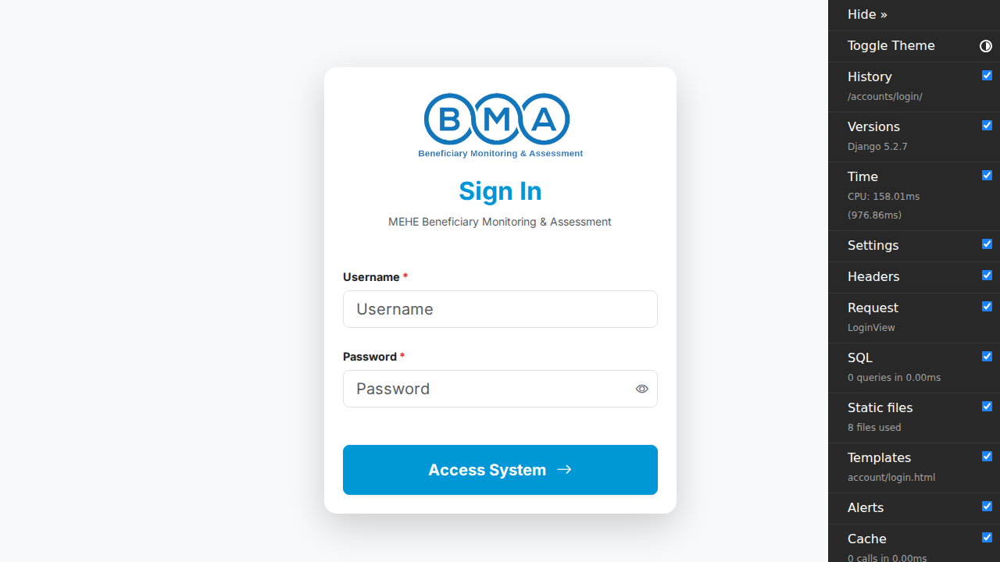
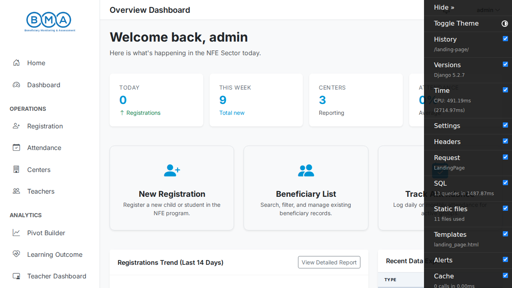
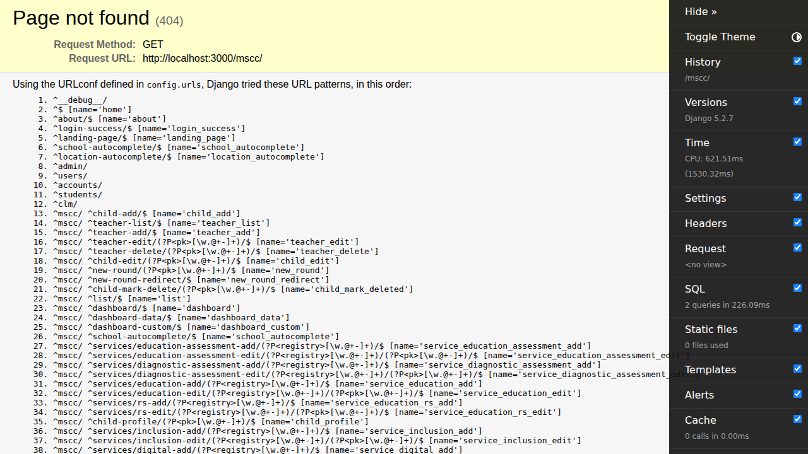
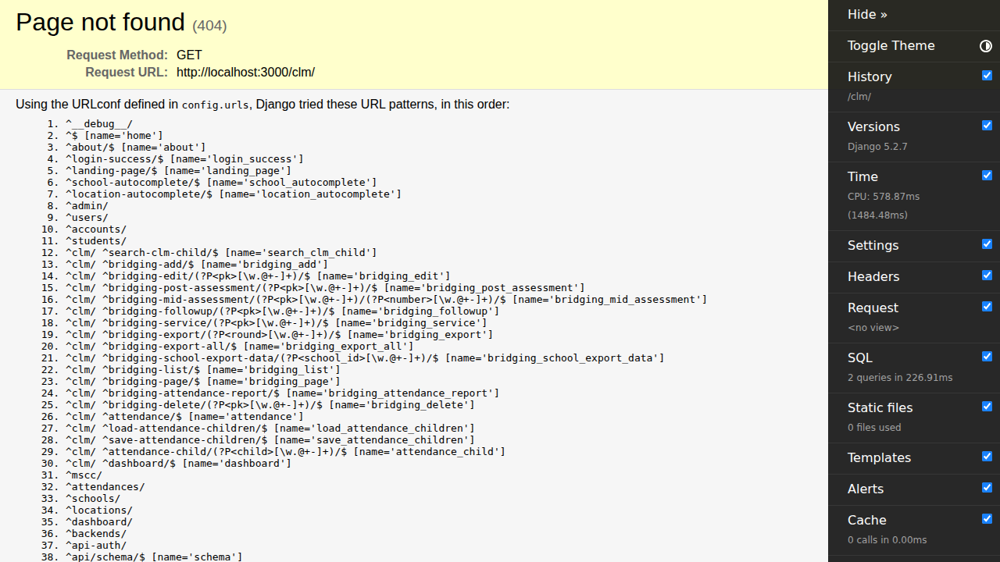
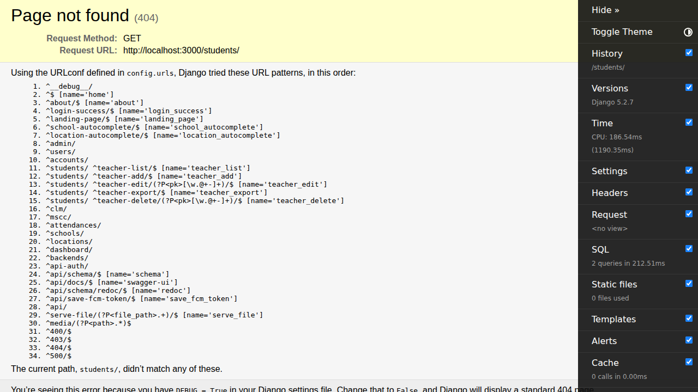
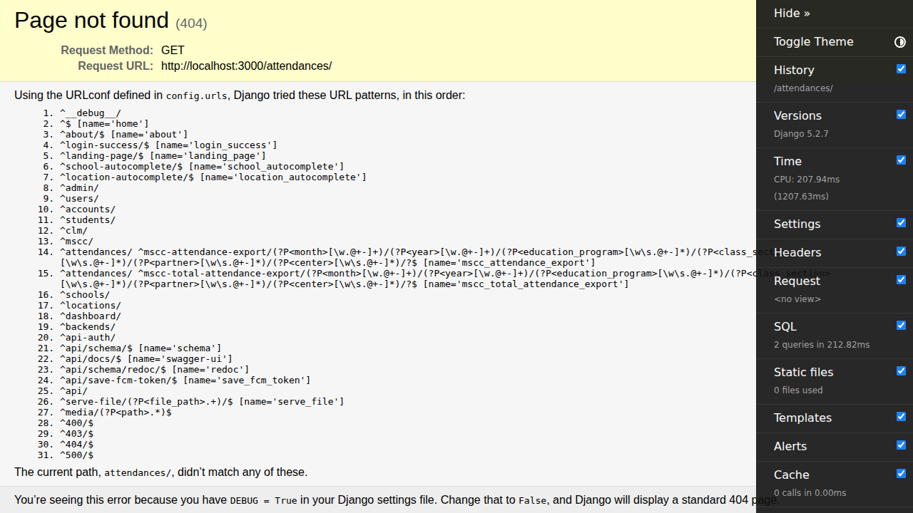

# User Guideline

Welcome to the Student Registration Compiler system! This document outlines step-by-step instructions on how to use the system, complete with screenshots to help you navigate through the main features.

## 1. Logging In

To access the system, you must first log in using your credentials.

1. Navigate to the login page.
2. Enter your username (or email address) in the `Username` field.
3. Enter your password in the `Password` field.
4. Click the `Log In` button.

## 2. Landing Page

After a successful login, you will be redirected to the landing page. Here, you can access the different modules of the system depending on your assigned role and permissions.

## 3. MSCC Module

The MSCC (Makani / Makani Plus) module allows you to manage registrations and related data.

1. Click on the `MSCC` link from the sidebar or the landing page.
2. You will see a list of registrations, where you can filter, add, or edit entries.

## 4. CLM Module

The CLM (Child Level Monitoring) module is used for tracking educational programs and attendances.

1. Navigate to the `CLM` section from the main menu.
2. Here, you can view the dashboard and access various sub-sections like CLM Registrations and Education Programs.

## 5. Students Management

To manage student records across the system:

1. Click on `Students` in the navigation menu.
2. You can view the list of students, search for specific individuals, and manage their profiles.

## 6. Attendances

To track and record student attendances:

1. Go to the `Attendances` section.
2. Select the relevant program and date to view or enter attendance records.

## Need Help?

If you encounter any issues or need further assistance, please contact your system administrator or refer to the detailed operational manuals available in the documentation repository.
